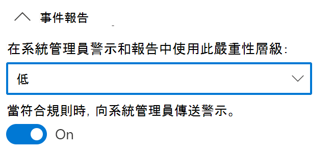
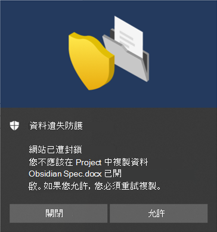

# 使用端點資料外洩防護

本文將逐步引導您建立及修改使用裝置作為位置的 DLP 原則的三種案例。

## DLP 設定

在您開始使用之前，您必須設定套用到所有裝置的 DLP 原則的 DLP 設定。 如果您想要建立可強制執行以下內容的原則，則您必須進行設定：

- 雲端輸出限制
- 不受允許的應用程式限制

或者

- 如果您想從監控中排除雜訊檔案路徑

  > [!div class="mx-imgBorder"]
  > 

### 檔案路徑排除

您可能想在裝置上從 DLP 監控、DLP 警示 和 DLP 策略執行中排除某些太吵雜或不包含您感興趣的檔案的路徑。 這些位置中的檔案不會被稽核，且在那些位置中所建立或修改的任何檔案，都不會受到 DLP 原則強制的制約。 您可以在 DLP 設定中設定路徑排除。

您可以使用此邏輯來建立排除路徑：

- 以 ' \’ 結尾的有效檔案路徑，也就是直接位於 [資料夾] 底下的檔案。  例如：C:\Temp\

- 以 ‘\*’ 結尾的有效檔案路徑，也就是除了直接位於 [資料夾] 底下的檔案外，只在 [子資料夾] 底下的檔案。  例如：C:\Temp\*

- 以 ' \’ 或 ‘\*’ 結尾的有效檔案路徑，也就是直接位於 [資料夾] 和 [子資料夾] 底下的所有檔案。  例如：C:\Temp

- 兩側間帶有 ’\’ 的萬用字元之路徑。  例如，C:\Users\*\Desktop\

- 兩側間帶有 ‘\’ 的萬用字元且以 ‘(數字)’ 提供精確數目的子資料夾的路徑。  例如： C:\Users\*（1） \Downloads\

- 含有 [系統] 內容變數的路徑。  例如：%SystemDrive%\Test\*

- 以上所列的混合。  例如：%SystemDrive%\Users\*\Documents\*(2)\Sub\

### 不受允許的應用程式

當一項原則的 **不受允許的應用程式和瀏覽器之存取** 設定已開啟，且使用者嘗試使用這些應用程式存取受保護的檔案時，系統可以允許、封鎖或在封鎖活動下，但使用者仍可以覆寫限制。 所有活動都會經過稽核，並可在活動瀏覽器中查看。

> [!IMPORTANT]
> 請不要包含可執行檔的路徑，只包含可執行檔名稱 (例如，.browser.exe)。

### 瀏覽器和網域限制
限制與您的原則匹配的敏感檔案不能與不受限制的雲端服務網域共用。

#### 服務網域

您可以控制受原則保護的敏感檔案是否可以從 Microsoft Edge 上載到特定的服務網域。

如果 [清單模式] 設為 **[封鎖]**，則使用者將無法將敏感性專案上傳到這些網域。 當由於專案符合 DLP 原則而封鎖上傳動作時，DLP 將會產生警告，或封鎖敏感性專案的上傳。

如果 [清單模式] 設為 **[允許]**，則使用者 ***_僅_** 能將敏感性項目上傳到那些網域，而不可將存取權上傳到其他網域。

#### 不受允許的瀏覽器

您新增的瀏覽器是由其可執行檔名稱所標識，這些瀏覽器將無法存取符合強制執行的 DLP 原則的檔案（其中的 [上傳到雲端服務限制] 已設定為 [封鎖] 或 [封鎖覆寫]）。 當這些瀏覽器被禁止存取檔案時，終端使用者會看到快顯通知，要求其透過 Edge Chromium 開啟檔案。

### 原則提示中的業務理由

您可以在 DLP 原則提示通知中控制使用者與業務理由選項的互動方式。 當使用者執行一項受到在 DLP 原則中設定的 **覆寫封鎖** 保護的活動時，即會出現此選項。 您可以從下列選擇其中一個選項：

- 根據預設，使用者可以選取內建的理由，或輸入自己的文字。
- 使用者僅能選取內建的理由。
- 使用者僅能自行輸入理由。

## 將 DLP 設定結合起來

使用端點 DLP 和 Edge Chromium 網頁瀏覽器，您可以對不受允許的雲端應用程式和服務限制不願共用敏感性專案。 Edge Chromium 瞭解，專案受端點 DLP 原則限制，並強制執行存取限制的狀況。

當您在正確設定的 DLP 原則和 [Edge] Chromium 瀏覽器中使用端點 DLP 做為位置時，您在這些設定中定義的不受允許的瀏覽器將無法存取符合您 DLP 原則控制項的敏感性專案。 相反地， 使用者會被重新導向，以使用 Edge Chromium 而 Edge Chromium 則根據其對 DLP 的強加限制之理解，可在 DLP 原則中的條件符合時封鎖或限制活動。

若要使用這項限制，您需要設定三個重要的部分：

1. 指定您想要防止敏感性專案被共用的位置 (服務、網域、IP 位址)。

2. 當 DLP 原則相符時，新增不允許存取特定敏感性專案的瀏覽器。

3. 設定 DLP 原則，透過開啟 **上傳至雲端服務** 和 **從不受允許的瀏覽器存取**，以定義敏感性專案上傳所應受限制的位置。

您可以繼續新增服務、應用程式和原則，以延伸並擴充您的限制，以符合您的業務需求並保護敏感性資料。 

這項設定可協助確保您的資料保持安全，同時也避免了防止或限制使用者存取及共用非敏感性專案的不必要限制。

## 端點 DLP 原則案例

為協助您熟悉端點 DLP 功能及其在 DLP 原則中的呈現方式，我們為您整理了一些可遵循的案例。

> [!IMPORTANT]
> 這些端點 DLP 案例非建立和調整 DLP 原則的正式程式。 當您需要在一般情況下使用 DLP 原則時，請參閱下列主題：
>- [資料外洩防護概觀](data-loss-prevention-policies.md)
>- [預設的 DLP 原則快速入門](get-started-with-the-default-dlp-policy.md)
>- [從範本建立 DLP 原則](create-a-dlp-policy-from-a-template.md)
>- [建立、測試及調整 DLP 原則](create-test-tune-dlp-policy.md)

### 案例1：從範本建立原則，僅限稽核

這些案例要求你已有上線裝置，並會向 [活動瀏覽器] 進行回報。 如果您還沒有上線裝置，請參閱 [開始使用端點資料外洩防護](endpoint-dlp-getting-started.md)。

1. 開啟 [[資料外洩防護] 頁面](https://compliance.microsoft.com/datalossprevention?viewid=policies)。

2. 選擇 **[建立原則]**。

3. 在此案例中，請選擇 **[隱私權]**，然後 **[美國個人識別資訊 (PII) 資料]**，並選擇 **[下一步]**。

4. 將 **[裝置]** 以外的所有位置的 **[狀態]** 欄位切換為 [關閉]。 選擇 **[下一步]**。

5. 接受預設 **[查看並自訂範本中的設定]** 選項，然後選擇 **[下一步]**。

6. 接受預設 **[保護動作]** 值，然後選擇 **[下一步]**。

7. 選取 **[稽核或限制 Windows 裝置上的活動]**，並將動作設定為 **[僅限稽核]**。 選擇 **[下一步]**。

8. 接受預設 **[我想先進行測試]** 值，然後選擇 **[在測試模式中顯示原則提示]**。 選擇 **[下一步]**。

9. 查看您的設定，然後選擇 **[提交]**。

10. 新的 DLP 原則會顯示在原則清單中。

11. 在活動瀏覽器中檢查受監控端點的資料。 設定裝置的位置篩選並新增原則，然後依策略名稱篩選，以查看此原則的影響。 如有需要，請參閱 [啟動活動資源管理器](data-classification-activity-explorer.md)。

12. 嘗試與組織外部人員共用包含會觸發美國個人識別資訊（PII）資料條件之測試。 這應該會觸發該原則。

13. 查看活動的活動瀏覽器。

### 案例2：修改現有原則、設定通知

1. 開啟 [[資料外洩防護] 頁面](https://compliance.microsoft.com/datalossprevention?viewid=policies)。

2. 選擇您在案例 1 中建立的 **[美國個人識別資訊 (PII) 資料]** 原則。

3. 選擇 **[編輯原則]**。

4. 移至 **[進階 DLP 規則]** 頁面，然後編輯 **[偵測到少量的美國個人識別資訊內容]**。

5. 向下移至 **[事件報告]** 區段，並設定 **[當規則符合時，傳送警示給系統管理員]** 為 **[開啟]**。 電子郵件警示將會自動傳送給系統管理員，以及您新增至收件者清單中的任何人。 

   > [!div class="mx-imgBorder"]
   > 
   
6. 在此情況下，請選擇 **每次當活動符合規則時，傳送警示**。

7. 選擇 **[儲存]**。

8. 透過選擇 **[下一步]**，然後 **[提交]** 原則變更，以保留您先前的所有設定。

9. 嘗試與組織外部人員共用包含會觸發美國個人識別資訊（PII）資料條件之測試。 這應該會觸發該原則。

10. 查看活動的活動瀏覽器。

### 案例3：修改現有原則、封鎖 [允許覆寫] 動作

1. 開啟 [[資料外洩防護] 頁面](https://compliance.microsoft.com/datalossprevention?viewid=policies)。

2. 選擇您在案例 1 中建立的 **[美國個人識別資訊 (PII) 資料]** 原則。

3. 選擇 **[編輯原則]**。

4. 移至 **[進階 DLP 規則]** 頁面，然後編輯 **[偵測到少量的美國個人識別資訊內容]**。

5. 向下移至 **[稽核或限制 Windows 裝置上的活動]** 區段，並針對每個活動設定對應的動作為 **[透過覆寫進行封鎖]**。

   > [!div class="mx-imgBorder"]
   > ![設定[透過複寫進行封鎖]動作](../media/endpoint-dlp-6-using-dlp-set-blocked-with-override.png)
   
6. 選擇 **[儲存]**。

7. 針對 **偵測到大量美國個人識別資訊** 時，重複執行步驟4-7。

8. 透過選擇 **[下一步]**，然後 **[提交]** 原則變更，以保留您先前的所有設定。

9. 嘗試與組織外部人員共用包含會觸發美國個人識別資訊（PII）資料條件之測試。 這應該會觸發該原則。

   在用戶端裝置上，您會看到像這樣的彈出提示：

   > [!div class="mx-imgBorder"]
   > 

10. 查看活動的活動瀏覽器。

## 另請參閱

- [深入了解端點資料外洩防護](endpoint-dlp-learn-about.md)
- [開始使用端點資料外洩防護](endpoint-dlp-getting-started.md)
- [資料外洩防護概觀](data-loss-prevention-policies.md)
- [建立、測試及調整 DLP 原則](create-test-tune-dlp-policy.md)
- [開始使用活動總管](data-classification-activity-explorer.md)
- [適用於端點的 Microsoft Defender](https://docs.microsoft.com/windows/security/threat-protection/)
- [Windows 10 電腦上線的工具及方法 ](https://docs.microsoft.com/windows/security/threat-protection/microsoft-defender-atp/configure-endpoints)。
- [Microsoft 365 訂閱](https://www.microsoft.com/microsoft-365/compare-microsoft-365-enterprise-plans?rtc=1)
- [已加入 Azure Active Directory (AAD)](https://docs.microsoft.com/azure/active-directory/devices/concept-azure-ad-join)
- [下載以 Chromium 為基礎的新 Microsoft Edge](https://support.microsoft.com/help/4501095/download-the-new-microsoft-edge-based-on-chromium)。
- [預設的 DLP 原則快速入門](get-started-with-the-default-dlp-policy.md)
- [從範本建立 DLP 原則](create-a-dlp-policy-from-a-template.md)
