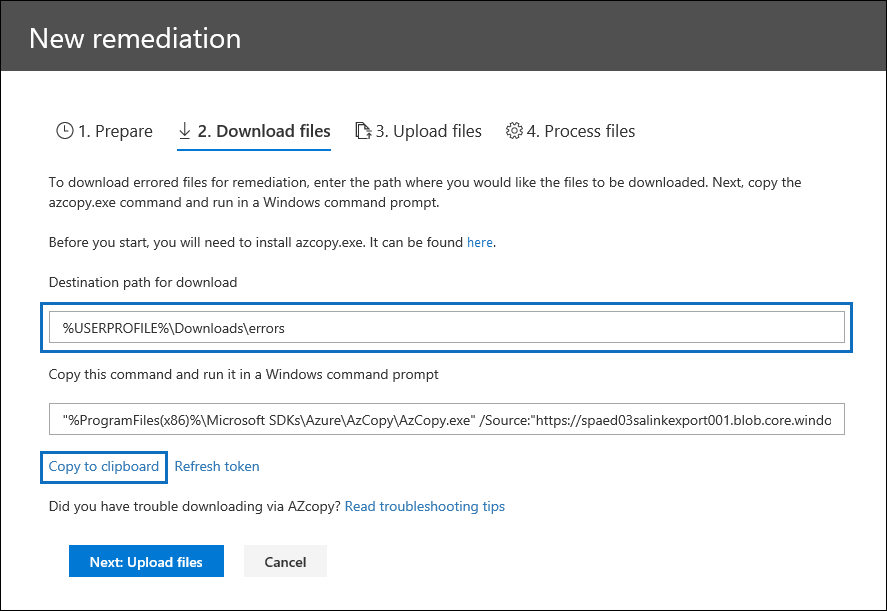

# 處理資料時的錯誤補救

錯誤修正功能可讓 eDiscovery 管理員修正資料問題，使 Advanced eDiscovery 無法正確地處理內容。 例如，因為檔案遭到鎖定或加密，所以無法處理受密碼保護的檔案。 使用錯誤修正，eDiscovery 管理員可以下載具有這類錯誤的檔案、移除密碼保護，然後上傳補救的檔案。

使用下列工作流程修正 Advanced eDiscovery 案例中發生錯誤的檔案。

## 建立錯誤修正會話，以修正具有處理錯誤的檔案

>[!NOTE]
>如果在下列程式中隨時關閉錯誤修正嚮導，您可以從 [處理] 索引標籤中選取 [ **Remediations** **]，以** 回到 [**處理**] 索引標籤中的 [錯誤修正] 會話。

1. 在 Advanced eDiscovery 案例中的 [**處理**] 索引標籤上，選取 [**視圖**] 下拉式功能表中的 [**錯誤**]，然後選取 [**範圍**] 下拉式功能表中的審閱集或整個案例。 此區段會顯示案例的所有錯誤或特定檢閱集的錯誤。

   

2. 按一下 [錯誤類型] 或 [檔案類型] 旁邊的選項按鈕，以選取您要修正的錯誤。  在下列範例中，我們正在修正受密碼保護的檔案。

3. 按一下 [ **新增錯誤修正**]。

    錯誤修正工作流程會從準備階段開始，其中有錯誤的檔案會複製到 Microsoft 提供的 Azure 儲存體位置，這樣您就可以將這些檔案下載到您的本機電腦以進行修正。

    

4. 準備完成後，請按 **[下一步：下載檔案]** 以繼續下載。

    

5. 若要下載檔案，請指定 **[下載的目的地路徑]**。 此路徑是本機電腦上即將下載檔案的父資料夾。  預設路徑%USERPROFILE%\Downloads\errors，指向登入使用者的 [下載] 資料夾。 您可以視需要變更此路徑。 如果您進行變更，建議您使用本機檔路徑，以取得最佳效能。 請勿使用遠端網路路徑。 例如，您可以使用路徑 **C:\Remediation**。 

   父資料夾的路徑會自動新增至 AzCopy 命令 (以) 的 **/Dest** 參數的值。

6. 按一下 **[複製到剪貼簿]**，複製已預先定義的命令。 開啟 Windows 命令提示字元，貼上 AzCopy 命令，然後按 **enter** 鍵。  

        

    > [!NOTE]
    > 您必須使用 AzCopy app-v 8.1 才能成功使用 **下載** 檔案頁面上提供的命令。 您也必須使用 AzCopy app-v 8.1 上傳步驟10中的檔案。 若要安裝此 AzCopy 版本，請參閱[Windows 上的轉接 AzCopy 中的資料](/previous-versions/azure/storage/storage-use-azcopy)。 如果提供的 AzCopy 命令失敗，請參閱[Advanced eDiscovery 中 AzCopy 疑難排解](troubleshooting-azcopy.md)。

    您選取的檔案會下載到步驟 5 中指定的位置。 在父資料夾中 (例如，**C:\Remediation**)，會自動建立下列子資料夾結構：

    `<Parent folder>\Subfolder 1\Subfolder 2\<file>`

    - *子資料夾 1* 會根據您在步驟 1 中選取的範圍，以案例或檢閱集的識別碼來命名。

    - *子資料夾 2* 使用已下載檔案的檔案識別碼來命名

    - 已下載檔案位於 *子資料夾 2* 中，而且也會以檔案識別碼來命名。

    以下是將專案下載至 **C:\Remediation** 父系資料夾時所建立的資料夾路徑和錯誤檔案名範例：

    `C:\Remediation\232f8b7e-089c-4781-88c6-210da0615d32\d1459499146268a096ea20202cd029857d64087706e6d6ca2a224970ae3b8938\d1459499146268a096ea20202cd029857d64087706e6d6ca2a224970ae3b8938.docx`

    如果下載多個檔案，則每個檔案都會下載到以檔識別碼命名的子資料夾中。

    > [!IMPORTANT]
    > 當您在步驟9和步驟10中上傳檔案時，修正的檔案必須具有相同的檔案名，而且必須位於相同的子資料夾結構中。 子資料夾和檔案名用於關聯修正的檔案與原始錯誤檔案。 如果資料夾結構或檔案名已變更，您會收到下列錯誤： `Cannot apply Error Remediation to the current Workingset` 。 為了避免發生任何問題，我們建議您將修正的檔案保持在相同的父資料夾及子資料夾結構。

7. 下載檔案之後，您可以使用適當的工具加以修復。 對於密碼保護的檔案，您可以使用數種密碼破譯工具。 如果您知道檔案的密碼，您可以開啟檔案並移除密碼保護。

8. 回到 Advanced eDiscovery 和錯誤修正嚮導，然後按一下 **[下一步： Upload** 檔案]。  這會移至下一個頁面，您可以在此上傳檔案。

    

9. 指定補救檔案所在的父資料夾，位於 **[檔案位置的路徑]** 文字方塊。 同樣地，上層資料夾必須具有下載檔案時所建立的相同子資料夾結構。

    父資料夾的路徑會自動新增至 AzCopy 命令 (以) 的 **/source** 參數的值。

10. 按一下 **[複製到剪貼簿]**，複製已預先定義的命令。 開啟 Windows 命令提示字元，貼上 AzCopy 命令，然後按 **enter** 鍵。 上傳檔案。

    

11. 在您執行 AzCopy 命令之後，請按 **[下一步：處理檔案]**。

    處理完成時，您可以移至 [複查] 設定並查看修正的檔案。 

## 在容器檔案中修正錯誤

在無法透過 Advanced eDiscovery 提取容器檔案的內容時 (例如 .zip 檔) 時，可下載容器，並將內容擴充至原始容器所在的相同資料夾中。 展開的檔案會依 Advanced eDiscovery 最初展開的父容器的方式。 程式的運作方式如上述所述，除了將單一檔案上傳為取代檔案之外。  當您上傳修正的檔案時，請勿包含原始的容器檔案。

## 上傳解壓縮的文字修正錯誤

有時候，無法將檔案修正為 Advanced eDiscovery 可以轉譯的原生格式。 不過，您可以在稱為 [ *文字覆蓋* ] 的程式中，以包含原始檔案 (原始文字的文字檔取代原始檔案) 。 若要這麼做，請遵循本文所述的步驟，但不是以原生格式修正原始檔案，您可以建立文字檔，其中包含原始檔案中的解壓縮文字，然後使用以 .txt 尾碼附加的原始檔案名上傳文字檔。 例如，您可以使用檔案名335850cc-6602-4af0-acfa-1d14d9128ca2，在修正糾錯期間下載檔案。 您可以在原生應用程式中開啟檔案、複製文字，然後將它貼到名為 335850cc-6602-4af0-acfa-1d14d9128ca2.abc.txt 的新檔案中。 當您執行此動作時，請務必先在本機電腦上從已修復的檔案位置移除原始檔案，然後再將修正的文字檔上傳至 Advanced eDiscovery。

## 修正檔案時會發生什麼情況

在上傳補救的檔案時，除了下欄欄位之外，仍會保留原始的中繼資料： 

- ExtractedTextSize
- HasText
- IsErrorRemediate
- LoadId
- ProcessingErrorMessage
- ProcessingStatus
- 文字
- WordCount
- WorkingsetId

如需 Advanced eDiscovery 中所有元資料欄位的定義，請參閱[檔元資料欄位](document-metadata-fields-in-advanced-ediscovery.md)。