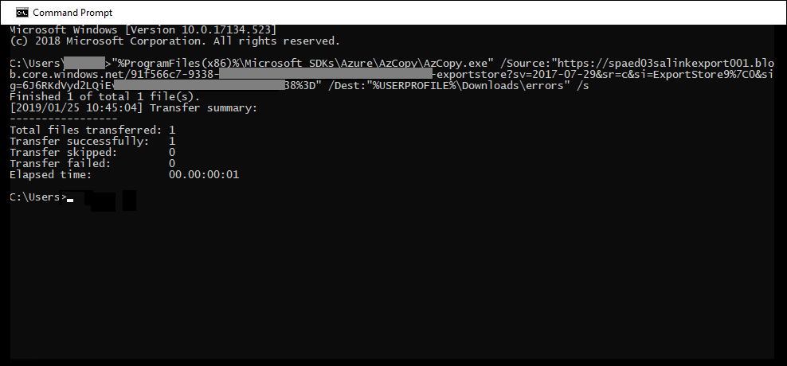

# 處理調查的資料時的錯誤修正

錯誤修正功能可讓調查人員修正資料問題，以防止資料調查（預覽）正確地處理內容。 例如，因為檔案遭到鎖定或加密，所以無法處理受密碼保護的檔案。 使用錯誤修正，調查人員可以下載具有這類錯誤的檔案、移除密碼保護，並上傳補救的檔案。

使用下列工作流程修正資料調查（預覽）案例中發生錯誤的檔案。

## 建立錯誤修正會話，以修正具有處理錯誤的檔案

>[!NOTE]
>如果在下列程式中隨時關閉錯誤修正嚮導，您可以在 [ **View** ] 下拉式功能表中選取 [**錯誤 remediations** ]，從 [**處理**] 索引標籤回到錯誤修正會話。

1. 在 [資料調查] 中的 [**處理**] 索引標籤上，于 [ **View** ] 下拉式功能表中選取 [**錯誤**]。

2. 按一下 [錯誤類型] 或 [檔案類型] 旁邊的選項按鈕，以選取您要修正的錯誤。  在下列範例中，我們正在修正受密碼保護的檔案。

3. 按一下 [ **+ 新增錯誤修正**]。

    

    「錯誤修正」會話開始，從準備階段開始，其中含有錯誤的檔案會複製到安全的 Azure 位置，以供下載。

    

4. 準備完成後，請按 **[下一步：下載檔案]** 以繼續下載。

    

5. 若要下載檔案，請指定要**下載的目的地路徑**。 這是您的本機電腦上應下載檔案的路徑。  預設路徑%USERPROFILE%\Downloads\errors，指向登入使用者的 [下載] 資料夾;這可以視需要變更。

    >[!NOTE]
    >建議您使用本機檔路徑取代遠端網路路徑，以取得最佳效能。

    > [!NOTE]
    > 若尚未安裝 AzCopy，您可以從下列位置進行安裝：https://docs.microsoft.com/azure/storage/common/storage-use-azcopy

6. 按一下 [**複製到剪貼**簿]，複製預先定義的命令。 啟動 windows 命令提示字元，貼上命令，然後按**enter**鍵。  

    將會下載檔案。

    

    > [!NOTE]
    > 如果您在執行此命令時有問題，請參閱[Advanced eDiscovery 中的疑難排解 AzCopy](troubleshooting-azcopy.md)。

7. 下載檔案之後，您可以使用適當的工具加以修復。 針對受密碼保護的檔案，您可以使用數種密碼破譯工具。 如果您知道檔案的密碼，您可以開啟檔案並移除密碼保護。
    
   > [!NOTE]
    > 您必須保留已修正檔案的目錄結構及檔案名，這一點很重要。 已下載的檔案和資料夾的路徑名稱，可讓修正的檔案與原始檔案產生關聯。  如果目錄結構或檔案名已變更，您會收到下列錯誤： `Cannot apply Error Remediation to the current Evidenceset`。

8. 現在，回到 [資料調查（預覽）]，然後按 **[下一步：上傳檔案]**。  這會移至下一個您現在可以上傳檔案的步驟。

    

9. 在 [檔案**位置**] 文字方塊中指定已修正檔案的位置，然後按一下 [**複製到剪貼**簿]。

10. 將命令貼到 Windows 命令提示字元，然後按**enter**上傳檔案。

    

11. 最後，回到 [資料調查（預覽）]，然後按 **[下一步：處理檔案]**。

12. 處理完成時。  您可以回到工作集，並查看修正的檔案。

## 修正檔案時會發生什麼情況

在上傳補救的檔案時，除了下欄欄位之外，仍會保留原始的中繼資料： 

- ExtractedTextSize
- HasText
- IsErrorRemediate
- LoadId
- ProcessingErrorMessage
- ProcessingStatus
- 文字
- WordCount
- WorkingsetId

如需資料調查（預覽）中所有檔元資料欄位的定義，請參閱[檔元資料欄位](document-metadata-fields.md)。
