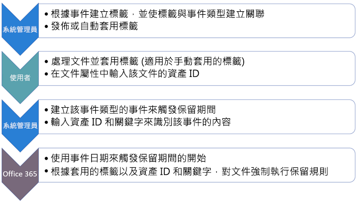
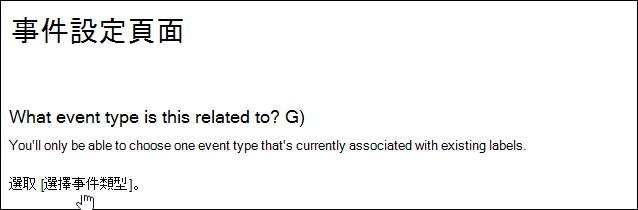
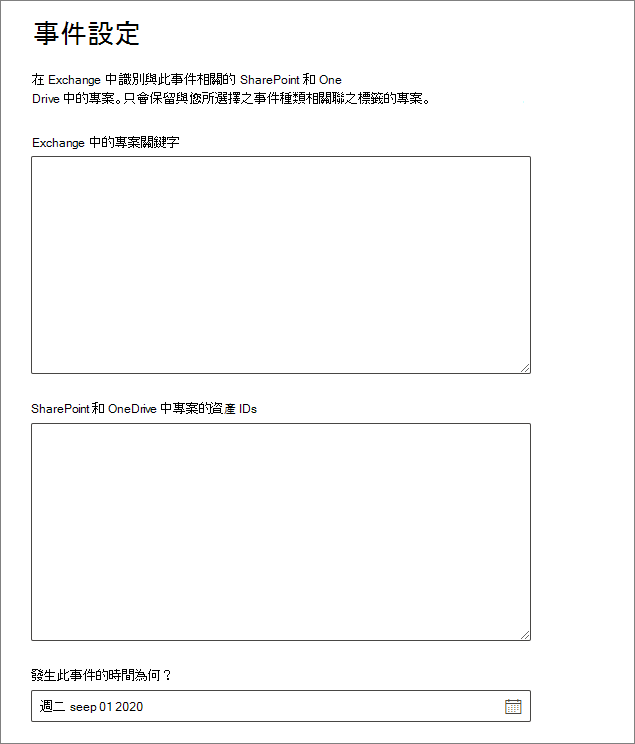

# <a name="start-retention-when-an-event-occurs"></a>事件發生時，開始保留

>*[Microsoft 365 安全性與合規性的授權指引](https://aka.ms/ComplianceSD)。*

當您保留內容時，保留期間通常是依據內容的存留期。例如，您在文件建立之後保留 7 年，然後刪除。但當您設定[保留標籤](labels.md)，您也可以讓發生特定類型事件的時間作為保留期間的依據。事件會觸發啟動保留期間，有保留標籤套用至該類型事件的所有內容，都會強制執行標籤的保留動作。
  
使用事件導向保留的範例：
  
- **員工離開組織** 假設員工記錄必須從員工離開組織起保留 10 年。 經過 10 年之後，所有與該名員工相關的雇用、績效和離職文件都必須加以處置。 會觸發 10 年保留期間的事件是員工離開組織。 
    
- **合約到期** 假設與合約相關的所有記錄必須從合約到期時間起保留五年。 會觸發五年保留期間的事件是合約到期。 
    
- **產品生命週期**貴組織可能有與產品最後製造日期相關的保留需求，例如技術規格。在此情況下，最後製造日期是觸發保留期間的事件。 
    
事件導向保留通常作為記錄管理處理程序的一部分。這表示：
  
- 根據事件的標籤通常也會將內容分類為記錄。 如需詳細資訊，請參閱[了解記錄](records.md)。

- 已分類為記錄但是其事件觸發程序尚未發生的文件，會無限期保留 (記錄無法永久刪除)，直到事件觸發該文件的保留期間。
    
- 根據事件的保留標籤通常會在保留期間結束時觸發處置檢閱，這樣記錄管理員就能手動檢閱並處置內容。 如需詳細資訊，請參閱[處置內容](disposition.md)。
    

根據事件的標籤與 Microsoft 365 中任何保留標籤具有相同的功能。 如需詳細資訊，請參閱[[瞭解保留原則及保留標籤]](retention.md)。

## <a name="understanding-the-relationship-between-event-types-labels-events-and-asset-ids"></a>了解事件類型、標籤、事件和資產識別碼之間的關聯性

若要成功使用事件導向保留，請務必了解事件類型、保留標籤、事件和資產識別碼之間的關聯性，如下列圖表所示且圖表後有說明。 
  

  

  
1. 您為各種類型的內容建立保留標籤，然後將其與某種事件類型建立關聯。 例如，不同類型產品檔案和記錄的保留標籤會與名為「產品生命週期」的事件類型相關聯，因為這些記錄必須從產品達到其生命週期結束開始保留 10 年。
    
2. 使用者 (通常是記錄管理員) 會將這些保留標籤套用到內容，並且 (若是 SharePoint 和 OneDrive 文件) 為每個項目輸入資產識別碼。 在此範例中，資產識別碼是組織所使用的產品名稱或代碼。 因此，每個產品的記錄都會獲派一個保留標籤，而每筆記錄都會有包含資產識別碼的屬性。 此圖表描繪組織中所有產品記錄的**所有內容**，而每個項目都會承載記錄所屬產品的資產識別碼。 
    
3. 產品生命週期是事件類型；達到生命週期結尾的特定產品是事件。該事件類型的事件發生時 - 在此情況下，當產品達到其生命週期結尾時 - 您建立事件，指定：
    
   - 資產識別碼 (適用於 SharePoint 和 OneDrive 文件)
    
   - 關鍵字 (適用於 Exchange 項目)。在此範例中，組織在包含產品記錄的訊息中使用產品代碼，因此 Exchange 項目的關鍵字與 SharePoint 和 OneDrive 文件中的資產識別碼相同。
    
   - 發生事件的日期。此日期作為保留期間的開始日期。此日期可能是目前、過去或未來的日期。

4. 建立事件之後，該事件日期會同步處理到保留標籤屬於該事件類型的所有內容，以及包含指定資產識別碼或關鍵字的所有內容。 如同任何保留標籤，同步處理最多可能需要七天。 上圖中以紅色圈出的所有項目，其保留期間都是由此事件觸發。 換句話說，當這項產品的生命週期結束時，該事件會觸發該產品記錄的保留期間。

請務必了解，如果您沒有為事件指定資產識別碼或關鍵字，具有該事件類型之標籤的**所有內容**都將有其被事件觸發的保留期間。 這表示在上圖中，所有內容都會開始進行保留。 這可能不是您原本的打算。 

最後，請記住，每個保留標籤都有自己的保留設定。 在此範例中，全都指定 10 年，但有可能事件觸發的保留標籤是每個標籤都有不同的保留期間。
  
## <a name="how-to-set-up-event-driven-retention"></a>如何設定事件導向保留

事件導向保留的整體工作流程：
  

  
> [!TIP]
> 請參閱 [使用保留標籤來管理儲存在 SharePoint 中的文件生命週期](auto-apply-retention-labels-scenario.md)，以瞭解如何在 SharePoint 中使用管理屬性以自動套用保留標籤及實施事件導向保留。

### <a name="step-1-create-a-label-whose-retention-period-is-based-on-an-event"></a>步驟 1：建立其保留期間根據事件的標籤

若要建立及設定您的保留標籤，請使用[建立及設定保留標籤](create-retention-labels.md#create-and-configure-retention-labels)的相關指示，並在開啟保留時，選擇根據事件保留或刪除內容的選項。 此設定表示當您在 [事件]**** 頁面上建立事件時，保留設定在步驟 5 之前都不會生效。 
  
事件導向的保留通常是用於分類為記錄的內容，因此很適合用來檢查您是否也需要選取將內容標示為記錄的選項。
  
事件導向保留需要保留設定：
  
- 保留內容。
    
- 自動刪除內容或在保留期間結束時觸發處置檢閱。
    


### <a name="step-2-choose-an-event-type-for-that-label"></a>步驟 2：選擇該標籤的事件類型

在標籤設定中，在您選擇讓標籤根據 **[事件]** 的選項後，您會看見 **[選擇事件類型]** 的選項。 事件類型只是您要讓標籤與事件建立關聯之事件的一般描述。
  
例如，如果您建立名為「產品生命週期」的事件類型，您會建立事件型保留標籤，具有名稱說明您想要將標籤套用到什麼類型的內容，例如「產品開發檔案」或「產品業務決策記錄」。

選取其中一個內建的事件類型，或建立您自己的事件類型，然後選取它。

在您選擇事件類型並儲存保留標籤之後，就無法變更事件類型。
  

  
### <a name="step-3-publish-or-auto-apply-the-event-based-retention-labels"></a>步驟 3：發佈或自動套用事件型保留標籤

和任何保留標籤一樣，您必須發佈或自動套用事件型標籤，以使標籤可以手動或自動套用到內容中：
- [建立保留標籤，並在應用程式中使用這些標籤](create-apply-retention-labels.md)
- [自動將保留標籤套用到內容](apply-retention-labels-automatically.md)


> [!NOTE]
> 如果您是從 [記錄管理] ****  >  [檔案方案]**** 索引標籤或 [資料控管]****  >  [標籤]**** 索引標籤選取事件型保留標籤，則 [自動套用標籤]**** 按鈕無法使用。
> 
> 請勿使用這個按鈕，改用下列其中一個位置中，標籤或原則清單上的 [自動套用標籤]**** 選項：
> - [記錄管理]****  >  [標籤原則]**** 索引標籤
> - **[資料控管]** > **[標籤]** 索引標籤或 **[標籤原則]** 索引標籤


### <a name="step-4-enter-an-asset-id"></a>步驟 4：輸入資產識別碼

在事件型標籤套用到內容之後，您可以輸入每個項目的資產識別碼。 例如，貴組織可能使用：
  
- 產品代碼，您可以用來保留僅限特定產品的內容。
    
- 專案代碼，您可以用來保留僅限特定專案的內容。
    
- 員工識別碼，您可以用來保留僅限特定人員的內容。
    
資產識別碼只是 SharePoint 和 OneDrive 中可用的另一個文件屬性。 貴組織可能已經使用其他文件屬性和識別碼來分類內容。 若是如此，您也可以在建立事件時使用這些屬性和值，請參閱後續的步驟 6。 重點是，您必須在文件屬性中使用一些 *property:value* 組合，以將該項目與事件類型建立關聯。
  

  
### <a name="step-5-create-an-event"></a>步驟 5：建立事件

發生該事件類型的特定執行個體時，例如，產品達到其生命週期的結尾，請移至 Microsoft 365 合規性中心的 [記錄管理]****  >  [事件]**** 頁面，並建立事件。 您可以建立事件來觸發事件。
  
### <a name="step-6-choose-the-same-event-type-used-by-the-label-in-step-2"></a>步驟 6：選擇與步驟 2 中的標籤所使用相同的事件類型

當您建立事件時，請選擇步驟 2 中保留標籤所使用的相同事件類型，例如「產品生命週期」。 只有已套用該事件類型保留標籤的內容會觸發其保留期間。
  

  
### <a name="step-7-enter-keywords-or-an-asset-id"></a>步驟 7：輸入關鍵字或資產識別碼

現在您可以指定 SharePoint 和 OneDrive 內容的資產識別碼或 Exchange 內容的關鍵字，藉此縮小內容的範圍。 針對資產識別碼，只有在具有指定 *property:value* 組的內容上才會強制執行保留。 若未輸入資產識別碼，具有該事件類型之標籤的所有內容都會套用相同的保留日期。

例如：如果您使用的是 [資產識別碼] 屬性，請在以下顯示的資產識別碼方塊中輸入 `ComplianceAssetID:<value>`。
  
組織可能已將其他屬性和識別碼套用到與此事件類型相關的文件。 例如，如果您需要偵測特定產品的記錄，識別碼可能會是您的自訂屬性 ProductID 和值 "XYZ"。 在此情況下，您會在下圖所示的資產識別碼方塊中輸入 `ProductID:XYZ`。
  
若為 Exchange 項目，請使用關鍵字。 您可以使用 AND、OR 和 NOT 這類搜尋運算子來使用查詢。 如需詳細資訊，請參閱[內容搜尋的關鍵字查詢和搜尋條件](keyword-queries-and-search-conditions.md)。
  
最後，選擇事件的發生日期；此日期作為保留期間的開始日期。 建立事件之後，該事件日期會同步處理到保留標籤屬於該事件類型、具有資產識別碼和關鍵字的所有內容。 如同任何保留標籤，同步處理最多可能需要七天。
  


建立事件之後，保留設定就會對已套用標籤和已編製索引的內容生效。 如果在建立事件之後，將保留標籤新增至新內容，則您必須使用相同的詳細資料建立新事件。

刪除事件不會取消目前對已套用標籤之內容生效的保留設定。 若要這麼做，請建立具有相同詳細資料的新事件，但將日期保留空白。 

## <a name="use-content-search-to-find-all-content-with-a-specific-label-or-asset-id"></a>使用內容搜尋來尋找具有特定標籤或資產識別碼的所有內容

將保留標籤指派給內容之後，您可以使用內容搜尋，尋找以特定保留標籤分類或包含特定資產識別碼的所有內容：
  
- 若要尋找具有特定保留標籤的所有內容時，請選擇 **[保留標籤]** 條件，然後輸入完整標籤名稱或，或輸入部分標籤名稱並使用萬用字元。 
    
- 若要尋找具有特定資產識別碼的所有內容，請使用格式 `ComplianceAssetID:<value>` 輸入 **ComplianceAssetID** 屬性和值。 
    
如需詳細資訊，請參閱[內容搜尋的關鍵字查詢和搜尋條件](keyword-queries-and-search-conditions.md)。
  
## <a name="permissions"></a>權限

若要取得 [事件]**** 頁面的存取權，檢閱者必須是具有**處置管理**角色和**僅限檢視稽核記錄**角色之角色群組的成員。我們建議建立稱為「處置檢閱者」的新角色群組，將這兩個角色新增至該角色群組，然後將成員新增至角色群組。 
  
如需詳細資訊，請參閱[授與使用者存取 Office 365 安全性與合規性中心的權限](../security/office-365-security/grant-access-to-the-security-and-compliance-center.md)。
  
## <a name="automate-events-by-using-powershell"></a>使用 PowerShell 讓事件自動化

您可以使用 PowerShell 指令碼來自動化商務應用程式中以事件為基礎的保留。 適用於事件型保留的 PowerShell Cmdlet：
  
- [Get-ComplianceRetentionEventType](https://go.microsoft.com/fwlink/?linkid=873002)
    
- [New-ComplianceRetentionEventType](https://go.microsoft.com/fwlink/?linkid=873004)
    
- [Remove-ComplianceRetentionEventType](https://go.microsoft.com/fwlink/?linkid=873005)
    
- [Set-ComplianceRetentionEventType](https://go.microsoft.com/fwlink/?linkid=873006)
    
- [Get-ComplianceRetentionEvent](https://go.microsoft.com/fwlink/?linkid=873001)
    
- [New-ComplianceRetentionEvent](https://go.microsoft.com/fwlink/?linkid=873003)
    

## <a name="automate-events-by-using-a-rest-api"></a>使用 REST API 讓事件自動化

您可以使用 REST API 自動建立觸發保留時間開始的事件。

REST API 是支援 HTTP 操作組 (方法) 的服務端點，提供服務資源的建立、擷取、更新、刪除等存取權。 如需詳細資訊，請參閱 [REST API 要求/回應的元件](https://docs.microsoft.com/rest/api/gettingstarted/#components-of-a-rest-api-requestresponse)。 透過使用 Microsoft 365 REST API，使用 POST 和 GET 方法可以建立和擷取事件。

有兩個選項可以使用 REST API：

- **Microsoft Power Automate 或類似的應用程式**可以用於自動觸發事件的發生。 Microsoft Power Automate 是連線到其他系統的協調器，因此您不需要撰寫自訂解決方案。 如需詳細資訊，請參閱 [Power Automate 網站](https://flow.microsoft.com/zh-TW/)。

- **PowerShell 或 HTTP 用戶端呼叫 REST API** 以透過 PowerShell （版本6或更新版本）建立事件，這是自訂解決方案的一部分。

在您使用 REST API 之前，請先確認用於保留事件呼叫的 URL。 若要這麼做，請使用 REST API URL 執行 [獲取] 保留事件呼叫:

```console
https://ps.compliance.protection.outlook.com/psws/service.svc/ComplianceRetentionEvent
```

檢查回應碼。 如果是302，請從回應標題的地址屬性取得重新導向的 URL，並使用該 URL，而非後續指示中的 `https://ps.compliance.protection.outlook.com/psws/service.svc/ComplianceRetentionEvent`。

自動建立的事件可以在 Microsoft 365 合規性中心裡透過查看以進行確認 > **記錄管理** >  **事件**。

### <a name="use-microsoft-power-automate-to-create-the-event"></a>使用 Microsoft Power Automate 建立活動

建立使用 Microsoft 365 REST API 建立事件的流程:


#### <a name="create-an-event"></a>建立事件

呼叫 REST API 的範例程式碼：

- **方法**：POST
- **URL**：`https://ps.compliance.protection.outlook.com/psws/service.svc/ComplianceRetentionEvent`
- **標頭**：Key = Content-Type, Value = application/atom+xml
- **本文**：
    
    ```xml
    <?xml version='1.0' encoding='utf-8' standalone='yes'?>
    
    <entry xmlns:d='http://schemas.microsoft.com/ado/2007/08/dataservices'
    
    xmlns:m='http://schemas.microsoft.com/ado/2007/08/dataservices/metadata'
    
    xmlns='http://www.w3.org/2005/Atom'>
    
    <category scheme='http://schemas.microsoft.com/ado/2007/08/dataservices/scheme' term='Exchange.ComplianceRetentionEvent' />
    
    <updated>9/9/2017 10:50:00 PM</updated>
    
    <content type='application/xml'>
    
    <m:properties>
    
    <d:Name>Employee Termination </d:Name>
    
    <d:EventType>99e0ae64-a4b8-40bb-82ed-645895610f56</d:EventType>
    
    <d:SharePointAssetIdQuery>1234</d:SharePointAssetIdQuery>
    
    <d:EventDateTime>2018-12-01T00:00:00Z </d:EventDateTime>
    
    </m:properties>
    
    </content>
    
    </entry>
    ```
    
- **驗證**：基本
- **使用者名稱**："Complianceuser"
- **密碼**："Compliancepassword"


##### <a name="available-parameters"></a>可用的參數


|參數|描述|附註|
|--- |--- |--- |
|<d:Name></d:Name>|提供事件的唯一名稱，|結尾不可包含空格或下列字元：% * \ & < \> \| # ? , : ;|
|<d:EventType></d:EventType>|輸入事件類型名稱 (或 Guid)|範例：「員工離職」。 事件類型必須與保留標籤相關聯。|
|<d:SharePointAssetIdQuery></d:SharePointAssetIdQuery>|輸入「ComplianceAssetId：」 + 「員工識別碼」|範例："ComplianceAssetId:12345"|
|<d:EventDateTime></d:EventDateTime>|事件的日期和時間|格式：yyyy-MM-ddTHH:mm:ssZ，例如：2018-12-01T00:00:00Z
|

###### <a name="response-codes"></a>回應碼

| 回應碼 | 描述       |
| ----------------- | --------------------- |
| 302               | 重新導向              |
| 201               | 建立時間               |
| 403               | 授權失敗  |
| 401               | 驗證失敗 |

##### <a name="get-events-based-on-a-time-range"></a>依據時間範圍取得事件

- **方法**：GET

- **URL**：`https://ps.compliance.protection.outlook.com/psws/service.svc/ComplianceRetentionEvent?BeginDateTime=2019-01-11&EndDateTime=2019-01-16`

- **標頭**：Key = Content-Type, Value = application/atom+xml

- **驗證**：基本

- **使用者名稱**："Complianceuser"

- **密碼**："Compliancepassword"


###### <a name="response-codes"></a>回應碼

| 回應碼 | 描述                   |
| ----------------- | --------------------------------- |
| 200               | 好的，以 atom+ xml 格式列出事件清單 |
| 404               | 找不到                         |
| 302               | 重新導向                          |
| 401               | 授權失敗              |
| 403               | 驗證失敗             |

##### <a name="get-an-event-by-id"></a>依 ID 取得事件

- **方法**：GET

- **URL**：`https://ps.compliance.protection.outlook.com/psws/service.svc/ComplianceRetentionEvent('174e9a86-74ff-4450-8666-7c11f7730f66')`

- **標頭**：Key = Content-Type, Value = application/atom+xml

- **驗證**：基本

- **使用者名稱**："Complianceuser"

- **密碼**："Compliancepassword"

###### <a name="response-codes"></a>回應碼

| 回應碼 | 描述                                      |
| ----------------- | ---------------------------------------------------- |
| 200               | 好的，回應本文包含有 atom+xml 格式的事件 |
| 404               | 找不到                                            |
| 302               | 重新導向                                             |
| 401               | 授權失敗                                 |
| 403               | 驗證失敗                                |

##### <a name="get-an-event-by-name"></a>依名稱取得事件

- **方法**：GET

- **URL**：`https://ps.compliance.protection.outlook.com/psws/service.svc/ComplianceRetentionEvent`

- **標頭**：Key = Content-Type, Value = application/atom+xml

- **驗證**：基本

- **使用者名稱**："Complianceuser"

- **密碼**："Compliancepassword"


###### <a name="response-codes"></a>回應碼

| 回應碼 | 描述                                      |
| ----------------- | ---------------------------------------------------- |
| 200               | 好的，回應本文包含有 atom+xml 格式的事件 |
| 404               | 找不到                                            |
| 302               | 重新導向                                             |
| 401               | 授權失敗                                 |
| 403               | 驗證失敗                                |

### <a name="use-powershell-or-any-http-client-to-create-the-event"></a>使用 PowerShell 或任何 HTTP 用戶端來建立事件

PowerShell 必須是版本6或更新版本。

在 PowerShell 工作階段中，執行下列腳本：

```powershell
param([string]$baseUri)

$userName = "UserName"

$password = "Password"

$securePassword = ConvertTo-SecureString $password -AsPlainText -Force

$credentials = New-Object System.Management.Automation.PSCredential($userName, $securePassword)

$EventName="EventByRESTPost-$(([Guid]::NewGuid()).ToString('N'))"

Write-Host "Start to create an event with name: $EventName"

$body = "<?xml version='1.0' encoding='utf-8' standalone='yes'?>

<entry xmlns:d='http://schemas.microsoft.com/ado/2007/08/dataservices'

xmlns:m='http://schemas.microsoft.com/ado/2007/08/dataservices/metadata'

xmlns='http://www.w3.org/2005/Atom'>

<category scheme='http://schemas.microsoft.com/ado/2007/08/dataservices/scheme' term='Exchange.ComplianceRetentionEvent' />

<updated>7/14/2017 2:03:36 PM</updated>

<content type='application/xml'>

<m:properties>

<d:Name>$EventName</d:Name>

<d:EventType>e823b782-9a07-4e30-8091-034fc01f9347</d:EventType>

<d:SharePointAssetIdQuery>'ComplianceAssetId:123'</d:SharePointAssetIdQuery>

</m:properties>

</content>

</entry>"

$event = $null

try

{

$event = Invoke-RestMethod -Body $body -Method 'POST' -Uri "$baseUri/ComplianceRetentionEvent" -ContentType "application/atom+xml" -Authentication Basic -Credential $credentials -MaximumRedirection 0

}

catch

{

$response = $_.Exception.Response

if($response.StatusCode -eq "Redirect")

{

$url = $response.Headers.Location

Write-Host "redirected to $url"

$event = Invoke-RestMethod -Body $body -Method 'POST' -Uri $url -ContentType "application/atom+xml" -Authentication Basic -Credential $credentials -MaximumRedirection 0

}

}

$event | fl *

```

