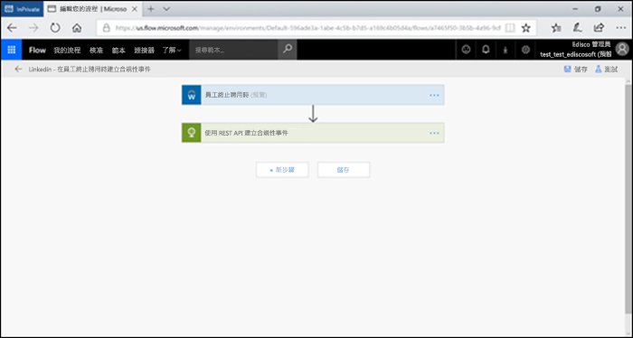

# <a name="start-retention-when-an-event-occurs"></a><span data-ttu-id="d1810-103">事件發生時，開始保留</span><span class="sxs-lookup"><span data-stu-id="d1810-103">Start retention when an event occurs</span></span>

><span data-ttu-id="d1810-104">*[Microsoft 365 安全性與合規性的授權指引](/office365/servicedescriptions/microsoft-365-service-descriptions/microsoft-365-tenantlevel-services-licensing-guidance/microsoft-365-security-compliance-licensing-guidance)。*</span><span class="sxs-lookup"><span data-stu-id="d1810-104">*[Microsoft 365 licensing guidance for security & compliance](/office365/servicedescriptions/microsoft-365-service-descriptions/microsoft-365-tenantlevel-services-licensing-guidance/microsoft-365-security-compliance-licensing-guidance).*</span></span>

<span data-ttu-id="d1810-p101">當您保留內容時，保留期間通常是依據內容的存留期。例如，您在文件建立之後保留 7 年，然後刪除。但當您設定[保留標籤](retention.md#retention-labels)，您也可以讓發生特定類型事件的時間作為保留期間的依據。事件會觸發啟動保留期間，有保留標籤套用至該類型事件的所有內容，都會強制執行標籤的保留動作。</span><span class="sxs-lookup"><span data-stu-id="d1810-p101">When you retain content, the retention period is often based on the age of the content. For example, you might retain documents for seven years after they're created and then delete them. But when you configure [retention labels](retention.md#retention-labels), you can also base a retention period on when a specific type of event occurs. The event triggers the start of the retention period, and all content with a retention label applied for that type of event get the label's retention actions enforced on them.</span></span>
  
<span data-ttu-id="d1810-109">使用事件型保留的範例：</span><span class="sxs-lookup"><span data-stu-id="d1810-109">Examples for using event-based retention:</span></span>
  
- <span data-ttu-id="d1810-110">**員工離開組織** 假設員工記錄必須從員工離開組織起保留 10 年。</span><span class="sxs-lookup"><span data-stu-id="d1810-110">**Employees leaving the organization** Suppose that employee records must be retained for 10 years from the time an employee leaves the organization.</span></span> <span data-ttu-id="d1810-111">經過 10 年之後，所有與該名員工相關的雇用、績效和離職文件都必須加以處置。</span><span class="sxs-lookup"><span data-stu-id="d1810-111">After 10 years elapse, all documents related to the hiring, performance, and termination of that employee must be disposed.</span></span> <span data-ttu-id="d1810-112">會觸發 10 年保留期間的事件是員工離開組織。</span><span class="sxs-lookup"><span data-stu-id="d1810-112">The event that triggers the 10-year retention period is the employee leaving the organization.</span></span> 
    
- <span data-ttu-id="d1810-113">**合約到期** 假設與合約相關的所有記錄必須從合約到期時間起保留五年。</span><span class="sxs-lookup"><span data-stu-id="d1810-113">**Contract expiration** Suppose that all records related to contracts must be retained for five years from the time the contract expires.</span></span> <span data-ttu-id="d1810-114">會觸發五年保留期間的事件是合約到期。</span><span class="sxs-lookup"><span data-stu-id="d1810-114">The event that triggers the five-year retention period is the expiration of the contract.</span></span> 
    
- <span data-ttu-id="d1810-p104">**產品生命週期** 貴組織可能有與產品最後製造日期相關的保留需求，例如技術規格。在此情況下，最後製造日期是觸發保留期間的事件。</span><span class="sxs-lookup"><span data-stu-id="d1810-p104">**Product lifetime** Your organization might have retention requirements related to the last manufacturing date of products for content such as technical specifications. In this case, the last manufacturing date is the event that triggers the retention period.</span></span> 
    
<span data-ttu-id="d1810-p105">事件型保留通常作為記錄管理處理程序的一部分。這表示：</span><span class="sxs-lookup"><span data-stu-id="d1810-p105">Event-based retention is typically used as part of a records-management process. This means that:</span></span>
  
- <span data-ttu-id="d1810-119">依保留事件標示的標籤通常也會將項目標記成一個資料列，為記錄管理解決方案的其中一部分。</span><span class="sxs-lookup"><span data-stu-id="d1810-119">Retention labels based on events also usually mark items as a record, as a part of a records management solution.</span></span> <span data-ttu-id="d1810-120">如需詳細資訊，請參閱[了解記錄管理](records-management.md)。</span><span class="sxs-lookup"><span data-stu-id="d1810-120">For more information, see [Learn about records management](records-management.md).</span></span>

- <span data-ttu-id="d1810-121">已宣告為記錄但是其事件觸發程序尚未發生的文件，會無限期保留 (記錄無法永久刪除)，直到事件觸發該文件的保留期間。</span><span class="sxs-lookup"><span data-stu-id="d1810-121">A document that's been declared a record but whose event trigger has not yet happened is retained indefinitely (records can't be permanently deleted), until an event triggers that document's retention period.</span></span>
    
- <span data-ttu-id="d1810-122">根據事件的保留標籤通常會在保留期間結束時觸發處置檢閱，這樣記錄管理員就能手動檢閱並處置內容。</span><span class="sxs-lookup"><span data-stu-id="d1810-122">Retention labels based on events usually trigger a disposition review at the end of the retention period, so that a records manager can manually review and dispose of the content.</span></span> <span data-ttu-id="d1810-123">如需詳細資訊，請參閱[處置內容](disposition.md)。</span><span class="sxs-lookup"><span data-stu-id="d1810-123">For more information, see [Disposition of content](disposition.md).</span></span>
    

<span data-ttu-id="d1810-124">根據事件的保留標籤與 Microsoft 365 中任何保留標籤具有相同的功能。</span><span class="sxs-lookup"><span data-stu-id="d1810-124">A retention label based on an event has the same capabilities as any retention label in Microsoft 365.</span></span> <span data-ttu-id="d1810-125">如需詳細資訊，請參閱[瞭解保留原則和保留標籤](retention.md)。</span><span class="sxs-lookup"><span data-stu-id="d1810-125">For more information, see [Learn about retention policies and retention labels](retention.md).</span></span>

## <a name="understanding-the-relationship-between-event-types-labels-events-and-asset-ids"></a><span data-ttu-id="d1810-126">了解事件類型、標籤、事件和資產識別碼之間的關聯性</span><span class="sxs-lookup"><span data-stu-id="d1810-126">Understanding the relationship between event types, labels, events, and asset IDs</span></span>

<span data-ttu-id="d1810-127">若要成功使用事件型保留，請務必了解事件類型、保留標籤、事件和資產識別碼之間的關聯性，如下列圖表所示且圖表後有說明：</span><span class="sxs-lookup"><span data-stu-id="d1810-127">To successfully use event-based retention, it's important to understand the relationship between event types, retention labels, events, and asset IDs as illustrated in the diagrams and the explanation that follows:</span></span> 
  

  

  
1. <span data-ttu-id="d1810-p109">建立不同類型內容的保留標籤，然後將其與事件類型產生關聯。例如，不同類型產品檔案和記錄的保留標籤會與名為「產品生命週期」的事件類型相關聯，因為這些記錄必須從產品達到其生命週期結束開始保留 10 年。</span><span class="sxs-lookup"><span data-stu-id="d1810-p109">You create retention labels for different types of content and then associate them with a type of event. For example, retention labels for different types of product files and records are associated with an event type named Product Lifetime because those records must be retained for 10 years from the time the product reaches its end of life.</span></span>
    
2. <span data-ttu-id="d1810-132">使用者 (通常是記錄管理員) 會將這些保留標籤套用到內容，並且 (若是 SharePoint 和 OneDrive 中的文件) 為每個項目輸入資產識別碼。</span><span class="sxs-lookup"><span data-stu-id="d1810-132">Users (typically records managers) apply those retention labels to content and (for documents in SharePoint and OneDrive) enter an asset ID for each item.</span></span> <span data-ttu-id="d1810-133">在此範例中，資產識別碼是組織所使用的產品名稱或代碼。</span><span class="sxs-lookup"><span data-stu-id="d1810-133">In this example, the asset ID is a product name or code used by the organization.</span></span> <span data-ttu-id="d1810-134">然後，每個產品的記錄都會獲派一個保留標籤，而每筆記錄都會有包含資產識別碼的屬性。</span><span class="sxs-lookup"><span data-stu-id="d1810-134">Then, each product's records are assigned a retention label, and each record has a property that contains an asset ID.</span></span> <span data-ttu-id="d1810-135">此圖表描繪組織中所有產品記錄的 **所有內容**，而每個項目都會承載記錄所屬產品的資產識別碼。</span><span class="sxs-lookup"><span data-stu-id="d1810-135">The diagram represents **all the content** for all product records in an organization, and each item bears the asset ID of the product whose record it is.</span></span> 
    
3. <span data-ttu-id="d1810-p111">產品生命週期是事件類型；達到生命週期結尾的特定產品是事件。該事件類型的事件發生時 - 在此情況下，當產品達到其生命週期結尾時 - 您建立事件，指定：</span><span class="sxs-lookup"><span data-stu-id="d1810-p111">Product Lifetime is the event type; a specific product reaching end of life is an event. When an event of that event type occurs—in this case, when a product reaches its end of life—you create an event that specifies:</span></span>
    
   - <span data-ttu-id="d1810-138">資產識別碼 (適用於 SharePoint 和 OneDrive 文件)</span><span class="sxs-lookup"><span data-stu-id="d1810-138">An asset ID (for SharePoint and OneDrive documents)</span></span>
    
   - <span data-ttu-id="d1810-p112">關鍵字 (適用於 Exchange 項目)。在此範例中，組織在包含產品記錄的訊息中使用產品代碼，因此 Exchange 項目的關鍵字與 SharePoint 和 OneDrive 文件中的資產識別碼功能相同。</span><span class="sxs-lookup"><span data-stu-id="d1810-p112">Keywords (for Exchange items). In this example, the organization uses a product code in messages containing product records, so the keyword for Exchange items is functionally the same as the asset ID for SharePoint and OneDrive documents.</span></span>
    
   - <span data-ttu-id="d1810-p113">發生事件的日期。此日期作為保留期間的開始日期。此日期可能是目前、過去或未來的日期。</span><span class="sxs-lookup"><span data-stu-id="d1810-p113">The date when the event occurred. This date is used as the start of the retention period. This date can be the current, a past, or a future date.</span></span>

4. <span data-ttu-id="d1810-p114">在您建立事件之後，事件日期會同步處理至具有該事件類型保留標籤和包含指定資產識別碼或關鍵字的所有內容。與其他任何保留標籤一樣，這個同步處理最多會耗費 7 天的時間。在先前的圖表中，用紅色圈起來的所有項目具有由此事件觸發的保留期間。換句話說，當此產品達到其生命週期結尾時，該事件會觸發該產品記錄的保留期間。</span><span class="sxs-lookup"><span data-stu-id="d1810-p114">After you create an event, that event date is synchronized to all the content that has a retention label of that event type and that contains the specified asset ID or keyword. Like any retention label, this synchronization can take up to seven days. In the previous diagram, all the items circled in red have their retention period triggered by this event. In other words, when this product reaches its end of life, that event triggers the retention period for that product's records.</span></span>

<span data-ttu-id="d1810-148">請務必了解，如果您沒有為事件指定資產識別碼或關鍵字，則保留標籤屬於該事件類型的 **所有內容** 都將有由該事件觸發的保留期間。</span><span class="sxs-lookup"><span data-stu-id="d1810-148">It's important to understand that if you don't specify an asset ID or keywords for an event, **all content** with a retention label of that event type will have its retention period triggered by the event.</span></span> <span data-ttu-id="d1810-149">這表示在上圖中，所有內容都會開始進行保留。</span><span class="sxs-lookup"><span data-stu-id="d1810-149">This means that in the previous diagram, all content would start being retained.</span></span> <span data-ttu-id="d1810-150">這可能不是您原本的打算。</span><span class="sxs-lookup"><span data-stu-id="d1810-150">This might not be what you intend.</span></span>

<span data-ttu-id="d1810-p116">最後請記住，每個保留標籤具有自己的保留設定。在此範例中，全部都指定 10 年，但是事件有可能觸發具有不同保留期間的保留標籤。</span><span class="sxs-lookup"><span data-stu-id="d1810-p116">Finally, remember that each retention label has its own retention settings. In this example, they all specify 10 years, but it's possible for an event to trigger retention labels where each label has a different retention period.</span></span>
  
## <a name="how-to-set-up-event-driven-retention"></a><span data-ttu-id="d1810-153">如何設定事件導向保留</span><span class="sxs-lookup"><span data-stu-id="d1810-153">How to set up event-driven retention</span></span>

<span data-ttu-id="d1810-154">事件導向保留的整體工作流程：</span><span class="sxs-lookup"><span data-stu-id="d1810-154">High-level workflow for event-driven retention:</span></span>
  

  
> [!TIP]
> <span data-ttu-id="d1810-156">請參閱 [使用保留標籤來管理儲存在 SharePoint 中的文件生命週期](auto-apply-retention-labels-scenario.md)，以瞭解如何在 SharePoint 中使用管理屬性以自動套用保留標籤及實施事件導向保留。</span><span class="sxs-lookup"><span data-stu-id="d1810-156">See [Use retention labels to manage the lifecycle of documents stored in SharePoint](auto-apply-retention-labels-scenario.md) for a detailed scenario about using managed properties in SharePoint to auto-apply retention labels and implement event-driven retention.</span></span>

### <a name="step-1-create-a-label-whose-retention-period-is-based-on-an-event"></a><span data-ttu-id="d1810-157">步驟 1：建立其保留期間根據事件的標籤</span><span class="sxs-lookup"><span data-stu-id="d1810-157">Step 1: Create a label whose retention period is based on an event</span></span>

<span data-ttu-id="d1810-158">若要建立和設定保留標籤，請參閱 [建立和設定保留標籤](./create-apply-retention-labels.md#step-1-create-retention-labels)中的指示。</span><span class="sxs-lookup"><span data-stu-id="d1810-158">To create and configure your retention label, see the instructions for [Create retention labels](./create-apply-retention-labels.md#step-1-create-retention-labels).</span></span> <span data-ttu-id="d1810-159">但特定於事件型的保留，在 [建立保留標籤] 精靈的 **[定義保留設定]** 頁上，在啟動 **[開始保留期依據]** 後，從下拉清單中選取一種預設事件類型，或透過選取 **[建立新事件類型]** 來建立自己的事件類型：</span><span class="sxs-lookup"><span data-stu-id="d1810-159">But specific to event-based retention, on the **Define retention settings** page of the Create retention label wizard, after **Start the retention period based on**, select one of the default event types from the dropdown list, or create your own by selecting **Create new event type**:</span></span>


<span data-ttu-id="d1810-161">事件類型只是您要讓保留標籤與事件建立關聯之事件的一般描述。</span><span class="sxs-lookup"><span data-stu-id="d1810-161">An event type is simply a general description of an event that you want to associate with a retention label.</span></span>

<span data-ttu-id="d1810-162">預設事件類型在下拉清單中的名稱後面有 **(event type)** 以便於識別，您還可以從 **[記錄管理]** > **[事件] 索引標籤** > **[管理事件類型]** 中查看和建立事件類型。</span><span class="sxs-lookup"><span data-stu-id="d1810-162">The default event types have **(event type)** after their name in the dropdown list for easier identification, and you can also see and create event type from the **Records management** > **Events** tab > **Manage event types**.</span></span>

<span data-ttu-id="d1810-163">事件型保留需要保留設定：</span><span class="sxs-lookup"><span data-stu-id="d1810-163">Event-based retention requires retention settings that:</span></span>
  
- <span data-ttu-id="d1810-164">保留內容。</span><span class="sxs-lookup"><span data-stu-id="d1810-164">Retain the content.</span></span>
    
- <span data-ttu-id="d1810-165">自動刪除內容或在保留期間結束時觸發處置檢閱。</span><span class="sxs-lookup"><span data-stu-id="d1810-165">Delete the content automatically or trigger a disposition review at the end of the retention period.</span></span>
  
<span data-ttu-id="d1810-166">事件型的保留通常是用於作為記錄的內容，因此很適合用來檢查您是否也需要選取將內容標示為[記錄](records-management.md#records)的選項。</span><span class="sxs-lookup"><span data-stu-id="d1810-166">Event-based retention is typically used for content that's declared a record, so this is a good time to check whether you also need to select the option that marks content as a [record](records-management.md#records).</span></span>

<span data-ttu-id="d1810-167">如果您正在使用現有的事件類型，而非建立新的事件類型，請跳到步驟 3。</span><span class="sxs-lookup"><span data-stu-id="d1810-167">If you're using an existing event type rather than creating a new event type, skip to step 3.</span></span>

> [!NOTE]
> <span data-ttu-id="d1810-168">在您選擇事件類型並儲存保留標籤之後，就無法變更事件類型。</span><span class="sxs-lookup"><span data-stu-id="d1810-168">After you choose an event type and save the retention label, the event type cannot be changed.</span></span>

### <a name="step-2-create-a-new-event-type-for-your-label"></a><span data-ttu-id="d1810-169">步驟 2：建立你的標籤的新事件類型</span><span class="sxs-lookup"><span data-stu-id="d1810-169">Step 2: Create a new event type for your label</span></span>

<span data-ttu-id="d1810-170">針對保留設定，如果選取 **[建立新事件類型]**，請輸入事件類型的名稱和描述。</span><span class="sxs-lookup"><span data-stu-id="d1810-170">For the retention settings, if you selected **Create new event type**, enter a name and description for your event type.</span></span> <span data-ttu-id="d1810-171">然後選取 **[下一個]**、 **[提交]** 和 **[完成]**。</span><span class="sxs-lookup"><span data-stu-id="d1810-171">Then select **Next**, **Submit**, and **Done**.</span></span>

<span data-ttu-id="d1810-172">回到 **[定義保留設定]** 頁面，使用下拉清單選取您建立的事件類型作為 **[開始保留期依據]**。</span><span class="sxs-lookup"><span data-stu-id="d1810-172">Back on the **Define retention settings** page, for **Start the retention period based on**, use the dropdown list to select the event type that you created.</span></span>

  
### <a name="step-3-publish-or-auto-apply-the-event-based-retention-labels"></a><span data-ttu-id="d1810-173">步驟 3：發佈或自動套用事件型保留標籤</span><span class="sxs-lookup"><span data-stu-id="d1810-173">Step 3: Publish or auto-apply the event-based retention labels</span></span>

<span data-ttu-id="d1810-174">和任何保留標籤一樣，您必須發佈或自動套用事件型標籤，以使標籤可以手動或自動套用到內容中：</span><span class="sxs-lookup"><span data-stu-id="d1810-174">Just like any retention label, you need to publish or auto-apply an event-based label, for it to be manually or automatically applied to content:</span></span>
- [<span data-ttu-id="d1810-175">建立保留標籤，並在應用程式中使用這些標籤</span><span class="sxs-lookup"><span data-stu-id="d1810-175">Create retention labels and apply them in apps</span></span>](create-apply-retention-labels.md)
- [<span data-ttu-id="d1810-176">自動將保留標籤套用到內容</span><span class="sxs-lookup"><span data-stu-id="d1810-176">Apply a retention label to content automatically</span></span>](apply-retention-labels-automatically.md)

### <a name="step-4-enter-an-asset-id"></a><span data-ttu-id="d1810-177">步驟 4：輸入資產識別碼</span><span class="sxs-lookup"><span data-stu-id="d1810-177">Step 4: Enter an asset ID</span></span>

<span data-ttu-id="d1810-p119">在將事件型標籤套用到內容之後，您可以輸入每個項目的資產識別碼。例如，貴組織可能使用：</span><span class="sxs-lookup"><span data-stu-id="d1810-p119">After an event-based label is applied to content, you can enter an asset ID for each item. For example, your organization might use:</span></span>
  
- <span data-ttu-id="d1810-180">產品代碼，您可以用來保留僅限特定產品的內容。</span><span class="sxs-lookup"><span data-stu-id="d1810-180">Product codes that you can use to retain content for only a specific product.</span></span>
    
- <span data-ttu-id="d1810-181">專案代碼，您可以用來保留僅限特定專案的內容。</span><span class="sxs-lookup"><span data-stu-id="d1810-181">Project codes that you can use to retain content for only a specific project.</span></span>
    
- <span data-ttu-id="d1810-182">員工識別碼，您可以用來保留僅限特定人員的內容。</span><span class="sxs-lookup"><span data-stu-id="d1810-182">Employee IDs that you can use to retain content for only a specific person.</span></span>
    
<span data-ttu-id="d1810-183">資產識別碼只是 SharePoint 和 OneDrive 中可用的另一個文件屬性。</span><span class="sxs-lookup"><span data-stu-id="d1810-183">Asset ID is simply another document property that's available in SharePoint and OneDrive.</span></span> <span data-ttu-id="d1810-184">貴組織可能已經使用其他文件屬性和識別碼來分類內容。</span><span class="sxs-lookup"><span data-stu-id="d1810-184">Your organization might already use other document properties and IDs to classify content.</span></span> <span data-ttu-id="d1810-185">若是如此，您也可以在建立事件時使用這些屬性和值，請參閱後續的步驟 6。</span><span class="sxs-lookup"><span data-stu-id="d1810-185">If so, you can also use those properties and values when you create an event—see step 6 that follows.</span></span> <span data-ttu-id="d1810-186">重點是，您必須在文件屬性中使用一些 *property:value* 組合，以將該項目與事件類型建立關聯。</span><span class="sxs-lookup"><span data-stu-id="d1810-186">The important point is that you must use some *property:value* combination in the document properties to associate that item with an event type.</span></span>
  

  
### <a name="step-5-create-an-event"></a><span data-ttu-id="d1810-188">步驟 5：建立事件</span><span class="sxs-lookup"><span data-stu-id="d1810-188">Step 5: Create an event</span></span>

<span data-ttu-id="d1810-189">發生該事件類型的特定執行個體時，例如，產品達到其生命週期的結尾，請移至 Microsoft 365 合規性中心的 **[記錄管理]**  >  **[事件]** 頁面，然後選取 **+ 建立** 以建立事件。</span><span class="sxs-lookup"><span data-stu-id="d1810-189">When a particular instance of that event type occurs, such as a product reaches its end of life, go to the **Records management** > **Events** page in the Microsoft 365 compliance center, and select **+ Create** to create an event.</span></span> <span data-ttu-id="d1810-190">您可以在此處建立事件來觸發事件。</span><span class="sxs-lookup"><span data-stu-id="d1810-190">You trigger the event by creating it, here.</span></span>


<span data-ttu-id="d1810-192">每個租用戶都支援最多 1 百萬個事件。</span><span class="sxs-lookup"><span data-stu-id="d1810-192">Up to one million events are supported per tenant.</span></span>

### <a name="step-6-choose-the-same-event-type-used-by-the-label-in-step-2"></a><span data-ttu-id="d1810-193">步驟 6：選擇與步驟 2 中的標籤所使用相同的事件類型</span><span class="sxs-lookup"><span data-stu-id="d1810-193">Step 6: Choose the same event type used by the label in step 2</span></span>

<span data-ttu-id="d1810-194">當您建立事件時，請選擇步驟 2 中保留標籤設定所指定的相同事件類型。</span><span class="sxs-lookup"><span data-stu-id="d1810-194">When you create the event, choose the same event type specified in the retention label settings in step 2.</span></span> <span data-ttu-id="d1810-195">例如，如果為標籤設定選取了 **[產品生命週期]** 作為事件類型，請在建立事件時選取 **[產品生命週期]**。</span><span class="sxs-lookup"><span data-stu-id="d1810-195">For example, if you selected **Product Lifetime** as your event type for the label settings, select **Product Lifetime** when you create the event.</span></span> <span data-ttu-id="d1810-196">只有已套用該事件類型保留標籤的內容會觸發其保留期間。</span><span class="sxs-lookup"><span data-stu-id="d1810-196">Only content with retention labels applied to it of that event type will have its retention period triggered.</span></span>


<span data-ttu-id="d1810-198">或者，如果您需要為具有不同事件類型的多個保留標籤建立事件，請選取 **[選擇現有標籤]** 選項。</span><span class="sxs-lookup"><span data-stu-id="d1810-198">Alternatively, if you need to create an event for multiple retention labels that have different event types, select the **Choose Existing Labels** option.</span></span> <span data-ttu-id="d1810-199">然後，選取您要與這個事件相關聯之事件類型設定的標籤。</span><span class="sxs-lookup"><span data-stu-id="d1810-199">Then, select the labels that are configured for the event types you want to associate with this event.</span></span>

### <a name="step-7-enter-keywords-or-query-for-exchange-asset-id-for-sharepoint-and-onedrive"></a><span data-ttu-id="d1810-200">步驟 7：輸入 Exchange 的關鍵字或查詢、SharePoint 和 OneDrive 的資產識別碼</span><span class="sxs-lookup"><span data-stu-id="d1810-200">Step 7: Enter keywords or query for Exchange, asset ID for SharePoint and OneDrive</span></span>

<span data-ttu-id="d1810-201">現在您可以縮小內容的範圍。</span><span class="sxs-lookup"><span data-stu-id="d1810-201">Now you narrow the scope of the content.</span></span> <span data-ttu-id="d1810-202">對於 Exchange 內容，您可以透過指定關鍵字或查詢來執行此工作。</span><span class="sxs-lookup"><span data-stu-id="d1810-202">For Exchange content, you do this by specifying keywords or a query.</span></span> <span data-ttu-id="d1810-203">對於 SharePoint 和 OneDrive 內容，您可以透過指定資產識別碼來執行此工作。</span><span class="sxs-lookup"><span data-stu-id="d1810-203">For SharePoint and OneDrive content, you do this by specifying asset IDs.</span></span>

<span data-ttu-id="d1810-204">對於 Exchange 項目，請使用關鍵字或使用關鍵字查詢語言 (KQL) 的查詢。</span><span class="sxs-lookup"><span data-stu-id="d1810-204">For Exchange items, use keywords or a query that uses Keyword Query Language (KQL).</span></span> <span data-ttu-id="d1810-205">如需查詢語法的詳細資訊，請參閱 [關鍵字查詢語言 (KQL) 語法參考](/sharepoint/dev/general-development/keyword-query-language-kql-syntax-reference)。</span><span class="sxs-lookup"><span data-stu-id="d1810-205">For more information about the query syntax, see [Keyword Query Language (KQL) syntax reference](/sharepoint/dev/general-development/keyword-query-language-kql-syntax-reference).</span></span> <span data-ttu-id="d1810-206">如需有關您可在 Exchange 中使用的可搜尋屬性詳細資訊，請參閱 [內容搜尋的關鍵字查詢和搜尋條件](keyword-queries-and-search-conditions.md)。</span><span class="sxs-lookup"><span data-stu-id="d1810-206">For more information about the searchable properties that you can use for Exchange, see [Keyword queries and search conditions for Content Search](keyword-queries-and-search-conditions.md).</span></span>

<span data-ttu-id="d1810-207">對於資產識別碼，僅有在具有指定 *property:value* 組的內容上才會強制執行保留。</span><span class="sxs-lookup"><span data-stu-id="d1810-207">For asset IDs, retention will be enforced only on content with the specified *property:value* pair.</span></span> <span data-ttu-id="d1810-208">例如：如果您使用的是 [資產識別碼] 屬性，請在下列顯示的資產識別碼方塊中輸入 `ComplianceAssetID:<value>`。</span><span class="sxs-lookup"><span data-stu-id="d1810-208">For example, if you're using the Asset ID property, enter `ComplianceAssetID:<value>` in the box for asset IDs shown in the following picture.</span></span>

<span data-ttu-id="d1810-209">若未輸入資產識別碼，具有該事件類型之標籤的所有內容都會套用相同的保留日期。</span><span class="sxs-lookup"><span data-stu-id="d1810-209">If an asset ID is not entered, all content with labels of that event type get the same retention date applied to them.</span></span>

<span data-ttu-id="d1810-210">組織可能已將其他屬性和識別碼套用到與此事件類型相關的文件。</span><span class="sxs-lookup"><span data-stu-id="d1810-210">Your organization might have applied other properties and IDs to the documents related to this event type.</span></span> <span data-ttu-id="d1810-211">例如，如果您需要偵測特定產品的記錄，識別碼可能會是您的自訂屬性 ProductID 和值 "XYZ"。</span><span class="sxs-lookup"><span data-stu-id="d1810-211">For example, if you need to detect a specific product's records, the ID might be a combination of your custom property ProductID and the value "XYZ".</span></span> <span data-ttu-id="d1810-212">在此情況下，您會在下圖所示的資產識別碼方塊中輸入 `ProductID:XYZ`。</span><span class="sxs-lookup"><span data-stu-id="d1810-212">In this case, you'd enter `ProductID:XYZ` in the box for asset IDs shown in the following picture.</span></span>

<span data-ttu-id="d1810-p128">最後，請選擇發生事件的日期；此日期會作為保留期間的開始日期。在您建立事件之後，該事件日期會同步處理至具有該事件類型保留標籤、資產識別碼和關鍵字或查詢的所有內容。如同任何保留標籤，同步處理最多可能需要七天。</span><span class="sxs-lookup"><span data-stu-id="d1810-p128">Finally, choose the date when the event occurred; this date is used as the start of the retention period. After you create an event, that event date is synchronized to all the content with a retention label of that event type, asset ID, and keywords or queries. As with any retention label, this synchronization can take up to seven days.</span></span>
  


<span data-ttu-id="d1810-217">建立事件之後，保留設定就會對已套用標籤和已編製索引的內容生效。</span><span class="sxs-lookup"><span data-stu-id="d1810-217">After creating an event, the retention settings take effect for the content that's already labeled and indexed.</span></span> <span data-ttu-id="d1810-218">如果在建立事件之後，將保留標籤新增至新內容，則您必須使用相同的詳細資料建立新事件。</span><span class="sxs-lookup"><span data-stu-id="d1810-218">If the retention label is added to new content after the event is created, you must create a new event with the same details.</span></span>

<span data-ttu-id="d1810-219">刪除事件不會取消目前對已套用標籤之內容生效的保留設定。</span><span class="sxs-lookup"><span data-stu-id="d1810-219">Deleting an event doesn't cancel the retention settings that are now in effect for the content that's already labeled.</span></span> <span data-ttu-id="d1810-220">若要這麼做，請建立具有相同詳細資料的新事件，但將日期保留空白。</span><span class="sxs-lookup"><span data-stu-id="d1810-220">To do that, create a new event with the same details, but leave the date blank.</span></span> 

## <a name="use-content-search-to-find-all-content-with-a-specific-label-or-asset-id"></a><span data-ttu-id="d1810-221">使用內容搜尋來尋找具有特定標籤或資產識別碼的所有內容</span><span class="sxs-lookup"><span data-stu-id="d1810-221">Use Content Search to find all content with a specific label or asset ID</span></span>

<span data-ttu-id="d1810-222">將保留標籤指派給內容之後，您可以使用內容搜尋，尋找以特定保留標籤分類或包含特定資產識別碼的所有內容：</span><span class="sxs-lookup"><span data-stu-id="d1810-222">After retention labels are assigned to content, you can use content search to find all content that's classified with a specific retention label or that contains a specific asset ID:</span></span>
  
- <span data-ttu-id="d1810-223">若要尋找具有特定保留標籤的所有內容時，請選擇 **[保留標籤]** 條件，然後輸入完整標籤名稱或，或輸入部分標籤名稱並使用萬用字元。</span><span class="sxs-lookup"><span data-stu-id="d1810-223">To find all content with a specific retention label, choose the **Retention label** condition, and then enter the complete label name or part of the label name and use a wildcard.</span></span> 
    
- <span data-ttu-id="d1810-224">若要尋找具有特定資產識別碼的所有內容，請使用格式 `ComplianceAssetID:<value>` 輸入 **ComplianceAssetID** 屬性和值。</span><span class="sxs-lookup"><span data-stu-id="d1810-224">To find all content with a specific asset ID, enter the **ComplianceAssetID** property and a value, using the format `ComplianceAssetID:<value>`.</span></span> 
    
<span data-ttu-id="d1810-225">如需詳細資訊，請參閱[內容搜尋的關鍵字查詢和搜尋條件](keyword-queries-and-search-conditions.md)。</span><span class="sxs-lookup"><span data-stu-id="d1810-225">For more information, see [Keyword queries and search conditions for Content Search](keyword-queries-and-search-conditions.md).</span></span>

## <a name="automate-events-by-using-powershell"></a><span data-ttu-id="d1810-226">使用 PowerShell 讓事件自動化</span><span class="sxs-lookup"><span data-stu-id="d1810-226">Automate events by using PowerShell</span></span>

<span data-ttu-id="d1810-227">您可以使用 PowerShell 指令碼來自動化商務應用程式中以事件為基礎的保留。</span><span class="sxs-lookup"><span data-stu-id="d1810-227">You can use a PowerShell script to automate event-based retention from your business applications.</span></span> <span data-ttu-id="d1810-228">適用於事件型保留的 PowerShell Cmdlet：</span><span class="sxs-lookup"><span data-stu-id="d1810-228">The PowerShell cmdlets available for event-based retention:</span></span>
  
- [<span data-ttu-id="d1810-229">Get-ComplianceRetentionEventType</span><span class="sxs-lookup"><span data-stu-id="d1810-229">Get-ComplianceRetentionEventType</span></span>](/powershell/module/exchange/get-complianceretentioneventtype)
    
- [<span data-ttu-id="d1810-230">New-ComplianceRetentionEventType</span><span class="sxs-lookup"><span data-stu-id="d1810-230">New-ComplianceRetentionEventType</span></span>](/powershell/module/exchange/new-complianceretentioneventtype)
    
- [<span data-ttu-id="d1810-231">Remove-ComplianceRetentionEventType</span><span class="sxs-lookup"><span data-stu-id="d1810-231">Remove-ComplianceRetentionEventType</span></span>](/powershell/module/exchange/remove-complianceretentioneventtype)
    
- [<span data-ttu-id="d1810-232">Set-ComplianceRetentionEventType</span><span class="sxs-lookup"><span data-stu-id="d1810-232">Set-ComplianceRetentionEventType</span></span>](/powershell/module/exchange/set-complianceretentioneventtype)
    
- [<span data-ttu-id="d1810-233">Get-ComplianceRetentionEvent</span><span class="sxs-lookup"><span data-stu-id="d1810-233">Get-ComplianceRetentionEvent</span></span>](/powershell/module/exchange/get-complianceretentionevent)
    
- [<span data-ttu-id="d1810-234">New-ComplianceRetentionEvent</span><span class="sxs-lookup"><span data-stu-id="d1810-234">New-ComplianceRetentionEvent</span></span>](/powershell/module/exchange/new-complianceretentionevent)
    

## <a name="automate-events-by-using-a-rest-api"></a><span data-ttu-id="d1810-235">使用 REST API 讓事件自動化</span><span class="sxs-lookup"><span data-stu-id="d1810-235">Automate events by using a REST API</span></span>

<span data-ttu-id="d1810-236">您可以使用 REST API 自動建立觸發保留時間開始的事件。</span><span class="sxs-lookup"><span data-stu-id="d1810-236">You can use a REST API to automatically create the events that trigger the start of the retention time.</span></span>

<span data-ttu-id="d1810-237">REST API 是支援 HTTP 操作組 (方法) 的服務端點，提供服務資源的建立、擷取、更新、刪除等存取權。</span><span class="sxs-lookup"><span data-stu-id="d1810-237">A REST API is a service endpoint that supports sets of HTTP operations (methods), which provide create/retrieve/update/delete access to the service's resources.</span></span> <span data-ttu-id="d1810-238">如需詳細資訊，請參閱 [REST API 要求/回應的元件](/rest/api/gettingstarted/#components-of-a-rest-api-requestresponse)。</span><span class="sxs-lookup"><span data-stu-id="d1810-238">For more information, see [Components of a REST API request/response](/rest/api/gettingstarted/#components-of-a-rest-api-requestresponse).</span></span> <span data-ttu-id="d1810-239">透過使用 Microsoft 365 REST API，使用 POST 和 GET 方法可以建立和擷取事件。</span><span class="sxs-lookup"><span data-stu-id="d1810-239">By using the Microsoft 365 REST API, events can be created and retrieved using the POST and GET methods.</span></span>

<span data-ttu-id="d1810-240">有兩個選項可以使用 REST API：</span><span class="sxs-lookup"><span data-stu-id="d1810-240">There are two options for using the REST API:</span></span>

- <span data-ttu-id="d1810-241">**Microsoft Power Automate 或類似的應用程式** 可以用於自動觸發事件的發生。</span><span class="sxs-lookup"><span data-stu-id="d1810-241">**Microsoft Power Automate or a similar application** to trigger the occurrence of an event automatically.</span></span> <span data-ttu-id="d1810-242">Microsoft Power Automate 是連線到其他系統的協調器，因此您不需要撰寫自訂解決方案。</span><span class="sxs-lookup"><span data-stu-id="d1810-242">Microsoft Power Automate is an orchestrator for connecting to other systems, so you don't need to write a custom solution.</span></span> <span data-ttu-id="d1810-243">如需詳細資訊，請參閱 [Power Automate 網站](https://flow.microsoft.com/zh-TW/)。</span><span class="sxs-lookup"><span data-stu-id="d1810-243">For more information, see the [Power Automate website](https://flow.microsoft.com/zh-TW/).</span></span>

- <span data-ttu-id="d1810-244">**PowerShell 或 HTTP 用戶端呼叫 REST API** 以透過 PowerShell （版本6或更新版本）建立事件，這是自訂解決方案的一部分。</span><span class="sxs-lookup"><span data-stu-id="d1810-244">**PowerShell or an HTTP client to call the REST API** to create events by using PowerShell (version 6 or later), which is part of a custom solution.</span></span>

<span data-ttu-id="d1810-245">在您使用 REST API 之前，請先確認用於保留事件呼叫的 URL。</span><span class="sxs-lookup"><span data-stu-id="d1810-245">Before you use the REST API, as a global administrator, confirm the URL to use for the retention event call.</span></span> <span data-ttu-id="d1810-246">若要這麼做，請使用 REST API URL 執行 [獲取] 保留事件呼叫:</span><span class="sxs-lookup"><span data-stu-id="d1810-246">To do this, run a GET retention event call by using the REST API URL:</span></span>

```http
https://ps.compliance.protection.outlook.com/psws/service.svc/ComplianceRetentionEvent
```

<span data-ttu-id="d1810-247">檢查回應碼。</span><span class="sxs-lookup"><span data-stu-id="d1810-247">Check the response code.</span></span> <span data-ttu-id="d1810-248">如果是302，請從回應標題的地址屬性取得重新導向的 URL，並使用該 URL，而非後續指示中的 `https://ps.compliance.protection.outlook.com/psws/service.svc/ComplianceRetentionEvent`。</span><span class="sxs-lookup"><span data-stu-id="d1810-248">If it's 302, get the redirected URL from the Location property of the response header and use that URL instead of `https://ps.compliance.protection.outlook.com/psws/service.svc/ComplianceRetentionEvent` in the instructions that follow.</span></span>

<span data-ttu-id="d1810-249">自動建立的事件可以在 Microsoft 365 合規性中心裡透過查看以進行確認 > **記錄管理** >  **事件**。</span><span class="sxs-lookup"><span data-stu-id="d1810-249">The events that get automatically created can be confirmed by viewing them in the Microsoft 365 compliance center > **Records management** >  **Events**.</span></span>

### <a name="use-microsoft-power-automate-to-create-the-event"></a><span data-ttu-id="d1810-250">使用 Microsoft Power Automate 建立活動</span><span class="sxs-lookup"><span data-stu-id="d1810-250">Use Microsoft Power Automate to create the event</span></span>

<span data-ttu-id="d1810-251">建立使用 Microsoft 365 REST API 建立事件的流程:</span><span class="sxs-lookup"><span data-stu-id="d1810-251">Create a flow that creates an event using the Microsoft 365 REST API:</span></span>




#### <a name="create-an-event"></a><span data-ttu-id="d1810-254">建立事件</span><span class="sxs-lookup"><span data-stu-id="d1810-254">Create an event</span></span>

<span data-ttu-id="d1810-255">呼叫 REST API 的範例程式碼：</span><span class="sxs-lookup"><span data-stu-id="d1810-255">Sample code to call the REST API:</span></span>

- <span data-ttu-id="d1810-256">**方法**：POST</span><span class="sxs-lookup"><span data-stu-id="d1810-256">**Method**: POST</span></span>
- <span data-ttu-id="d1810-257">**URL**：`https://ps.compliance.protection.outlook.com/psws/service.svc/ComplianceRetentionEvent`</span><span class="sxs-lookup"><span data-stu-id="d1810-257">**URL**: `https://ps.compliance.protection.outlook.com/psws/service.svc/ComplianceRetentionEvent`</span></span>
- <span data-ttu-id="d1810-258">**標頭**：Key = Content-Type, Value = application/atom+xml</span><span class="sxs-lookup"><span data-stu-id="d1810-258">**Headers**: Key = Content-Type, Value = application/atom+xml</span></span>
- <span data-ttu-id="d1810-259">**本文**：</span><span class="sxs-lookup"><span data-stu-id="d1810-259">**Body**:</span></span>

    ```xml
    <?xml version='1.0' encoding='utf-8' standalone='yes'?>
    
    <entry xmlns:d='http://schemas.microsoft.com/ado/2007/08/dataservices'
    
    xmlns:m='http://schemas.microsoft.com/ado/2007/08/dataservices/metadata'
    
    xmlns='http://www.w3.org/2005/Atom'>
    
    <category scheme='http://schemas.microsoft.com/ado/2007/08/dataservices/scheme' term='Exchange.ComplianceRetentionEvent' />
    
    <updated>9/9/2017 10:50:00 PM</updated>
    
    <content type='application/xml'>
    
    <m:properties>
    
    <d:Name>Employee Termination </d:Name>
    
    <d:EventType>99e0ae64-a4b8-40bb-82ed-645895610f56</d:EventType>
    
    <d:SharePointAssetIdQuery>1234</d:SharePointAssetIdQuery>
    
    <d:EventDateTime>2018-12-01T00:00:00Z </d:EventDateTime>
    
    </m:properties>
    
    </content>
    
    </entry>
    ```

- <span data-ttu-id="d1810-260">**驗證**：基本</span><span class="sxs-lookup"><span data-stu-id="d1810-260">**Authentication**: Basic</span></span>
- <span data-ttu-id="d1810-261">**使用者名稱**："Complianceuser"</span><span class="sxs-lookup"><span data-stu-id="d1810-261">**Username**: "Complianceuser"</span></span>
- <span data-ttu-id="d1810-262">**密碼**："Compliancepassword"</span><span class="sxs-lookup"><span data-stu-id="d1810-262">**Password**: "Compliancepassword"</span></span>


##### <a name="available-parameters"></a><span data-ttu-id="d1810-263">可用的參數</span><span class="sxs-lookup"><span data-stu-id="d1810-263">Available parameters</span></span>


|<span data-ttu-id="d1810-264">參數</span><span class="sxs-lookup"><span data-stu-id="d1810-264">Parameters</span></span>|<span data-ttu-id="d1810-265">描述</span><span class="sxs-lookup"><span data-stu-id="d1810-265">Description</span></span>|<span data-ttu-id="d1810-266">附註</span><span class="sxs-lookup"><span data-stu-id="d1810-266">Notes</span></span>|
|--- |--- |--- |
|<span data-ttu-id="d1810-267"><d:Name></d:Name></span><span class="sxs-lookup"><span data-stu-id="d1810-267"><d:Name></d:Name></span></span>|<span data-ttu-id="d1810-268">提供事件的唯一名稱，</span><span class="sxs-lookup"><span data-stu-id="d1810-268">Provide a unique name for the event,</span></span>|<span data-ttu-id="d1810-269">結尾不可包含空格或下列字元：% \* \ & < \> \| # ?</span><span class="sxs-lookup"><span data-stu-id="d1810-269">Cannot contain trailing spaces or the following characters: % \* \ & < \> \| # ?</span></span> <span data-ttu-id="d1810-270">, : ;</span><span class="sxs-lookup"><span data-stu-id="d1810-270">, : ;</span></span>|
|<span data-ttu-id="d1810-271"><d:EventType></d:EventType></span><span class="sxs-lookup"><span data-stu-id="d1810-271"><d:EventType></d:EventType></span></span>|<span data-ttu-id="d1810-272">輸入事件類型名稱 (或 Guid)</span><span class="sxs-lookup"><span data-stu-id="d1810-272">Enter event type name (or Guid),</span></span>|<span data-ttu-id="d1810-p137">例如：「僱用終止」。事件類型必須與保留標籤相關聯。</span><span class="sxs-lookup"><span data-stu-id="d1810-p137">Example: "Employee termination". Event type has to be associated with a retention label.</span></span>|
|<span data-ttu-id="d1810-275"><d:SharePointAssetIdQuery></d:SharePointAssetIdQuery></span><span class="sxs-lookup"><span data-stu-id="d1810-275"><d:SharePointAssetIdQuery></d:SharePointAssetIdQuery></span></span>|<span data-ttu-id="d1810-276">輸入「ComplianceAssetId：」 + 「員工識別碼」</span><span class="sxs-lookup"><span data-stu-id="d1810-276">Enter "ComplianceAssetId:" + employee ID</span></span>|<span data-ttu-id="d1810-277">範例："ComplianceAssetId:12345"</span><span class="sxs-lookup"><span data-stu-id="d1810-277">Example: "ComplianceAssetId:12345"</span></span>|
|<span data-ttu-id="d1810-278"><d:EventDateTime></d:EventDateTime></span><span class="sxs-lookup"><span data-stu-id="d1810-278"><d:EventDateTime></d:EventDateTime></span></span>|<span data-ttu-id="d1810-279">事件的日期和時間</span><span class="sxs-lookup"><span data-stu-id="d1810-279">Event Date and Time</span></span>|<span data-ttu-id="d1810-280">格式：yyyy-MM-ddTHH:mm:ssZ，例如：2018-12-01T00:00:00Z</span><span class="sxs-lookup"><span data-stu-id="d1810-280">Format: yyyy-MM-ddTHH:mm:ssZ, Example: 2018-12-01T00:00:00Z</span></span>
|

###### <a name="response-codes"></a><span data-ttu-id="d1810-281">回應碼</span><span class="sxs-lookup"><span data-stu-id="d1810-281">Response codes</span></span>

| <span data-ttu-id="d1810-282">回應碼</span><span class="sxs-lookup"><span data-stu-id="d1810-282">Response Code</span></span> | <span data-ttu-id="d1810-283">描述</span><span class="sxs-lookup"><span data-stu-id="d1810-283">Description</span></span>       |
| ----------------- | --------------------- |
| <span data-ttu-id="d1810-284">302</span><span class="sxs-lookup"><span data-stu-id="d1810-284">302</span></span>               | <span data-ttu-id="d1810-285">重新導向</span><span class="sxs-lookup"><span data-stu-id="d1810-285">Redirect</span></span>              |
| <span data-ttu-id="d1810-286">201</span><span class="sxs-lookup"><span data-stu-id="d1810-286">201</span></span>               | <span data-ttu-id="d1810-287">建立時間</span><span class="sxs-lookup"><span data-stu-id="d1810-287">Created</span></span>               |
| <span data-ttu-id="d1810-288">403</span><span class="sxs-lookup"><span data-stu-id="d1810-288">403</span></span>               | <span data-ttu-id="d1810-289">授權失敗</span><span class="sxs-lookup"><span data-stu-id="d1810-289">Authorization Failed</span></span>  |
| <span data-ttu-id="d1810-290">401</span><span class="sxs-lookup"><span data-stu-id="d1810-290">401</span></span>               | <span data-ttu-id="d1810-291">驗證失敗</span><span class="sxs-lookup"><span data-stu-id="d1810-291">Authentication Failed</span></span> |

##### <a name="get-events-based-on-a-time-range"></a><span data-ttu-id="d1810-292">依據時間範圍取得事件</span><span class="sxs-lookup"><span data-stu-id="d1810-292">Get events based on a time range</span></span>

- <span data-ttu-id="d1810-293">**方法**：GET</span><span class="sxs-lookup"><span data-stu-id="d1810-293">**Method**: GET</span></span>

- <span data-ttu-id="d1810-294">**URL**：`https://ps.compliance.protection.outlook.com/psws/service.svc/ComplianceRetentionEvent?BeginDateTime=2019-01-11&EndDateTime=2019-01-16`</span><span class="sxs-lookup"><span data-stu-id="d1810-294">**URL**: `https://ps.compliance.protection.outlook.com/psws/service.svc/ComplianceRetentionEvent?BeginDateTime=2019-01-11&EndDateTime=2019-01-16`</span></span>

- <span data-ttu-id="d1810-295">**標頭**：Key = Content-Type, Value = application/atom+xml</span><span class="sxs-lookup"><span data-stu-id="d1810-295">**Headers**: Key = Content-Type, Value = application/atom+xml</span></span>

- <span data-ttu-id="d1810-296">**驗證**：基本</span><span class="sxs-lookup"><span data-stu-id="d1810-296">**Authentication**: Basic</span></span>

- <span data-ttu-id="d1810-297">**使用者名稱**："Complianceuser"</span><span class="sxs-lookup"><span data-stu-id="d1810-297">**Username**: "Complianceuser"</span></span>

- <span data-ttu-id="d1810-298">**密碼**："Compliancepassword"</span><span class="sxs-lookup"><span data-stu-id="d1810-298">**Password**: "Compliancepassword"</span></span>

###### <a name="response-codes"></a><span data-ttu-id="d1810-299">回應碼</span><span class="sxs-lookup"><span data-stu-id="d1810-299">Response codes</span></span>

| <span data-ttu-id="d1810-300">回應碼</span><span class="sxs-lookup"><span data-stu-id="d1810-300">Response Code</span></span> | <span data-ttu-id="d1810-301">描述</span><span class="sxs-lookup"><span data-stu-id="d1810-301">Description</span></span>                   |
| ----------------- | --------------------------------- |
| <span data-ttu-id="d1810-302">200</span><span class="sxs-lookup"><span data-stu-id="d1810-302">200</span></span>               | <span data-ttu-id="d1810-303">好的，以 atom+ xml 格式列出事件清單</span><span class="sxs-lookup"><span data-stu-id="d1810-303">OK, A list of events in atom+ xml</span></span> |
| <span data-ttu-id="d1810-304">404</span><span class="sxs-lookup"><span data-stu-id="d1810-304">404</span></span>               | <span data-ttu-id="d1810-305">找不到</span><span class="sxs-lookup"><span data-stu-id="d1810-305">Not found</span></span>                         |
| <span data-ttu-id="d1810-306">302</span><span class="sxs-lookup"><span data-stu-id="d1810-306">302</span></span>               | <span data-ttu-id="d1810-307">重新導向</span><span class="sxs-lookup"><span data-stu-id="d1810-307">Redirect</span></span>                          |
| <span data-ttu-id="d1810-308">401</span><span class="sxs-lookup"><span data-stu-id="d1810-308">401</span></span>               | <span data-ttu-id="d1810-309">授權失敗</span><span class="sxs-lookup"><span data-stu-id="d1810-309">Authorization Failed</span></span>              |
| <span data-ttu-id="d1810-310">403</span><span class="sxs-lookup"><span data-stu-id="d1810-310">403</span></span>               | <span data-ttu-id="d1810-311">驗證失敗</span><span class="sxs-lookup"><span data-stu-id="d1810-311">Authentication Failed</span></span>             |

##### <a name="get-an-event-by-id"></a><span data-ttu-id="d1810-312">依 ID 取得事件</span><span class="sxs-lookup"><span data-stu-id="d1810-312">Get an event by ID</span></span>

- <span data-ttu-id="d1810-313">**方法**：GET</span><span class="sxs-lookup"><span data-stu-id="d1810-313">**Method**: GET</span></span>

- <span data-ttu-id="d1810-314">**URL**：`https://ps.compliance.protection.outlook.com/psws/service.svc/ComplianceRetentionEvent('174e9a86-74ff-4450-8666-7c11f7730f66')`</span><span class="sxs-lookup"><span data-stu-id="d1810-314">**URL**: `https://ps.compliance.protection.outlook.com/psws/service.svc/ComplianceRetentionEvent('174e9a86-74ff-4450-8666-7c11f7730f66')`</span></span>

- <span data-ttu-id="d1810-315">**標頭**：Key = Content-Type, Value = application/atom+xml</span><span class="sxs-lookup"><span data-stu-id="d1810-315">**Headers**: Key = Content-Type, Value = application/atom+xml</span></span>

- <span data-ttu-id="d1810-316">**驗證**：基本</span><span class="sxs-lookup"><span data-stu-id="d1810-316">**Authentication**: Basic</span></span>

- <span data-ttu-id="d1810-317">**使用者名稱**："Complianceuser"</span><span class="sxs-lookup"><span data-stu-id="d1810-317">**Username**: "Complianceuser"</span></span>

- <span data-ttu-id="d1810-318">**密碼**："Compliancepassword"</span><span class="sxs-lookup"><span data-stu-id="d1810-318">**Password**: "Compliancepassword"</span></span>

###### <a name="response-codes"></a><span data-ttu-id="d1810-319">回應碼</span><span class="sxs-lookup"><span data-stu-id="d1810-319">Response codes</span></span>

| <span data-ttu-id="d1810-320">回應碼</span><span class="sxs-lookup"><span data-stu-id="d1810-320">Response Code</span></span> | <span data-ttu-id="d1810-321">描述</span><span class="sxs-lookup"><span data-stu-id="d1810-321">Description</span></span>                                      |
| ----------------- | ---------------------------------------------------- |
| <span data-ttu-id="d1810-322">200</span><span class="sxs-lookup"><span data-stu-id="d1810-322">200</span></span>               | <span data-ttu-id="d1810-323">好的，回應本文包含有 atom+xml 格式的事件</span><span class="sxs-lookup"><span data-stu-id="d1810-323">OK, The response body contains the event in atom+xml</span></span> |
| <span data-ttu-id="d1810-324">404</span><span class="sxs-lookup"><span data-stu-id="d1810-324">404</span></span>               | <span data-ttu-id="d1810-325">找不到</span><span class="sxs-lookup"><span data-stu-id="d1810-325">Not found</span></span>                                            |
| <span data-ttu-id="d1810-326">302</span><span class="sxs-lookup"><span data-stu-id="d1810-326">302</span></span>               | <span data-ttu-id="d1810-327">重新導向</span><span class="sxs-lookup"><span data-stu-id="d1810-327">Redirect</span></span>                                             |
| <span data-ttu-id="d1810-328">401</span><span class="sxs-lookup"><span data-stu-id="d1810-328">401</span></span>               | <span data-ttu-id="d1810-329">授權失敗</span><span class="sxs-lookup"><span data-stu-id="d1810-329">Authorization Failed</span></span>                                 |
| <span data-ttu-id="d1810-330">403</span><span class="sxs-lookup"><span data-stu-id="d1810-330">403</span></span>               | <span data-ttu-id="d1810-331">驗證失敗</span><span class="sxs-lookup"><span data-stu-id="d1810-331">Authentication Failed</span></span>                                |

##### <a name="get-an-event-by-name"></a><span data-ttu-id="d1810-332">依名稱取得事件</span><span class="sxs-lookup"><span data-stu-id="d1810-332">Get an event by name</span></span>

- <span data-ttu-id="d1810-333">**方法**：GET</span><span class="sxs-lookup"><span data-stu-id="d1810-333">**Method**: GET</span></span>

- <span data-ttu-id="d1810-334">**URL**：`https://ps.compliance.protection.outlook.com/psws/service.svc/ComplianceRetentionEvent`</span><span class="sxs-lookup"><span data-stu-id="d1810-334">**URL**: `https://ps.compliance.protection.outlook.com/psws/service.svc/ComplianceRetentionEvent`</span></span>

- <span data-ttu-id="d1810-335">**標頭**：Key = Content-Type, Value = application/atom+xml</span><span class="sxs-lookup"><span data-stu-id="d1810-335">**Headers**: Key = Content-Type, Value = application/atom+xml</span></span>

- <span data-ttu-id="d1810-336">**驗證**：基本</span><span class="sxs-lookup"><span data-stu-id="d1810-336">**Authentication**: Basic</span></span>

- <span data-ttu-id="d1810-337">**使用者名稱**："Complianceuser"</span><span class="sxs-lookup"><span data-stu-id="d1810-337">**Username**: "Complianceuser"</span></span>

- <span data-ttu-id="d1810-338">**密碼**："Compliancepassword"</span><span class="sxs-lookup"><span data-stu-id="d1810-338">**Password**: "Compliancepassword"</span></span>

###### <a name="response-codes"></a><span data-ttu-id="d1810-339">回應碼</span><span class="sxs-lookup"><span data-stu-id="d1810-339">Response codes</span></span>

| <span data-ttu-id="d1810-340">回應碼</span><span class="sxs-lookup"><span data-stu-id="d1810-340">Response Code</span></span> | <span data-ttu-id="d1810-341">描述</span><span class="sxs-lookup"><span data-stu-id="d1810-341">Description</span></span>                                      |
| ----------------- | ---------------------------------------------------- |
| <span data-ttu-id="d1810-342">200</span><span class="sxs-lookup"><span data-stu-id="d1810-342">200</span></span>               | <span data-ttu-id="d1810-343">好的，回應本文包含有 atom+xml 格式的事件</span><span class="sxs-lookup"><span data-stu-id="d1810-343">OK, The response body contains the event in atom+xml</span></span> |
| <span data-ttu-id="d1810-344">404</span><span class="sxs-lookup"><span data-stu-id="d1810-344">404</span></span>               | <span data-ttu-id="d1810-345">找不到</span><span class="sxs-lookup"><span data-stu-id="d1810-345">Not found</span></span>                                            |
| <span data-ttu-id="d1810-346">302</span><span class="sxs-lookup"><span data-stu-id="d1810-346">302</span></span>               | <span data-ttu-id="d1810-347">重新導向</span><span class="sxs-lookup"><span data-stu-id="d1810-347">Redirect</span></span>                                             |
| <span data-ttu-id="d1810-348">401</span><span class="sxs-lookup"><span data-stu-id="d1810-348">401</span></span>               | <span data-ttu-id="d1810-349">授權失敗</span><span class="sxs-lookup"><span data-stu-id="d1810-349">Authorization Failed</span></span>                                 |
| <span data-ttu-id="d1810-350">403</span><span class="sxs-lookup"><span data-stu-id="d1810-350">403</span></span>               | <span data-ttu-id="d1810-351">驗證失敗</span><span class="sxs-lookup"><span data-stu-id="d1810-351">Authentication Failed</span></span>                                |

### <a name="use-powershell-or-any-http-client-to-create-the-event"></a><span data-ttu-id="d1810-352">使用 PowerShell 或任何 HTTP 用戶端來建立事件</span><span class="sxs-lookup"><span data-stu-id="d1810-352">Use PowerShell or any HTTP client to create the event</span></span>

<span data-ttu-id="d1810-353">PowerShell 必須是版本6或更新版本。</span><span class="sxs-lookup"><span data-stu-id="d1810-353">PowerShell must be version 6 or later.</span></span>

<span data-ttu-id="d1810-354">在 PowerShell 工作階段中，執行下列腳本：</span><span class="sxs-lookup"><span data-stu-id="d1810-354">In a PowerShell session, run the following script:</span></span>

```powershell
param([string]$baseUri)

$userName = "UserName"

$password = "Password"

$securePassword = ConvertTo-SecureString $password -AsPlainText -Force

$credentials = New-Object System.Management.Automation.PSCredential($userName, $securePassword)

$EventName="EventByRESTPost-$(([Guid]::NewGuid()).ToString('N'))"

Write-Host "Start to create an event with name: $EventName"

$body = "<?xml version='1.0' encoding='utf-8' standalone='yes'?>

<entry xmlns:d='http://schemas.microsoft.com/ado/2007/08/dataservices'

xmlns:m='http://schemas.microsoft.com/ado/2007/08/dataservices/metadata'

xmlns='http://www.w3.org/2005/Atom'>

<category scheme='http://schemas.microsoft.com/ado/2007/08/dataservices/scheme' term='Exchange.ComplianceRetentionEvent' />

<updated>7/14/2017 2:03:36 PM</updated>

<content type='application/xml'>

<m:properties>

<d:Name>$EventName</d:Name>

<d:EventType>e823b782-9a07-4e30-8091-034fc01f9347</d:EventType>

<d:SharePointAssetIdQuery>'ComplianceAssetId:123'</d:SharePointAssetIdQuery>

</m:properties>

</content>

</entry>"

$event = $null

try

{

$event = Invoke-RestMethod -Body $body -Method 'POST' -Uri "$baseUri/ComplianceRetentionEvent" -ContentType "application/atom+xml" -Authentication Basic -Credential $credentials -MaximumRedirection 0

}

catch

{

$response = $_.Exception.Response

if($response.StatusCode -eq "Redirect")

{

$url = $response.Headers.Location

Write-Host "redirected to $url"

$event = Invoke-RestMethod -Body $body -Method 'POST' -Uri $url -ContentType "application/atom+xml" -Authentication Basic -Credential $credentials -MaximumRedirection 0

}

}

$event | fl *
```
