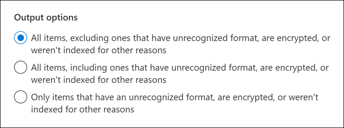

# 匯出內容搜尋報告

您可以匯出實際搜尋結果時所產生的報表，而不是從 Microsoft 365 合規性中心的內容搜尋中匯出完整的搜尋結果集合 (或從與核心 eDiscovery 案例) 相關聯的搜尋中匯出。
  
當您匯出報告時，報告檔案會下載至本機電腦上與內容搜尋同名的資料夾，但附加 *_ReportsOnly*。 例如，如果內容搜尋命名為  *ContosoCase0815*，則會將報告下載至名為 *ContosoCase0815_ReportsOnly* 的資料夾。 如需報告中所包含檔的清單，請參閱 [報告的內容](#whats-included-in-the-report)。

## 匯出搜尋報告之前

- 若要匯出搜尋報告，您必須在安全性 & 合規性中心內指派符合性搜尋管理角色。 此角色預設會指派給內建的 eDiscovery 管理員和組織管理角色群組。 如需詳細資訊，請參閱[指派電子文件探索權限](assign-ediscovery-permissions.md)。

- 當您匯出報告時，資料會暫時儲存在 Microsoft 雲端的 Azure 儲存體位置，然後再下載到本機電腦。 確定您的組織可以連線到 Azure 中的端點，也就是 **\* blob.core.windows.net** (此萬用字元代表匯出) 的唯一識別碼。 搜尋結果資料會在建立後的兩周內從 Azure 儲存體位置刪除。

- 您用來匯出搜尋結果的電腦必須符合下列系統需求：

  - 最新版本的 Windows (32 位或 64-位) 

  - Microsoft .NET Framework 4.7

- 您必須使用下列其中一種支援的瀏覽器執行 eDiscovery 匯出工具1：

  - Microsoft Edge 2

    或

  - Microsoft Internet Explorer 10 和更新版本

  > [!NOTE]
  > 1 Microsoft 不會製造協力廠商擴充模組或 ClickOnce 應用程式的附加元件。 使用不受支援的瀏覽器匯出搜尋結果時，不支援協力廠商分機或附加元件。 
  > 2因為 Microsoft Edge 的最近變更，所以預設不再啟用 ClickOnce 支援。 如需在 Edge 中啟用 ClickOnce 支援的相關指示，請參閱[使用 Microsoft Edge 中的 eDiscovery 匯出工具](configure-edge-to-export-search-results.md)。

- 如果搜尋傳回的結果總大小超過 2 TB，則匯出報告會失敗。 若要順利匯出報告，請嘗試縮小範圍並重新執行搜尋，使結果的預估大小小於 2 TB。

- 如果搜尋結果超過7天，且提交匯出報告工作，則會顯示錯誤訊息，提示您重新執行搜尋以更新搜尋結果。 如果發生這種情況，請取消匯出，然後重新執行搜尋，然後再次開始匯出。

- 匯出搜尋報告時，會依據同時執行的匯出數目上限，以及單一使用者可執行檔匯出數目上限而進行計數。 如需匯出限制的相關資訊，請參閱 [匯出內容搜尋結果](export-search-results.md#export-limits)。
  
## 步驟1：產生要匯出的報告

第一步是準備報表，以下載至電腦匯出。 當您匯出報告時，報表檔會上傳至 Microsoft 雲端的 Azure 儲存體區域。
  
1. 在 [Microsoft 365 規範中心] 中，選取您要從中匯出報告的內容搜尋。
  
2. 在 [搜尋飛出] 頁面底部的 [ **動作** ] 功能表上，按一下 [ **匯出報告**]。

   ![[動作] 功能表中的匯出報表選項](../media/ActionMenuExportReport.png)

   [ **匯出報告** 飛出] 頁面隨即顯示。 可用於匯出搜尋資訊的匯出報告選項，取決於搜尋結果是位於信箱或網站中，或是兩者的組合。
  
3. 在 [ **輸出選項**] 底下，選擇下列其中一個選項：
  
   

    - **所有專案（不包括具有無法辨識格式的專案）都會加密，或是未以其他原因為索引**。 此選項只會匯出索引項目目的相關資訊。
  
    - **所有專案（包括具有無法辨識格式的專案）都會加密，或是未以其他原因為索引**。 這個選項會匯出有關索引及未編制索引之專案的資訊。
  
    - **僅限未辨識格式的專案、已加密或尚未為其他原因編制索引**。 此選項只會匯出未編制索引項目目的相關資訊。

4. 設定 [**啟用 Exchange 內容的重復資料** 刪除] 選項。
  
   - 如果您選取此選項，則會在 [匯出摘要報告] 中包含重復資料刪除之前 (的重複郵件計數和重復資料消除) 。 此外，只有一份郵件副本會包含在 manifest.xml 檔中。 但「匯出結果報告」會包含重複郵件之每個副本的資料列，以便您識別包含重複郵件複本的信箱。 如需有關匯出報告的詳細資訊，請參閱 [報告中包含的內容](#whats-included-in-the-report)。

   - 如果您未選取此選項，則匯出報告將會包含有關搜尋傳回之所有郵件的資訊，包含重複專案。

     如需有關重復資料刪除以及如何識別重複專案的詳細資訊，請參閱 [eDiscovery 搜尋結果中的重復資料](de-duplication-in-ediscovery-search-results.md)刪除。

5. 按一下 [ **產生報告**]。

   搜尋報告已準備好下載，這表示會將報告檔上傳至 Microsoft 雲端的 Azure 儲存體位置。 可能會花幾分鐘的時間。

如需下載匯出之搜尋報告的指示，請參閱下一節。
  
## 步驟2：下載報表

下一步是將報表從 Azure 儲存體區域下載到您的本機電腦。

1. 在 Microsoft 365 規範中心的 [**內容搜尋**] 頁面上，選取 [**匯出**] 索引標籤
  
   您可能 **需要按一下 [** 重新整理] 以更新匯出工作清單，使其顯示您建立的匯出工作。 匯出報告工作與對應的搜尋同名，但 **_ReportsOnly** 附加至搜尋名稱。
  
2. 選取您在步驟1中建立的匯出工作。

3. 按一下 [**匯出索引鍵**] 底下的 [**匯出報告**] 頁面上的 [**複製到剪貼** 簿]。 您可以在步驟6中使用此機碼下載搜尋結果。
  
   > [!IMPORTANT]
   > 由於任何人都可以安裝並啟動 eDiscovery 匯出工具，然後使用此機碼來下載搜尋報告，請務必採取預防措施來保護此機碼，就像您保護密碼或其他安全性相關的資訊一樣。

4. 按一下彈出頁面頂端的 [ **下載結果**]。

5. 如果系統提示您安裝 **EDiscovery 匯出工具**，請按一下 [ **安裝**]。

6. 在 [ **EDiscovery 匯出工具**] 中，執行下列動作：

   

   1. 在適當的方塊中貼上您在步驟3中複製的匯出金鑰。
  
   2. 按一下 **[流覽]** 以指定您要下載搜尋報告檔案的位置。

7. 按一下 [開始] 將搜尋結果下載至您的電腦。
  
    **EDiscovery 匯出工具** 會顯示匯出程式的狀態資訊，包括估計要下載之其餘專案的數位 (和大小) 。 匯出程式完成後，您可以在下載檔案的位置存取檔案。
  
## 報告中包含的內容

當您產生及匯出內容搜尋結果的報告時，會下載下列檔：
  
- **匯出摘要：** 包含匯出摘要的 Excel 檔。 這包括下列資訊：搜尋的內容來源數目、每個內容位置的搜尋結果數目、預估的專案數、要匯出的實際專案數，以及所要匯出之專案的預估和實際大小。

   如果您在匯出報告時包含未編制索引的專案，則未編制索引的專案數會包含在預估的搜尋結果總數和下載之搜尋結果的總數中，如果您要匯出的搜尋結果) 所列于 [匯出摘要] 報告中的結果 (。 換句話說，將下載的專案總數等於估計的結果總數和未編制索引的專案總數。
  
- **資訊清單：** 包含搜尋結果中所包含之每個專案相關資訊的資訊清單檔案 (以 XML 格式) 。 如果您已啟用 [重復資料刪除] 選項，則不會在資訊清單檔案中包含重複的郵件。

- **結果：** 包含一列的 Excel 檔，其中包含每個要連同搜尋結果一起匯出之索引項目目的相關資訊。 針對電子郵件，結果記錄檔包含每封郵件的相關資訊，包括： 

  - 來源信箱中郵件的位置 (，包含郵件是在主要或封存信箱) 中。

  - 傳送或接收郵件的日期。

  - 郵件的主旨行。

  - 郵件的寄件者和收件者。

  針對來自 SharePoint 和商務用 OneDrive 網站的檔，結果記錄檔包含每個檔的相關資訊，包括：

  - 檔的 URL。

  - 檔所在之網站集合的 URL。

  - 上次修改檔的日期。

  - 位於結果記錄檔的 [主旨] 欄中的檔 (名稱) 。

  > [!NOTE]
  > **結果** 報告中的列數應該等於搜尋結果的總數減去 [未 **編制索引的專案**] 報告中所列的總專案數。
  
- **蹤跡：記錄** 檔，包含匯出程式的詳細記錄資訊，可協助您在匯出期間發現問題。 如果您使用 Microsoft 支援部門開啟與匯出搜尋報告相關的問題，可能會要求您提供此追蹤記錄檔。

- 未 **編制索引的專案：** Excel 檔，包含搜尋結果中所包含之任何未編制索引項目目的相關資訊。 如果您在產生搜尋結果報告時未包含未編制索引的專案，則此報告仍會下載，但會是空的。
