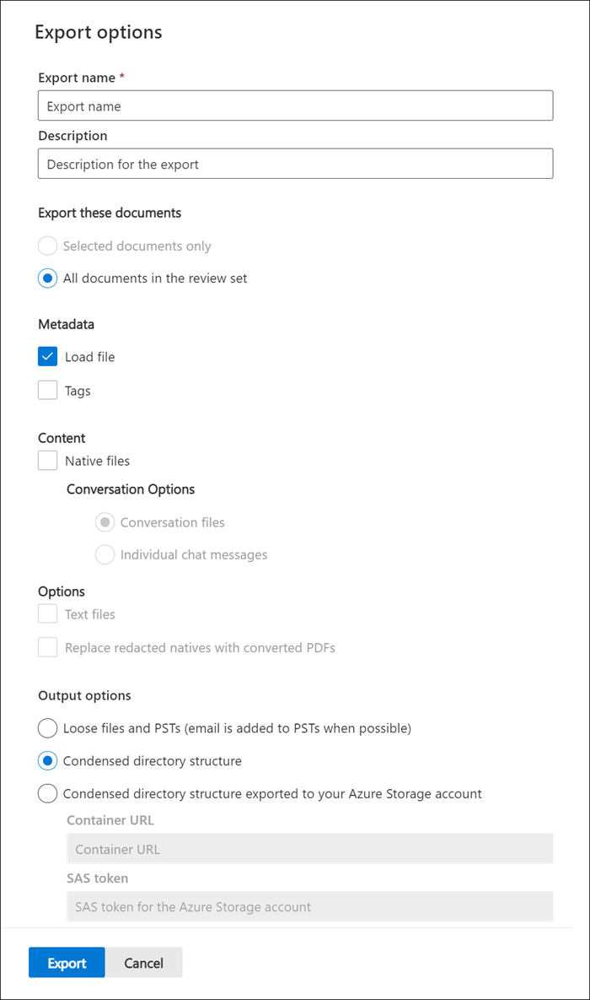

# 從高級 eDiscovery 的審閱集中匯出檔

匯出功能可讓使用者自訂下載套件所包含的內容。 匯出工具提供具有下列設定的設定頁面：

## 匯出選項

- 匯出名稱：匯出工作的名稱。

- 描述：可讓您新增描述的自由文字欄位。

- 匯出下列檔：

  - 僅限選取的檔-只匯出目前選取的檔。
  
  - 審閱集合中的所有檔-匯出審閱集中的所有檔

- 中繼資料
  
  - 載入檔-此檔案包含每個檔案的中繼資料。 如需包含哪些欄位的詳細資訊，請參閱 [Advanced eDiscovery 中的檔元資料欄位](document-metadata-fields-in-Advanced-eDiscovery.md)。 這個檔案通常可由協力廠商的 eDiscovery 工具來 ingested。
  
  - 標記-選取時，標籤資訊將會包含在載入檔中。

- 內容
  
  - 原生檔案-選取此核取方塊以包含原生檔案。
  
  - 交談選項
    
    - 交談檔案-匯出會重新構建聊天訊息。 這種格式會顯示與使用者在原生應用程式中看到的外觀類似的對話。
    
    - 個別聊天訊息-當原始交談檔案儲存在 Microsoft 365 中時，將其匯出。

- 選項

  - 文字檔-包括解壓縮的原生文字檔版本。
  
  - Replace redacted natives with 已轉換的 Pdf-如果審閱時產生 redacted PDF 檔案，這些檔案可供匯出。 您可以選擇只匯出 redacted (的原生檔案，但不要選取此選項) 或選取此選項，即可匯出包含實際密文的 PDF 檔案。

-  (匯出內容的輸出選項可透過網頁瀏覽器直接下載，或是可以傳送至 Azure 儲存體帳戶。 前兩個選項可讓您直接下載。 ) 
  
  - 鬆散檔案和 Pst (電子郵件會在可能的情況) 中，以類似使用者在原生應用程式中所看到之原始目錄結構的格式來匯出時，新增至 Pst。  如需詳細資訊，請參閱 [鬆散檔案及 PST 匯出結構](#loose-files-and-pst-export-structure) 一節。
  
  - 緊縮的目錄結構-檔會匯出並包含在下載中。
  
  - 匯出至您的 Azure 儲存體帳戶的壓縮目錄結構-檔案會匯出至您組織的 Azure 儲存體帳戶。

## 鬆散檔與 PST 匯出結構

如果您選取此匯出選項，匯出的內容會以下列結構組織：

- 根資料夾–此資料夾命名為 ExportName.zip
  
  - Export_load_file.csv 元資料檔案。
  
  - Summary.csv-也包含匯出統計資料的摘要檔案。
  
  - Exchange-此資料夾包含所有來自 Exchange 的內容，以原生檔案格式。 如果您選取 [ **以轉換的 Pdf 取代 redacted Natives** ] 選項，則 Natives 檔案會取代為 redacted pdf。
  
  - SharePoint = 此資料夾包含以原生檔案格式 SharePoint 的所有本機內容。 如果您選取 [ **以轉換的 Pdf 取代 redacted Natives** ] 選項，則 Natives 檔案會取代為 redacted pdf。

## 緊縮目錄結構

- 根資料夾-此資料夾命名為 ExportName.zip
  
  - Export_load_file.csv 元資料檔案。
  
  - Summary.txt-也包含匯出統計資料的摘要檔案。
  
  - Input_or_native_files-此資料夾包含所有已匯出的原生檔案。 如果您匯出的是 redacted PDF 檔案，則不會放入 PST 檔案。 相反地，它們會新增至分開的資料夾。
  
  - Error_files-此資料夾包含下列錯誤檔案（如果它們包含在匯出中）：
    
    - ExtractionError. CSV 檔案，其中包含未從父系檔案正確提取之任何可用之檔案的中繼資料。
    
    - ProcessingError –此檔案包含含處理錯誤的檔案清單。 此內容屬於專案層級，也就是說，如果附件導致處理錯誤，則包含附件的電子郵件會包含在此資料夾中。
  
  - Extracted_text_files-此資料夾包含在處理時所產生的所有解壓縮文字檔。

> [!NOTE]
> 匯出工作會在案例週期內保留。 不過，您必須在匯出工作完成後的30天內，從匯出工作下載內容。
