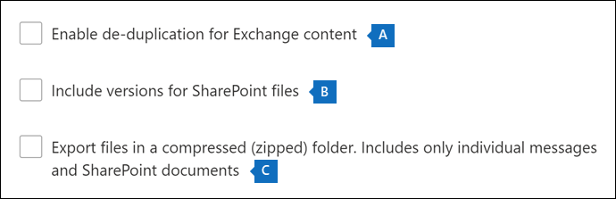

# <a name="export-content-search-results"></a><span data-ttu-id="91275-105">匯出內容搜尋結果</span><span class="sxs-lookup"><span data-stu-id="91275-105">Export Content search results</span></span>

<span data-ttu-id="91275-106">內容搜尋成功執行後，您可以將搜尋結果匯出至本機電腦。</span><span class="sxs-lookup"><span data-stu-id="91275-106">After a Content search is successfully run, you can export the search results to a local computer.</span></span> <span data-ttu-id="91275-107">當您匯出電子郵件結果時，其會以 PST 檔案下載到您的電腦。</span><span class="sxs-lookup"><span data-stu-id="91275-107">When you export email results, they're downloaded to your computer as PST files.</span></span> <span data-ttu-id="91275-108">當您從 SharePoint 和商務用 OneDrive 網站匯出內容時，會匯出原生 Office 檔的副本。</span><span class="sxs-lookup"><span data-stu-id="91275-108">When you export content from SharePoint and OneDrive for Business sites, copies of native Office documents are exported.</span></span> <span data-ttu-id="91275-109">匯出的搜尋結果中包含其他檔和報表。</span><span class="sxs-lookup"><span data-stu-id="91275-109">There are other documents and reports included with the exported search results.</span></span>
  
<span data-ttu-id="91275-110">匯出內容搜尋的結果包含準備結果，然後將其下載到本機電腦。</span><span class="sxs-lookup"><span data-stu-id="91275-110">Exporting the results of a Content search involves preparing the results, and then downloading them to a local computer.</span></span>
  
## <a name="before-you-export-search-results"></a><span data-ttu-id="91275-111">在您匯出搜尋結果之前</span><span class="sxs-lookup"><span data-stu-id="91275-111">Before you export search results</span></span>

- <span data-ttu-id="91275-112">若要匯出搜尋結果，您必須在安全性 & 合規性中心內指派「匯出管理」角色。</span><span class="sxs-lookup"><span data-stu-id="91275-112">To export search results, you have to be assigned the Export management role in Security & Compliance Center.</span></span> <span data-ttu-id="91275-113">此角色會指派給內建的 eDiscovery 管理員角色群組。</span><span class="sxs-lookup"><span data-stu-id="91275-113">This role is assigned to the built-in eDiscovery Manager role group.</span></span> <span data-ttu-id="91275-114">組織管理角色群組預設不會指派給它。</span><span class="sxs-lookup"><span data-stu-id="91275-114">It isn't assigned by default to the Organization Management role group.</span></span> <span data-ttu-id="91275-115">如需詳細資訊，請參閱[指派電子文件探索權限](assign-ediscovery-permissions.md)。</span><span class="sxs-lookup"><span data-stu-id="91275-115">For more information, see [Assign eDiscovery permissions](assign-ediscovery-permissions.md).</span></span>

- <span data-ttu-id="91275-116">您用來匯出搜尋結果的電腦必須符合下列系統需求：</span><span class="sxs-lookup"><span data-stu-id="91275-116">The computer you use to export the search results has to meet the following system requirements:</span></span>
  
  - <span data-ttu-id="91275-117">最新版本的 Windows (32 位或 64-位) </span><span class="sxs-lookup"><span data-stu-id="91275-117">Latest version of Windows (32-bit or 64-bit)</span></span>
  
  - <span data-ttu-id="91275-118">Microsoft .NET Framework 4.7</span><span class="sxs-lookup"><span data-stu-id="91275-118">Microsoft .NET Framework 4.7</span></span>
  
- <span data-ttu-id="91275-119">您必須使用下列其中一種支援的瀏覽器執行 eDiscovery 匯出工具<sup>1</sup>：</span><span class="sxs-lookup"><span data-stu-id="91275-119">You have to use one of the following supported browsers to run the eDiscovery Export Tool<sup>1</sup>:</span></span>

  - <span data-ttu-id="91275-120">Microsoft Edge <sup>2</sup></span><span class="sxs-lookup"><span data-stu-id="91275-120">Microsoft Edge <sup>2</sup></span></span>
  
    <span data-ttu-id="91275-121">或</span><span class="sxs-lookup"><span data-stu-id="91275-121">OR</span></span>

  - <span data-ttu-id="91275-122">Microsoft Internet Explorer 10 和更新版本</span><span class="sxs-lookup"><span data-stu-id="91275-122">Microsoft Internet Explorer 10 and later versions</span></span>
  
  > [!NOTE]
  > <span data-ttu-id="91275-123"><sup>1</sup> Microsoft 不會製造協力廠商擴充模組或 ClickOnce 應用程式的附加元件。</span><span class="sxs-lookup"><span data-stu-id="91275-123"><sup>1</sup> Microsoft doesn't manufacture third-party extensions or add-ons for ClickOnce applications.</span></span> <span data-ttu-id="91275-124">使用不受支援的瀏覽器匯出搜尋結果時，不支援協力廠商分機或附加元件。</span><span class="sxs-lookup"><span data-stu-id="91275-124">Exporting search results using an unsupported browser with third-party extensions or add-ons isn't supported.</span></span><br/>
  > <span data-ttu-id="91275-125"><sup>2</sup>因為 Microsoft Edge 的最近變更，所以預設不再啟用 ClickOnce 支援。</span><span class="sxs-lookup"><span data-stu-id="91275-125"><sup>2</sup> As a result of recent changes to Microsoft Edge, ClickOnce support is no longer enabled by default.</span></span> <span data-ttu-id="91275-126">如需在 Edge 中啟用 ClickOnce 支援的相關指示，請參閱[使用 Microsoft Edge 中的 eDiscovery 匯出工具](configure-edge-to-export-search-results.md)。</span><span class="sxs-lookup"><span data-stu-id="91275-126">For instructions on enabling ClickOnce support in Edge, see [Use the eDiscovery Export Tool in Microsoft Edge](configure-edge-to-export-search-results.md).</span></span>
  
- <span data-ttu-id="91275-127">建議您將搜尋結果下載到本機電腦。</span><span class="sxs-lookup"><span data-stu-id="91275-127">We recommend downloading search results to a local computer.</span></span> <span data-ttu-id="91275-128">若要避免公司的防火牆或 proxy 基礎結構在下載搜尋結果時導致問題，您可以考慮將搜尋結果下載至您的網路以外的虛擬桌面。</span><span class="sxs-lookup"><span data-stu-id="91275-128">To eliminate your company's firewall or proxy infrastructure from causing issues when downloading search results, you might consider downloading search results to a virtual desktop outside of your network.</span></span> <span data-ttu-id="91275-129">這可能會降低匯出大量檔案時，Azure 資料連線中發生的超時。</span><span class="sxs-lookup"><span data-stu-id="91275-129">This may decrease timeouts that occur in Azure data connections when exporting a large number of files.</span></span> <span data-ttu-id="91275-130">如需虛擬桌面的詳細資訊，請參閱[Windows 虛擬機器](https://azure.microsoft.com/services/virtual-desktop)。</span><span class="sxs-lookup"><span data-stu-id="91275-130">For more information about virtual desktops, see [Windows Virtual Desktop](https://azure.microsoft.com/services/virtual-desktop).</span></span>

- <span data-ttu-id="91275-131">若要在下載搜尋結果時改善效能，請考慮將傳回一組大型結果的搜尋分割成較小的搜尋。</span><span class="sxs-lookup"><span data-stu-id="91275-131">To improve performance when downloading search results, consider dividing searches that return a large set of results into smaller searches.</span></span> <span data-ttu-id="91275-132">例如，您可以在搜尋查詢中使用日期範圍，以傳回較小的結果集，可更快速地下載。</span><span class="sxs-lookup"><span data-stu-id="91275-132">For example, you can use date ranges in search queries to return a smaller set of results that can be downloaded faster.</span></span>
  
- <span data-ttu-id="91275-133">當您匯出搜尋結果時，資料會暫時儲存在 microsoft 雲端的 microsoft 雲端 Azure 儲存體位置中，然後再下載到本機電腦。</span><span class="sxs-lookup"><span data-stu-id="91275-133">When you export search results, the data is temporarily stored in a Microsoft-provided Azure Storage location in the Microsoft cloud before it's downloaded to your local computer.</span></span> <span data-ttu-id="91275-134">確定您的組織可以連線到 Azure 中的端點，也就是 **\* blob.core.windows.net** (此萬用字元代表匯出) 的唯一識別碼。</span><span class="sxs-lookup"><span data-stu-id="91275-134">Be sure that your organization can connect to the endpoint in Azure, which is **\*.blob.core.windows.net** (the wildcard represents a unique identifier for your export).</span></span> <span data-ttu-id="91275-135">搜尋結果資料會在建立後的兩周內從 Azure 儲存體位置刪除。</span><span class="sxs-lookup"><span data-stu-id="91275-135">The search results data is deleted from the Azure Storage location two weeks after it's created.</span></span> 
  
- <span data-ttu-id="91275-136">如果您的組織使用 proxy 伺服器與網際網路通訊，您必須在您用來匯出搜尋 (結果的電腦上，定義 proxy 伺服器設定，讓 proxy 伺服器能夠驗證匯出工具) 。</span><span class="sxs-lookup"><span data-stu-id="91275-136">If your organization uses a proxy server to communicate with the Internet, you need to define the proxy server settings on the computer that you use to export the search results (so the export tool can be authenticated by your proxy server).</span></span> <span data-ttu-id="91275-137">若要這麼做，請在符合您 Windows 版本的位置中，開啟 *machine.config* 檔案。</span><span class="sxs-lookup"><span data-stu-id="91275-137">To do this, open the  *machine.config*  file in the location that matches your version of Windows.</span></span> 
  
  - <span data-ttu-id="91275-138">**32 位：**`%windir%\Microsoft.NET\Framework\[version]\Config\machine.config`</span><span class="sxs-lookup"><span data-stu-id="91275-138">**32-bit:** `%windir%\Microsoft.NET\Framework\[version]\Config\machine.config`</span></span>
  
  - <span data-ttu-id="91275-139">**64 位：**`%windir%\Microsoft.NET\Framework64\[version]\Config\machine.config`</span><span class="sxs-lookup"><span data-stu-id="91275-139">**64-bit:** `%windir%\Microsoft.NET\Framework64\[version]\Config\machine.config`</span></span>
  
    <span data-ttu-id="91275-140">在 [和] 標記之間的  *machine.config*  檔案中新增下列行  `<configuration>`  `</configuration>` 。</span><span class="sxs-lookup"><span data-stu-id="91275-140">Add the following lines to the  *machine.config*  file somewhere between the  `<configuration>` and  `</configuration>` tags.</span></span> <span data-ttu-id="91275-141">請務必以您的組織來取代  `ProxyServer` 和  `Port` 正確的值; 例如， `proxy01.contoso.com:80` 。</span><span class="sxs-lookup"><span data-stu-id="91275-141">Be sure to replace  `ProxyServer` and  `Port` with the correct values for your organization; for example, `proxy01.contoso.com:80`.</span></span> 
  
    ```xml
    <system.net>
       <defaultProxy enabled="true" useDefaultCredentials="true">
         <proxy proxyaddress="https://ProxyServer :Port " 
                usesystemdefault="False" 
                bypassonlocal="True" 
                autoDetect="False" />
       </defaultProxy>
    </system.net>
    ```

- <span data-ttu-id="91275-142">如果內容搜尋的結果超過7天，而您提交匯出工作，就會顯示錯誤訊息，提示您重新執行搜尋以更新搜尋結果。</span><span class="sxs-lookup"><span data-stu-id="91275-142">If the results of a Content search are older than 7 days and you submit an export job, an error message is displayed prompting you to rerun the search to update the search results.</span></span> <span data-ttu-id="91275-143">如果發生這種情況，請取消匯出，然後重新執行搜尋，然後再次開始匯出。</span><span class="sxs-lookup"><span data-stu-id="91275-143">If this happens, cancel the export, rerun the search, and then start the export again.</span></span>

## <a name="step-1-prepare-search-results-for-export"></a><span data-ttu-id="91275-144">步驟1：準備要匯出的搜尋結果</span><span class="sxs-lookup"><span data-stu-id="91275-144">Step 1: Prepare search results for export</span></span>

<span data-ttu-id="91275-145">第一步是準備要匯出的搜尋結果。</span><span class="sxs-lookup"><span data-stu-id="91275-145">The first step is to prepare the search results for exporting.</span></span> <span data-ttu-id="91275-146">當您準備結果時，會將其上傳至 microsoft 雲端中的 microsoft 提供 Azure 儲存體位置。</span><span class="sxs-lookup"><span data-stu-id="91275-146">When you prepare results, they are uploaded to a Microsoft-provided Azure Storage location in the Microsoft cloud.</span></span> <span data-ttu-id="91275-147">以每小時 2 GB 的最大速率上載信箱和網站的內容。</span><span class="sxs-lookup"><span data-stu-id="91275-147">Content from mailboxes and sites is uploaded at a maximum rate of 2 GB per hour.</span></span>
  
1. <span data-ttu-id="91275-148">在 [Microsoft 365 規範中心] 中，選取您要從中匯出結果的內容搜尋。</span><span class="sxs-lookup"><span data-stu-id="91275-148">In the Microsoft 365 compliance center, select the content search that you want to export results from.</span></span>
  
2. <span data-ttu-id="91275-149">在飛入頁面底部的 [ **動作** ] 功能表上，按一下 [ **匯出結果**]。</span><span class="sxs-lookup"><span data-stu-id="91275-149">On the **Actions** menu at the bottom of the flyout page, click **Export results**.</span></span>

   ![[動作] 功能表中的 [匯出結果] 選項](../media/ActionMenuExportResults.png)

   <span data-ttu-id="91275-151">[ **匯出結果** 飛出] 頁面隨即顯示。</span><span class="sxs-lookup"><span data-stu-id="91275-151">The **Export results** flyout page is displayed.</span></span> <span data-ttu-id="91275-152">匯出內容時可用的匯出選項，取決於搜尋結果位於信箱或網站中，或是兩者的組合。</span><span class="sxs-lookup"><span data-stu-id="91275-152">The export options available to export content depend on whether search results are located in mailboxes or sites or a combination of both.</span></span>

3. <span data-ttu-id="91275-153">在 [ **輸出選項**] 底下，選擇下列其中一個選項：</span><span class="sxs-lookup"><span data-stu-id="91275-153">Under **Output options**, choose one of the following options:</span></span>
  
   

    - <span data-ttu-id="91275-155">**所有專案（不包括具有無法辨識格式的專案）都會加密，或是未以其他原因為索引**。</span><span class="sxs-lookup"><span data-stu-id="91275-155">**All items, excluding ones that have unrecognized format, are encrypted, or weren't indexed for other reasons**.</span></span> <span data-ttu-id="91275-156">此選項只會匯出已編制索引的專案。</span><span class="sxs-lookup"><span data-stu-id="91275-156">This option exports only indexed items.</span></span>
  
    - <span data-ttu-id="91275-157">**所有專案（包括具有無法辨識格式的專案）都會加密，或是未以其他原因為索引**。</span><span class="sxs-lookup"><span data-stu-id="91275-157">**All items, including ones that have unrecognized format, are encrypted, or weren't indexed for other reasons**.</span></span> <span data-ttu-id="91275-158">這個選項會匯出索引及未編制索引的專案。</span><span class="sxs-lookup"><span data-stu-id="91275-158">This option exports indexed and unindexed items.</span></span>
  
    - <span data-ttu-id="91275-159">**僅限未辨識格式的專案、已加密或尚未為其他原因編制索引**。</span><span class="sxs-lookup"><span data-stu-id="91275-159">**Only items that have an unrecognized format, are encrypted, or weren't indexed for other reasons**.</span></span> <span data-ttu-id="91275-160">此選項只會匯出未編制索引的專案。</span><span class="sxs-lookup"><span data-stu-id="91275-160">This option exports only unindexed items.</span></span>

      <span data-ttu-id="91275-161">請參閱 [More information](#more-information) 一節以取得如何匯出部分索引項目目的描述。</span><span class="sxs-lookup"><span data-stu-id="91275-161">See the [More information](#more-information) section for a description about how partially indexed items are exported.</span></span> <span data-ttu-id="91275-162">如需部分索引項目目的詳細資訊，請參閱 [內容搜尋中已部分索引的專案](partially-indexed-items-in-content-search.md)。</span><span class="sxs-lookup"><span data-stu-id="91275-162">For more information about partially indexed items, see [Partially indexed items in Content search](partially-indexed-items-in-content-search.md).</span></span>

4. <span data-ttu-id="91275-163">在 [ **Exchange 內容匯出為**] 底下，選擇下列其中一個選項：</span><span class="sxs-lookup"><span data-stu-id="91275-163">Under **Export Exchange content as**, choose one of the following options:</span></span>
  
   

    - <span data-ttu-id="91275-165">**每個信箱一個 pst** 檔案：針對包含搜尋結果的每個使用者信箱，匯出一個 pst 檔案。</span><span class="sxs-lookup"><span data-stu-id="91275-165">**One PST file for each mailbox**: Exports one PST file for each user mailbox that contains search results.</span></span> <span data-ttu-id="91275-166">任何來自使用者封存信箱的結果都會包含在同一個 PST 檔案中。</span><span class="sxs-lookup"><span data-stu-id="91275-166">Any results from the user's archive mailbox are included in the same PST file.</span></span> <span data-ttu-id="91275-167">此選項會將信箱資料夾結構從來源信箱中再現。</span><span class="sxs-lookup"><span data-stu-id="91275-167">This option reproduces the mailbox folder structure from the source mailbox.</span></span>
  
    - <span data-ttu-id="91275-168">**包含所有郵件的一個 pst** 檔案：會從包含在搜尋中的所有來源信箱中包含搜尋結果的單一 pst 檔案 (匯出 *Exchange .pst) 。*</span><span class="sxs-lookup"><span data-stu-id="91275-168">**One PST file containing all messages**: Exports a single PST file (named *Exchange.pst*) that contains the search results from all source mailboxes included in the search.</span></span> <span data-ttu-id="91275-169">此選項會為每封郵件再現信箱資料夾結構。</span><span class="sxs-lookup"><span data-stu-id="91275-169">This option reproduces the mailbox folder structure for each message.</span></span>
  
    - <span data-ttu-id="91275-170">**一個 pst 檔案包含單一資料夾中的所有郵件**：將搜尋結果匯出到單一 PST 檔案，其中所有郵件都位於單一的最上層資料夾中。</span><span class="sxs-lookup"><span data-stu-id="91275-170">**One PST file containing all messages in a single folder**: Exports search results to a single PST file where all messages are located in a single, top-level folder.</span></span> <span data-ttu-id="91275-171">此選項可讓檢閱者以時間順序查看專案 (專案會依傳送日期排序) 而不必流覽每個專案的原始信箱資料夾結構。</span><span class="sxs-lookup"><span data-stu-id="91275-171">This option lets reviewers review items in chronological order (items are sorted by sent date) without having to navigate the original mailbox folder structure for each item.</span></span>
  
    - <span data-ttu-id="91275-172">**個別郵件**：使用 .msg 格式，將搜尋結果匯出為個別的電子郵件訊息。</span><span class="sxs-lookup"><span data-stu-id="91275-172">**Individual messages**: Exports search results as individual email messages, using the .msg format.</span></span> <span data-ttu-id="91275-173">如果您選取此選項，電子郵件搜尋結果會匯出至檔案系統中的資料夾。</span><span class="sxs-lookup"><span data-stu-id="91275-173">If you select this option, email search results are exported to a folder in the file system.</span></span> <span data-ttu-id="91275-174">個別郵件的資料夾路徑與您將結果匯出至 PST 檔案時所使用的相同。</span><span class="sxs-lookup"><span data-stu-id="91275-174">The folder path for individual messages is the same as the one used if you exported the results to a PST file.</span></span>
  
5. <span data-ttu-id="91275-175">設定下列其他選項：</span><span class="sxs-lookup"><span data-stu-id="91275-175">Configure the following additional options:</span></span>

   

   1. <span data-ttu-id="91275-177">選取 [**啟用 Exchange 內容的重復資料消除**] 核取方塊，以排除重複的郵件。</span><span class="sxs-lookup"><span data-stu-id="91275-177">Select the **Enable de-duplication for Exchange content** checkbox to exclude duplicate messages.</span></span>
  
      <span data-ttu-id="91275-178">如果您選取此選項，則即使在搜尋的信箱中找到多個相同郵件複本，也只會匯出郵件的一個副本。</span><span class="sxs-lookup"><span data-stu-id="91275-178">If you select this option, only one copy of a message will be exported even if multiple copies of the same message are found in the mailboxes that were searched.</span></span> <span data-ttu-id="91275-179">「匯出結果」報告 (是名為 Results.csv) 的檔案，將會包含重複郵件之每個副本的列，以便您識別包含重複郵件複本的信箱 (或公用資料夾) 。</span><span class="sxs-lookup"><span data-stu-id="91275-179">The export results report (which is a file named Results.csv) will contain a row for every copy of a duplicate message so that you can identify the mailboxes (or public folders) that contain a copy of the duplicate message.</span></span> <span data-ttu-id="91275-180">如需有關重復資料刪除以及如何識別重複專案的詳細資訊，請參閱 [eDiscovery 搜尋結果中的重復資料](de-duplication-in-ediscovery-search-results.md)刪除。</span><span class="sxs-lookup"><span data-stu-id="91275-180">For more information about de-duplication and how duplicate items are identified, see [De-duplication in eDiscovery search results](de-duplication-in-ediscovery-search-results.md).</span></span>
  
   2. <span data-ttu-id="91275-181">選取 [**包含版本的 SharePoint** 檔案] 核取方塊，以匯出 SharePoint 檔的所有版本。</span><span class="sxs-lookup"><span data-stu-id="91275-181">Select the **Include versions for SharePoint files** checkbox to export all versions of SharePoint documents.</span></span> <span data-ttu-id="91275-182">只有在搜尋的內容來源包含 SharePoint 或商務用 OneDrive 網站時，才會顯示此選項。</span><span class="sxs-lookup"><span data-stu-id="91275-182">This option appears only if the content sources of the search include SharePoint or OneDrive for Business sites.</span></span>
  
   3. <span data-ttu-id="91275-183">選取 [**壓縮 (zipped) 資料夾中的匯出檔案。只包含個別郵件和 SharePoint 檔**] 核取方塊，以將搜尋結果匯出至壓縮資料夾。</span><span class="sxs-lookup"><span data-stu-id="91275-183">Select the **Export files in a compressed (zipped) folder. Includes only individual messages and SharePoint documents** checkbox to export search results to compressed folders.</span></span> <span data-ttu-id="91275-184">只有當您選擇將 Exchange 專案匯出為個別郵件，以及搜尋結果包括 SharePoint 或 OneDrive 檔時，才會出現此選項。</span><span class="sxs-lookup"><span data-stu-id="91275-184">This option appears only when you choose to export Exchange items as individual messages and when the search results include SharePoint or OneDrive documents.</span></span> <span data-ttu-id="91275-185">此選項主要是用來在匯出專案時，在 Windows 檔案路徑名稱中，避免260字元的限制。</span><span class="sxs-lookup"><span data-stu-id="91275-185">This option is primarily used to work around the 260 character limit in Windows file path names when items are exported.</span></span> <span data-ttu-id="91275-186">請參閱 [More information](#more-information) 一節中的「匯出的專案的檔案名」。</span><span class="sxs-lookup"><span data-stu-id="91275-186">See the "Filenames of exported items" in the [More information](#more-information) section.</span></span>
  
6. <span data-ttu-id="91275-187">按一下 [ **匯出** ] 以啟動匯出程式。</span><span class="sxs-lookup"><span data-stu-id="91275-187">Click **Export** to start the export process.</span></span> <span data-ttu-id="91275-188">搜尋結果已準備好下載，這表示它們是從原始內容位置收集，然後上傳至 Microsoft 雲端中的 Azure 儲存體位置。</span><span class="sxs-lookup"><span data-stu-id="91275-188">The search results are prepared for downloading, which means they're collected from the original content locations and then uploaded to an Azure Storage location in the Microsoft cloud.</span></span> <span data-ttu-id="91275-189">可能會花幾分鐘的時間。</span><span class="sxs-lookup"><span data-stu-id="91275-189">This may take several minutes.</span></span>

<span data-ttu-id="91275-190">如需下載匯出之搜尋結果的指示，請參閱下一節。</span><span class="sxs-lookup"><span data-stu-id="91275-190">See the next section for instructions to download the exported search results.</span></span>
  
## <a name="step-2-download-the-search-results"></a><span data-ttu-id="91275-191">步驟2：下載搜尋結果</span><span class="sxs-lookup"><span data-stu-id="91275-191">Step 2: Download the search results</span></span>

<span data-ttu-id="91275-192">下一步是從 Azure 儲存體位置將搜尋結果下載至您的本機電腦。</span><span class="sxs-lookup"><span data-stu-id="91275-192">The next step is to download the search results from the Azure Storage location to your local computer.</span></span>
  
1. <span data-ttu-id="91275-193">在 Microsoft 365 規範中心的 [**內容搜尋**] 頁面上，選取 [**匯出**] 索引標籤</span><span class="sxs-lookup"><span data-stu-id="91275-193">On the **Content search** page in the Microsoft 365 compliance center, select the **Exports** tab</span></span>
  
   <span data-ttu-id="91275-194">您可能 **需要按一下 [** 重新整理] 以更新匯出工作清單，使其顯示您建立的匯出工作。</span><span class="sxs-lookup"><span data-stu-id="91275-194">You may have to click **Refresh** to update the list of export jobs so that it shows the export job you created.</span></span> <span data-ttu-id="91275-195">匯出工作與對應的搜尋同名， **_Export** 附加至搜尋名稱。</span><span class="sxs-lookup"><span data-stu-id="91275-195">Export jobs have the same name as the corresponding search with **_Export** appended to the search name.</span></span>
  
2. <span data-ttu-id="91275-196">選取您在步驟1中建立的匯出工作。</span><span class="sxs-lookup"><span data-stu-id="91275-196">Select the export job that you created in Step 1.</span></span>

3. <span data-ttu-id="91275-197">在 [ **匯出索引鍵**] 底下的飛入頁面上，按一下 [ **複製到剪貼** 簿]。</span><span class="sxs-lookup"><span data-stu-id="91275-197">On the flyout page under **Export key**, click **Copy to clipboard**.</span></span> <span data-ttu-id="91275-198">您可以在步驟6中使用此機碼下載搜尋結果。</span><span class="sxs-lookup"><span data-stu-id="91275-198">You use this key in step 6 to download the search results.</span></span>
  
   > [!IMPORTANT]
   > <span data-ttu-id="91275-199">由於任何人都可以安裝並啟動 eDiscovery 匯出工具，然後使用此機碼來下載搜尋結果，請務必採取預防措施，像是保護密碼或其他安全性相關資訊一樣加以保護。</span><span class="sxs-lookup"><span data-stu-id="91275-199">Because anyone can install and start the eDiscovery Export tool, and then use this key to download the search results, be sure to take precautions to protect this key just like you would protect passwords or other security-related information.</span></span>

4. <span data-ttu-id="91275-200">按一下彈出頁面頂端的 [ **下載結果**]。</span><span class="sxs-lookup"><span data-stu-id="91275-200">At the top of the flyout page, click **Download results**.</span></span>

5. <span data-ttu-id="91275-201">如果系統提示您安裝 **EDiscovery 匯出工具**，請按一下 [ **安裝**]。</span><span class="sxs-lookup"><span data-stu-id="91275-201">If you're prompted to install the **eDiscovery Export Tool**, click **Install**.</span></span>

6. <span data-ttu-id="91275-202">在 [ **EDiscovery 匯出工具**] 中，執行下列動作：</span><span class="sxs-lookup"><span data-stu-id="91275-202">In the **eDiscovery Export Tool**, do the following:</span></span>

   

   1. <span data-ttu-id="91275-204">在適當的方塊中貼上您在步驟3中複製的匯出金鑰。</span><span class="sxs-lookup"><span data-stu-id="91275-204">Paste the export key that you copied in step 3 in the appropriate box.</span></span>
  
   2. <span data-ttu-id="91275-205">按一下 [瀏覽] 以指定搜尋結果檔案要下載到的位置。</span><span class="sxs-lookup"><span data-stu-id="91275-205">Click **Browse** to specify the location where you want to download the search result files.</span></span>
  
      > [!IMPORTANT]
      >  <span data-ttu-id="91275-206">由於下載過程中的網路活動過高，所以您應該只將搜尋結果下載至本機電腦上的內部磁片磁碟機上的某個位置。</span><span class="sxs-lookup"><span data-stu-id="91275-206">Due to high network activity during download, you should download search results only to a location on an internal drive on your local computer.</span></span> <span data-ttu-id="91275-207">如需最佳下載體驗，請遵循下列指導方針：</span><span class="sxs-lookup"><span data-stu-id="91275-207">For the best download experience, follow these guidelines:</span></span> <br/>
      >- <span data-ttu-id="91275-208">不要將搜尋結果下載至 UNC 路徑、對應網路磁碟機、外部 USB 磁片磁碟機或同步的商務用 OneDrive 帳戶。</span><span class="sxs-lookup"><span data-stu-id="91275-208">Don't download search results to a UNC path, a mapped network drive, an external USB drive, or a synched OneDrive for Business account.</span></span><br/>
      >- <span data-ttu-id="91275-209">針對下載搜尋結果的資料夾停用防病毒掃描。</span><span class="sxs-lookup"><span data-stu-id="91275-209">Disable anti-virus scanning for the folder that you download the search result to.</span></span><br/>
      >- <span data-ttu-id="91275-210">將搜尋結果下載至不同的資料夾，以進行並行下載工作。</span><span class="sxs-lookup"><span data-stu-id="91275-210">Download search results to different folders for concurrent download jobs.</span></span>

6. <span data-ttu-id="91275-211">按一下 [開始] 將搜尋結果下載至您的電腦。</span><span class="sxs-lookup"><span data-stu-id="91275-211">Click **Start** to download the search results to your computer.</span></span>
  
    <span data-ttu-id="91275-212">**EDiscovery 匯出工具** 會顯示匯出程式的狀態資訊，包括估計要下載之其餘專案的數位 (和大小) 。</span><span class="sxs-lookup"><span data-stu-id="91275-212">The **eDiscovery Export Tool** displays status information about the export process, including an estimate of the number (and size) of the remaining items to be downloaded.</span></span> <span data-ttu-id="91275-213">匯出程式完成後，您可以在下載檔案的位置存取檔案。</span><span class="sxs-lookup"><span data-stu-id="91275-213">When the export process is complete, you can access the files in the location where they were downloaded.</span></span>

## <a name="more-information"></a><span data-ttu-id="91275-214">其他資訊</span><span class="sxs-lookup"><span data-stu-id="91275-214">More information</span></span>

<span data-ttu-id="91275-215">以下是匯出搜尋結果的詳細資訊。</span><span class="sxs-lookup"><span data-stu-id="91275-215">Here's more information about exporting search results.</span></span>
  
[<span data-ttu-id="91275-216">匯出限制</span><span class="sxs-lookup"><span data-stu-id="91275-216">Export limits</span></span>](#export-limits)
  
[<span data-ttu-id="91275-217">匯出報告</span><span class="sxs-lookup"><span data-stu-id="91275-217">Export reports</span></span>](#export-reports)
  
[<span data-ttu-id="91275-218">匯出部分索引項目目</span><span class="sxs-lookup"><span data-stu-id="91275-218">Exporting partially indexed items</span></span>](#exporting-partially-indexed-items)

[<span data-ttu-id="91275-219">匯出個別郵件或 PST 檔案</span><span class="sxs-lookup"><span data-stu-id="91275-219">Exporting individual messages or PST files</span></span>](#exporting-individual-messages-or-pst-files)

[<span data-ttu-id="91275-220">解密受 RMS 保護的電子郵件和加密檔附件</span><span class="sxs-lookup"><span data-stu-id="91275-220">Decrypting RMS-protected email messages and encrypted file attachments</span></span>](#decrypting-rms-protected-email-messages-and-encrypted-file-attachments)

[<span data-ttu-id="91275-221">匯出專案的檔案名</span><span class="sxs-lookup"><span data-stu-id="91275-221">Filenames of exported items</span></span>](#filenames-of-exported-items)  
  
[<span data-ttu-id="91275-222">其他工作</span><span class="sxs-lookup"><span data-stu-id="91275-222">Miscellaneous</span></span>](#miscellaneous)
  
### <a name="export-limits"></a><span data-ttu-id="91275-223">匯出限制</span><span class="sxs-lookup"><span data-stu-id="91275-223">Export limits</span></span>

<span data-ttu-id="91275-224">如需匯出內容搜尋結果時限制的相關資訊，請參閱 [內容搜尋限制](limits-for-content-search.md#export-limits)中的「匯出限制」一節。</span><span class="sxs-lookup"><span data-stu-id="91275-224">For information about limits when exporting content search results, see the "Export limits" section in [Limits for content search](limits-for-content-search.md#export-limits).</span></span>

### <a name="export-reports"></a><span data-ttu-id="91275-225">匯出報告</span><span class="sxs-lookup"><span data-stu-id="91275-225">Export reports</span></span>
  
- <span data-ttu-id="91275-226">當您匯出搜尋結果時，除了搜尋結果之外，還會包含下列報告。</span><span class="sxs-lookup"><span data-stu-id="91275-226">When you export search results, the following reports are included in addition to the search results.</span></span>
  
  - <span data-ttu-id="91275-227">**匯出摘要** 包含匯出摘要的 Excel 檔。</span><span class="sxs-lookup"><span data-stu-id="91275-227">**Export Summary** An Excel document that contains a summary of the export.</span></span> <span data-ttu-id="91275-228">這包括下列資訊：搜尋的內容來源數目、搜尋結果的預估和下載大小，以及已匯出專案的預估和下載數目。</span><span class="sxs-lookup"><span data-stu-id="91275-228">This includes information such as the number of content sources that were searched, the estimated and downloaded sizes of the search results, and the estimated and downloaded number of items that were exported.</span></span>
  
  - <span data-ttu-id="91275-229">**資訊清單** 包含搜尋結果中所包含之每個專案相關資訊的資訊清單檔案 (以 XML 格式) 。</span><span class="sxs-lookup"><span data-stu-id="91275-229">**Manifest** A manifest file (in XML format) that contains information about each item included in the search results.</span></span>
  
  - <span data-ttu-id="91275-230">**結果** 包含每個專案的相關資訊的 Excel 檔，該專案會做為搜尋結果下載。</span><span class="sxs-lookup"><span data-stu-id="91275-230">**Results** An Excel document that contains information about each item that is download as a search result.</span></span> <span data-ttu-id="91275-231">針對電子郵件，結果記錄檔包含每封郵件的相關資訊，包括：</span><span class="sxs-lookup"><span data-stu-id="91275-231">For email, the result log contains information about each message, including:</span></span>
  
    - <span data-ttu-id="91275-232">來源信箱中郵件的位置 (，包含郵件是在主要或封存信箱) 中。</span><span class="sxs-lookup"><span data-stu-id="91275-232">The location of the message in the source mailbox (including whether the message is in the primary or archive mailbox).</span></span>
  
    - <span data-ttu-id="91275-233">傳送或接收郵件的日期。</span><span class="sxs-lookup"><span data-stu-id="91275-233">The date the message was sent or received.</span></span>

    - <span data-ttu-id="91275-234">郵件的主旨行。</span><span class="sxs-lookup"><span data-stu-id="91275-234">The Subject line from the message.</span></span>

    - <span data-ttu-id="91275-235">郵件的寄件者和收件者。</span><span class="sxs-lookup"><span data-stu-id="91275-235">The sender and recipients of the message.</span></span>

    - <span data-ttu-id="91275-236">當您在匯出搜尋結果時啟用重復資料刪除選項時，郵件是否是重複的郵件。</span><span class="sxs-lookup"><span data-stu-id="91275-236">Whether the message is a duplicate message if you enabled the de-duplication option when exporting the search results.</span></span> <span data-ttu-id="91275-237">重複郵件的 [ **重複目的專案** ] 欄中的值會將郵件識別為重複郵件。</span><span class="sxs-lookup"><span data-stu-id="91275-237">Duplicate messages have a value in the **Duplicate to Item** column that identifies the message as a duplicate.</span></span> <span data-ttu-id="91275-238">[ **重複專案** ] 欄中的值包含匯出之郵件的專案身分識別。</span><span class="sxs-lookup"><span data-stu-id="91275-238">The value in the **Duplicate to Item** column contains the item identity of the message that was exported.</span></span> <span data-ttu-id="91275-239">如需詳細資訊，請參閱 [eDiscovery 搜尋結果中的重復資料](de-duplication-in-ediscovery-search-results.md)刪除。</span><span class="sxs-lookup"><span data-stu-id="91275-239">For more information, see [De-duplication in eDiscovery search results](de-duplication-in-ediscovery-search-results.md).</span></span>

      <span data-ttu-id="91275-240">針對來自 SharePoint 和商務用 OneDrive 網站的檔，結果記錄檔包含每個檔的相關資訊，包括：</span><span class="sxs-lookup"><span data-stu-id="91275-240">For documents from SharePoint and OneDrive for Business sites, the result log contains information about each document, including:</span></span>

      - <span data-ttu-id="91275-241">檔的 URL。</span><span class="sxs-lookup"><span data-stu-id="91275-241">The URL for the document.</span></span>

      - <span data-ttu-id="91275-242">檔所在之網站集合的 URL。</span><span class="sxs-lookup"><span data-stu-id="91275-242">The URL for the site collection where the document is located.</span></span>

      - <span data-ttu-id="91275-243">上次修改檔的日期。</span><span class="sxs-lookup"><span data-stu-id="91275-243">The date that the document was last modified.</span></span>

      - <span data-ttu-id="91275-244">位於結果記錄檔的 [主旨] 欄中的檔 (名稱) 。</span><span class="sxs-lookup"><span data-stu-id="91275-244">The name of the document (which is located in the Subject column in the result log).</span></span>

  - <span data-ttu-id="91275-245">未 **編制索引的專案** Excel 檔，其中包含搜尋結果中所包含之任何部分索引項目目的相關資訊。</span><span class="sxs-lookup"><span data-stu-id="91275-245">**Unindexed Items** An Excel document that contains information about any partially indexed items that would be included in the search results.</span></span> <span data-ttu-id="91275-246">如果您在產生搜尋結果報告時未加入部分索引項目目，則此報告仍會下載，但會是空的。</span><span class="sxs-lookup"><span data-stu-id="91275-246">If you don't include partially indexed items when you generate the search results report, this report will still be downloaded, but will be empty.</span></span>

  - <span data-ttu-id="91275-247">**錯誤和警告** 包含匯出期間所發生之檔案的錯誤和警告。</span><span class="sxs-lookup"><span data-stu-id="91275-247">**Errors and Warnings** Contains errors and warnings for files encountered during export.</span></span> <span data-ttu-id="91275-248">請參閱 [錯誤詳細資料] 欄，以取得每個個別錯誤或警告的特定資訊。</span><span class="sxs-lookup"><span data-stu-id="91275-248">See the Error Details column for information specific to each individual error or warning.</span></span>

  - <span data-ttu-id="91275-249">**略過的專案** 當您從 SharePoint 和商務用 OneDrive 網站中匯出搜尋結果時，匯出通常會包含 [略過的專案] 報告 (SkippedItems.csv) 。</span><span class="sxs-lookup"><span data-stu-id="91275-249">**Skipped Items** When you export search results from SharePoint and OneDrive for Business sites, the export will usually include a skipped items report (SkippedItems.csv).</span></span> <span data-ttu-id="91275-250">在此報告中提及的專案通常是不會下載的專案，例如資料夾或檔組。</span><span class="sxs-lookup"><span data-stu-id="91275-250">The items cited in this report are typically items that won't be downloaded, such as a folder or a document set.</span></span> <span data-ttu-id="91275-251">不是依照設計方式匯出這些專案類型。</span><span class="sxs-lookup"><span data-stu-id="91275-251">Not exporting these types of items is by design.</span></span> <span data-ttu-id="91275-252">對於略過的其他專案，[略過的專案] 報告中的「錯誤類型」和「錯誤詳細資料」欄位會顯示略過專案的原因，而且不會與其他搜尋結果一起下載。</span><span class="sxs-lookup"><span data-stu-id="91275-252">For other items that were skipped, the 'Error Type' and 'Error Details' field in the skipped items report show the reason the item was skipped and wasn't downloaded with the other search results.</span></span>

  - <span data-ttu-id="91275-253">**追蹤 .log 記錄** 檔包含匯出程式的詳細記錄資訊，可協助您找出匯出期間的問題。</span><span class="sxs-lookup"><span data-stu-id="91275-253">**Trace.log** Contains detailed logging information about the export process and can help uncover issues during export.</span></span> <span data-ttu-id="91275-254">如果您使用 Microsoft 支援部門開啟有關匯出搜尋結果的相關問題，您可能需要提供此追蹤記錄檔。</span><span class="sxs-lookup"><span data-stu-id="91275-254">If you open a ticket with Microsoft Support about an issue related to exporting search results, you may be asked to provide this trace log.</span></span>
  
    > [!NOTE]
    > <span data-ttu-id="91275-255">您可以只匯出這些檔，而不需要匯出實際的搜尋結果。</span><span class="sxs-lookup"><span data-stu-id="91275-255">You can just export these documents without having to export the actual search results.</span></span> <span data-ttu-id="91275-256">請參閱 [匯出內容搜尋報告](export-a-content-search-report.md)。</span><span class="sxs-lookup"><span data-stu-id="91275-256">See [Export a Content search report](export-a-content-search-report.md).</span></span>
  
### <a name="exporting-partially-indexed-items"></a><span data-ttu-id="91275-257">匯出部分索引項目目</span><span class="sxs-lookup"><span data-stu-id="91275-257">Exporting partially indexed items</span></span>
  
- <span data-ttu-id="91275-258">如果您要從內容搜尋中匯出信箱專案，而該搜尋會傳回搜尋結果中的所有信箱專案 (因為搜尋查詢中所包含的關鍵字並未包含在搜尋查詢中) ，所以部分編制索引的專案不會複製到包含未編制索引項目目的 PST 檔案中。</span><span class="sxs-lookup"><span data-stu-id="91275-258">If you're exporting mailbox items from a content search that returns all mailbox items in the search results (because no keywords where included in the search query), partially indexed items won't be copied to the PST file that contains the unindexed items.</span></span> <span data-ttu-id="91275-259">這是因為所有專案（包括任何已部分索引的專案）都會自動包含在一般搜尋結果中。</span><span class="sxs-lookup"><span data-stu-id="91275-259">This is because all items, including any partially indexed items, are automatically included in the regular search results.</span></span> <span data-ttu-id="91275-260">這表示部分編制索引的專案會包含在 PST 檔案 (或個別郵件中，) 包含其他的已編制索引的專案。</span><span class="sxs-lookup"><span data-stu-id="91275-260">This means that partially indexed items will be included in a PST file (or as individual messages) that contains the other, indexed items.</span></span>

    <span data-ttu-id="91275-261">如果您同時匯出已編制索引及部分索引的專案，或是只從傳回所有專案的內容搜尋中匯出索引項目目，則會下載相同數目的專案。</span><span class="sxs-lookup"><span data-stu-id="91275-261">If you export both the indexed and partially indexed items or if you export only the indexed items from a content search that returns all items, the same number of items will be downloaded.</span></span> <span data-ttu-id="91275-262">即使在安全性 & 規範中心的搜尋統計資料中顯示內容搜尋 (的估計搜尋結果，) 仍然會包含對部分索引項目目數目的個別估計。</span><span class="sxs-lookup"><span data-stu-id="91275-262">This happens even though the estimated search results for the content search (displayed in the search statistics in the Security & Compliance Center) will still include a separate estimate for the number of partially indexed items.</span></span> <span data-ttu-id="91275-263">例如，假設搜尋的估計包含的所有專案 (搜尋查詢中沒有關鍵詞) 會顯示找到1000個專案，而且也找到200部分索引的專案。</span><span class="sxs-lookup"><span data-stu-id="91275-263">For example, let's say that the estimate for a search that includes all items (no keywords in the search query) shows that 1,000 items were found and that 200 partially indexed items were also found.</span></span> <span data-ttu-id="91275-264">在此情況下，1000專案會包含部分索引的專案，因為搜尋會傳回所有專案。</span><span class="sxs-lookup"><span data-stu-id="91275-264">In this case, the 1,000 items include the partially indexed items because the search returns all items.</span></span> <span data-ttu-id="91275-265">換句話說，搜尋傳回的專案總數為1000，而不是1200的專案 (您預期的) 。</span><span class="sxs-lookup"><span data-stu-id="91275-265">In other words, there are 1,000 total items returned by the search, and not 1,200 items (as you might expect).</span></span> <span data-ttu-id="91275-266">如果您匯出此搜尋的結果，並選擇匯出已編制索引和部分索引的專案 (或只匯出已部分索引的專案) ，則會下載1000個專案。</span><span class="sxs-lookup"><span data-stu-id="91275-266">If you export the results of this search and choose to export indexed and partially indexed items (or export only partially indexed items), then 1,000 items will be downloaded.</span></span> <span data-ttu-id="91275-267">同樣地，這是因為在您使用空白搜尋查詢傳回所有專案時，會以一般 (編制索引) 結果的方式包含部分編制索引的專案。</span><span class="sxs-lookup"><span data-stu-id="91275-267">Again, that's because partially indexed items are included with the regular (indexed) results when you use a blank search query to return all items.</span></span> <span data-ttu-id="91275-268">在這個範例中，如果您選擇只匯出部分索引項目目，則只會下載200未編制索引的專案。</span><span class="sxs-lookup"><span data-stu-id="91275-268">In this same example, if you choose to export only partially indexed items, then only the 200 unindexed items would be downloaded.</span></span>

    <span data-ttu-id="91275-269">另外請注意，在上一個範例中 (當您匯出已編制索引及部分索引的專案，或是只匯出已編制索引的) 專案時，匯出的搜尋結果所包含的 **匯出摘要** 報告會列出1000專案（如先前所述的相同原因），估計專案和1000下載專案。</span><span class="sxs-lookup"><span data-stu-id="91275-269">Also note that in the previous example (when you export indexed and partially indexed items or you export only indexed items), the **Export Summary** report included with the exported search results would list 1,000 items estimated items and 1,000 downloaded items for the same reasons as previously described.</span></span> 

- <span data-ttu-id="91275-270">如果您要從中匯出結果的搜尋是搜尋特定的內容位置或組織中的所有內容位置，則只會匯出內容位置中包含符合搜尋準則之專案的部分專案。</span><span class="sxs-lookup"><span data-stu-id="91275-270">If the search that you're exporting results from was a search of specific content locations or all content locations in your organization, only the partial items from content locations that contain items that match the search criteria will be exported.</span></span> <span data-ttu-id="91275-271">換句話說，如果在信箱或網站中找不到任何搜尋結果，則不會匯出該信箱或網站中的任何已編制索引的專案。</span><span class="sxs-lookup"><span data-stu-id="91275-271">In other words, if no search results are found in a mailbox or site, then any partially indexed items in that mailbox or site won't be exported.</span></span> <span data-ttu-id="91275-272">其原因是匯出組織中大量位置的部分索引項目目時，可能會增加匯出錯誤的可能性，並增加匯出及下載搜尋結果所需的時間。</span><span class="sxs-lookup"><span data-stu-id="91275-272">The reason for this is that exporting partially indexed items from lots of locations in the organization might increase the likelihood of export errors and increase the time it takes to export and download the search results.</span></span>

    <span data-ttu-id="91275-273">若要從搜尋的所有內容位置匯出已部分索引的專案，請將搜尋設定為從搜尋查詢移除任何關鍵字，以傳回所有專案 () 然後在匯出搜尋結果時，只匯出部分索引的專案。</span><span class="sxs-lookup"><span data-stu-id="91275-273">To export partially indexed items from all content locations for a search, configure the search to return all items (by removing any keywords from the search query) and then export only partially indexed items when you export the search results.</span></span>

    
  
- <span data-ttu-id="91275-275">從 SharePoint 或商務用 OneDrive 網站匯出搜尋結果時，匯出未編制索引的專案的能力也取決於您選取的匯出選項，以及所搜尋的網站是否包含符合搜尋準則的索引項目目。</span><span class="sxs-lookup"><span data-stu-id="91275-275">When exporting search results from SharePoint or OneDrive for Business sites, the ability to export unindexed items also depends on the export option that you select and whether a site that was searched contains an indexed item that matches the search criteria.</span></span> <span data-ttu-id="91275-276">例如，如果您搜尋特定的 SharePoint 或商務用 OneDrive 網站，但找不到任何搜尋結果，則當您選擇第二個匯出選項來匯出已編制索引及未編制索引的專案時，將不會匯出這些網站中未編制索引的專案。</span><span class="sxs-lookup"><span data-stu-id="91275-276">For example, if you search specific SharePoint or OneDrive for Business sites and no search results are found, then no unindexed items from those sites will be exported if you choose the second export option to export both indexed and unindexed items.</span></span> <span data-ttu-id="91275-277">如果網站的索引項目目符合搜尋準則，則當您匯出索引及未編制索引的專案時，會匯出該網站的所有未編制索引的專案。</span><span class="sxs-lookup"><span data-stu-id="91275-277">If an indexed item from a site does match the search criteria, then all unindexed items from that site will be exported when exporting both indexed and unindexed items.</span></span> <span data-ttu-id="91275-278">下圖說明根據網站是否包含符合搜尋準則之索引項目目的匯出選項。</span><span class="sxs-lookup"><span data-stu-id="91275-278">The following illustration describes the export options based on whether a site contains an indexed item that matches the search criteria.</span></span>

    ![根據網站是否包含符合搜尋準則的索引項目目，選擇 [匯出] 選項](../media/94f78786-c6bb-42fb-96b3-7ea3998bcd39.png)

    <span data-ttu-id="91275-280">a.</span><span class="sxs-lookup"><span data-stu-id="91275-280">a.</span></span> <span data-ttu-id="91275-281">只會匯出符合搜尋準則的索引項目目。</span><span class="sxs-lookup"><span data-stu-id="91275-281">Only indexed items that match the search criteria are exported.</span></span> <span data-ttu-id="91275-282">不會匯出部分索引的專案。</span><span class="sxs-lookup"><span data-stu-id="91275-282">No partially indexed items are exported.</span></span>

    <span data-ttu-id="91275-283">b.</span><span class="sxs-lookup"><span data-stu-id="91275-283">b.</span></span> <span data-ttu-id="91275-284">如果網站上沒有任何已編制索引的專案符合搜尋準則，則不會匯出從該相同網站部分編制索引的專案。</span><span class="sxs-lookup"><span data-stu-id="91275-284">If no indexed items from a site match the search criteria, then partially indexed items from that same site aren't exported.</span></span> <span data-ttu-id="91275-285">如果在搜尋結果中傳回來自某一網站的索引項目目，則會匯出該網站的部分已編制索引的專案。</span><span class="sxs-lookup"><span data-stu-id="91275-285">If indexed items from a site are returned in the search results, then the partially indexed items from that site are exported.</span></span> <span data-ttu-id="91275-286">換句話說，只會匯出包含符合搜尋準則之專案之網站的部分索引項目目。</span><span class="sxs-lookup"><span data-stu-id="91275-286">In other words, only the partially indexed items from sites that contain items that match the search criteria are exported.</span></span>

    <span data-ttu-id="91275-287">c.</span><span class="sxs-lookup"><span data-stu-id="91275-287">c.</span></span> <span data-ttu-id="91275-288">不論網站是否包含符合搜尋準則的專案，所有來自搜尋中之網站的部分已編制索引的專案都會匯出。</span><span class="sxs-lookup"><span data-stu-id="91275-288">All partially indexed items from all sites in the search are exported, regardless of whether a site contains items that match the search criteria.</span></span>

    <span data-ttu-id="91275-289">如果您選擇匯出部分編制索引的專案，則會在個別的 PST 檔案中匯出部分索引的信箱專案，而不論您在 [**匯出 Exchange 內容為**] 下選擇哪個選項。</span><span class="sxs-lookup"><span data-stu-id="91275-289">If you choose to export partially indexed items, partially indexed mailbox items are exported in a separate PST file regardless of the option that you choose under **Export Exchange content as**.</span></span>

- <span data-ttu-id="91275-290">如果在搜尋結果中傳回部分索引項目目 (由於部分索引項目目的其他屬性符合搜尋準則) ，則會以一般搜尋結果匯出的部分編制索引項目目。</span><span class="sxs-lookup"><span data-stu-id="91275-290">If partially indexed items are returned in the search results (because other properties of partially indexed items matched the search criteria), then those partially indexed are exported with the regular search results.</span></span> <span data-ttu-id="91275-291">因此，如果您選擇 [ **所有專案（包括具有未辨識格式的專案** ]、[已加密] 或 [未根據其他原因編制索引]) 選項，則會 (匯出索引項目目和部分索引項目目，則會在 [Results.csv] 報告中列出與一般結果一起匯出的部分索引項目目。</span><span class="sxs-lookup"><span data-stu-id="91275-291">So, if you choose to export both indexed items and partially indexed items (by selecting the **All items, including ones that have unrecognized format, are encrypted, or weren't indexed for other reasons** export option), the partially indexed items exported with the regular results will be listed in the Results.csv report.</span></span> <span data-ttu-id="91275-292">它們不會列在未編制索引的 items.csv 報告中。</span><span class="sxs-lookup"><span data-stu-id="91275-292">They will not be listed in the Unindexed items.csv report.</span></span>
  
### <a name="exporting-individual-messages-or-pst-files"></a><span data-ttu-id="91275-293">匯出個別郵件或 PST 檔案</span><span class="sxs-lookup"><span data-stu-id="91275-293">Exporting individual messages or PST files</span></span>
  
- <span data-ttu-id="91275-294">如果郵件的檔案路徑名稱超過 Windows 的最大字元數限制，則會截斷檔路徑名稱。</span><span class="sxs-lookup"><span data-stu-id="91275-294">If the file path name of a message exceeds the maximum character limit for Windows, the file path name is truncated.</span></span> <span data-ttu-id="91275-295">但原始的檔案路徑名稱會列在資訊清單和 ResultsLog 中。</span><span class="sxs-lookup"><span data-stu-id="91275-295">But the original file path name will be listed in the Manifest and ResultsLog.</span></span>
  
- <span data-ttu-id="91275-296">如先前所述，電子郵件搜尋結果會匯出至檔案系統中的資料夾。</span><span class="sxs-lookup"><span data-stu-id="91275-296">As previously explained, email search results are exported to a folder in the file system.</span></span> <span data-ttu-id="91275-297">個別郵件的資料夾路徑會複製使用者信箱中的資料夾路徑。</span><span class="sxs-lookup"><span data-stu-id="91275-297">The folder path for individual messages would replicate the folder path in the user's mailbox.</span></span> <span data-ttu-id="91275-298">例如，在使用者的 [收件匣] 中，名為 "ContosoCase101" 郵件的搜尋會位於資料夾路徑中  `~ContosoCase101\\<date of export\Exchange\user@contoso.com (Primary)\Top of Information Store\Inbox` 。</span><span class="sxs-lookup"><span data-stu-id="91275-298">For example, for a search named "ContosoCase101" messages in a user's inbox would be located in the folder path  `~ContosoCase101\\<date of export\Exchange\user@contoso.com (Primary)\Top of Information Store\Inbox`.</span></span>

- <span data-ttu-id="91275-299">如果您選擇在包含單一資料夾中的所有郵件的一個 PST 檔案中匯出電子郵件，則 [ **刪除的郵件** ] 資料夾及 [ **搜尋資料夾** ] 資料夾都會包含在 pst 資料夾的最上層。</span><span class="sxs-lookup"><span data-stu-id="91275-299">If you choose to export email messages in one PST file containing all messages in a single folder, a **Deleted Items** folder and a **Search Folders** folder are included in the top level of the PST folder.</span></span> <span data-ttu-id="91275-300">這些資料夾是空白的。</span><span class="sxs-lookup"><span data-stu-id="91275-300">These folders are empty.</span></span>

- <span data-ttu-id="91275-301">如先前所述，您必須將電子郵件搜尋結果匯出為個別郵件，以在匯出受 RMS 保護的郵件時加以解密。</span><span class="sxs-lookup"><span data-stu-id="91275-301">As previously stated, you must export email search results as individual messages to decrypt RMS-protected messages when they're exported.</span></span> <span data-ttu-id="91275-302">將電子郵件搜尋結果匯出為 PST 檔案時，加密郵件會保持加密。</span><span class="sxs-lookup"><span data-stu-id="91275-302">Encrypted messages will remain encrypted if you export email search results as a PST file.</span></span>
  
### <a name="decrypting-rms-protected-email-messages-and-encrypted-file-attachments"></a><span data-ttu-id="91275-303">解密受 RMS 保護的電子郵件和加密檔附件</span><span class="sxs-lookup"><span data-stu-id="91275-303">Decrypting RMS-protected email messages and encrypted file attachments</span></span>

<span data-ttu-id="91275-304">匯出內容搜尋結果時所包含的任何受版權保護 () 電子郵件都會解密。</span><span class="sxs-lookup"><span data-stu-id="91275-304">Any rights-protected (RMS-protected) email messages included in the results of a Content search will be decrypted when you export them.</span></span> <span data-ttu-id="91275-305">此外，任何以 [Microsoft 加密技術](encryption.md) 加密的檔案，也會附加到搜尋結果中包含的電子郵件時，也會在匯出時進行解密。</span><span class="sxs-lookup"><span data-stu-id="91275-305">Additionally, any file that's encrypted with a [Microsoft encryption technology](encryption.md) and is attached to an email message that's included in the search results will also be decrypted when it's exported.</span></span> <span data-ttu-id="91275-306">預設會為 eDiscovery 管理員角色群組的成員啟用此解密功能。</span><span class="sxs-lookup"><span data-stu-id="91275-306">This decryption capability is enabled by default for members of the eDiscovery Manager role group.</span></span> <span data-ttu-id="91275-307">這是因為根據預設，RMS 解密管理角色會指派給此角色群組。</span><span class="sxs-lookup"><span data-stu-id="91275-307">This is because the RMS Decrypt management role is assigned to this role group by default.</span></span> <span data-ttu-id="91275-308">匯出加密的電子郵件訊息和附件時，請牢記下列事項：</span><span class="sxs-lookup"><span data-stu-id="91275-308">Keep the following things in mind when exporting encrypted email messages and attachments:</span></span>
  
- <span data-ttu-id="91275-309">如先前所述，若要在您匯出受 RMS 保護的郵件時進行解密，您必須將搜尋結果匯出為個別郵件。</span><span class="sxs-lookup"><span data-stu-id="91275-309">As previously explained, to decrypt RMS-protected messages when you export them, you have to export the search results as individual messages.</span></span> <span data-ttu-id="91275-310">如果您將搜尋結果匯出至 PST 檔案，RMS 保護的郵件會保持加密。</span><span class="sxs-lookup"><span data-stu-id="91275-310">If you export search results to a PST file, RMS-protected messages remain encrypted.</span></span>

- <span data-ttu-id="91275-311">解密的郵件會在 **ResultsLog** 報告中識別。</span><span class="sxs-lookup"><span data-stu-id="91275-311">Messages that are decrypted are identified in the **ResultsLog** report.</span></span> <span data-ttu-id="91275-312">此報告包含名為 **解碼狀態** 的欄，以及此欄中 **解碼** 的值會識別已解密的郵件。</span><span class="sxs-lookup"><span data-stu-id="91275-312">This report contains a column named **Decode Status**, and a value of **Decoded** in this column identifies the messages that were decrypted.</span></span>

- <span data-ttu-id="91275-313">在匯出搜尋結果時，除了解密檔附件之外，您也可以在預覽搜尋結果時預覽解密的檔案。</span><span class="sxs-lookup"><span data-stu-id="91275-313">In addition to decrypting file attachments when exporting search results, you can also preview the decrypted file when previewing search results.</span></span> <span data-ttu-id="91275-314">匯出受版權保護的電子郵件之後，您才可以查看該郵件。</span><span class="sxs-lookup"><span data-stu-id="91275-314">You can only view the rights-protected email message after you export it.</span></span>

- <span data-ttu-id="91275-315">目前，匯出搜尋結果時的解密功能不會包含 SharePoint 和商務用 OneDrive 網站中的加密內容。</span><span class="sxs-lookup"><span data-stu-id="91275-315">At this time, the decryption capability when exporting search results doesn't include encrypted content from SharePoint and OneDrive for Business sites.</span></span> <span data-ttu-id="91275-316">不過，對於使用 Microsoft 加密技術加密的檔，以及儲存在線上 SharePoint 和商務用 OneDrive 中的檔，都即將提供支援。</span><span class="sxs-lookup"><span data-stu-id="91275-316">However, support is coming soon for documents encrypted with Microsoft encryption technologies and stored in SharePoint Online and OneDrive for Business.</span></span>

- <span data-ttu-id="91275-317">如果您需要防止某人解密 RMS 保護郵件和加密的檔案附件，您必須在) 中建立內建的 eDiscovery Manager 角色群組，然後從自訂角色群組中移除 RMS 解密管理角色，以建立自訂角色群組 (。</span><span class="sxs-lookup"><span data-stu-id="91275-317">If you need to prevent someone from decrypting RMS-protect messages and encrypted file attachments, you have to create a custom role group (by copying the built-in eDiscovery Manager role group) and then remove the RMS Decrypt management role from the custom role group.</span></span> <span data-ttu-id="91275-318">然後將您不想要將郵件解密的人員新增為自訂角色群組的成員。</span><span class="sxs-lookup"><span data-stu-id="91275-318">Then add the person who you don't want to decrypt messages as a member of the custom role group.</span></span>
  
### <a name="filenames-of-exported-items"></a><span data-ttu-id="91275-319">匯出專案的檔案名</span><span class="sxs-lookup"><span data-stu-id="91275-319">Filenames of exported items</span></span>
  
- <span data-ttu-id="91275-320">) 作業系統 (強加電子郵件訊息的完整路徑名稱和匯出至本機電腦的網站檔，都有260個字元的限制。</span><span class="sxs-lookup"><span data-stu-id="91275-320">There is a 260-character limit (imposed by the operating system) for the full path name for email messages and site documents exported to your local computer.</span></span> <span data-ttu-id="91275-321">匯出專案的完整路徑名稱包含專案的原始位置，以及將搜尋結果下載到本機電腦上的資料夾位置。</span><span class="sxs-lookup"><span data-stu-id="91275-321">The full path name for exported items includes the item's original location and the folder location on the local computer where the search results are downloaded to.</span></span> <span data-ttu-id="91275-322">例如，如果您指定將搜尋結果下載至  `C:\Users\Admin\Desktop\SearchResults` EDiscovery 匯出工具，則下載的電子郵件專案的完整路徑名  `C:\Users\Admin\Desktop\SearchResults\ContentSearch1\03.15.2017-1242PM\Exchange\sarad@contoso.com (Primary)\Top of Information Store\Inbox\Insider trading investigation.msg` 。</span><span class="sxs-lookup"><span data-stu-id="91275-322">For example, if you specify to download the search results to  `C:\Users\Admin\Desktop\SearchResults` in the eDiscovery Export tool, then the full pathname for a downloaded email item would be  `C:\Users\Admin\Desktop\SearchResults\ContentSearch1\03.15.2017-1242PM\Exchange\sarad@contoso.com (Primary)\Top of Information Store\Inbox\Insider trading investigation.msg`.</span></span>

- <span data-ttu-id="91275-323">如果超過260個字元的限制，將會根據下列專案，截斷專案的完整路徑名稱。</span><span class="sxs-lookup"><span data-stu-id="91275-323">If the 260-character limit is exceeded, the full path name for an item will be truncated, based on the following:</span></span>

  - <span data-ttu-id="91275-324">如果完整路徑名稱的長度超過260個字元，則會縮短檔案名，使其低於限制。請注意，截斷的檔案名 (排除副檔名) 不會少於8個字元。</span><span class="sxs-lookup"><span data-stu-id="91275-324">If the full path name is longer than 260 characters, the file name will be shortened to get under the limit; note that the truncated filename (excluding the file extension) won't be fewer than eight characters.</span></span>

  - <span data-ttu-id="91275-325">如果在縮短檔案名後，完整路徑名稱仍過長，該專案就會從目前的位置移至上層資料夾。</span><span class="sxs-lookup"><span data-stu-id="91275-325">If the full path name is still too long after shortening the file name, the item is moved from its current location to the parent folder.</span></span> <span data-ttu-id="91275-326">如果路徑名仍過長，則會重複此程式：縮短檔案名，必要時再移至上層資料夾。</span><span class="sxs-lookup"><span data-stu-id="91275-326">If the pathname is still too long, then the process is repeated: shorten the filename, and if necessary move again to the parent folder.</span></span> <span data-ttu-id="91275-327">此程式會重複，直到完整路徑名低於260字元限制為止。</span><span class="sxs-lookup"><span data-stu-id="91275-327">This process is repeated until the full pathname is under the 260-character limit.</span></span>

  - <span data-ttu-id="91275-328">如果已存在截斷的完整路徑名稱，則會將版本號碼加入檔案名的結尾;例如， `statusmessage(2).msg` 。</span><span class="sxs-lookup"><span data-stu-id="91275-328">If a truncated full path name already exists, a version number is added to the end of the filename; for example, `statusmessage(2).msg`.</span></span>

    <span data-ttu-id="91275-329">若要協助緩解此問題，請考慮將搜尋結果下載至具有短路徑名稱的位置;例如，將搜尋結果下載至名為的資料夾時，  `C:\Results` 會將匯出之專案的路徑名稱增加一些，而不是將其下載至名為的資料夾  `C:\Users\Admin\Desktop\Results` 。</span><span class="sxs-lookup"><span data-stu-id="91275-329">To help mitigate this issue, consider downloading search results to a location with a short path name; for example, downloading search results to a folder named  `C:\Results` would add fewer characters to the path names of exported items than downloading them to a folder named  `C:\Users\Admin\Desktop\Results`.</span></span>

- <span data-ttu-id="91275-330">當您匯出網站檔時，也可能會修改檔的原始檔案名。</span><span class="sxs-lookup"><span data-stu-id="91275-330">When you export site documents, it's also possible that the original file name of a document will be modified.</span></span> <span data-ttu-id="91275-331">這會特別針對已從保留中的 SharePoint 或商務用 OneDrive 網站中刪除的檔。</span><span class="sxs-lookup"><span data-stu-id="91275-331">This happens specifically for documents that have been deleted from a SharePoint or OneDrive for Business site that's been placed on hold.</span></span> <span data-ttu-id="91275-332">刪除位於保留之網站上的檔之後，已刪除的檔會自動移至網站 (的保留文件庫，該網站是在網站保留) 時所建立的。</span><span class="sxs-lookup"><span data-stu-id="91275-332">After a document that's on a site that's on hold is deleted, the deleted document is automatically moved to the Preservation Hold library for the site (which was created when the site was placed on hold).</span></span> <span data-ttu-id="91275-333">當刪除的檔移至 [保留] 保留庫時，會在檔的原始檔案名上附加隨機產生及唯一的識別碼。</span><span class="sxs-lookup"><span data-stu-id="91275-333">When the deleted document is moved to the Preservation Hold library, a randomly generated and unique ID is appended to the original filename of the document.</span></span> <span data-ttu-id="91275-334">例如，如果檔的檔案名是  `FY2017Budget.xlsx` ，後來刪除該檔並移至 [保留] 存放庫，則移至 [保留] 文件庫的檔檔案名會修改成類似的內容  `FY2017Budget_DEAF727D-0478-4A7F-87DE-5487F033C81A2000-07-05T10-37-55.xlsx` 。</span><span class="sxs-lookup"><span data-stu-id="91275-334">For example, if the filename for a document is  `FY2017Budget.xlsx` and that document is later deleted and moved to the Preservation Hold library, the filename of the document that is moved to the Preservation Hold library is modified to something like  `FY2017Budget_DEAF727D-0478-4A7F-87DE-5487F033C81A2000-07-05T10-37-55.xlsx`.</span></span> <span data-ttu-id="91275-335">如果保留的保留文件庫中的檔符合內容搜尋的查詢，而且您匯出該搜尋的結果，則匯出的檔案會有修改後的檔案名;在此範例中，匯出之檔的檔案名將是  `FY2017Budget_DEAF727D-0478-4A7F-87DE-5487F033C81A2000-07-05T10-37-55.xlsx` 。</span><span class="sxs-lookup"><span data-stu-id="91275-335">If a document in the Preservation Hold library matches the query of a Content search and you export the results of that search, the exported file has the modified filename; in this example, the filename of the exported document would be  `FY2017Budget_DEAF727D-0478-4A7F-87DE-5487F033C81A2000-07-05T10-37-55.xlsx`.</span></span>

    <span data-ttu-id="91275-336">修改保留網站上的檔時 (已啟用網站中的文件庫的版本設定) ，會自動在保留的保留文件庫中建立該檔案的副本。</span><span class="sxs-lookup"><span data-stu-id="91275-336">When a document on a site that's on hold is modified (and versioning for the document library in the site has been enabled), a copy of the file is automatically created in the Preservation Hold library.</span></span> <span data-ttu-id="91275-337">在此情況下，隨機產生及唯一的識別碼也會附加到複製至 [保留] 存放庫的檔檔案名。</span><span class="sxs-lookup"><span data-stu-id="91275-337">In this case, a randomly generated and unique ID is also appended to the filename of the document that's copied to the Preservation Hold library.</span></span>

    <span data-ttu-id="91275-338">移動或複製到 [保留] 保留庫的檔檔案名的原因，是為了避免發生衝突的檔案名。</span><span class="sxs-lookup"><span data-stu-id="91275-338">The reason why filenames of documents that are moved or copied to the Preservation Hold library is to prevent conflicting filenames.</span></span> <span data-ttu-id="91275-339">如需有關在網站和保留的保留文件庫中放置保留的詳細資訊，請參閱[SharePoint Server 2016 中的就地保留](https://support.office.com/article/5e400d68-cd51-444a-8fe6-e4df1d20aa95)。</span><span class="sxs-lookup"><span data-stu-id="91275-339">For more information about placing a hold on sites and the Preservation Hold library, see [Overview of in-place hold in SharePoint Server 2016](https://support.office.com/article/5e400d68-cd51-444a-8fe6-e4df1d20aa95).</span></span>

### <a name="miscellaneous"></a><span data-ttu-id="91275-340">雜項</span><span class="sxs-lookup"><span data-stu-id="91275-340">Miscellaneous</span></span>
  
- <span data-ttu-id="91275-341">使用 eDiscovery 匯出工具下載搜尋結果時，可能會收到下列錯誤： `System.Net.WebException: The remote server returned an error: (412) The condition specified using HTTP conditional header(s) is not met.` 這是暫時性的錯誤，通常會發生在 Azure 儲存體位置。</span><span class="sxs-lookup"><span data-stu-id="91275-341">When downloading search results using the eDiscovery Export Tool, it's possible you might receive the following error: `System.Net.WebException: The remote server returned an error: (412) The condition specified using HTTP conditional header(s) is not met.` This is transient error, which typically occurs in the Azure Storage location.</span></span> <span data-ttu-id="91275-342">若要解決此問題，請重試 [下載搜尋結果](#step-2-download-the-search-results)，這將會重新開機 EDiscovery 匯出工具。</span><span class="sxs-lookup"><span data-stu-id="91275-342">To resolve this issue, retry [downloading the search results](#step-2-download-the-search-results), which will restart the eDiscovery Export Tool.</span></span>

- <span data-ttu-id="91275-343">所有搜尋結果和匯出報告都會包含在與內容搜尋同名的資料夾中。</span><span class="sxs-lookup"><span data-stu-id="91275-343">All search results and the export reports are included in a folder that has the same name as the Content search.</span></span> <span data-ttu-id="91275-344">匯出的電子郵件會位於名為 **Exchange** 的資料夾中。</span><span class="sxs-lookup"><span data-stu-id="91275-344">The email messages that were exported are located in a folder named **Exchange**.</span></span> <span data-ttu-id="91275-345">檔位於名為 **SharePoint** 的資料夾中。</span><span class="sxs-lookup"><span data-stu-id="91275-345">Documents are located in a folder named **SharePoint**.</span></span>

- <span data-ttu-id="91275-346">將檔匯出至本機電腦時，會維護 SharePoint 和商務用 OneDrive 網站上檔的檔案系統中繼資料。</span><span class="sxs-lookup"><span data-stu-id="91275-346">The file system metadata for documents on SharePoint and OneDrive for Business sites is maintained when documents are exported to your local computer.</span></span> <span data-ttu-id="91275-347">這表示檔案屬性（如建立的和上次修改的日期）在匯出檔時不會變更。</span><span class="sxs-lookup"><span data-stu-id="91275-347">That means document properties, such as created and last modified dates, aren't changed when documents are exported.</span></span>

- <span data-ttu-id="91275-348">如果您的搜尋結果包含的清單專案來自符合搜尋查詢的 SharePoint，除了符合搜尋查詢的專案以及清單中的任何附件之外，還會匯出清單中的所有列。</span><span class="sxs-lookup"><span data-stu-id="91275-348">If your search results include a list item from SharePoint that matches the search query, all rows in the list will be exported in addition to the item that matches the search query and any attachments in the list.</span></span> <span data-ttu-id="91275-349">這種行為的原因是針對搜尋結果中傳回的清單專案提供內容。</span><span class="sxs-lookup"><span data-stu-id="91275-349">The reason for this behavior is to provide a context for list items that are returned in the search results.</span></span> <span data-ttu-id="91275-350">其他清單專案和附件可能會導致匯出專案的計數與原始搜尋結果的估計值不同。</span><span class="sxs-lookup"><span data-stu-id="91275-350">The additional list items and attachments may cause the count of exported items to be different than the original estimate of search results.</span></span>
