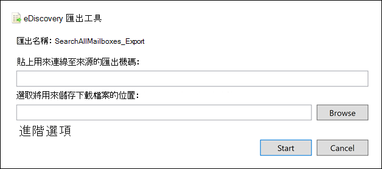

# <a name="export-content-search-results"></a>匯出內容搜尋結果

內容搜尋成功執行後，您可以將搜尋結果匯出至本機電腦。 當您匯出電子郵件結果時，其會以 PST 檔案下載到您的電腦。 當您從商務網站的 SharePoint 和 OneDrive 匯出內容時，會匯出原生 Office 檔的副本。 匯出的搜尋結果中包含其他檔和報表。
  
匯出內容搜尋的結果包含準備結果，然後將其下載到本機電腦。
  
## <a name="before-you-export-content-search-results"></a>匯出內容搜尋結果之前

- 若要匯出搜尋結果，您必須在安全性 & 規範中心內指派「匯出管理」角色。 此角色會指派給內建的 eDiscovery 管理員角色群組。 組織管理角色群組預設不會指派給它。 如需詳細資訊，請參閱[指派電子文件探索權限](assign-ediscovery-permissions.md)。

- 您用來匯出搜尋結果的電腦必須符合下列系統需求：
  
  - 32位或64位版本的 Windows 7 和更新版本
  
  - Microsoft .NET Framework 4.7
  
- 您必須使用下列其中一種支援的瀏覽器執行 eDiscovery 匯出工具<sup>1</sup>：

  - Microsoft Edge <sup>2</sup>
  
    OR

  - Microsoft Internet Explorer 10 和更新版本
  
  > [!NOTE]
  > <sup>1</sup> Microsoft 不會製造協力廠商擴充模組或 ClickOnce 應用程式的附加元件。 使用不受支援的瀏覽器匯出搜尋結果時，不支援協力廠商分機或附加元件。<br/>
  > <sup>2</sup> 由於 Microsoft Edge 的最近變更，因此預設不再啟用 ClickOnce 支援。 如需在 Edge 中啟用 ClickOnce 支援的相關指示，請參閱 [使用 Microsoft Edge 中的 EDiscovery 匯出工具](configure-edge-to-export-search-results.md)。
  
- 建議您將搜尋結果下載到本機電腦。 不過，為了避免公司的防火牆或 proxy 基礎結構在下載搜尋結果時導致問題，您可以考慮將搜尋結果下載至您的網路以外的虛擬桌面。 這可能會降低匯出大量檔案時，Azure 資料連線中發生的超時。 如需虛擬桌面的詳細資訊，請參閱 [Windows Virtual Desktop](https://azure.microsoft.com/services/virtual-desktop)。 

- 若要在下載搜尋結果時改善效能，請考慮將傳回一組大型結果的搜尋分割成較小的搜尋。 例如，您可以在搜尋查詢中使用日期範圍，以傳回較小的結果集，可更快速地下載。
  
- 當您匯出搜尋結果時，資料會暫時儲存在 microsoft 雲端中的 Microsoft 所提供 Azure 存放區位置，然後再將其下載到本機電腦。 確定您的組織可以連線到 Azure 中的端點，也就是 **\* blob.core.windows.net** (此萬用字元代表匯出) 的唯一識別碼。 搜尋結果資料會從建立後的兩周從 Azure 存放區位置刪除。 
  
- 如果您的組織使用 proxy 伺服器與網際網路通訊，您必須在您用來匯出搜尋 (結果的電腦上，定義 proxy 伺服器設定，讓 proxy 伺服器能夠驗證匯出工具) 。 若要這麼做，請在符合您 Windows 版本的位置開啟  *machine.config*  檔案。 
  
  - **32 位：**`%windir%\Microsoft.NET\Framework\[version]\Config\machine.config`
  
  - **64 位：**`%windir%\Microsoft.NET\Framework64\[version]\Config\machine.config`
  
    在 [和] 標記之間的  *machine.config*  檔案中新增下列行  `<configuration>`  `</configuration>` 。 請務必以您的組織來取代  `ProxyServer` 和  `Port` 正確的值; 例如，  `proxy01.contoso.com:80` 。 
  
    ```xml
    <system.net>
       <defaultProxy enabled="true" useDefaultCredentials="true">
         <proxy proxyaddress="https://ProxyServer :Port " 
                usesystemdefault="False" 
                bypassonlocal="True" 
                autoDetect="False" />
       </defaultProxy>
    </system.net>
    ```

## <a name="step-1-prepare-search-results-for-export"></a>步驟1：準備要匯出的搜尋結果

第一步是準備要匯出的搜尋結果。 當您準備結果時，會將其上傳至 microsoft 雲端中的 Microsoft 提供 Azure 儲存位置。 以每小時 2 GB 的最大速率上載信箱和網站的內容。
  
1. 請移至 [https://protection.office.com](https://protection.office.com)。
  
2. 使用您的公司或學校帳戶登入。
  
3. 在安全性 & 規範中心的左窗格中，按一下 [ **搜尋** \> **內容搜尋**]。
  
4. 在 [ **內容搜尋** ] 頁面上，選取搜尋。 
  
5. 在詳細資料窗格的 [ **將結果匯出至電腦**] 底下，按一下 [ **開始匯出**]。
  
    > [!NOTE]
    > 如果搜尋的結果超過7天，系統會提示您更新搜尋結果。 如果發生這種情況，請取消匯出，按一下 [詳細資料] 窗格中所選搜尋的 [ **更新搜尋結果** ]，然後在結果更新後再次開始匯出。 
  
6. 在 [ **匯出搜尋結果** ] 頁面的 [ **輸出選項**] 底下，選擇下列其中一個選項：
  
    - 所有專案（不包括具有無法辨識格式的專案）都會加密，或是未以其他原因為索引。
  
    - 所有專案（包括具有無法辨識格式的專案）都會加密，或是未以其他原因為索引
  
    - 僅限未辨識格式的專案、已加密或尚未為其他原因編制索引
  
    請參閱 [More information](#more-information) 一節以取得如何匯出部分索引項目目的描述。 如需部分索引項目目的詳細資訊，請參閱 [內容搜尋中已部分索引的專案](partially-indexed-items-in-content-search.md)。
  
7. 在 [將 **Exchange 內容匯出為**] 底下，選擇下列其中一個選項：
  
    - **每個信箱一個 PST 檔案：** 針對每個包含搜尋結果的使用者信箱，匯出一個 PST 檔案。 任何來自使用者封存信箱的結果都會包含在同一個 PST 檔案中。 此選項會將信箱資料夾結構從來源信箱中再現。
  
    - **包含所有郵件的一個 PST 檔案：** 會從包含在搜尋中的所有來源信箱中包含搜尋結果的單一 PST 檔案 *(名為* the the) 。 此選項會為每封郵件再現信箱資料夾結構。
  
    - **一個 PST 檔案包含單一資料夾中的所有郵件：** 將搜尋結果匯出到單一 PST 檔案，其中所有郵件都位於單一的最上層資料夾中。 此選項可讓檢閱者以時間順序查看專案 (專案會依傳送日期排序) 而不必流覽每個專案的原始信箱資料夾結構。
  
    - **個別郵件：** 將搜尋結果匯出為個別電子郵件訊息，使用 .msg 格式。 如果您選取此選項，電子郵件搜尋結果會匯出至檔案系統中的資料夾。 個別郵件的資料夾路徑與您將結果匯出至 PST 檔案時所使用的相同。
  
      > [!IMPORTANT]
      > 若要在匯出受 RMS 保護的郵件時進行解密，您必須將電子郵件搜尋結果匯出為個別郵件。 將搜尋結果匯出為 PST 檔案時，加密郵件會保持加密。 如需詳細資訊，請參閱本文中的 [解密受 RMS 保護的電子郵件訊息和加密檔附件](#decrypting-rms-protected-email-messages-and-encrypted-file-attachments) 。
  
8. 按一下 [ **啟用重復資料** 刪除] 核取方塊，排除重複的郵件。 只有在搜尋的內容來源包含 Exchange 信箱或公用資料夾時，才會出現此選項。 
  
    如果您選取此選項，則即使在搜尋的信箱中找到多個相同郵件複本，也只會匯出郵件的一個副本。 [匯出結果] 報告 ( # A0) 會包含重複郵件每個副本的列，以便您識別包含重複郵件複本) 的信箱 (或公用資料夾。 如需有關重復資料刪除以及如何識別重複專案的詳細資訊，請參閱 [eDiscovery 搜尋結果中的重復資料](de-duplication-in-ediscovery-search-results.md)刪除。
  
9. 按一下 [ **包含版本的 SharePoint 檔** ] 核取方塊，以匯出 SharePoint 檔的所有版本。 只有在搜尋的內容來源包含 SharePoint 或 OneDrive 商務網站時，才會顯示此選項。 
  
10. 按一下 [ **壓縮 (zipped) 資料夾中的匯出** 檔案] 核取方塊，將搜尋結果匯出至壓縮資料夾。 只有當您選擇將 Exchange 專案匯出為個別郵件，以及搜尋結果包括 SharePoint 或 OneDrive 檔時，才可使用此選項。 此選項主要是用來在匯出專案時，在 Windows 檔案路徑名稱中變通解決260字元的限制。 請參閱 [More information](#more-information) 一節中的「匯出的專案的檔案名」。 
  
11. 按一下 [ **開始匯出**]。 搜尋結果已準備好下載，也就是將其上傳至 Microsoft 雲端中的 Azure 儲存體位置。 可能會花幾分鐘的時間。

如需下載匯出之搜尋結果的指示，請參閱下一節。
  
## <a name="step-2-download-the-search-results"></a>步驟2：下載搜尋結果

下一步是從 Azure 存放位置將搜尋結果下載到本機電腦。
  
1. 在 [ **內容搜尋** ] 頁面上，按一下 [ **匯出** ] 索引標籤。 
  
   您可能 **需要按一下 [** 重新整理] 以更新匯出工作清單，使其顯示您建立的匯出工作。 匯出工作與對應的搜尋同名， **_Export** 附加至搜尋名稱。
  
2. 選取您在步驟1中建立的匯出工作。

3. 在 [ **匯出索引鍵**] 底下的飛入頁面上，按一下 [ **複製到剪貼** 簿]。 您可以在步驟6中使用此機碼下載搜尋結果。
  
4. 按一下 [ **下載結果**]。

5. 如果系統提示您安裝 **EDiscovery 匯出工具**，請按一下 [ **安裝**]。

6. 在 [ **EDiscovery 匯出工具**] 中，執行下列動作：

   

   1. 在適當的方塊中貼上您在步驟3中複製的匯出金鑰。
  
   2. 按一下 [瀏覽] 以指定搜尋結果檔案要下載到的位置。
  
      > [!IMPORTANT]
      >  由於下載過程中的網路活動過高，所以您應該只將搜尋結果下載至本機電腦上的內部磁片磁碟機上的某個位置。 如需最佳下載體驗，請遵循下列指導方針： <br/>
      >- 不要將搜尋結果下載至 UNC 路徑、對應網路磁碟機、外部 USB 磁片磁碟機或商務用 OneDrive 的商務帳戶。<br/>
      >- 針對下載搜尋結果的資料夾停用防病毒掃描。<br/>
      >- 將搜尋結果下載至不同的資料夾，以進行並行下載工作。

6. 按一下 [開始] 將搜尋結果下載至您的電腦。
  
    **EDiscovery 匯出工具** 會顯示匯出程式的狀態資訊，包括估計要下載之其餘專案的數位 (和大小) 。 匯出程式完成後，您可以在下載檔案的位置存取檔案。

## <a name="more-information"></a>詳細資訊

以下是匯出搜尋結果的詳細資訊。
  
[匯出限制](#export-limits)
  
[匯出報告](#export-reports)
  
[匯出部分索引項目目](#exporting-partially-indexed-items)

[匯出個別郵件或 PST 檔案](#exporting-individual-messages-or-pst-files)
  
[從100000個信箱匯出結果](#exporting-results-from-more-than-100000-mailboxes)

[解密受 RMS 保護的電子郵件和加密檔附件](#decrypting-rms-protected-email-messages-and-encrypted-file-attachments)

[匯出專案的檔案名](#filenames-of-exported-items)  
  
[其他工作](#miscellaneous)
  
### <a name="export-limits"></a>匯出限制

如需匯出內容搜尋結果時限制的相關資訊，請參閱 [內容搜尋限制](limits-for-content-search.md#export-limits)中的「匯出限制」一節。

### <a name="export-reports"></a>匯出報告
  
- 當您匯出搜尋結果時，除了搜尋結果之外，還會包含下列報告。
  
  - **匯出摘要** 包含匯出摘要的 Excel 檔。 這包括下列資訊：搜尋的內容來源數目、搜尋結果的預估和下載大小，以及已匯出專案的預估和下載數目。
  
  - **資訊清單** 包含搜尋結果中所包含之每個專案相關資訊的資訊清單檔案 (以 XML 格式) 。
  
  - **結果** 包含每個下載專案（搜尋結果）相關資訊的 Excel 檔。 針對電子郵件，結果記錄檔包含每封郵件的相關資訊，包括：
  
    - 來源信箱中郵件的位置 (，包含郵件是在主要或封存信箱) 中。
  
    - 傳送或接收郵件的日期。

    - 郵件的主旨行。

    - 郵件的寄件者和收件者。

    - 當您在匯出搜尋結果時啟用重復資料刪除選項時，郵件是否是重複的郵件。 重複郵件的 [ **重複目的專案** ] 欄中的值會將郵件識別為重複郵件。 [ **重複專案** ] 欄中的值包含匯出之郵件的專案身分識別。 如需詳細資訊，請參閱 [eDiscovery 搜尋結果中的重復資料](de-duplication-in-ediscovery-search-results.md)刪除。

      針對來自 SharePoint 和 OneDrive 商務網站的檔，結果記錄檔包含每個檔的相關資訊，包括：

      - 檔的 URL。

      - 檔所在之網站集合的 URL。

      - 上次修改檔的日期。

      - 位於結果記錄檔的 [主旨] 欄中的檔 (名稱) 。

  - 未 **編制索引的專案** Excel 檔，其中包含搜尋結果中所包含之任何部分索引項目目的相關資訊。 如果您在產生搜尋結果報告時未加入部分索引項目目，則此報告仍會下載，但會是空的。

  - **錯誤和警告** 包含匯出期間所發生之檔案的錯誤和警告。 請參閱 [錯誤詳細資料] 欄，以取得每個個別錯誤或警告的特定資訊。

  - **略過的專案** 當您從 SharePoint 和商務用 OneDrive 匯出搜尋結果時，匯出通常會包含「略過的專案」報告 ( # A0) 。 在此報告中提及的專案通常是不會下載的專案，例如資料夾或檔組。 不是依照設計方式匯出這些專案類型。 對於略過的其他專案，[略過的專案] 報告中的「錯誤類型」和「錯誤詳細資料」欄位會顯示略過專案的原因，而且不會與其他搜尋結果一起下載。

  - **追蹤記錄** 檔包含匯出程式的詳細記錄資訊，並可協助在匯出期間發現問題。
  
    > [!NOTE]
    > 您可以只匯出這些檔，而不需要匯出實際的搜尋結果。 請參閱 [匯出內容搜尋報告](export-a-content-search-report.md)。 
  
### <a name="exporting-partially-indexed-items"></a>匯出部分索引項目目
  
- 如果您要從內容搜尋中匯出信箱專案，而該搜尋會傳回搜尋結果中的所有信箱專案 (因為搜尋查詢中所包含的關鍵字並未包含在搜尋查詢中) ，所以部分編制索引的專案不會複製到包含未編制索引項目目的 PST 檔案中。 這是因為所有專案（包括任何已部分索引的專案）都會自動包含在一般搜尋結果中。 這表示部分編制索引的專案會包含在 PST 檔案 (或個別郵件中，) 包含其他的已編制索引的專案。

    如果您同時匯出已編制索引及部分索引的專案，或是只從傳回所有專案的內容搜尋中匯出索引項目目，則會下載相同數目的專案。 即使在安全性 & 規範中心的搜尋統計資料中顯示內容搜尋 (的估計搜尋結果，) 仍然會包含對部分索引項目目數目的個別估計。 例如，假設搜尋的估計包含的所有專案 (搜尋查詢中沒有關鍵詞) 會顯示找到1000個專案，而且也找到200部分索引的專案。 在此情況下，1000專案會包含部分索引的專案，因為搜尋會傳回所有專案。 換句話說，搜尋傳回的專案總數為1000，而不是1200的專案 (您預期的) 。 如果您匯出此搜尋的結果，並選擇匯出已編制索引和部分索引的專案 (或只匯出已部分索引的專案) ，則會下載1000個專案。 同樣地，這是因為在您使用空白搜尋查詢傳回所有專案時，會以一般 (編制索引) 結果的方式包含部分編制索引的專案。 在這個範例中，如果您選擇只匯出部分索引項目目，則只會下載200未編制索引的專案。

    另外請注意，在上一個範例中 (當您匯出已編制索引及部分索引的專案，或是只匯出已編制索引的) 專案時，匯出的搜尋結果所包含的 **匯出摘要** 報告會列出1000專案（如先前所述的相同原因），估計專案和1000下載專案。 

- 如果您要從中匯出結果的搜尋是搜尋特定的內容位置或組織中的所有內容位置，則只會匯出內容位置中包含符合搜尋準則之專案的部分專案。 換句話說，如果在信箱或網站中找不到任何搜尋結果，則不會匯出該信箱或網站中的任何已編制索引的專案。 其原因是匯出組織中大量位置的部分索引項目目時，可能會增加匯出錯誤的可能性，並增加匯出及下載搜尋結果所需的時間。

    若要從搜尋的所有內容位置匯出已部分索引的專案，請將搜尋設定為從搜尋查詢移除任何關鍵字，以傳回所有專案 () 然後在匯出搜尋結果時，只匯出部分索引的專案。

    
  
- 從 SharePoint 或商務用 OneDrive 匯出搜尋結果時，匯出未編制索引的專案的能力也取決於您選取的匯出選項，以及所搜尋的網站是否包含符合搜尋準則的索引項目目。 例如，如果您搜尋商務網站的特定 SharePoint 或 OneDrive，但找不到任何搜尋結果，則當您選擇第二個匯出選項來匯出已編制索引及未編制索引的專案時，將不會匯出這些網站中未編制索引的專案。 如果網站的索引項目目符合搜尋準則，則當您匯出索引及未編制索引的專案時，會匯出該網站的所有未編制索引的專案。 下圖說明根據網站是否包含符合搜尋準則之索引項目目的匯出選項。

    ![根據網站是否包含符合搜尋準則的索引項目目，選擇 [匯出] 選項](../media/94f78786-c6bb-42fb-96b3-7ea3998bcd39.png)

    1. 只會匯出符合搜尋準則的索引項目目。 不會匯出部分索引的專案。

    2. 如果網站上沒有任何已編制索引的專案符合搜尋準則，則不會匯出從該相同網站部分編制索引的專案。 如果在搜尋結果中傳回來自某一網站的索引項目目，則會匯出該網站的部分已編制索引的專案。 換句話說，只會匯出包含符合搜尋準則之專案之網站的部分索引項目目。

    3. 不論網站是否包含符合搜尋準則的專案，所有來自搜尋中之網站的部分已編制索引的專案都會匯出。

    如果您選擇匯出部分編制索引的專案，則會在個別的 PST 檔案中匯出部分索引的信箱專案，而不管您在 [將 **Exchange 內容匯出為**] 下選擇的選項。

- 如果在搜尋結果中傳回部分索引項目目 (由於部分索引項目目的其他屬性符合搜尋準則) ，則會以一般搜尋結果匯出的部分編制索引項目目。 因此，如果您選擇 [ **所有專案（包括具有未辨識格式的專案** ]、[已加密] 或 [未根據其他原因編制索引]) 選項，則會 (匯出索引項目目和部分索引項目目，則會在 [Results.csv] 報告中列出與一般結果一起匯出的部分索引項目目。 它們不會列在未編制索引的 items.csv 報告中。
  
### <a name="exporting-individual-messages-or-pst-files"></a>匯出個別郵件或 PST 檔案
  
- 如果郵件的檔案路徑名稱超過 Windows 的最大字元限制，則會截斷檔路徑名稱。 但原始的檔案路徑名稱會列在資訊清單和 ResultsLog 中。
  
- 如先前所述，電子郵件搜尋結果會匯出至檔案系統中的資料夾。 個別郵件的資料夾路徑會複製使用者信箱中的資料夾路徑。 例如，在使用者的 [收件匣] 中，名為 "ContosoCase101" 郵件的搜尋會位於資料夾路徑中  `~ContosoCase101\\<date of export\Exchange\user@contoso.com (Primary)\Top of Information Store\Inbox` 。

- 如果您選擇在包含單一資料夾中的所有郵件的一個 PST 檔案中匯出電子郵件，則 [ **刪除的郵件** ] 資料夾及 [ **搜尋資料夾** ] 資料夾都會包含在 pst 資料夾的最上層。 這些資料夾是空白的。

- 如先前所述，您必須將電子郵件搜尋結果匯出為個別郵件，以在匯出受 RMS 保護的郵件時加以解密。 將電子郵件搜尋結果匯出為 PST 檔案時，加密郵件會保持加密。
  
### <a name="exporting-results-from-more-than-100000-mailboxes"></a>從100000個信箱匯出結果

- 如先前所述，您必須使用安全性 & 合規性中心 PowerShell 下載超過100000個信箱的搜尋結果。 您可以在本節中執行下列腳本，以下載這些搜尋結果。 使用此腳本會假設您已匯出搜尋結果 (匯出工作會顯示在 [內容搜尋) 工具] 的 [ **匯出** ] 索引標籤上，而且現在想要下載。

   ```powershell
   $export=Get-ComplianceSearchAction SEARCHNAME_Export -IncludeCredential;
   $exportUrl=   [System.Uri]::EscapeDataString(($export.Results.Split(";") | ?{$_ -like '*Container url*'} | %{$_.Split(":",2)} | select -last 1).Trim());
   $exportToken=($export.Results.Split(";") | ?{$_ -like '*SAS Token*'} | %{$_.Split(":",2)} | select -last 1).Trim();
   ."$env:ProgramFiles\Internet Explorer\IEXPLORE.EXE" "https://complianceclientsdf.blob.core.windows.net/v16/Microsoft.Office.Client.Discovery.UnifiedExportTool.application?name=$($export.Name)&source=$exportUrl&zip=allow&trace=1";
   $exportToken | clip;
   ```

  在腳本中，您必須指定要匯出結果的搜尋名稱。 例如，針對搜尋，將 `SearchAllMailboxes` SEARCHNAME_Export 取代為 `SearchAllMailboxes_Export` 。

  在將搜尋的名稱新增至腳本後，您可以複製腳本文字，然後將其貼到 [已連接至安全性 & 規範中心 PowerShell](https://docs.microsoft.com/powershell/exchange/connect-to-scc-powershell)的 Windows PowerShell 視窗中。 在您貼上腳本後，電子檔探索匯出工具 (會顯示為當您使用 UI) 下載搜尋結果時，如下所示：

  

  在 [匯出機碼] 方塊中按一下，然後按下 `CTRL + V` 以貼上匯出金鑰 (腳本會將匯出機碼複製到 [剪貼簿]) 。 按一下 **[流覽]** 以指定您要下載檔案的位置，然後開始下載。

  如先前所述，建議您將搜尋結果下載至本機磁片磁碟機，因為大量的磁片活動 (讀取及寫入) 中。 不要將搜尋結果下載到對應的網路磁碟機或其他網路位置。

### <a name="decrypting-rms-protected-email-messages-and-encrypted-file-attachments"></a>解密受 RMS 保護的電子郵件和加密檔附件

匯出內容搜尋結果時所包含的任何受版權保護 () 電子郵件都會解密。 此外，任何以 [Microsoft 加密技術](encryption.md) 加密的檔案，也會附加到搜尋結果中包含的電子郵件時，也會在匯出時進行解密。 預設會為 eDiscovery 管理員角色群組的成員啟用此解密功能。 這是因為根據預設，RMS 解密管理角色會指派給此角色群組。 匯出加密的電子郵件訊息和附件時，請牢記下列事項：
  
- 如先前所述，若要在您匯出受 RMS 保護的郵件時進行解密，您必須將搜尋結果匯出為個別郵件。 如果您將搜尋結果匯出至 PST 檔案，RMS 保護的郵件會保持加密。

- 解密的郵件會在 **ResultsLog** 報告中識別。 此報告包含名為 **解碼狀態** 的欄，以及此欄中 **解碼** 的值會識別已解密的郵件。

- 在匯出搜尋結果時，除了解密檔附件之外，您也可以在預覽搜尋結果時預覽解密的檔案。 匯出受版權保護的電子郵件之後，您才可以查看該郵件。

- 在這個階段中，匯出搜尋結果時，解密功能不會包含來自 SharePoint 和 OneDrive 商務網站的加密內容。 不過，對於使用 Microsoft 加密技術加密的檔，以及儲存在 SharePoint 線上和商務 OneDrive 中的檔，都即將提供支援。

- 如果您需要防止某人解密 RMS 保護郵件和加密的檔案附件，您必須在) 中建立內建的 eDiscovery Manager 角色群組，然後從自訂角色群組中移除 RMS 解密管理角色，以建立自訂角色群組 (。 然後將您不想要將郵件解密的人員新增為自訂角色群組的成員。
  
### <a name="filenames-of-exported-items"></a>匯出專案的檔案名
  
- ) 作業系統 (強加電子郵件訊息的完整路徑名稱和匯出至本機電腦的網站檔，都有260個字元的限制。 匯出專案的完整路徑名稱包含專案的原始位置，以及將搜尋結果下載到本機電腦上的資料夾位置。 例如，如果您指定將搜尋結果下載至  `C:\Users\Admin\Desktop\SearchResults` EDiscovery 匯出工具，則下載的電子郵件專案的完整路徑名  `C:\Users\Admin\Desktop\SearchResults\ContentSearch1\03.15.2017-1242PM\Exchange\sarad@contoso.com (Primary)\Top of Information Store\Inbox\Insider trading investigation.msg` 。

    如果超過260個字元的限制，將會截斷專案的完整路徑名稱。

  - 如果完整路徑名稱的長度超過260個字元，則會縮短檔案名，使其低於限制。請注意，截斷的檔案名 (排除副檔名) 不會少於8個字元。

  - 如果在縮短檔案名後，完整路徑名稱仍過長，該專案就會從目前的位置移至上層資料夾。 如果路徑名仍過長，則會重複此程式：縮短檔案名，必要時再移至上層資料夾。 此程式會重複，直到完整路徑名低於260字元限制為止。

  - 如果已存在截斷的完整路徑名稱，則會將版本號碼加入檔案名的結尾;例如，  `statusmessage(2).msg` 。

    若要協助緩解此問題，請考慮將搜尋結果下載至具有短路徑名稱的位置;例如，將搜尋結果下載至名為的資料夾時，  `C:\Results` 會將匯出之專案的路徑名稱增加一些，而不是將其下載至名為的資料夾  `C:\Users\Admin\Desktop\Results` 。

- 當您匯出網站檔時，也可能會修改檔的原始檔案名。 這會特別針對已從處於保留狀態之商務網站的 SharePoint 或 OneDrive 中刪除的檔。 刪除位於保留之網站上的檔之後，已刪除的檔會自動移至網站 (的保留文件庫，該網站是在網站保留) 時所建立的。 當刪除的檔移至 [保留] 保留庫時，會在檔的原始檔案名上附加隨機產生及唯一的識別碼。 例如，如果檔的檔案名是  `FY2017Budget.xlsx` ，後來刪除該檔並移至 [保留] 存放庫，則移至 [保留] 文件庫的檔檔案名會修改成類似的內容  `FY2017Budget_DEAF727D-0478-4A7F-87DE-5487F033C81A2000-07-05T10-37-55.xlsx` 。 如果保留的保留文件庫中的檔符合內容搜尋的查詢，而且您匯出該搜尋的結果，則匯出的檔案會有修改後的檔案名;在此範例中，匯出之檔的檔案名將是  `FY2017Budget_DEAF727D-0478-4A7F-87DE-5487F033C81A2000-07-05T10-37-55.xlsx` 。

    修改保留網站上的檔時 (已啟用網站中的文件庫的版本設定) ，會自動在保留的保留文件庫中建立該檔案的副本。 在此情況下，隨機產生及唯一的識別碼也會附加到複製至 [保留] 存放庫的檔檔案名。

    移動或複製到 [保留] 保留庫的檔檔案名的原因，是為了避免發生衝突的檔案名。 如需有關在網站和保留的保留文件庫中放置保留的詳細資訊，請參閱 [SharePoint Server 2016 中的就地保留](https://support.office.com/article/5e400d68-cd51-444a-8fe6-e4df1d20aa95)。

### <a name="miscellaneous"></a>雜項
  
- 使用 eDiscovery 匯出工具下載搜尋結果時，可能會收到下列錯誤： `System.Net.WebException: The remote server returned an error: (412) The condition specified using HTTP conditional header(s) is not met.` 這是暫時性的錯誤，通常會發生于 Azure 儲存位置。 若要解決此問題，請重試 [下載搜尋結果](#step-2-download-the-search-results)，這將會重新開機 EDiscovery 匯出工具。

- 所有搜尋結果和匯出報告都會包含在與內容搜尋同名的資料夾中。 匯出的電子郵件會位於名為 **Exchange** 的資料夾中。 檔位於名為 **SharePoint** 的資料夾中。

- 當檔匯出至您的本機電腦時，系統會維護 SharePoint 和商務用 OneDrive 的檔案系統中繼資料。 這表示檔案屬性（如建立的和上次修改的日期）在匯出檔時不會變更。

- 如果您的搜尋結果包含的清單專案來自符合搜尋查詢的 SharePoint，除了符合搜尋查詢的專案以及清單中的任何附件之外，還會匯出清單中的所有列。 這種行為的原因是針對搜尋結果中傳回的清單專案提供內容。 另外請注意，其他清單專案和附件可能會導致匯出的專案計數與原始搜尋結果的估計值不同。
