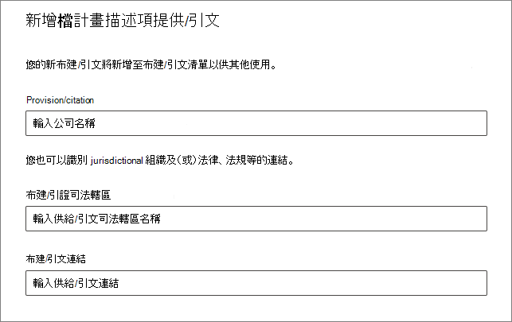

# 使用檔案計畫來管理保留標籤

>*[Microsoft 365 安全性與合規性的授權指引](/office365/servicedescriptions/microsoft-365-service-descriptions/microsoft-365-tenantlevel-services-licensing-guidance/microsoft-365-security-compliance-licensing-guidance)。*

雖然您可以透過 Microsoft 365 合規性中心的 [資訊控管] 建立及管理保留標籤，但來自 [記錄管理] 的檔案計畫還具有額外的管理功能：

- 您可以從試算表匯入相關資訊，大量建立保留標籤。

- 您可以從現有保留標籤匯出資訊，以便進行分析和離線共同作業。

- 有關保留標籤的詳細資訊將會顯示，讓您可以從一個檢視輕鬆查看所有保留標籤的各項設定。

- 檔案計畫描述元針對每個標籤支援額外和選用的資訊。

檔案計畫可用於所有保留標籤，即使它們不會將內容標示為記錄。

如需有關保留標籤為何及其使用方式的相關資訊，請參閱[瞭解保留原則及保留標籤](retention.md)。

## 存取檔案計畫

若要存取檔案計畫，您必須擁有下列其中一種系統管理員角色：
    
- 保留管理員

- 僅檢視保留管理員

在 Microsoft 365 合規性中心中，移至 [解決方案]  >  [記錄管理]  >  [檔案計畫]。 

如果功能窗格中未顯示 [記錄管理]，請先向下捲動，然後選取 [顯示全部]。

## 瀏覽您的檔案計畫

如果您已透過 Microsoft 365 合規性中心的 [資訊控管] 建立保留標籤，則這些標籤會自動顯示在您的檔案計畫中。 

同樣地，如果您現在在檔案計畫中建立保留標籤，如果未將標籤設定為將內容標示為記錄，則也可以從 [資訊控管] 中取得。

在 [檔案計畫] 頁面上，您會看到所有標籤，具有其狀態和設定、選用的檔案計畫描述元、用來分析或啟用標籤離線檢閱的匯出選項，以及用來建立保留標籤的匯入選項。 

### 標籤設定欄

除了標籤 [名稱] 以外的所有欄，都可以透過選取 [自訂欄] 選項來顯示或隱藏。 但根據預設，前幾欄會顯示標籤狀態及其設定的相關資訊： 

- [狀態] 可識別標籤是否包含在標籤原則或自動套用原則中 (**作用中**) 與否 (**非作用中**)。

- [根據] 可識別保留期間如何與何時開始。 有效值：
    - 事件
    - 建立時機
    - 上次修改日期
    - 已套用標籤時

- [記錄中] 可識別套用標籤時，項目是否標記為記錄。 有效值：
    - 否
    - 是
    - Yes(Regulatory)

- [保留期間] 可識別保留期間。 有效值：
    - 天
    - 月
    - 年
    - 永久
    - 無

- [處置類型] 可識別保留期間結束時，內容會發生什麼情形。 有效值：
    - 不執行任何動作
    - 自動刪除
    - 需要檢閱

### 檔案計畫描述元欄

檔案計畫可讓您隨著保留標籤包含更多資訊。 這些檔案計畫描述元提供更多可改善您要加上標籤之內容的可管理性和組織的選項。

根據預設，從 **[參照識別碼]** 開始，接下來的幾個欄會顯示這些選用檔案計畫描述元，供您在建立保留標籤或編輯現有標籤時指定。 

為了讓您開始使用，以下檔案計畫描述元有一些現成可用的值： 
- 商務功能/部門
- 類別
- 授權單位類型
- 條款/引文 

建立或編輯保留標籤時，檔案計畫描述元的範例：

當您針對這些各個選用描述項選取 **[選擇]** 時，您可以選取其中一個全新的值，或建立您自己的值然後加以選取。 例如： 

## 匯出所有保留標籤以分析或啟用離線檢閱

您可以從檔案計畫，將所有保留標籤的詳細資料匯出至 .csv 檔案，以協助您加速與組織中資料控管專案關係人進行的定期合規性檢閱。

若要匯出所有保留標籤：在 [檔案計畫] 頁面上，按一下 [匯出]：

包含所有現有保留標籤的 *.csv 檔案隨即開啟。範例：

## 將保留標籤匯入至您的檔案計劃

在檔案計畫中，您可以使用具有特定格式的 .csv 檔案來大量匯入新的保留標籤： 

1. 在 [檔案計畫] 頁面上，按一下 [匯入] 以使用 [填寫並匯入您的檔案計畫] 頁面：

   

   

2. 依指示下載空白的範本：

   

3. 使用說明每個屬性的屬性和有效值的以下資訊填寫範本。若要匯入，某些值的長度上限為：
    
    - **LabelName**： 長度上限為 64 個字元
    - **註解** 和 **附注**： 長度上限為 1024 個字元
    - 所有其他值：無限制長度
     
    
   |屬性	|類型|必要|有效值|
   |:-----|:-----|:-----|:-----|
   |LabelName|字串|是|此屬性會指定保留標籤的名稱，且在租用戶中必須是唯一的。|
   |留言|字串|否|使用此屬性來新增系統管理員保留標籤相關的描述。 只有在合規性中心中管理保留標籤的系統管理員才會看到這個描述。|
   |附註|字串|否|使用此屬性來新增使用者保留標籤相關的描述。 當使用者將游標移到應用程式 (例如 Outlook、SharePoint 和 OneDrive) 中的標籤上時，就會出現此描述。 如果您將此屬性保留空白，則會顯示說明標籤之保留設定的預設描述。 |
   |IsRecordLabel|字串|否，除非 **法規** 為 **TRUE**|此屬性會指定標籤是否將內容標示為記錄。有效值如下： **TRUE**：標籤會將項目標示為記錄，並因此無法刪除該項目。  **FALSE**：標籤不會將內容標示為記錄。 這是預設值。     群組相依性：指定此屬性時，也必須指定 RetentionAction、RetentionDuration 和 RetentionType。|
   |RetentionAction|字串|否，除非指定 **RetentionDuration**、**RetentionType** 或 **ReviewerEmail**|此屬性指定由 RetentionDuration 屬性 (如果有指定) 指定的值過期之後所要採取的動作。有效值為： **Delete**：刪除早於 RetentionDuration 屬性指定值的項目。 **Keep**：保留由 RetentionDuration 屬性指定期間內的項目，然後在期間到期時不執行任何動作。  **KeepAndDelete**：保留由 RetentionDuration 屬性指定期間內的項目，然後在期間到期時將之刪除。     群組相依性：指定此屬性時，也必須指定 RetentionDuration 和 RetentionType。 |
   |RetentionDuration|字串|否，除非指定 **RetentionAction** 或 **RetentionType**|此屬性會指定要保留內容的天數。有效值為：  **無限制**：系統會無限期保留這些項目。  **_n_*：以天為單位的正整數；例如 **365**。 支援的最大數目為 24,855，即 68 年。 如果您需要比此上限更長的時間，請改用 Unlimited。    群組相依性：指定此屬性時，也必須指定 RetentionAction 和 RetentionType。
   |RetentionType|字串|否，除非指定 **RetentionAction** 或 **RetentionDuration**|此屬性會指定保留期限 (如果指定) 是否從內容建立日期、事件日期、已套用標籤日期或上次修改日期算起。有效值為： **CreationAgeInDays** **EventAgeInDays** **TaggedAgeInDays** **ModificationAgeInDays**     群組相依性：指定此屬性時，也必須指定 RetentionAction 和 RetentionDuration。|
   |ReviewerEmail|SmtpAddress|否|指定此屬性時，系統會在保留期間到期時觸發處置檢閱。 此屬性會指定 **KeepAndDelete** 保留動作檢閱者的電子郵件地址。     您可以在您的租用戶中包含個別使用者、通訊群組或安全性群組的電子郵件地址。 指定多個電子郵件地址並使用分號 (;) 隔開它們。     群組相依性：指定此屬性時，也必須指定 **RetentionAction** (必須為 **KeepAndDelete**)、**RetentionDuration** 和 **RetentionType**。|
   |ReferenceId|字串|否|此屬性指定在 [參考識別碼] 檔案計劃描述元中顯示的值，您可以將它用作組織的唯一值。| 
   |Departmentname|字串|否|此屬性指定在 **[功能/部門]** 檔案計劃描述元中顯示的值。|
   |類別|字串|否|此屬性指定在 **[類別]** 檔案計劃描述元中顯示的值。|
   |子類別|字串|否|此屬性指定在 **[子類別]** 檔案計劃描述元中顯示的值。|
   |AuthorityType|字串|否|此屬性指定在 **[授權單位類型]** 檔案計劃描述元中顯示的值。|
   |CitationName|字串|否|此屬性指定在 [條款/引文] 檔案計畫描述元中顯示的引文名稱。 例如，「2002 年沙賓法案」。 |
   |CitationUrl|字串|否|此屬性指定在 **[條款/引文]** 檔案計劃描述元中顯示的 URL。|
   |CitationJurisdiction|字串|否|此屬性指定在 **[條款/引文]** 檔案計劃描述元中顯示的管轄單位或代理機構；例如「美國證券交易委員會 (SEC)」。|
   |Regulatory|字串|否|此屬性會指定標籤是否將內容標示為法規記錄，這比標示為記錄 [更具限制性](records-management.md#compare-restrictions-for-what-actions-are-allowed-or-blocked)。 若要使用此標籤設定，必須將您的租用戶者設定為 [顯示選項以將內容標示為法規記錄](declare-records.md#how-to-display-the-option-to-mark-content-as-a-regulatory-record)，否則匯入驗證將失敗。 有效值為：  **TRUE**：此標籤會將此項目標示為法規記錄。 您也必須將 **IsRecordLabel** 屬性設定為 TRUE。 **FALSE**：此標籤不會將內容標示為法規記錄。 這是預設值。|
   |EventType|字串|否，除非 **RetenType** 為 **EventAgeInDays**|此屬性指定 [事件型保留](event-driven-retention.md) 的事件種類。 指定現有的事件種類，此類型會顯示在 **記錄管理** > **事件** > **管理事件類型** 中。 或者，使用 [Get-ComplianceRetentionEventType](/powershell/module/exchange/get-complianceretentioneventtype) Cmdlet 以檢視可供使用的事件類型。 雖然有一些內建事件類性，例如 **員工活動** 和 **產品存留期**，您也可以建立自己的事件類型。     如果您指定自己的事件類型，它必須在匯入之前即已存在，因為名稱會在匯入過程中進行驗證。|
   |||

   以下是含有保留標籤相關資訊的範本範例。

   

4. 在 **[填寫並匯入您的檔案計畫]** 頁面的步驟 3 下方，按一下 **[瀏覽檔案]** 以上傳填寫完成的範本，然後選取 **[下一步]**。

   檔案計畫會上傳該檔案並驗證此項目，也會顯示匯入統計資料。

   

5. 根據驗證結果：
    
    - 如果驗證失敗：請注意匯入檔案中要進行修正的列號和欄名稱。 請選取 **關閉**，然後 **是** 以進行確認。 修正檔案中的錯誤並儲存檔案，再次選取 **匯入** 選項，然後返回步驟 4。
    
    - 如果驗證通過：您可以選取 **上線** 以提供可在租用戶中使用的保留標籤。 或者，選取頁面的 [關閉] 圖示，和 **是** 以確認您想要關閉精靈，而不會讓此保留標籤在您的租用戶中立即使用。

當已匯入的標籤新增至您的租用戶之後，您現在可透過加以發佈來提供給使用者，或加以自動套用。 您可以從 **[標籤原則]** 執行這兩項操作，然後選取 **[發佈標籤]**，或選取 **[自動套用標籤]**。

## 後續步驟

如需有關建立和編輯保留標籤及其原則的詳細資訊，可參閱下列指南：
- [建立保留標籤，並在應用程式中使用這些標籤](create-apply-retention-labels.md)
- [自動將保留標籤套用到內容](apply-retention-labels-automatically.md)