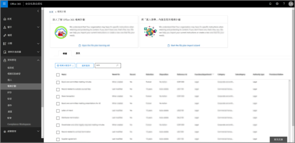
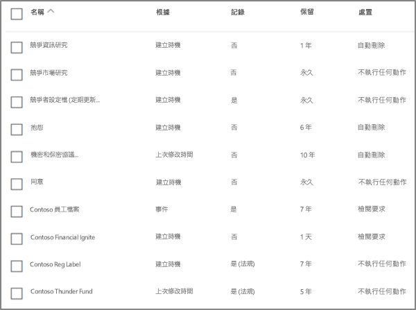
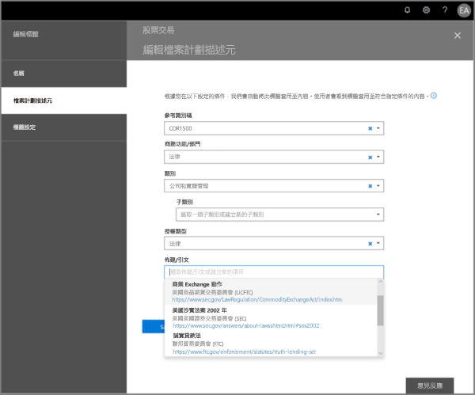
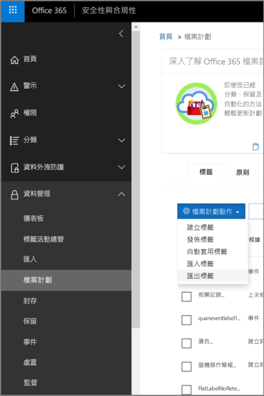
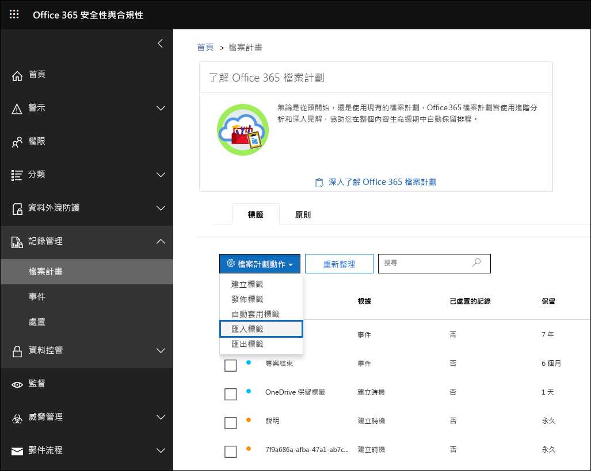
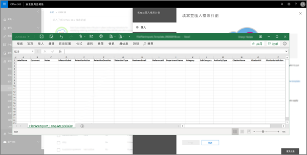
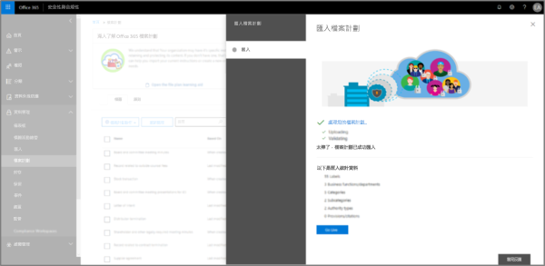
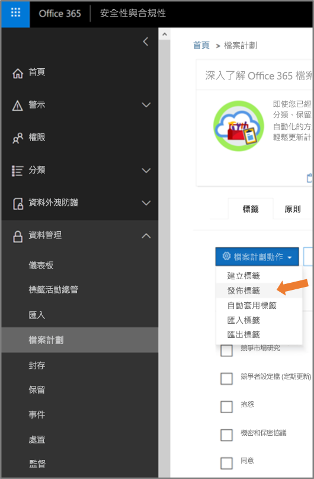

# 檔案計劃管理員的概觀

檔案計劃管理員提供對於保留標籤、保留標籤原則的進階管理功能，並且提供整合的方式讓標籤和標籤至內容活動周遊整個內容生命週期 – 從建立、共同作業、記錄宣告、保留，到最終的處置。 

若要存取安全性與合規性中心的檔案計劃管理員，請移至 **[記錄管理]** >  **[檔案計劃]**。

## 存取檔案計劃管理員

存取檔案計劃管理員有兩個需求，需求如下：

- Office 365 企業版 E5 訂閱。

- 使用者已獲指派安全性與合規性中心的下列其中一個角色：
    
    - 保留管理員
    
    - 僅檢視保留管理員

## 預設保留標籤和標籤原則

如果安全性與合規性中心中沒有保留標籤，第一次在左側導覽中選擇 [檔案計畫]**** 時，這會建立稱為**預設資料控管發佈原則**的標籤原則。 

此標籤原則包含三個保留標籤：

- **作業程序**
- **一般業務**
- **合約協定**

設定這些保留標籤只是為了保留內容，而非刪除內容。 此標籤原則將發佈到整個組織，並可加以停用或移除。 

您可以判斷誰開啟了檔案計畫管理員並開始了初次執行體驗，方法是檢閱活動 [建立保留原則]**** 和 [為保留原則建立了保留組態]**** 的稽核記錄。

> [!NOTE]
> 由於客戶的意見反應，我們已移除了會建立預設保留標籤和以上所提及的保留標籤原則的這項功能。 只有在 2019 年 4 月 11 日之前開啟檔案計劃管理員的情況下，才會看到這些保留標籤和保留標籤原則。

## 瀏覽您的檔案計劃

檔案計劃管理員可讓您更輕鬆地從單一檢視，查看所有保留標籤和原則及其設定。

請注意，在檔案計劃外部所建立的保留標籤可以在檔案計劃中使用，反之亦然。

在檔案計劃 **[標籤]** 索引標籤上，下列額外資訊和功能可供使用：

### 標籤設定資料行

- [根據]**** 會識別觸發程序類型，該觸發程序會開始保留期間。有效的值是：
    - 事件
    - 建立時機
    - 上次修改時間
    - 套用標籤時機
- [記錄]**** 會識別項目是否會在套用標籤時變成宣告的記錄。有效的值是：
    - 否
    - 是
    - Yes(Regulatory)
- [保留]**** 會識別保留類型。有效的值是：
    - 保留
    - 保留與刪除
    - 刪除
- [處置]**** 會識別保留期間結束時內容會發生什麼情形。有效的值是：
    - Null
    - 不執行任何動作
    - 自動刪除
    - 需要檢閱 (也稱為處置檢閱)

### 保留標籤檔案計劃描述元資料行

您現在可以在保留標籤的設定中包含更多資訊。 將檔案計劃描述元插入保留標籤會改善檔案計劃的管理性和組織。

為了協助您開始使用，檔案計劃管理員會為以下項目提供現成的值：功能/部門、類別、授權單位類型和條款/引文。 您可以在建立或編輯保留標籤時新增全新檔案計劃描述元值。 您也可以在匯入保留標籤到檔案計劃時，指定檔案計劃描述元。 

以下是建立或編輯保留標籤時的檔案計劃描述元步驟檢視。

以下是檔案計劃管理員的 **[標籤]** 索引標籤上，檔案計劃描述元的檢視。

## 匯出所有現有的保留標籤以分析及/或執行離線檢閱

您可以從檔案計劃管理員將所有保留標籤的詳細資料匯出至 .csv 檔案，以協助您加速與貴組織中資料控管專案關係人進行的定期合規性檢閱。

若要匯出所有保留標籤：在 **[檔案計劃]** 頁面，**[檔案計劃動作]** \> **[匯出標籤]**。

包含所有現有保留標籤的 *.csv 檔案隨即開啟。

## 將保留標籤匯入至您的檔案計劃

您可以在 [檔案計劃管理員] 大量匯入新的保留標籤，並修改現有的保留標籤。

若要匯出新的保留標籤，以及修改現有的保留標籤： 

1. 移至在 **[檔案計劃]** 頁面上的 **[檔案計劃動作]** >  **[匯入標籤]**。

   

   

2. 下載空白範本以匯入全新保留標籤。 或者，您可以從當匯出組織中的現有保留標籤時所匯出的 .csv 檔案開始。

   

3. 填寫範本。 下列描述檔案計劃範本中每個屬性的內容和有效值。 

   |**屬性**|**類型**|**有效值**|
   |:-----|:-----|:-----|
   |LabelName|字串|此屬性會指定保留標籤的名稱。|
   |留言|字串|使用此屬性來新增系統管理員保留標籤相關的描述。 只有在安全性與合規性中心中管理標籤的系統管理員才會看到這個描述。|
   |附註|字串|使用此屬性來新增使用者保留標籤相關的描述。 當使用者將游標移到應用程式 (例如 Outlook、SharePoint 和 OneDrive) 中的標籤上時，就會出現此描述。 如果您將此屬性保留空白，則會顯示說明標籤之保留設定的預設描述。 |
   |IsRecordLabel|字串|此屬性會指定標籤是否為記錄標籤。 標記為記錄標籤的項目會宣告為記錄。 有效值為： **TRUE**：標籤是記錄標籤。 請注意，無法刪除宣告為記錄的項目。  **FALSE**：該標籤不是記錄標籤。 這是預設值。|
   |RetentionAction|字串|此屬性指定由 RetentionDuration 屬性指定的值過期之後所要採取的動作。 有效值為： **Delete**：刪除早於 RetentionDuration 屬性指定值的項目。 **Keep**：保留由 RetentionDuration 屬性指定期間內的項目，然後在期間到期時不執行任何動作。  **KeepAndDelete**：保留由 RetentionDuration 屬性指定期間內的項目，然後在期間到期時將之刪除。   |
   |RetentionDuration|字串|此屬性會指定要保留內容的天數。 有效值為： **無限制**：系統會無限期保留這些項目。  ***n***：正整數；例如 **365**。 
   |RetentionType|字串|此屬性會指定保留期限是否從內容建立日期、事件日期、標籤 (標記) 日期或上次修改日期開始算起。 有效值為： **CreationAgeInDays** **EventAgeInDays** **TaggedAgeInDays** **ModificationAgeInDays** |
   |ReviewerEmail|SmtpAddress|填入此屬性時，系統會在保留期間到期時觸發處置檢閱。 此屬性會指定 **Delete** 和 **KeepAndDelete** 保留動作檢閱者的電子郵件地址。 您可以包含個別使用者、通訊群組或安全性群組，或 Office 365 群組的電子郵件地址。 您可以指定以逗號隔開的多個電子郵件地址。|
   |ReferenceId|字串|此屬性指定在 **[參考識別碼]** 檔案計劃描述元中顯示的值。| 
   |Departmentname|字串|此屬性指定在 **[功能/部門]** 檔案計劃描述元中顯示的值。|
   |類別|字串|此屬性指定在 **[類別]** 檔案計劃描述元中顯示的值。|
   |子類別|字串|此屬性指定在 **[子類別]** 檔案計劃描述元中顯示的值。|
   |AuthorityType|字串|此屬性指定在 **[授權單位類型]** 檔案計劃描述元中顯示的值。|
   |CitationName|字串|此屬性指定在 **[條款/引文]** 檔案計劃描述元中顯示的引文名稱，例如「2002 年的沙賓法案」。 |
   |CitationUrl|字串|此屬性指定在 **[條款/引文]** 檔案計劃描述元中顯示的 URL。|
   |CitationJurisdiction|字串|此屬性指定在 **[條款/引文]** 檔案計劃描述元中顯示的管轄單位或代理機構；例如「美國證券交易委員會 (SEC)」。|
   |Regulatory|字串|保留空白。 目前無法使用此屬性。|
   |EventType|字串|此屬性會指定與標籤相關聯的保留規則。 您可以使用唯一識別規則的任何值。 例如： **Name** **Distinguished name (DN)** **GUID**  您可以使用 [Get-RetentionComplianceRule](https://docs.microsoft.com/powershell/module/exchange/policy-and-compliance-retention/get-retentioncompliancerule?view=exchange-ps) Cmdlet 來檢視可用的保留規則。 請注意，如果從某 Office 365 組織中匯出標籤，在將標籤匯入至另​​一個 Office 365 組織時，則不能使用該組織的 EventType 屬性的值。 這是因為對組織而言 EventType 值是唯一的。 |
   |||

   以下是含有保留標籤相關資訊的範本範例。

   

4. 在匯入檔案計劃精靈頁面的步驟 3 下方，按一下 **[瀏覽檔案]** 以上傳填入的範本。 

   檔案計劃管理員會驗證項目並且顯示匯入統計資料。

   

   萬一有驗證錯誤，檔案計劃匯入將會繼續驗證匯入檔案中的每個項目，並在匯入檔案中顯示參考行/列數的所有錯誤、複製顯示的錯誤結果，讓您可以輕鬆地返回匯入檔案並更正錯誤。

5. 匯入完成後，返回檔案計劃管理員，讓新的保留標籤與新的或現有的保留標籤原則產生關聯。

   
