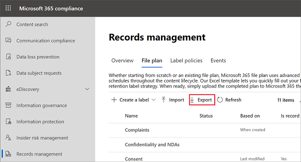

# 使用檔案計畫來管理保留標籤Use file plan to manage retention labels

>*[Microsoft 365 安全性與合規性的授權指引](https://aka.ms/ComplianceSD)。**[Microsoft 365 licensing guidance for security & compliance](https://aka.ms/ComplianceSD).*

雖然您可以透過 Microsoft 365 合規性中心的 [資訊控管]\*\*\*\* 建立及管理保留標籤，但來自 [記錄管理]\*\*\*\* 的檔案計畫還具有額外的管理功能：Although you can create and manage retention labels from **Information governance** in the Microsoft 365 compliance center, file plan from **Records management** has additional management capabilities:

- 您可以從試算表匯入相關資訊，大量建立保留標籤。You can bulk-create retention labels by importing the relevant information from a spreadsheet.

- 您可以從現有保留標籤匯出資訊，以便進行分析和離線共同作業或進行大量編輯。You can export the information from existing retention labels for analysis and offline collaboration, or for bulk-editing.

- 有關保留標籤的詳細資訊將會顯示，讓您可以從一個檢視輕鬆查看所有保留標籤的各項設定。More information about the retention labels is displayed to make it easier to see into and across the settings of all your retention labels from one view.

- 檔案計畫描述元針對每個標籤支援額外和選用的資訊。File plan descriptors support additional and optional information for each label.

檔案計畫可用於所有保留標籤，即使它們不會將內容標示為記錄。File plan can be used for all retention labels, even if they don't mark content as a record.

如需有關保留標籤為何及其使用方式的相關資訊，請參閱[瞭解保留原則及保留標籤](retention.md)。For information about what retention labels are and how to use them, see [Learn about retention policies and retention labels](retention.md).

## 存取檔案計畫Accessing file plan

若要存取檔案計畫，您必須擁有下列其中一種系統管理員角色：To access file plan, you must have one of the following admin roles:
    
- 保留管理員Retention Manager

- 僅檢視保留管理員View-only Retention Manager

在 Microsoft 365 合規性中心中，移至 [解決方案]\*\*\*\*  >  [記錄管理]\*\*\*\*  >  [檔案計畫]\*\*\*\*。In the Microsoft 365 compliance center, go to **Solutions** > **Records management** > **File plan**. 

如果功能窗格中未顯示 [記錄管理]\*\*\*\*，請先向下捲動，然後選取 [顯示全部]\*\*\*\*。If **Records management** doesn't display in the navigation pane, first scroll down, and select **Show all**.

## 瀏覽您的檔案計畫Navigating your file plan

如果您已透過 Microsoft 365 合規性中心的 [資訊控管]\*\*\*\* 建立保留標籤，則這些標籤會自動顯示在您的檔案計畫中。If you've already created retention labels from **Information governance** in the Microsoft 365 compliance center, these labels automatically display in your file plan. 

同樣地，如果您現在在檔案計畫中建立保留標籤，如果未將標籤設定為將內容標示為記錄，則也可以從 [資訊控管]\*\*\*\* 中取得。Similarly, if you now create retention labels in file plan, they are also available from **Information governance** if the labels aren't configured to mark content as a record.

在 [檔案計畫]\*\*\*\* 頁面上，您會看到所有標籤，具有其狀態和設定、選用的檔案計畫描述元、用來分析或啟用標籤離線檢閱的匯出選項，以及用來建立保留標籤的匯入選項。On the **File plan** page, you see all your labels with their status and settings, optional file plan descriptors, an export option to analyze or enable offline reviews of your labels, and an import option to create retention labels. 

### 標籤設定欄Label settings columns

除了標籤 [名稱]\*\*\*\* 以外的所有欄，都可以透過選取 [自訂欄]\*\*\*\* 選項來顯示或隱藏。All columns except the label **Name** can be displayed or hidden by selecting the **Customize columns** option. 但根據預設，前幾欄會顯示標籤狀態及其設定的相關資訊：But by default, the first few columns display information about the label status and its settings: 

- [狀態]\*\*\*\* 可識別標籤是否包含在標籤原則或自動套用原則中 (**作用中**) 與否 (**非作用中**)。**Status** identifies whether the label is included in a label policy or auto-apply policy (**Active**) or not (**Inactive**).

- [根據]\*\*\*\* 可識別保留期間如何與何時開始。**Based on** identifies how or when the retention period begins. 有效值：Valid values:
    - 事件Event
    - 建立時機When created
    - 上次修改日期Last modified
    - 已套用標籤時When labeled

- [記錄中]\*\*\*\* 可識別套用標籤時，項目是否標記為記錄。**Is record** identifies if the item is marked as a record when the label is applied. 有效值：Valid values:
    - 否No
    - 是Yes

- [保留期間]\*\*\*\* 可識別保留期間。**Retention duration** identifies the retention period. 有效值：Valid values:
    - 天Days
    - 月Months
    - 年Years
    - 永久Forever
    - 無None

- [處置類型]\*\*\*\* 可識別保留期間結束時，內容會發生什麼情形。**Disposition type** identifies what happens to the content at the end of the retention period. 有效值：Valid values:
    - 不執行任何動作No action
    - 自動刪除Auto-delete
    - 需要檢閱Review required

### 檔案計畫描述元欄File plan descriptors columns

檔案計畫可讓您隨著保留標籤包含更多資訊。File plan lets you include more information as part of your retention labels. 這些檔案計畫描述元提供更多可改善您要加上標籤之內容的可管理性和組織的選項。These file plan descriptors provide more options to improve the manageability and organization of the content you need to label.

根據預設，從 [參照識別碼]\*\*\*\* 開始，接下來的幾個欄會顯示這些檔案計畫描述元，供您在建立保留標籤或編輯現有標籤時指定。By default, starting with **Reference ID**, the next few columns display these file plan descriptors that you can specify when you create a retention label, or edit an existing label. 

為了讓您開始使用，以下檔案計畫描述元有一些現成可用的值：To get you started, there are some out-of-box values for the following file plan descriptors: 
- 商務功能/部門Business function/department
- 類別Category
- 授權單位類型Authority type
- 條款/引文Provision/citation 

建立或編輯保留標籤時，檔案計畫描述元的範例：Example of file plan descriptors when you create or edit a retention label:

檔案計畫描述元欄的範例檢視：Example view of the file plan descriptors columns:

## 匯出所有保留標籤以分析或啟用離線檢閱Export all retention labels to analyze or enable offline reviews

您可以從檔案計畫，將所有保留標籤的詳細資料匯出至 .csv 檔案，以協助您加速與組織中資料控管專案關係人進行的定期合規性檢閱。From your file plan, you can export the details of all retention labels into a .csv file to help you facilitate periodic compliance reviews with data governance stakeholders in your organization.

若要匯出所有保留標籤：在 [檔案計畫]\*\*\*\* 頁面上，按一下 [匯出]\*\*\*\*：To export all retention labels: On the **File plan** page, click **Export**:

包含所有現有保留標籤的 \*.csv 檔案隨即開啟。A \*.csv file that contains all existing retention labels opens. 例如：For example:

## 將保留標籤匯入至您的檔案計劃Import retention labels into your file plan

在檔案計畫中，您可以大量匯入新保留標籤，並使用相同的方法來大量修改現有的保留標籤。In file plan, you can bulk-import new retention labels, and use the same method to bulk-modify existing retention labels.

若要匯出新的保留標籤，以及修改現有的保留標籤：To import new retention labels and modify existing retention labels: 

1. 在 [檔案計畫]\*\*\*\* 頁面上，按一下 [匯入]\*\*\*\* 以使用 [填寫並匯入您的檔案計畫]\*\*\*\* 頁面：On the **File plan** page, click **Import** to use the **Fill out and import your file plan** page:

   

   

2. 下載空白範本以匯入全新保留標籤。Download a blank template to import new retention labels. 或者，您可以從當匯出組織中的現有保留標籤時所匯出的 .csv 檔案開始。Alternatively, you can start with the .csv file that is exported when you export the existing retention labels in your organization.

   

3. 使用說明每個屬性的屬性和有效值的以下資訊填寫範本。Fill out the template, using the following information that describes the properties and valid values for each property. 匯入時，每個值的長度最多可以包含 64 個字元。For import, each value has a maximum length of 64 characters.  

   |屬性	Property|類型Type|有效值Valid values|
   |:-----|:-----|:-----|
   |LabelNameLabelName|字串String|此屬性會指定保留標籤的名稱。This property specifies the name of the retention label.|
   |留言Comment|字串String|使用此屬性來新增系統管理員保留標籤相關的描述。Use this property to add a description about the retention label for admins. 只有在合規性中心中管理保留標籤的系統管理員才會看到這個描述。This description appears only to admins who manage the retention label in the compliance center.|
   |附註Notes|字串String|使用此屬性來新增使用者保留標籤相關的描述。Use this property to add a description about the retention label for users. 當使用者將游標移到應用程式 (例如 Outlook、SharePoint 和 OneDrive) 中的標籤上時，就會出現此描述。This description appears when users hover over the label in apps like Outlook, SharePoint, and OneDrive. 如果您將此屬性保留空白，則會顯示說明標籤之保留設定的預設描述。If you leave this property blank, a default description is displayed, which explains the label's retention settings. |
   |IsRecordLabelIsRecordLabel|字串String|此屬性會指定標籤是否將內容標示為記錄。This property specifies whether the label marks the content as a record. 有效值為：Valid values are:  **TRUE**：標籤會將項目標示為記錄，並因此無法刪除該項目。**TRUE**: The label marks the item as a record and as a result, the item can't be deleted.  **FALSE**：標籤不會將內容標示為記錄。**FALSE**: The label doesn't mark the content as a record. 這是預設值。This is the default value.|
   |RetentionActionRetentionAction|字串String|此屬性指定由 RetentionDuration 屬性指定的值過期之後所要採取的動作。This property specifies what action to take after the value specified by the RetentionDuration property expires. 有效值為：Valid values are:  **Delete**：刪除早於 RetentionDuration 屬性指定值的項目。**Delete**: Items older than the value specified by the RetentionDuration property are deleted. **Keep**：保留由 RetentionDuration 屬性指定期間內的項目，然後在期間到期時不執行任何動作。**Keep**: Retain items for the duration specified by the RetentionDuration property and then do nothing when the duration period expires.  **KeepAndDelete**：保留由 RetentionDuration 屬性指定期間內的項目，然後在期間到期時將之刪除。**KeepAndDelete**: Retain items for the duration specified by the RetentionDuration property and then delete them when the duration period expires.   |
   |RetentionDurationRetentionDuration|字串String|此屬性會指定要保留內容的天數。This property specifies the number of days to retain the content. 有效值為：Valid values are:  **無限制**：系統會無限期保留這些項目。**Unlimited**: Items will be retained indefinitely.  ***n***：正整數；例如 **365**。***n***: A positive integer; for example, **365**. 
   |RetentionTypeRetentionType|字串String|此屬性會指定保留期限是否從內容建立日期、事件日期、已套用標籤日期或上次修改日期算起。This property specifies whether the retention duration is calculated from the content creation date, event date, when labeled date, or last modified date. 有效值為：Valid values are:  **CreationAgeInDays****CreationAgeInDays** **EventAgeInDays****EventAgeInDays** **TaggedAgeInDays****TaggedAgeInDays** **ModificationAgeInDays****ModificationAgeInDays** |
   |ReviewerEmailReviewerEmail|SmtpAddressSmtpAddress|填入此屬性時，系統會在保留期間到期時觸發處置檢閱。When this property is populated, a disposition review will be triggered when the retention duration expires. 此屬性會指定 **KeepAndDelete** 保留動作檢閱者的電子郵件地址。This property specifies the email address of a reviewer for the **KeepAndDelete** retention action. 您可以包含個別使用者、通訊群組或安全性群組的電子郵件地址。You can include the email address of individual users, distribution groups, or security groups. 您可以使用分號指定多個電子郵件地址。You can specify multiple email addresses separated by semicolons.|
   |ReferenceIdReferenceId|字串String|此屬性指定在 [參考識別碼]\*\*\*\* 檔案計劃描述元中顯示的值，您可以將它用作組織的唯一值。This property specifies the value that's displayed in the **Reference Id** file plan descriptor, which you can use as a unique value to your organization.| 
   |DepartmentnameDepartmentName|字串String|此屬性指定在 **[功能/部門]** 檔案計劃描述元中顯示的值。This property specifies the value that's displayed in the **Function/department** file plan descriptor.|
   |類別Category|字串String|此屬性指定在 **[類別]** 檔案計劃描述元中顯示的值。This property specifies the value that's displayed in the **Category** file plan descriptor.|
   |子類別SubCategory|字串String|此屬性指定在 **[子類別]** 檔案計劃描述元中顯示的值。This property specifies the value that's displayed in the **Sub category** file plan descriptor.|
   |AuthorityTypeAuthorityType|字串String|此屬性指定在 **[授權單位類型]** 檔案計劃描述元中顯示的值。This property specifies the value that's displayed in the **Authority type** file plan descriptor.|
   |CitationNameCitationName|字串String|此屬性指定在 [條款/引文]\*\*\*\* 檔案計畫描述元中顯示的引文名稱。This property specifies the name of the citation displayed in the **Provision/citation** file plan descriptor. 例如，「2002 年沙賓法案」。For example, "Sarbanes-Oxley Act of 2002". |
   |CitationUrlCitationUrl|字串String|此屬性指定在 **[條款/引文]** 檔案計劃描述元中顯示的 URL。This property specifies the URL that's displayed in the **Provision/citation** file plan descriptor.|
   |CitationJurisdictionCitationJurisdiction|字串String|此屬性指定在 [條款/引文]\*\*\*\* 檔案計畫描述元中顯示的管轄單位或代理機構。This property specifies the jurisdiction or agency that's displayed in the **Provision/citation** file plan descriptor. 例如「美國證券交易委員會 (SEC)」For example, "U.S. Securities and Exchange Commission (SEC)".|
   |RegulatoryRegulatory|字串String|保留空白。Leave blank. 目前無法使用此屬性。This property isn't used at this time.|
   |EventTypeEventType|字串String|此屬性會指定與標籤相關聯的保留規則。This property specifies the retention rule that's associated with the label. 您可以使用唯一識別規則的任何值。You can use any value that uniquely identifies the rule. 例如：For example: **Name****Name** **Distinguished name (DN)****Distinguished name (DN)** **GUID****GUID**  您可以使用 [Get-RetentionComplianceRule](https://docs.microsoft.com/powershell/module/exchange/get-retentioncompliancerule) Cmdlet 來檢視可用的保留規則。You can use the [Get-RetentionComplianceRule](https://docs.microsoft.com/powershell/module/exchange/get-retentioncompliancerule) cmdlet to view the available retention rules. 請注意，因為 EventType 值是每個組織特有，如果從某組織匯出標籤，您無法使用來自該組織的 EventType 屬性值，來將標籤匯入至不同組織。Note that because the EventType values are unique to an organization, if you export labels from one organization, you can't use the values for the EventType property from that organization to import labels into a different organization.|
   |||

   以下是含有保留標籤相關資訊的範本範例。Here's an example of the template containing the information about retention labels.

   

4. 在 [填寫並匯入您的檔案計畫]\*\*\*\* 頁面的步驟 3 下方，按一下 [瀏覽檔案]\*\*\*\* 以上傳填寫的範本。Under step 3 on the **Fill out and import your file plan** page, click **Browse for files** to upload the filled-out template. 

   檔案計畫會驗證項目並顯示匯入統計資料。File plan validates the entries and displays the import statistics.

   

   如果發生驗證錯誤，檔案計畫匯入會繼續驗證匯入檔案中的每個項目，並顯示參考匯入檔案中該行和列號的所有錯誤。If there's a validation error, file plan import continues to validate every entry in the import file and displays all errors  referencing the line and row numbers in the import file. 複製顯示的錯誤結果，以便在您回到匯入檔案時可加以修正。Copy the displayed error results so you can correct them when you return to the import file.

匯入完成後，您現在可以將保留標籤新增至新的保留標籤原則，或自動套用。When the import is complete, you can now add the retention labels to a new retention label policy, or auto-apply them. 您可以直接從 [檔案計畫]\*\*\*\* 頁面執行此動作，方法是選取 [+ 建立標籤]\*\*\*\* 下拉式清單，然後選取 [發佈標籤的原則]\*\*\*\* 或 [自動套用標籤的原則]\*\*\*\*。You can do this right from the **File plan** page by selecting the dropdown from **+ Create a label** and then **Policy to publish labels**, or **Policy to auto-apply a label**.

## 後續步驟Next steps

如需有關建立和編輯保留標籤及其原則的詳細資訊，可參閱下列指南：For more information about creating and editing retention labels and their policies, see the following guidance:
- [建立保留標籤，並在應用程式中使用這些標籤Create retention labels and apply them in apps](create-apply-retention-labels.md)
- [自動將保留標籤套用到內容Apply a retention label to content automatically](apply-retention-labels-automatically.md)
