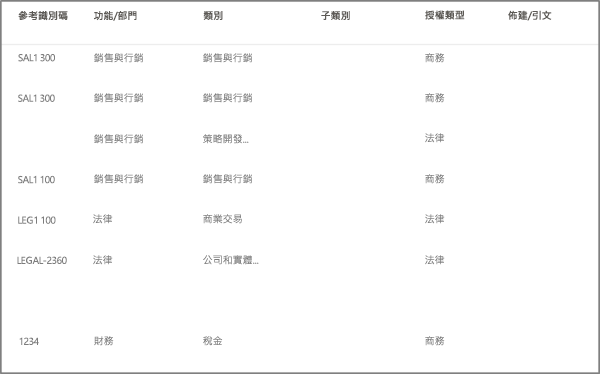
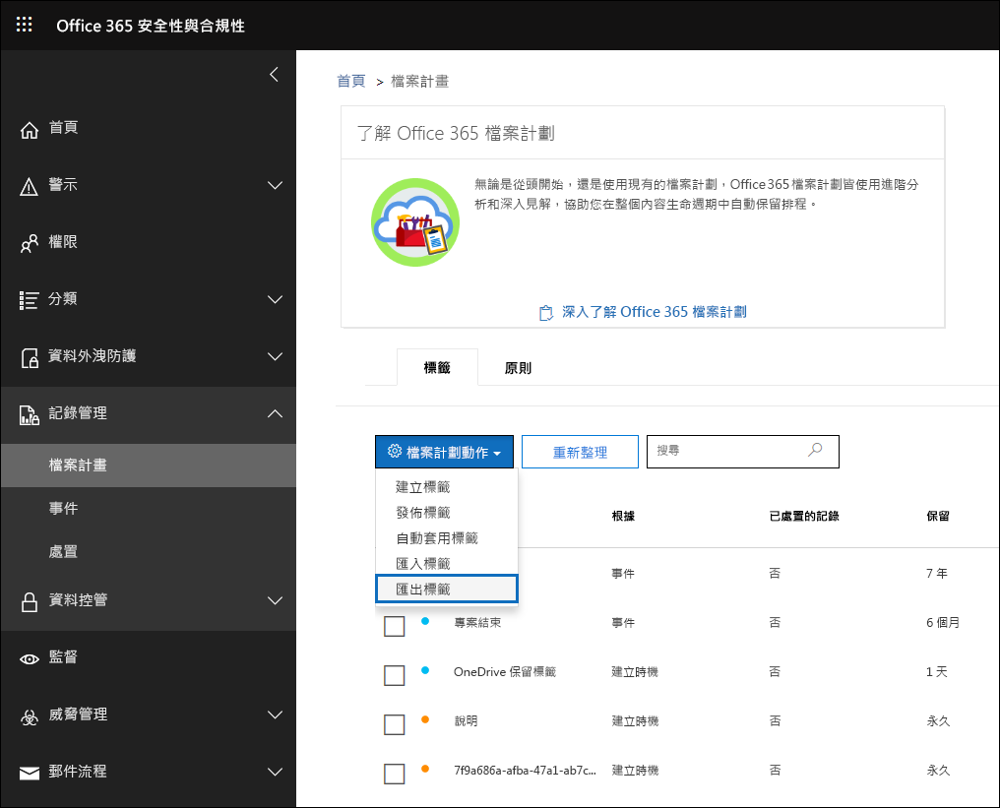

# 檔案計劃管理員的概觀Overview of file plan manager

>*[Microsoft 365 安全性與合規性的授權指引](https://aka.ms/ComplianceSD)。**[Microsoft 365 licensing guidance for security & compliance](https://aka.ms/ComplianceSD).*

檔案計劃管理員提供對於保留標籤、保留標籤原則的進階管理功能，並且提供整合的方式讓標籤和標籤至內容活動周遊整個內容生命週期 – 從建立、共同作業、記錄宣告、保留，到最終的處置。File plan manager provides advanced management capabilities for retention labels, retention label policies, and provides an integrated way to traverse label and label-to-content activity for your entire content lifecycle – from creation, through collaboration, record declaration, retention, and finally disposition. 

若要存取安全性與合規性中心的檔案計劃管理員，請移至 **[記錄管理]** >  **[檔案計劃]**。To access file plan manager in the security and compliance center, go to **Records management** > **File plan**.

## 存取檔案計劃管理員Accessing file plan manager

若要存取檔案規劃管理員，必須擁有下列其中一種系統管理員角色：To access file plan manager, you must have one of the following admin roles:
    
- 保留管理員Retention Manager

- 僅檢視保留管理員View-only Retention Manager

## 預設保留標籤和標籤原則Default retention labels and label policy

如果安全性與合規性中心中沒有保留標籤，第一次在左側導覽中選擇 [檔案計畫]\*\*\*\* 時，這會建立稱為**預設資料控管發佈原則**的標籤原則。If there are no retention labels in the Security & Compliance Center, the first time you choose **File plan** in the left nav, this creates a label policy called **Default Data Governance Publishing Policy**. 

此標籤原則包含三個保留標籤：This label policy contains three retention labels:

- **作業程序****Operational procedure**
- **一般業務****Business general**
- **合約協定****Contract agreement**

設定這些保留標籤只是為了保留內容，而非刪除內容。These retention labels are configured only to retain content, not delete content. 此標籤原則將發佈到整個組織，並可加以停用或移除。This label policy will be published to the entire organization and can be disabled or removed. 

您可以判斷誰開啟了檔案計畫管理員並開始了初次執行體驗，方法是檢閱活動 [建立保留原則]\*\*\*\* 和 [為保留原則建立了保留組態]\*\*\*\* 的稽核記錄。You can determine who opened file plan manager and kicked off the first-run experience by reviewing the audit log for the activities **Created retention policy** and **Created retention configuration for a retention policy**.

> [!NOTE]
> 由於客戶的意見反應，我們已移除了會建立預設保留標籤和以上所提及的保留標籤原則的這項功能。Due to customer feedback, we have removed this feature that creates the default retention labels and retention label policy mentioned above. 只有在 2019 年 4 月 11 日之前開啟檔案計劃管理員的情況下，才會看到這些保留標籤和保留標籤原則。You will only see these retention labels and retention label policy if you opened file plan manager before April 11, 2019.

## 瀏覽您的檔案計劃Navigating your file plan

檔案計劃管理員可讓您更輕鬆地從單一檢視，查看所有保留標籤和原則及其設定。File plan manager makes it easier see into and across the settings of all your retention labels and policies from one view.

請注意，在檔案計劃外部所建立的保留標籤可以在檔案計劃中使用，反之亦然。Note that retention labels created outside of the file plan will be available in the file plan and vice versa.

在檔案計劃 **[標籤]** 索引標籤上，下列額外資訊和功能可供使用：On the file plan **Labels** tab, the following additional information and capabilities are available:

### 標籤設定資料行Label settings columns

- [根據]\*\*\*\* 會識別觸發程序類型，該觸發程序會開始保留期間。有效的值是：**Based on** identifies the type of trigger that will start the retention period. Valid values are:
    - 事件Event
    - 建立時機When created
    - 上次修改時間When last modified
    - 套用標籤時機When labeled
- [記錄]\*\*\*\* 會識別項目是否會在套用標籤時變成宣告的記錄。有效的值是：**Record** identifies if the item will become a declared record when the label is applied. Valid values are:
    - 否No
    - 是Yes
    - Yes(Regulatory)Yes(Regulatory)
- [保留]\*\*\*\* 會識別保留類型。有效的值是：**Retention** identifies the retention type. Valid values are:
    - 保留Keep
    - 保留與刪除Keep and delete
    - 刪除Delete
- [處置]\*\*\*\* 會識別保留期間結束時內容會發生什麼情形。有效的值是：**Disposition** identifies what will happen to the content at the end of the retention period. Valid values are:
    - Nullnull
    - 不執行任何動作No action
    - 自動刪除Auto-delete
    - 需要檢閱 (也稱為處置檢閱)Review required (aka Disposition review)

### 保留標籤檔案計劃描述元資料行Retention label file plan descriptors columns

您現在可以在保留標籤的設定中包含更多資訊。You can now include more information in the configuration of your retention labels. 將檔案計劃描述元插入保留標籤會改善檔案計劃的管理性和組織。Inserting file plan descriptors into retention  labels will improve the manageability and organization of your file plan.

為了協助您開始使用，檔案計劃管理員會為以下項目提供現成的值：功能/部門、類別、授權單位類型和條款/引文。To get you started, file plan manager provides some out-of-box values for: Function/department, Category, Authority type and Provision/citation. 您可以在建立或編輯保留標籤時新增全新檔案計劃描述元值。You can add new file plan descriptor values when creating or editing a retention label. 您也可以在匯入保留標籤到檔案計劃時，指定檔案計劃描述元。You can also specify file plan descriptors when importing retention labels into your file plan. 

以下是建立或編輯保留標籤時的檔案計劃描述元步驟檢視。Here's a view of the file plan descriptors step when creating or editing a retention label.

以下是檔案計劃管理員的 **[標籤]** 索引標籤上，檔案計劃描述元的檢視。Here's a view of the file plan descriptors columns on the **Labels** tab of file plan manager.

## 匯出所有現有的保留標籤以分析及/或執行離線檢閱Export all existing retention labels to analyze and/or perform offline reviews

您可以從檔案計劃管理員將所有保留標籤的詳細資料匯出至 .csv 檔案，以協助您加速與貴組織中資料控管專案關係人進行的定期合規性檢閱。From file plan manager, you can export the details of all retention labels into a .csv file to assist you in facilitating periodic compliance reviews with data governance stakeholders in your organization.

若要匯出所有保留標籤：在 **[檔案計劃]** 頁面，**[檔案計劃動作]** \> **[匯出標籤]**。To export all retention labels: On the **File plan** page, **File plan actions** \> **Export labels**.

包含所有現有保留標籤的 \*.csv 檔案隨即開啟。A \*.csv file containing all existing retention labels will open.

## 將保留標籤匯入至您的檔案計劃Import retention labels into your file plan

您可以在 [檔案計劃管理員] 大量匯入新的保留標籤，並修改現有的保留標籤。In the File plan manager, you can bulk import new retention labels and modify existing retention labels.

若要匯出新的保留標籤，以及修改現有的保留標籤：To import new retention labels and modify existing retention labels: 

1. 移至在 **[檔案計劃]** 頁面上的 **[檔案計劃動作]** >  **[匯入標籤]**。On the **File plan** page, go to **File plan actions** > **Import labels**.

   

   

2. 下載空白範本以匯入全新保留標籤。Download a blank template to import new retention labels. 或者，您可以從當匯出組織中的現有保留標籤時所匯出的 .csv 檔案開始。Alternatively, you can start with the .csv file that is exported when you export the existing retention labels in your organization.

   

3. 填寫範本。Fill-out the template. 下列描述檔案計劃範本中每個屬性的內容和有效值。The following describes the properties and valid values for each property in the file plan template. 匯入時，每個值最多可以包含 64 個字元。For import, each value has a maximum length of 64 characters.  

   |**屬性****Property**|**類型****Type**|**有效值****Valid values**|
   |:-----|:-----|:-----|
   |LabelNameLabelName|字串String|此屬性會指定保留標籤的名稱。This property specifies the name of the retention label.|
   |留言Comment|字串String|使用此屬性來新增系統管理員保留標籤相關的描述。Use this property to add a description about the retention label for admins. 只有在安全性與合規性中心中管理標籤的系統管理員才會看到這個描述。This description appears only to admins who manage the label in the security and compliance center.|
   |附註Notes|字串String|使用此屬性來新增使用者保留標籤相關的描述。Use this property to add a description about the retention label for users. 當使用者將游標移到應用程式 (例如 Outlook、SharePoint 和 OneDrive) 中的標籤上時，就會出現此描述。This description appears when users hover over the label in apps like Outlook, SharePoint, and OneDrive. 如果您將此屬性保留空白，則會顯示說明標籤之保留設定的預設描述。If you leave this property blank, a default description is displayed, which explains the label's retention settings. |
   |IsRecordLabelIsRecordLabel|字串String|此屬性會指定標籤是否為記錄標籤。This property specifies whether the label is a record label. 標記為記錄標籤的項目會宣告為記錄。Items tagged with a record label are declared as records. 有效值為：Valid values are: **TRUE**：標籤是記錄標籤。**TRUE**: The label is a record label. 請注意，無法刪除宣告為記錄的項目。Note that items that are declared as a record can't be deleted.  **FALSE**：該標籤不是記錄標籤。**FALSE**: The label isn't a record label. 這是預設值。This is the default value.|
   |RetentionActionRetentionAction|字串String|此屬性指定由 RetentionDuration 屬性指定的值過期之後所要採取的動作。This property specifies what action to take after the value specified by the RetentionDuration property expires. 有效值為：Valid values are: **Delete**：刪除早於 RetentionDuration 屬性指定值的項目。**Delete**: Items older than the value specified by the RetentionDuration property are deleted. **Keep**：保留由 RetentionDuration 屬性指定期間內的項目，然後在期間到期時不執行任何動作。**Keep**: Retain items for the duration specified by the RetentionDuration property and then doing nothing when the duration period expires.  **KeepAndDelete**：保留由 RetentionDuration 屬性指定期間內的項目，然後在期間到期時將之刪除。**KeepAndDelete**: Retain items for the duration specified by the RetentionDuration property and then delete them when the duration period expires.   |
   |RetentionDurationRetentionDuration|字串String|此屬性會指定要保留內容的天數。This property specifies the number of days to retain the content. 有效值為：Valid values are: **無限制**：系統會無限期保留這些項目。**Unlimited**: Items will be retained indefinitely.  ***n***：正整數；例如 **365**。***n***: A positive integer; for example, **365**. 
   |RetentionTypeRetentionType|字串String|此屬性會指定保留期限是否從內容建立日期、事件日期、標籤 (標記) 日期或上次修改日期開始算起。This property specifies whether the retention duration is calculated from the content creation date, event date, labeled (tagged) date, or last modified date. 有效值為：Valid values are: **CreationAgeInDays****CreationAgeInDays** **EventAgeInDays****EventAgeInDays** **TaggedAgeInDays****TaggedAgeInDays** **ModificationAgeInDays****ModificationAgeInDays** |
   |ReviewerEmailReviewerEmail|SmtpAddressSmtpAddress|填入此屬性時，系統會在保留期間到期時觸發處置檢閱。When this property is populated, a disposition review will be triggered when the retention duration expires. 此屬性會指定 **KeepAndDelete** 保留動作檢閱者的電子郵件地址。This property specifies the email address of a reviewer for the **KeepAndDelete** retention action. 您可以包含個別使用者、通訊群組或安全性群組的電子郵件地址。You can include the email address of individual users, distribution, or security groups. 您可以使用分號指定多個電子郵件地址。You can specify multiple email addresses separated by semicolons.|
   |ReferenceIdReferenceId|字串String|此屬性指定在 **[參考識別碼]** 檔案計劃描述元中顯示的值。This property specifies the value that's displayed in the **Reference Id** file plan descriptor.| 
   |DepartmentnameDepartmentName|字串String|此屬性指定在 **[功能/部門]** 檔案計劃描述元中顯示的值。This property specifies the value that's displayed in the **Function/department** file plan descriptor.|
   |類別Category|字串String|此屬性指定在 **[類別]** 檔案計劃描述元中顯示的值。This property specifies the value that's displayed in the **Category** file plan descriptor.|
   |子類別SubCategory|字串String|此屬性指定在 **[子類別]** 檔案計劃描述元中顯示的值。This property specifies the value that's displayed in the **Sub category** file plan descriptor.|
   |AuthorityTypeAuthorityType|字串String|此屬性指定在 **[授權單位類型]** 檔案計劃描述元中顯示的值。This property specifies the value that's displayed in the **Authority type** file plan descriptor.|
   |CitationNameCitationName|字串String|此屬性指定在 **[條款/引文]** 檔案計劃描述元中顯示的引文名稱，例如「2002 年的沙賓法案」。This property specifies the name of the citation displayed in the **Provision/citation** file plan descriptor; for example "Sarbanes-Oxley Act or 2002". |
   |CitationUrlCitationUrl|字串String|此屬性指定在 **[條款/引文]** 檔案計劃描述元中顯示的 URL。This property specifies the URL that's displayed in the **Provision/citation** file plan descriptor.|
   |CitationJurisdictionCitationJurisdiction|字串String|此屬性指定在 **[條款/引文]** 檔案計劃描述元中顯示的管轄單位或代理機構；例如「美國證券交易委員會 (SEC)」。This property specifies the jurisdiction or agency that's displayed in the **Provision/citation** file plan descriptor; for example, "U.S. Securities and Exchange Commission (SEC)".|
   |RegulatoryRegulatory|字串String|保留空白。Leave blank. 目前無法使用此屬性。This property isn't used at this time.|
   |EventTypeEventType|字串String|此屬性會指定與標籤相關聯的保留規則。This property specifies the retention rule that's associated with the label. 您可以使用唯一識別規則的任何值。You can use any value that uniquely identifies the rule. 例如：For example: **Name****Name** **Distinguished name (DN)****Distinguished name (DN)** **GUID****GUID**  您可以使用 [Get-RetentionComplianceRule](https://docs.microsoft.com/powershell/module/exchange/get-retentioncompliancerule?view=exchange-ps) Cmdlet 來檢視可用的保留規則。You can use the [Get-RetentionComplianceRule](https://docs.microsoft.com/powershell/module/exchange/get-retentioncompliancerule?view=exchange-ps) cmdlet to view the available retention rules. 請注意，如果從某組織中匯出標籤，在將標籤匯入至另​​一個組織時，不可使用該組織的 EventType 屬性值。Note that if you export labels from one organization, you can't use the values for the EventType  property from that organization when importing labels to a different organization. 這是因為對組織而言 EventType 值是唯一的。That because the EventType values are unique to an organization. |
   |||

   以下是含有保留標籤相關資訊的範本範例。Here's an example the template containing the information about retention labels.

   

4. 在匯入檔案計劃精靈頁面的步驟 3 下方，按一下 **[瀏覽檔案]** 以上傳填入的範本。Under step 3 on the import file plan wizard page, click **Browse for files** to upload the filled-out template. 

   檔案計劃管理員會驗證項目並且顯示匯入統計資料。File plan manager will validate the entries and display the import statistics.

   

   萬一有驗證錯誤，檔案計劃匯入將會繼續驗證匯入檔案中的每個項目，並在匯入檔案中顯示參考行/列數的所有錯誤、複製顯示的錯誤結果，讓您可以輕鬆地返回匯入檔案並更正錯誤。In the event there is a validation error, file plan import will continue to validate every entry in the import file and display all errors referencing line/row numbers in the import file, copy the displayed error results so that you can easily return to the import file and correct the errors.

5. 匯入完成後，返回檔案計劃管理員，讓新的保留標籤與新的或現有的保留標籤原則產生關聯。When the import is complete, return to file plan manager to associate the new retention labels to new or existing retention label policies.

   
