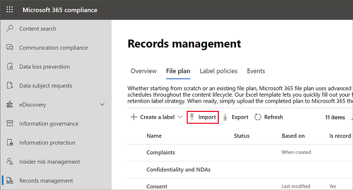

# 使用檔案計畫來管理保留標籤

>*[Microsoft 365 安全性與合規性的授權指引](/office365/servicedescriptions/microsoft-365-service-descriptions/microsoft-365-tenantlevel-services-licensing-guidance/microsoft-365-security-compliance-licensing-guidance)。*

雖然您可以透過 Microsoft 365 合規性中心的 [資訊控管] 建立及管理保留標籤，但來自 [記錄管理] 的檔案計畫還具有額外的管理功能：

- 您可以從試算表匯入相關資訊，大量建立保留標籤。

- 您可以從現有保留標籤匯出資訊，以便進行分析和離線共同作業或進行大量編輯。

- 有關保留標籤的詳細資訊將會顯示，讓您可以從一個檢視輕鬆查看所有保留標籤的各項設定。

- 檔案計畫描述元針對每個標籤支援額外和選用的資訊。

檔案計畫可用於所有保留標籤，即使它們不會將內容標示為記錄。

如需有關保留標籤為何及其使用方式的相關資訊，請參閱[瞭解保留原則及保留標籤](retention.md)。

## 存取檔案計畫

若要存取檔案計畫，您必須擁有下列其中一種系統管理員角色：
    
- 保留管理員

- 僅檢視保留管理員

在 Microsoft 365 合規性中心中，移至 [解決方案]  >  [記錄管理]  >  [檔案計畫]。 

如果功能窗格中未顯示 [記錄管理]，請先向下捲動，然後選取 [顯示全部]。

## 瀏覽您的檔案計畫

如果您已透過 Microsoft 365 合規性中心的 [資訊控管] 建立保留標籤，則這些標籤會自動顯示在您的檔案計畫中。 

同樣地，如果您現在在檔案計畫中建立保留標籤，如果未將標籤設定為將內容標示為記錄，則也可以從 [資訊控管] 中取得。

在 [檔案計畫] 頁面上，您會看到所有標籤，具有其狀態和設定、選用的檔案計畫描述元、用來分析或啟用標籤離線檢閱的匯出選項，以及用來建立保留標籤的匯入選項。 

### 標籤設定欄

除了標籤 [名稱] 以外的所有欄，都可以透過選取 [自訂欄] 選項來顯示或隱藏。 但根據預設，前幾欄會顯示標籤狀態及其設定的相關資訊： 

- [狀態] 可識別標籤是否包含在標籤原則或自動套用原則中 (**作用中**) 與否 (**非作用中**)。

- [根據] 可識別保留期間如何與何時開始。 有效值：
    - 事件
    - 建立時機
    - 上次修改日期
    - 已套用標籤時

- [記錄中] 可識別套用標籤時，項目是否標記為記錄。 有效值：
    - 否
    - 是
    - Yes(Regulatory)

- [保留期間] 可識別保留期間。 有效值：
    - 天
    - 月
    - 年
    - 永久
    - 無

- [處置類型] 可識別保留期間結束時，內容會發生什麼情形。 有效值：
    - 不執行任何動作
    - 自動刪除
    - 需要檢閱

### 檔案計畫描述元欄

檔案計畫可讓您隨著保留標籤包含更多資訊。 這些檔案計畫描述元提供更多可改善您要加上標籤之內容的可管理性和組織的選項。

根據預設，從 [參照識別碼] 開始，接下來的幾個欄會顯示這些檔案計畫描述元，供您在建立保留標籤或編輯現有標籤時指定。 

為了讓您開始使用，以下檔案計畫描述元有一些現成可用的值： 
- 商務功能/部門
- 類別
- 授權單位類型
- 條款/引文 

建立或編輯保留標籤時，檔案計畫描述元的範例：

檔案計畫描述元欄的範例檢視：

## 匯出所有保留標籤以分析或啟用離線檢閱

您可以從檔案計畫，將所有保留標籤的詳細資料匯出至 .csv 檔案，以協助您加速與組織中資料控管專案關係人進行的定期合規性檢閱。

若要匯出所有保留標籤：在 [檔案計畫] 頁面上，按一下 [匯出]：

包含所有現有保留標籤的 *.csv 檔案隨即開啟。 例如：

## 將保留標籤匯入至您的檔案計劃

在檔案計畫中，您可以大量匯入新保留標籤，並使用相同的方法來大量修改現有的保留標籤。

若要匯出新的保留標籤，以及修改現有的保留標籤： 

1. 在 [檔案計畫] 頁面上，按一下 [匯入] 以使用 [填寫並匯入您的檔案計畫] 頁面：

   

   

2. 下載空白範本以匯入全新保留標籤。 或者，您可以從當匯出組織中的現有保留標籤時所匯出的 .csv 檔案開始。

   

3. 使用說明每個屬性的屬性和有效值的以下資訊填寫範本。 若要匯出，某些值的長度上限為：
    
    - **LabelName**： 長度上限為 64 個字元
    - **註解** 和 **附注**： 長度上限為 1024 個字元
    - 所有其他值：無限制長度
     
    
   |屬性	|類型|有效值|
   |:-----|:-----|:-----|
   |LabelName|字串|此屬性會指定保留標籤的名稱。|
   |留言|字串|使用此屬性來新增系統管理員保留標籤相關的描述。 只有在合規性中心中管理保留標籤的系統管理員才會看到這個描述。|
   |附註|字串|使用此屬性來新增使用者保留標籤相關的描述。 當使用者將游標移到應用程式 (例如 Outlook、SharePoint 和 OneDrive) 中的標籤上時，就會出現此描述。 如果您將此屬性保留空白，則會顯示說明標籤之保留設定的預設描述。 |
   |IsRecordLabel|字串|此屬性會指定標籤是否將內容標示為記錄。 有效值為：  **TRUE**：標籤會將項目標示為記錄，並因此無法刪除該項目。  **FALSE**：標籤不會將內容標示為記錄。 這是預設值。|
   |RetentionAction|字串|此屬性指定由 RetentionDuration 屬性指定的值過期之後所要採取的動作。 有效值為：  **Delete**：刪除早於 RetentionDuration 屬性指定值的項目。 **Keep**：保留由 RetentionDuration 屬性指定期間內的項目，然後在期間到期時不執行任何動作。  **KeepAndDelete**：保留由 RetentionDuration 屬性指定期間內的項目，然後在期間到期時將之刪除。   |
   |RetentionDuration|字串|此屬性會指定要保留內容的天數。 有效值為：  **無限制**：系統會無限期保留這些項目。  **_n_*_： 正整數；例如，_* 365**。 
   |RetentionType|字串|此屬性會指定保留期限是否從內容建立日期、事件日期、已套用標籤日期或上次修改日期算起。 有效值為：  **CreationAgeInDays** **EventAgeInDays** **TaggedAgeInDays** **ModificationAgeInDays** |
   |ReviewerEmail|SmtpAddress|填入此屬性時，系統會在保留期間到期時觸發處置檢閱。 此屬性會指定 **KeepAndDelete** 保留動作檢閱者的電子郵件地址。 您可以包含個別使用者、通訊群組或安全性群組的電子郵件地址。 您可以使用分號指定多個電子郵件地址。|
   |ReferenceId|字串|此屬性指定在 [參考識別碼] 檔案計劃描述元中顯示的值，您可以將它用作組織的唯一值。| 
   |Departmentname|字串|此屬性指定在 **[功能/部門]** 檔案計劃描述元中顯示的值。|
   |類別|字串|此屬性指定在 **[類別]** 檔案計劃描述元中顯示的值。|
   |子類別|字串|此屬性指定在 **[子類別]** 檔案計劃描述元中顯示的值。|
   |AuthorityType|字串|此屬性指定在 **[授權單位類型]** 檔案計劃描述元中顯示的值。|
   |CitationName|字串|此屬性指定在 [條款/引文] 檔案計畫描述元中顯示的引文名稱。 例如，「2002 年沙賓法案」。 |
   |CitationUrl|字串|此屬性指定在 **[條款/引文]** 檔案計劃描述元中顯示的 URL。|
   |CitationJurisdiction|字串|此屬性指定在 [條款/引文] 檔案計畫描述元中顯示的管轄單位或代理機構。 例如「美國證券交易委員會 (SEC)」|
   |Regulatory|字串|保留空白。 目前無法使用此屬性。|
   |EventType|字串|此屬性會指定與標籤相關聯的保留規則。 您可以使用唯一識別規則的任何值。 例如： **Name** **Distinguished name (DN)** **GUID**  您可以使用 [Get-RetentionComplianceRule](/powershell/module/exchange/get-retentioncompliancerule) Cmdlet 來檢視可用的保留規則。 請注意，因為 EventType 值是每個組織特有，如果從某組織匯出標籤，您無法使用來自該組織的 EventType 屬性值，來將標籤匯入至不同組織。|
   |||

   以下是含有保留標籤相關資訊的範本範例。

   

4. 在 [填寫並匯入您的檔案計畫] 頁面的步驟 3 下方，按一下 [瀏覽檔案] 以上傳填寫的範本。 

   檔案計畫會驗證項目並顯示匯入統計資料。

   

   如果發生驗證錯誤，檔案計畫匯入會繼續驗證匯入檔案中的每個項目，並顯示參考匯入檔案中該行和列號的所有錯誤。 複製顯示的錯誤結果，以便在您回到匯入檔案時可加以修正。

匯入完成後，您現在可以將保留標籤新增至新的保留標籤原則，或自動套用。 您可以直接從 [檔案計畫] 頁面執行此動作，方法是選取 [+ 建立標籤] 下拉式清單，然後選取 [發佈標籤的原則] 或 [自動套用標籤的原則]。

## 後續步驟

如需有關建立和編輯保留標籤及其原則的詳細資訊，可參閱下列指南：
- [建立保留標籤，並在應用程式中使用這些標籤](create-apply-retention-labels.md)
- [自動將保留標籤套用到內容](apply-retention-labels-automatically.md)