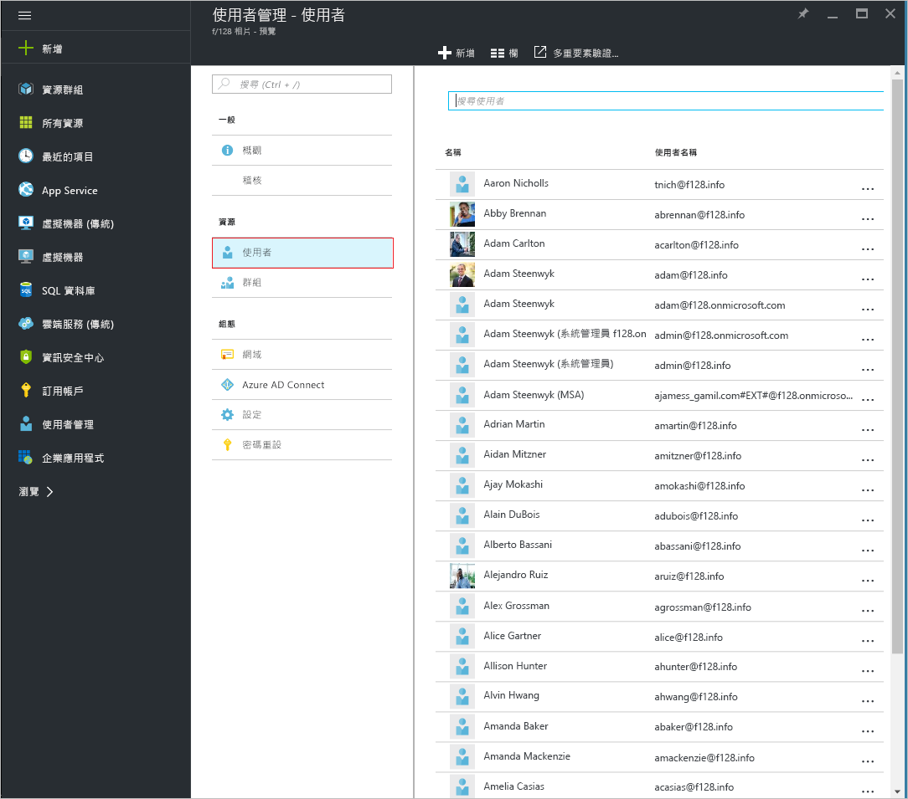
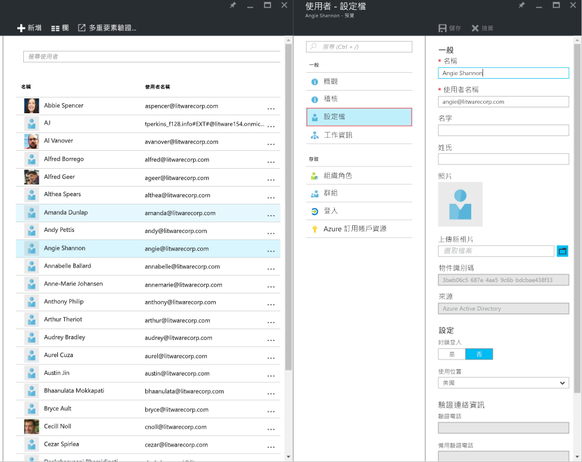
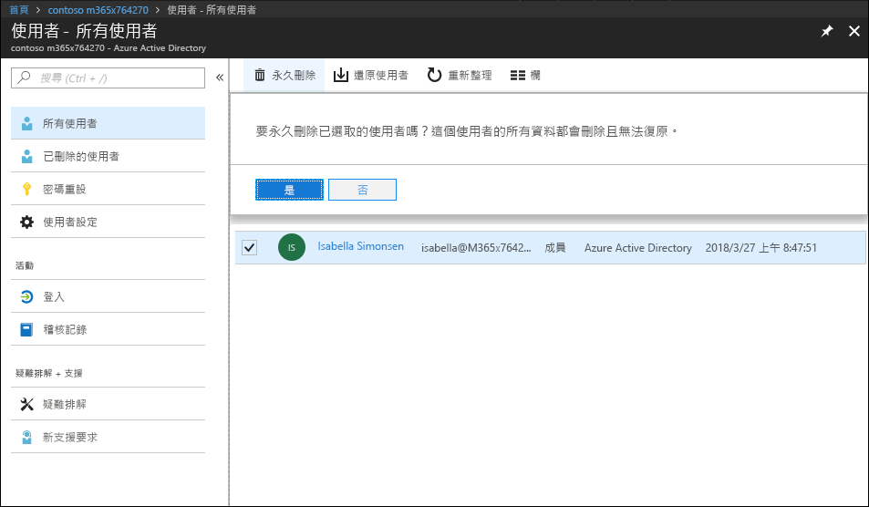
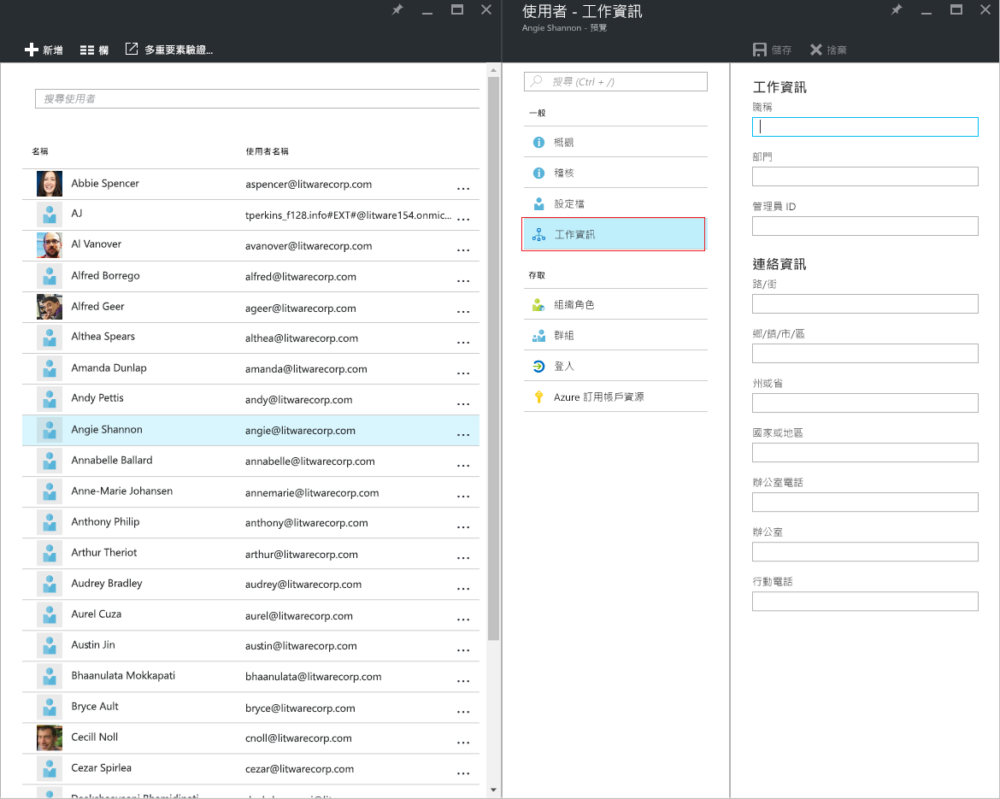
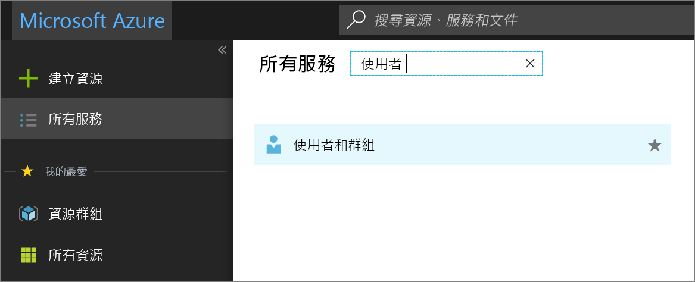
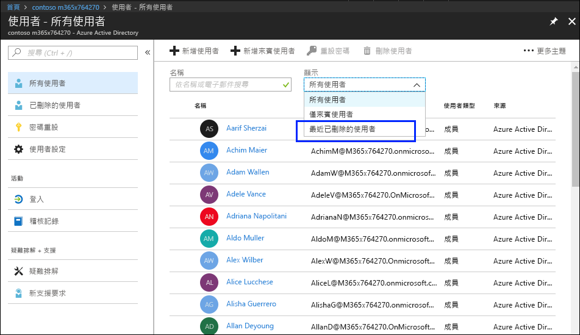
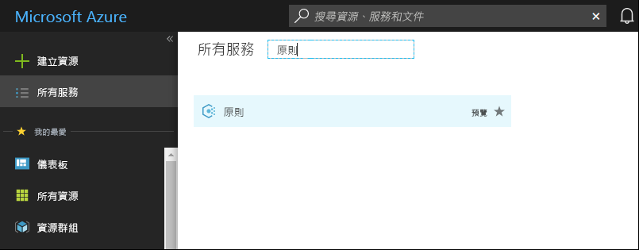
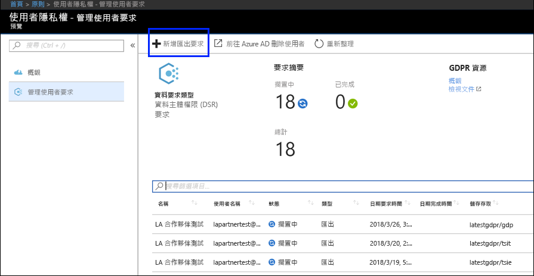
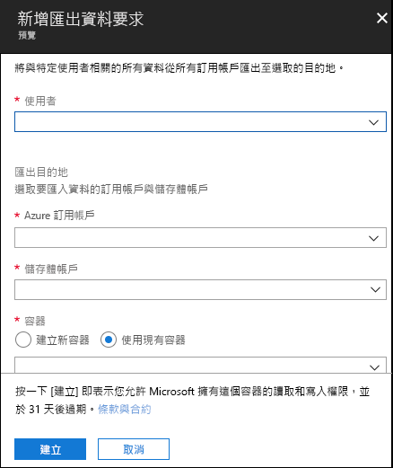

# GDPR 的 Azure 資料主體要求Azure Data Subject Requests for the GDPR

## 資料主體要求 (DSR) 簡介Introduction to Data Subject Requests (DSRs)

歐盟資料保護規範 (GDPR) 賦予人員 (在規範中稱為「資料主體」**) 權限，以管理由雇主或其他類型的公司或組織 (稱為「資料控制者」** 或簡稱「控制者」**) 收集而來的個人資料。個人資料在 GDPR 中的定義非常廣泛，係指與已識別或可識別的自然人相關的任何資料。GDPR 賦予資料主體對其個人資料的特定權限，這些權限包括取得個人資料副本、要求更正資料、限制資料的處理、刪除資料或以電子格式接收資料，以便轉交給其他控制者。由資料主體向控制者提出對其個人資料採取某項動作的正式要求，稱為「資料主體要求」** 或 DSR。The EU Data Protection Regulation (GDPR) gives rights to people (known in the regulation as *data subjects*) to manage the personal data that has been collected by an employer or other type of agency or organization (known as the *data controller* or just *controller*). Personal data is defined very broadly under the GDPR as any data that relates to an identified or identifiable natural person. The GDPR gives data subjects specific rights to their personal data; these rights include obtaining copies of personal data, requesting corrections to it, restricting the processing of it, deleting it, or receiving it in an electronic format so it can be moved to another controller. A formal request by a data subject to a controller to take an action on their personal data is called a *Data Subject Request* or DSR.

本指南會討論如何使用 Microsoft 產品、服務及系統管理工具，協助我們的控制者客戶找出並對個人資料採取動作，以回應 DSR；尤其是針對如何找出、存取與處理在 Microsoft 雲端中常駐的個人資料。以下是本指南中所述程序的快速概觀：The guide discusses how to use Microsoft products, services and administrative tools to help our controller customers find and act on personal data to respond to DSRs. Specifically, this includes how to find, access, and act on personal data that reside in the Microsoft cloud. Here’s a quick overview of the processes outlined in this guide:

- **探索：** 使用搜尋和探索工具，讓您更輕鬆地找到可能是 DSR 主體的客戶資料。一旦收集了潛在回應文件，您就可以執行下列步驟中所述的一或多個 DSR 動作以回應要求。或者，您也可能判斷該要求不符合貴組織回應 DSR 的指導方針。**Discover**—Use search and discovery tools to more easily find customer data that may be the subject of a DSR. Once potentially responsive documents are collected, you can perform one or more of the DSR actions described in the following steps to respond to the request. Alternatively, you may determine that the request doesn't meet your organization’s guidelines for responding to DSRs.
 - **存取：** 擷取在 Microsoft 雲端中常駐的個人資料，若有要求，請製作可供資料主體使用的副本。**Access**—Retrieve personal data that resides in the Microsoft cloud and, if requested, make a copy of it that can be available to the data subject.
- **修正：** 在適用情況下，對個人資料進行變更或實行其他要求的動作。**Rectify.** Make changes or implement other requested actions on the personal data.
- **限制：** 透過移除各種不同 Azure 服務的授權，或在可能的情況下關閉所需的服務，對個人資料的處理設下限制。您也可以從 Microsoft 雲端中移除資料，並在內部部署或其他位置保留資料。**Restrict**—Restrict the processing of personal data, either by removing licenses for various Azure services or turning off the desired services where possible. You can also remove data from the Microsoft cloud and retain it on-premises or at another location.
- **刪除：** 永久移除 Microsoft 雲端中常駐的個人資料。**Delete**—Permanently remove personal data that resided in the Microsoft cloud.
- **匯出：** 將個人資料的電子副本 (以機器可讀取的格式) 提供給資料主體。**Export**—Provide an electronic copy (in a machine-readable format) of personal data to the data subject.

本指南中的每一節說明資料控制者組織可以採取的程序，以回應對 Microsoft 雲端中個人資料的 DSR。Each section in this guide outlines the technical procedures that a data controller organization can take to respond to a DSR for personal data in the Microsoft cloud.

## 術語Terminology

以下提供與本指南相關的詞彙定義。The following provides definitions of terms that are relevant to this guide.

- **控制者：** 自然人或法人、公家機關、公司或其他主體，不論單獨或與其他單位聯合，會決定處理個人資料的用途以及方式，其中此類處理的用途以及方式是由聯盟與成員國法律所決定，控制者人選或提名控制者的特定準則可由聯盟與成員國法律提供。**Controller.** The natural or legal person, public authority, agency or other body which, alone or jointly with others, determines the purposes and means of the processing of personal data; where the purposes and means of such processing are determined by Union or Member State law, the controller or the specific criteria for its nomination may be provided for by Union or Member State law.

- **個人資料和資料主體：** 表示與已識別或可識別之自然人 (以下稱為「資料主體」) 相關的任何資訊；可識別的自然人是可以直接或間接識別的人員，尤其是藉由參照如名稱、身分證號碼、位置資料、線上識別碼，或特定於該自然人的身體、生理、基因、心理、經濟、文化或社會身分等一個或多個識別碼來識別。**Personal data and data subject.** Any information relating to an identified or identifiable natural person (‘data subject’); an identifiable natural person is one who can be identified, directly or indirectly, in particular by reference to an identifier such as a name, an identification number, location data, an online identifier or to one or more factors specific to the physical, physiological, genetic, mental, economic, cultural or social identity of that natural person.

- **處理者：** 自然人或法人、公家機關、公司，或代表控制者處理個人資料的其他主體。**Processor.** A natural or legal person, public authority, agency or other body which processes personal data on behalf of the controller.

- **客戶資料：** 透過企業服務由客戶本身或代表客戶提供給 Microsoft 的所有資料，包括所有文字、音訊、視訊或影像檔案和軟體。客戶資料包括 (1) 使用者的識別資訊 (例如 Azure Active Directory 中的使用者名稱和連絡人資訊)，以及客戶上傳到特定服務或在特定服務中建立的客戶內容 (例如，Azure 儲存體帳戶中的客戶內容、Azure SQL Database 的客戶內容，或 Azure 虛擬機器中客戶的虛擬機器映像)。**Customer Data**—All data, including all text, sound, video, or image files, and software, that are provided to Microsoft by, or on behalf of, a customer through use of the enterprise service. Customer Data includes both (1) identifiable information of end users (e.g., user names and contact information in Azure Active Directory) and Customer Content that a customer uploads into or creates in specific services (e.g., customer content in an Azure Storage account, customer content of an Azure SQL Database, or a customer’s virtual machine image in Azure Virtual Machines).

- **系統所產生的記錄檔：** Microsoft 所產生的記錄檔及相關資料，可協助 Microsoft 向使用者提供企業服務。系統所產生的記錄檔主要包含經過假名化處理的資料 (例如唯一識別碼，通常由系統所產生，無法單獨用來識別個人，但可用來向使用者提供企業服務)。系統所產生的記錄檔也可能包含使用者的識別資訊 (例如使用者名稱)。**System-Generated Logs**—Logs and related data generated by Microsoft that help Microsoft provide enterprise services to users. System-generated logs contain primarily pseudonymized data, such as unique identifiers – typically a number generated by the system that cannot on its own identify an individual person but is used to deliver the enterprise services to users. System-generated logs may also contain identifiable information about end users, such as a user name.

## 如何使用本指南How to use this guide

本指南包含兩個部分：This guide consists of two parts:

**第 1 部分：回應資料主體對客戶資料的要求**—本指南中的第 1 部分討論了如何從您所撰寫資料的應用程式中，存取、修正、限制、刪除以及匯出資料。本節將詳細說明如何針對客戶內容以及識別資訊執行 DSR。**Part 1: Responding to Data Subject Requests for Customer Data** — Part 1 of this guide discusses how to access, rectify, restrict, delete, and export data from applications in which you have authored data. This section details how to execute DSRs against both Customer Content and also identifiable information of end users.

**第 2 部分：回應資料主體對系統所產生記錄檔的要求** - 當您使用 Microsoft 企業服務時，Microsoft 會產生某些資訊 (稱為「系統所產生的記錄檔」) 以提供服務。本指南中的第 2 部分將討論如何針對 Azure 來存取、刪除及匯出這類資訊。**Part 2: Responding to Data Subject Requests for System-Generated Logs** — When you use Microsoft’s enterprise services, Microsoft generates some information, known as System-Generated Logs, in order to provide the service. Part 2 of this guide discusses how to access, delete and export such information for Azure.

## 了解 Azure Active Directory 和 Microsoft 服務帳戶的 DSRUnderstanding DSRs for Azure Active Directory and Microsoft Service Accounts

在考慮為企業客戶所提供的服務時，請務必了解要在指定的 Azure Active Directory (AAD) 範圍內執行 DSR。值得注意的是，DSR 一律會在指定的 AAD 租用戶中執行。如果使用者參與了多個租用戶，請務必強調特定的 DSR「只能」\*\* 在接收到要求的指定租用戶範圍內執行。請務必了解這點，因為這代表由某個企業客戶所執行的 DSR **不會**影響相鄰企業客戶的資料。When considering services provided to enterprise customers, execution of DSRs must always be understood within the context of a specific Azure Active Directory (AAD) tenant. Notably, DSRs are always executed within a given AAD tenant. If a user is participating in multiple tenants, it is important to emphasize that a given DSR is *only* executed within the context of the specific tenant the request was received within. This is critical to understand as it means the execution of a DSR by one enterprise customer **will not** impact the data of an adjacent enterprise customer.

在提供給企業客戶的服務範圍內，這點同樣也適用於 Microsoft 服務帳戶 (MSA)：對「與 AAD 租用戶相關聯的」\*\* MSA 帳戶所執行的 DSR，**只會**針對租用戶中的資料。此外，在處理租用戶中的 MSA 帳戶時，請務必了解下列事項：The same also applies for Microsoft Service Accounts (MSA) within the context of services provided to an enterprise customer: execution of a DSR against an MSA account *associated with an AAD tenant* **will only** pertain to data within the tenant. In addition, it is important to understand the following when handling MSA accounts within a tenant:

-   若 MSA 使用者建立了 Azure 訂用帳戶，我們會將該訂用帳戶視為 AAD 租用戶來處理。因此，DSR 的範圍會限制在租用戶內，如上所述。If an MSA user creates an Azure subscription, the subscription will be handled as if it were an AAD tenant. Consequently, DSRs are scoped within the tenant as described above.

-   若您刪除了透過 MSA 帳戶所建立的 Azure 訂用帳戶，**將不會影響到**實際的 MSA 帳戶。同樣地，如上所述，在 Azure 訂用帳戶中所執行的 DSR，會限制在租用戶本身的範圍內。If an Azure subscription created via an MSA account is deleted, **it will not affect** the actual MSA account. Again, as noted above, DSRs executing within the Azure subscription are limited to the scope of the tenant itself.

**在指定的租用戶外**，對 MSA 帳戶本身所執行的 DSR，會透過消費者隱私權儀表板來執行。請參閱《Windows 資料主體要求指南》以取得詳細資訊。DSRs against an MSA account itself, **outside a given tenant**, are executed via the Consumer Privacy Dashboard. Please refer to the Windows Data Subject Request Guide for further details.

## 第 1 部分：客戶資料的 DSR 指南Part 1: DSR Guide for Customer Data

### 針對客戶資料執行 DSRExecuting DSRs against Customer Data

Microsoft 透過 Azure 入口網站，提供了存取、刪除及匯出特定客戶資料的功能；您也可直接透過既有的應用程式開發介面 (API) 或特定服務的使用者介面 (UI) 來執行上述功能 (也稱為「產品內體驗」\*\*)。在上述服務各自的參考文件中有詳細資料，說明這類的產品內體驗。Microsoft provides the ability to access, delete, and export certain Customer Data through the Azure Portal and also directly via pre-existing application programming interfaces (APIs) or user interfaces (UIs) for specific services (also referred to as *in-product experiences*). Details regarding such in-product experiences are described in the respective services’ reference documentation.

>[!Important]  
> 支援產品內 DSR 的服務需要直接使用服務的應用程式開發介面 (API) 或使用者介面 (UI)，來描述適用的 CRUD (建立、讀取、更新、刪除) 作業。因此，除了在 Azure 入口網站中執行 DSR 以外，還必須另外在指定的服務中執行 DSR，才能完成指定資料主體的完整要求。請參閱特定服務的參考文件，以取得詳細資訊。Services supporting in-product DSRs require direct usage of the service’s application programming interface (API) or user interface (UI), describing applicable CRUD (create, read, update, delete) operations. Consequently, execution of DSRs within a given service must be done in addition to execution of a DSR within the Azure Portal in order to complete a full request for a given data subject. Please refer to specific services’ reference documentation for further details.

### 步驟 1：探索Step 1: Discover

回應 DSR 的第一個步驟是先找出個人資料，也就是要求的主體。The first step in responding to a data subject rights request is to search for and identify the customer data that is the subject of the request. 第一個步驟 (尋找並檢閱上述的個人資料) 可協助您判斷 DSR 是否符合貴組織的需求，以便接受或拒絕。This first step — finding and reviewing the personal data at issue — will help you determine whether a DSR meets your organization's requirements for honoring or declining a DSR. 例如，在找出並檢閱個人資料後，您可能因為這樣做會對其他人的權利和自由造成負面影響，而判斷要求不符合貴組織的需求。This first step—finding and reviewing the personal data at issue—will help you determine whether the data subject’s request meets your organization's requirements for honoring or declining it. For example, after finding and reviewing the personal data, you may determine the request doesn’t meet your organization’s requirements because doing so may adversely affect the rights and freedoms of others.

找到資料後，接著您可以執行指定的動作來滿足資料主體的要求。After you find the data, you can then perform the specific action to satisfy the request by the data subject.

### Azure Active DirectoryAzure Active Directory

[Azure Active Directory](https://azure.microsoft.com/services/active-directory/) Microsoft 的雲端式、多租用戶目錄與身分識別管理服務。您可以使用 [Azure 入口網站](https://portal.azure.com/)找出使用者的識別資訊，例如客戶和員工的使用者設定檔及使用者工作資訊，其中包含在您 [Azure Active Directory](https://azure.microsoft.com/services/active-directory/) (AAD) 環境中的個人資料。[Azure Active Directory](https://azure.microsoft.com/services/active-directory/) is Microsoft’s cloud-based, multi-tenant directory and identity management service. You can locate identifiable information of end users, such as customer and employee user profiles and user work information that contain personal data in your [Azure Active Directory](https://azure.microsoft.com/services/active-directory/) (AAD) environment by using the [Azure portal](https://portal.azure.com/).

這在想要尋找或變更特定使用者的個人資料時尤其有用。您也可以新增或變更使用者設定檔與工作資訊。您必須使用目錄的全域系統管理員帳戶來登入。This is particularly helpful if you want to find or change personal data for a specific user. You can also add or change user profile and work information. You must sign in with an account that’s a global admin for the directory.

#### 如何找出或檢視使用者設定檔及工作資訊？How do I locate or view user profile and work information?

1. 請用目錄的全域系統管理員帳戶來登入 [Azure 入口網站](https://portal.azure.com/)。Sign in to the [Azure portal](https://portal.azure.com/) with an account that's a global admin for the directory.

1. 請選取 [所有服務]\*\*\*\*、在文字方塊中輸入 [使用者和群組]\*\*\*\*，然後選取 [輸入]\*\*\*\*。Select **All services**, enter **Users and groups** in the text box, and then select **Enter**.

     

3. 在 [使用者和群組]\*\*\*\* 刀鋒視窗上，選取 [使用者]\*\*\*\*。On the **Users and groups** blade, select **Users**.

     

4.  在 [使用者和群組 - 使用者]\*\*\*\* 刀鋒視窗中，從清單中選取使用者；然後在所選使用者的刀鋒視窗中，選取 [設定檔]\*\*\*\* 以檢視可能包含個人資料的使用者設定檔資訊。On the **Users and groups - Users** blade, select a user from the list, and then, on the blade for the selected user, select **Profile** to view user profile information that might contain personal data.

    

5. 若您需要新增或變更使用者設定檔資訊，可以這麼做；然後請在命令列中選取 [儲存]\*\*\*\*。If you need to add or change user profile information, you can do so, and then, in the command bar, select **Save.**

<!-- steps 6 and 7 not in original 
6. On the blade for the selected user, select **Work Info** to view user work information that may contain personal data.

     

7. If you need to add or change user work information, you can do so, and then, in the command bar, select **Save.**

end of text to isolate -->

#### 服務特定介面Service-Specific Interfaces

Microsoft 提供直接透過既有的應用程式開發介面 (API) 或特定服務的使用者介面 (UI)，來探索客戶資料的能力。在上述服務各自的參考文件中有詳細資料，說明了適用的 CRUD (建立、讀取、更新、刪除) 作業。Microsoft provides the ability to discover Customer Data directly via pre-existing application programming interfaces (APIs) or user interfaces (UIs) for specific services. Details are described in the respective services’ reference documentation, describing applicable CRUD (create, read, update, delete) operations.

### 步驟 2：存取Step 2: Access

找到包含個人資料且可能會回應 DSR 的客戶資料之後，您與貴組織有權決定要將哪些資料提供給資料主體。您可以提供他們實際文件的副本、經過適當刪減的版本，或您認為適合分享的部分螢幕擷取畫面。對於這些存取要求的每項回應，您都必須擷取一份文件副本，或其他包含回應資料的項目。After you’ve found Customer Data containing personal data that is potentially responsive to a DSR, it is up to you and your organization to decide which data to provide to the data subject. You can provide them with a copy of the actual document, an appropriately redacted version, or a screenshot of the portions you have deemed appropriate to share. For each of these responses to an access request, you will have to retrieve a copy of the document or other item that contains the responsive data.

當您提供副本給資料主體時，可能需要移除或刪減關於其他資料主體的個人資訊，以及任何機密資訊。When providing a copy to the data subject, you may have to remove or redact personal information about other data subjects and any confidential information.

以下說明如何取得資料副本以便回應 DSR 存取要求。The following explains how to get a copy of data in response to a DSR access request.

#### Azure Active DirectoryAzure Active Directory

Microsoft 提供入口網站與產品內體驗，讓企業客戶的租用戶系統管理員能夠管理 DSR 存取要求。DSR 存取要求存取要求可允許針對下列使用者個人資料進行存取，包括：(a) 使用者的識別資訊和 (b) 服務所產生的記錄。Microsoft offers both a portal and in-product experiences providing the enterprise customer’s tenant administrator the capability to manage DSR access requests. DSR Access requests allow for access of the personal data of the user, including: (a) identifiable information about an end-user and (b) system-generated logs.

#### 服務特定介面Service-Specific Interfaces

Microsoft 提供直接透過既有的應用程式開發介面 (API) 或特定服務的使用者介面 (UI)，來探索客戶資料的能力。在上述服務各自的參考文件中有詳細資料，說明了適用的 CRUD (建立、讀取、更新、刪除) 作業。Microsoft provides the ability to discover Customer Data directly via pre-existing application programming interfaces (APIs) or user interfaces (UIs) for specific services. Details are described in the respective services’ reference documentation, describing applicable CRUD (create, read, update, delete) operations.

### 步驟 3：修正Step 3: Rectify

若資料主體要求您修正貴組織資料中常駐的個人資料，您和貴組織需要判斷是否適合接受要求。修正資料可能包含採取下列動作，例如：從文件或其他類型的項目中，編輯、刪減或移除個人資料。修正 Microsoft 支援服務和 FastTrack 資料最方便的方式如下所示。If a data subject has asked you to rectify the personal data that resides in your organization’s data, you and your organization will have to determine whether it’s appropriate to honor the request. Rectifying the data may include taking actions such as editing, redacting, or removing personal data from a document or other type or item. The most expedient way to do this for Microsoft Support and FastTrack data is provided below.

#### Azure Active DirectoryAzure Active Directory

根據特定的 Microsoft 服務，企業客戶可管理 DSR 修正要求，包括有限的編輯功能。身為資料處理者，Microsoft 不提供對系統所產生記錄檔的更正功能；因為這種記錄檔可反映出實際的活動，並構成 Microsoft 服務中所發生事件的歷史記錄。至於 Azure Active Directory，我們提供了有限的編輯功能，可讓您修正使用者的識別資訊，以下會進一步說明。Enterprise customers have the ability to manage DSR rectify requests, including limited editing features per the nature of a given Microsoft service. As a data processor, Microsoft does not offer the ability to correct system-generated logs as it reflects factual activities and constitutes a historical record of events within Microsoft services. With respect to Azure Active Directory, limited editing features exist to rectify identifiable information about an end-user, as described further below.

##### Azure Active Directory：修正/更正不正確或不完整的個人資料Azure Active Directory: rectify/correct inaccurate or incomplete personal data

您可以使用 [Azure 入口網站](https://portal.azure.com/)來更正、更新或刪除使用者的識別資訊，例如客戶和員工的使用者設定檔及使用者工作資訊，其中包含在您 [Azure Active Directory](https://azure.microsoft.com/services/active-directory/) (AAD) 環境中的個人資料，例如使用者名稱、工作職稱、地址或電話號碼。您必須使用目錄的全域系統管理員帳戶來登入。You can correct, update, or delete identifiable information about end users, such as customer and employee user profiles and user work information that contain personal data, such as a user’s name, work title, address, or phone number, in your [Azure Active Directory](https://azure.microsoft.com/services/active-directory/) (AAD) environment by using the [Azure portal](https://portal.azure.com/). You must sign in with an account that’s a global admin for the directory.

###### 如何更正或更新 Azure Active Directory 中的使用者設定檔及工作資訊？How do I correct or update user profile and work information in Azure Active Directory?

1.  請用目錄的全域系統管理員帳戶來登入 [Azure 入口網站](https://portal.azure.com/)。Sign in to the [Azure portal](https://portal.azure.com/) with an account that's a global admin for the directory.

2.  請選取 [所有服務]\*\*\*\*、在文字方塊中輸入 [使用者和群組]\*\*\*\*，然後選取 [輸入]\*\*\*\*。Select **All services**, enter **Users and groups** in the text box, and then select **Enter**.

    

3.  在 [使用者和群組]\*\*\*\* 刀鋒視窗上，選取 [使用者]\*\*\*\*。On the **Users and groups** blade, select **Users**.
         
    

4.  在 [使用者和群組 - 使用者]\*\*\*\* 刀鋒視窗中，從清單中選取使用者；然後在所選使用者的刀鋒視窗中，選取 [設定檔]\*\*\*\* 以檢視需要更正或更新的使用者設定檔資訊。On the **Users and groups - Users** blade, select a user from the list, and then, on the blade for the selected user, select **Profile** to view the user profile information that needs to be corrected or updated.

    

5.  請更正或更新該資訊，然後在命令列中選取 [儲存]\*\*\*\*。Correct or update the information, and then, in the command bar, select **Save.**

6.  在所選使用者的刀鋒視窗中，選取 [工作資訊]\*\*\*\* 以檢視需要更正或更新的使用者工作資訊。On the blade for the selected user, select **Work Info** to view user work information that needs to be corrected or updated.

    

7.  請更正或更新該使用者工作資訊，然後在命令列中選取 [儲存]\*\*\*\*。Correct or update the user work information, and then, in the command bar, select **Save.**

#### 服務特定介面Service-Specific Interfaces

Microsoft 提供直接透過既有的應用程式開發介面 (API) 或特定服務的使用者介面 (UI)，來探索客戶資料的能力。在上述服務各自的參考文件中有詳細資料，說明了適用的 CRUD (建立、讀取、更新、刪除) 作業。Microsoft provides the ability to discover Customer Data directly via pre-existing application programming interfaces (APIs) or user interfaces (UIs) for specific services. Details are described in the respective services’ reference documentation, describing applicable CRUD (create, read, update, delete) operations.

### 步驟 4：限制Step 4: Restrict

資料主體可能會要求您限制對其個人資料的處理。我們提供了 Azure 入口網站，以及既有的應用程式開發介面 (API) 或使用者介面 (UI)。這些體驗讓企業客戶的租用戶系統管理員能透過資料匯出和資料刪除的組合，來管理這樣的 DSR。客戶可 (1) 匯出使用者個人資料的電子副本，包括 (a) 帳戶、(b) 系統所產生的記錄檔，和 (c) 相關的記錄檔；以及 (2) 刪除帳戶和 Microsoft 系統中常駐相關的資料。Data subjects may request that you restrict processing of their personal data. We provide both the Azure Portal and pre-existing application programming interfaces (APIs) or user interfaces (UIs). These experiences provide the enterprise customer’s tenant administrator the capability to manage such DSRs through a combination of data export and data deletion. A customer may (1) export an electronic copy of the personal data of the user, including (a) account(s), (b) system-generated logs, and (c) associated logs, followed with (2) deletion of the account and associated data residing within Microsoft systems.

### 步驟 5：刪除Step 5: Delete

從組織的客戶資料中移除其個人資料的「抹除的權利」，是 GDPR 中的關鍵保護機制。The “right to erasure” by the removal of personal data from an organization’s Customer Data is a key protection in the GDPR. Removing personal data includes removing all personal data and system-generated logs, except audit log information. For details, see Delete end user personal data. 這是指移除個人資料，包括移除稽核記錄資訊以外的所有個人資料和系統所產生的記錄。Removing personal data includes removing all personal data and system-generated logs, except audit log information. 對使用者進行**虛刪除** (請參閱下方的詳細資料) 後，該帳戶會先停用 30 天。When a user is **soft deleted** (see details below), the account is disabled for 30 days. 若在 30 天不採取任何進一步的動作，該使用者將會**永久刪除** (同樣請參閱下方的詳細資料)。If no further action is taken during this 30-day period, the user is **permanently deleted** (again, see details below). 從**永久刪除**時算起，使用者帳戶、個人資料和系統所產生的記錄檔會在 30 天內抹去。Upon a **permanent delete**, the user’s account, personal data, and system-generated logs are expunged within an additional 30 days. 若租用戶系統管理員立即發出**永久刪除**的指令，使用者帳戶、個人資料和系統所產生的記錄檔，會在指令發出後 30 天內抹去。If a tenant admin immediately issues a **permanent delete**, the user’s account, personal data, and system-generated logs are expunged within 30 days of issuance.

> [!Important]
> 您必須是租用戶系統管理員，才能從租用戶中刪除使用者。[Important] You must be a tenant administrator to delete a user from the tenant.

#### 透過 Azure 入口網站刪除使用者以及相關聯的資料Delete a user and associated data through the Azure portal

收到資料主體的刪除要求後，您可以使用 Azure 入口網站，同時刪除使用者和相關聯的個人資訊，以及系統所產生的記錄檔。After you receive a delete request for a data subject, you can use the Azure portal to delete both a user and the associated personal information as well as system-generated logs.

刪除這些資料也表示從租用戶中刪除使用者。最初會對使用者進行虛刪除，這表示租用戶系統管理員可以在標示為虛刪除後 30 天內復原該帳戶。30 天之後，帳戶就會自動且永久地從租用戶中刪除。在那 30 天之前，您可以從資源回收筒將遭到虛刪除的使用者手動刪除。Deleting this data also means deleting the user from the tenant. Users are initially soft-deleted, which means the account can be recovered by a tenant admin within 30 days of being marked for soft-delete. After 30 days, the account is automatically, and permanently, deleted from the tenant. Prior to that 30 days, you can manually delete a soft-deleted user from the recycle bin.

以下是從租用戶中刪除使用者的高層級程序。Here’s the high-level process for deleting users from your tenant.

1.  移至 Azure 入口網站並找出該使用者。Go to the Azure portal and locate the user.

2.  刪除使用者。一開始刪除使用者時，該使用者的帳戶會傳送至資源回收筒。**此時，只是對使用者進行虛刪除，這表示該帳戶已停用，但是尚未從 Azure Active Directory 中抹去。**Delete the user. When you initially delete the user, the user’s account is sent to the Recycle Bin. **At this point, the user is soft deleted, meaning the account is disabled, but not expunged from Azure Active Directory.**

3.  請移至最近刪除的使用者清單，並永久刪除該使用者。**此時使用者就會永久刪除 (也稱為實刪除)，這表示帳戶已從 Azure Active directory 中抹去**Go to the Recently deleted users list and permanently delete the user. **At this point the user is permanently deleted (also known as hard deleted), meaning the account has been expunged from Azure Active Directory**

###### 若要從 Azure 租用戶中刪除使用者To delete a user from an Azure tenant

1.  請開啟 Azure 入口網站，選取 [Azure Active Directory]\*\*\*\* 刀鋒視窗，然後選取 [使用者]\*\*\*\*。Open the Azure portal, select the **Azure Active Directory** blade, and then select **Users**.

    [使用者 - 所有使用者]\*\*\*\* 刀鋒視窗隨即出現。The **Users – All users** blade appears.

    

2.  勾選想要刪除的使用者旁邊的核取方塊、選取 [刪除使用者]\*\*\*\*，然後選取 [是]\*\*\*\*。Check the box next to the user you want to delete, select **Delete user**, and then select **Yes** in the box asking if you want to delete the user.

    

3.  在 [顯示]\*\*\*\* 下拉式方塊中，選取 [最近刪除的使用者]\*\*\*\*。In the **Show** drop-down box, select **Recently deleted users**.

    

4.  再次選取相同的使用者、選取 [永久刪除]\*\*\*\*，然後在詢問您是否確定的方塊中選取 [是]\*\*\*\*。Select the same user again, select **Delete permanently**, and then select **Yes** in the box asking if you’re sure.

>[!Important]  
>請注意，按一下 [是]\*\*\*\* 代表您會永久刪除使用者和所有相關的資料，以及系統所產生的記錄檔，而且無可挽回。若您不慎誤刪，就必須手動將使用者新增回租用戶中。相關聯的資料和系統所產生的記錄檔則無法復原。Be aware that by clicking **Yes** you are permanently, and irrevocably, deleting the user and all associated data and system-generated logs. If you do this by mistake, you’ll have to manually add the user back to the tenant. The associated data and system-generated logs are non-recoverable.

   

#### 服務特定介面Service-Specific Interfaces

Microsoft 提供直接透過既有的應用程式開發介面 (API) 或特定服務的使用者介面 (UI)，來探索客戶資料的能力。在上述服務各自的參考文件中有詳細資料，說明了適用的 CRUD (建立、讀取、更新、刪除) 作業。Microsoft provides the ability to discover Customer Data directly via pre-existing application programming interfaces (APIs) or user interfaces (UIs) for specific services. Details are described in the respective services’ reference documentation, describing applicable CRUD (create, read, update, delete) operations.

## 步驟 6：匯出Step 6: Export

「資料可攜帶權」允許資料主體以 (「經過結構化、常用的、機器可讀取的、互通的」) 電子格式，要求其個人資料的副本，並可傳輸給其他資料控制者。The “right of data portability” allows a data subject to request a copy of their personal data in an electronic format (that’s a “structured, commonly used, machine read-able and interoperable format”) that may be transmitted to another data controller. Azure supports this by enabling your organization to export the data in the native JSON format, to your specified Azure Storage Container. Azure 可支援這點；我們讓貴組織能以原生 JSON 格式，將資料匯出到您指定的Azure 儲存體容器。Azure supports this by enabling your organization to export the data in the native JSON format, to your specified Azure Storage Container. Introduction to Microsoft Azure Storage – Blob storage article.

>[重要事項] 您必須是租用戶系統管理員，才能從租用戶中匯出使用者資料。[Important] You must be a tenant administrator to export user data from the tenant.

### Azure Active DirectoryAzure Active Directory

至於客戶資料，Microsoft 提供了入口網站與產品內體驗，讓企業客戶的租用戶系統管理員能夠管理使用者識別資訊的匯出要求。With respect to Customer Data, Microsoft offers both a portal and in-product experiences providing the enterprise customer’s tenant administrator the capability to manage export requests for identifiable information about an end-user.

### 服務特定介面Service-Specific Interfaces

Microsoft 提供直接透過既有的應用程式開發介面 (API) 或特定服務的使用者介面 (UI)，來探索客戶資料的能力。在上述服務各自的參考文件中有詳細資料，說明了適用的 CRUD (建立、讀取、更新、刪除) 作業。Microsoft provides the ability to discover Customer Data directly via pre-existing application programming interfaces (APIs) or user interfaces (UIs) for specific services. Details are described in the respective services’ reference documentation, describing applicable CRUD (create, read, update, delete) operations.

## 第 2 部分：系統所產生的記錄檔Part 2: System-Generated Logs

Microsoft 也讓您能夠存取、刪除及匯出特定與使用者的 Azure 使用方式相關聯、並由系統所產生的記錄檔。Microsoft also provides you with the ability to access, delete and export certain system-generated logs associated with a user’s use of Azure.

>[!Important]
> 系統不支援限制或修正系統所產生記錄檔的能力。系統所產生的記錄檔構成了 Microsoft 雲端中所進行的實際動作和診斷資料，對這類資料的修改會危害動作的歷程記錄，並增加詐騙和安全性風險。The ability to restrict or rectify system-generated logs is not supported. System-generated logs constitute factual actions conducted within the Microsoft cloud and diagnostic data, and modifications to such data would compromise the historical record of actions, increasing fraud and security risks.

### 針對系統所產生的記錄檔執行 DSRExecuting DSRs against System-Generated Logs

Microsoft 透過 Azure 入口網站，提供了存取、刪除及匯出特定由系統所產生記錄檔的功能；您也可直接透過特定服務的程式開發介面或使用者介面，來執行上述功能。在上述服務各自的參考文件中有詳細資料說明。Microsoft provides the ability to access, delete, and export certain system-generated logs through the Azure Portal and also directly via programmatic interfaces or user interfaces for specific services. Details are described in the respective services’ reference documentation.

>[!Important]  
> 支援產品內 DSR 的服務需要直接使用服務的應用程式開發介面 (API) 或使用者介面 (UI)。因此，除了在 Azure 入口網站中執行 DSR 以外，**還必須另外在指定的服務中執行 DSR，才能完成指定資料主體的完整要求。請參閱特定服務的參考文件，以獲得進一步的詳細資料。**Services supporting in-product DSRs require direct usage of the service’s application programming interface (API) or user interface (UI). Consequently, execution of an in-product DSRs **must be done in addition to execution of a DSR within the Azure Portal in order to complete a full request for a given data subject. Please refer to specific services’ reference documentation for further details.**

### 步驟 1：存取Step 1: Access 

貴組織內與特定使用者的 Azure 使用方式相關聯、並由系統所產生的記錄檔，只能由租用戶管理員存取。針對存取要求所擷取的資料會以機器可讀取的格式提供；且會以檔案的形式提供，讓使用者知道與資料相關聯的是哪些服務。如上所述，所擷取的資料不會包含可能造成服務安全性受損的資料。The tenant admin is the only person within your organization who can access system-generated logs associated with a particular user’s use of Azure. The data retrieved for an access request will be provided in a machine-readable format and will be provided in files that will allow the user to know which services the data is associated with. As noted above, the data retrieved will not include data that may compromise the security of the service.

#### Azure Active DirectoryAzure Active Directory

Microsoft 提供入口網站與產品內體驗，讓企業客戶的租用戶系統管理員能夠管理存取要求。With respect to Customer Data, Microsoft offers both a portal and in-product experiences providing the enterprise customer’s tenant administrator the capability to manage export requests for identifiable information about an end-user. 存取要求可允許針對下列使用者個人資料進行存取，包括：(a) 使用者的識別資訊和 (b) 服務所產生的記錄。Access requests will allow for access of the personal data of the user, including: (a) identifiable information about an end user and (b) service-generated logs. 程序與「第 1 部分步驟 2：存取」中 Azure Active Directory 一節所述的相同。The process is identical to that described in the Azure Active Directory section of Part 1, Step 2: Access.

#### 服務特定介面Service-Specific Interfaces

Microsoft 提供直接透過既有的應用程式開發介面 (API) 或特定服務的使用者介面 (UI)，來探索客戶資料的能力。在上述服務各自的參考文件中有詳細資料，說明了適用的 CRUD (建立、讀取、更新、刪除) 作業。Microsoft provides the ability to discover Customer Data directly via pre-existing application programming interfaces (APIs) or user interfaces (UIs) for specific services. Details are described in the respective services’ reference documentation, describing applicable CRUD (create, read, update, delete) operations.

### 步驟 2：刪除Step 2: Delete

租用戶管理員是貴組織內唯一可以針對 Azure 租用戶中特定使用者，執行 DSR 刪除要求的人員。The tenant admin is the only person within your organization who can execute a DSR delete request for a particular user within an Azure tenant.

#### Azure Active DirectoryAzure Active Directory

Microsoft 提供入口網站與產品內體驗，讓企業客戶的租用戶系統管理員能夠管理 DSR 刪除要求。DSR 刪除要求遵循與「第 1 部分步驟 5：刪除」中＜透過 Azure 入口網站刪除使用者帳戶及其相關的資料＞一節所述的相同步驟。Microsoft offers both a portal and in-product experiences providing the enterprise customer’s tenant administrator the capability to manage DSR delete requests. DSR delete requests follow the same as described in the Delete a user and associated data through the Azure portal section of Part 1, Step 5: Delete.

#### 服務特定介面Service-Specific Interfaces

Microsoft 提供直接透過既有的應用程式開發介面 (API) 或特定服務的使用者介面 (UI)，來探索客戶資料的能力。在上述服務各自的參考文件中有詳細資料，說明了適用的 CRUD (建立、讀取、更新、刪除) 作業。Microsoft provides the ability to discover Customer Data directly via pre-existing application programming interfaces (APIs) or user interfaces (UIs) for specific services. Details are described in the respective services’ reference documentation, describing applicable CRUD (create, read, update, delete) operations.

### 步驟 3：匯出Step 3: Export

貴組織內與特定使用者的 Azure 使用方式相關聯、並由系統所產生的記錄檔，只能由租用戶管理員存取。針對匯出要求所擷取的資料會以機器可讀取的格式提供；且會以檔案的形式提供，讓使用者知道與資料相關聯的是哪些服務。如上所述，所擷取的資料不會包含可能造成安全性或服務穩定性受損的資料。The tenant admin is the only person within your organization who can access system-generated logs associated with a particular user’s use of Azure. The data retrieved for an export request will be provided in a machine-readable format and will be provided in files that will allow the user to know which services the data is associated with. As noted above, the data retrieved will not include data that may compromise the security or stability of the service.

#### 使用 Azure 入口網站匯出系統所產生的記錄檔Export system-generated logs using the Azure portal

您收到資料主體的匯出要求之後，可以使用 Azure 入口網站來匯出與特定使用者相關聯、由系統產生的記錄檔。After you receive an export request for a data subject, you can use the Azure portal to export system-generated logs associated with a given user.

以下是從您的租用戶中匯出資料的高層級程序。Here’s the high-level process for exporting data from your tenant.

1. 移至 Azure 入口網站並代表使用者建立匯出要求。Go to the Azure portal and create an export request on behalf of the user.
2. 匯出資料，並將檔案傳送給使用者。Export the data and send file to user.

###### 若要從 Azure 租用戶匯出使用者的資訊To export a user’s info from an Azure tenant

1. 請開啟 Azure 入口網站，選取 [所有服務]\*\*\*\*、在篩選中輸入 [原則]\*\*，然後選取 [原則]\*\*\*\*。Open the Azure portal, select **All services**, type *policy* into the filter, and then select **Policy**.

     

2. 請在 [原則]\*\*\*\* 刀鋒視窗上，依次選取 [使用者隱私權]\*\*\*\*、[管理使用者要求]\*\*\*\*、[新增匯出要求]\*\*\*\*。In the **Policy** blade, select **User privacy**, select **Manage User Requests**, and then select **Add export request**.

    

3. 完成**匯出資料要求**：Complete the **Export data request**:

    

- **使用者。** 請輸入要求匯出的 Azure Active Directory 使用者的電子郵件地址。**User.** Type the email address of the Azure Active Directory user that requested the export.

- **訂用帳戶。** 請選取用於報告資源使用量和計算服務費用的帳戶。這也是您 Azure 儲存體帳戶的所在位置。**Subscription.** Select the account you use to report resource usage and to bill for services. This is also the location of your Azure storage account.

- **儲存體帳戶。****Storage account.** 請選取您的 Azure 儲存體 (Blob) 所在的位置。Select the location of your Azure Storage (Blob). 如需詳細資訊，請參閱 [Microsoft Azure 儲存體 - Blob 儲存體簡介](https://docs.microsoft.com/azure/storage/common/storage-introduction#blob-storage)文件。Storage account. Select the location of your Azure Storage (Blob). For more info, see the [Introduction to Microsoft Azure Storage – Blob storage](https://docs.microsoft.com/azure/storage/common/storage-introduction#blob-storage) article.

- **容器。** 請建立新的 (或選取現有的) 容器，作為使用者所匯出隱私權資料的儲存位置。**Container.** Create a new (or select an existing) container as the storage location for the user’s exported privacy data.

4. 選取 [建立]\*\*\*\*。Select **Create**.

匯出要求會進入**擱置**狀態。The export request goes into **Pending** status. 您可以在 [使用者隱私權 - 概觀]\*\*\*\* 刀鋒視窗上，檢視報告狀態。The export request goes into Pending status. You can view the report status on the **User privacy - Overview** blade.

>[!Important]  
>因為個人資料可能來自多個系統，有可能匯出程序需要長達 1 個月才能完成。Because personal data can come from multiple systems, it’s possible that the export process might take up to one month to complete.

#### 服務特定介面Service-Specific Interfaces

Microsoft 提供直接透過既有的應用程式開發介面 (API) 或特定服務的使用者介面 (UI)，來探索客戶資料的能力。在上述服務各自的參考文件中有詳細資料，說明了適用的 CRUD (建立、讀取、更新、刪除) 作業。Microsoft provides the ability to discover Customer Data directly via pre-existing application programming interfaces (APIs) or user interfaces (UIs) for specific services. Details are described in the respective services’ reference documentation, describing applicable CRUD (create, read, update, delete) operations.

### 匯出或刪除問題的通知Notify about exporting or deleting issues
如果您從 Azure 入口網站匯出或刪除資料時遇到問題，請前往 Azure 入口網站 [協助 + 支援]\*\*\*\* 刀鋒視窗，並在 [訂閱管理 > 其他安全性和法規遵循要求> 隱私權刀鋒視窗和 GDPR 要求]\*\*\*\* 下提交新票證。If you run into issues while exporting or deleting data from the Azure portal, go to the Azure portal **Help + Support** blade and submit a new ticket under **Subscription Management > Other Security and Compliance Request > Privacy Blade and GDPR Requests**.

## 深入了解Learn more

- [Microsoft 信任中心Microsoft Trust Center](https://www.microsoft.com/TrustCenter/Privacy/gdpr/default.aspx)