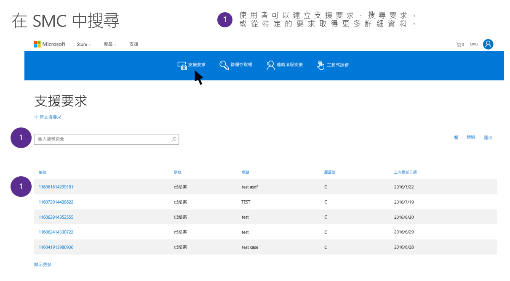

# GDPR 的 Microsoft 支援服務與專業服務資料主體要求Microsoft Support and Professional Services Data Subject Requests for the GDPR

## Microsoft 專業服務簡介Introduction to Microsoft Professional Services

Microsoft 專業服務包括一組多元化的技術結構設計師、工程師、顧問師，以及致力於達成 Microsoft 任務的支援專業人員，以期讓客戶更有能力與成就。我們的專業服務小組總計包括超過 21,000 名顧問師、數位顧問、頂級支援、工程師和專業銷售人員，這些專業人員在全球 191 個國家/地區工作，可支援 46 種不同的語言，每個月管理數百萬件約定，以及透過內部部署、電話、網路、社群和自動化工具參與客戶與合作夥伴互動。該組織具備廣泛的 Microsoft 產品組合專業知識，並運用廣闊的合作夥伴、技術社群、工具、診斷及通道網路來連結我們與企業客戶。Microsoft Professional Services includes a diverse group of technical architects, engineers, consultants, and support professionals dedicated to delivering on the Microsoft mission of empowering customers to do more and achieve more. Our Professional Services team includes more than 21,000+ total consultants, Digital Advisors, Premier Support, engineers, and sales professionals working across 191 countries, supporting 46 different languages, managing several million engagements per month, and engaging in customer and partner interactions through on-premise, phone, web, community and automated tools. The organization brings broad expertise across the Microsoft portfolio, leveraging an extensive network of partners, technical communities, tools, diagnostics and channels that connect us with our enterprise customers.

移至 Microsoft 信任中心的 [Microsoft 專業服務] 區段 (<https://www.microsoft.com/trustcenter/professional-services>)，以深入了解 Microsoft 專業服務。Find out more about Microsoft Professional Services by going to the Microsoft Professional Services section on the Microsoft Trust Center (<https://www.microsoft.com/trustcenter/professional-services>). Microsoft 專業服務很認真看待其在一般資料保護規定 (GDPR) 下所需承擔的責任。Microsoft Professional Services takes its obligations under the General Data Protection Regulation (GDPR) seriously. 本文件中的資訊是為了回答客戶有關 Microsoft 的支援和諮詢供應項目如何根據 GDPR 回應及協助客戶回應資料主體要求 (DSR) 義務的問題。The information in this document is designed to answer customer questions about how Microsoft’s support and consulting offerings will respond to and assist customers in responding to Data Subject Request (DSR) obligations under GDPR.

### DSR 簡介Introduction to DSRs 

GDPR 賦予人員 (在規範中稱為「資料主體」**) 權限，以管理由雇主或其他類型的公司或組織 (稱為「資料控制者」** 或簡稱「控制者」**) 收集而來的個人資料。個人資料在 GDPR 中的定義非常廣泛，係指與已識別或可識別自然人相關的任何資料。GDPR 賦予資料主體對其個人資料的特定權限，這些權限包括取得個人資料複本、要求更正資料、限制資料的處理和刪除資料。由資料主體向控制者提出對其個人資料採取某項動作的正式要求，稱為「資料主體要求」** 或 DSR。此外，它規定公司代表控制者 (稱為「資料處理者」\*\* 或「處理者」\*\*) 合理協助控制者達成 DSR。The GDPR gives rights to people (known in the regulation as *data subjects*) to manage the personal data that has been collected by an employer or other type of agency or organization (known as the *data controller* or just *controller*). Personal data is defined very broadly under the GDPR as any data that relates to an identified or identifiable natural person. The GDPR gives data subjects specific rights to their personal data; these rights include obtaining copies of it, requesting changes to it, restricting the processing of it, and deleting it. A formal request by a data subject to a controller to take an action on their personal data is called a *Data Subject Request* or DSR. Additionally, it obligates companies working on behalf of a controller (known as the *data processor* or just *processor*) to reasonably assist the controller in fulfilling DSRs.

本指南說明如何尋找、存取及處理存在 Microsoft IT 系統的個人資料，這些資料經收集用以提供支援和其他專業服務產品。This guide discusses how to find, access, and act on personal data that reside in Microsoft IT systems that may have been collected to provide Support and other Professional Services offerings.

在開發 DSR 的回應時，Microsoft 的客戶請務必了解，支援及諮詢資料與線上服務的客戶資料或其資料主體可能提供給 Microsoft 的其他資料是分開的。為線上服務提供的工具和程序、Microsoft 隱私權儀表板或其他用於回應 DSR 的 Microsoft 系統無法用來回應由 Microsoft 支援服務或其他專業服務持有的個人資料之 DSR。In developing a response for DSRs, it is important for Microsoft’s customers to understand that Support and Consulting Data is separate from Customer Data in the Online Services or other data that they or their data subjects may have provided to Microsoft. Tools and processes provided for Online Services, the Microsoft Privacy Dashboard, or other Microsoft systems for responding to DSRs cannot be used to respond to DSRs for personal data held by Microsoft Support or other Professional Services.

所有要求必須透過支援人員進行，如下所述。目前沒有自助工具供客戶在專業服務組織內存取個人資料。All requests must be made through a support representative, as described below. Currently there is no self-serve tool for customers gain access to personal data within the Professional Services organizations.

#### 本指南中所述程序的概觀Overview of the processes outlined in this guide

- **探索：** 使用搜尋和探索工具，讓您更輕鬆地找到可能是 DSR 主體的客戶資料。一旦收集了潛在回應文件，您就可以執行下列步驟中所述的一或多個 DSR 動作以回應要求。或者，您也可能判斷該要求不符合貴組織回應 DSR 的指導方針。**Discover**—Use search and discovery tools to more easily find customer data that may be the subject of a DSR. Once potentially responsive documents are collected, you can perform one or more of the DSR actions described in the following steps to respond to the request. Alternatively, you may determine that the request doesn't meet your organization’s guidelines for responding to DSRs.
- **存取：** 擷取在 Microsoft 雲端中常駐的個人資料，若有要求，請製作可供資料主體使用的副本。**Access**—Retrieve personal data that resides in the Microsoft cloud and, if requested, make a copy of it that can be available to the data subject.
- **修正：** 在適用情況下，對個人資料進行變更或實行其他要求的動作。**Rectify.** Make changes or implement other requested actions on the personal data.
- **限制**：藉由盡可能移除各種 Azure 服務的授權或關閉所需的服務，以限制個人資料的處理。**Restrict**—Restrict the processing of personal data, either by removing licenses for various Azure services or turning off the desired services where possible. You can also remove data from the Microsoft cloud and retain it on-premises or at another location. 您也可以從 Microsoft 雲端移除資料，並將它保留在內部部署或另一個位置。Restrict—Restrict the processing of personal data, either by removing licenses for various online services or turning off the desired services where possible. You can also remove data from the Microsoft cloud and retain it on-premises or at another location.
- **刪除：** 將會永久移除 Microsoft 雲端中常駐的個人資料。**Delete**—Permanently remove personal data that resided in the Microsoft cloud.
- **匯出：** 將個人資料的電子副本 (以機器可讀取的格式) 提供給資料主體。**Export**—Provide an electronic copy (in a machine-readable format) of personal data to the data subject.

### 術語Terminology

以下是來自 GDPR 與本指南相關之詞彙的定義：Below are the relevant definitions of terms from the GDPR for this guide:

- **控制者：** 自然人或法人、公家機關、公司或其他主體，不論單獨或與其他單位聯合，會判斷處理個人資料的用途以及方式，其中此類處理的用途以及方式的判斷是根據聯盟與成員國法律，控制者人選或提名控制者的特定準則可由聯盟與成員國法律提供。**Controller.** The natural or legal person, public authority, agency or other body which, alone or jointly with others, determines the purposes and means of the processing of personal data; where the purposes and means of such processing are determined by Union or Member State law, the controller or the specific criteria for its nomination may be provided for by Union or Member State law.
- **個人資料和資料主體：** 表示與已識別或可識別之自然人 (以下稱為「資料主體」) 相關的任何資訊；可識別的自然人是可以直接或間接識別的人員，尤其是藉由參照如名稱、身分證號碼、位置資料、線上識別碼，或特定於該自然人的身體、生理、基因、心理、經濟、文化或社會身分等一個或多個識別碼來識別。**Personal data and data subject.** Any information relating to an identified or identifiable natural person (‘data subject’); an identifiable natural person is one who can be identified, directly or indirectly, in particular by reference to an identifier such as a name, an identification number, location data, an online identifier or to one or more factors specific to the physical, physiological, genetic, mental, economic, cultural or social identity of that natural person.
- **處理者：** 自然人或法人、公家機關、公司，或代表控制者處理個人資料的其他主體。**Processor.** A natural or legal person, public authority, agency or other body which processes personal data on behalf of the controller.

#### 有助於了解本指南的其他術語和定義Additional terms and definitions that may helpful in understanding this guide

- **支援和查閱資料：** 包括所有文字、音訊、視訊、影像檔或軟體的所有資料，由客戶或代表客戶 (或客戶授權 Microsoft 以從線上服務取得) 提供給 Microsoft，透過與 Microsoft 的約定以取得支援或專業服務。**Support and Consulting Data** is all data, including all text, sound, video, image files, or software, that are provided to Microsoft by, or on behalf of, Customer (or that Customer authorizes Microsoft to obtain from an Online Service) through an engagement with Microsoft to obtain Support or Professional Services. To clarify, this does not include data collected where Microsoft is the data controller including Customer Contact Data. 若要釐清，這不包括 Microsoft 是資料控制者時收集的資料，包括客戶連絡人資料。To clarify, this does not include data collected where Microsoft is the data controller including Customer Contact Data.
- **客戶連絡人：** 個人資料可能是您與 Microsoft 商務關係的其中一部分，例如客戶連絡人資訊中包含的個人資料。**Customer Contact:** Personal data that may be part of your business relationship with Microsoft, such as personal data contained within your customer contact information. 這可能包括您的名稱、電子郵件或主要合約服務管理員 (CSM) (線上服務的全域或 IT 系統管理員，或類似角色) 的電話號碼。Customer Contact is personal data that may be part of your business relationship with Microsoft, such as personal data contained within your customer contact information. This may include your name, e-mail, or phone number of the Premier Contract Service Manager (CSM), the Global or IT Administrator for an Online Service, or similar roles.
- **假名化資料**當您對 Microsoft 企業產品和服務使用 Microsoft 支援時，Microsoft 會產生一些資訊，其連結至 Microsoft 數字識別碼以提供支援。**Pseudonymized Data:** When you use Microsoft support for Microsoft’s enterprise products and services, Microsoft generates some information linked to a Microsoft numeric identifier to provide the support. 這通常稱為「假名化資料」。雖然若未使用其他資訊時，此資料並不屬於特定資料主體，但是在 GDPR 對個人資料的廣泛定義下，其中某部分可能會被視為個人資料。Pseudonymized Data When you use Microsoft support for Microsoft’s enterprise products and services, Microsoft generates some information linked to a Microsoft numeric identifier to provide the support. This is often referred to as “Pseudonymized Data”, Although this data cannot be attributed to a specific data subject without the use of additional information, some of it may be deemed personal under GDPR's broad definition for personal data. Within Professional Services, requests to fulfill or assist in fulfilling DSRs will always automatically include addressing pseudonymized data. 在專業服務中，達成或協助達成 DSR 的要求一律會自動包含處理假名化資料。Within Professional Services, requests to fulfill or assist in fulfilling DSRs will always automatically include addressing pseudonymized data.

### 如何使用本指南How to use this guide

本指南包含若客戶使用 Microsoft 專業服務可能會遇到的四個案例。This guide covers four scenarios a customer may encounter if they have utilized Microsoft Professional Services.

- **Microsoft 客戶連絡人的 DSR：** 說明 Microsoft 會如何回應客戶連絡人或 IT 系統管理員的要求來執行資料主體權利。Explanation for how Microsoft will respond to requests from a customer contact or IT administrator to exercise their data subject rights.
- **使用者參與 Microsoft 的 DSR：** 說明 Microsoft 會如何回應客戶員工或其他資料主體的要求來執行其權利。Explanation for how Microsoft will respond to requests from a customer’s employees or other data subjects to exercise their rights.
- **客戶提供資料的 DSR：商業支援：** 說明當客戶收到員工或其他資料主體的要求要執行權限，且該資料主體的個人資料在支援約定期間由 Microsoft 支援服務所收集，在此情況下如何接收 Microsoft 的協助。Explanation for how to receive assistance from Microsoft when a customer has received a request from their employee or other data subjects to exercise their rights, and that data subject’s personal data was collected by Microsoft Support during a support engagement.
- **客戶提供資料的 DSR：諮詢服務包含 FastTrack 移轉服務：** 說明當客戶收到員工或其他資料主體的要求要執行權限，且該資料主體的個人資料在諮詢互動期間由 Microsoft 所收集時，在此情況下如何接收 Microsoft 的協助。Explanation for how to receive assistance from Microsoft when a customer has received a request from their employee or other data subjects to exercise their rights, and that data subject’s personal data was collected by Microsoft during a consulting engagement.

## Microsoft 客戶連絡人的 DSRDSR for a Customer Contact Engaging Microsoft

Microsoft 會如何回應客戶連絡人或 IT 系統管理員的要求來執行資料主體權利。\*\**How Microsoft responds to requests by a customer contact or IT admin to exercise their data subject rights.*

當客戶與 Microsoft 約定以接收支援或諮詢服務時，Microsoft 支援服務會自動收集或從帳戶記錄中擷取客戶連絡人 (例如主要 CSM、全域系統管理員、IT 系統管理員) 的個人資料。When a customer engages with Microsoft to receive support or consulting services, Microsoft Support automatically collects or retrieves from account records the personal data of the Customer Contact (e.g. Premier CSM, Global Admin, IT Admin). This likely includes the name, email, phone and other personal data of the individual seeking support or consulting services. 這可能包括名稱、電子郵件、電話和尋求支援或諮詢服務的個體之其他個人資料。This likely includes the name, email, phone, and other personal data of the individual seeking support or consulting services.

客戶連絡人的個人資料是 Microsoft 與客戶商務關係的一部分，且 Microsoft 是資料控制者。Microsoft 會回應客戶連絡人有關其個人資料的 DSR，無論其是否仍在組織中。The Customer Contact’s personal data is part of Microsoft’s business relationship with the customer, and Microsoft is the data controller. Microsoft will respond to DSRs from the Customer Contact around their personal data, regardless of whether they are still with the organization.

客戶應了解，DSR 只涵蓋客戶連絡人的個人資料，且不會變更或刪除提交為約定 (例如文字記錄、案例說明、檔案、工作產品) 一部分的任何客戶資料，因為 Microsoft 是資料處理者。Customers should understand that the DSR only covers the personal data of the Customer Contact, and no changes or deletions will be made to any of the customer’s data submitted as part of engagements (e.g. transcripts, case descriptions, files, work product), since Microsoft is the data processor. Additionally, to maintain the engagement’s historical record no changes at all will be made to closed engagements, including the record of who opened an engagement. 此外，為維護約定的歷程記錄，不會對已結束的約定進行任何變更，包括開啟約定者的記錄。Additionally, to maintain the engagement’s historical record no changes at all will be made to closed engagements, including the record of who opened an engagement.

從客戶連絡人收到有關 DSR 的查詢時，Microsoft 人員會將客戶連絡人送交給 [Microsoft 隱私權支援](http://go.microsoft.com/fwlink/?LinkId=321116)。這是 Microsoft 對隱私權查詢和事由的主要輸入機制。在收到查詢時，Microsoft 隱私權小組會識別其屬於商業或組織帳戶，並據此回應。Upon receiving an inquiry from a Customer Contact regarding a DSR, Microsoft personnel will refer a customer contact to [Microsoft Privacy Support](http://go.microsoft.com/fwlink/?LinkId=321116). This is Microsoft’s primary input mechanism for privacy inquiries and complaints. Upon receiving an inquiry, the Microsoft Privacy Team will identify that this is part of a commercial or organizational account and respond accordingly.

為維護客戶的業務連續性，Microsoft 在確認取代的連絡人之前不會處理與約定相關的 DSR。在確認新連絡人後，Microsoft 會在開放約定中將舊連絡人換為新連絡人。To maintain customer’s business continuity, Microsoft will also not process a DSR associated with an engagement until a replacement contact is confirmed. Upon confirmation of a new contact, Microsoft will swap out the old contact with the new one in open engagements.

客戶可以選擇透過一般支援或諮詢管道 (與此 DSR 不同) 對於在專業服務約定期間所收集的資料進行變更。舉例來說，經要求 Microsoft 可以協助刪除支援約定 (請參閱下面一節*客戶所提供資料的 DSR 指南*)。Customers may choose to make changes to their data collected during Professional Services engagements through normal support or consulting channels, separate from this DSR. For instance, Microsoft can assist in expunging support engagements, on request (see below in *DSR Guide for Customer Provided Data* section).

***僅供說明的範例******Example for Illustration Purposes Only***

John 是 O365 企業客戶的 IT 系統管理員，具有一個開放支援約定與兩個已結束的約定。現在 John 要離開公司，並希望刪除其資料。John 先連絡 PRC，PRC 將他識別為 IT 系統管理員，並告知其名稱無法從先前 (已結束) 的約定或從開放約定內的任何資料中刪除。不過，如果 John 找到取代的連絡人，PRC 會將目前開放約定的連絡人取代。John 讓 Microsoft 知道了 Jane 會成為取代的連絡人，Microsoft 即在所有支援系統上進行變更。John is an IT Admin for an O365 enterprise customer, with one open support engagement and two closed engagements. Now John is leaving his company and wants his data deleted. John contacts the PRC, who identifies him as the IT Admin. John is informed his name cannot be deleted from the prior (closed) engagements or from any data within the open engagements. However, the PRC will replace John as the contact on the current open ticket if he will identify a replacement contact. John lets Microsoft know that Jane will be his replacement contact, and Microsoft makes the change across all support systems.

## Microsoft 使用者的 DSRDSR for an End User Engaging Microsoft

Microsoft 會如何回應客戶員工或其他資料主體的要求來執行其權利。\*\**How Microsoft responds to requests from a customer’s employees or other data subjects to exercise their rights.*

如果客戶員工或其他資料主體與 Microsoft 連絡，以針對 Microsoft 以資料處理者身分收集的資料執行其權限，則該資料主體會被告知他們需要連絡 Microsoft 客戶 (資料控制者)，以執行這些權限。Microsoft 不會採取進一步的動作。If a customer’s employee or other data subject contacts Microsoft to exercise their rights over data that Microsoft has collected as the data processor, then that data subject will be informed that they need to contact Microsoft’s customer, as the data controller, to exercise those rights. Microsoft will take no further action.

如果資料主體也與 Microsoft 連絡，以針對在 Microsoft 為資料控制者 (例如家庭用戶支援、商業客戶連絡人) 情況下所收集的資料執行其權限，則 Microsoft 會分別回應個人資料的資料主體權限要求。If the data subject has also contacted Microsoft about exercising their rights for data Microsoft has collected in situations where Microsoft is the data controller (e.g. consumer support, commercial customer contact) then Microsoft will separately respond to the individual’s data subject right request for that personal data.

***僅供說明的範例******Example for Illustration Purposes Only***

珮雯是企業客戶的員工，Contoso 已授予她 Dynamics 365 帳戶的權限。Jane is an employee of an Enterprise customer, Contoso, that has given her a Dynamics 365 account. 她連絡 Microsoft 要求將其所有資料刪除，並轉介至隱私權回應中心。She contacts Microsoft to have all her data deleted and is referred to the Privacy Response Center. 珮雯填寫了要求表單。Jane fills out the request form. 隱私權回應中心識別其具有企業使用者身分，並告知她必須透過 Contoso 才能刪除其企業資料。The Privacy Response Center identifies her as an enterprise end user and lets her know she needs to work through Contoso for the deletion of her enterprise data. 隱私權回應中心同時也識別出她是 Microsoft X-Box 使用者，並刪除其家庭用戶 Microsoft 帳戶中的資料。They also identify her as a Microsoft X-Box user and delete her data out of her consumer Microsoft account.

## 客戶所提供資料的 DSR：商業支援DSR for Customer Provided Data: Commercial Support

當客戶收到員工或其他資料主體的要求要執行權限，且該資料主體的個人資料在支援約定期間由 Microsoft 支援服務所收集，在此情況下如何接收 Microsoft 的協助。\*\**How to receive assistance from Microsoft when a customer has received a request from their employee or other data subjects to exercise their rights, and that data subject’s personal data was collected by Microsoft Support during a support engagement.*

當客戶與 Microsoft 支援服務約定時，Microsoft 會收集客戶的支援資料以解決需要支援約定的任何問題。When a customer engages with Microsoft Support, Microsoft collects Support Data from the customer to resolve any issues that required a support engagement. 這項支援資料包含 Microsoft 與客戶的互動 (例如聊天、電話、電子郵件、網頁提交)，加上客戶傳送給 Microsoft，或 Microsoft 經客戶同意從客戶 IT 環境或線上服務租用戶擷取的任何內容檔案，用以解決支援問題。This Support Data includes Microsoft’s interaction with the customer (for example, chat, phone, email, web submission) plus any content files the customer sends to Microsoft or Microsoft has, with customer’s permission, extracted from the customer’s IT environment or Online Services tenancy to resolve the support issue. 在主要支援的情況下，這還會包含我們向您收集的任何資料，以主動預防日後問題。In the case of Premier support, this would also include any data we collect from you to proactively prevent future issues. 不過，這會排除客戶連絡人資訊或 Microsoft 與客戶商務關係 (例如帳單記錄) 的其他資訊。However, this excludes Customer Contact information or other information from Microsoft’s business relationship with the customer (for example, billing records).

對於所有支援資料，Microsoft 都是資料處理者。因此，Microsoft 不會回應資料主體針對與 Microsoft 商業客戶相關聯時提供的支援資料的直接要求。Microsoft 會透過客戶的一般支援管道協助客戶回應 DSR。For all Support Data, Microsoft is the data processor. As such, Microsoft’s will not respond to direct requests from data subjects regarding Support Data provided when they were associated with a Microsoft commercial customer. Microsoft will work with the customer through their normal support channels to assist them in responding to DSRs.

## 步驟 1：探索Step 1: Discover

取得 Microsoft 的協助以回應 DSR 的第一個步驟，是先找出個人資料，也就是 DSR 的主體。The first step in obtaining Microsoft’s assistance in responding to a DSR is to find the personal data that is the subject of the DSR. This first step - finding and reviewing the personal data at issue - will help a customer determine whether a DSR meets the organization's policies for honoring a data subject request. 第一個步驟 (尋找並檢閱上述的個人資料)，可協助客戶判斷 DSR 是否符合貴組織的需求，以便接受或拒絕。第一個步驟 (尋找並檢閱上述的個人資料)，可協助您判斷 DSR 是否符合用於遵循資料主體要求的貴組織原則，以便接受或拒絕。The first step in obtaining Microsoft’s assistance in responding to a DSR is to find the personal data that is the subject of the DSR. This first step - finding and reviewing the personal data at issue - will help a customer determine whether a DSR meets the organization's policies for honoring a data subject request.

在客戶找出資料後，可以執行特定動作，以滿足資料主體的要求。客戶嘗試執行的動作將會決定客戶需要進行的探索層級。After the customer finds the data, the customer can then perform the specific action to satisfy the request by the data subject. Depending on what the customer is trying to do will determine what level of discovery the customer needs to engage in.

在 Microsoft 協助客戶解決 DSR 時，這是商業功能，且要求是透過標準支援管道進行，而非透過向 Microsoft 隱私權小組的要求。Where Microsoft assists a customer with the resolution of a DSR then this is a business function, and the request is made through your regular support channel and not through a request to the Microsoft Privacy Team.

在探索相關資料及取得 Microsoft 的協助方面，對於如何達到 DSR 客戶有數種選項：In discovering relevant data and obtaining Microsoft’s assistance, a customer has several options for how to approach the DSR:

選項 A：跨 Microsoft 支援服務客戶 DSR\*\*。將 DSR 套用於 Microsoft 支援環境中所有客戶的支援資料。若要這麼做，客戶可以要求 Microsoft 將 DSR 套用於收集的所有支援資料。*Option A – Cross-Microsoft Support Customer DSR*. Apply the DSR to all the customer’s support data across Microsoft’s support environment. To do this, a customer can just ask Microsoft to apply the DSR to all Support Data collected.

*選項 B — 特定客戶參與。**Option B — Specific Customer Engagements.* 使用線上系統檢閱工單，然後找出特定的約定，其中包含相關的個人資料並向 Microsoft 報告。Use online systems to review tickets, then identify specific engagements containing the relevant personal data and report them Microsoft. 如果客戶無法搜尋約定 (工單)，Microsoft 會嘗試提供協助以執行搜尋。Option B – Specific Customer Engagements. Use online systems to review tickets, then identify specific engagements containing the relevant personal data and report them Microsoft. Microsoft will attempt to provide assistance to to perform a search if the customer does not have the ability to search across engagements (tickets).

***識別出約定之後，要求將 DSR 套用於記錄的特定部分，或 Microsoft 中與該約定相關的所有項目。***\*\*\*\*\*Once engagements are identified, request to apply the DSR to either a specific part of the record or everything related to that engagement across Microsoft.\*\*\*

若要找出特定的約定，客戶需要搜尋其約定。對於頂級客戶，客戶的合約服務管理員 (“CSM”) 可看見在該合約排程下建立的所有支援要求 (SR)。對於非頂級客戶，則提供對等的支援約定入口網站，例如透過線上服務支援區域。To identify specific engagements, customers need to search across their engagements. For Premier customers, the Contract Service Manager (“CSM”) for a customer has visibility across all Support Requests (SRs) that are created under that Contract Schedule. For Non-Premier, equivalent support engagement portals are available, such as through Online Services support areas.

CSM 可以進到入口網站 Support.Microsoft.Com ([https://support.microsoft.com/\<local語言代碼\>/頂級](https://support.microsoft.com/%3clocal%20language%20code%3e/premier)) (“SMC”) 並選取及檢閱支援要求。(請注意：在 URL 中請取代為您的當地語言代碼)。The CSM can go to the portal at Support.Microsoft.Com ([https://support.microsoft.com/\<local language code\>/premier](https://support.microsoft.com/%3clocal%20language%20code%3e/premier)) (“SMC”) and select and review Support Requests. (Note: In the URL, please substitute for your local language code).

>[!IMPORTANT]
>除了 SMC 中的案例歷程記錄，客戶也可擁有在支援約定期間由 Microsoft 收集(或經客戶同意，從線上服務移除) 的使用者個人資料檔案。In addition to the case history in SMC, customers may also have personal data of an end user in files that was collected by Microsoft (or, with customer’s permission, removed from the Online Service) during a support engagement. 例子包括客戶 exchange 信箱、Azure VM 或資料庫的複本。Examples may include copies of customer’s exchange mailboxes, Azure VMs, or databases. 此個人資料可能或不一定會在特定約定的案例歷程記錄 (亦即工單) 中述及。This personal data may or may not be mentioned in the case history (i.e. ticket) for a particular engagement. 若要檢閱該資料，客戶連絡人必須是特定的驗證 (透過 AAD 或 MSA) 支援要求連絡人，其已在 Microsoft 支援服務資料傳輸和管理工具 (DTM) 中收到工作區 URL。To review that data, the Customer Contact must be a specific authenticated (via AAD or MSA) Support Request contact that has received a URL for a workspace in Microsoft Support Data Transfer and Management tool (DTM). 客戶連絡人可存取檔案，但無法進行全域檢視，且 SMC 不會指出檔案是否存在。A Customer Contact will have access to the files, but no global view is available, and SMC will not indicate if files exist.

當客戶已找出所選支援工單中的所有相關資料時，客戶可決定是否要求刪除與工單相關的所有項目，或選擇性將 DSR 套用到個人資料的個別執行個體。Once customers have identified all the relevant data in the selected support tickets, customers can decide whether to request the deletion of everything related to a ticket or selectively apply the DSR to individual instances of personal data.

## 步驟 2：存取Step 2: Access

在客戶找到包含個人資料且可能會回應 DSR 的支援資料之後，客戶有權決定要在回應中包含哪些個人資料。比方說，客戶可以選擇移除有關其他資料主體和任何機密資訊的個人資料。After a customer has found Support Data containing personal data that is potentially responsive to a DSR, it is up to the customer to decide which personal data to include in the response. For example, the customer may choose to remove personal data about other data subjects and any confidential information.

對 DSR 的回應可能包含實際文件的副本、經過適當刪減的版本，或客戶認為適合分享的部分螢幕擷取畫面。對於這些存取要求的每項回應，客戶都必須擷取一份文件副本，或其他包含回應資料的項目。Response to the DSR may include a copy of the actual document, an appropriately redacted version, or a screenshot of the portions the customer has deemed appropriate to share. For each of these responses to an access request, the customer will have to retrieve a copy of the document or other item that contains the responsive data.

使用者個人資料的存取權可能來自不同類型內容文件中的相關記錄或註解。Access to the personal data of an end user may be from a mention or notation in the various types of content documentation. Since customers may access the engagement ticket and the content they can provide a summary of personal data themselves without further assistance from Microsoft. 由於客戶可能會存取約定工單和內容，因此客戶可以自己提供個人資料摘要，而不需要 Microsoft 進一步的協助。Access to the personal data of an end user may be from a mention or notation in the various types of content documentation. Since customers may access the engagement ticket and the content they can provide a summary of personal data themselves without further assistance from Microsoft.

在罕見的情況下，客戶可能需要取得 Microsoft 代表與客戶代表之間的支援互動資料 (例如電子郵件、電話記錄的謄寫複本、聊天文字記錄) 複本。In rare cases, customer may have need to obtain copies of support interaction data (e.g. emails, transcribed copies of phone recordings; chat transcripts) between a Microsoft Representative and the Customer’s Representative. To the extent required, Microsoft may provide redacted copies of these transcripts based on need, sensitivity, and difficulty. 在所需範圍內，Microsoft 會根據需求、機密性和困難度，提供這些文字記錄經刪減過的複本。To the extent required, Microsoft may provide redacted copies of these transcripts based on need, sensitivity, and difficulty.

## 步驟 3：修正Step 3: Rectify

如果資料主體要求客戶修正存在組織支援資料中的個人資料，客戶必須判斷是否要接受要求。如果客戶選擇接受要求，則客戶可能會要求 Microsoft 進行變更。Microsoft 可能會修正資料，或從支援系統中刪除客戶的資料，並要求客戶以修正過的格式重新提交給 Microsoft。If a data subject has asked the customer to rectify the personal data that resides in their organization’s Support Data, the customer will have to determine whether it’s appropriate to honor the request. If the customer chooses to honor the request, then the customer may request that Microsoft make the change. Microsoft may rectify data or may delete customer’s data from the support systems and request that the customer resubmit it to Microsoft in corrected format.

## 步驟 4：限制Step 4: Restrict

客戶隨時可能會結束約定，或連絡 Microsoft 要求結束約定。The customer may at any time close an engagement or contact Microsoft and request the engagement be closed. A closed engagement will prevent any work from being performed. 已結束的約定可避免執行任何工作。A closed engagement will prevent any work from being performed.

如需額外保證，客戶可能會與 Microsoft 連絡，並要求在約定工單系統中加上附註，表示該案件未經客戶同意不應重新開啟。For extra assurance, customer may contact Microsoft and request a note be placed in the engagement ticketing system instructing that the case should not be re-opened for any reason absent the customer’s permission.

附註：根據資料、服務和系統的機密性，約定 (工單) 也會依照保留期與刪除排程一併刪除。Note: Engagements (tickets) will also be deleted according on a retention and deletion schedule, based on the sensitivity of data, service, and system. If customer requires a copy of data, they should ensure they have extracted data prior to deletion. 如果客戶需要資料副本，應先確認在刪除之前已擷取資料。If customer requires a copy of data, they should ensure that they have extracted data prior to deletion.

## 步驟 5：刪除Step 5: Delete

從組織的支援資料中移除其個人資料的「抹除的權利」，是 GDPR 中的關鍵保護機制。The “right to erasure” by the removal of personal data from an organization’s Support Data is a key protection in the GDPR. Removing personal data includes deleting entire engagements, documents or files or deleting specific data within an engagement, document or file. 移除個人資料包括刪除整個約定、文件或檔案，或刪除約定、文件或檔案內的特定資料。The “right to erasure” by the removal of personal data from an organization’s Support Data is a key protection in the GDPR. Removing personal data includes deleting entire engagements, documents or files or deleting specific data within an engagement, document or file.

當客戶調查或準備刪除個人資料，以回應 DSR 時，以下是一些重要事項，讓您了解如何在 Microsoft 支援服務進行刪除。As a customer investigates or prepares to delete personal data in response to a DSR, here are a few important things to understand about how deletion works for Microsoft Support.

Microsoft 的所有資料都有套用保留期與刪除原則，這些會根據風險及其他因素而有所不同。All data at Microsoft has a retention and deletion policy applied to it, which will vary depending on risk and other factors.

若客戶要求跨支援系統刪除資料主體的個人資料，可透過 TAM 進行或在 SMC 或對等系統中填寫支援要求 (SR)。您必須\*\* 指出此要求是協助您在 GDPR 下的 DSR。Customers requesting the deletion of a data subject’s personal data universally cross Support systems may do that through your TAM or by filing a Support Request (SR) in SMC or equivalent system. You *must* indicate that this is a request to assist with a DSR under GDPR.

*選項 A — 跨 Microsoft 支援客戶 DSR*。*Option A — Cross-Microsoft Support Customer DSR*. 針對跨系統 DSR，客戶必須提供 Microsoft 需要的個人資料，以識別所需資料 (例如電子郵件地址、電話號碼)。For a cross system DSR, customer must provide the personal data that Microsoft needs to identify the required data (for example, email address; phone number). Microsoft 不會建立相互關聯或研究記錄，而僅會在客戶所提供的識別項上直接進行搜尋。Microsoft will not correlate or research records and will only search directly on identifiers provided by the customer. 找到資料時，Microsoft 就會刪除所有約定和所有相關資料。When data is found, Microsoft will delete all engagements and all associated data.

> [!IMPORTANT]
> 重要注意事項：\*\*這可能會導致客戶組織的重要歷程記錄遺失。Important Note:\*\* this may result in loss of historical records that are important to customer’s organization.

*選項 B — 特定客戶參與*。*Option B — Specific Customer Engagements*. 對於客戶找出並想刪除的特定約定，請勿刪除 SMC 的工單。For specific engagements that the customer has identified and wants deleted, do not delete tickets out of SMC. 這會導致存在於記錄檔和下游系統中的個人資料無法在所需時間範圍內刪除。This will result in personal data remaining in logs and downstream systems that may not be deleted within the needed timeframe. 相反地，找出必須刪除的工單或工單內的個人資料，並連絡 Microsoft 支援服務，以協助您刪除資料。Instead, identify the ticket or personal data within the ticket that must be deleted, and contact Microsoft Support to assist you in deleting that data.

### Microsoft 支援服務資料傳輸和管理工具 (DTM) 指示Microsoft Support Data Transfer and Management tool (DTM) instructions

對於所有這些搜尋，因為檔案內容潛在的機密性，Microsoft 不會搜尋 DTM。不過，如果客戶想要，Microsoft 會刪除包含在 DTM 中與客戶帳戶相關聯的所有檔案。由於可能造成重大的客戶影響，Microsoft 需要指定刪除 DTM 檔案的客戶個別要求。For all these searches, Microsoft will not search across DTM due to the potential sensitivity of content in files. However, if the customer desires, Microsoft will delete all files contained in DTM associated with the customer’s account. Due to the potential for serious customer impact, Microsoft requires a separate request from customer specifying the deletion of DTM files.

- 對於開放的案件，客戶連絡人可以進入 DTM 並刪除檔案。For open cases, the Customer Contact can go into DTM and delete files.
- 對於在 90 天內結束的案件，必須對 TAM 或 SR 提出要求以移除檔案。For cases closed less than 90 days, a request must be made to a TAM or in an SR to have the files removed.
- 對於結束超過 90 天的案件，檔案已自動刪除。For cases closed after than 90 days, files have already been automatically deleted.
- 即使個人資料僅位於已刪除的檔案內，客戶仍必須讓 Microsoft 對系統執行個人資料檢查，因為某些資料可能在提供支援的過程中已從 DTM 移除。Even if the personal data was only located within a file that has been deleted, customers must still have Microsoft run a check across systems for the personal data as some data may have been removed from DTM in the course of providing support.

## 步驟 6：匯出Step 6: Export

「資料可攜性權限」可讓資料主體要求其個人資料的電子格式副本，並要求貴組織將資料傳送給其他控制者。在支援資料的情況下，Microsoft 擁有的任何可用資訊，其格式會是可傳回給您的約定資訊或檔案，以供重新通訊或上傳給其他控制者。The “right of data portability” allows a data subject to request a copy of their personal data in an electronic format and request that your organization transmit it to another controller. In the case of Support Data, any usable information that Microsoft has would be in the form of engagement information or files that can be returned to you for re-communication or uploading to another controller.

附註：匯出的資料不包含 Microsoft 的智慧財產或可能危及服務安全性或穩定性的任何資料。Note: Exported data may not include Microsoft’s intellectual property or any data that may compromise the security or stability of the service.

***僅供說明的範例******Example for Illustration Purposes Only***

John 是企業客戶 Contoso 的主要 CSM，Contoso 使用 O365 做為員工電子郵件並使用 Azure 裝載 Contoso SQL 資料庫。Contoso 擁有多個開放及結束的工單。最近，Microsoft 支援服務在 Contoso 的同意下，將 SQL 資料庫副本移到 DTM 中，以進行支援與疑難排解。John is a Premier CSM for an Enterprise customer, Contoso, that uses O365 for its employee e-mail and Azure to host a Contoso SQL database. Contoso has multiple open and closed tickets. Recently, Microsoft Support, with Contoso’s permission, moved a copy of the SQL database into DTM for support and troubleshooting.

John 收到 Jane 的 DSR，要求刪除她的所有資料。John 進入 SMC 並搜尋約定，發現 Jane 有電子郵件帳戶問題，因此其名稱和電子郵件地址參照在兩份工單中。他連絡了 TAM，提供 Jane 的名稱和電子郵件地址做為識別項，並要求刪除那兩份工單，以及可能由工單所產生的所有下游資料。John receives a DSR from Jane asking that all her data be deleted. John goes into SMC and searches across engagements to identify that Jane had email account issues and so was referenced in two tickets by name and email address. He contacts his TAM, provides the TAM with Jane’s name and e-mail address as an identifier, and requests that those two tickets be deleted, along with all downstream data that may have been generated out of those tickets.

他也擔心他與支援人員提及 Jane 的聊天交談，因此要求刪除該聊天記錄。He also suspects he was engaged in a chat conversation with support personnel where he mentions Jane, so he requests that chat log to be deleted.

他還知道 Jane 的個人資料位於 SQL 資料庫中。由於 SQL VM 在不到 90 天前已移至 DTM，他另外要求 TAM 協助從 DTM 中立即刪除資料庫。He also knows that Jane’s personal data is in the SQL Database. Since the SQL VM was moved into DTM less than 90 days ago, he asks his TAM separately to assist in the immediate deletion of the database out of DTM.

最後，由於他知道資料可能在提供支援期間已經從 DTM 檔案中移除，他要求 Microsoft 在 IT 系統中對 SQL 資料庫中 Jane 的個人資料執行檢查。Lastly, since he knows that data may have been removed from the DTM file during providing support, he asks Microsoft to run a check across IT systems for Jane’s personal data from the SQL database.

Microsoft 支援服務執行了以上所有刪除，且根據客戶要求，TAM 也向他提供證明，聲明要求的資料皆已刪除。Microsoft Support performs all these deletions and, based on customer request, the TAM provides him with an attestation statement that the required data has been deleted.

## 諮詢服務中客戶所提供資料的 DSR 指南包括移轉服務DSR Guide for Customer Provided Data in Consulting Services including Migration Services

當客戶收到員工或其他資料主體的要求要執行權限，且該資料主體的個人資料在諮詢約定期間由 Microsoft 所收集，在此情況下如何接收 Microsoft 的協助。\*\**How to receive assistance from Microsoft when a customer has received a request from their employee or other data subjects to exercise their rights, and that data subject’s personal data was collected by Microsoft during a consulting engagement.*

## Microsoft 諮詢服務Microsoft Consulting Services

在套用 Microsoft 專業服務資料保護增補合約 (<http://aka.ms/professionalservicesdpa>) 之處簽署的 Microsoft 諮詢服務約定。For Microsoft Consulting Services engagements contracted where the Microsoft Professional Services Data Protection Addendum (<http://aka.ms/professionalservicesdpa>) applies.

Microsoft 是與約定小組合作的客戶連絡人資料控制者。這些人員應連絡 [Microsoft 隱私權支援](http://go.microsoft.com/fwlink/?LinkId=321116)以履行資料主體權限。Microsoft is the data controller for Customer Contacts working with the engagement team. Those individuals should contact [Microsoft Privacy Support](http://go.microsoft.com/fwlink/?LinkId=321116) to fulfill data subject rights.

Microsoft 是在諮詢約定期間提供的資料內 DSR 的資料處理者。客戶應與約定經理連絡，以根據收集的資料以及提供的諮詢服務之特定類型，建立計畫來協助回應 DSR。若您的要求構成了通常出現在 Microsoft 諮詢服務約定內的工作層級，則可能需要額外的作業順序。此外，視諮詢約定類型而定，在時間範圍內的每次諮詢約定後會刪除個人資料。客戶可以要求更早刪除資料，並要求刪除證明。Microsoft is the data processor for a DSR located within data provided during a consulting engagement. The customer should contact the engagement manager to build in a plan to assist in responding to a DSR based on the data collected and then specific type of consulting services provided. To the extent your request constitutes a level of effort typically seen within a Microsoft Consulting Services engagement, there may be an additional work order required. Additionally, personal data will be deleted after each consulting engagement within a timeframe dependent on the type of consulting engagement. Customer can request data to be deleted sooner and request an attestation of deletion.

## Microsoft FastTrack 服務Microsoft FastTrack Services

[Microsoft FastTrack](https://na01.safelinks.protection.outlook.com/?url=https%3A%2F%2Ffasttrack.microsoft.com%2Fabout&data=02%7C01%7C%7Cd0521d8739c841df674508d596834585%7C72f988bf86f141af91ab2d7cd011db47%7C1%7C0%7C636580412901207944&sdata=PO5eh56pm9IYk5Y%2Ff%2F31e%2BRVPmrC2Qi%2FCsw1NphR8gY%3D&reserved=0) 向組織提供 IT 諮詢服務，協助組織上線及使用 Microsoft 雲端服務，如 Microsoft 365、Azure 和 Dynamics 365。[Microsoft FastTrack](https://na01.safelinks.protection.outlook.com/?url=https%3A%2F%2Ffasttrack.microsoft.com%2Fabout&data=02%7C01%7C%7Cd0521d8739c841df674508d596834585%7C72f988bf86f141af91ab2d7cd011db47%7C1%7C0%7C636580412901207944&sdata=PO5eh56pm9IYk5Y%2Ff%2F31e%2BRVPmrC2Qi%2FCsw1NphR8gY%3D&reserved=0) provides IT consulting services to organizations to help them onboard and use Microsoft cloud services such as Microsoft 365, Azure and Dynamics 365.

Microsoft 是與 FastTrack 小組合作的客戶連絡人資料控制者。如果客戶連絡人希望存取、修改或移除 Microsoft FastTrack 記錄中的連絡人資訊，客戶可讓資料主體將要求直接傳送到 Office 365 FastTrack GDPR 要求收件匣中\<<o365ftgdpr@microsoft.com>\>。Microsoft is the data controller for Customer Contacts working with the FastTrack team. If Customer Contacts wish to access, revise or remove contact information from Microsoft’s FastTrack records, customers can have the data subject send the request directly to Office 365 FastTrack GDPR Request inbox \<<o365ftgdpr@microsoft.com>\>.

對於 FastTrack 移轉服務而言，Microsoft 是資料處理者。根據我們的 FastTrack 額外隱私權揭露聲明，所有移轉中的資料都會被都視為「轉換資料」。如果您的組織忙於處理 FastTrack 移轉專案時，您需要執行 DSR，則必須特別謹慎。For FastTrack migration services, Microsoft is the data processor. In accordance with our Fast Track additional privacy disclosure statement, all data in migration is considered “migration data.”  If you need to execute DSRs while your organization is engaged in a FastTrack migration project, special care is required.
  
如果使用者的資料正透過 FastTrack 移轉系統處理時，您需要處理任何存取權、修正或匯出 DSR 要求，客戶就有責任透過使用者資料儲存所在的現有來源系統來滿足這類 DSR。If you need to process any access, rectify, or export DSR requests while a user’s data is being processed through FastTrack migration systems, it will be the customer’s responsibility to fulfill such DSRs through your existing source systems in which the user data is stored. Once the user’s migration is complete and the data has been migrated to the destination Microsoft cloud service, the guidance provided by Microsoft on how customers can use Microsoft products, services and administrative tools to find and act on personal data to respond to data subject request will then apply. To view this guidance see Data Subject Requests for the GDPR. 一旦使用者的移轉完成且資料已移轉到目的地 Microsoft cloud 服務後，就會套用 Microsoft 針對客戶如何使用 Microsoft 產品、服務及系統管理工具來找出並處理個人資料，進而回應資料主體要求所提供的指引。If you need to process any access, rectify, or export DSR requests while a user’s data is being processed through FastTrack migration systems, it will be the customer’s responsibility to fulfill such DSRs through your existing source systems in which the user data is stored. Once the user’s migration is complete and the data has been migrated to the destination Microsoft cloud service, the guidance provided by Microsoft on how customers can use Microsoft products, services and administrative tools to find and act on personal data to respond to data subject request will then apply. To view this guidance see Data Subject Requests for the GDPR. 若要檢視此指引，請參閱 [GDPR 資料主體要求](https://docs.microsoft.com/microsoft-365/compliance/gdpr-data-subject-requests)。To view this guidance see [Data Subject Requests for the GDPR](https://docs.microsoft.com/microsoft-365/compliance/gdpr-data-subject-requests). 

如果您的組織忙於處理進行中的 FastTrack 移轉專案時，您需要刪除 Office 365 使用者帳戶以回應 DSR 刪除要求，您應該知道移轉系統可能會在使用者完成移轉後，保留移轉資料複本一段時間，而刪除 Office 365 使用者帳戶並不會自動刪除 FastTrack 移轉系統中儲存的這類使用者移轉資料。如果您希望 Microsoft FastTrack 小組刪除使用者移轉資料，您可以[提交要求](https://go.microsoft.com/fwlink/?linkid=874544)。在一般商務過程中，Microsoft FastTrack 會在貴組織的移轉完成後，刪除所有的資料複本。If you need to delete an Office 365 user account in response to a DSR delete request while your organization is engaged in an ongoing FastTrack migration project, you should be aware that migration systems may retain a copy of user migration data for a period of time following completion of the user’s migration and deleting the Office 365 user account will not automatically delete such user migration data stored in FastTrack migration systems.  If you would like the Microsoft FastTrack team to delete user migration data, you can [submit a request](https://go.microsoft.com/fwlink/?linkid=874544). In the ordinary course of business, Microsoft FastTrack will delete all data copies once your organization’s migration is complete.

## 其他諮詢服務Other Consulting Services

透過 Microsoft 接收其他專業服務的客戶，應透過約定小組達成所有 GDPR 要求。如果約定小組無法提供履行 GDPR DSR 的清楚指示，客戶可以連絡 [Microsoft 隱私權支援](http://go.microsoft.com/fwlink/?LinkId=321116)以取得協助。Customer receiving other Professional Services through Microsoft should work through the engagement team for fulfillment of all GDPR requirements. If the engagement team is not able to provide clear instructions on GDPR DSR fulfillment, customers may contact [Microsoft Privacy Support](http://go.microsoft.com/fwlink/?LinkId=321116) for assistance.
