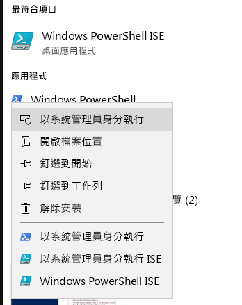
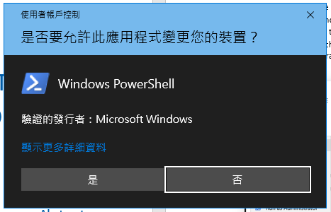
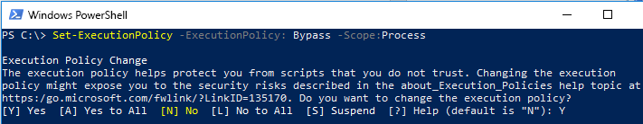

# 提交刪除要求的 FASTTRACK 移轉工具組

## 工具組的用途

若您是目前正在進行 FastTrack 移轉的客戶，刪除 Office 365 的使用者帳戶並不會將 Microsoft FastTrack 小組所保留的資料副本刪除，其保留之目的僅為完成移轉。如果在移轉期間，您想要 Microsoft FastTrack 小組也一併刪除資料副本，請透過此工具組提交要求。在一般的業務過程中，完成移轉之後，Microsoft FastTrack 會刪除所有資料副本。

### 支援的平台
Microsoft 在 Windows 平台和 PowerShell 主控台支援此工具組的最初版本。此工具組支援下列已知平台：
 
***表格 1 - 此工具組支援的平台***
 
<!--start table here HEADER -->
 
|||||||
|:-----|:-----|:-----|:-----|:-----|:-----|
| |**Windows 7**|**Windows 8**|**Windows 10**|**Windows Server 2012**|**Windows Server 2016**|
|PS 5.0|不 支援|支援|支援|支援|支援|
|PS 5.1|不 支援|支援|支援|支援|支援|
|||
 
<!-- end of table -->

### 取得工具組

PowerShell 主控台應用程式的 PowerShell 資源庫中提供此工具組。若要找出並載入此 cmdlet 模組，請先在系統管理員模式中開啟 PowerShell，以讓它具有適當的權限可安裝模組。若您先前尚未使用過 PowerShell，請移至您的 Windows 工作列，然後在搜尋方塊中輸入 “PowerShell”。使用滑鼠右鍵選取主控台應用程式，然後選擇 [以系統管理員身分執行]****，然後按一下 [是]**** 來執行 Windows PowerShell。

現在主控台已開啟，您必須設定權限來執行指令碼。請輸入下列命令，以允許執行指令碼：‘Set-ExecutionPolicy – ExecutionPolicy: Bypass – Scope:Process’

系統會提示您確認執行此動作，因為系統管理員可以隨時變更範圍。

***設定執行原則***

現在您已將主控台設定為允許指令碼，請執行下一個命令來安裝這項模組：

>`Install-Module -Name Microsoft.FastTrack ` -Repository PSGallery `
>        
>               -WarningAction: SilentlyContinue `
>               -Force’

### 模組的必要條件
若要順利執行此模組，您可能必須安裝相關模組，以便在尚未安裝這些模組時可供使用。您可能必須重新啟動 PowerShell。  

若要提交 DSR，您必須先使用 Office 365 認證登入，輸入適當的認證會驗證您的全域系統管理員狀態，並收集租用資訊。 

**Login-FastTrackAccount -ApiKey：\<FastTrack MVM 所提供的 API 金鑰\>**

一旦順利登入後，系統會儲存認證和金鑰，以供與目前 PowerShell 工作階段其餘部分的 FastTrack 模組搭配使用。

如果您需要連線到雲端環境，而不是商業環境，必須在下列其中一個有效的環境中，將 *-Environment* 新增至 *Log in* 命令：
- AzureCloud
- AzureChinaCloud
- AzureGermanCloud
- AzureUSGovernmentCloud

**Login-FastTrackAcccount -ApiKey\ <API Key provided by FastTrack MVM> -Environment: <cloud environment\>**

若要提交 DSR 要求，請執行下列命令：Submit-FastTrackGdprDsrRequest -DsrRequestUserEmail: SubjectUserEmail@mycompany.com

一旦成功後 – cmdlet 就會傳回交易識別碼物件。請保留交易識別碼。

#### 檢查要求交易的狀態

使用先前取得的交易識別碼執行下列函式：Get-FastTrackGdprDsrRequest -TransactionID: “YourTransactionID”

#### 交易狀態碼
<!--start table here no header -->

|||
|:-----|:-----|:-----|
|**交易** |**狀態**|
|**建立於** |已建立要求|
|**失敗**|要求無法建立，請重新提交，或連絡客戶支援|
|**完成**|要求已完成並加以清理|
|||

<!-- end of table -->

<!-- original version: **Created**  Request has been created **Failed** Request failed to create, please resubmit, or contact support **Completed** Request has been completed and sanitized -->

## 深入了解
[Microsoft 信任中心](https://www.microsoft.com/TrustCenter/Privacy/gdpr/default.aspx)