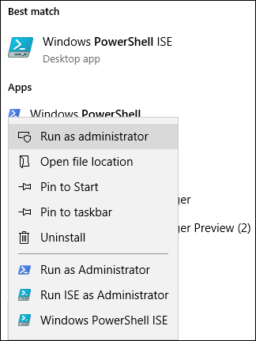

# 提交刪除要求的 FASTTRACK 移轉工具組FastTrack Migration Toolset for Submitting Delete Request

## 工具組的用途Toolset purpose

若您是目前正在進行 FastTrack 移轉的客戶，刪除 Office 365 的使用者帳戶並不會將 Microsoft FastTrack 小組所保留的資料副本刪除，其保留之目的僅為完成移轉。如果在移轉期間，您想要 Microsoft FastTrack 小組也一併刪除資料副本，請透過此工具組提交要求。在一般的業務過程中，完成移轉之後，Microsoft FastTrack 會刪除所有資料副本。In the event that you are a customer currently engaged in FastTrack migrations, deleting the Office 365 user account will not delete the data copy held by the Microsoft FastTrack team, which is held for the sole purpose of completing the migration. If during the migration you would like the Microsoft FastTrack team to also delete the data copy, submit a request via this tool set. In the ordinary course of business, Microsoft FastTrack will delete all data copies once the migration is complete.

### 支援的平台Supported platforms
Microsoft 在 Windows 平台和 PowerShell 主控台支援此工具組的最初版本。此工具組支援下列已知平台：Microsoft supports the initial release of this  toolset in the Windows platform and PowerShell console. The following known platforms are supported by this toolset:
 
***表格 1 - 此工具組支援的平台******Table 1 — Platforms supported by this toolset***
 
<!--start table here HEADER -->
 
|||||||
|:-----|:-----|:-----|:-----|:-----|:-----|
| |**Windows 7****Windows 7**|**Windows 8****Windows 8**|**Windows 10****Windows 10**|**Windows Server 2012****Windows Server 2012**|**Windows Server 2016****Windows Server 2016**|
|PS 5.0PS 5.0|不Not 支援Supported|支援Supported|支援Supported|支援Supported|支援Supported|
|PS 5.1PS 5.1|不Not 支援Supported|支援Supported|支援Supported|支援Supported|支援Supported|
|||
 
<!-- end of table -->

### 取得工具組Obtaining the toolset

PowerShell 主控台應用程式的 PowerShell 資源庫中提供此工具組。若要找出並載入此 cmdlet 模組，請先在系統管理員模式中開啟 PowerShell，以讓它具有適當的權限可安裝模組。若您先前尚未使用過 PowerShell，請移至您的 Windows 工作列，然後在搜尋方塊中輸入 “PowerShell”。使用滑鼠右鍵選取主控台應用程式，然後選擇 [以系統管理員身分執行]\*\*\*\*，然後按一下 [是]\*\*\*\* 來執行 Windows PowerShell。This toolset is available in the PowerShell Gallery on the PowerShell console application.  To locate and load this cmdlet module, first open PowerShell in administrator mode so it has the appropriate permissions to install the module. If you have not used PowerShell previously go to your Windows Task Bar and in the search box type “PowerShell”. Select the console app using right-click and choose **Run as administrator**, then click **Yes** to run Windows PowerShell.

現在主控台已開啟，您必須設定權限來執行指令碼。請輸入下列命令，以允許執行指令碼：‘Set-ExecutionPolicy – ExecutionPolicy: Bypass – Scope:Process’Now that the console is open, you need to set permissions for script execution. Type the following command to allow the scripts to run: ‘Set-ExecutionPolicy — ExecutionPolicy: Bypass — Scope: Process’

系統會提示您確認執行此動作，因為系統管理員可以隨時變更範圍。You will be prompted to confirm this action, as the administrator can change the scope at their discretion.

***設定執行原則******Set Execution Policy***

現在您已將主控台設定為允許指令碼，請執行下一個命令來安裝這項模組：Now that the console is set to allow the script,  run this next command to install the module:

>`Install-Module -Name Microsoft.FastTrack ` -Repository PSGallery \``Install-Module -Name Microsoft.FastTrack ` -Repository PSGallery \`
>        
>               -WarningAction: SilentlyContinue `
>               -Force’

### 模組的必要條件Prerequisites for module
若要順利執行此模組，您可能必須安裝相關模組，以便在尚未安裝這些模組時可供使用。您可能必須重新啟動 PowerShell。To successfully execute this module, you may need to install dependent modules for use if they are not already installed. You may need to restart PowerShell.  

若要提交 DSR，您必須先使用 Office 365 認證登入，輸入適當的認證會驗證您的全域系統管理員狀態，並收集租用資訊。In order to submit a DSR, you must first log in using your Office 365 credentials — entering the proper credentials will validate your global administrator status and collect tenant information. 

**Login-FastTrackAccount -ApiKey：\<FastTrack MVM 所提供的 API 金鑰\>****Login-FastTrackAccount -ApiKey: \<API Key provided by FastTrack MVM\>**

一旦順利登入後，系統會儲存認證和金鑰，以供與目前 PowerShell 工作階段其餘部分的 FastTrack 模組搭配使用。Once successfully logged in, the credentials and key will be stored for use with FastTrack modules for the remainder of the current PowerShell session.

如果您需要連線到雲端環境，而不是商業環境，必須在下列其中一個有效的環境中，將 *-Environment* 新增至 *Log in* 命令：If you need to connect to a cloud environment, other than commercial, *-Environment* will need to be added to *Log in* command with one of the following valid environments:
- AzureCloudAzureCloud
- AzureChinaCloudAzureChinaCloud
- AzureGermanCloudAzureGermanCloud
- AzureUSGovernmentCloudAzureUSGovernmentCloud

**Login-FastTrackAcccount -ApiKey\ <API Key provided by FastTrack MVM> -Environment: <cloud environment\>****Login-FastTrackAcccount -ApiKey\ <API Key provided by FastTrack MVM> -Environment: <cloud environment\>**

若要提交 DSR 要求，請執行下列命令：Submit-FastTrackGdprDsrRequest -DsrRequestUserEmail: SubjectUserEmail@mycompany.comTo submit a DSR request, run the following command: Submit-FastTrackGdprDsrRequest -DsrRequestUserEmail: SubjectUserEmail@mycompany.com

一旦成功後 – cmdlet 就會傳回交易識別碼物件。請保留交易識別碼。On success — the cmdlet will return a Transaction ID object. Please retain the Transaction ID.

#### 檢查要求交易的狀態Checking the status of a request transaction

使用先前取得的交易識別碼執行下列函式：Get-FastTrackGdprDsrRequest -TransactionID: “YourTransactionID”Run the following function using the previously obtained Transaction ID: Get-FastTrackGdprDsrRequest -TransactionID: “YourTransactionID”

#### 交易狀態碼Transaction Status Codes
<!--start table here no header -->

|||
|:-----|:-----|:-----|
|**交易****Transaction** |**狀態****Status**|
|**建立於****Created** |已建立要求Request has been created|
|**失敗****Failed**|要求無法建立，請重新提交，或連絡客戶支援Request failed to create, please resubmit, or contact support|
|**完成****Completed**|要求已完成並加以清理Request has been completed and sanitized|
|||

<!-- end of table -->

<!-- original version: **Created**  Request has been created **Failed** Request failed to create, please resubmit, or contact support **Completed** Request has been completed and sanitized -->

## 深入了解Learn more
[Microsoft 信任中心Microsoft Trust Center](https://www.microsoft.com/TrustCenter/Privacy/gdpr/default.aspx)
