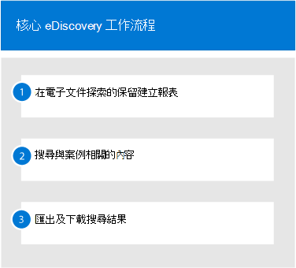

# 開始使用核心電子文件探索Get started with Core eDiscovery

Microsoft 365 中的核心 eDiscovery 提供一種基本 eDiscovery 工具，可讓組織用來搜尋並匯出 Microsoft 365 和 Office 365 中的內容。Core eDiscovery in Microsoft 365 provides a basic eDiscovery tool that organizations can use to search and export content in Microsoft 365 and Office 365. 您也可以使用核心 eDiscovery，在內容位置（例如 Exchange 信箱、SharePoint 網站、OneDrive 帳戶和 Microsoft 小組）上進行 eDiscovery 暫止。You can also use Core eDiscovery to place an eDiscovery hold on content locations, such as Exchange mailboxes, SharePoint sites, OneDrive accounts, and Microsoft Teams. 不需要部署核心 eDiscovery，但在您的組織開始使用核心 eDiscovery 來搜尋、匯出及保留內容之前，必須先完成一些必要的工作，IT 系統管理員和 eDiscovery 管理員才能開始使用。Nothing is needed to deploy Core eDiscovery, but there are some prerequisite tasks that an IT admin and eDiscovery manager have to complete before your organization can start using Core eDiscovery to search, export, and preserve content.

本文討論設定核心 eDiscovery 所需的步驟。This article discusses the steps necessary to set up Core eDiscovery. 這包括確保存取核心 eDiscovery 所需的適當授權，並在內容位置上放置 eDiscovery 保留，以及將許可權指派給您的 IT、法律和調查小組，讓他們能夠存取及管理案例。This includes ensuring the proper licensing required to access Core eDiscovery and place an eDiscovery hold on content locations, as well as assigning permissions to your IT, legal, and investigation team so they can access and manage cases. 本文也提供使用案例來搜尋及匯出內容的高層次概述。This article also provides a high-level overview of using cases to search for and export content.

## 步驟1：確認並指派適當的授權Step 1: Verify and assign appropriate licenses

核心 eDiscovery 的授權要求適當的組織訂閱和每一使用者授權。Licensing for Core eDiscovery requires the appropriate organization subscription and per-user licensing.

- **組織訂閱：** 若要存取 Microsoft 365 規範中心或 Office 365 安全性 & 規範中心的核心 eDiscovery，以及使用保留與匯出功能，您的組織必須具有 Microsoft 365 E3 或 Office 365 E3 訂閱或更高版本。**Organization subscription:** To access Core eDiscovery in the Microsoft 365 compliance center or the Office 365 Security & Compliance Center and use the hold and export features, your organization must have a Microsoft 365 E3 or Office 365 E3 subscription or higher.

- **每位使用者授權：** 若要在信箱和網站上放置 eDiscovery 暫止，必須根據您的組織訂閱，為使用者指派下列其中一個授權：**Per-user licensing:** To place an eDiscovery hold on mailboxes and sites, a user must be assigned one of the following licenses, depending on your organization subscription:

  - Microsoft 365 E3 或 Office 365 E3 授權或更高版本A Microsoft 365 E3 or Office 365 E3 license or higher

   OROR

  - Microsoft 365 E1 或 Office 365 E1 授權與 Exchange Online 方案2或 Exchange Online 封存附加元件授權A Microsoft 365 E1 or Office 365 E1 license with an Exchange Online Plan 2 or Exchange Online Archiving add-on license

  ANDAND

  - Microsoft 365 E1 或 Office 365 E1 授權，具有 SharePoint Online Plan 2 或 OneDrive for Business Plan 2 附加元件授權A Microsoft 365 E1 or Office 365 E1 license with an SharePoint Online Plan 2 or OneDrive for Business Plan 2 add-on license
  
  如需如何指派授權的詳細資訊，請參閱[將授權指派給使用者](https://docs.microsoft.com/microsoft-365/admin/manage/assign-licenses-to-users)。For information about how to assign licenses, see [Assign licenses to users](https://docs.microsoft.com/microsoft-365/admin/manage/assign-licenses-to-users).

如需授權的相關資訊：For information about licensing:

- 下載並查看[Microsoft 365 合規性授權比較](https://docs.microsoft.com/office365/servicedescriptions/downloads/microsoft-365-compliance-licensing-comparison.xlsx)中的「探索 & 回應」方案。Download and see the "Discover & Respond" solution in the [Microsoft 365 Compliance Licensing Comparison](https://docs.microsoft.com/office365/servicedescriptions/downloads/microsoft-365-compliance-licensing-comparison.xlsx).

- 請參閱[安全性 & 規範中心服務說明](https://docs.microsoft.com/office365/servicedescriptions/office-365-platform-service-description/office-365-securitycompliance-center)。See the [Security & Compliance Center service description](https://docs.microsoft.com/office365/servicedescriptions/office-365-platform-service-description/office-365-securitycompliance-center).

## 步驟2：指派 eDiscovery 許可權Step 2: Assign eDiscovery permissions

若要存取核心 ediscovery 或新增為核心 eDiscovery 案例的成員，必須對使用者指派適當的許可權。To access Core eDiscovery or be added as a member of a Core eDiscovery case, a user must be assigned the appropriate permissions. 具體而言，使用者必須新增為 Office 365 安全性 & 合規性中心內的 eDiscovery 管理員角色群組成員。Specifically, a user must be added as a member of the eDiscovery Manager role group in the Office 365 Security & Compliance Center. 這個角色群組的成員可以建立及管理核心 eDiscovery 案例。Members of this role group can create and manage Core eDiscovery cases. 他們可以新增及移除成員、為使用者放置 eDiscovery 暫止功能、建立及編輯搜尋，以及從核心 eDiscovery 案例中匯出內容。They can add and remove members, place an eDiscovery hold on users, create and edit searches, and export content from a Core eDiscovery case.

完成下列步驟，將使用者新增至 eDiscovery 管理員角色群組：Complete the following steps to add users to the eDiscovery Manager role group:

1. 移至[https://protection.office.com/permissions](https://protection.office.com/permissions)並使用您的 Microsoft 365 或 Office 365 組織中的系統管理員帳戶的認證登入。Go to [https://protection.office.com/permissions](https://protection.office.com/permissions) and sign in using the credentials for an admin account in your Microsoft 365 or Office 365 organization.

2. 在 [**許可權**] 頁面上，選取 [ **eDiscovery 管理員**] 角色群組。On the **Permissions** page, select the **eDiscovery Manager** role group.

3. 在 [eDiscovery 管理員飛出] 頁面上，按一下 [ **Ediscovery 管理員**] 區段旁邊的 [**編輯**]。On the eDiscovery Manager flyout page, click **Edit** next to the **eDiscovery Manager** section.

4. 在 [編輯角色群組] 嚮導的 [**選擇 EDiscovery 管理員**] 頁面上，按一下 **[選擇探索管理員**]。On the **Choose eDiscovery Manager** page in the edit role group wizard, click **Choose Discovery Manager**.

5. 按一下 [**新增**]，然後選取您要新增至角色群組之所有使用者的核取方塊。Click **Add** then select the checkbox for all users you want to add to the role group.

6. 按一下 [**新增**] 以新增選取的使用者，然後按一下 [**完成**]。Click **Add** to add the selected users, and then click **Done**.

7. 按一下 [**儲存**]，將使用者新增至角色群組，然後按一下 [**關閉**] 完成步驟。Click **Save** to add the users to the role group, and then click **Close** to complete the step.

### EDiscovery 管理員角色群組的詳細資訊More information about the eDiscovery Manager role group

EDiscovery 管理員角色群組中有兩個子群組。There are two subgroups in the eDiscovery Manager role group. 這些子群組之間的差異是以範圍為基礎。The difference between these subgroups is based on scope.

- **EDiscovery 管理員：** 可以查看和管理其所建立或屬於的核心 eDiscovery 案例。**eDiscovery Manager:** Can view and manage the Core eDiscovery cases they create or are a member of. 如果另一個 eDiscovery 管理員建立了案例，但沒有將第二個 eDiscovery 管理員新增為該案例的成員，則第二個 eDiscovery 管理員將無法在規範中心的核心 eDiscovery 頁面上查看或開啟此案例。If another eDiscovery Manager creates a case but doesn't add a second eDiscovery Manager as a member of that case, the second eDiscovery Manager won't be able to view or open the case on the Core eDiscovery page in the compliance center. 一般說來，您組織中的大部分人員都可以新增至 eDiscovery Manager 子組。In general, most people in your organization can be added to the eDiscovery Manager subgroup.

- **EDiscovery 管理員：** 可以執行 eDiscovery 管理員可以執行的所有案例管理工作。**eDiscovery Administrator:** Can perform all case management tasks that an eDiscovery Manager can do. 此外，電子檔探索管理員也可以：Additionally, an eDiscovery Administrator can:

  - 查看核心 eDiscovery 頁面上列出的所有案例。View all cases that are listed on the Core eDiscovery page.
  
  - 管理組織中的任何案例後，將自己新增為案例成員。Manage any case in the organization after they add themselves as a member of the case.

  - 針對組織中的任何案例，存取及匯出案例資料。Access and export case data for any case in the organization.

  因為存取範圍廣泛，所以組織應該只有少數管理員是 eDiscovery Administrators 子群組的成員。Because of the broad scope of access, an organization should have only a few admins who are members of the eDiscovery Administrators subgroup.

如需有關 eDiscovery 許可權的詳細資訊，以及指派給 eDiscovery 管理員角色群組之每個角色的說明，請參閱[指派 eDiscovery 許可權](assign-ediscovery-permissions.md)。For more information about eDiscovery permissions and a description of each role that's assigned to the eDiscovery Manager role group, see [Assign eDiscovery permissions](assign-ediscovery-permissions.md).

## 步驟3：建立核心 eDiscovery 案例Step 3: Create a Core eDiscovery case

下一步是建立案例，並開始使用核心 eDiscovery。The next step is to create a case and start using Core eDiscovery. 完成下列步驟以建立案例並新增成員。Complete the following steps to create a case and add members. 建立案例的使用者會自動新增為成員。The user who creates the case is automatically added as a member.

1. 移至[https://compliance.microsoft.com](https://compliance.microsoft.com)並登入使用已獲指派適當 eDiscovery 許可權之使用者帳戶的認證。Go to [https://compliance.microsoft.com](https://compliance.microsoft.com) and sign in using the credentials for a user account that has been assigned the appropriate eDiscovery permissions. 組織管理角色群組的成員也可以建立核心 eDiscovery 案例。Members of the Organization Management role group can also create Core eDiscovery cases.

2. 在 Microsoft 365 規範中心的左功能窗格中，按一下 [**全部顯示**]，然後按一下 [ **eDiscovery > Core**]。In the left navigation pane of the Microsoft 365 compliance center, click **Show all**, and then click **eDiscovery > Core**.

3. 在 [**核心電子**檔探索] 頁面上，按一下 [**建立案例**]。On the **Core eDiscovery** page, click **Create a case**.

4. 在 [**新案例**飛入] 頁面上，為案例提供名稱（必要），然後輸入選用的案例編號及描述。On the **New case** flyout page, give the case a name (required), and then type an optional case number and description. 案例名稱在您的組織中必須是唯一的。The case name must be unique in your organization.

5. 按一下 [**儲存**] 以建立案例。Click **Save** to create the case.

   在核心 eDiscovery 頁面上建立及顯示新案例。The new case is created and displayed on the Core eDiscovery page. 您可能**需要按一下 [** 重新整理] 以顯示新的案例。You may have to click **Refresh** to display the new case. 

## 步驟4（選用）：將成員新增至核心 eDiscovery 案例Step 4 (optional): Add members to a Core eDiscovery case

如果您在步驟3中建立案例，而且您是唯一會使用此案例的人員，則您不需要執行此步驟。If you create a case in Step 3 and you're the only person who will use the case, then you don't have to perform this step. 您可以開始使用案例來建立 eDiscovery 保留、搜尋內容或匯出搜尋結果。You can start using the case to create eDiscovery holds, search for content, or export search results. 如果您想要授與其他使用者（或角色群組）存取案例，請執行此步驟。Perform this step if you want to give other users (or roles group) access to the case.

1. 在 Microsoft 365 規範中心的**核心 eDiscovery**頁面上，按一下您要新增成員的案例名稱。On the **Core eDiscovery** page in the Microsoft 365 compliance center, click the name of the case that you want to add members to.

2. 在 [**管理此案例**飛入] 頁面上的 [**管理成員**] 底下，按一下 [**新增**] 以將成員新增至案例。On the **Manage this case** flyout page, under **Manage members**, click **Add** to add members to the case. 

    您也可以選擇新增角色群組做為案例的成員。You can also choose to add role group as members of a case. 在 [**管理角色群組**] 底下，按一下 [**新增**]。Under **Manage role groups**, click **Add**. 您只能將您所屬的角色群組指派給案例。You can only assign the role groups that you are a member of to a case. 這是因為角色群組控制誰可以指派成員至 eDiscovery 案例。That's because role groups control who can assign members to an eDiscovery case.

3. 在可以新增為案例成員的人員或角色群組清單中，按一下您要新增之人員（或角色群組）名稱旁邊的核取方塊。In the list of people or role groups that can be added as members of the case, click the check box next to the names of the people (or role groups) that you want to add. 如果您有很多可以新增為成員的人員清單，請使用**搜尋**方塊來搜尋清單中的特定人員。If you have a large list of people who can added as members, use the **Search** box to search for a specific person in the list.
  
4. 選取要新增為案例成員的人員或角色群組之後，按一下 [**新增**]。After you select the people or role groups to add as members of the case, click **Add**.

5. 按一下 [**儲存**] 儲存新的案例成員清單。Click **Save** to save the new list of case members.

## 探索核心 eDiscovery 工作流程Explore the Core eDiscovery workflow

為了讓您開始使用核心 eDiscovery，以下是簡單的工作流程，可為感興趣的人員建立 eDiscovery 保留，搜尋與調查相關的內容，然後匯出該資料以進一步複查。To get you started using core eDiscovery, here's a simple workflow of creating eDiscovery holds for people of interest, searching for content that relevant to your investigation, and then exporting that data for further review. 在上述每個步驟中，我們也會強調您可以探索的一些擴充核心 eDiscovery 功能。In each of these steps, we'll also highlight some extended Core eDiscovery functionality that you can explore.

1. **[建立 eDiscovery 保留](create-ediscovery-holds.md)**。**[Create an eDiscovery hold](create-ediscovery-holds.md)**. 在建立案例之後的第一個步驟是在調查中所關注之人員的內容位置保留（也稱為*eDiscovery 保留*）。The first step after creating a case is placing a hold (also called an *eDiscovery hold*) on the content locations of the people of interest in your investigation. 內容位置包含 Exchange 信箱、SharePoint 網站、OneDrive 帳戶，以及與 Microsoft 團隊和 Office 365 群組相關聯的信箱和網站。Content locations include Exchange mailboxes, SharePoint sites, OneDrive accounts, as well as the mailboxes and sites associated with Microsoft Teams and Office 365 Groups. 這是選用的步驟，建立 eDiscovery 保留可在調查期間保留與案例相關的內容。While this step is optional, creating an eDiscovery hold preserves content that may be relevant to the case during the investigation. 當您建立 eDiscovery 暫止功能時，您可以保留特定內容位置中的所有內容，也可以建立查詢型保留，只保留符合保留查詢的內容。When you create an eDiscovery hold you can preserve all content in specific content locations or you can create a query-based hold to preserve only the content that matches a hold query. 除了保留內容之外，另一個建立 eDiscovery 保留的最佳原因是，在下一個步驟中建立和執行搜尋時，請快速搜尋內容位置（而不是必須選取要搜尋的各個位置）。In addition to preserving content, another good reason to create eDiscovery holds is to quickly search the content locations on hold (instead of having to select each location to search) when you create and run searches in the next step. 完成調查之後，您可以放開您建立的任何保留。After you complete your investigation, you can release any hold that you created.

2. **[搜尋內容](search-for-content-in-core-ediscovery.md)**。**[Search for content](search-for-content-in-core-ediscovery.md)**. 在您建立 eDiscovery 保留後，請使用內建的搜尋工具來搜尋保留中的內容位置。After you create eDiscovery holds, use the built-in search tool to search the content locations on hold. 您也可以在其他內容位置搜尋可能與案例相關的資料。You can also search other content locations for data that may be relevant to the case. 您可以建立及執行與案例相關聯的不同搜尋。You can create and run different searches that are associated with the case. 您可以使用關鍵字、屬性和條件來[建立搜尋查詢](keyword-queries-and-search-conditions.md)，以利用最可能與案例相關的資料傳回搜尋結果。You use keywords, properties, and conditions to [build search queries](keyword-queries-and-search-conditions.md) that return search results with the data that's most likely relevant to the case. 您也可以：You can also:

   - 查看可協助您縮小搜尋查詢以縮小結果的搜尋統計資料。View search statistics that may help you refine a search query to narrow the results.

   - 預覽搜尋結果，以快速確認是否找到相關資料。Preview the search results to quickly verify whether the relevant data is being found.

   - 修改查詢，然後重新執行搜尋。Revise a query and rerun the search.

3. **[匯出及下載搜尋結果](export-content-in-core-ediscovery.md)**。**[Export and download search results](export-content-in-core-ediscovery.md)**. 搜尋並找出與調查相關的資料之後，您可以將其匯出至 Office 365，以供調查小組以外的人員複查。After you search for and find data that's relevant to your investigation, you can export it out of Office 365 for review by people outside of the investigation team. 匯出資料的過程分為兩個步驟。Exporting data is a two-step process. 第一步是在不在 Office 365 的情況下，匯出搜尋結果。The first step is to export the results of a search in the case out of Office 365. 若要完成此工作，您可以將搜尋結果複製到 Microsoft 提供的 Azure 儲存位置。This is accomplished by copying the results of a search to a Microsoft-provided Azure Storage location. 下一步是使用 eDiscovery 匯出工具，將內容下載到本機電腦。The next step is to use the eDiscovery Export tool to download the content to a local computer. 除了匯出的資料檔案之外，匯出套件也包含匯出報告、摘要報告及錯誤報表。In addition to the exported data files, the contains of the export package also contains an export report, a summary report, and an error report.
