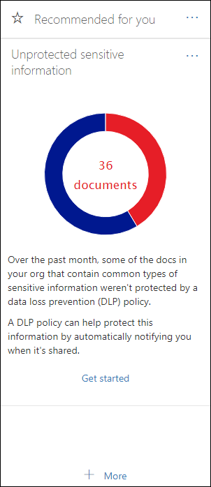

# 開始使用 DLP 原則建議Get started with DLP policy recommendations

此深入瞭解導向的建議可協助您的組織在您的 DLP 原則覆蓋範圍內有可能的缺口時，通知您，以保護機密內容365的安全。This insight-driven recommendation helps your organization keep sensitive content secure when it's stored and shared in Microsoft 365 by informing you when there's a possible gap in your DLP policy coverage. 您將會在安全性與合規性中心**的首頁上**看到此建議 &amp; ，如果您的檔包含任何最常見類型的敏感資訊，但未受到資料遺失防護（DLP）原則的保護。You'll see this recommendation on the **Home** page of the Security &amp; Compliance Center, if your documents contain any of the top-five most common types of sensitive information but aren't protected by a data loss prevention (DLP) policy. 
  
您可以使用此小工具，只要按一下一次或兩次，即可快速建立自訂的 DLP 原則，而且在您建立此 DLP 原則之後，即可完全自訂。You can use this widget to quickly create a customized DLP policy in just a click or two, and after you create this DLP policy, it's fully customizable. 請注意，如果您第一次沒有看到建議，請嘗試按一下 [**建議**] 區段底部的 [**其他**]。Note that if you don't see the recommendation at first, try clicking **+More** at the bottom of the **Recommended for you** section. 
  

  
## 建立建議的 DLP 原則Create the recommended DLP policy

當小工具顯示您未受保護的機密資訊時，請選擇底部的 [**開始**使用] 快速建立 DLP 原則。When the widget shows you unprotected sensitive information, choose **Get started** at the bottom to quickly create a DLP policy. 
  
為了協助保護機密資訊，此 DLP 原則包括：To help protect the sensitive information, this DLP policy:
  
- 在 Exchange、SharePoint 及包含其中一種未受保護的敏感資訊類型的 OneDrive 中，偵測到組織外部人員共用的內容。Detects when content in Exchange, SharePoint, and OneDrive that contains one of the unprotected types of sensitive information is shared with people outside your organization.
    
- 產生詳細的活動報告，使您可以追蹤與組織外部的人員共用內容的人員，以及他們的情況。Generates detailed activity reports so that you can track things like who shared the content with people outside your organization and when they did it. 您可以使用[DLP 報告](view-the-dlp-reports.md)和[審核記錄資料](search-the-audit-log-in-security-and-compliance.md)（其中**活動**  =  **DLP**）來查看此資訊。You can use the [DLP reports](view-the-dlp-reports.md) and [audit log data](search-the-audit-log-in-security-and-compliance.md) (where **Activity** = **DLP**) to see this information.
    
您也可以選擇讓 DLP 原則執行下列作業：You can also choose to have the DLP policy:
  
- 當使用者與組織外部的人員共用大量的敏感資訊時，向您傳送附隨報告電子郵件。Send you an incident report email when users share a lot of this sensitive information with people outside your organization.
    
- 將其他使用者新增至電子郵件附隨報告。Add other users to the email incident report.
    
- 當使用者嘗試與組織外部的人員共用此機密資訊時，顯示原則提示並傳送電子郵件通知給使用者。Show a policy tip and send an email notification to users when they attempt to share this sensitive information with people outside your organization. 如需這些選項的詳細資訊，請參閱[傳送電子郵件通知及顯示 DLP 原則的原則秘訣](use-notifications-and-policy-tips.md)。For more information on these options, see [Send email notifications and show policy tips for DLP policies](use-notifications-and-policy-tips.md).
    
如果您想要稍後變更這些選項，您可以在建立 DLP 原則之後進行編輯。If you want to change these options later, you can edit the DLP policy after it's created. 例如，您可以讓原則更具限制性，甚至只封鎖人員在第一個位置中包含敏感資訊的共用內容中，請參閱下一節。For example, you can make the policy more restrictive by even blocking people from sharing content that contains sensitive information in the first place - see the next section.
  

  
## 編輯建議的 DLP 原則Edit the recommended DLP policy

使用小工具建立 DLP 原則之後，原則會出現在安全性與規範中心的 [**原則**] 頁面的 [**資料遺失防護**] 底下 &amp; 。After you use the widget to create a DLP policy, the policy appears under **Data loss prevention** on the **Policy** page of the Security &amp; Compliance Center. 
  
根據預設，此原則稱為「**系統建議」原則，用來共用機密資訊**。By default, the policy is named **System Recommended Policy for Sharing Sensitive Information**. 這個原則可以完全自訂，與您從頭建立的任何 DLP 原則相同。This policy is fully customizable, the same as any DLP policy that you create yourself from scratch. 例如，如果您決定在使用小工具時未開啟附隨報告和原則提示，您可以隨時編輯原則並開啟這些選項。For example, if you decided not to turn on incident reports and policy tips when you used the widget, you can always edit the policy and turn on those options at any time.
  

  
## 構件的功能及未出現時When the widget does and does not appear

名為「未**受保護的敏感資訊**」的小工具會出現在安全性與規範中心**首頁的**[**建議供您使用**] 區段中 &amp; 。The widget named **Unprotected Sensitive Information** appears in the **Recommended for you** section of the **Home** page of the Security &amp; Compliance Center. 
  
只有在下列情況時才會顯示此小工具：This widget appears only when:
  
- 在過去30天內，會偵測到包含任何五種最常見類型的敏感資訊的新檔，SharePoint 或 OneDrive。New documents containing any of the five most common types of sensitive information are detected in SharePoint or OneDrive over the past 30 days.
    
- 機密資訊尚未受到現有 DLP 原則的保護。That sensitive information is not already protected by an existing DLP policy.
    
不同于持續掃描資料的 DLP 原則，此建議會掃描 DLP 原則覆蓋範圍中每隔48小時的間隙，因此在上傳新內容之後，可能需要長達兩天的時間，建議才會顯示。Unlike DLP policies that are constantly scanning your data, this recommendation scans for gaps in your DLP policy coverage roughly every 48 hours, so after new content is uploaded, it may take up to two days for the recommendation to appear.
  
最後，在您使用小工具建立建議的 DLP 原則之後，該構件會從**首頁**消失。Finally, after you use the widget to create a recommended DLP policy, the widget disappears from the **Home** page. 
  

