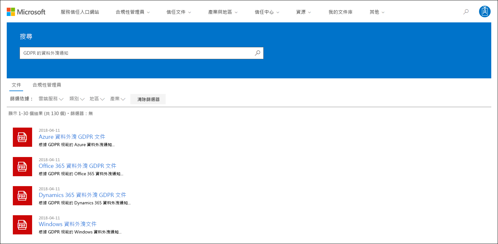
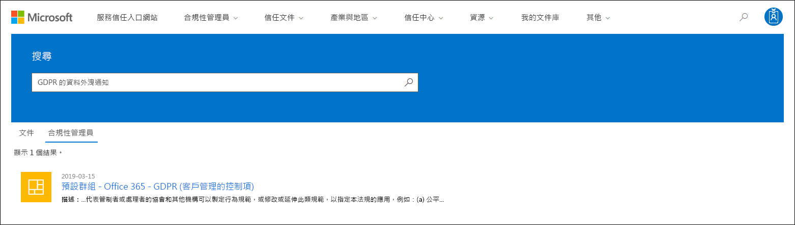
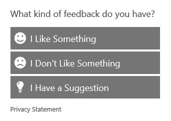

# 开始使用 Microsoft 服务信任门户

Microsoft 服务信任门户提供有关 Microsoft 安全、隐私和合规性实践的各种内容、工具和其他资源。
  
## 访问服务信任门户

服务信任门户包含有关 Microsoft 实施保护云服务及其客户数据的控制和流程的详细信息。 要访问服务信任门户上的某些资源，您必须以经过身份验证的用户身份使用 Microsoft 云服务帐户（Azure 活动目录组织帐户或 Microsoft 帐户）登录，并查看并接受 Microsoft合规材料的保密协议。
  
现有客户可以使用以下在线订阅之一（[https://aka.ms/STP](https://aka.ms/STP)试用版或付费）**访问服务信任门户：** 
  
- Office 365

- Dynamics 365

- Azure
    
 > [!NOTE]
 > 与组织关联的 Azure 活动目录帐户有权访问各种文档和功能，如合规性管理器。 为个人使用而创建的 Microsoft 帐户对服务信任门户内容的访问有限。 
  
**评估 Microsoft 在线服务的新客户和客户**
  
要创建新帐户或创建试用帐户，请使用以下注册表单之一（也用于试用帐户）来访问 STP。
  
- 注册新的 Office [365 企业试用帐户](https://go.microsoft.com/fwlink/p/?LinkID=507653)或新的[Office 365 企业试用帐户](https://go.microsoft.com/fwlink/p/?LinkID=698279)

- 注册新的 Dynamics [365 试用帐户](https://go.microsoft.com/fwlink/?LinkId=252780)

- 注册新的 Azure[试用帐户](https://go.microsoft.com/fwlink/?LinkId=722737)。 
    
注册免费试用版或订阅时，必须启用 Azure 活动目录以支持对 STP 的访问。
  
## 使用服务信任门户

可以从主菜单访问服务信任门户功能和内容。
  

以下各节描述主菜单中的每个项。
  
### 服務信任入口網站

**服务信任门户**链接显示主页。 它提供了一种快速的方法来返回主页。

### 合規性

提供以下与合规性相关的工具和资源：

- **审核报告**- 显示有关 Microsoft 云服务的独立审核和评估报告列表。 这些报告提供有关 Microsoft 云服务符合数据保护标准和法规要求的信息，例如：
  
    - 国际标准化组织
    - 服务组织控制 （SOC）
    - 国家标准与技术研究所
    - 联邦风险和授权管理计划 （FedRAMP）
    - 一般数据保护条例

  有关审核报告的信息以及**指向"审核报告"** 页的链接，也会显示在服务信任门户主页上。 
  
- **合规性管理器**- 合规性管理器是一种基于工作流的风险评估工具，可帮助您跟踪、分配和验证与 Microsoft 云服务相关的法规遵从性活动，例如 Office 365、Dynamics 365 和蔚蓝。 使用合规性管理器在云的共享责任模型中管理法规遵从性。 有关详细信息，请参阅[使用合规性管理器来帮助在使用 Microsoft 云服务时满足数据保护和法规要求。](meet-data-protection-and-regulatory-reqs-using-microsoft-cloud.md)

### 行业&区域

提供有关 Microsoft 云服务的行业和地区特定的合规性信息。

- **行业**- 提供有关特定于行业的登录页的信息，以及 Microsoft 云服务如何帮助您的组织遵守这些行业的标准和法规：

    - 教育
    - 金融服务
    - 政府
    - 健康情況
    - 製造
    - 零售

- **区域**- 提供有关 Microsoft 云服务符合不同国家/地区法律的法律意见。 特定国家包括澳大利亚、捷克共和国、德国、波兰、罗马尼亚、西班牙和英国。
  
### 文档& 资源

提供丰富的安全实施和设计信息，旨在通过了解 Microsoft 云服务如何确保数据安全，让您更轻松地实现法规遵从性目标。 要查看内容，**请选择"文档&资源"** 页上的选项之一。

- 白皮书、常见问题解答和文章如何
- 合规指南
- 笔测试和安全评估
- 安全分數
- Azure 安全和合规性蓝图
- 审核的控件
  
### 信任中心

指向[微软信任中心](https://www.microsoft.com/trustcenter)的链接，该中心提供有关微软云中安全性、合规性和隐私的更多信息。 这包括有关 Microsoft 云服务中可用于满足 GDPR 特定要求的功能的信息、有助于您的 GDPR 问责制以及您对技术和组织措施的理解的文档微软已经采取行动支持GDPR。
  
### 我的图书馆

此新功能允许您保存（或*固定）* 文档，以便您可以在"我的库"页面上快速访问它们。 您还可以设置通知，以便 Microsoft 在更新"我的库"中的文档时向您发送电子邮件。 有关详细信息，请参阅本文[中的"我的库"](#my-library-1)部分。

### 系統管理

仅对全局管理员帐户可用的管理功能。 仅当您以全局管理员身份登录时，此选项才可见。
  
 "**设置"** 页允许您将基于角色的访问权限分配给合规性管理器。 有关详细信息，请参阅使用合规性管理器中的"权限和基于角色的访问控制"部分，[以帮助在使用 Microsoft 云服务时满足数据保护和法规要求。](meet-data-protection-and-regulatory-reqs-using-microsoft-cloud.md#permissions-and-role-based-access-control)
  
### 搜尋

单击服务信任门户页面右上角的放大镜以展开框，输入搜索字词，然后**按"输入"。**

  
 **将显示"搜索"** 页面，搜索词将显示在搜索框中，搜索结果如下所示。
  

默认情况下，搜索返回文档结果。 您可以使用下拉列表来优化显示的文档列表，从而获得结果。 您可以使用多个筛选器来缩小文档列表。 筛选器包括特定的云服务、合规性或安全实践类别、区域和行业。 单击文档名称链接以下载文档。
  
要列出与"合规性管理器"中与搜索条款相关的"评估"中的控件，**请单击"合规性管理器"。** 搜索结果显示创建评估的日期、评估组的名称、适用的 Microsoft 云服务以及该控件是 Microsoft 还是客户管理。 单击控件的名称以查看合规经理评估中的控件。
  

  
> [!NOTE]
> 服务信任门户报告和文档在发布后或新版本文档可用之前至少 12 个月可供下载。
  
## 我的图书馆

使用"我的库"功能将"服务信任门户"上的文档和资源添加到"我的库"页面。 这使您可以在单个位置访问与您相关的文档。  要将文档添加到"我的库"，请单击文档右侧**的..."** 菜单，然后**选择"保存到库"。** 您可以通过单击一个或多个文档旁边的复选框，然后单击页面顶部**的"保存到库"，** 将多个文档添加到"我的库"。

此外，通知功能还允许您配置"我的库"，以便在 Microsoft 更新已添加到"我的库"的文档时向您发送一封电子邮件。 要设置通知，请转到"我的库"，然后单击"**通知设置"。** 您可以选择通知的频率，并指定组织中要向其发送通知的电子邮件地址。 电子邮件通知包括指向已更新的文档的链接以及更新的简要说明。

另请注意，无论您是否打开通知，我们都会识别"我的库"中在过去 30 天内更新的任何文档。 更新的简要说明也显示在工具提示中。 

## 初学者包

初学者包是一组 Microsoft 整理的有关特定行业的 Microsoft 云服务的文档。 目前，服务信任门户为金融服务组织提供以下三个入门包。 这些入门包可帮助组织评估和评估 Microsoft 云中的安全性、合规性和隐私，并提供帮助在高度监管的金融服务行业实施 Microsoft 云服务的指导。

- **评估初学者包**- 用于早期评估金融服务组织的 Microsoft 云。

- **评估初学者包**- 评估后，使用此入门包中的检查表和其他指南来帮助您的组织评估与安全、合规性和隐私相关的风险。

- **审核初学者包**- 用户此初学者包提供有关使用审核控制和其他工具的指导，以帮助指导您实施 Microsoft 云服务的方式，帮助减少组织的风险。

要访问这些入门包，请转到**服务信任门户>行业&区域>行业解决方案>金融服务。** 您可以打开或从初学者包下载文档，或将其保存到"我的库"。"

## 當地語系化支援

通过服务信任门户，您可以查看不同语言的页面内容。 要更改页面语言，只需单击页面左下角的地球图标，然后选择您选择的语言。 
  

  
## 意見反應

我们可以帮助您解决有关服务信任门户的问题，或者您在使用该门户时遇到的错误。 您还可以使用 STP 页面底部的反馈链接联系我们，了解有关服务信任门户合规性报告和信任资源的问题和反馈。
  
您的反馈对我们非常重要。 点击页面底部的反馈按钮，向我们发送关于您所做的或不喜欢的内容的评论，或者您可能对改进我们的产品或产品功能的建议。
  

