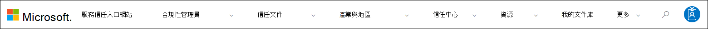

# 開始使用 Microsoft 服務信任入口網站Get started with the Microsoft Service Trust Portal

Microsoft 服務信任入口網站提供各種內容、工具及其他有關 Microsoft 安全性、隱私權和規範作法的資源。The Microsoft Service Trust Portal provides a variety of content, tools, and other resources about Microsoft security, privacy, and compliance practices.

## 存取服務信任入口網站Accessing the Service Trust Portal

服務信任入口網站包含 Microsoft 實施之控制和程式的詳細資料，以保護我們的雲端服務和其中的客戶資料。The Service Trust Portal contains details about Microsoft's implementation of controls and processes that protect our cloud services and the customer data therein. 若要存取服務信任入口網站上的某些資源，您必須以您的 Microsoft 雲端服務帳戶登入已驗證的使用者， (Azure Active Directory 組織帳戶或 Microsoft 帳戶) 並複查並接受 Microsoft 保密協定，以取得規範材料。To access some of the resources on the Service Trust Portal, you must log in as an authenticated user with your Microsoft cloud services account (either an Azure Active Directory organization account or a Microsoft Account) and review and accept the Microsoft Non-Disclosure Agreement for Compliance Materials.

### 現有客戶Existing customers

現有客戶可以 <https://aka.ms/STP> 使用下列其中一項線上訂閱，存取服務信任入口網站 (試用版或付費) ：Existing customers can access the Service Trust Portal at <https://aka.ms/STP> with one of the following online subscriptions (trial or paid):

- Microsoft 365Microsoft 365
- Dynamics 365Dynamics 365
- AzureAzure

 > [!NOTE]
 > 與組織相關聯的 Azure Active Directory 帳戶，可存取檔和功能（如合規性管理員）的完整範圍。Azure Active Directory accounts associated with organizations have access to the full range of documents and features like Compliance Manager. 為個人使用而建立的 Microsoft 帳戶，對服務信任入口網站內容的存取權有限。Microsoft accounts created for personal use have limited access to Service Trust Portal content.

### 評估 Microsoft online 服務的新客戶和客戶New customers and customers evaluating Microsoft online services

若要建立新帳戶或建立試用帳戶，請使用下列其中一個簽入表單， (也可以用來) 試用帳戶，以取得 STP 的存取權。To create a new account or to create a trial account, use one of the following sign-up forms (also used for trial accounts) to get access to the STP.

- 註冊新的 [Microsoft 365 應用程式商務試用帳戶](https://go.microsoft.com/fwlink/p/?LinkID=507653) 或新的 [Office 365 企業版試用帳戶](https://go.microsoft.com/fwlink/p/?LinkID=698279)Sign up for a new [Microsoft 365 Apps for business trial account](https://go.microsoft.com/fwlink/p/?LinkID=507653) or a new [Office 365 Enterprise trial account](https://go.microsoft.com/fwlink/p/?LinkID=698279)

- 註冊新的 [Dynamics 365 試用帳戶](https://go.microsoft.com/fwlink/?LinkId=252780)Sign up for a new [Dynamics 365 trial account](https://go.microsoft.com/fwlink/?LinkId=252780)

- 註冊新的 [Azure 試用帳戶](https://go.microsoft.com/fwlink/?LinkId=722737)。Sign up for a new [Azure trial account](https://go.microsoft.com/fwlink/?LinkId=722737).

當您註冊免費試用版或訂閱時，您必須啟用 Azure Active Directory 來支援您存取 STP。When you sign up for either a free trial, or a subscription, you must enable Azure Active Directory to support your access to the STP.

## 使用服務信任入口網站Using the Service Trust Portal

您可以從主要功能表存取服務信任入口網站的功能和內容。The Service Trust Portal features and content are accessible from the main menu.

下列各節說明主要功能表中的每個專案。The following sections describe each item in the main menu.

### 服務信任入口網站Service Trust Portal

**服務信任入口網站**連結會顯示首頁。The **Service Trust Portal** link displays the home page. 它可讓您快速回到首頁。It provides a quick way to get back to the home page.

### 合規性管理員Compliance Manager

> [!IMPORTANT]
> 合規性管理員已從服務信任入口網站移至 [Microsoft 365 規範中心](https://compliance.microsoft.com/)內的新位置。Compliance Manager has moved from the Service Trust Portal to its new location in the [Microsoft 365 compliance center](https://compliance.microsoft.com/). 所有客戶資料都已移至新位置，因此您可以繼續使用合規性管理員而不會中斷。All customer data has been moved over to the new location, so you can continue using Compliance Manager without interruption. 如需設定資訊，請參閱 [合規性管理員檔](compliance-manager.md) ，瞭解新功能。Refer to the [Compliance Manager documentation](compliance-manager.md) for setup information and to learn about new features. 雖然傳統版本的合規性管理員仍保留在服務信任入口網站中，但鼓勵所有使用者使用 Microsoft 365 規範中心的合規性管理員。Although the classic version of Compliance Manager remains in the Service Trust Portal, all users are encouraged to use Compliance Manager in the Microsoft 365 compliance center.

### 信任文件Trust Documents

提供大量的安全性實施及設計資訊，目的在於瞭解 Microsoft Cloud services 如何保護您的資料，以簡化法規遵從性目標。Provides a wealth of security implementation and design information with the goal of making it easier for you to meet regulatory compliance objectives by understanding how Microsoft Cloud services keep your data secure. 若要複查內容，請在 [ **信任檔** ] 下拉式功能表上選取下列其中一個選項。To review content, select one of the following options on the **Trust Documents** pull-down menu.

- **審核報告：** 隨即會顯示 Microsoft 雲端服務上的獨立審核和評估報告清單。**Audit Reports:** A list of independent audit and assessment reports on Microsoft's Cloud services is displayed. 這些報告提供與資料保護標準及法規需求相關的 Microsoft 雲端服務規範資訊，例如：These reports provide information about Microsoft Cloud services compliance with data protection standards and regulatory requirements, such as:

  - 國際標準組織 (ISO) International Organization for Standardization (ISO)
  - 服務組織控制 (SOC)Service Organization Controls (SOC)
  - 美國國家標準技術局 (NIST)National Institute of Standards and Technology (NIST)
  - 聯邦風險與授權管理計畫 (FedRAMP)Federal Risk and Authorization Management Program (FedRAMP)
  - 一般資料保護規定 (GDPR)General Data Protection Regulation (GDPR)

- **資料保護：** 包含大量的資源，如已審核的控制項、白皮書、FAQs、滲透測試、風險評估工具及規範指南。**Data Protection:** Contains a wealth of resources such as audited controls, white papers, FAQs, penetration tests, risk assessment tools, and compliance guides.

- **Azure 安全性與合規性藍圖：** 協助您建立安全且相容的雲端架構應用程式的資源。**Azure Security and Compliance Blueprints:** Resources that help you build secure and compliant cloud-based applications. 此區域包含政府、金融、保健和零售行業的藍圖指導方針。This area contain blueprint-guidance for government, finance, healthcare, and retail verticals.

### 產業與地區Industries & Regions

提供與行業及地區相關的 Microsoft 雲端服務相容性資訊。Provides industry- and region-specific compliance information about Microsoft Cloud services.

- **行業：** 目前為止，此頁面提供金融服務行業的行業專用登陸頁面。**Industries:** At this time, this page provides an industry-specific landing page the for the Financial Services industry. 這包含法規遵從性服務、FAQs 及成功案例等資訊。This contains information such as compliance offerings, FAQs, and success stories. 未來將會發佈更多行業的資源，但是您可以移至 **信任檔 >** STP 中的「資料保護」頁面，以尋找更多行業的資源。Resources for more industries will be released in the future, however you can find resources for more industries by going to the **Trust Documents > Data Protection** page in the STP.

- **地區：** 提供 Microsoft Cloud services 對各國家/地區各法律的法律觀點。**Regions:** Provides legal opinions on Microsoft Cloud services compliance with various the laws of various countries. 特定國家/地區包括澳大利亞、加拿大、捷克共和國、丹麥、德國、波蘭、羅馬尼亞、西班牙及英國。Specific countries include Australia, Canada, Czech Republic, Denmark, Germany, Poland, Romania, Spain, and the United Kingdom.

### 信任中心Trust Center

[Microsoft 信任中心](https://www.microsoft.com/trust-center)的連結，可提供 microsoft 雲端安全性、規範和隱私權的詳細資訊。Links to the [Microsoft Trust Center](https://www.microsoft.com/trust-center), which provides more information about security, compliance, and privacy in the Microsoft Cloud. 這包括 Microsoft 雲端服務中功能的相關資訊，您可以用來解決 GDPR 的特定需求、檔對您的 GDPR 責任有何説明，以及您對 Microsoft 所採用的技術和組織量值的瞭解，以支援 GDPR。This includes information about the capabilities in Microsoft Cloud services that you can use to address specific requirements of the GDPR, documentation helpful to your GDPR accountability and to your understanding of the technical and organizational measures Microsoft has taken to support the GDPR.

### 我的文件庫My Library

這項新功能可讓您將 (或 *固定*) 檔，以便在您的 [我的文件庫] 頁面上快速進行存取。This new feature lets you save (or *pin*) documents so that you can quickly access them on your My Library page. 您也可以設定通知，讓 Microsoft 在我的文件庫中的檔更新時，傳送電子郵件訊息給您。You can also set up notifications so that Microsoft sends you an email message when documents in your My Library are updated. 如需詳細資訊，請參閱本文中的 [My Library](#my-library-1) 一節。For more information, see the [My Library](#my-library-1) section in this article.

### 更多More

移至 [ **更多 > 管理員** ]，以存取只有全域管理員帳戶才能使用的系統管理功能。Go to **More > Admin** to access administrative functions that are only available to the global administrator account. 只有當您以全域系統管理員身分登入時，才會顯示此選項。This option is visible only when you are signed in as a global administrator. 系統 **管理** 下拉式功能表中有兩個選項：There are two options in the **Admin** pull-down menu:

- **設定：** 此頁面可讓您將合規性管理員的使用者角色指派 (傳統) 。**Settings:** This page lets you assign user roles for Compliance Manager (classic).

- **使用者隱私權設定：** 此頁面可讓您在特定使用者 (傳統) 中，匯出包含合規性管理員中的動作專案指派的報表。**User Privacy Settings:** This page lets you export a report that contains action item assignments in Compliance Manager (classic) for a specific user. 您也可以將所有動作專案重新指派給不同的使用者，並從指定的使用者移除任何已指派的動作專案。You can also reassign all action items to a different user and remove any assigned action item from the specified user.

### 搜尋Search

按一下 [服務信任入口網站] 頁面右上角的放大鏡，展開方塊，輸入您的搜尋字詞，然後按 **enter**。Click the magnifying glass in the upper right-hand corner of the Service Trust Portal page to expand the box, enter your search terms, and press **Enter**. 隨即會顯示 [ **搜尋** ] 頁面，並在搜尋方塊中顯示搜尋字詞，以及下列所列的搜尋結果。The **Search** page is displayed, with the search term displayed in the search box and the search results listed below.

根據預設，搜尋會傳回檔結果。By default, the search returns document results. 您可以使用下拉式清單來縮小所顯示的檔案清單，以篩選結果。You can filter the results by using the dropdown lists to refine the list of documents displayed. 您可以使用多個篩選器縮小檔案清單。You can use multiple filters to narrow the list of documents. 篩選器包含特定的雲端服務、規範類別或安全性作法、地區和行業。Filters include the specific cloud services, categories of compliance or security practices, regions, and industries. 按一下 [檔案名稱] 連結，以下載檔案。Click the document name link to download the document.

若要在合規性管理員中列出評估 (傳統) 相關的搜尋字詞，請按一下 [ **合規性管理員**]。To list controls from Assessments in Compliance Manager (classic) related your search terms, click **Compliance Manager**. 搜尋結果會顯示評估的建立日期、評估群組的名稱、適用的 Microsoft 雲端服務，以及控制項是 Microsoft 或客戶管理的。The search results show the date the assessment was created, the name of the assessment grouping, the applicable Microsoft Cloud service, and whether the control is Microsoft or Customer Managed. 按一下控制項的名稱，以在合規性管理員 (傳統) 中的評估中查看該控制項。Click the name of the control to view the control in the Assessment in Compliance Manager (classic).

> [!NOTE]
> 服務信任入口網站回報和檔可在發佈後的12個月內下載，或在新的檔版本可供下載。Service Trust Portal reports and documents are available to download for at least 12 months after publishing or until a new version of document becomes available.

## 我的文件庫My Library

使用 My Library 功能將服務信任入口網站上的檔和資源新增至 [我的文件庫] 頁面。Use the My Library feature to add documents and resources on the Service Trust Portal to your My Library page. 這可讓您在單一位置存取與其相關的檔。This lets you access documents that are relevant to you in a single place.  若要將檔新增至我的文件庫，請按一下檔右側 **的 [...** ] 功能表，然後選取 [ **儲存至文件庫**]。To add a document to your My Library, click the **...** menu to the right of a document and then select **Save to library**. 您可以按一下一或多個檔旁的核取方塊，然後按一下頁面頂端的 [ **儲存至文件庫** ]，將多個檔新增至 [我的文件庫]。You can add multiple documents to your My Library by clicking the checkbox next to one or more documents, and then clicking **Save to library** at the top of the page.

此外，[通知] 功能可讓您設定我的文件庫，以便在 Microsoft 更新您已新增至 [我的文件庫] 的檔時，將電子郵件訊息傳送給您。Additionally, the notifications feature lets you configure your My Library so that an email message is sent to you whenever Microsoft updates a document that you've added to your My Library. 若要設定通知，請移至 [我的文件庫]，然後按一下 [ **通知設定**]。To set up notifications, go to your My Library and click **Notification Settings**. 您可以選擇通知頻率，並指定您的組織中傳送通知的電子郵件地址。You can choose the frequency of notifications and specify an email address in your organization to send notifications to. 電子郵件通知包括已更新之檔的連結，以及更新的簡短描述。Email notifications include links to the documents that have been updated and a brief description of the update.

另外請注意，不論是否開啟通知，我們都會識別在過去30天內已更新 My Library 中的任何檔。Also note that we identify any documents in your My Library that have been updated within the last 30 days, regardless of whether or not you turn on notifications. 更新的簡短描述也會顯示在工具提示中。A brief description of the update is also displayed in a tool tip.

## Starter packStarter packs

Starter pack 是 Microsoft 策劃的檔檔集合，針對特定行業的 Microsoft 雲端服務。Starter packs are a Microsoft-curated set of documentation about Microsoft Cloud services for specific industries. 目前，服務信任入口網站為金融服務組織提供下列三個 starter pack。Currently, the Service Trust Portal offers the following three starter packs for financial services organizations. 這些 starter pack 可協助組織評估和評估 Microsoft 雲端中的安全性、合規性和隱私權，並提供指導方針，以協助您在高管制金融服務行業中實施 Microsoft 雲端服務。These starter packs help organizations evaluate and assess security, compliance, and privacy in the Microsoft Cloud and provide guidance to help implement Microsoft Cloud services in the highly regulated financial services industry.

- **評估入門套件：** 用於金融服務組織的 Microsoft 雲端初期評估。**Evaluation Starter Pack:** Use for early evaluation of the Microsoft cloud for financial services organizations.

- **評估入門套件：** 評估之後，請使用此 starter pack 中的檢查清單和其他指導方針，協助您的組織評估與安全性、規範和隱私權相關的風險。**Assessment Starter Pack:** After evaluation, use the checklists and other guidance in this starter pack to help your organization assess risks related to security, compliance, and privacy.

- **審核 Starter Pack：** 使用者此 starter pack 提供有關使用審核控制項和其他工具的指導方針，以協助指導您的 Microsoft 雲端服務的實施，以協助降低組織面臨風險的風險。**Audit Starter Pack:** User this starter pack for guidance on using auditing controls and other tool to help guide your implementation of Microsoft Cloud services in a way that helps reduce your organization's exposure to risk.

若要存取這些 starter pack，請移至 **服務信任入口網站 > 行業 & 地區 > 工業方案 > 金融服務**。To access these starter packs, go to **Service Trust Portal > Industries & Regions > Industry Solutions > Financial Services**. 您可以從 starter 套件開啟或下載檔案，或將檔儲存到我的文件庫。You can open or a download documents from a starter pack or save them to your My Library.

## 當地語系化支援Localization support

服務信任入口網站可讓您以不同語言來查看頁面內容。The Service Trust Portal enables you to view the page content in different languages. 若要變更頁面語言，只要按一下頁面左下角的地球圖示，然後選取您所選擇的語言。To change the page language, simply click on the globe icon in the lower left corner of the page and select the language of your choice.

## 提供意見Give feedback

我們可以協助您瞭解服務信任入口網站的問題，或您在使用入口網站時所遇到的錯誤。We can help with questions about the Service Trust Portal, or errors you experience when you use the portal. 您也可以使用 STP 頁面底部的 [意見反應] 連結，與我們聯繫以取得服務信任入口網站規範報告和信任資源的相關問題和意見反應。You can also contact us with questions and feedback about Service Trust Portal compliance reports and trust resources by using the Feedback link on the bottom of the STP pages.

我們很重視您的意見。Your feedback is important to us. 按一下頁面底部的 [意見反應] 按鈕，向我們傳送有關您已做什麼或不喜歡之專案的批註，或是您可能需要用來改善我們產品或產品功能的建議。Click on the Feedback button at the bottom of the page to send us comments about what you did or did not like, or suggestions you may have for improving our products or product features.

