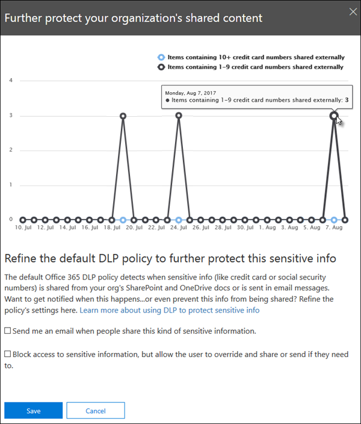

# 開始使用預設的 DLP 原則Get started with the default DLP policy

在您甚至建立第一個資料遺失防護 (DLP) 原則之前，DLP 都有助您使用預設原則來保護您的敏感資訊。Before you even create your first data loss prevention (DLP) policy, DLP is helping to protect your sensitive information with a default policy. 此預設原則及其建議 (如下所示) 協助您在組織外的人員共用包含信用卡號碼的電子郵件或檔時通知您，以保障機密內容的安全。This default policy and its recommendation (shown below) help keep your sensitive content secure by notifying you when email or documents containing a credit card number were shared with someone outside your organization. 您會在安全性與合規性中心 **的首頁上** 看到此建議 &amp; 。You'll see this recommendation on the **Home** page of the Security &amp; Compliance Center. 
  
您可以使用此小工具快速查看共用的敏感資訊的時間和程度，然後只需按一下一次或兩次，以精煉預設 DLP 原則。You can use this widget to quickly view when and how much sensitive information was shared, and then refine the default DLP policy in just a click or two. 您也可以隨時編輯預設 DLP 原則，因為它完全可自訂。You can also edit the default DLP policy at any time because it's fully customizable. 請注意，如果您第一次沒有看到建議，請嘗試按一下 [**建議**] 區段底部的 [**其他**]。Note that if you don't see the recommendation at first, try clicking **+More** at the bottom of the **Recommended for you** section. 
  

  
## 查看報告並調整預設 DLP 原則View the report and refine the default DLP policy

當小工具顯示使用者與組織外部人員共用機密資訊時，請選擇底部的 [ **優化 DLP 原則** ]。When the widget shows you that users have shared sensitive information with people outside your organization, choose **Refine DLP policy** at the bottom. 
  
詳細報告會向您顯示過去30天內，包含信用卡號碼共用的內容數量和數目。The detailed report shows you when and how much content containing credit card numbers was shared in the past 30 days. 請注意，規則相符可能需要長達48小時才能顯示在構件中。Note that rule matches can take up to 48 hours to show up in the widget.
  
為了協助保護機密資訊，預設 DLP 原則為：To help protect the sensitive information, the default DLP policy:
  
- 在包含至少一張信用卡號碼的 Exchange、SharePoint 和 OneDrive 中，偵測到組織外部人員共用的內容。Detects when content in Exchange, SharePoint, and OneDrive that contains at least one credit card number is shared with people outside your organization.
    
- 顯示原則提示，當使用者嘗試與組織外部的人員共用此機密資訊時，將電子郵件通知傳送給他們。Shows a policy tip and sends an email notification to users when they attempt to share this sensitive information with people outside your organization. 如需這些選項的詳細資訊，請參閱 [傳送電子郵件通知及顯示 DLP 原則的原則秘訣](use-notifications-and-policy-tips.md)。For more information on these options, see [Send email notifications and show policy tips for DLP policies](use-notifications-and-policy-tips.md).
    
- 產生詳細的活動報告，使您可以追蹤與組織外部的人員共用內容的人員，以及他們的情況。Generates detailed activity reports so that you can track things like who shared the content with people outside your organization and when they did it. 您可以使用 [DLP 報告](view-the-dlp-reports.md)和 [審核記錄資料](search-the-audit-log-in-security-and-compliance.md) (其中的 **活動**  =  **DLP**) 來查看此資訊。You can use the [DLP reports](view-the-dlp-reports.md) and [audit log data](search-the-audit-log-in-security-and-compliance.md) (where **Activity** = **DLP**) to see this information.
    
若要快速提煉預設 DLP 原則，您可以選擇讓它具有下列專案：To quickly refine the default DLP policy, you can choose to have it:
  
- 當使用者與組織外部的人員共用此機密資訊時，向您傳送附隨報告電子郵件。Send you an incident report email when users share this sensitive information with people outside your organization.
    
- 將其他使用者新增至電子郵件附隨報告。Add other users to the email incident report.
    
- 封鎖存取包含機密資訊的內容，但是允許使用者在需要時覆寫和共用或傳送。Block access to the content containing the sensitive information, but allow the user to override and share or send if they need to.
    
如需有關附隨報告或限制存取的詳細資訊，請參閱 [資料遺失防護參考](data-loss-prevention-policies.md)。For more information on incident reports or restricting access, see [Data loss prevention reference](data-loss-prevention-policies.md).
  
如果您想要稍後變更這些選項，您可以隨時編輯預設 DLP 原則，請參閱下一節。If you want to change these options later, you can edit the default DLP policy at any time - see the next section.
  

  
## 編輯預設 DLP 原則Edit the default DLP policy

這個原則命名為「**預設 DLP 原則**」，而且會出現在安全性與規範中心的 [**原則**] 頁面的 [**資料遺失防護**] 底下 &amp; 。This policy is named **Default DLP policy** and appears under **Data loss prevention** on the **Policy** page of the Security &amp; Compliance Center. 
  
這個原則可以完全自訂，與您從頭建立的任何 DLP 原則相同。This policy is fully customizable, the same as any DLP policy that you create yourself from scratch. 您也可以關閉或刪除原則，如此一來，您的使用者就不會再收到原則提示或電子郵件通知。You can also turn off or delete the policy, so that your users no longer receive policy tips or email notifications.
  

  
## 構件的功能及未出現時When the widget does and does not appear

在安全性與合規性中心 **首頁的 [** **建議**] 區段中，會顯示名為「**進一步保護共用內容**」的小工具 &amp; 。The widget named **Further protect shared content** appears in the **Recommended for you** section of the **Home** page of the Security &amp; Compliance Center. 
  
只有在下列情況時才會顯示此小工具：This widget appears only when:
  
- 在安全性與 &amp; 合規性中心或 Exchange 系統管理中心中，沒有資料遺失防護原則。There are no data loss prevention policies in the Security &amp; Compliance Center or Exchange admin center. 此小工具的目的是協助您開始使用 DLP，所以如果您已有 DLP 原則，就不會顯示。This widget is intended to help you get started with DLP, so it doesn't appear if you already have DLP policies.
    
- 在過去30天內，包含至少一張信用卡的內容已與組織外部的人員共用。Content containing least one credit card has been shared with someone outside your organization in the past 30 days.
    
請注意，可供小工具使用的規則比對可長達48個小時，所以在偵測到外部共用的敏感資訊之後，可能需要長達兩天的時間，建議才會顯示。Note that rule matches can take up to 48 hours to be available to the widget, so after sensitive information shared externally is detected, it may take up to two days for the recommendation to appear.
  
最後，在您使用小工具來提煉預設的 DLP 原則之後，該構件會從 **首頁** 消失。Finally, after you use the widget to refine the default DLP policy, the widget disappears from the **Home** page. 
  

