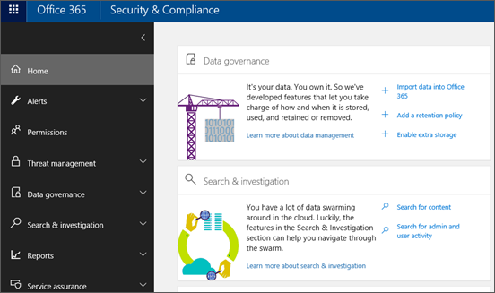

# 前往安全性與合規性中心

在您可以使用安全性 & 規範中心之前，您必須具備正確的許可權。 您的工作或學校帳戶必須被指派全域系統管理員角色，或已被全域管理員指派給一或多個安全性 & 合規性中心角色群組：
  
- 如需全域系統管理員角色的詳細資訊，請參閱[關於 Microsoft 365 系統管理員角色](https://support.office.com/article/da585eea-f576-4f55-a1e0-87090b6aaa9d)。 

- 如需將安全性 & 規範中心角色指派給其他使用者的詳細資訊，請參閱[授與使用者存取安全性 & 規範中心](../security/office-365-security/grant-access-to-the-security-and-compliance-center.md)。

> [!NOTE]
> 委派存取許可權（結合）具有「管理者代表」（AOBO）許可權的合作夥伴無法存取安全性 & 規範中心。

以下是取得安全性 & 規範中心最直接的方式：
  
1. 請移至 [https://protection.office.com](https://protection.office.com)。

2. 使用您的公司或學校帳戶登入。

