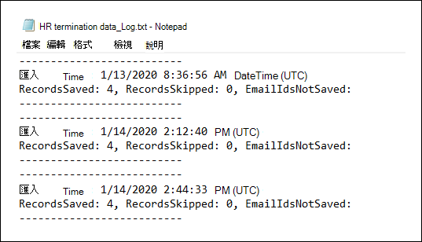

# <a name="set-up-a-connector-to-import-hr-data-in-us-government"></a>設定連接器以匯入美國政府的 HR 資料

您可以設定 Microsoft 365 規範中心內的資料連線器，將人力資源) 資料 (人力資源匯入美國政府組織。 HR 相關的資料包括員工提交其辭職的日期和員工最後一天的日期。 這種 HR 資料可供 Microsoft 資訊保護解決方案（如「 [內幕風險管理」解決方案](insider-risk-management.md)）使用，以協助保護您的組織免受惡意活動或組織內的資料竊取。 設定 HR 連接器是指在 Azure Active Directory 中建立應用程式，以供連接器進行驗證，建立包含 HR 資料的 CSV 對應檔案，在規範中心建立一個資料連線器，然後在排程的) 基礎上執行腳本 (，以 ingests CSV 檔案中的 HR 資料至 Microsoft 雲端。 然後，「內部使用者風險管理」工具使用資料連線器，來存取已匯入 Microsoft 365 美國政府組織的 HR 資料。

## <a name="before-you-begin"></a>在您開始之前

- 您的組織必須同意允許 Office 365 匯入服務存取您組織中的資料。 若要同意此要求，請移至 [此頁面](https://login.microsoftonline.com/common/oauth2/authorize?client_id=570d0bec-d001-4c4e-985e-3ab17fdc3073&response_type=code&redirect_uri=https://portal.azure.com/&nonce=1234&prompt=admin_consent)，使用 Microsoft 365 全域管理員的認證登入，然後接受要求。 您必須完成此步驟，才可在步驟3中成功建立 HR 連接器。

- 在步驟3中建立 HR 連接器的使用者，必須在 Exchange Online 中指派「信箱匯入匯出」角色。 依預設，此角色不會指派給 Exchange Online 內的任何角色群組。 您可以將信箱匯入匯出角色新增至 Exchange Online 中的「組織管理」角色群組。 或者，您可以建立新的角色群組、指派信箱匯入匯出角色，然後將適當的使用者新增為成員。 如需詳細資訊，請參閱「管理 Exchange Online 中的角色群組」一文中的 [ [建立角色群組](https://docs.microsoft.com/Exchange/permissions-exo/role-groups#create-role-groups) 或 [修改角色群組](https://docs.microsoft.com/Exchange/permissions-exo/role-groups#modify-role-groups) ] 區段。

- 您必須決定如何定期從組織的人力資源系統 (中取得或匯出資料，) 並將其新增至步驟2所述的 CSV 檔案。 您在步驟4中執行的腳本會將 CSV 檔案中的 HR 資料上傳至 Microsoft 雲端。

- 您在步驟4中執行的範例腳本會將 HR 資料上傳至 Microsoft 雲端，以供其他 Microsoft 工具使用，例如有問必答風險管理解決方案。 在任何 Microsoft standard support 計畫或服務下，都不支援此範例腳本。 範例腳本是以不含任何類型擔保的方式提供。 Microsoft 另外不承擔任何明示或默示的擔保，包括但不限於適售性或適合某特定用途的默示擔保。 因使用或效能範例腳本及檔的整體風險，仍然保留給您。 Microsoft、其作者以及其他與建置、生產或交付程式碼相關的任何人在任何情況下皆完全不需對任何損失負責任，包括但不限於商業利潤損失、業務中斷、業務資訊損失、或其他錢財損失等因使用或無法使用範例指令碼或文件所發生的損失，即使 Microsoft 曾建議這些損失發生的可能性。

## <a name="step-1-create-an-app-in-azure-active-directory"></a>步驟1：在 Azure Active Directory 中建立應用程式

第一步是在 Azure Active Directory (Azure AD) 中建立及註冊新的應用程式。 應用程式會對應至您在步驟3中建立的 HR 連接器。 建立此應用程式後，Azure AD 會在執行時驗證 HR connector，並嘗試存取您的組織。 此應用程式也會用來驗證您在步驟4中執行的腳本，將 HR 資料上傳至 Microsoft 雲端。 在建立此 Azure AD 應用程式期間，請務必儲存下列資訊。 這些值將會在後續步驟中使用。

- Azure AD 應用程式識別碼 (也稱為「 *應用程式識別碼* 」或「 *用戶端識別碼* 」) 

- Azure AD 應用程式機密 (也稱為 *用戶端密碼* ) 

- 租使用者識別碼 (也稱為 *目錄識別碼* ) 

如需在 Azure AD 中建立應用程式的逐步指示，請參閱 [使用 Microsoft identity Platform 註冊應用程式](https://docs.microsoft.com/azure/active-directory/develop/quickstart-register-app)。

## <a name="step-2-prepare-a-csv-file-with-your-hr-data"></a>步驟2：使用 HR 資料準備 CSV 檔案

下一步是建立 CSV 檔案，其中包含已離開組織之員工的相關資訊。 如「開始之前」一節所述，您必須決定如何從組織的 HR 系統產生此 CSV 檔案。 下列範例會顯示在記事區) 中開啟的 (的 CSV 檔案，該檔案包含 (欄) 的三個必要參數。 在 Microsoft Excel 中編輯 CSV 檔案的工作相當簡單。

```text
EmailAddress,TerminationDate,LastWorkingDate
sarad@contoso.com,2019-04-23T15:18:02.4675041+05:30,2019-04-29T15:18:02.4675041+05:30
pilarp@contoso.com,2019-04-24T09:15:49Z,2019-04-29T15:18:02.7117540
```

CSV 檔案的第一列（或標題列）會列出必要的資料行名稱。 每個資料列標題中所用的名稱是由您 (上述範例中的建議) 。 不過，當您在步驟3中建立 HR 連接器時， *必須* 指定您在 CSV 檔案中使用的相同資料列名稱。 請勿在欄名稱中包含空格。

下表說明 CSV 檔案中的每一欄：

| 欄名稱 | 描述 |
|:-----|:-----|
| **EmailAddress** <br/> |指定離職員工的電子郵件地址。|
| **TerminationDate** <br/> |會指定人員正式終止組織中的雇用日期。 例如，這可能是員工在離開組織時所提供通知的日期。 此日期可能不同于人員的最後一天的工作日期。 請使用下列日期格式： `yyyy-mm-ddThh:mm:ss.nnnnnn+|-hh:mm` ，也就是 [ISO 8601 的日期和時間格式](https://www.iso.org/iso-8601-date-and-time-format.html)。|
|**LastWorkingDate**|為終止的員工指定最後一天的工作。 請使用下列日期格式： `yyyy-mm-ddThh:mm:ss.nnnnnn+|-hh:mm` ，也就是 [ISO 8601 的日期和時間格式](https://www.iso.org/iso-8601-date-and-time-format.html)。|
|||

在您建立含有必要 HR 資料的 CSV 檔案之後，請將它儲存在您在步驟4中執行的腳本所在的相同系統上。 請務必執行更新策略，使 CSV 檔案永遠包含最新資訊。 這樣做可確保不論您執行腳本，最新的員工終止資料都會上傳至 Microsoft 雲端。

## <a name="step-3-create-the-hr-connector"></a>步驟3：建立 HR 連接器

下一步是在 Microsoft 365 規範中心內建立 HR 連接器。 在步驟4中執行腳本後，您建立的 HR 連接器會將 HR 資料從 CSV 檔案中攝取至您的 Microsoft 365 組織。 在此步驟中，請務必複製當您建立連接器時所產生的工作識別碼。 當您執行腳本時，您會使用工作識別碼。

1. 移至 [https://compliance.microsoft.com](https://compliance.microsoft.com) ，然後按一下左側導覽中的 [ **資料連線器** ]。

2. 在 [ **HR** ] 底下的 [ **資料連線器** ] 頁面上，按一下 [ **View** ]。

3. 在 [ **HR** ] 頁面上，按一下 [ **新增連接器** ]。

4. 在 [ **驗證認證** ] 頁面上，執行下列動作，然後按 **[下一步]** ：

   1. 針對您在步驟1中建立的 Azure 應用程式，輸入或貼上 Azure AD 應用程式識別碼。

   1. 輸入 HR 連接器的名稱。

5. 在 [檔案 **對應** ] 頁面上，輸入三個欄標頭的名稱 (也稱為 *參數* ) 從您在步驟2中在每個適當方塊中所建立的 CSV 檔案中。 名稱不區分大小寫。 如先前所述，您在這些方塊中輸入的名稱必須符合 CSV 檔案中的參數名稱。 例如，下列螢幕擷取畫面顯示在步驟2所示範例 CSV 檔案範例中的參數名稱。

   

6. 在 [ **複查** ] 頁面上，複查您的設定，然後按一下 **[完成]** 以建立連接器。

   隨即會顯示 [狀態] 頁面，確認已建立連接器。 此頁面包含兩個重要事項，您必須完成下一個步驟，才可執行範例腳本以上傳 HR 資料。

   

   1. **工作識別碼。** 在下一個步驟中，您將需要此工作識別碼來執行腳本。 您可以從這個頁面或從 [連接器飛出] 頁面複製此頁面。
   
   1. **範例腳本的連結。** 按一下 [ **這裡** ] 連結，移至 GitHub 網站以存取範例腳本 (連結會開啟新的視窗) 。 將此視窗保持開啟，以便您可以在步驟4中複製腳本。 或者，您也可以將目的地做成書簽或複製 URL，以便您可以在步驟4中再次進行存取。 您也可以在 [連接器] 飛入頁面上使用此連結。

7. 按一下 [完成 **]** 。

   新的連接器會顯示在 [ **連接器** ] 索引標籤上的清單中。 

8. 按一下剛才建立的 HR connector，以顯示飛出頁面，該頁面包含有關連接器的屬性及其他資訊。

   

   若尚未這麼做，您可以複製 **Azure 應用程式識別碼** 和 **連接器工作識別碼** 的值。 您必須在下一個步驟中執行腳本。 您也可以從飛入頁面下載腳本， (或在下一個步驟中使用連結加以下載。 ) 

   您也可以按一下 [ **編輯** ]，以變更 Azure 應用程式識別碼或您在 [檔案 **對應** ] 頁面上定義的欄標頭名稱。

## <a name="step-4-run-the-sample-script-to-upload-your-hr-data"></a>步驟4：執行範例腳本以上傳 HR 資料

設定 HR 連接器的最後一個步驟是執行一個範例腳本，將您在步驟2中建立的 CSV 檔案 (中所建立的 HR 資料上傳) 至 Microsoft 雲端。 具體說來，腳本會將資料上傳到 HR 連接器。 在您執行腳本後，您在步驟3中建立的 HR 連接器會將 HR 資料匯入至您的 Microsoft 365 組織，以供其他規範工具（例如有問必答風險管理解決方案）進行存取。 在您執行腳本後，請考慮排程任務每天定期執行它，使最新的員工終止資料上傳至 Microsoft 雲端。 請參閱 [排程腳本自動執行](#optional-step-6-schedule-the-script-to-run-automatically)。

1. 移至您在上一個步驟中從左開啟的視窗，以利用範例腳本存取 GitHub 網站。 或者，您也可以開啟書簽網站或使用您複製的 URL。

2. 按一下 [ **原始** ] 按鈕，以在文字視圖中顯示腳本。

3. 複製範例腳本中的所有行，然後將其儲存至文字檔。

4. 如有需要，修改組織的範例腳本。

5. 使用檔案名尾碼，將文字檔儲存為 Windows PowerShell script file `.ps1` ; 例如， `HRConnector.ps1` 。

6. 在您的本機電腦上開啟命令提示字元，然後移至您用來儲存腳本的目錄。

7. 執行下列命令，將 CSV 檔案中的 HR 資料上傳至 Microsoft 雲端;例如：

    ```powershell
    .\HRConnector.ps1 -tenantId <tenantId> -appId <appId>  -appSecret <appSecret>  -jobId <jobId>  -csvFilePath '<csvFilePath>'
    ```

   下表說明與此腳本搭配使用的參數及其必要的值。 您在上述步驟中取得的資訊會用於這些參數的值。

   | 參數 | 描述 |
   |:-----|:-----|:-----|
   |`tenantId`|您在步驟1中取得之 Microsoft 365 組織的識別碼。 您也可以在 Azure AD 系統管理中心的 [ **一覽** ] 邊欄中取得組織的承租人識別碼。 這是用來識別您的組織。|
   |`appId` |您在步驟1中您于 Azure AD 中所建立之應用程式的 Azure AD 應用程式識別碼。 當腳本嘗試存取您的 Microsoft 365 組織時，Azure AD 可用於驗證。 |
   |`appSecret`|您在步驟1中您于 Azure AD 中所建立之應用程式的 Azure AD 應用程式密碼。 這也是用來進行驗證。|
   |`jobId`|您在步驟3中建立之 HR 連接器的工作識別碼。 這是用來將上傳至 Microsoft 雲端的 HR 資料與 HR connector 產生關聯。|
   |`csvFilePath`|CSV 檔案 (的檔案路徑與您在步驟2中建立的腳本) 儲存在相同的系統上。 請嘗試避免檔路徑中的空格;否則請使用單引號。|
   |||
   
   以下是 HR 連接器腳本語法的範例，其中每個參數都使用實際值：

   ```powershell
    .\HRConnector.ps1 -tenantId d5723623-11cf-4e2e-b5a5-01d1506273g9 -appId 29ee526e-f9a7-4e98-a682-67f41bfd643e -appSecret MNubVGbcQDkGCnn -jobId b8be4a7d-e338-43eb-a69e-c513cd458eba -csvFilePath 'C:\Users\contosoadmin\Desktop\Data\employee_termination_data.csv'
    ```

   上載成功時，腳本會顯示 **上傳成功** 郵件。

   > [!NOTE]
   > 如果執行原則時發生問題，請參閱 [關於執行](https://docs.microsoft.com/powershell/module/microsoft.powershell.core/about/about_execution_policies) 原則及 [Set-ExecutionPolicy](https://docs.microsoft.com/powershell/module/microsoft.powershell.security/set-executionpolicy) ，以取得設定執行原則的指導方針。

## <a name="step-5-monitor-the-hr-connector"></a>步驟5：監視 HR 連接器

在您建立 HR 連接器並執行腳本以上傳 HR 資料之後，您可以在 Microsoft 365 規範中心中查看連接器和上傳狀態。 如果您安排定期定期執行腳本，您也可以在上次腳本執行後，查看目前的狀態。

1. 移至 [https://compliance.microsoft.com](https://compliance.microsoft.com) 並按一下左側導覽中的 [ **資料連線器** ]。

2. 按一下 [ **連接器** ] 索引標籤，然後選取 [HR connector] 以顯示飛出頁面。 此頁面包含連接器的屬性和資訊。

   

3. 在 [ **進行** 中] 下，按一下 [ **下載記錄** ] 連結，以開啟連接器的狀態記錄 (或儲存) 。 此記錄檔包含每次腳本執行的相關資訊，並將該資料從 CSV 檔案上傳至 Microsoft 雲端。 

   

   此 `RecordsSaved` 欄位會指出上傳的 CSV 檔案中的列數。 例如，如果 CSV 檔案包含四列，則欄位的值 `RecordsSaved` 為4，如果腳本成功上傳 CSV 檔案中的所有列。

如果您未在步驟4中執行腳本，則 [ **最後一次匯入** ] 底下會顯示下載腳本的連結。 您可以下載腳本，然後依照步驟4中的步驟執行它。

## <a name="optional-step-6-schedule-the-script-to-run-automatically"></a> (選用) 步驟6：排程腳本自動執行

為了確保您的組織中的最新 HR 資料可用於像是「內部使用者風險管理」解決方案之類的工具，我們建議您排程腳本，使其定期定期執行，例如一天一次。 這也需要在類似的 (上更新 CSV 檔案中的 HR 資料（如果不相同）) 排程，使其包含離開組織之員工的最新資訊。 目標是上傳最新的 HR 資料，使 HR 連接器可供「內幕人員風險管理」解決方案使用。

您可以在 Windows 中的 [任務排程器] 應用程式每天自動執行腳本。

1. 在您的本機電腦上，按一下 [Windows **開始** ] 按鈕，然後輸入 [ **任務計畫程式** ]。

2. 按一下 [工作排程器] **應用程式以** 開啟它。

3. 在 [ **動作** ] 區段中，按一下 [ **建立任務** ]。

4. 在 [ **一般** ] 索引標籤上，輸入計畫任務的描述性名稱;例如， **HR Connector Script** 。 您也可以新增選用的描述。

5. 在 [ **安全性選項** ] 底下，執行下列動作：

   1. 決定只有當您登入電腦或登入時執行腳本，才可執行腳本。
   
   1. 請確定已選取 [以 **最高特權執行** ] 核取方塊。

6. 選取 [ **觸發器** ] 索引標籤，按一下 [ **新增** ]，然後執行下列動作：

   1. 在 [ **設定** ] 底下，選取 [ **每日** ] 選項，然後選擇第一次執行腳本的日期和時間。 腳本每天會在相同的指定時間。
   
   1. 在 [ **高級設定** ] 下，確定已選取 [ **啟用** ] 核取方塊。
   
   1. 按一下 **[確定]** 。

7. 選取 [ **動作** ] 索引標籤，按一下 [ **新增** ]，然後執行下列動作：

   

   1. 在 [ **動作** ] 下拉式清單中，確定已選取 [ **啟動程式** ]。

   1. 在 [ **程式/腳本** ] 方塊中，按一下 **[流覽]** ，然後移至下列位置，並選取該位置，以便在方塊中顯示路徑： `C:\Windows\System32\WindowsPowerShell\v1.0\powershell.exe` 。

   1. 在 [ **新增引數 (選用)** ] 方塊中，貼上您在步驟4中執行的相同指令碼命令。 例如， `.\HRConnector.ps1 -tenantId "d5723623-11cf-4e2e-b5a5-01d1506273g9" -appId "c12823b7-b55a-4989-faba-02de41bb97c3" -appSecret "MNubVGbcQDkGCnn"  -jobId "e081f4f4-3831-48d6-7bb3-fcfab1581458" -csvFilePath "C:\Users\contosoadmin\Desktop\Data\employee_termination_data.csv"`

   1. 在 [ **開始 (選用)** ] 方塊中，貼上您在步驟4中執行之腳本的資料夾位置。 例如，`C:\Users\contosoadmin\Desktop\Scripts`。

   1. 按一下 **[確定]** 儲存新動作的設定。

8. 在 [ **建立** 工作] 視窗中，按一下 **[確定** ] 以儲存排程的任務。 您可能會收到提示，請輸入您的使用者帳號憑證。

   新任務會顯示在任務排程器文件庫中。

   

   最後一次執行腳本及下次排程執行的時間隨即顯示。 您可以按兩下任務進行編輯。

   您也可以在規範中心的對應 HR 連接器的浮出頁面上，確認腳本上次執行的時間。
