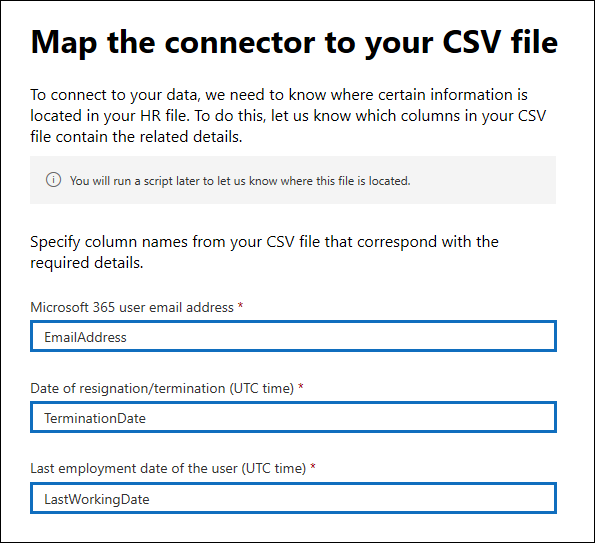

# <a name="set-up-a-connector-to-import-hr-data-in-us-government-preview"></a><span data-ttu-id="a1943-104">設定連接器以匯入美國政府 (預覽中的人力資源資料) </span><span class="sxs-lookup"><span data-stu-id="a1943-104">Set up a connector to import HR data in US Government (preview)</span></span>

<span data-ttu-id="a1943-105">您可以設定 Microsoft 365 規範中心內的資料連線器，將人力資源) 資料 (人力資源匯入美國政府組織。</span><span class="sxs-lookup"><span data-stu-id="a1943-105">You can set up a data connector in the Microsoft 365 compliance center to import human resources (HR) data to your US Government organization.</span></span> <span data-ttu-id="a1943-106">HR 相關的資料包括員工提交其辭職的日期和員工最後一天的日期。</span><span class="sxs-lookup"><span data-stu-id="a1943-106">HR-related data includes the date an employee submitted their resignation and date of the employee's last day.</span></span> <span data-ttu-id="a1943-107">這種 HR 資料可供 Microsoft 資訊保護解決方案（如「 [內幕風險管理」解決方案](insider-risk-management.md)）使用，以協助保護您的組織免受惡意活動或組織內的資料竊取。</span><span class="sxs-lookup"><span data-stu-id="a1943-107">This HR data can then be used by Microsoft information protection solutions, such as the [insider risk management solution](insider-risk-management.md), to help protect your organization from malicious activity or data theft inside your organization.</span></span> <span data-ttu-id="a1943-108">設定 HR 連接器是指在 Azure Active Directory 中建立應用程式，以供連接器進行驗證，建立包含 HR 資料的 CSV 對應檔案，在規範中心建立一個資料連線器，然後在排程的) 基礎上執行腳本 (，以 ingests CSV 檔案中的 HR 資料至 Microsoft 雲端。</span><span class="sxs-lookup"><span data-stu-id="a1943-108">Setting up an HR connector consists of creating an app in Azure Active Directory that's used for authentication by connector, creating a CSV mapping files that contains your HR data, creating a data connector in the compliance center, and then running a script (on a scheduled basis) that ingests the HR data in the CSV file to the Microsoft cloud.</span></span> <span data-ttu-id="a1943-109">然後，「內部使用者風險管理」工具使用資料連線器，來存取已匯入 Microsoft 365 美國政府組織的 HR 資料。</span><span class="sxs-lookup"><span data-stu-id="a1943-109">Then the data connector is used by the insider risk management tool to access the HR data that was imported to your Microsoft 365 US Government organization.</span></span>

## <a name="before-you-begin"></a><span data-ttu-id="a1943-110">在您開始之前</span><span class="sxs-lookup"><span data-stu-id="a1943-110">Before you begin</span></span>

- <span data-ttu-id="a1943-111">您的組織必須同意允許 Office 365 匯入服務存取您組織中的資料。</span><span class="sxs-lookup"><span data-stu-id="a1943-111">Your organization must consent to allow the Office 365 Import service to access data in your organization.</span></span> <span data-ttu-id="a1943-112">若要同意此要求，請移至 [此頁面](https://login.microsoftonline.com/common/oauth2/authorize?client_id=570d0bec-d001-4c4e-985e-3ab17fdc3073&response_type=code&redirect_uri=https://portal.azure.com/&nonce=1234&prompt=admin_consent)，使用 Microsoft 365 全域管理員的認證登入，然後接受要求。</span><span class="sxs-lookup"><span data-stu-id="a1943-112">To consent to this request, go to [this page](https://login.microsoftonline.com/common/oauth2/authorize?client_id=570d0bec-d001-4c4e-985e-3ab17fdc3073&response_type=code&redirect_uri=https://portal.azure.com/&nonce=1234&prompt=admin_consent), sign in with the credentials of a Microsoft 365 global admin, and then accept the request.</span></span> <span data-ttu-id="a1943-113">您必須完成此步驟，才可在步驟3中成功建立 HR 連接器。</span><span class="sxs-lookup"><span data-stu-id="a1943-113">You have to complete this step before you can successfully create the HR connector in Step 3.</span></span>

- <span data-ttu-id="a1943-114">在步驟3中建立 HR 連接器的使用者，必須在 Exchange Online 中指派「信箱匯入匯出」角色。</span><span class="sxs-lookup"><span data-stu-id="a1943-114">The user who creates the HR connector in Step 3 must be assigned the Mailbox Import Export role in Exchange Online.</span></span> <span data-ttu-id="a1943-115">依預設，此角色不會指派給 Exchange Online 內的任何角色群組。</span><span class="sxs-lookup"><span data-stu-id="a1943-115">By default, this role isn't assigned to any role group in Exchange Online.</span></span> <span data-ttu-id="a1943-116">您可以將信箱匯入匯出角色新增至 Exchange Online 中的「組織管理」角色群組。</span><span class="sxs-lookup"><span data-stu-id="a1943-116">You can add the Mailbox Import Export role to the Organization Management role group in Exchange Online.</span></span> <span data-ttu-id="a1943-117">或者，您可以建立新的角色群組、指派信箱匯入匯出角色，然後將適當的使用者新增為成員。</span><span class="sxs-lookup"><span data-stu-id="a1943-117">Or you can create a new role group, assign the Mailbox Import Export role, and then add the appropriate users as members.</span></span> <span data-ttu-id="a1943-118">如需詳細資訊，請參閱「管理 Exchange Online 中的角色群組」一文中的 [ [建立角色群組](https://docs.microsoft.com/Exchange/permissions-exo/role-groups#create-role-groups) 或 [修改角色群組](https://docs.microsoft.com/Exchange/permissions-exo/role-groups#modify-role-groups) ] 區段。</span><span class="sxs-lookup"><span data-stu-id="a1943-118">For more information, see the [Create role groups](https://docs.microsoft.com/Exchange/permissions-exo/role-groups#create-role-groups) or [Modify role groups](https://docs.microsoft.com/Exchange/permissions-exo/role-groups#modify-role-groups) sections in the article "Manage role groups in Exchange Online".</span></span>

- <span data-ttu-id="a1943-119">您必須決定如何定期從組織的人力資源系統 (中取得或匯出資料，) 並將其新增至步驟2所述的 CSV 檔案。</span><span class="sxs-lookup"><span data-stu-id="a1943-119">You'll need to determine how to retrieve or export the data from your organization's HR system (on a regular basis) and add it to the CSV file that's described in Step 2.</span></span> <span data-ttu-id="a1943-120">您在步驟4中執行的腳本會將 CSV 檔案中的 HR 資料上傳至 Microsoft 雲端。</span><span class="sxs-lookup"><span data-stu-id="a1943-120">The script that you run in Step 4 will upload the HR data in the CSV file to the Microsoft cloud.</span></span>

- <span data-ttu-id="a1943-121">您在步驟4中執行的範例腳本會將 HR 資料上傳至 Microsoft 雲端，以供其他 Microsoft 工具使用，例如有問必答風險管理解決方案。</span><span class="sxs-lookup"><span data-stu-id="a1943-121">The sample script that you run in Step 4 will upload HR data to the Microsoft cloud so that it can be used by other Microsoft tools, such as the insider risk management solution.</span></span> <span data-ttu-id="a1943-122">在任何 Microsoft standard support 計畫或服務下，都不支援此範例腳本。</span><span class="sxs-lookup"><span data-stu-id="a1943-122">This sample script isn't supported under any Microsoft standard support program or service.</span></span> <span data-ttu-id="a1943-123">範例腳本是以不含任何類型擔保的方式提供。</span><span class="sxs-lookup"><span data-stu-id="a1943-123">The sample script is provided AS IS without warranty of any kind.</span></span> <span data-ttu-id="a1943-124">Microsoft 另外不承擔任何明示或默示的擔保，包括但不限於適售性或適合某特定用途的默示擔保。</span><span class="sxs-lookup"><span data-stu-id="a1943-124">Microsoft further disclaims all implied warranties including, without limitation, any implied warranties of merchantability or of fitness for a particular purpose.</span></span> <span data-ttu-id="a1943-125">因使用或效能範例腳本及檔的整體風險，仍然保留給您。</span><span class="sxs-lookup"><span data-stu-id="a1943-125">The entire risk arising out of the use or performance of the sample script and documentation remains with you.</span></span> <span data-ttu-id="a1943-126">Microsoft、其作者以及其他與建置、生產或交付程式碼相關的任何人在任何情況下皆完全不需對任何損失負責任，包括但不限於商業利潤損失、業務中斷、業務資訊損失、或其他錢財損失等因使用或無法使用範例指令碼或文件所發生的損失，即使 Microsoft 曾建議這些損失發生的可能性。</span><span class="sxs-lookup"><span data-stu-id="a1943-126">In no event shall Microsoft, its authors, or anyone else involved in the creation, production, or delivery of the scripts be liable for any damages whatsoever (including, without limitation, damages for loss of business profits, business interruption, loss of business information, or other pecuniary loss) arising out of the use of or inability to use the sample scripts or documentation, even if Microsoft has been advised of the possibility of such damages.</span></span>

## <a name="step-1-create-an-app-in-azure-active-directory"></a><span data-ttu-id="a1943-127">步驟1：在 Azure Active Directory 中建立應用程式</span><span class="sxs-lookup"><span data-stu-id="a1943-127">Step 1: Create an app in Azure Active Directory</span></span>

<span data-ttu-id="a1943-128">第一步是在 Azure Active Directory (Azure AD) 中建立及註冊新的應用程式。</span><span class="sxs-lookup"><span data-stu-id="a1943-128">The first step is to create and register a new app in Azure Active Directory (Azure AD).</span></span> <span data-ttu-id="a1943-129">應用程式會對應至您在步驟3中建立的 HR 連接器。</span><span class="sxs-lookup"><span data-stu-id="a1943-129">The app will correspond to the HR connector that you create in Step 3.</span></span> <span data-ttu-id="a1943-130">建立此應用程式後，Azure AD 會在執行時驗證 HR connector，並嘗試存取您的組織。</span><span class="sxs-lookup"><span data-stu-id="a1943-130">Creating this app will allow Azure AD to authenticate the HR connector when it runs and attempts to access your organization.</span></span> <span data-ttu-id="a1943-131">此應用程式也會用來驗證您在步驟4中執行的腳本，將 HR 資料上傳至 Microsoft 雲端。</span><span class="sxs-lookup"><span data-stu-id="a1943-131">This app will also be used to authenticate the script that you run in Step 4 to upload your HR data to the Microsoft cloud.</span></span> <span data-ttu-id="a1943-132">在建立此 Azure AD 應用程式期間，請務必儲存下列資訊。</span><span class="sxs-lookup"><span data-stu-id="a1943-132">During the creation of this Azure AD app, be sure to save the following information.</span></span> <span data-ttu-id="a1943-133">這些值將會在後續步驟中使用。</span><span class="sxs-lookup"><span data-stu-id="a1943-133">These values will be used in later steps.</span></span>

- <span data-ttu-id="a1943-134">Azure AD 應用程式識別碼 (也稱為「 *應用程式識別碼* 」或「 *用戶端識別碼* 」) </span><span class="sxs-lookup"><span data-stu-id="a1943-134">Azure AD application ID (also called the *app Id* or *client Id*)</span></span>

- <span data-ttu-id="a1943-135">Azure AD 應用程式機密 (也稱為 *用戶端密碼*) </span><span class="sxs-lookup"><span data-stu-id="a1943-135">Azure AD application secret (also called the *client secret*)</span></span>

- <span data-ttu-id="a1943-136">租使用者識別碼 (也稱為 *目錄識別碼*) </span><span class="sxs-lookup"><span data-stu-id="a1943-136">Tenant Id (also called the *directory Id*)</span></span>

<span data-ttu-id="a1943-137">如需在 Azure AD 中建立應用程式的逐步指示，請參閱 [使用 Microsoft identity Platform 註冊應用程式](https://docs.microsoft.com/azure/active-directory/develop/quickstart-register-app)。</span><span class="sxs-lookup"><span data-stu-id="a1943-137">For step-by-step instructions for creating an app in Azure AD, see [Register an application with the Microsoft identity platform](https://docs.microsoft.com/azure/active-directory/develop/quickstart-register-app).</span></span>

## <a name="step-2-prepare-a-csv-file-with-your-hr-data"></a><span data-ttu-id="a1943-138">步驟2：使用 HR 資料準備 CSV 檔案</span><span class="sxs-lookup"><span data-stu-id="a1943-138">Step 2: Prepare a CSV file with your HR data</span></span>

<span data-ttu-id="a1943-139">下一步是建立 CSV 檔案，其中包含已離開組織之員工的相關資訊。</span><span class="sxs-lookup"><span data-stu-id="a1943-139">The next step is to create a CSV file that contains information about employees who have left your organization.</span></span> <span data-ttu-id="a1943-140">如「開始之前」一節所述，您必須決定如何從組織的 HR 系統產生此 CSV 檔案。</span><span class="sxs-lookup"><span data-stu-id="a1943-140">As explained in the Before You Begin section, you'll need to determine how to generate this CSV file from your organization's HR system.</span></span> <span data-ttu-id="a1943-141">下列範例會顯示在記事區) 中開啟的 (的 CSV 檔案，該檔案包含 (欄) 的三個必要參數。</span><span class="sxs-lookup"><span data-stu-id="a1943-141">The following example shows a completed CSV file (opened in Note Pad) that contains the three required parameters (columns).</span></span> <span data-ttu-id="a1943-142">在 Microsoft Excel 中編輯 CSV 檔案的工作相當簡單。</span><span class="sxs-lookup"><span data-stu-id="a1943-142">It's much easier to edit the CSV file in Microsoft Excel.</span></span>

```text
EmailAddress,TerminationDate,LastWorkingDate
sarad@contoso.com,2019-04-23T15:18:02.4675041+05:30,2019-04-29T15:18:02.4675041+05:30
pilarp@contoso.com,2019-04-24T09:15:49Z,2019-04-29T15:18:02.7117540
```

<span data-ttu-id="a1943-143">CSV 檔案的第一列（或標題列）會列出必要的資料行名稱。</span><span class="sxs-lookup"><span data-stu-id="a1943-143">The first row, or header row, of the CSV file lists the required column names.</span></span> <span data-ttu-id="a1943-144">每個資料列標題中所用的名稱是由您 (上述範例中的建議) 。</span><span class="sxs-lookup"><span data-stu-id="a1943-144">The name used in each column header is up to you (the ones in the previous example are suggestions).</span></span> <span data-ttu-id="a1943-145">不過，當您在步驟3中建立 HR 連接器時， *必須* 指定您在 CSV 檔案中使用的相同資料列名稱。</span><span class="sxs-lookup"><span data-stu-id="a1943-145">However, the same column names you use in the CSV file *must* be specified when you create the HR connector in Step 3.</span></span> <span data-ttu-id="a1943-146">請勿在欄名稱中包含空格。</span><span class="sxs-lookup"><span data-stu-id="a1943-146">Do not include spaces in the column names.</span></span>

<span data-ttu-id="a1943-147">下表說明 CSV 檔案中的每一欄：</span><span class="sxs-lookup"><span data-stu-id="a1943-147">The following table describes each column in the CSV file:</span></span>

|<span data-ttu-id="a1943-148">**資料行名稱**</span><span class="sxs-lookup"><span data-stu-id="a1943-148">**Column name**</span></span>|<span data-ttu-id="a1943-149">**描述**</span><span class="sxs-lookup"><span data-stu-id="a1943-149">**Description**</span></span>|
|:-----|:-----|
| <span data-ttu-id="a1943-150">**EmailAddress**</span><span class="sxs-lookup"><span data-stu-id="a1943-150">**EmailAddress**</span></span> <br/> |<span data-ttu-id="a1943-151">指定離職員工的電子郵件地址。</span><span class="sxs-lookup"><span data-stu-id="a1943-151">Specifies the email address of the terminated employee.</span></span>|
| <span data-ttu-id="a1943-152">**TerminationDate**</span><span class="sxs-lookup"><span data-stu-id="a1943-152">**TerminationDate**</span></span> <br/> |<span data-ttu-id="a1943-153">會指定人員正式終止組織中的雇用日期。</span><span class="sxs-lookup"><span data-stu-id="a1943-153">Specifies the date the person's employment was officially terminated in your organization.</span></span> <span data-ttu-id="a1943-154">例如，這可能是員工在離開組織時所提供通知的日期。</span><span class="sxs-lookup"><span data-stu-id="a1943-154">For example, this may be the date when the employee gave their notice about leaving your organization.</span></span> <span data-ttu-id="a1943-155">此日期可能不同于人員的最後一天的工作日期。</span><span class="sxs-lookup"><span data-stu-id="a1943-155">This date may be the different than the date of the person's last day of work.</span></span> <span data-ttu-id="a1943-156">您必須使用下列日期格式： `yyyy-mm-ddThh:mm:ss.nnnnnn+|-hh:mm` ，也就是 [ISO 8601 的日期和時間格式](https://www.iso.org/iso-8601-date-and-time-format.html)。</span><span class="sxs-lookup"><span data-stu-id="a1943-156">You must use the following date format: `yyyy-mm-ddThh:mm:ss.nnnnnn+|-hh:mm`, which is the [ISO 8601 date and time format](https://www.iso.org/iso-8601-date-and-time-format.html).</span></span>|
|<span data-ttu-id="a1943-157">**LastWorkingDate**</span><span class="sxs-lookup"><span data-stu-id="a1943-157">**LastWorkingDate**</span></span>|<span data-ttu-id="a1943-158">為終止的員工指定最後一天的工作。</span><span class="sxs-lookup"><span data-stu-id="a1943-158">Specifies the last day of work for the terminated employee.</span></span> <span data-ttu-id="a1943-159">您必須使用下列日期格式： `yyyy-mm-ddThh:mm:ss.nnnnnn+|-hh:mm` ，也就是 [ISO 8601 的日期和時間格式](https://www.iso.org/iso-8601-date-and-time-format.html)。</span><span class="sxs-lookup"><span data-stu-id="a1943-159">You must use the following date format: `yyyy-mm-ddThh:mm:ss.nnnnnn+|-hh:mm`, which is the [ISO 8601 date and time format](https://www.iso.org/iso-8601-date-and-time-format.html).</span></span>|
|||

<span data-ttu-id="a1943-160">在您建立含有必要 HR 資料的 CSV 檔案之後，請將它儲存在您在步驟4中執行的腳本所在的相同系統上。</span><span class="sxs-lookup"><span data-stu-id="a1943-160">After you create the CSV file with the required HR data, store it on the same system as the script that you run in Step 4.</span></span> <span data-ttu-id="a1943-161">您也應該執行更新策略，以確保 CSV 檔案永遠包含最新的資訊，因此，不論您執行腳本，最新的員工終止資料都會上傳至 Microsoft 雲端。</span><span class="sxs-lookup"><span data-stu-id="a1943-161">You should also implement an update strategy to make sure the CSV file always contains the most current information so that whatever you run the script, the most current employee termination data will be uploaded to the Microsoft cloud.</span></span>

## <a name="step-3-create-the-hr-connector"></a><span data-ttu-id="a1943-162">步驟3：建立 HR 連接器</span><span class="sxs-lookup"><span data-stu-id="a1943-162">Step 3: Create the HR connector</span></span>

<span data-ttu-id="a1943-163">下一步是在 Microsoft 365 規範中心內建立 HR 連接器。</span><span class="sxs-lookup"><span data-stu-id="a1943-163">The next step is to create an HR connector in the Microsoft 365 compliance center.</span></span> <span data-ttu-id="a1943-164">在步驟4中執行腳本後，您建立的 HR 連接器會將 HR 資料從 CSV 檔案中攝取至您的 Microsoft 365 組織。</span><span class="sxs-lookup"><span data-stu-id="a1943-164">After you run the script in Step 4, the HR connector that you create will ingest the HR data from the CSV file to your Microsoft 365 organization.</span></span> <span data-ttu-id="a1943-165">在此步驟中，請務必複製當您建立連接器時所產生的工作識別碼。</span><span class="sxs-lookup"><span data-stu-id="a1943-165">In this step, be sure to copy the job ID that's generated when you create the connector.</span></span> <span data-ttu-id="a1943-166">當您執行腳本時，您會使用工作識別碼。</span><span class="sxs-lookup"><span data-stu-id="a1943-166">You'll use the job ID when you run the script.</span></span>

1. <span data-ttu-id="a1943-167">移至 [https://compliance.microsoft.com](https://compliance.microsoft.com) ，然後按一下左側導覽中的 [ **資料連線器** ]。</span><span class="sxs-lookup"><span data-stu-id="a1943-167">Go to [https://compliance.microsoft.com](https://compliance.microsoft.com) and then click **Data connectors** in the left nav.</span></span>

2. <span data-ttu-id="a1943-168">在 [ \*\*資料 (預覽 \*\* ] 的 [資料連線線]) ] 頁面 **上，按一下**[ **View**]。</span><span class="sxs-lookup"><span data-stu-id="a1943-168">On the **Data connectors (preview)** page under **HR**, click **View**.</span></span>

3. <span data-ttu-id="a1943-169">在 [ **HR** ] 頁面上，按一下 [ **新增連接器**]。</span><span class="sxs-lookup"><span data-stu-id="a1943-169">On the **HR** page, click **Add connector**.</span></span>

4. <span data-ttu-id="a1943-170">在 [ **驗證認證** ] 頁面上，執行下列動作，然後按 **[下一步]**：</span><span class="sxs-lookup"><span data-stu-id="a1943-170">On the **Authentication credentials** page, do the following and then click **Next**:</span></span>

   <span data-ttu-id="a1943-171">a.</span><span class="sxs-lookup"><span data-stu-id="a1943-171">a.</span></span> <span data-ttu-id="a1943-172">針對您在步驟1中建立的 Azure 應用程式，輸入或貼上 Azure AD 應用程式識別碼。</span><span class="sxs-lookup"><span data-stu-id="a1943-172">Type or paste the Azure AD application ID for the Azure app that you created in Step 1.</span></span>

   <span data-ttu-id="a1943-173">b.</span><span class="sxs-lookup"><span data-stu-id="a1943-173">b.</span></span> <span data-ttu-id="a1943-174">輸入 HR 連接器的名稱。</span><span class="sxs-lookup"><span data-stu-id="a1943-174">Type a name for the HR connector.</span></span>

5. <span data-ttu-id="a1943-175">在 [檔案 **對應** ] 頁面上，輸入三個欄標頭的名稱 (也稱為 *參數*) 從您在步驟2中在每個適當方塊中所建立的 CSV 檔案中。</span><span class="sxs-lookup"><span data-stu-id="a1943-175">On the **File mapping** page, type the names of the three column headers (also called *parameters*) from the CSV file that you created in Step 2 in each of the appropriate boxes.</span></span> <span data-ttu-id="a1943-176">名稱不區分大小寫。</span><span class="sxs-lookup"><span data-stu-id="a1943-176">The names are not case-sensitive.</span></span> <span data-ttu-id="a1943-177">如先前所述，您在這些方塊中輸入的名稱必須符合 CSV 檔案中的參數名稱。</span><span class="sxs-lookup"><span data-stu-id="a1943-177">As previously explained, the names that you type in these boxes must match the parameter names in your CSV file.</span></span> <span data-ttu-id="a1943-178">例如，下列螢幕擷取畫面顯示在步驟2所示範例 CSV 檔案範例中的參數名稱。</span><span class="sxs-lookup"><span data-stu-id="a1943-178">For example, the following screenshot shows the parameter names from the example in sample CSV file shown in Step 2.</span></span>

   

6. <span data-ttu-id="a1943-180">在 [ **複查** ] 頁面上，複查您的設定，然後按一下 **[完成]** 以建立連接器。</span><span class="sxs-lookup"><span data-stu-id="a1943-180">On the **Review** page, review your settings and then click **Finish** to create the connector.</span></span>

   <span data-ttu-id="a1943-181">隨即會顯示 [狀態] 頁面，確認已建立連接器。</span><span class="sxs-lookup"><span data-stu-id="a1943-181">A status page is displayed that confirms the connector was created.</span></span> <span data-ttu-id="a1943-182">此頁面包含兩個重要事項，您必須完成下一個步驟，才可執行範例腳本以上傳 HR 資料。</span><span class="sxs-lookup"><span data-stu-id="a1943-182">This page contains two important things that you need to complete the next step to run the sample script to upload your HR data.</span></span>

   

   <span data-ttu-id="a1943-184">a.</span><span class="sxs-lookup"><span data-stu-id="a1943-184">a.</span></span> <span data-ttu-id="a1943-185">**工作識別碼。**</span><span class="sxs-lookup"><span data-stu-id="a1943-185">**Job ID.**</span></span> <span data-ttu-id="a1943-186">在下一個步驟中，您將需要此工作識別碼來執行腳本。</span><span class="sxs-lookup"><span data-stu-id="a1943-186">You'll need this job ID to run the script in the next step.</span></span> <span data-ttu-id="a1943-187">您可以從這個頁面或從 [連接器飛出] 頁面複製此頁面。</span><span class="sxs-lookup"><span data-stu-id="a1943-187">You can copy it from this page or from the connector flyout page.</span></span>
   
   <span data-ttu-id="a1943-188">b.</span><span class="sxs-lookup"><span data-stu-id="a1943-188">b.</span></span> <span data-ttu-id="a1943-189">**範例腳本的連結。**</span><span class="sxs-lookup"><span data-stu-id="a1943-189">**Link to sample script.**</span></span> <span data-ttu-id="a1943-190">按一下 [ **這裡** ] 連結，移至 GitHub 網站以存取範例腳本 (連結會開啟新的視窗) 。</span><span class="sxs-lookup"><span data-stu-id="a1943-190">Click the **here** link to go to the GitHub site to access the sample script (the link opens a new window).</span></span> <span data-ttu-id="a1943-191">將此視窗保持開啟，以便您可以在步驟4中複製腳本。</span><span class="sxs-lookup"><span data-stu-id="a1943-191">Keep this window open so that you can copy the script in Step 4.</span></span> <span data-ttu-id="a1943-192">或者，您也可以將目的地做成書簽或複製 URL，以便您可以在步驟4中再次進行存取。</span><span class="sxs-lookup"><span data-stu-id="a1943-192">Alternatively, you can bookmark the destination or copy the URL so you can access it again in Step 4.</span></span> <span data-ttu-id="a1943-193">您也可以在 [連接器] 飛入頁面上使用此連結。</span><span class="sxs-lookup"><span data-stu-id="a1943-193">This link is also available on the connector flyout page.</span></span>

7. <span data-ttu-id="a1943-194">按一下 **[完成]**。</span><span class="sxs-lookup"><span data-stu-id="a1943-194">Click **Done**.</span></span>

   <span data-ttu-id="a1943-195">新的連接器會顯示在 [ **連接器** ] 索引標籤上的清單中。</span><span class="sxs-lookup"><span data-stu-id="a1943-195">The new connector is displayed in the list on the **Connectors** tab.</span></span> 

8. <span data-ttu-id="a1943-196">按一下剛才建立的 HR connector，以顯示飛出頁面，該頁面包含有關連接器的屬性及其他資訊。</span><span class="sxs-lookup"><span data-stu-id="a1943-196">Click the HR connector that you just created to display the flyout page, which contains properties and other information about the connector.</span></span>

   

   <span data-ttu-id="a1943-198">若尚未這麼做，您可以複製 **Azure 應用程式識別碼** 和 **連接器工作識別碼**的值。</span><span class="sxs-lookup"><span data-stu-id="a1943-198">If you haven't already done so, you can copy the values for the **Azure App ID** and **Connector job ID**.</span></span> <span data-ttu-id="a1943-199">您必須在下一個步驟中執行腳本。</span><span class="sxs-lookup"><span data-stu-id="a1943-199">You'll need these to run the script in the next step.</span></span> <span data-ttu-id="a1943-200">您也可以從飛入頁面下載腳本， (或在下一個步驟中使用連結加以下載。 ) </span><span class="sxs-lookup"><span data-stu-id="a1943-200">You can also download the script from the flyout page (or download it using the link in the next step.)</span></span>

   <span data-ttu-id="a1943-201">您也可以按一下 [ **編輯** ]，以變更 Azure 應用程式識別碼或您在 [檔案 **對應** ] 頁面上定義的欄標頭名稱。</span><span class="sxs-lookup"><span data-stu-id="a1943-201">You can also click **Edit** to change the Azure App ID or the column header names that you defined on the **File mapping** page.</span></span>

## <a name="step-4-run-the-sample-script-to-upload-your-hr-data"></a><span data-ttu-id="a1943-202">步驟4：執行範例腳本以上傳 HR 資料</span><span class="sxs-lookup"><span data-stu-id="a1943-202">Step 4: Run the sample script to upload your HR data</span></span>

<span data-ttu-id="a1943-203">設定 HR 連接器的最後一個步驟是執行一個範例腳本，將您在步驟2中建立的 CSV 檔案 (中所建立的 HR 資料上傳) 至 Microsoft 雲端。</span><span class="sxs-lookup"><span data-stu-id="a1943-203">The last step in setting up an HR connector is to run a sample script that will upload the HR data in the CSV file (that you created in Step 2) to the Microsoft cloud.</span></span> <span data-ttu-id="a1943-204">具體說來，腳本會將資料上傳到 HR 連接器。</span><span class="sxs-lookup"><span data-stu-id="a1943-204">Specifically, the script uploads the data to the HR connector.</span></span> <span data-ttu-id="a1943-205">在您執行腳本後，您在步驟3中建立的 HR 連接器會將 HR 資料匯入至您的 Microsoft 365 組織，以供其他規範工具（例如有問必答風險管理解決方案）進行存取。</span><span class="sxs-lookup"><span data-stu-id="a1943-205">After you run the script, the HR connector that you created in Step 3 imports the HR data to your Microsoft 365 organization where it can accessed by other compliance tools, such as the Insider risk management solution.</span></span> <span data-ttu-id="a1943-206">在您執行腳本後，請考慮排程任務每天定期執行它，使最新的員工終止資料上傳至 Microsoft 雲端。</span><span class="sxs-lookup"><span data-stu-id="a1943-206">After you run the script, consider scheduling a task to run it automatically on a daily basis so the most current employee termination data is uploaded to the Microsoft cloud.</span></span> <span data-ttu-id="a1943-207">請參閱 [排程腳本自動執行](#optional-step-6-schedule-the-script-to-run-automatically)。</span><span class="sxs-lookup"><span data-stu-id="a1943-207">See [Schedule the script to run automatically](#optional-step-6-schedule-the-script-to-run-automatically).</span></span>

1. <span data-ttu-id="a1943-208">移至您在上一個步驟中從左開啟的視窗，以利用範例腳本存取 GitHub 網站。</span><span class="sxs-lookup"><span data-stu-id="a1943-208">Go to window that you left open from the previous step to access the GitHub site with the sample script.</span></span> <span data-ttu-id="a1943-209">或者，您也可以開啟書簽網站或使用您複製的 URL。</span><span class="sxs-lookup"><span data-stu-id="a1943-209">Alternatively, open the bookmarked site or use the URL that you copied.</span></span>

2. <span data-ttu-id="a1943-210">按一下 [ **原始** ] 按鈕，以在文字視圖中顯示腳本。</span><span class="sxs-lookup"><span data-stu-id="a1943-210">Click the **Raw** button to display the script in text view.</span></span>

3. <span data-ttu-id="a1943-211">複製範例腳本中的所有行，然後將其儲存至文字檔。</span><span class="sxs-lookup"><span data-stu-id="a1943-211">Copy all the lines in the sample script and then save them to a text file.</span></span>

4. <span data-ttu-id="a1943-212">如有需要，修改組織的範例腳本。</span><span class="sxs-lookup"><span data-stu-id="a1943-212">Modify the sample script for your organization, if necessary.</span></span>

5. <span data-ttu-id="a1943-213">使用檔案名尾碼，將文字檔儲存為 Windows PowerShell script file `.ps1` ; 例如， `HRConnector.ps1` 。</span><span class="sxs-lookup"><span data-stu-id="a1943-213">Save the text file as a Windows PowerShell script file by using a filename suffix of `.ps1`; for example, `HRConnector.ps1`.</span></span>

6. <span data-ttu-id="a1943-214">在您的本機電腦上開啟命令提示字元，然後移至您用來儲存腳本的目錄。</span><span class="sxs-lookup"><span data-stu-id="a1943-214">Open a Command Prompt on your local computer, and go to the directory where you saved the script.</span></span>

7. <span data-ttu-id="a1943-215">執行下列命令，將 CSV 檔案中的 HR 資料上傳至 Microsoft 雲端;例如：</span><span class="sxs-lookup"><span data-stu-id="a1943-215">Run the following command to upload the HR data in the CSV file to the Microsoft cloud; for example:</span></span>

    ```powershell
    .\HRConnector.ps1 -tenantId <tenantId> -appId <appId>  -appSecret <appSecret>  -jobId <jobId>  -csvFilePath '<csvFilePath>'
    ```

   <span data-ttu-id="a1943-216">下表說明與此腳本搭配使用的參數及其必要的值。</span><span class="sxs-lookup"><span data-stu-id="a1943-216">The following table describes the parameters to use with this script and their required values.</span></span> <span data-ttu-id="a1943-217">您在上述步驟中取得的資訊會用於這些參數的值。</span><span class="sxs-lookup"><span data-stu-id="a1943-217">The information you obtained in the previous steps is used in the values for these parameters.</span></span>

   |<span data-ttu-id="a1943-218">**參數**</span><span class="sxs-lookup"><span data-stu-id="a1943-218">**Parameter**</span></span>|<span data-ttu-id="a1943-219">**描述**</span><span class="sxs-lookup"><span data-stu-id="a1943-219">**Description**</span></span>
   |:-----|:-----|:-----|
   |`tenantId`|<span data-ttu-id="a1943-220">這是您在步驟1中取得之 Microsoft 365 組織的識別碼。</span><span class="sxs-lookup"><span data-stu-id="a1943-220">This is the Id for your Microsoft 365 organization that you obtained in Step 1.</span></span> <span data-ttu-id="a1943-221">您也可以在 Azure AD 系統管理中心的 [ **一覽** ] 邊欄中取得組織的承租人識別碼。</span><span class="sxs-lookup"><span data-stu-id="a1943-221">You can also obtain the tenant Id for your organization on the **Overview** blade in the Azure AD admin center.</span></span> <span data-ttu-id="a1943-222">這是用來識別您的組織。</span><span class="sxs-lookup"><span data-stu-id="a1943-222">This is used to identify your organization.</span></span>|
   |`appId` |<span data-ttu-id="a1943-223">這是您在步驟1中您于 Azure AD 中所建立之應用程式的 Azure AD 應用程式識別碼。</span><span class="sxs-lookup"><span data-stu-id="a1943-223">This is the Azure AD application Id for the app that you created in Azure AD in Step 1.</span></span> <span data-ttu-id="a1943-224">當腳本嘗試存取您的 Microsoft 365 組織時，Azure AD 可用於驗證。</span><span class="sxs-lookup"><span data-stu-id="a1943-224">This is used by Azure AD for authentication when the script attempts to accesses your Microsoft 365 organization.</span></span> |
   |`appSecret`|<span data-ttu-id="a1943-225">這是您在步驟1中您在 Azure AD 中建立之應用程式的 Azure AD 應用程式機密。</span><span class="sxs-lookup"><span data-stu-id="a1943-225">This is the Azure AD application secret for the app that you created in Azure AD in Step 1.</span></span> <span data-ttu-id="a1943-226">這也是用來進行驗證。</span><span class="sxs-lookup"><span data-stu-id="a1943-226">This also used for authentication.</span></span>|
   |`jobId`|<span data-ttu-id="a1943-227">這是您在步驟3中建立之 HR 連接器的工作識別碼。</span><span class="sxs-lookup"><span data-stu-id="a1943-227">This is the job ID for the HR connector that you created in Step 3.</span></span> <span data-ttu-id="a1943-228">這是用來將上傳至 Microsoft 雲端的 HR 資料與 HR connector 產生關聯。</span><span class="sxs-lookup"><span data-stu-id="a1943-228">This is used to associate the HR data that is uploaded to the Microsoft cloud with the HR connector.</span></span>|
   |`csvFilePath`|<span data-ttu-id="a1943-229">這是 CSV 檔案 (的檔案路徑，與您在步驟2中建立的腳本) 儲存在相同的系統上。</span><span class="sxs-lookup"><span data-stu-id="a1943-229">This is the file path for the CSV file (stored on the same system as the script) that you created in Step 2.</span></span> <span data-ttu-id="a1943-230">請嘗試避免檔路徑中的空格;否則請使用單引號。</span><span class="sxs-lookup"><span data-stu-id="a1943-230">Try to avoid spaces in the file path; otherwise use single quotation marks.</span></span>|
   |||
   
   <span data-ttu-id="a1943-231">以下是 HR 連接器腳本語法的範例，其中每個參數都使用實際值：</span><span class="sxs-lookup"><span data-stu-id="a1943-231">Here's an example of the syntax for the HR connector script using actual values for each parameter:</span></span>

   ```powershell
    .\HRConnector.ps1 -tenantId d5723623-11cf-4e2e-b5a5-01d1506273g9 -appId 29ee526e-f9a7-4e98-a682-67f41bfd643e -appSecret MNubVGbcQDkGCnn -jobId b8be4a7d-e338-43eb-a69e-c513cd458eba -csvFilePath 'C:\Users\contosoadmin\Desktop\Data\employee_termination_data.csv'
    ```

   <span data-ttu-id="a1943-232">上載成功時，腳本會顯示 **上傳成功** 郵件。</span><span class="sxs-lookup"><span data-stu-id="a1943-232">If the upload is successful, the script displays the **Upload Successful** message.</span></span>

   > [!NOTE]
   > <span data-ttu-id="a1943-233">如果執行原則時發生問題，請參閱 [關於執行](https://docs.microsoft.com/powershell/module/microsoft.powershell.core/about/about_execution_policies) 原則及 [Set-ExecutionPolicy](https://docs.microsoft.com/powershell/module/microsoft.powershell.security/set-executionpolicy) ，以取得設定執行原則的指導方針。</span><span class="sxs-lookup"><span data-stu-id="a1943-233">If you have problems running the previous command because of execution policies, see [About Execution Policies](https://docs.microsoft.com/powershell/module/microsoft.powershell.core/about/about_execution_policies) and [Set-ExecutionPolicy](https://docs.microsoft.com/powershell/module/microsoft.powershell.security/set-executionpolicy) for guidance about setting execution policies.</span></span>

## <a name="step-5-monitor-the-hr-connector"></a><span data-ttu-id="a1943-234">步驟5：監視 HR 連接器</span><span class="sxs-lookup"><span data-stu-id="a1943-234">Step 5: Monitor the HR connector</span></span>

<span data-ttu-id="a1943-235">在您建立 HR 連接器並執行腳本以上傳 HR 資料之後，您可以在 Microsoft 365 規範中心中查看連接器和上傳狀態。</span><span class="sxs-lookup"><span data-stu-id="a1943-235">After you create the HR connector and run the script to upload your HR data, you can view the connector and upload status in the Microsoft 365 compliance center.</span></span> <span data-ttu-id="a1943-236">如果您安排定期定期執行腳本，您也可以在上次腳本執行後，查看目前的狀態。</span><span class="sxs-lookup"><span data-stu-id="a1943-236">If you schedule the script to run automatically on a regular basis, you can also view the current status after the last time the script ran.</span></span>

1. <span data-ttu-id="a1943-237">移至 [https://compliance.microsoft.com](https://compliance.microsoft.com) 並按一下左側導覽中的 [ **資料連線器** ]。</span><span class="sxs-lookup"><span data-stu-id="a1943-237">Go to [https://compliance.microsoft.com](https://compliance.microsoft.com) and click **Data connectors** in the left nav.</span></span>

2. <span data-ttu-id="a1943-238">按一下 [ **連接器** ] 索引標籤，然後選取 [HR connector] 以顯示飛出頁面，該頁面包含連接器的屬性和資訊。</span><span class="sxs-lookup"><span data-stu-id="a1943-238">Click the **Connectors** tab and then select the HR connector to display the flyout page, which contains the properties and information about the connector.</span></span>

   

3. <span data-ttu-id="a1943-240">在 [ **進行**中] 下，按一下 [ **下載記錄** ] 連結，以開啟連接器的狀態記錄 (或儲存) 。</span><span class="sxs-lookup"><span data-stu-id="a1943-240">Under **Progress**, click the **Download log** link to open (or save) the status log for the connector.</span></span> <span data-ttu-id="a1943-241">此記錄檔包含每次腳本執行的相關資訊，並將該資料從 CSV 檔案上傳至 Microsoft 雲端。</span><span class="sxs-lookup"><span data-stu-id="a1943-241">This log contains information about each time the script runs and uploads the data from the CSV file to the Microsoft cloud.</span></span> 

   

   <span data-ttu-id="a1943-243">此 `RecordsSaved` 欄位會指出上傳的 CSV 檔案中的列數。</span><span class="sxs-lookup"><span data-stu-id="a1943-243">The `RecordsSaved` field indicates the number of rows in the CSV file that uploaded.</span></span> <span data-ttu-id="a1943-244">例如，如果 CSV 檔案包含四列，則欄位的值 `RecordsSaved` 為4，如果腳本成功上傳 CSV 檔案中的所有列。</span><span class="sxs-lookup"><span data-stu-id="a1943-244">For example, if the CSV file contains four rows, then the value of the `RecordsSaved` fields is 4, if the script successfully uploaded all the rows in the CSV file.</span></span>

<span data-ttu-id="a1943-245">如果您未在步驟4中執行腳本，則 [ **最後一次匯入**] 底下會顯示下載腳本的連結。</span><span class="sxs-lookup"><span data-stu-id="a1943-245">If you've haven't run the script in Step 4, a link to download the script is displayed under **Last import**.</span></span> <span data-ttu-id="a1943-246">您可以下載腳本，然後依照步驟4中的步驟執行它。</span><span class="sxs-lookup"><span data-stu-id="a1943-246">You can download the script and then follow the steps in Step 4 to run it.</span></span>

## <a name="optional-step-6-schedule-the-script-to-run-automatically"></a><span data-ttu-id="a1943-247"> (選用) 步驟6：排程腳本自動執行</span><span class="sxs-lookup"><span data-stu-id="a1943-247">(Optional) Step 6: Schedule the script to run automatically</span></span>

<span data-ttu-id="a1943-248">為了確保您的組織中的最新 HR 資料可用於像是「內部使用者風險管理」解決方案之類的工具，我們建議您排程腳本，使其定期定期執行，例如一天一次。</span><span class="sxs-lookup"><span data-stu-id="a1943-248">To make sure the latest HR data from your organization is available to tools like the insider risk management solution, we recommend that you schedule the script to run automatically on a recurring basis, such as once a day.</span></span> <span data-ttu-id="a1943-249">這也需要在類似的 (上更新 CSV 檔案中的 HR 資料（如果不相同）) 排程，使其包含離開組織之員工的最新資訊。</span><span class="sxs-lookup"><span data-stu-id="a1943-249">This also requires that you update the HR data in the CSV file on a similar (if not the same) schedule so that it contains the latest information about employees who leave your organization.</span></span> <span data-ttu-id="a1943-250">目標是上傳最新的 HR 資料，使 HR 連接器可供「內幕人員風險管理」解決方案使用。</span><span class="sxs-lookup"><span data-stu-id="a1943-250">The goal is to upload the most current HR data so that the HR connector can make it available to the insider risk management solution.</span></span>

<span data-ttu-id="a1943-251">您可以在 Windows 中的 [任務排程器] 應用程式每天自動執行腳本。</span><span class="sxs-lookup"><span data-stu-id="a1943-251">You can user the Task Scheduler app in Windows to automatically run the script every day.</span></span>

1. <span data-ttu-id="a1943-252">在您的本機電腦上，按一下 [Windows **開始** ] 按鈕，然後輸入 [ **任務計畫程式**]。</span><span class="sxs-lookup"><span data-stu-id="a1943-252">On your local computer, click the Windows **Start** button and then type **Task Scheduler**.</span></span>

2. <span data-ttu-id="a1943-253">按一下 [工作排程器] **應用程式以** 開啟它。</span><span class="sxs-lookup"><span data-stu-id="a1943-253">Click the **Task Scheduler** app to open it.</span></span>

3. <span data-ttu-id="a1943-254">在 [ **動作** ] 區段中，按一下 [ **建立任務**]。</span><span class="sxs-lookup"><span data-stu-id="a1943-254">In the **Actions** section, click **Create Task**.</span></span>

4. <span data-ttu-id="a1943-255">在 [ **一般** ] 索引標籤上，輸入計畫任務的描述性名稱;例如， **HR Connector Script**。</span><span class="sxs-lookup"><span data-stu-id="a1943-255">On the **General** tab, type a descriptive name for the scheduled task; for example, **HR Connector Script**.</span></span> <span data-ttu-id="a1943-256">您也可以新增選用的描述。</span><span class="sxs-lookup"><span data-stu-id="a1943-256">You can also add an optional description.</span></span>

5. <span data-ttu-id="a1943-257">在 [ **安全性選項**] 底下，執行下列動作：</span><span class="sxs-lookup"><span data-stu-id="a1943-257">Under **Security options**, do the following:</span></span>

   <span data-ttu-id="a1943-258">a.</span><span class="sxs-lookup"><span data-stu-id="a1943-258">a.</span></span> <span data-ttu-id="a1943-259">決定只有當您登入電腦或登入時執行腳本，才可執行腳本。</span><span class="sxs-lookup"><span data-stu-id="a1943-259">Determine whether to run the script only when you're logged on to the computer or run it when you're logged on or not.</span></span>
   
   <span data-ttu-id="a1943-260">b.</span><span class="sxs-lookup"><span data-stu-id="a1943-260">b.</span></span> <span data-ttu-id="a1943-261">請確定已選取 [以 **最高特權執行** ] 核取方塊。</span><span class="sxs-lookup"><span data-stu-id="a1943-261">Make sure that the **Run with the highest privileges** checkbox is selected.</span></span>

6. <span data-ttu-id="a1943-262">選取 [ **觸發器** ] 索引標籤，按一下 [ **新增**]，然後執行下列動作：</span><span class="sxs-lookup"><span data-stu-id="a1943-262">Select the **Triggers** tab, click **New**, and then do the following things:</span></span>

   <span data-ttu-id="a1943-263">a.</span><span class="sxs-lookup"><span data-stu-id="a1943-263">a.</span></span> <span data-ttu-id="a1943-264">在 [ **設定**] 底下，選取 [ **每日** ] 選項，然後選擇第一次執行腳本的日期和時間。</span><span class="sxs-lookup"><span data-stu-id="a1943-264">Under **Settings**, select the **Daily** option, and then choose a date and time to run the script for the first time.</span></span> <span data-ttu-id="a1943-265">腳本每天會在相同的指定時間。</span><span class="sxs-lookup"><span data-stu-id="a1943-265">The script will every day at the same specified time.</span></span>
   
   <span data-ttu-id="a1943-266">b.</span><span class="sxs-lookup"><span data-stu-id="a1943-266">b.</span></span> <span data-ttu-id="a1943-267">在 [ **高級設定**] 下，確定已選取 [ **啟用** ] 核取方塊。</span><span class="sxs-lookup"><span data-stu-id="a1943-267">Under **Advanced settings**, make sure the **Enabled** checkbox is selected.</span></span>
   
   <span data-ttu-id="a1943-268">c.</span><span class="sxs-lookup"><span data-stu-id="a1943-268">c.</span></span> <span data-ttu-id="a1943-269">按一下 **[確定]**。</span><span class="sxs-lookup"><span data-stu-id="a1943-269">Click **Ok**.</span></span>

7. <span data-ttu-id="a1943-270">選取 [ **動作** ] 索引標籤，按一下 [ **新增**]，然後執行下列動作：</span><span class="sxs-lookup"><span data-stu-id="a1943-270">Select the **Actions** tab, click **New**, and then do the following things:</span></span>

   

   <span data-ttu-id="a1943-272">a.</span><span class="sxs-lookup"><span data-stu-id="a1943-272">a.</span></span> <span data-ttu-id="a1943-273">在 [ **動作** ] 下拉式清單中，確定已選取 [ **啟動程式** ]。</span><span class="sxs-lookup"><span data-stu-id="a1943-273">In the **Action** dropdown list, make sure that **Start a program** is selected.</span></span>

   <span data-ttu-id="a1943-274">b.</span><span class="sxs-lookup"><span data-stu-id="a1943-274">b.</span></span> <span data-ttu-id="a1943-275">在 [ **程式/腳本** ] 方塊中，按一下 **[流覽]**，然後移至下列位置，並選取該位置，以便在方塊中顯示路徑： `C:\Windows\System32\WindowsPowerShell\v1.0\powershell.exe` 。</span><span class="sxs-lookup"><span data-stu-id="a1943-275">In the **Program/script** box, click **Browse**, and go to the following location and select it so the path is displayed in the box: `C:\Windows\System32\WindowsPowerShell\v1.0\powershell.exe`.</span></span>

   <span data-ttu-id="a1943-276">c.</span><span class="sxs-lookup"><span data-stu-id="a1943-276">c.</span></span> <span data-ttu-id="a1943-277">在 [ \*\*新增引數 (選用) \*\* ] 方塊中，貼上您在步驟4中執行的相同指令碼命令。</span><span class="sxs-lookup"><span data-stu-id="a1943-277">In the **Add arguments (optional)** box, paste the same script command that you ran in Step 4.</span></span> <span data-ttu-id="a1943-278">例如， `.\HRConnector.ps1 -tenantId "d5723623-11cf-4e2e-b5a5-01d1506273g9" -appId "c12823b7-b55a-4989-faba-02de41bb97c3" -appSecret "MNubVGbcQDkGCnn"  -jobId "e081f4f4-3831-48d6-7bb3-fcfab1581458" -csvFilePath "C:\Users\contosoadmin\Desktop\Data\employee_termination_data.csv"`</span><span class="sxs-lookup"><span data-stu-id="a1943-278">For example, `.\HRConnector.ps1 -tenantId "d5723623-11cf-4e2e-b5a5-01d1506273g9" -appId "c12823b7-b55a-4989-faba-02de41bb97c3" -appSecret "MNubVGbcQDkGCnn"  -jobId "e081f4f4-3831-48d6-7bb3-fcfab1581458" -csvFilePath "C:\Users\contosoadmin\Desktop\Data\employee_termination_data.csv"`</span></span>

   <span data-ttu-id="a1943-279">d.</span><span class="sxs-lookup"><span data-stu-id="a1943-279">d.</span></span> <span data-ttu-id="a1943-280">在 [ \*\*開始 (選用) \*\* ] 方塊中，貼上您在步驟4中執行之腳本的資料夾位置。</span><span class="sxs-lookup"><span data-stu-id="a1943-280">In the **Start in (optional)** box, paste the folder location of the script that you ran in Step 4.</span></span> <span data-ttu-id="a1943-281">例如，`C:\Users\contosoadmin\Desktop\Scripts`。</span><span class="sxs-lookup"><span data-stu-id="a1943-281">For example, `C:\Users\contosoadmin\Desktop\Scripts`.</span></span>

   <span data-ttu-id="a1943-282">e.</span><span class="sxs-lookup"><span data-stu-id="a1943-282">e.</span></span> <span data-ttu-id="a1943-283">按一下 **[確定]** 儲存新動作的設定。</span><span class="sxs-lookup"><span data-stu-id="a1943-283">Click **Ok** to save the settings for the new action.</span></span>

8. <span data-ttu-id="a1943-284">在 [ **建立** 工作] 視窗中，按一下 **[確定** ] 以儲存排程的任務。</span><span class="sxs-lookup"><span data-stu-id="a1943-284">In the **Create Task** window, click **Ok** to save the scheduled task.</span></span> <span data-ttu-id="a1943-285">您可能會收到提示，請輸入您的使用者帳號憑證。</span><span class="sxs-lookup"><span data-stu-id="a1943-285">You might be prompted to enter your user account credentials.</span></span>

   <span data-ttu-id="a1943-286">新任務會顯示在任務排程器文件庫中。</span><span class="sxs-lookup"><span data-stu-id="a1943-286">The new task is displayed in the Task Scheduler Library.</span></span>

   

   <span data-ttu-id="a1943-288">最後一次執行腳本及下次排程執行的時間隨即顯示。</span><span class="sxs-lookup"><span data-stu-id="a1943-288">The last time the script ran and the next time it's scheduled to run is displayed.</span></span> <span data-ttu-id="a1943-289">您可以按兩下任務進行編輯。</span><span class="sxs-lookup"><span data-stu-id="a1943-289">You can double-click the task to edit it.</span></span>

   <span data-ttu-id="a1943-290">您也可以在規範中心的對應 HR 連接器的浮出頁面上，確認腳本上次執行的時間。</span><span class="sxs-lookup"><span data-stu-id="a1943-290">You can also verify the last time the script ran on the flyout page of the corresponding HR connector in the compliance center.</span></span>
