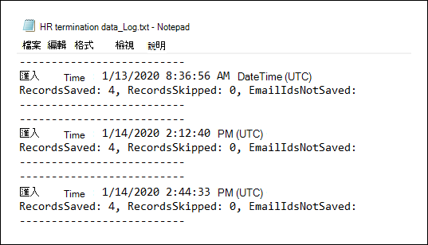
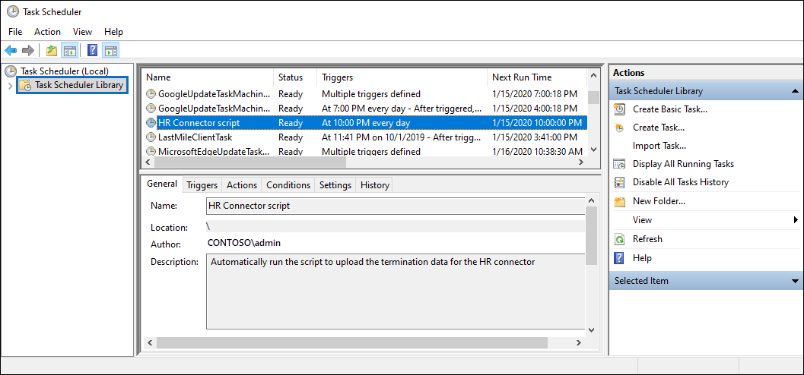

# <a name="set-up-a-connector-to-import-hr-data"></a><span data-ttu-id="73298-104">設定連接器以匯入人力資源資料</span><span class="sxs-lookup"><span data-stu-id="73298-104">Set up a connector to import HR data</span></span>

<span data-ttu-id="73298-105">您可以設定 Microsoft 365 規範中心內的資料連線器，以匯入人力資源 (HR) 與事件相關的資料，例如使用者的辭職程度或使用者工作階層中的變更。</span><span class="sxs-lookup"><span data-stu-id="73298-105">You can set up a data connector in the Microsoft 365 compliance center to import human resources (HR) data related to events such as a user's resignation or a change in a user's job level.</span></span> <span data-ttu-id="73298-106">使用者可以使用 HR 資料來 [產生風險指示器，以協助](insider-risk-management.md) 您識別組織內使用者可能的惡意活動或資料竊取。</span><span class="sxs-lookup"><span data-stu-id="73298-106">The HR data can then be used by the [insider risk management solution](insider-risk-management.md) to generate risk indicators that can help you identity possible malicious activity or data theft by users inside your organization.</span></span>

<span data-ttu-id="73298-107">設定資料指標以取得可供內幕風險管理原則用來產生風險指示器的工作，包含建立包含 HR 資料的 CSV 檔案。在 Azure Active Directory 中建立用於驗證的應用程式，在 Microsoft 365 規範中心內建立 HR 資料連線器，然後以排程的方式執行腳本 () 將 CSV 檔案中的 HR 資料 ingests 至 Microsoft 雲端，使其可供現有的「內部人員風險管理」解決方案使用。</span><span class="sxs-lookup"><span data-stu-id="73298-107">Setting up a connector for HR data that insider risk management policies can use to generate risk indicators consists of creating a CSV file that contains that contains the HR data, creating an app in Azure Active Directory that's used for authentication, creating an HR data connector in the Microsoft 365 compliance center, and then running a script (on a scheduled basis) that ingests the HR data in CSV files to the Microsoft cloud so it's available to the insider risk management solution.</span></span>

## <a name="before-you-begin"></a><span data-ttu-id="73298-108">開始之前</span><span class="sxs-lookup"><span data-stu-id="73298-108">Before you begin</span></span>

- <span data-ttu-id="73298-109">決定要匯入 Microsoft 365 的人力資源案例和資料。</span><span class="sxs-lookup"><span data-stu-id="73298-109">Determine which HR scenarios and data to import to Microsoft 365.</span></span> <span data-ttu-id="73298-110">這將協助您決定需要建立的 CSV 檔案和 HR 連接器數目，以及如何產生及構造 CSV 檔案。</span><span class="sxs-lookup"><span data-stu-id="73298-110">This will help you determine how many CSV files and HR connectors you'll need to create, and how to generate and structure the CSV files.</span></span> <span data-ttu-id="73298-111">您所匯入的 HR 資料是由您想要執行的「內幕風險管理」原則所決定。</span><span class="sxs-lookup"><span data-stu-id="73298-111">The HR data that you import is determined by the insider risk management policies that you want to implement.</span></span> <span data-ttu-id="73298-112">如需詳細資訊，請參閱步驟1。</span><span class="sxs-lookup"><span data-stu-id="73298-112">For more information, see Step 1.</span></span>

- <span data-ttu-id="73298-113">決定如何從組織的 HR 系統 (，定期) 中取得或匯出資料，並將其新增至您在步驟1中建立的 CSV 檔案。</span><span class="sxs-lookup"><span data-stu-id="73298-113">Determine how to retrieve or export the data from your organization's HR system (and on a regular basis) and add it to the CSV files that you create in Step 1.</span></span> <span data-ttu-id="73298-114">您在步驟4中執行的腳本會將 CSV 檔案中的 HR 資料上傳至 Microsoft 雲端。</span><span class="sxs-lookup"><span data-stu-id="73298-114">The script that you run in Step 4 will upload the HR data in the CSV files to the Microsoft cloud.</span></span>

- <span data-ttu-id="73298-115">在步驟3中建立 HR 連接器的使用者，必須在 Exchange Online 中指派「信箱匯入匯出」角色。</span><span class="sxs-lookup"><span data-stu-id="73298-115">The user who creates the HR connector in Step 3 must be assigned the Mailbox Import Export role in Exchange Online.</span></span> <span data-ttu-id="73298-116">依預設，此角色不會指派給 Exchange Online 內的任何角色群組。</span><span class="sxs-lookup"><span data-stu-id="73298-116">By default, this role isn't assigned to any role group in Exchange Online.</span></span> <span data-ttu-id="73298-117">您可以將信箱匯入匯出角色新增至 Exchange Online 中的「組織管理」角色群組。</span><span class="sxs-lookup"><span data-stu-id="73298-117">You can add the Mailbox Import Export role to the Organization Management role group in Exchange Online.</span></span> <span data-ttu-id="73298-118">或者，您可以建立新的角色群組、指派信箱匯入匯出角色，然後將適當的使用者新增為成員。</span><span class="sxs-lookup"><span data-stu-id="73298-118">Or you can create a new role group, assign the Mailbox Import Export role, and then add the appropriate users as members.</span></span> <span data-ttu-id="73298-119">如需詳細資訊，請參閱「管理 Exchange Online 中的角色群組」一文中的 [ [建立角色群組](/Exchange/permissions-exo/role-groups#create-role-groups) 或 [修改角色群組](/Exchange/permissions-exo/role-groups#modify-role-groups) ] 區段。</span><span class="sxs-lookup"><span data-stu-id="73298-119">For more information, see the [Create role groups](/Exchange/permissions-exo/role-groups#create-role-groups) or [Modify role groups](/Exchange/permissions-exo/role-groups#modify-role-groups) sections in the article "Manage role groups in Exchange Online".</span></span>

- <span data-ttu-id="73298-120">您在步驟4中執行的範例腳本會將您的 HR 資料上傳至 Microsoft 雲端，以供內部使用者風險管理解決方案使用。</span><span class="sxs-lookup"><span data-stu-id="73298-120">The sample script that you run in Step 4 will upload your HR data to the Microsoft cloud so that it can be used by the insider risk management solution.</span></span> <span data-ttu-id="73298-121">在任何 Microsoft standard support 計畫或服務下，都不支援此範例腳本。</span><span class="sxs-lookup"><span data-stu-id="73298-121">This sample script isn't supported under any Microsoft standard support program or service.</span></span> <span data-ttu-id="73298-122">範例指令碼係依「現狀」提供，不含任何種類的擔保方式。</span><span class="sxs-lookup"><span data-stu-id="73298-122">The sample script is provided AS IS without warranty of any kind.</span></span> <span data-ttu-id="73298-123">Microsoft 另外不承擔任何明示或默示的擔保，包括但不限於適售性或適合某特定用途的默示擔保。</span><span class="sxs-lookup"><span data-stu-id="73298-123">Microsoft further disclaims all implied warranties including, without limitation, any implied warranties of merchantability or of fitness for a particular purpose.</span></span> <span data-ttu-id="73298-124">使用或操作範例指令碼和文件發生的所有風險，皆屬於您的責任。</span><span class="sxs-lookup"><span data-stu-id="73298-124">The entire risk arising out of the use or performance of the sample script and documentation remains with you.</span></span> <span data-ttu-id="73298-125">Microsoft、其作者以及其他與建置、生產或交付程式碼相關的任何人在任何情況下皆完全不需對任何損失負責任，包括但不限於商業利潤損失、業務中斷、業務資訊損失、或其他錢財損失等因使用或無法使用範例指令碼或文件所發生的損失，即使 Microsoft 曾建議這些損失發生的可能性。</span><span class="sxs-lookup"><span data-stu-id="73298-125">In no event shall Microsoft, its authors, or anyone else involved in the creation, production, or delivery of the scripts be liable for any damages whatsoever (including, without limitation, damages for loss of business profits, business interruption, loss of business information, or other pecuniary loss) arising out of the use of or inability to use the sample scripts or documentation, even if Microsoft has been advised of the possibility of such damages.</span></span>

## <a name="step-1-prepare-a-csv-file-with-your-hr-data"></a><span data-ttu-id="73298-126">步驟1：使用 HR 資料準備 CSV 檔案</span><span class="sxs-lookup"><span data-stu-id="73298-126">Step 1: Prepare a CSV file with your HR data</span></span>

<span data-ttu-id="73298-127">第一步是建立 CSV 檔案，該檔案包含連接器將匯入 Microsoft 365 的 HR 資料。</span><span class="sxs-lookup"><span data-stu-id="73298-127">The first step is to create a CSV file that contains the HR data that the connector will import to Microsoft 365.</span></span> <span data-ttu-id="73298-128">此資料將會由有問必答風險解決方案用來產生潛在的風險指示器。</span><span class="sxs-lookup"><span data-stu-id="73298-128">This data will be used by the insider risk solution to generate potential risk indicators.</span></span> <span data-ttu-id="73298-129">下列 HR 案例的資料可匯入至 Microsoft 365：</span><span class="sxs-lookup"><span data-stu-id="73298-129">Data for the following HR scenarios can be imported to Microsoft 365:</span></span>

- <span data-ttu-id="73298-130">員工辭職。</span><span class="sxs-lookup"><span data-stu-id="73298-130">Employee resignation.</span></span> <span data-ttu-id="73298-131">離開組織之使用者的相關資訊。</span><span class="sxs-lookup"><span data-stu-id="73298-131">Information about users who have left your organization.</span></span>

- <span data-ttu-id="73298-132">工作層級變更。</span><span class="sxs-lookup"><span data-stu-id="73298-132">Job level changes.</span></span> <span data-ttu-id="73298-133">使用者工作層級變更的相關資訊，例如促銷及降級。</span><span class="sxs-lookup"><span data-stu-id="73298-133">Information about job level changes for users, such as promotions and demotions.</span></span>

- <span data-ttu-id="73298-134">效能檢查。</span><span class="sxs-lookup"><span data-stu-id="73298-134">Performance reviews.</span></span> <span data-ttu-id="73298-135">使用者效能的相關資訊。</span><span class="sxs-lookup"><span data-stu-id="73298-135">Information about user performance.</span></span>

- <span data-ttu-id="73298-136">效能改進計畫。</span><span class="sxs-lookup"><span data-stu-id="73298-136">Performance improvement plans.</span></span> <span data-ttu-id="73298-137">有關使用者之效能改進計畫的資訊。</span><span class="sxs-lookup"><span data-stu-id="73298-137">Information about performance improvement plans for users.</span></span>

<span data-ttu-id="73298-138">要匯入的 HR 資料類型，取決於您要執行的「內幕風險管理」原則和對應的原則範本。</span><span class="sxs-lookup"><span data-stu-id="73298-138">The type of HR data to import depends on the insider risk management policy and corresponding policy template that you want to implement.</span></span> <span data-ttu-id="73298-139">下表顯示每個原則範本所需的 HR 資料類型：</span><span class="sxs-lookup"><span data-stu-id="73298-139">The following table shows which HR data type is required for each policy template:</span></span>

|  <span data-ttu-id="73298-140">原則範本</span><span class="sxs-lookup"><span data-stu-id="73298-140">Policy template</span></span> |  <span data-ttu-id="73298-141">HR 資料類型</span><span class="sxs-lookup"><span data-stu-id="73298-141">HR data type</span></span> |
|:-----------------------------------------------|:---------------------------------------------------------------------|
| <span data-ttu-id="73298-142">由去聲使用者竊取資料</span><span class="sxs-lookup"><span data-stu-id="73298-142">Data theft by departing users</span></span>                   | <span data-ttu-id="73298-143">員工 resignations</span><span class="sxs-lookup"><span data-stu-id="73298-143">Employee resignations</span></span>                                                 |
| <span data-ttu-id="73298-144">一般資料洩漏</span><span class="sxs-lookup"><span data-stu-id="73298-144">General data leaks</span></span>                              | <span data-ttu-id="73298-145">不適用</span><span class="sxs-lookup"><span data-stu-id="73298-145">Not applicable</span></span>                                                        |
| <span data-ttu-id="73298-146">依優先使用者的資料洩漏</span><span class="sxs-lookup"><span data-stu-id="73298-146">Data leaks by priority users</span></span>                    | <span data-ttu-id="73298-147">不適用</span><span class="sxs-lookup"><span data-stu-id="73298-147">Not applicable</span></span>                                                        |
| <span data-ttu-id="73298-148">因不滿使用者的資料洩漏</span><span class="sxs-lookup"><span data-stu-id="73298-148">Data leaks by disgruntled users</span></span>                 | <span data-ttu-id="73298-149">工作層級變更、效能檢查、效能改進計畫</span><span class="sxs-lookup"><span data-stu-id="73298-149">Job level changes, Performance reviews, Performance improvement plans</span></span> |
| <span data-ttu-id="73298-150">一般安全性原則違規</span><span class="sxs-lookup"><span data-stu-id="73298-150">General security policy violations</span></span>              | <span data-ttu-id="73298-151">不適用</span><span class="sxs-lookup"><span data-stu-id="73298-151">Not applicable</span></span>                                                        |
| <span data-ttu-id="73298-152">脫離使用者的安全性原則違規</span><span class="sxs-lookup"><span data-stu-id="73298-152">Security policy violations by departing users</span></span>   | <span data-ttu-id="73298-153">員工 resignations</span><span class="sxs-lookup"><span data-stu-id="73298-153">Employee resignations</span></span>                                                 |
| <span data-ttu-id="73298-154">依優先順序的使用者所破壞的安全性原則</span><span class="sxs-lookup"><span data-stu-id="73298-154">Security policy violations by priority users</span></span>    | <span data-ttu-id="73298-155">不適用</span><span class="sxs-lookup"><span data-stu-id="73298-155">Not applicable</span></span>                                                        |
| <span data-ttu-id="73298-156">不滿的使用者違反安全性原則</span><span class="sxs-lookup"><span data-stu-id="73298-156">Security policy violations by disgruntled users</span></span> | <span data-ttu-id="73298-157">工作層級變更、效能檢查、效能改進計畫</span><span class="sxs-lookup"><span data-stu-id="73298-157">Job level changes, Performance reviews, Performance improvement plans</span></span> |
| <span data-ttu-id="73298-158">電子郵件中的冒犯性語言</span><span class="sxs-lookup"><span data-stu-id="73298-158">Offensive language in email</span></span>                     | <span data-ttu-id="73298-159">不適用</span><span class="sxs-lookup"><span data-stu-id="73298-159">Not applicable</span></span>                                                        |

<span data-ttu-id="73298-160">如需有關有問必答風險管理之原則範本的詳細資訊，請參閱 [有問必答風險管理原則](insider-risk-management-policies.md#policy-templates)。</span><span class="sxs-lookup"><span data-stu-id="73298-160">For more information about policy templates for insider risk management, see [Insider risk management policies](insider-risk-management-policies.md#policy-templates).</span></span>

<span data-ttu-id="73298-161">針對每個 HR 案例，您必須在一或多個 CSV 檔案中提供對應的 HR 資料。</span><span class="sxs-lookup"><span data-stu-id="73298-161">For each HR scenario, you'll need to provide the corresponding HR data in one or more CSV files.</span></span> <span data-ttu-id="73298-162">您的有問必答風險管理執行所要使用的 CSV 檔案數目，將于本節稍後討論。</span><span class="sxs-lookup"><span data-stu-id="73298-162">The number of CSV files to use for your insider risk management implementation is discussed later in this section.</span></span>

<span data-ttu-id="73298-163">使用必要的 HR 資料建立 CSV 檔案之後，請將它儲存在您在步驟4中執行腳本的本機電腦上。</span><span class="sxs-lookup"><span data-stu-id="73298-163">After you create the CSV file with the required HR data, store it on the local computer that you run the script on in Step 4.</span></span> <span data-ttu-id="73298-164">您也應該執行更新策略，以確保 CSV 檔案永遠包含最新的資訊，以便您執行腳本時，最新的 HR 資料會上傳至 Microsoft 雲端，並可供內幕人員風險管理解決方案存取。</span><span class="sxs-lookup"><span data-stu-id="73298-164">You should also implement an update strategy to make sure the CSV file always contains the most current information so that whatever you run the script, the most current HR data will be uploaded to the Microsoft cloud and accessible to the insider risk management solution.</span></span>

> [!IMPORTANT]
> <span data-ttu-id="73298-165">下列各節所述的資料列名稱不是必要參數，只是範例。</span><span class="sxs-lookup"><span data-stu-id="73298-165">The column names described in the following sections are not required parameters, but only examples.</span></span> <span data-ttu-id="73298-166">您可以在 CSV 檔案中使用任何欄名稱。</span><span class="sxs-lookup"><span data-stu-id="73298-166">You can use any column name in your CSV files.</span></span> <span data-ttu-id="73298-167">不過，當您在步驟3中建立 HR 連接器時，您在 CSV 檔案中使用的欄名 *必須* 對應至資料類型。</span><span class="sxs-lookup"><span data-stu-id="73298-167">However, the column names you use in a CSV file *must* be mapped to the data type when you create the HR connector in Step 3.</span></span> <span data-ttu-id="73298-168">另外請注意，下列各節中的範例 CSV 檔案會顯示在 [記事本] 視圖中。</span><span class="sxs-lookup"><span data-stu-id="73298-168">Also note that the sample CSV files in the following sections are show in NotePad view.</span></span> <span data-ttu-id="73298-169">在 Microsoft Excel 中查看和編輯 CSV 檔案的方式很簡單。</span><span class="sxs-lookup"><span data-stu-id="73298-169">It's much easier to view and edit CSV files in Microsoft Excel.</span></span>

<span data-ttu-id="73298-170">下列各節說明每個 HR 案例所需的 CSV 資料。</span><span class="sxs-lookup"><span data-stu-id="73298-170">The follow sections describe the required CSV data for each HR scenario.</span></span>

### <a name="csv-file-for-employee-resignation-data"></a><span data-ttu-id="73298-171">員工辭職資料的 CSV 檔案</span><span class="sxs-lookup"><span data-stu-id="73298-171">CSV file for employee resignation data</span></span>

<span data-ttu-id="73298-172">以下是員工辭職資料之 CSV 檔案的範例。</span><span class="sxs-lookup"><span data-stu-id="73298-172">Here's an example of a CSV file for employee resignation data.</span></span>

```text
EmailAddress,ResignationDate,LastWorkingDate
sarad@contoso.com,2019-04-23T15:18:02.4675041+05:30,2019-04-29T15:18:02.4675041+05:30
pilarp@contoso.com,2019-04-24T09:15:49Z,2019-04-29T15:18:02.7117540
```

<span data-ttu-id="73298-173">下表說明 CSV 檔案中的每一欄，以取得員工辭職資料。</span><span class="sxs-lookup"><span data-stu-id="73298-173">The following table describes each column in the CSV file for employee resignation data.</span></span>

|  <span data-ttu-id="73298-174">欄</span><span class="sxs-lookup"><span data-stu-id="73298-174">Column</span></span>   |   <span data-ttu-id="73298-175">描述</span><span class="sxs-lookup"><span data-stu-id="73298-175">Description</span></span> |
|:------------|:----------------|
|<span data-ttu-id="73298-176">**EmailAddress**</span><span class="sxs-lookup"><span data-stu-id="73298-176">**EmailAddress**</span></span>| <span data-ttu-id="73298-177">指定已終止使用者 (UPN) 的電子郵件地址。</span><span class="sxs-lookup"><span data-stu-id="73298-177">Specifies the email address (UPN) of the terminated user.</span></span>|
| <span data-ttu-id="73298-178">**ResignationDate**</span><span class="sxs-lookup"><span data-stu-id="73298-178">**ResignationDate**</span></span> | <span data-ttu-id="73298-179">指定使用者正式終止組織中使用者雇傭的日期。</span><span class="sxs-lookup"><span data-stu-id="73298-179">Specifies the date the user's employment was officially terminated in your organization.</span></span> <span data-ttu-id="73298-180">例如，這可能是使用者提供有關離開組織之通知的日期。</span><span class="sxs-lookup"><span data-stu-id="73298-180">For example, this may be the date when the user gave their notice about leaving your organization.</span></span> <span data-ttu-id="73298-181">此日期可能不同于人員的最後一天的工作日期。</span><span class="sxs-lookup"><span data-stu-id="73298-181">This date may be the different than the date of the person's last day of work.</span></span> <span data-ttu-id="73298-182">請使用下列日期格式： `yyyy-mm-ddThh:mm:ss.nnnnnn+|-hh:mm` ，也就是 [ISO 8601 的日期和時間格式](https://www.iso.org/iso-8601-date-and-time-format.html)。</span><span class="sxs-lookup"><span data-stu-id="73298-182">Use the following date format: `yyyy-mm-ddThh:mm:ss.nnnnnn+|-hh:mm`, which is the [ISO 8601 date and time format](https://www.iso.org/iso-8601-date-and-time-format.html).</span></span>|
| <span data-ttu-id="73298-183">**LastWorkingDate**</span><span class="sxs-lookup"><span data-stu-id="73298-183">**LastWorkingDate**</span></span> | <span data-ttu-id="73298-184">為終止的使用者指定最後一天的工作。</span><span class="sxs-lookup"><span data-stu-id="73298-184">Specifies the last day of work for the terminated user.</span></span> <span data-ttu-id="73298-185">請使用下列日期格式： `yyyy-mm-ddThh:mm:ss.nnnnnn+|-hh:mm` ，也就是 [ISO 8601 的日期和時間格式](https://www.iso.org/iso-8601-date-and-time-format.html)。</span><span class="sxs-lookup"><span data-stu-id="73298-185">Use the following date format: `yyyy-mm-ddThh:mm:ss.nnnnnn+|-hh:mm`, which is the [ISO 8601 date and time format](https://www.iso.org/iso-8601-date-and-time-format.html).</span></span>|
|||

### <a name="csv-file-for-job-level-changes-data"></a><span data-ttu-id="73298-186">用於工作層級變更資料的 CSV 檔案</span><span class="sxs-lookup"><span data-stu-id="73298-186">CSV file for job level changes data</span></span>

<span data-ttu-id="73298-187">以下是適用于工作層級變更資料的 CSV 檔案的範例。</span><span class="sxs-lookup"><span data-stu-id="73298-187">Here's an example of a CSV file for job level changes data.</span></span>

```text
EmailAddress,EffectiveDate,OldLevel,NewLevel
sarad@contoso.com,2019-04-23T15:18:02.4675041+05:30,Level 61 – Sr. Manager,Level 60- Manager
pillar@contoso.com,2019-04-23T15:18:02.4675041+05:30,Level 62 – Director,Level 60- Sr. Manager
```

<span data-ttu-id="73298-188">下表說明 CSV 檔案中的每一欄的工作層級變更資料。</span><span class="sxs-lookup"><span data-stu-id="73298-188">The following table describes each column in the CSV file for job level changes data.</span></span>

|  <span data-ttu-id="73298-189">欄</span><span class="sxs-lookup"><span data-stu-id="73298-189">Column</span></span> | <span data-ttu-id="73298-190">描述</span><span class="sxs-lookup"><span data-stu-id="73298-190">Description</span></span> |
|:--------- |:------------- |
| <span data-ttu-id="73298-191">**EmailAddress**</span><span class="sxs-lookup"><span data-stu-id="73298-191">**EmailAddress**</span></span>  | <span data-ttu-id="73298-192">指定使用者的電子郵件地址 (UPN) 。</span><span class="sxs-lookup"><span data-stu-id="73298-192">Specifies the user's email address (UPN).</span></span>|
| <span data-ttu-id="73298-193">**EffectiveDate**</span><span class="sxs-lookup"><span data-stu-id="73298-193">**EffectiveDate**</span></span> | <span data-ttu-id="73298-194">指定使用者工作層級正式變更的日期。</span><span class="sxs-lookup"><span data-stu-id="73298-194">Specifies the date that the user's job level was officially changed.</span></span> <span data-ttu-id="73298-195">請使用下列日期格式： `yyyy-mm-ddThh:mm:ss.nnnnnn+|-hh:mm` ，也就是 [ISO 8601 的日期和時間格式](https://www.iso.org/iso-8601-date-and-time-format.html)。</span><span class="sxs-lookup"><span data-stu-id="73298-195">Use the following date format: `yyyy-mm-ddThh:mm:ss.nnnnnn+|-hh:mm`, which is the [ISO 8601 date and time format](https://www.iso.org/iso-8601-date-and-time-format.html).</span></span>|
| <span data-ttu-id="73298-196">**備註**</span><span class="sxs-lookup"><span data-stu-id="73298-196">**Remarks**</span></span>| <span data-ttu-id="73298-197">指定評估程式所提供之工作層級變更的批註。</span><span class="sxs-lookup"><span data-stu-id="73298-197">Specifies the remarks that evaluator has provided about the change of job level.</span></span> <span data-ttu-id="73298-198">您可以輸入200個字元的限制。</span><span class="sxs-lookup"><span data-stu-id="73298-198">You can enter a limit of 200 characters.</span></span> <span data-ttu-id="73298-199">此參數為選用。</span><span class="sxs-lookup"><span data-stu-id="73298-199">This parameter is optional.</span></span> <span data-ttu-id="73298-200">您不需要將其包含在 CSV 檔案中。</span><span class="sxs-lookup"><span data-stu-id="73298-200">You don't have to include it in the CSV file.</span></span>|
| <span data-ttu-id="73298-201">**OldLevel**</span><span class="sxs-lookup"><span data-stu-id="73298-201">**OldLevel**</span></span>| <span data-ttu-id="73298-202">會指定使用者的工作層級之後變更。</span><span class="sxs-lookup"><span data-stu-id="73298-202">Specifies the user's job level before it was changed.</span></span> <span data-ttu-id="73298-203">這是自由 text 參數，可以包含您組織的階層式分類。</span><span class="sxs-lookup"><span data-stu-id="73298-203">This is a free-text parameter and can contain hierarchical taxonomy for your organization.</span></span> <span data-ttu-id="73298-204">此參數為選用。</span><span class="sxs-lookup"><span data-stu-id="73298-204">This parameter is optional.</span></span> <span data-ttu-id="73298-205">您不需要將其包含在 CSV 檔案中。</span><span class="sxs-lookup"><span data-stu-id="73298-205">You don't have to include it in the CSV file.</span></span>|
| <span data-ttu-id="73298-206">**NewLevel**</span><span class="sxs-lookup"><span data-stu-id="73298-206">**NewLevel**</span></span>| <span data-ttu-id="73298-207">指定使用者在變更後的工作層級。</span><span class="sxs-lookup"><span data-stu-id="73298-207">Specifies the user's job level after it was changed.</span></span> <span data-ttu-id="73298-208">這是自由 text 參數，可以包含您組織的階層式分類。</span><span class="sxs-lookup"><span data-stu-id="73298-208">This is a free-text parameter and can contain hierarchical taxonomy for your organization.</span></span> <span data-ttu-id="73298-209">此參數為選用。</span><span class="sxs-lookup"><span data-stu-id="73298-209">This parameter is optional.</span></span> <span data-ttu-id="73298-210">您不需要將其包含在 CSV 檔案中。</span><span class="sxs-lookup"><span data-stu-id="73298-210">You don't have to include it in the CSV file.</span></span>|
|||

### <a name="csv-file-for-performance-review-data"></a><span data-ttu-id="73298-211">用於效能檢查資料的 CSV 檔案</span><span class="sxs-lookup"><span data-stu-id="73298-211">CSV file for performance review data</span></span>

<span data-ttu-id="73298-212">以下是一個用於效能資料之 CSV 檔案的範例。</span><span class="sxs-lookup"><span data-stu-id="73298-212">Here's an example of a CSV file for performance data.</span></span>

```text
EmailAddress,EffectiveDate,Remarks,Rating
sarad@contoso.com,2019-04-23T15:18:02.4675041+05:30,Met expectations but bad attitude,2-Below expectation
pillar@contoso.com,2019-04-23T15:18:02.4675041+05:30, Multiple conflicts with the team
```

<span data-ttu-id="73298-213">下表說明用於效能檢查資料之 CSV 檔案中的每一欄。</span><span class="sxs-lookup"><span data-stu-id="73298-213">The following table describes each column in the CSV file for performance review data.</span></span>

|  <span data-ttu-id="73298-214">欄</span><span class="sxs-lookup"><span data-stu-id="73298-214">Column</span></span> | <span data-ttu-id="73298-215">描述</span><span class="sxs-lookup"><span data-stu-id="73298-215">Description</span></span> |
|:----------|:--------------|
| <span data-ttu-id="73298-216">**EmailAddress**</span><span class="sxs-lookup"><span data-stu-id="73298-216">**EmailAddress**</span></span>  | <span data-ttu-id="73298-217">指定使用者的電子郵件地址 (UPN) 。</span><span class="sxs-lookup"><span data-stu-id="73298-217">Specifies the user's email address (UPN).</span></span>|
| <span data-ttu-id="73298-218">**EffectiveDate**</span><span class="sxs-lookup"><span data-stu-id="73298-218">**EffectiveDate**</span></span> | <span data-ttu-id="73298-219">指定使用者正式獲悉其效能檢查結果的日期。</span><span class="sxs-lookup"><span data-stu-id="73298-219">Specifies the date that the user was officially informed about the result of their performance review.</span></span> <span data-ttu-id="73298-220">這可以是效能考核週期結束的日期。</span><span class="sxs-lookup"><span data-stu-id="73298-220">This can be the date when the performance review cycle ended.</span></span> <span data-ttu-id="73298-221">請使用下列日期格式： `yyyy-mm-ddThh:mm:ss.nnnnnn+|-hh:mm` ，也就是 [ISO 8601 的日期和時間格式](https://www.iso.org/iso-8601-date-and-time-format.html)。</span><span class="sxs-lookup"><span data-stu-id="73298-221">Use the following date format: `yyyy-mm-ddThh:mm:ss.nnnnnn+|-hh:mm`, which is the [ISO 8601 date and time format](https://www.iso.org/iso-8601-date-and-time-format.html).</span></span>|
| <span data-ttu-id="73298-222">**備註**</span><span class="sxs-lookup"><span data-stu-id="73298-222">**Remarks**</span></span>| <span data-ttu-id="73298-223">指定評估程式為使用者提供的任何評語，以進行績效審查。</span><span class="sxs-lookup"><span data-stu-id="73298-223">Specifies any remarks that evaluator has provided to the user for the performance review.</span></span> <span data-ttu-id="73298-224">這是一個 text 參數，其限制為200個字元。</span><span class="sxs-lookup"><span data-stu-id="73298-224">This is a text parameter with a limit of 200 characters.</span></span> <span data-ttu-id="73298-225">此參數為選用。</span><span class="sxs-lookup"><span data-stu-id="73298-225">This parameter is optional.</span></span> <span data-ttu-id="73298-226">您不需要將其包含在 CSV 檔案中。</span><span class="sxs-lookup"><span data-stu-id="73298-226">You don't have to include it in the CSV file.</span></span>|
| <span data-ttu-id="73298-227">**評級**</span><span class="sxs-lookup"><span data-stu-id="73298-227">**Rating**</span></span>| <span data-ttu-id="73298-228">會指定績效審查所提供的評級。</span><span class="sxs-lookup"><span data-stu-id="73298-228">Specifies the rating provided for the performance review.</span></span> <span data-ttu-id="73298-229">這是一個 text 參數，可以包含您的組織用來辨識評估的任何自由格式的文字。</span><span class="sxs-lookup"><span data-stu-id="73298-229">This is a text parameter and can contain any free-form text that your organization uses to recognize the evaluation.</span></span> <span data-ttu-id="73298-230">例如，"3 符合預期" 或 "2 低於平均"。</span><span class="sxs-lookup"><span data-stu-id="73298-230">For example, "3 Met expectations" or "2 Below average".</span></span> <span data-ttu-id="73298-231">這是文本參數，最大限制為25個字元。</span><span class="sxs-lookup"><span data-stu-id="73298-231">This is a text parameter with a limit of 25 characters.</span></span> <span data-ttu-id="73298-232">此參數為選用。</span><span class="sxs-lookup"><span data-stu-id="73298-232">This parameter is optional.</span></span> <span data-ttu-id="73298-233">您不需要將其包含在 CSV 檔案中。</span><span class="sxs-lookup"><span data-stu-id="73298-233">You don't have to include it in the CSV file.</span></span>|
|||

### <a name="csv-file-for-performance-improvement-plan-data"></a><span data-ttu-id="73298-234">效能改善計畫資料的 CSV 檔案</span><span class="sxs-lookup"><span data-stu-id="73298-234">CSV file for performance improvement plan data</span></span>

<span data-ttu-id="73298-235">以下是性能改進計畫資料之資料的 CSV 檔案的範例。</span><span class="sxs-lookup"><span data-stu-id="73298-235">Here's an example of a CSV file for the data for the performance improvement plan data.</span></span>

```text
EmailAddress,EffectiveDate,ImprovementRemarks,PerformanceRating
sarad@contoso.com,2019-04-23T15:18:02.4675041+05:30,Met expectation but bad attitude,2-Below expectation
pillar@contoso.com,2019-04-23T15:18:02.4675041+05:30, Multiple conflicts with the team
```

<span data-ttu-id="73298-236">下表說明用於效能檢查資料之 CSV 檔案中的每一欄。</span><span class="sxs-lookup"><span data-stu-id="73298-236">The following table describes each column in the CSV file for performance review data.</span></span>

|  <span data-ttu-id="73298-237">欄</span><span class="sxs-lookup"><span data-stu-id="73298-237">Column</span></span> |  <span data-ttu-id="73298-238">描述</span><span class="sxs-lookup"><span data-stu-id="73298-238">Description</span></span> |
|:----------|:---------------|
| <span data-ttu-id="73298-239">**EmailAddress**</span><span class="sxs-lookup"><span data-stu-id="73298-239">**EmailAddress**</span></span>  | <span data-ttu-id="73298-240">指定使用者的電子郵件地址 (UPN) 。</span><span class="sxs-lookup"><span data-stu-id="73298-240">Specifies the user's email address (UPN).</span></span>|
| <span data-ttu-id="73298-241">**EffectiveDate**</span><span class="sxs-lookup"><span data-stu-id="73298-241">**EffectiveDate**</span></span> | <span data-ttu-id="73298-242">指定使用者正式獲悉其績效改進計畫的日期。</span><span class="sxs-lookup"><span data-stu-id="73298-242">Specifies the date when the user was officially informed about their performance improvement plan.</span></span> <span data-ttu-id="73298-243">您必須使用下列日期格式： `yyyy-mm-ddThh:mm:ss.nnnnnn+|-hh:mm` ，也就是 [ISO 8601 的日期和時間格式](https://www.iso.org/iso-8601-date-and-time-format.html)。</span><span class="sxs-lookup"><span data-stu-id="73298-243">You must use the following date format: `yyyy-mm-ddThh:mm:ss.nnnnnn+|-hh:mm`, which is the [ISO 8601 date and time format](https://www.iso.org/iso-8601-date-and-time-format.html).</span></span>|
| <span data-ttu-id="73298-244">**備註**</span><span class="sxs-lookup"><span data-stu-id="73298-244">**Remarks**</span></span>| <span data-ttu-id="73298-245">指定評估程式已提供有關效能改進計畫的任何批註。</span><span class="sxs-lookup"><span data-stu-id="73298-245">Specifies any remarks that evaluator has provided about the performance improvement plan.</span></span> <span data-ttu-id="73298-246">這是一個 text 參數，其限制為200個字元。</span><span class="sxs-lookup"><span data-stu-id="73298-246">This is a text parameter with a limit of 200 characters.</span></span> <span data-ttu-id="73298-247">這是選用的參數。</span><span class="sxs-lookup"><span data-stu-id="73298-247">This is an optional parameter.</span></span> <span data-ttu-id="73298-248">您不需要將其包含在 CSV 檔案中。</span><span class="sxs-lookup"><span data-stu-id="73298-248">You don't have to include it in the CSV file.</span></span> |
| <span data-ttu-id="73298-249">**評級**</span><span class="sxs-lookup"><span data-stu-id="73298-249">**Rating**</span></span>| <span data-ttu-id="73298-250">會指定任何與效能檢查相關的評級或其他資訊。</span><span class="sxs-lookup"><span data-stu-id="73298-250">Specifies any rating or other information related to the performance review.</span></span> <span data-ttu-id="73298-251">效能改進計畫。</span><span class="sxs-lookup"><span data-stu-id="73298-251">performance improvement plan.</span></span> <span data-ttu-id="73298-252">這是一個 text 參數，可以包含您的組織用來辨識評估的任何自由格式文字。</span><span class="sxs-lookup"><span data-stu-id="73298-252">This is a text parameter and can contain any free form text that your organization uses to recognize the evaluation.</span></span> <span data-ttu-id="73298-253">例如，"3 符合預期" 或 "2 低於平均"。</span><span class="sxs-lookup"><span data-stu-id="73298-253">For example, "3 Met expectations" or "2 Below average".</span></span> <span data-ttu-id="73298-254">這是最大值為25個字元的 text 參數。</span><span class="sxs-lookup"><span data-stu-id="73298-254">This is a text parameter with limit of 25 characters.</span></span> <span data-ttu-id="73298-255">這是選用的參數。</span><span class="sxs-lookup"><span data-stu-id="73298-255">This is an optional parameter.</span></span> <span data-ttu-id="73298-256">您不需要將其包含在 CSV 檔案中。</span><span class="sxs-lookup"><span data-stu-id="73298-256">You don't have to include it in the CSV file.</span></span>|
|||

### <a name="determining-how-many-csv-files-to-use-for-hr-data"></a><span data-ttu-id="73298-257">決定 HR 資料使用的 CSV 檔案數目</span><span class="sxs-lookup"><span data-stu-id="73298-257">Determining how many CSV files to use for HR data</span></span>

<span data-ttu-id="73298-258">在步驟3中，您可以選擇為每個 HR 資料類型建立不同的連接器，也可以選擇為所有資料類型建立單一連接器。</span><span class="sxs-lookup"><span data-stu-id="73298-258">In Step 3, you can choose to create separate connectors for each HR data type or you can choose to create single connector for all data types.</span></span> <span data-ttu-id="73298-259">您可以使用個別的 CSV 檔案，其中包含一個 HR 案例的資料，如先前章節) 所述的 CSV 檔案範例所 (。</span><span class="sxs-lookup"><span data-stu-id="73298-259">You can use separate CSV files that contain data for one HR scenario (like the examples of the CSV files described in the previous sections).</span></span> <span data-ttu-id="73298-260">或者，您可以使用單一 CSV 檔案，其中包含兩個或多個 HR 案例的資料。</span><span class="sxs-lookup"><span data-stu-id="73298-260">Alternatively, you can use a single CSV file that contains data for two or more HR scenarios.</span></span> <span data-ttu-id="73298-261">以下是一些指導方針，可協助您判斷要用於 HR 資料的 CSV 檔案數目。</span><span class="sxs-lookup"><span data-stu-id="73298-261">Here are some guidelines to help you determine how many CSV files to use for HR data.</span></span>

- <span data-ttu-id="73298-262">如果您想要執行的內幕風險管理原則需要多個 HR 資料類型，請考慮使用包含所有必要資料類型的單一 CSV 檔案。</span><span class="sxs-lookup"><span data-stu-id="73298-262">If the insider risk management policy that you want to implement requires multiple HR data types, consider using a single CSV file that contains all the required data types.</span></span>

- <span data-ttu-id="73298-263">產生或收集 HR 資料的方法可能會決定 CSV 檔案的數目。</span><span class="sxs-lookup"><span data-stu-id="73298-263">The method for generating or collecting the HR data may determine the number of CSV files.</span></span> <span data-ttu-id="73298-264">例如，如果用來設定 HR 連接器的不同類型的 HR 資料位於組織的單一 HR 系統中，您可以將資料匯出到單一 CSV 檔案。</span><span class="sxs-lookup"><span data-stu-id="73298-264">For example, if the different types of HR data used to configure an HR connector are located in a single HR system in your organization, then you may be able to export the data to a single CSV file.</span></span> <span data-ttu-id="73298-265">不過，如果資料分散在不同的 HR 系統，則將資料匯出至不同的 CSV 檔案可能會比較容易。</span><span class="sxs-lookup"><span data-stu-id="73298-265">But if data is distributed across different HR systems, then it might be easier to export data to different CSV files.</span></span> <span data-ttu-id="73298-266">例如，員工辭職資料可能位於與工作層級或效能檢查資料不同的人力資源系統中。</span><span class="sxs-lookup"><span data-stu-id="73298-266">For example, Employee resignation data may be located in a different HR system than Job level or Performance review data.</span></span> <span data-ttu-id="73298-267">在此情況下，使用個別的 CSV 檔案會比較容易，而不必手動將資料合併成單一 CSV 檔案。</span><span class="sxs-lookup"><span data-stu-id="73298-267">In this case, it may be easier to have separate CSV files rather than having to manually combine the data into a single CSV file.</span></span> <span data-ttu-id="73298-268">因此，您從 HR 系統中取得或匯出資料的方式，可能會決定所需的 CSV 檔案數目。</span><span class="sxs-lookup"><span data-stu-id="73298-268">So, how you retrieve or export data from your HR systems may determine how the number of CSV files you'll need.</span></span>

- <span data-ttu-id="73298-269">一般來說，您需要建立的 HR 連接器數目取決於 CSV 檔案中的資料類型。</span><span class="sxs-lookup"><span data-stu-id="73298-269">As a general rule, the number of HR connectors that you'll need to create is determined by the data types in a CSV file.</span></span> <span data-ttu-id="73298-270">例如，如果 CSV 檔案包含支援您的有問必答風險管理執行所需的所有資料類型，則您只需要一個 HR 連接器。</span><span class="sxs-lookup"><span data-stu-id="73298-270">For example, if a CSV file contains all the data types required to support your insider risk management implementation, then you only need one HR connector.</span></span> <span data-ttu-id="73298-271">不過，如果您有兩個不同的 CSV 檔案，每個檔案都包含單一資料型別，則必須建立兩個 HR 連接器。</span><span class="sxs-lookup"><span data-stu-id="73298-271">But if you have two separate CSV files that each contain a single data type, then you'll have to create two HR connectors.</span></span> <span data-ttu-id="73298-272">例外情況是，如果您將 **HRScenario** 欄新增至 CSV 檔案 (請參閱下一節) ，您可以設定單一 HR 連接器來處理不同的 CSV 檔案。</span><span class="sxs-lookup"><span data-stu-id="73298-272">An exception to this is that if you add an **HRScenario** column to a CSV file (see the next section), you can configure a single HR connector that can process different CSV files.</span></span>

### <a name="configuring-a-single-csv-file-for-multiple-hr-data-types"></a><span data-ttu-id="73298-273">設定多個 HR 資料類型的單一 CSV 檔案</span><span class="sxs-lookup"><span data-stu-id="73298-273">Configuring a single CSV file for multiple HR data types</span></span>

<span data-ttu-id="73298-274">您可以將多個 HR 資料類型新增至單一 CSV 檔案。</span><span class="sxs-lookup"><span data-stu-id="73298-274">You can add multiple HR data types to a single CSV file.</span></span> <span data-ttu-id="73298-275">如果您所執行的有問必答風險管理解決方案需要多個 HR 資料類型，或者資料類型位於組織中的單一 HR 系統中，這會很有用。</span><span class="sxs-lookup"><span data-stu-id="73298-275">This is useful if the insider risk management solution you're implementing requires multiple HR data types or if the data types are located in a single HR system in your organization.</span></span> <span data-ttu-id="73298-276">保留較少的 CSV 檔案，可讓您建立及管理較少的 HR 連接器。</span><span class="sxs-lookup"><span data-stu-id="73298-276">Having fewer CSV files always allows you to have fewer HR connectors to create and manage.</span></span>

<span data-ttu-id="73298-277">以下是設定具有多種資料類型之 CSV 檔案的必要條件：</span><span class="sxs-lookup"><span data-stu-id="73298-277">Here are requirements for configuring a CSV file with multiple data types:</span></span>

- <span data-ttu-id="73298-278">您必須將必要的欄新增 (和選用，如果您針對每個資料類型和標頭欄中的對應欄名稱使用它們) 。</span><span class="sxs-lookup"><span data-stu-id="73298-278">You have to add the required columns (and optional if you use them) for each data type and the corresponding column name in the header row.</span></span> <span data-ttu-id="73298-279">如果資料類型未對應至資料行，您可以將該值保留空白。</span><span class="sxs-lookup"><span data-stu-id="73298-279">If a data type doesn't correspond to a column, you can leave the value blank.</span></span>

- <span data-ttu-id="73298-280">若要使用具有多種 HR 資料類型的 CSV 檔案，HR 連接器必須知道 CSV 檔案中的哪些列包含 HR 資料類型。</span><span class="sxs-lookup"><span data-stu-id="73298-280">To use a CSV file with multiple types of HR data, the HR connector needs to know which rows in the CSV file contain which type HR data.</span></span> <span data-ttu-id="73298-281">若要完成此工作，可將其他 **HRScenario** 欄新增至 CSV 檔案。</span><span class="sxs-lookup"><span data-stu-id="73298-281">This is accomplished by adding an additional **HRScenario** column to the CSV file.</span></span> <span data-ttu-id="73298-282">此欄中的值會識別每一列中 HR 資料的類型。</span><span class="sxs-lookup"><span data-stu-id="73298-282">The values in this column identify the type of HR data in each row.</span></span> <span data-ttu-id="73298-283">例如，對應至四個 HR 案例的值可能會是 \` 辭職 \` 、 \` 工作層級變更 \` 、 \` 績效審查 \` 和 \` 效能改進計畫 \` 。</span><span class="sxs-lookup"><span data-stu-id="73298-283">For example, values that correspond to the four HR scenarios could be \`Resignation\`, \`Job level change\`, \`Performance review\`, and \`Performance improvement plan\`.</span></span>

- <span data-ttu-id="73298-284">如果您有多個 CSV 檔案包含 HRScenario \* \* 欄，請確定每個檔案都使用相同的欄名稱及識別特定 HR 案例的相同值。</span><span class="sxs-lookup"><span data-stu-id="73298-284">If you have multiple CSV files that contain an HRScenario\*\* column, be sure that each file uses the same column name and the same values that identify the specific HR scenarios.</span></span>

<span data-ttu-id="73298-285">下列範例會顯示包含 **HRScenario** 欄的 CSV 檔案。</span><span class="sxs-lookup"><span data-stu-id="73298-285">The following example shows a CSV file that contains the **HRScenario** column.</span></span> <span data-ttu-id="73298-286">[HRScenario] 欄中的值會識別對應列中的資料類型。</span><span class="sxs-lookup"><span data-stu-id="73298-286">The values in the HRScenario column identify the type of data in the corresponding row.</span></span>

```text
HRScenario,EmailAddress,ResignationDate,LastWorkingDate,EffectiveDate,Remarks,Rating,OldLevel,NewLevel
Resignation,sarad@contoso.com,2019-04-23T15:18:02.4675041+05:30,2019-04-29T15:18:02.4675041+05:30,,,,
Resignation,pilarp@contoso.com,2019-04-24T09:15:49Z,2019-04-29T15:18:02.7117540,,,,
Job level change,sarad@contoso.com,2019-04-23T15:18:02.4675041+05:30,,,,,Level 61 Sr. Manager, Level 60 Manager
Job level change,pillarp@contoso.com,2019-04-23T15:18:02.4675041+05:30,,,,,Level 62 Director,Level 60 Sr Manager
Performance review,sarad@contoso.com,,,2019-04-23T15:18:02.4675041+05:30,Met expectation but bad attitude,2 Below expectations,,
Performance review,pillarp@contoso.com,,,2019-04-23T15:18:02.4675041+05:30, Multiple conflicts with the team,,
Performance improvement plan,sarad@contoso.com,,,2019-04-23T15:18:02.4675041+05:30,Met expectations but bad attitude,2 Below expectations,,
Performance improvement plan,pillarp@contoso.com,,,2019-04-23T15:18:02.4675041+05:30,Multiple conflicts with the team,,
```

> [!NOTE]
> <span data-ttu-id="73298-287">您可以針對識別 HR 資料類型的欄使用任何名稱，因為您會將 CSV 檔案中欄的名稱對應為當您在步驟3中設定連接器時識別 HR 資料類型的資料行。</span><span class="sxs-lookup"><span data-stu-id="73298-287">You can use any name for the column that identifies HR data type because you will map the name of the column in your CSV file as the column that identifies the HR data type when you set up the connector in Step 3.</span></span> <span data-ttu-id="73298-288">當您設定連接器時，也會對應用於 [資料類型] 欄的值。</span><span class="sxs-lookup"><span data-stu-id="73298-288">You will also map the values used for the data type column when you set up the connector.</span></span>

### <a name="adding-the-hrscenario-column-to-a-csv-file-that-contains-a-single-data-type"></a><span data-ttu-id="73298-289">將 HRScenario 欄新增至包含單一資料類型的 CSV 檔案</span><span class="sxs-lookup"><span data-stu-id="73298-289">Adding the HRScenario column to a CSV file that contains a single data type</span></span>

<span data-ttu-id="73298-290">根據組織的 HR 系統，以及如何將人力資源資料匯出至 CSV 檔案，您可能必須建立包含單一 HR 資料類型的多個 CSV 檔案。</span><span class="sxs-lookup"><span data-stu-id="73298-290">Based on your organization's HR systems and how you will export HR data to CSV file, you might have to create multiple CSV files that contain a single HR data type.</span></span> <span data-ttu-id="73298-291">在此情況下，您仍然可以建立單一 HR 連接器，以從不同的 CSV 檔案匯入資料。</span><span class="sxs-lookup"><span data-stu-id="73298-291">In this case, you can still create a single HR connector to import data from different CSV files.</span></span> <span data-ttu-id="73298-292">若要這樣做，您只需要將 HRScenario 欄新增至 CSV 檔案，並指定 HR 資料類型。</span><span class="sxs-lookup"><span data-stu-id="73298-292">To do this, you'll just have to add an HRScenario column to the CSV file and specify the HR data type.</span></span> <span data-ttu-id="73298-293">然後，您可以針對每個 CSV 檔案執行腳本，但為連接器使用相同的工作識別碼。</span><span class="sxs-lookup"><span data-stu-id="73298-293">Then you can run the script for each CSV file, but use the same job ID for the connector.</span></span> <span data-ttu-id="73298-294">請參閱 [步驟 4](#step-4-run-the-sample-script-to-upload-your-hr-data)。</span><span class="sxs-lookup"><span data-stu-id="73298-294">See [Step 4](#step-4-run-the-sample-script-to-upload-your-hr-data).</span></span>

## <a name="step-2-create-an-app-in-azure-active-directory"></a><span data-ttu-id="73298-295">步驟2：在 Azure Active Directory 中建立應用程式</span><span class="sxs-lookup"><span data-stu-id="73298-295">Step 2: Create an app in Azure Active Directory</span></span>

<span data-ttu-id="73298-296">下一步是在 Azure Active Directory (Azure AD) 中建立及註冊新的應用程式。</span><span class="sxs-lookup"><span data-stu-id="73298-296">The next step is to create and register a new app in Azure Active Directory (Azure AD).</span></span> <span data-ttu-id="73298-297">應用程式會對應至您在步驟3中建立的 HR 連接器。</span><span class="sxs-lookup"><span data-stu-id="73298-297">The app will correspond to the HR connector that you create in Step 3.</span></span> <span data-ttu-id="73298-298">建立此應用程式後，Azure AD 會在執行時驗證 HR connector，並嘗試存取您的組織。</span><span class="sxs-lookup"><span data-stu-id="73298-298">Creating this app will allow Azure AD to authenticate the HR connector when it runs and attempts to access your organization.</span></span> <span data-ttu-id="73298-299">此應用程式也會用來驗證您在步驟4中執行的腳本，將 HR 資料上傳至 Microsoft 雲端。</span><span class="sxs-lookup"><span data-stu-id="73298-299">This app will also be used to authenticate the script that you run in Step 4 to upload your HR data to the Microsoft cloud.</span></span> <span data-ttu-id="73298-300">在建立此 Azure AD 應用程式期間，請務必儲存下列資訊。</span><span class="sxs-lookup"><span data-stu-id="73298-300">During the creation of this Azure AD app, be sure to save the following information.</span></span> <span data-ttu-id="73298-301">這些值將會在步驟3和步驟4中使用。</span><span class="sxs-lookup"><span data-stu-id="73298-301">These values will be used in Step 3 and Step 4.</span></span>

- <span data-ttu-id="73298-302">Azure AD 應用程式識別碼 (也稱為「 *應用程式識別碼* 」或「 *用戶端識別碼* 」) </span><span class="sxs-lookup"><span data-stu-id="73298-302">Azure AD application ID (also called the *app Id* or *client Id*)</span></span>

- <span data-ttu-id="73298-303">Azure AD 應用程式機密 (也稱為 *用戶端密碼*) </span><span class="sxs-lookup"><span data-stu-id="73298-303">Azure AD application secret (also called the *client secret*)</span></span>

- <span data-ttu-id="73298-304">租使用者識別碼 (也稱為 *目錄識別碼*) </span><span class="sxs-lookup"><span data-stu-id="73298-304">Tenant Id (also called the *directory Id*)</span></span>

<span data-ttu-id="73298-305">如需在 Azure AD 中建立應用程式的逐步指示，請參閱 [使用 Microsoft identity Platform 註冊應用程式](/azure/active-directory/develop/quickstart-register-app)。</span><span class="sxs-lookup"><span data-stu-id="73298-305">For step-by-step instructions for creating an app in Azure AD, see [Register an application with the Microsoft identity platform](/azure/active-directory/develop/quickstart-register-app).</span></span>

## <a name="step-3-create-the-hr-connector"></a><span data-ttu-id="73298-306">步驟3：建立 HR 連接器</span><span class="sxs-lookup"><span data-stu-id="73298-306">Step 3: Create the HR connector</span></span>

<span data-ttu-id="73298-307">下一步是在 Microsoft 365 規範中心內建立 HR 連接器。</span><span class="sxs-lookup"><span data-stu-id="73298-307">The next step is to create an HR connector in the Microsoft 365 compliance center.</span></span> <span data-ttu-id="73298-308">在步驟4中執行腳本後，您建立的 HR 連接器會將 HR 資料從 CSV 檔案中攝取至您的 Microsoft 365 組織。</span><span class="sxs-lookup"><span data-stu-id="73298-308">After you run the script in Step 4, the HR connector that you create will ingest the HR data from the CSV file to your Microsoft 365 organization.</span></span> <span data-ttu-id="73298-309">建立連接器之前，請確定您有一個 HR 案例清單，以及每個案例的對應 CSV 欄名稱。</span><span class="sxs-lookup"><span data-stu-id="73298-309">Before you create a connector, be sure that you have a list of the HR scenarios and the corresponding CSV column names for each one.</span></span> <span data-ttu-id="73298-310">設定連接器時，您必須將每個案例所需的資料對應到 CSV 檔案中的實際欄名稱。</span><span class="sxs-lookup"><span data-stu-id="73298-310">You have to map the data required for each scenario to the actual column names in your CSV file when configuring the connector.</span></span> <span data-ttu-id="73298-311">或者，您可以在設定連接器時上傳範例 CSV 檔案，嚮導會協助您將欄的名稱對應至所需的資料類型。</span><span class="sxs-lookup"><span data-stu-id="73298-311">Alternatively, you can upload a sample CSV file when configuring the connector and the wizard will help you map the name of the columns to the required data types.</span></span>

<span data-ttu-id="73298-312">完成此步驟後，請務必複製當您建立連接器時所產生的工作識別碼。</span><span class="sxs-lookup"><span data-stu-id="73298-312">After you complete this step, be sure to copy the job ID that's generated when you create the connector.</span></span> <span data-ttu-id="73298-313">當您執行腳本時，您會使用工作識別碼。</span><span class="sxs-lookup"><span data-stu-id="73298-313">You'll use the job ID when you run the script.</span></span>

1. <span data-ttu-id="73298-314">移至 [https://compliance.microsoft.com](https://compliance.microsoft.com/) ，然後按一下左側導覽中的 [ **資料連線器** ]。</span><span class="sxs-lookup"><span data-stu-id="73298-314">Go to [https://compliance.microsoft.com](https://compliance.microsoft.com/) and then click **Data connectors** in the left nav.</span></span>

2. <span data-ttu-id="73298-315">在 [ **HR**] 底下的 [**資料連線器**] 頁面上，按一下 [ **View**]。</span><span class="sxs-lookup"><span data-stu-id="73298-315">On the **Data connectors** page under **HR**, click **View**.</span></span>

3. <span data-ttu-id="73298-316">在 **HR 自訂** 頁面上，按一下 [ **新增連接器**]。</span><span class="sxs-lookup"><span data-stu-id="73298-316">On the **HR Custom** page, click **Add connector**.</span></span>

4. <span data-ttu-id="73298-317">在 [ **安裝程式** ] 頁面上，執行下列動作，然後按 **[下一步]**：</span><span class="sxs-lookup"><span data-stu-id="73298-317">On the **Setup the connection** page, do the following and then click **Next**:</span></span>

   1. <span data-ttu-id="73298-318">針對您在步驟2中建立的 Azure 應用程式，輸入或貼上 Azure AD 應用程式識別碼。</span><span class="sxs-lookup"><span data-stu-id="73298-318">Type or paste the Azure AD application ID for the Azure app that you created in Step 2.</span></span>

   1. <span data-ttu-id="73298-319">輸入 HR 連接器的名稱。</span><span class="sxs-lookup"><span data-stu-id="73298-319">Type a name for the HR connector.</span></span>

5. <span data-ttu-id="73298-320">在 [HR 案例] 頁面上，選取您要匯入資料的一或多個 HR 案例，然後按 **[下一步]**。</span><span class="sxs-lookup"><span data-stu-id="73298-320">On the HR scenarios page, select one or more HR scenarios that you want to import data for, and then click **Next**.</span></span>

6. <span data-ttu-id="73298-321">在 [檔對應方法] 頁面上，選取下列其中一個選項，然後按 **[下一步]**。</span><span class="sxs-lookup"><span data-stu-id="73298-321">On the file mapping method page, select one of the following options and then click **Next**.</span></span>

   - <span data-ttu-id="73298-322">**上傳範例** 檔案。</span><span class="sxs-lookup"><span data-stu-id="73298-322">**Upload a sample file**.</span></span> <span data-ttu-id="73298-323">如果您選取此選項，請按一下 **[上傳範例** 檔案]，上傳您在步驟1中準備好的 CSV 檔案。</span><span class="sxs-lookup"><span data-stu-id="73298-323">If you select this option, click **Upload sample file** to upload the CSV file that you prepared in Step 1.</span></span> <span data-ttu-id="73298-324">此選項可讓您快速從下拉式清單中選取 CSV 檔案中的欄名，將其對應至先前所選取之 HR 案例的資料類型。</span><span class="sxs-lookup"><span data-stu-id="73298-324">This option allows you to quickly select column names in your CSV file from a drop-down list to map them to the data types for the HR scenarios that you previously selected.</span></span>

   <span data-ttu-id="73298-325">「或」</span><span class="sxs-lookup"><span data-stu-id="73298-325">OR</span></span>

   - <span data-ttu-id="73298-326">**手動提供對應的詳細資料**。</span><span class="sxs-lookup"><span data-stu-id="73298-326">**Manually provide the mapping details**.</span></span> <span data-ttu-id="73298-327">如果您選取此選項，則必須在 CSV 檔案中輸入欄的名稱，才能將其對應至先前所選取之 HR 案例的資料類型。</span><span class="sxs-lookup"><span data-stu-id="73298-327">If you select this option, you have to type the name of the columns in your CSV file to map them to the data types for the HR scenarios that you previously selected.</span></span>

7. <span data-ttu-id="73298-328">在 [檔案對應詳細資料] 頁面上，根據您上傳的範例 CSV 檔案，以及是否要設定單一 HR 案例或多個案例的連接器，執行下列其中一項作業。</span><span class="sxs-lookup"><span data-stu-id="73298-328">On the File mapping details page, do one of the following, depending on whether you uploaded a sample CSV file and whether you're configuring the connector for a single HR scenario or for multiple scenarios.</span></span> <span data-ttu-id="73298-329">如果您上傳的範例檔案，您不需要輸入欄名稱。</span><span class="sxs-lookup"><span data-stu-id="73298-329">If you uploaded a sample file, you don't have to type the column names.</span></span> <span data-ttu-id="73298-330">您可以從下拉式清單中選取。</span><span class="sxs-lookup"><span data-stu-id="73298-330">You pick them from a dropdown list.</span></span>

    - <span data-ttu-id="73298-331">如果您在上一個步驟中選取了單一 HR 案例，請從您在步驟1中在每個適當的方塊中所建立的 CSV 檔案，輸入 (也稱為 *parameters*) 的列標題名稱。</span><span class="sxs-lookup"><span data-stu-id="73298-331">If you selected a single HR scenario in the previous step, then type the column header names (also called *parameters*) from the CSV file that you created in Step 1 in each of the appropriate boxes.</span></span> <span data-ttu-id="73298-332">您輸入的資料列名稱不區分大小寫，但如果 CSV 檔案中的欄名稱包含空格，請務必要包含空格。</span><span class="sxs-lookup"><span data-stu-id="73298-332">The column names that you type are not case-sensitive, but be sure to include spaces if the column names in your CSV file include spaces.</span></span> <span data-ttu-id="73298-333">如先前所述，您在這些方塊中輸入的名稱必須符合 CSV 檔案中的參數名稱。</span><span class="sxs-lookup"><span data-stu-id="73298-333">As previously explained, the names you type in these boxes must match the parameter names in your CSV file.</span></span> <span data-ttu-id="73298-334">例如，下列螢幕擷取畫面顯示步驟1中所示的員工辭職 HR 案例之範例 CSV 檔案的參數名稱。</span><span class="sxs-lookup"><span data-stu-id="73298-334">For example, the following screenshot shows the parameter names from the sample CSV file for the employee resignation HR scenario shown in Step 1.</span></span>

    - <span data-ttu-id="73298-335">[！注意] 如果您在上述步驟中選取了 [多個資料類型]，則必須輸入識別碼欄名稱，以在 CSV 檔案中識別 HR 資料類型。</span><span class="sxs-lookup"><span data-stu-id="73298-335">If you selected multiple data types in step above, then you need to enter identifier column name that will identify the HR data type in your CSV file.</span></span> <span data-ttu-id="73298-336">輸入識別碼欄名稱後，請輸入識別此 HR 資料類型的值，然後在您于步驟1中為每個選取的資料類型選取的每個適當方塊中，為您在步驟1中建立的 CSV 檔案 (s]) 輸入資料行標題名稱。</span><span class="sxs-lookup"><span data-stu-id="73298-336">After entering the identifier column name, type the value that identifies this HR data type, and type the column header names for selected data types from the CSV file(s) that you created in Step 1 in each of the appropriate boxes for each selected data type.</span></span> <span data-ttu-id="73298-337">如先前所述，您在這些方塊中輸入的名稱必須符合 CSV 檔案中的欄名。</span><span class="sxs-lookup"><span data-stu-id="73298-337">As previously explained, the names that you type in these boxes must match the column names in your CSV file.</span></span>

8. <span data-ttu-id="73298-338">在 [ **複查** ] 頁面上，複查您的設定，然後按一下 **[完成]** 以建立連接器。</span><span class="sxs-lookup"><span data-stu-id="73298-338">On the **Review** page, review your settings and then click **Finish** to create the connector.</span></span>

   <span data-ttu-id="73298-339">隨即會顯示 [狀態] 頁面，確認已建立連接器。</span><span class="sxs-lookup"><span data-stu-id="73298-339">A status page is displayed that confirms the connector was created.</span></span> <span data-ttu-id="73298-340">此頁面包含兩個重要事項，您必須完成下一個步驟，才可執行範例腳本以上傳 HR 資料。</span><span class="sxs-lookup"><span data-stu-id="73298-340">This page contains two important things that you need to complete the next step to run the sample script to upload your HR data.</span></span>

   

   1. <span data-ttu-id="73298-342">**工作識別碼。**</span><span class="sxs-lookup"><span data-stu-id="73298-342">**Job ID.**</span></span> <span data-ttu-id="73298-343">在下一個步驟中，您將需要此工作識別碼來執行腳本。</span><span class="sxs-lookup"><span data-stu-id="73298-343">You'll need this job ID to run the script in the next step.</span></span> <span data-ttu-id="73298-344">您可以從這個頁面或從 [連接器飛出] 頁面複製此頁面。</span><span class="sxs-lookup"><span data-stu-id="73298-344">You can copy it from this page or from the connector flyout page.</span></span>

   1. <span data-ttu-id="73298-345">**範例腳本的連結。**</span><span class="sxs-lookup"><span data-stu-id="73298-345">**Link to sample script.**</span></span> <span data-ttu-id="73298-346">按一下 [ **這裡** ] 連結，移至 GitHub 網站以存取範例腳本 (連結會開啟新的視窗) 。</span><span class="sxs-lookup"><span data-stu-id="73298-346">Click the **here** link to go to the GitHub site to access the sample script (the link opens a new window).</span></span> <span data-ttu-id="73298-347">將此視窗保持開啟，以便您可以在步驟4中複製腳本。</span><span class="sxs-lookup"><span data-stu-id="73298-347">Keep this window open so that you can copy the script in Step 4.</span></span> <span data-ttu-id="73298-348">或者，您也可以將目的地做成書簽或複製 URL，以便在您執行腳本時可再次存取它。</span><span class="sxs-lookup"><span data-stu-id="73298-348">Alternatively, you can bookmark the destination or copy the URL so you can access it again when you run the script.</span></span> <span data-ttu-id="73298-349">您也可以在 [連接器] 飛入頁面上使用此連結。</span><span class="sxs-lookup"><span data-stu-id="73298-349">This link is also available on the connector flyout page.</span></span>

9. <span data-ttu-id="73298-350">按一下 [完成 **]**。</span><span class="sxs-lookup"><span data-stu-id="73298-350">Click **Done**.</span></span>

   <span data-ttu-id="73298-351">新的連接器會顯示在 [ **連接器** ] 索引標籤上的清單中。</span><span class="sxs-lookup"><span data-stu-id="73298-351">The new connector is displayed in the list on the **Connectors** tab.</span></span>

10. <span data-ttu-id="73298-352">按一下剛才建立的 HR connector，以顯示飛出頁面，該頁面包含有關連接器的屬性及其他資訊。</span><span class="sxs-lookup"><span data-stu-id="73298-352">Click the HR connector that you just created to display the flyout page, which contains properties and other information about the connector.</span></span>

   

<span data-ttu-id="73298-354">若尚未這麼做，您可以複製 **Azure 應用程式識別碼** 和 **連接器工作識別碼** 的值。</span><span class="sxs-lookup"><span data-stu-id="73298-354">If you haven't already done so, you can copy the values for the **Azure App ID** and **Connector job ID**.</span></span> <span data-ttu-id="73298-355">您必須在下一個步驟中執行腳本。</span><span class="sxs-lookup"><span data-stu-id="73298-355">You'll need these to run the script in the next step.</span></span> <span data-ttu-id="73298-356">您也可以從飛入頁面下載腳本， (或在下一個步驟中使用連結加以下載。 ) </span><span class="sxs-lookup"><span data-stu-id="73298-356">You can also download the script from the flyout page (or download it using the link in the next step.)</span></span>

<span data-ttu-id="73298-357">您也可以按一下 [ **編輯** ]，以變更 Azure 應用程式識別碼或您在 [檔案 **對應** ] 頁面上定義的欄標頭名稱。</span><span class="sxs-lookup"><span data-stu-id="73298-357">You can also click **Edit** to change the Azure App ID or the column header names that you defined on the **File mapping** page.</span></span>

## <a name="step-4-run-the-sample-script-to-upload-your-hr-data"></a><span data-ttu-id="73298-358">步驟4：執行範例腳本以上傳 HR 資料</span><span class="sxs-lookup"><span data-stu-id="73298-358">Step 4: Run the sample script to upload your HR data</span></span>

<span data-ttu-id="73298-359">設定 HR 連接器的最後一個步驟，是執行一個範例腳本，它會將您在步驟 1) 所建立之 CSV 檔案 (中所建立的 HR 資料上傳至 Microsoft 雲端。</span><span class="sxs-lookup"><span data-stu-id="73298-359">The last step in setting up an HR connector is to run a sample script that will upload the HR data in the CSV file (that you created in Step 1) to the Microsoft cloud.</span></span> <span data-ttu-id="73298-360">具體說來，腳本會將資料上傳到 HR 連接器。</span><span class="sxs-lookup"><span data-stu-id="73298-360">Specifically, the script uploads the data to the HR connector.</span></span> <span data-ttu-id="73298-361">在您執行腳本後，您在步驟3中建立的 HR 連接器會將 HR 資料匯入至您的 Microsoft 365 組織，以供其他規範工具（例如有問必答風險管理解決方案）進行存取。</span><span class="sxs-lookup"><span data-stu-id="73298-361">After you run the script, the HR connector that you created in Step 3 imports the HR data to your Microsoft 365 organization where it can accessed by other compliance tools, such as the Insider risk management solution.</span></span> <span data-ttu-id="73298-362">在您執行腳本後，請考慮排程任務每天定期執行它，使最新的員工終止資料上傳至 Microsoft 雲端。</span><span class="sxs-lookup"><span data-stu-id="73298-362">After you run the script, consider scheduling a task to run it automatically on a daily basis so the most current employee termination data is uploaded to the Microsoft cloud.</span></span> <span data-ttu-id="73298-363">請參閱 [排程腳本自動執行](#optional-step-6-schedule-the-script-to-run-automatically)。</span><span class="sxs-lookup"><span data-stu-id="73298-363">See [Schedule the script to run automatically](#optional-step-6-schedule-the-script-to-run-automatically).</span></span>

1. <span data-ttu-id="73298-364">移至您在上一個步驟中從左開啟的視窗，以利用範例腳本存取 GitHub 網站。</span><span class="sxs-lookup"><span data-stu-id="73298-364">Go to window that you left open from the previous step to access the GitHub site with the sample script.</span></span> <span data-ttu-id="73298-365">或者，您也可以開啟書簽網站或使用您複製的 URL。</span><span class="sxs-lookup"><span data-stu-id="73298-365">Alternatively, open the bookmarked site or use the URL that you copied.</span></span>

2. <span data-ttu-id="73298-366">按一下 [ **原始** ] 按鈕，以在文字視圖中顯示腳本。</span><span class="sxs-lookup"><span data-stu-id="73298-366">Click the **Raw** button to display the script in text view.</span></span>

3. <span data-ttu-id="73298-367">複製範例腳本中的所有行，然後將其儲存至文字檔。</span><span class="sxs-lookup"><span data-stu-id="73298-367">Copy all the lines in the sample script and then save them to a text file.</span></span>

4. <span data-ttu-id="73298-368">如有需要，修改組織的範例腳本。</span><span class="sxs-lookup"><span data-stu-id="73298-368">Modify the sample script for your organization, if necessary.</span></span>

5. <span data-ttu-id="73298-369">使用檔案名尾碼，將文字檔儲存為 Windows PowerShell script file `.ps1` ; 例如， `HRConnector.ps1` 。</span><span class="sxs-lookup"><span data-stu-id="73298-369">Save the text file as a Windows PowerShell script file by using a filename suffix of `.ps1`; for example, `HRConnector.ps1`.</span></span>

6. <span data-ttu-id="73298-370">在您的本機電腦上開啟命令提示字元，然後移至您用來儲存腳本的目錄。</span><span class="sxs-lookup"><span data-stu-id="73298-370">Open a Command Prompt on your local computer, and go to the directory where you saved the script.</span></span>

7. <span data-ttu-id="73298-371">執行下列命令，將 CSV 檔案中的 HR 資料上傳至 Microsoft 雲端;例如：</span><span class="sxs-lookup"><span data-stu-id="73298-371">Run the following command to upload the HR data in the CSV file to the Microsoft cloud; for example:</span></span>

    ```powershell
    .\HRConnector.ps1 -tenantId <tenantId> -appId <appId>  -appSecret <appSecret>  -jobId <jobId>  -csvFilePath '<csvFilePath>'
    ```

   <span data-ttu-id="73298-372">下表說明與此腳本搭配使用的參數及其必要的值。</span><span class="sxs-lookup"><span data-stu-id="73298-372">The following table describes the parameters to use with this script and their required values.</span></span> <span data-ttu-id="73298-373">您在上述步驟中取得的資訊會用於這些參數的值。</span><span class="sxs-lookup"><span data-stu-id="73298-373">The information you obtained in the previous steps is used in the values for these parameters.</span></span>

   | <span data-ttu-id="73298-374">參數</span><span class="sxs-lookup"><span data-stu-id="73298-374">Parameter</span></span> | <span data-ttu-id="73298-375">描述</span><span class="sxs-lookup"><span data-stu-id="73298-375">Description</span></span> |
   |:-----|:-----|:-----|
   |`tenantId`|<span data-ttu-id="73298-376">這是您在步驟2中取得之 Microsoft 365 組織的識別碼。</span><span class="sxs-lookup"><span data-stu-id="73298-376">This is the Id for your Microsoft 365 organization that you obtained in Step 2.</span></span> <span data-ttu-id="73298-377">您也可以在 Azure AD 系統管理中心的 [ **一覽** ] 邊欄中取得組織的承租人識別碼。</span><span class="sxs-lookup"><span data-stu-id="73298-377">You can also obtain the tenant Id for your organization on the **Overview** blade in the Azure AD admin center.</span></span> <span data-ttu-id="73298-378">這是用來識別您的組織。</span><span class="sxs-lookup"><span data-stu-id="73298-378">This is used to identify your organization.</span></span>|
   |`appId` |<span data-ttu-id="73298-379">這是您在步驟2中您在 Azure AD 中建立之應用程式的 Azure AD 應用程式識別碼。</span><span class="sxs-lookup"><span data-stu-id="73298-379">This is the Azure AD application Id for the app that you created in Azure AD in Step 2.</span></span> <span data-ttu-id="73298-380">當腳本嘗試存取您的 Microsoft 365 組織時，Azure AD 可用於驗證。</span><span class="sxs-lookup"><span data-stu-id="73298-380">This is used by Azure AD for authentication when the script attempts to accesses your Microsoft 365 organization.</span></span> | 
   |`appSecret`|<span data-ttu-id="73298-381">這是您在步驟2中您在 Azure AD 中建立之應用程式的 Azure AD 應用程式機密。</span><span class="sxs-lookup"><span data-stu-id="73298-381">This is the Azure AD application secret for the app that you created in Azure AD in Step 2.</span></span> <span data-ttu-id="73298-382">這也是用來進行驗證。</span><span class="sxs-lookup"><span data-stu-id="73298-382">This also used for authentication.</span></span>|
   |`jobId`|<span data-ttu-id="73298-383">這是您在步驟3中建立之 HR 連接器的工作識別碼。</span><span class="sxs-lookup"><span data-stu-id="73298-383">This is the job ID for the HR connector that you created in Step 3.</span></span> <span data-ttu-id="73298-384">這是用來將上傳至 Microsoft 雲端的 HR 資料與 HR connector 產生關聯。</span><span class="sxs-lookup"><span data-stu-id="73298-384">This is used to associate the HR data that is uploaded to the Microsoft cloud with the HR connector.</span></span>|
   |`csvFilePath`|<span data-ttu-id="73298-385">這是 CSV 檔案 (的檔案路徑，與您在步驟1中建立的腳本) 儲存在相同的系統上。</span><span class="sxs-lookup"><span data-stu-id="73298-385">This is the file path for the CSV file (stored on the same system as the script) that you created in Step 1.</span></span> <span data-ttu-id="73298-386">請嘗試避免檔路徑中的空格;否則請使用單引號。</span><span class="sxs-lookup"><span data-stu-id="73298-386">Try to avoid spaces in the file path; otherwise use single quotation marks.</span></span>|
   |||

   <span data-ttu-id="73298-387">以下是 HR 連接器腳本語法的範例，其中每個參數都使用實際值：</span><span class="sxs-lookup"><span data-stu-id="73298-387">Here's an example of the syntax for the HR connector script using actual values for each parameter:</span></span>

   ```powershell
    .\HRConnector.ps1 -tenantId d5723623-11cf-4e2e-b5a5-01d1506273g9 -appId 29ee526e-f9a7-4e98-a682-67f41bfd643e -appSecret MNubVGbcQDkGCnn -jobId b8be4a7d-e338-43eb-a69e-c513cd458eba -csvFilePath 'C:\Users\contosoadmin\Desktop\Data\employee_termination_data.csv'
    ```

   <span data-ttu-id="73298-388">上載成功時，腳本會顯示 **上傳成功** 郵件。</span><span class="sxs-lookup"><span data-stu-id="73298-388">If the upload is successful, the script displays the **Upload Successful** message.</span></span>

   > [!NOTE]
   > <span data-ttu-id="73298-389">如果執行原則時發生問題，請參閱 [關於執行](/powershell/module/microsoft.powershell.core/about/about_execution_policies) 原則及 [Set-ExecutionPolicy](/powershell/module/microsoft.powershell.security/set-executionpolicy) ，以取得設定執行原則的指導方針。</span><span class="sxs-lookup"><span data-stu-id="73298-389">If you have problems running the previous command because of execution policies, see [About Execution Policies](/powershell/module/microsoft.powershell.core/about/about_execution_policies) and [Set-ExecutionPolicy](/powershell/module/microsoft.powershell.security/set-executionpolicy) for guidance about setting execution policies.</span></span>

## <a name="step-5-monitor-the-hr-connector"></a><span data-ttu-id="73298-390">步驟5：監視 HR 連接器</span><span class="sxs-lookup"><span data-stu-id="73298-390">Step 5: Monitor the HR connector</span></span>

<span data-ttu-id="73298-391">在您建立 HR 連接器並執行腳本以上傳 HR 資料之後，您可以在 Microsoft 365 規範中心中查看連接器和上傳狀態。</span><span class="sxs-lookup"><span data-stu-id="73298-391">After you create the HR connector and run the script to upload your HR data, you can view the connector and upload status in the Microsoft 365 compliance center.</span></span> <span data-ttu-id="73298-392">如果您安排定期定期執行腳本，您也可以在上次腳本執行後，查看目前的狀態。</span><span class="sxs-lookup"><span data-stu-id="73298-392">If you schedule the script to run automatically on a regular basis, you can also view the current status after the last time the script ran.</span></span>

1. <span data-ttu-id="73298-393">移至 [https://compliance.microsoft.com](https://compliance.microsoft.com) 並按一下左側導覽中的 [ **資料連線器** ]。</span><span class="sxs-lookup"><span data-stu-id="73298-393">Go to [https://compliance.microsoft.com](https://compliance.microsoft.com) and click **Data connectors** in the left nav.</span></span>

2. <span data-ttu-id="73298-394">按一下 [ **連接器** ] 索引標籤，然後選取 [HR connector] 以顯示飛出頁面。</span><span class="sxs-lookup"><span data-stu-id="73298-394">Click the **Connectors** tab and then select the HR connector to display the flyout page.</span></span> <span data-ttu-id="73298-395">此頁面包含連接器的屬性和資訊。</span><span class="sxs-lookup"><span data-stu-id="73298-395">This page contains the properties and information about the connector.</span></span>

   

3. <span data-ttu-id="73298-397">在 [ **進行** 中] 下，按一下 [ **下載記錄** ] 連結，以開啟連接器的狀態記錄 (或儲存) 。</span><span class="sxs-lookup"><span data-stu-id="73298-397">Under **Progress**, click the **Download log** link to open (or save) the status log for the connector.</span></span> <span data-ttu-id="73298-398">此記錄檔包含每次腳本執行的相關資訊，並將該資料從 CSV 檔案上傳至 Microsoft 雲端。</span><span class="sxs-lookup"><span data-stu-id="73298-398">This log contains information about each time the script runs and uploads the data from the CSV file to the Microsoft cloud.</span></span> 

   

   <span data-ttu-id="73298-400">此 `RecordsSaved` 欄位會指出上傳的 CSV 檔案中的列數。</span><span class="sxs-lookup"><span data-stu-id="73298-400">The `RecordsSaved` field indicates the number of rows in the CSV file that uploaded.</span></span> <span data-ttu-id="73298-401">例如，如果 CSV 檔案包含四列，則欄位的值 `RecordsSaved` 為4，如果腳本成功上傳 CSV 檔案中的所有列。</span><span class="sxs-lookup"><span data-stu-id="73298-401">For example, if the CSV file contains four rows, then the value of the `RecordsSaved` fields is 4, if the script successfully uploaded all the rows in the CSV file.</span></span>

<span data-ttu-id="73298-402">如果您未在步驟4中執行腳本，則 [ **最後一次匯入**] 底下會顯示下載腳本的連結。</span><span class="sxs-lookup"><span data-stu-id="73298-402">If you've haven't run the script in Step 4, a link to download the script is displayed under **Last import**.</span></span> <span data-ttu-id="73298-403">您可以下載腳本，然後依照步驟執行腳本。</span><span class="sxs-lookup"><span data-stu-id="73298-403">You can download the script and then follow the steps to run the script.</span></span>

## <a name="optional-step-6-schedule-the-script-to-run-automatically"></a><span data-ttu-id="73298-404"> (選用) 步驟6：排程腳本自動執行</span><span class="sxs-lookup"><span data-stu-id="73298-404">(Optional) Step 6: Schedule the script to run automatically</span></span>

<span data-ttu-id="73298-405">為了確保您的組織中的最新 HR 資料可用於像是「內部使用者風險管理」解決方案之類的工具，我們建議您排程腳本，使其定期定期執行，例如一天一次。</span><span class="sxs-lookup"><span data-stu-id="73298-405">To make sure the latest HR data from your organization is available to tools like the insider risk management solution, we recommend that you schedule the script to run automatically on a recurring basis, such as once a day.</span></span> <span data-ttu-id="73298-406">這也需要在類似的 (上更新 CSV 檔案中的 HR 資料（如果不相同）) 排程，使其包含離開組織之員工的最新資訊。</span><span class="sxs-lookup"><span data-stu-id="73298-406">This also requires that you update the HR data in the CSV file on a similar (if not the same) schedule so that it contains the latest information about employees who leave your organization.</span></span> <span data-ttu-id="73298-407">目標是上傳最新的 HR 資料，使 HR 連接器可供「內幕人員風險管理」解決方案使用。</span><span class="sxs-lookup"><span data-stu-id="73298-407">The goal is to upload the most current HR data so that the HR connector can make it available to the insider risk management solution.</span></span>

<span data-ttu-id="73298-408">您可以在 Windows 中的 [任務排程器] 應用程式每天自動執行腳本。</span><span class="sxs-lookup"><span data-stu-id="73298-408">You can user the Task Scheduler app in Windows to automatically run the script every day.</span></span>

1. <span data-ttu-id="73298-409">在您的本機電腦上，按一下 [Windows **開始** ] 按鈕，然後輸入 [ **任務計畫程式**]。</span><span class="sxs-lookup"><span data-stu-id="73298-409">On your local computer, click the Windows **Start** button and then type **Task Scheduler**.</span></span>

2. <span data-ttu-id="73298-410">按一下 [工作排程器] **應用程式以** 開啟它。</span><span class="sxs-lookup"><span data-stu-id="73298-410">Click the **Task Scheduler** app to open it.</span></span>

3. <span data-ttu-id="73298-411">在 [ **動作** ] 區段中，按一下 [ **建立任務**]。</span><span class="sxs-lookup"><span data-stu-id="73298-411">In the **Actions** section, click **Create Task**.</span></span>

4. <span data-ttu-id="73298-412">在 [ **一般** ] 索引標籤上，輸入計畫任務的描述性名稱;例如， **HR Connector Script**。</span><span class="sxs-lookup"><span data-stu-id="73298-412">On the **General** tab, type a descriptive name for the scheduled task; for example, **HR Connector Script**.</span></span> <span data-ttu-id="73298-413">您也可以新增選用的描述。</span><span class="sxs-lookup"><span data-stu-id="73298-413">You can also add an optional description.</span></span>

5. <span data-ttu-id="73298-414">在 [ **安全性選項**] 底下，執行下列動作：</span><span class="sxs-lookup"><span data-stu-id="73298-414">Under **Security options**, do the following:</span></span>

   1. <span data-ttu-id="73298-415">決定只有當您登入電腦或登入時執行腳本，才可執行腳本。</span><span class="sxs-lookup"><span data-stu-id="73298-415">Determine whether to run the script only when you're logged on to the computer or run it when you're logged on or not.</span></span>

   1. <span data-ttu-id="73298-416">請確定已選取 [以 **最高特權執行** ] 核取方塊。</span><span class="sxs-lookup"><span data-stu-id="73298-416">Make sure that the **Run with the highest privileges** checkbox is selected.</span></span>

6. <span data-ttu-id="73298-417">選取 [ **觸發器** ] 索引標籤，按一下 [ **新增**]，然後執行下列動作：</span><span class="sxs-lookup"><span data-stu-id="73298-417">Select the **Triggers** tab, click **New**, and then do the following things:</span></span>

   1. <span data-ttu-id="73298-418">在 [ **設定**] 底下，選取 [ **每日** ] 選項，然後選擇第一次執行腳本的日期和時間。</span><span class="sxs-lookup"><span data-stu-id="73298-418">Under **Settings**, select the **Daily** option, and then choose a date and time to run the script for the first time.</span></span> <span data-ttu-id="73298-419">腳本每天會在相同的指定時間。</span><span class="sxs-lookup"><span data-stu-id="73298-419">The script will every day at the same specified time.</span></span>

   1. <span data-ttu-id="73298-420">在 [ **高級設定**] 下，確定已選取 [ **啟用** ] 核取方塊。</span><span class="sxs-lookup"><span data-stu-id="73298-420">Under **Advanced settings**, make sure the **Enabled** checkbox is selected.</span></span>

   1. <span data-ttu-id="73298-421">按一下 **[確定]**。</span><span class="sxs-lookup"><span data-stu-id="73298-421">Click **Ok**.</span></span>

7. <span data-ttu-id="73298-422">選取 [ **動作** ] 索引標籤，按一下 [ **新增**]，然後執行下列動作：</span><span class="sxs-lookup"><span data-stu-id="73298-422">Select the **Actions** tab, click **New**, and then do the following things:</span></span>

   

   1. <span data-ttu-id="73298-424">在 [ **動作** ] 下拉式清單中，確定已選取 [ **啟動程式** ]。</span><span class="sxs-lookup"><span data-stu-id="73298-424">In the **Action** dropdown list, make sure that **Start a program** is selected.</span></span>

   1. <span data-ttu-id="73298-425">在 [ **程式/腳本** ] 方塊中，按一下 **[流覽]**，然後移至下列位置，並選取該位置，以便在方塊中顯示路徑： `C:\Windows\System32\WindowsPowerShell\v1.0\powershell.exe` 。</span><span class="sxs-lookup"><span data-stu-id="73298-425">In the **Program/script** box, click **Browse**, and go to the following location and select it so the path is displayed in the box: `C:\Windows\System32\WindowsPowerShell\v1.0\powershell.exe`.</span></span>

   1. <span data-ttu-id="73298-426">在 [ **新增引數 (選用)** ] 方塊中，貼上您在步驟4中執行的相同指令碼命令。</span><span class="sxs-lookup"><span data-stu-id="73298-426">In the **Add arguments (optional)** box, paste the same script command that you ran in Step 4.</span></span> <span data-ttu-id="73298-427">例如， `.\HRConnector.ps1 -tenantId "d5723623-11cf-4e2e-b5a5-01d1506273g9" -appId "c12823b7-b55a-4989-faba-02de41bb97c3" -appSecret "MNubVGbcQDkGCnn"  -jobId "e081f4f4-3831-48d6-7bb3-fcfab1581458" -csvFilePath "C:\Users\contosoadmin\Desktop\Data\employee_termination_data.csv"`</span><span class="sxs-lookup"><span data-stu-id="73298-427">For example, `.\HRConnector.ps1 -tenantId "d5723623-11cf-4e2e-b5a5-01d1506273g9" -appId "c12823b7-b55a-4989-faba-02de41bb97c3" -appSecret "MNubVGbcQDkGCnn"  -jobId "e081f4f4-3831-48d6-7bb3-fcfab1581458" -csvFilePath "C:\Users\contosoadmin\Desktop\Data\employee_termination_data.csv"`</span></span>

   1. <span data-ttu-id="73298-428">在 [ **開始 (選用)** ] 方塊中，貼上您在步驟4中執行之腳本的資料夾位置。</span><span class="sxs-lookup"><span data-stu-id="73298-428">In the **Start in (optional)** box, paste the folder location of the script that you ran in Step 4.</span></span> <span data-ttu-id="73298-429">例如，`C:\Users\contosoadmin\Desktop\Scripts`。</span><span class="sxs-lookup"><span data-stu-id="73298-429">For example, `C:\Users\contosoadmin\Desktop\Scripts`.</span></span>

   1. <span data-ttu-id="73298-430">按一下 **[確定]** 儲存新動作的設定。</span><span class="sxs-lookup"><span data-stu-id="73298-430">Click **Ok** to save the settings for the new action.</span></span>

8. <span data-ttu-id="73298-431">在 [ **建立** 工作] 視窗中，按一下 **[確定** ] 以儲存排程的任務。</span><span class="sxs-lookup"><span data-stu-id="73298-431">In the **Create Task** window, click **Ok** to save the scheduled task.</span></span> <span data-ttu-id="73298-432">您可能會收到提示，請輸入您的使用者帳號憑證。</span><span class="sxs-lookup"><span data-stu-id="73298-432">You might be prompted to enter your user account credentials.</span></span>

   <span data-ttu-id="73298-433">新任務會顯示在任務排程器文件庫中。</span><span class="sxs-lookup"><span data-stu-id="73298-433">The new task is displayed in the Task Scheduler Library.</span></span>

   

   <span data-ttu-id="73298-435">最後一次執行腳本及下次排程執行的時間隨即顯示。</span><span class="sxs-lookup"><span data-stu-id="73298-435">The last time the script ran and the next time it's scheduled to run is displayed.</span></span> <span data-ttu-id="73298-436">您可以按兩下任務進行編輯。</span><span class="sxs-lookup"><span data-stu-id="73298-436">You can double-click the task to edit it.</span></span>

   <span data-ttu-id="73298-437">您也可以在規範中心的對應 HR 連接器的浮出頁面上，確認腳本上次執行的時間。</span><span class="sxs-lookup"><span data-stu-id="73298-437">You can also verify the last time the script ran on the flyout page of the corresponding HR connector in the compliance center.</span></span>

## <a name="existing-hr-connectors"></a><span data-ttu-id="73298-438">現有 HR 連接器</span><span class="sxs-lookup"><span data-stu-id="73298-438">Existing HR connectors</span></span>

<span data-ttu-id="73298-439">2020年7月20日，我們發行的是 HR 連接器支援的其他案例。</span><span class="sxs-lookup"><span data-stu-id="73298-439">On July 20, 2020, we released additional scenarios that are supported by HR connectors.</span></span> <span data-ttu-id="73298-440">以下是本文先前所述的 HR 案例。</span><span class="sxs-lookup"><span data-stu-id="73298-440">These are the HR scenarios that were previously described in this article.</span></span> <span data-ttu-id="73298-441">在此日期之前建立的任何 HR 連接器都只支援員工辭職案例。</span><span class="sxs-lookup"><span data-stu-id="73298-441">Any HR connector created before this date only supports the Employee resignation scenario.</span></span> <span data-ttu-id="73298-442">如果您在2020年7月20日之前建立 HR 連接器，我們已將其遷移，以繼續將 HR 資料移轉至 Microsoft 雲端。</span><span class="sxs-lookup"><span data-stu-id="73298-442">If you created an HR connector before July 20, 2020, we have migrated it so that it continues to migrate your HR data to the Microsoft cloud.</span></span> <span data-ttu-id="73298-443">您不需要執行任何動作即可維護此功能。</span><span class="sxs-lookup"><span data-stu-id="73298-443">You don't have to do anything to maintain this functionality.</span></span> <span data-ttu-id="73298-444">您可以繼續使用連接器，而不會造成任何中斷。</span><span class="sxs-lookup"><span data-stu-id="73298-444">You can keep using the connector without any disruption.</span></span>

<span data-ttu-id="73298-445">如果您想要執行其他 HR 案例，請建立新的 HR 連接器，並針對所發行的其他 HR 案例加以設定。</span><span class="sxs-lookup"><span data-stu-id="73298-445">If you want to implement additional HR scenarios, please create a new HR connector and configure it for the additional HR scenarios that were released.</span></span> <span data-ttu-id="73298-446">您也需要建立一個或多個包含資料的新 CSV 檔案，以支援其他 HR 案例。</span><span class="sxs-lookup"><span data-stu-id="73298-446">You'll also need to create one or more new CSV files that contain the data to support the additional HR scenarios.</span></span> <span data-ttu-id="73298-447">在您建立新的 HR 連接器之後，請使用新連接器的工作識別碼及 CSV 檔案 (s) ，以其他 HR 案例的資料來執行腳本。</span><span class="sxs-lookup"><span data-stu-id="73298-447">After you create a new HR connector, run the script using the job ID of the new connector and CSV file(s) with the data for your additional HR scenarios.</span></span>