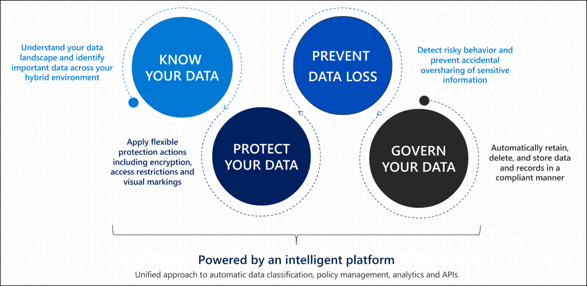

# 請參閱 Microsoft 365 中的 Microsoft 資訊保護。Microsoft Information Protection in Microsoft 365

>*[Microsoft 365 安全性與合規性的授權](/office365/servicedescriptions/microsoft-365-service-descriptions/microsoft-365-tenantlevel-services-licensing-guidance/microsoft-365-security-compliance-licensing-guidance)**[Licensing for Microsoft 365 Security & Compliance](/office365/servicedescriptions/microsoft-365-service-descriptions/microsoft-365-tenantlevel-services-licensing-guidance/microsoft-365-security-compliance-licensing-guidance)*

實施 Microsoft 資訊保護 (MIP) 可協助您探索、分類及保護敏感性資訊，無論這些資料儲存在某處在或傳輸中。Implement Microsoft Information Protection (MIP) to help you discover, classify, and protect sensitive information wherever it lives or travels.

MIP 功能隨附於 Microsoft 365 合規性中，並提供工具以 [了解您的資料](#know-your-data)、[保護您的資料](#protect-your-data)，以及[防止資料遺失](#prevent-data-loss)。MIP capabilities are included with Microsoft 365 Compliance and give you the tools to [know your data](#know-your-data), [protect your data](#protect-your-data), and [prevent data loss](#prevent-data-loss).

如需資料控管方式的相關資訊，請參閱 [Microsoft 365 中的 Microsoft 資訊控管](manage-Information-governance.md)。For information about governing your data, see [Microsoft Information Governance in Microsoft 365](manage-Information-governance.md).

## 了解您的資料Know your data

> [!NOTE]
> 如需在 Azure Purview 中分類資料和為資料加上標籤 (目前處於預覽) 的相關資訊，請參閱[在 Azure Purview 中自動為您的內容加上標籤](/azure/purview/create-sensitivity-label)。For information about classifying and labeling data in Azure Purview, currently in preview, see [Automatically label your content in Azure Purview](/azure/purview/create-sensitivity-label).

若要深入了解您的資料環境，並識別混合式環境中的重要資料，請使用下列功能：To understand your data landscape and identify important data across your hybrid environment, use the following capabilities:
 
|功能Capability|需要解決的問題是什麼？What problems does it solve?|快速入門Get started|
|:------|:------------|:--------------------|
|[敏感性資訊類型Sensitive information types](sensitive-information-type-learn-about.md)| 您可以使用內建或自訂的規則運算式或函數來識別敏感性資料。包括關鍵字、信賴等級和鄰近性的確切證據。Identifies sensitive data by using built-in or custom regular expressions or a function. Corroborative evidence includes keywords, confidence levels, and proximity.| [自訂內建的敏感性資訊類型Customize a built-in sensitive information type](customize-a-built-in-sensitive-information-type.md)|
|[可訓練分類器Trainable classifiers](classifier-learn-about.md)| 使用您感興趣的資料範例，而不是項目內的識別元素 (模式比對) 進行識別敏感性資料。Identifies sensitive data by using examples of the data you're interested in rather than identifying elements in the item (pattern matching). 您可以使用內建的分類器，或使用自己的內容訓練分類器。You can use built-in classifiers or train a classifier with your own content.| [開始使用可訓練分類器Get started with trainable classifiers](classifier-get-started-with.md) |
|[資料分類Data classification](data-classification-overview.md) | 貴組織中的項目圖形識別碼具有敏感度標籤、保留標籤，或已分類完成。A graphical identification of items in your organization that have a sensitivity label, a retention label, or have been classified. 您也可以使用這項資訊取得深入解析您的使用者對這些項目所採取的動作。You can also use this information to gain insights into the actions that your users are taking on these items. | [開始使用內容總管Get started with content explorer](data-classification-content-explorer.md)   [開始使用活動總管Get started with activity explorer](data-classification-activity-explorer.md) |

## 保護您的資料Protect your data

若要套用含有加密、存取限制和視覺標記的彈性保護動作，請使用下列功能：To apply flexible protection actions that include encryption, access restrictions, and visual markings, use the following capabilities:

|功能Capability|需要解決的問題是什麼？What problems does it solve?|快速入門Get started|
|:------|:------------|---------------------|
|[敏感度標籤Sensitivity labels](sensitivity-labels.md)| 應用程式、服務和裝置上的單一解決方案，可讓您的資料在組織內部和外部傳輸時進行標記和保護。A single solution across apps, services, and devices to label and protect your data as it travels inside and outside your organization.   範例案例：Example scenarios:   [管理 Office 應用程式的敏感度標籤Manage sensitivity labels for Office apps](sensitivity-labels-office-apps.md)  [加密文件和電子郵件Encrypt documents and emails](encryption-sensitivity-labels.md )  [套用和查看 Power BI 中的標籤Apply and view labels in Power BI](/power-bi/admin/service-security-apply-data-sensitivity-labels)    如需敏感度標籤的案例完整清單，請參閱 [開始使用文件]。For a comprehensive list of scenarios for sensitivity labels, see the Get started documentation.|[開始使用敏感度標籤 Get started with sensitivity labels](get-started-with-sensitivity-labels.md) |
|[Azure 資訊保護統一標籤用戶端Azure Information Protection unified labeling client](/azure/information-protection/rms-client/aip-clientv2)| 針對 Windows 電腦，擴充敏感度標籤以瞭解其他功能，包括從檔案瀏覽器和 PowerShell 中標記和保護所有檔案類型。For Windows computers, extends sensitivity labels for additional features and functionality that includes labeling and protecting all file types from File Explorer and PowerShell   範例其他功能：[Azure 資訊保護統一標記用戶端的自訂設定](/azure/information-protection/rms-client/clientv2-admin-guide-customizations)Example additional features: [Custom configurations for the Azure Information Protection unified labeling client](/azure/information-protection/rms-client/clientv2-admin-guide-customizations)| [Azure 資訊保護統一標籤用戶端系統管理員指南Azure Information Protection unified labeling client administrator guide](/azure/information-protection/rms-client/clientv2-admin-guide)|
|[雙重金鑰加密Double Key Encryption](double-key-encryption.md)| 在所有情況下，只有貴組織能解密受保護的內容，或因為法規要求，您必須在地理邊界內持有加密金鑰。Under all circumstances, only your organization can ever decrypt protected content or for regulatory requirements, you must hold encryption keys within a geographical boundary. | [部署雙重金鑰加密Deploy Double Key Encryption](double-key-encryption.md#deploy-dke)|
|[Office 365 郵件加密 (OME)Office 365 Message Encryption (OME)](ome.md)| 將傳送給任何裝置上任何使用者的電子郵件訊息和附加文件加密，以便只有授權的收件者能讀取電子郵件中的資訊。Encrypts email messages and attached documents that are sent to any user on any device, so only authorized recipients can read emailed information.    範例案例：[撤銷由進階郵件加密所加密的電子郵件](revoke-ome-encrypted-mail.md)Example scenario: [Revoke email encrypted by Advanced Message Encryption](revoke-ome-encrypted-mail.md) | [設定全新的郵件加密功能Set up new Message Encryption capabilities](set-up-new-message-encryption-capabilities.md)|
|[客戶金鑰服務加密Service encryption with Customer Key](customer-key-overview.md) | 防止未經授權的系統或人員檢視資料，並補充 Microsoft 資料中心中的 BitLocker 磁碟機加密。Protects against viewing of data by unauthorized systems or personnel, and complements BitLocker disk encryption in Microsoft datacenters. | [設定 Office 365 客戶金鑰Set up Customer Key for Office 365](customer-key-set-up.md)|
|[SharePoint 資訊版權管理 (IRM)SharePoint Information Rights Management (IRM)](set-up-irm-in-sp-admin-center.md#irm-enable-sharepoint-document-libraries-and-lists)|保護 SharePoint 清單和文件庫，以便當使用者取出文件時，下載的檔案受到保護，因此只有授權人員才能根據您指定的原則檢視和使用檔案。Protects SharePoint lists and libraries so that when a user checks out a document, the downloaded file is protected so that only authorized people can view and use the file according to policies that you specify. | [在 SharePoint 系統管理中心中設定資訊版權管理 (IRM)Set up Information Rights Management (IRM) in SharePoint admin center](set-up-irm-in-sp-admin-center.md)|
[版權管理連接器Rights Management connector](/azure/information-protection/deploy-rms-connector) |僅限使用 Exchange 或 SharePoint Server 的現有內部部署來部署，或執行 Windows Server 和檔案分類基礎結構的檔案伺服器 (FCI)。Protection-only for existing on-premises deployments that use Exchange or SharePoint Server, or file servers that run Windows Server and File Classification Infrastructure (FCI). | [部署 RMS 連接器的步驟Steps to deploy the RMS connector](/azure/information-protection/deploy-rms-connector#steps-to-deploy-the-rms-connector)
|[Azure 資訊保護統一標籤掃瞄器Azure Information Protection unified labeling scanner](/azure/information-protection/deploy-aip-scanner)| 探索、標記和保護駐留於內部部署資料存放區中的敏感性資訊。Discovers, labels, and protects sensitive information that resides in data stores that are on premises. | [設定和安裝 Azure 資訊保護統一標籤掃瞄器Configuring and installing the Azure Information Protection unified labeling scanner](/azure/information-protection/deploy-aip-scanner-configure-install)|
|[Microsoft 雲端 App 安全性Microsoft Cloud App Security](/cloud-app-security/what-is-cloud-app-security)| 探索、標記和保護位於雲端資料存放區中的敏感性資訊。Discovers, labels, and protects sensitive information that resides in data stores that are in the cloud. | [探索、分類、標記及保護儲存在雲端的管制資料及敏感性資料Discover, classify, label, and protect regulated and sensitive data stored in the cloud](/cloud-app-security/best-practices#discover-classify-label-and-protect-regulated-and-sensitive-data-stored-in-the-cloud)|
|[Microsoft 資訊保護 SDKMicrosoft Information Protection SDK](/information-protection/develop/overview#microsoft-information-protection-sdk)|將敏感度標籤延伸至第三方應用程式和服務。Extends sensitivity labels to third-party apps and services.     範例案例：[設定和取得敏感度標籤 (C++)](/information-protection/develop/quick-file-set-get-label-cpp)Example scenario: [Set and get a sensitivity label (C++)](/information-protection/develop/quick-file-set-get-label-cpp) |[Microsoft 資訊保護 (MIP) SDK 安裝和設定Microsoft Information Protection (MIP) SDK setup and configuration](/information-protection/develop/setup-configure-mip)|

## 防止資料遺失Prevent data loss

若要協助防止意外分享敏感性資訊，請使用下列功能：To help prevent accidental oversharing of sensitive information, use the following capabilities:

|功能Capability|需要解決的問題是什麼？What problems does it solve?|快速入門Get started|
|:------|:------------|:---------------------|
|[資料外洩防護Data loss prevention](dlp-learn-about-dlp.md)| 協助防止意外共用敏感性項目。Helps prevent unintentional sharing of sensitive items. | [預設的 DLP 原則快速入門Get started with the default DLP policy](get-started-with-the-default-dlp-policy.md)|
|[端點資料外洩防護Endpoint data loss prevention](endpoint-dlp-learn-about.md)| 將 DLP 功能延伸到在 Windows 10 電腦上使用及共用的項目。Extends DLP capabilities to items that are used and shared on Windows 10 computers. | [開始使用端點資料外洩防護Get started with Endpoint data loss prevention](endpoint-dlp-getting-started.md)|
|[Microsoft 合規性延伸模組 (預覽)Microsoft Compliance Extension (preview)](dlp-chrome-learn-about.md) | 將 DLP 功能延伸至 Chrome 瀏覽器Extends DLP capabilities to the Chrome browser | [開始使用 Microsoft 合規性擴充功能 (預覽)Get started with the Microsoft Compliance Extension (preview)](dlp-chrome-get-started.md)|
|[Microsoft 365 資料外洩防護內部部署掃描器 (預覽)Microsoft 365 data loss prevention on-premises scanner (preview)](dlp-on-premises-scanner-learn.md)|將檔案活動的 DLP 監視以及這些檔案的保護動作延伸到內部部署檔案共用、SharePoint 資料夾和文件庫。Extends DLP monitoring of file activities and protective actions for those files to on-premises file shares and SharePoint folders and document libraries.|[開始使用 Microsoft 365 資料外洩防護內部部署掃描器 (預覽)Get started with Microsoft 365 data loss prevention on-premises scanner (preview)](dlp-on-premises-scanner-get-started.md)|
|[保護 Microsoft Teams 中聊天和頻道訊息中的敏感性資訊Protect sensitive information in Microsoft Teams chat and channel messages](dlp-microsoft-teams.md) | 將部分 DLP 功能延伸至 Teams 聊天和頻道訊息Extends some DLP functionality to Teams chat and channel messages | [了解 Microsoft Teams 中的預設資料外洩防護原則 (預覽)Learn about the default data loss prevention policy in Microsoft Teams (preview)](dlp-teams-default-policy.md)|

## 授權需求Licensing requirements

MIP 的授權需求取決於您使用的情況和功能，而不是針對本頁所列的每個功能設定授權需求。License requirements for MIP depend on the scenarios and features you use, rather than set licensing requirements for each capability listed on this page. 若要了解 MIP 的授權需求和選項，請參閱 Microsoft 365 授權文件中的[資訊防護](/office365/servicedescriptions/microsoft-365-service-descriptions/microsoft-365-tenantlevel-services-licensing-guidance/microsoft-365-security-compliance-licensing-guidance#information-protection)小節，並下載相關的 PDF 或 Excel。To understand your licensing requirements and options for MIP, see the [Information Protection](/office365/servicedescriptions/microsoft-365-service-descriptions/microsoft-365-tenantlevel-services-licensing-guidance/microsoft-365-security-compliance-licensing-guidance#information-protection) section from the Microsoft 365 licensing documentation, and download the related PDF or Excel.
