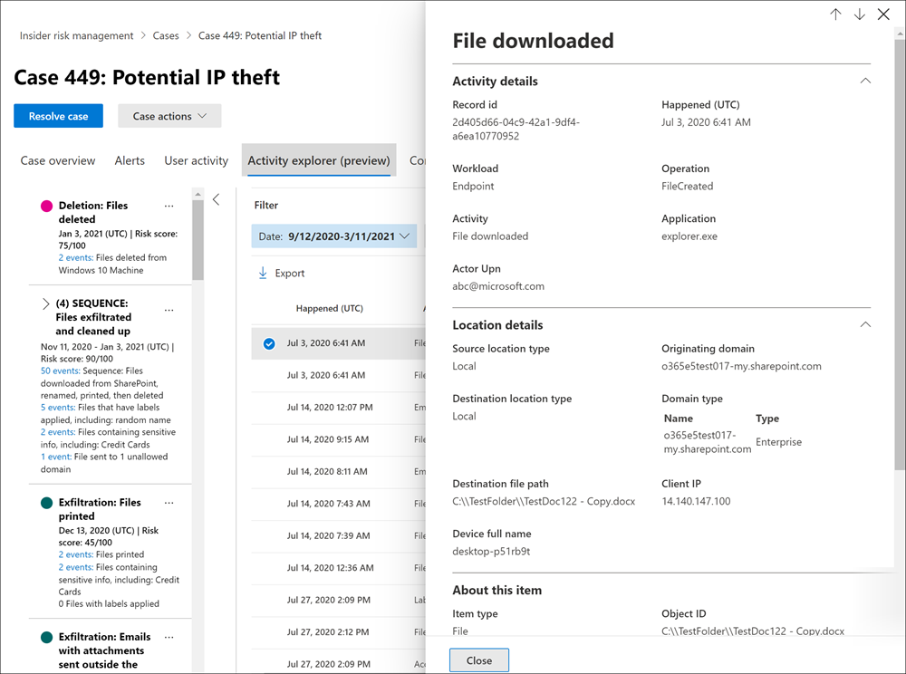

# 調查有問必答風險管理活動Investigate insider risk management activities

調查危險的使用者活動是最小化貴組織的有問必答風險的第一個重要步驟。Investigating risky user activities is an important first step in minimizing insider risks for your organization. 這些風險可能是產生來自「內幕風險管理」原則之警示的活動，或是由原則偵測到之活動的風險，但不會立即為使用者建立內部使用者風險管理提醒。These risks may be activities that generate alerts from insider risk management policies, or risks from activities that are detected by policies but do not immediately create an insider risk management alert for users. 您可以使用 **使用者活動報告 (預覽)** 或使用 **警示儀表板**，調查這些類型的活動。You can investigate these types of activities by using the **User activity reports (preview)** or with the **Alert dashboard**.

## 使用者活動報告 (預覽) User activity reports (preview)

使用者活動報告可讓您在定義的時段內，檢查特定使用者的活動，而不必將其暫時或明確指派給「內幕風險管理」原則。User activity reports allow you to examine activities for specific users for a defined time period without having to assign them temporarily or explicitly to an insider risk management policy. 在大部分的風險管理案例中，使用者會明確定義在原則中，而且它們可能會 (，取決於觸發事件) 與活動相關聯的風險分數。In most insider risk management scenarios, users are explicitly defined in policies, and they may have policy alerts (depending on triggering events) and risk scores associated with the activities. 但在某些情況下，您可能會想要檢查未明確定義原則中之使用者的活動。But in some scenarios, you may want to examine the activities for users that aren't explicitly defined in a policy. 這些使用者可能是您收到有關使用者和潛在風險活動的秘訣，或是一般不需要指派給內部人員風險管理原則的使用者。These may be users that you've received a tip about the user and potentially risky activities, or users that typically don't need to be assigned to an insider risk management policy.

在「內幕風險管理」**設定** 頁面上設定指示器之後，會偵測到與所選指示器相關聯之危險活動的使用者活動。After you've configured indicators on the insider risk management **Settings** page, user activity is detected for risky activity associated with the selected indicators. 您不需要設定使用者活動報告的原則，即可偵測組織中的使用者並舉報有風險的活動。You do not have to configure a policy for user activity reports to detect and report risky activities by users in your organization. 包含在使用者活動報告中的活動不需要觸發事件來顯示活動。Activities included in user activity reports do not require triggering events for the activities to be displayed. 這種設定表示，不論使用者是否有觸發事件或會產生警示，都可以查看使用者所有偵測到的活動。This configuration means that all detected activity for the user is available for review, regardless if it has a triggering event or if it creates an alert. 報表是以每位使用者為基礎建立，而且可以包含自訂90天期間的所有活動。Reports are created on a per-user basis and can include all activities for a custom 90-day period. 同一個使用者的多個報表不受支援。Multiple reports for the same user aren't supported.

檢查使用者的活動之後，調查人員可以以良性方式解除個別活動，共用或透過電子郵件傳送報告的連結與其他調查人員，或是選擇暫時或明確指派給「內幕風險管理」原則的使用者。After examining activities for a user, investigators can dismiss individual activities as benign, share or email a link to the report with other investigators, or choose to assign the user temporarily or explicitly to an insider risk management policy. 使用者必須被指派給「 *內幕風險管理調查* 人員」角色群組，以查看 [ **使用者活動報告** ] 頁面。Users must be assigned to the *Insider Risk Management Investigators* role group to view the **User activity reports** page.  

您可以在「內幕員工風險管理 **概述**」頁面上的 [**調查使用者活動**] 區段中，選取 [**管理報告**] 開始。You can get started by selecting **Manage reports** in the **Investigate user activity** section on the insider risk management **Overview** page. 若要查看使用者的活動，請先選取 [ **建立使用者活動報告** ]，然後在 [ **新增使用者活動報告** ] 窗格中完成下欄欄位：To view activities for a user, first select **Create user activity report** and complete the following fields in the **New user activity report** pane:

- **使用者**：依名稱或電子郵件地址搜尋使用者**User**: Search for a user by name or email address
- **開始日期**：使用 [行事曆] 控制項來選取使用者活動的開始日期。**Start date**: Use the calendar control to select the start date for user activities.
- **結束日期**：使用 [行事曆] 控制項來選取結束日期的使用者活動。**End date**: Use the calendar control to select the end date for user activities. 選取的結束日期必須大於從選取的開始日期的兩天后的兩天，且不得超過90天。The end date selected must be greater than two days after the selected start date and no greater than 90 days from the selected start date.
新的報表通常需要10個小時，才可供審閱。New reports typically take up to 10 hours before they are ready for review. 當報告準備好時，您會在 [使用者活動報告] 頁面上的 [**狀態**] 欄中看到 [*報告已就緒*]。When the report is ready, you'll see *Report ready* in the **Status** column on the User activity report page. 選取要查看詳細報告的使用者：Select the user to view the detailed report:

所選使用者的 **使用者活動報告** 包含 **使用者活動** 和 **活動瀏覽器** 索引標籤：The **User activity report** for the selected user contains the **User activity** and **Activity explorer** tabs:

- **使用者活動**：使用此圖表視圖調查活動，並查看順序中發生的潛在活動。**User activity**: Use this chart view to investigate activities and view potential activities that occur in sequences. 此索引標籤可讓您快速查看案例，包括所有活動的歷史時程表、活動詳細資料、案例中使用者目前的風險評分、風險事件的順序，以及可協助調查工作的篩選控制項。This tab is structured to enable quick review of a case, including a historical timeline of all activities, activity details, the current risk score for the user in the case, the sequence of risk events, and filtering controls to help with investigative efforts.
- **活動瀏覽器**： [ **活動流覽** ] 索引標籤會提供風險調查人員，其完整的分析工具可提供活動的詳細資訊。**Activity explorer**: The **Activity explorer** tab provides risk investigators with a comprehensive analytic tool that provides detailed information about activities. 透過活動瀏覽器，檢閱者可以快速查看偵測到風險的啟用時間表，並識別及篩選與提醒相關聯的所有風險活動。With the Activity explorer, reviewers can quickly review a timeline of detected risky activity and identify and filter all risk activities associated with alerts. 若要深入瞭解使用活動瀏覽器，請參閱本文稍後的 [ *活動流覽* ] 區段。To learn more about using the Activity explorer, see the *Activity explorer* section later in this article.

## 警示儀表板Alert dashboard

內部風險管理警示是由內部風險管理原則中定義的風險指示器自動產生。Insider risk management alerts are automatically generated by risk indicators defined in insider risk management policies. 這些警示為合規性分析師和調查人員提供目前風險狀態的完整檢視，並允許貴組織將發現的風險加以分類並採取行動。These alerts give compliance analysts and investigators an all-up view of the current risk status and allow your organization to triage and take actions for discovered risks. 根據預設，原則會產生一定數量的低、中和高嚴重性警示，但是您可以 [增加或減少警示量](insider-risk-management-settings.md#alert-volume) 以符合您的需求。By default, policies generate a certain amount of low, medium, and high severity alerts, but you can [increase or decrease the alert volume](insider-risk-management-settings.md#alert-volume) to suit your needs. 此外，您可以使用原則嚮導建立新的原則時，設定 [原則指示器的警示閾值](insider-risk-management-settings.md#indicator-level-settings-preview) 。Additionally, you can configure the [alert threshold for policy indicators](insider-risk-management-settings.md#indicator-level-settings-preview) when creating a new policy with the policy wizard.

查看「 [內部使用者風險管理」診斷程式的體驗影片影片](https://www.youtube.com/watch?v=KgmpxBLJLPI) ，瞭解提醒如何針對危險的活動提供詳細資料、內容和相關內容，以及如何讓調查程式更有效率。Check out the [Insider Risk Management Alerts Triage Experience video](https://www.youtube.com/watch?v=KgmpxBLJLPI) for an overview of how alerts provide details, context, and related content for risky activity and how to make your investigation process more effective.

「內部使用者風險 **警示」儀表板** 可讓您查看並處理由內部使用者風險原則所產生的警示。The insider risk **Alert dashboard** allows you to view and act on alerts generated by insider risk policies. 每個報告構件會顯示過去30天的資訊。Each report widget displays information for last 30 days.

- **需要檢查的警示總數**：會列出需要複查及會審的警示總數，包括依警示嚴重性的分解。**Total alerts that need review**: The total number of alerts needing review and triage are listed, including a breakdown by alert severity.
- **過去30天開啟的警示**：原則比對過去30天所建立的警示總數，依高、中和低警示嚴重性層級排序。**Open alerts over past 30 days**: The total number of alerts created by policy matches over the last 30 days, sorted by high, medium, and low alert severity levels.
- **解決提醒的平均時間**：有用警示統計資料的摘要：**Average time to resolve alerts**: A summary of useful alert statistics:
  - 解決高嚴重性警示的平均時間，以小時、天或月列出。Average time to resolve high severity alerts, listed in hours, days, or months.
  - 解決中嚴重性警示的平均時間，以小時、天或月列出。Average time to resolve medium severity alerts, listed in hours, days, or months.
  - 解決低嚴重性警示的平均時間，以小時、天或月列出。Average time to resolve low severity alerts, listed in hours, days, or months.

> [!NOTE]
> 內部風險管理使用內建警示節流，協助保護和最佳化您的風險調查與檢閱體驗。Insider risk management uses built-in alert throttling to help protect and optimize your risk investigation and review experience. 此節流可防範可能導致超原則警示的問題，例如錯誤的資料連線器或 DLP 原則。This throttling guards against issues that might result in an overload of policy alerts, such as misconfigured data connectors or DLP policies. 因此，系統可能會延遲顯示使用者的新警示。As a result, there might be a delay in displaying new alerts for a user.

## 警示狀態和嚴重性Alert status and severity

您可以將提醒分為下列其中一種狀態：You can triage alerts into one of the following statuses:

- 已 **確認**：已確認並指派給新的或現有案例的警示。**Confirmed**: An alert confirmed and assigned to a new or existing case.
- 已 **消除**：在會審程式中，警示被視為良性。**Dismissed**: An alert dismissed as benign in the triage process.
- **需要檢查**：尚未採取會審動作的新警示。**Needs review**: A new alert where triage actions have not yet been taken.
- **已解決**：屬於封閉式和已解決案例一部分的警示。**Resolved**: An alert that is part of a closed and resolved case.

警示風險分數會從數個風險活動指示器自動計算。Alert risk scores are automatically calculated from several risk activity indicators. 這些指示因素包括風險活動類型、活動發生的數量與頻率、使用者風險活動的記錄，以及可能會提升活動 seriousness 的活動風險。These indicators include the type of risk activity, the number and frequency of the activity occurrence, the history of user risk activity, and the addition of activity risks that may boost the seriousness of the activity. 警示風險分數會以程式設計方式指派每個警示的風險嚴重性等級，且無法自訂。The alert risk score drives the programmatic assignment of a risk severity level for each alert and cannot be customized. 如果警示仍未會審，且風險活動持續計入警示，風險嚴重性層級可能會增加。If alerts remain untriaged and risk activities continue to accrue to the alert, the risk severity level can increase. 風險分析人員和調查人員可以使用警示風險嚴重性，根據組織的風險原則及標準，協助會審警示。Risk analysts and investigators can use the alert risk severity to help triage alerts in accordance with your organization's risk policies and standards.

警示風險嚴重性層級如下：Alert risk severity levels are:

- **高嚴重性**：警示的活動和指示器會帶來重大的風險。**High severity**: The activities and indicators for the alert pose significant risk. 相關的風險活動對其他重要風險因素是嚴重、重複性和 corelate。The associated risk activities are serious, repetitive, and corelate strongly to other significant risk factors.
- **中度嚴重性**：警示的活動和指示器會帶來中等風險。**Medium severity**: The activities and indicators for the alert pose a moderate risk. 相關聯的風險活動為中度、頻繁，且與其他風險因素有一些相關。The associated risk activities are moderate, frequent, and have some correlation to other risk factors.
- **低嚴重性**：警示的活動和指示器會帶來輕微的風險。**Low severity**: The activities and indicators for the alert pose a minor risk. 相關的風險活動是次要的，較不經常的，而且不會 corelate 到其他重要的風險因素。The associated risk activities are minor, more infrequent, and do not corelate to other significant risk factors.

## 在警示儀表板上篩選警示Filter alerts on the Alert dashboard

根據貴組織中使用中內部風險管理原則的數量和類型，檢閱大量警示佇列可能會是一項挑戰。Depending on the number and type of active insider risk management policies in your organization, reviewing a large queue of alerts can be challenging. 使用警示篩選可協助分析員和調查人員依數個屬性排序警示。Using alert filters can help analysts and investigators sort alerts by several attributes. 若要在 [ **提醒] 儀表板** 上篩選警示，請選取 **篩選** 控制項。To filter alerts on the **Alerts dashboard**, select the **Filter** control. 您可以透過一或多個屬性來篩選警示：You can filter alerts by one or more attributes:

- **狀態**：選取一個或多個狀態值以篩選警示清單。**Status**: Select one or more status values to filter the alert list. 選項包括 *已確認*、*已解除*、*需要檢閱* 以及 *已解決*。The options are *Confirmed*, *Dismissed*, *Needs review*, and *Resolved*.
- **嚴重性**：選取一或多個警示風險的嚴重性等級以篩選警示清單。**Severity**: Select one or more alert risk severity levels to filter the alert list. 選項包括 *高*、*中* 和 *低*。The options are *High*, *Medium*, and *Low*.
- 偵測 **到的時間**：選取建立警示的開始和結束日期。**Time detected**: Select the start and end dates for when the alert was created.
- **原則**：選取一個或多個原則，以篩選所選取原則所產生的警示。**Policy**: Select one or more policies to filter the alerts generated by the selected policies.

## 警示儀表板上的搜尋警示Search alerts on the Alert dashboard

若要搜尋特定字詞的警示名稱，請選取 **搜尋** 控制項，然後輸入要搜尋的字詞。To search the alert name for a specific word, select the **Search** control and type the word to search. 搜尋結果會顯示任何包含搜尋中定義之文字的規則警示。The search results display any policy alert containing the word defined in the search.

## 會審警示Triage alerts

若要會審「內幕人員風險警示」，請完成下列步驟：To triage an insider risk alert, complete the following steps:

1. 在 [Microsoft 365 合規性中心](https://compliance.microsoft.com)中，移至 [**有問必答風險管理**]，然後選取 [**警示**] 索引標籤。In the [Microsoft 365 compliance center](https://compliance.microsoft.com), go to **Insider risk management** and select the **Alerts** tab.
2. 在 [ **警示] 儀表板** 上，選取您要會審的警示。On the **Alerts dashboard**, select the alert you want to triage.
3. 在 [ **警示詳細資料] 窗格** 上，您可以查看下列索引標籤並會審警示：On the **Alerts detail pane**, you can review the following tabs and triage the alert:
    - **摘要**：此索引標籤包含有關警示的一般資訊，可讓您確認警示並建立新的案例，或讓您解除通知。**Summary**: This tab contains general information about the alert and allows you to confirm the alert and create a new case or allows you to dismiss the alert. 它包含警示的目前狀態和警示風險嚴重性層級，列為 [ *高*]、[ *中*] 或 [ *低*]。It includes the current status for the alert and the alert risk severity level, listed as *High*, *Medium*, or *Low*. 如果未對警示進行會審，嚴重性層級可能會隨著時間而增加或減少。The severity level may increase or decrease over time if the alert is not triaged.
        - **(預覽) 會發生什麼事**：顯示活動評估期間內的前三個風險活動和原則符合性，包括與活動相關聯的侵犯類型及發生次數。**What happened (preview)**: Displays the top three risk activities and policy matches during the activity evaluation period, including the type of violation associated with the activity and the number of occurrences.
        - **使用者詳細資料**：顯示指派給警示之使用者的一般資訊。**User details**: Displays general information about the user assigned to the alert. 如果啟用匿名，則會匿名使用者名稱、電子郵件地址、別名和組織欄位。If anonymization is enabled, the username, email address, alias, and organization fields are anonymized.
        - **警示詳細資料**：包括從警示產生起的時間長度，會列出產生警示的原則，並會列出從警示產生的案例。**Alert details**: Includes the length of time since the alert was generated, the policies that generated the alert are listed, and the case generated from the alert is listed. 若為新的提醒， **案例** 欄位會顯示 None。For new alerts, the **Case** field displays None.
        - 偵測 **到內容 (預覽)**：包括與提醒的風險活動相關聯的內容，以及透過重要區域匯總活動事件。**Content detected (preview)**: Includes content associated with the risk activities for the alert and summarizes activity events by key areas. 選取 [活動] 連結會開啟活動瀏覽器，並顯示活動的其他詳細資料。Selecting an activity link opens the Activity explorer and displays additional details about the activity.
    - **使用者活動**：此索引標籤會顯示與提醒相關聯之使用者的活動歷程記錄。**User activity**: This tab displays the activity history for the user associated with the alert. 此項記錄包含與指派給此警示之原則之範本中所定義之風險指示器相關的其他警示和活動。This history includes other alerts and activities related to risk indicators defined in the template assigned to the policy for this alert. 這項歷史記錄可讓風險分析人員和調查人員在會審過程中針對員工採取任何過去的危險行為的考慮。This history allows risk analysts and investigators to factor in any past risky behavior for the employee as part of the triage process.
    - **動作**：每個警示均可使用下列動作：**Actions**: The following actions are available for each alert:
        - **開啟展開的視圖**：開啟 **活動瀏覽器** 儀表板。**Open expanded view**: Opens the **Activity explorer** dashboard.
        - **確認和建立案例**：使用此巨集指令，以確認並建立與使用者相關聯之所有警示的新案例。**Confirm and create case**: Use this action to confirm and create a new case for all the alerts associated with a user. 此動作會自動將警示狀態變更為 [已 *確認*]。This action automatically changes the alert status to *Confirmed*.
        - **解除通知**：使用此巨集指令可解除警示。**Dismiss alert**: Use this action to dismiss the alert. 此動作會將警示狀態變更為 [ *已解決*]。This action changes the alert status to *Resolved*.

## 活動瀏覽器 (預覽) Activity explorer (preview)

> [!NOTE]
> 在您的組織中使用此功能之後，可在 [警示管理] 區域中取得活動瀏覽器，以取得觸發事件的使用者。Activity explorer is available in the alert management area for users with triggering events after this feature is available in your organization.

活動瀏覽器會提供風險調查工具和分析員，其具有完整的分析工具，提供有關提醒的詳細資訊。The Activity explorer provides risk investigators and analysts with a comprehensive analytic tool that provides detailed information about alerts. 透過活動瀏覽器，檢閱者可以快速查看偵測到風險的啟用時間表，並識別及篩選與提醒相關聯的所有風險活動。With the Activity explorer, reviewers can quickly review a timeline of detected risky activity and identify and filter all risk activities associated with alerts. 若要在活動瀏覽器上篩選警示，請選取篩選控制項。To filter alerts on the Activity explorer, select the Filter control. 您可以根據警示的詳細資料窗格中列出的一個或多個屬性來篩選警示。You can filter alerts by one or more attributes listed in the details pane for the alert. 活動瀏覽器也支援可自訂的資料行，協助調查人員和分析人員著重于最重要資訊的儀表板。Activity explorer also supports customizable columns to help investigators and analysts focus the dashboard on the information most important to them.

若要使用 **活動瀏覽器**，請完成下列步驟：To use the **Activity explorer**, complete the following steps:

1. 在 Microsoft 365 合規性中心中，移至 [**有問必答風險管理**]，然後選取 [**警示**] 索引標籤。In the Microsoft 365 compliance center, go to **Insider risk management** and select the **Alerts** tab.
2. 在 [ **警示] 儀表板** 上，選取您要會審的警示。On the **Alerts dashboard**, select the alert you want to triage.
3. 在 [ **警示詳細資料] 窗格** 中，選取 [ **開啟展開的視圖**]。On the **Alerts detail pane**, select **Open expanded view**.
4. 在選取之警示的頁面上，選取 [ **活動流覽** ] 索引標籤。On the page for the selected alert, select the **Activity explorer** tab.

在 [活動瀏覽器] 中查看活動時，調查人員和分析員可以選取特定的活動，並開啟 [活動詳細資料] 窗格。When reviewing activities in the Activity explorer, investigators and analysts can select a specific activity and open the activity details pane. 此窗格會顯示調查人員和分析員在警示分析程式中所能使用之活動的詳細資訊。The pane displays detailed information about the activity that investigators and analysts can use during the alert triage process. 詳細資訊可能會提供警示的內容，並協助識別觸發警示之風險活動的完整範圍。The detailed information may provide context for the alert and assist with identifying the full scope of the risk activity that triggered the alert.

## 建立提醒案例Create a case for an alert

當警示經過評審及會審時，您可以建立新案例以進一步調查風險活動。As alert is reviewed and triaged, you can create a new case to further investigate the risk activity. 若要建立警示案例，請遵循下列步驟：To create a case for an alert, follow these steps:

1. 在 [Microsoft 365 合規性中心](https://compliance.microsoft.com)中，移至 [**有問必答風險管理**]，然後選取 [**警示**] 索引標籤。In the [Microsoft 365 compliance center](https://compliance.microsoft.com), go to **Insider risk management** and select the **Alerts** tab.
2. 在 [ **警示] 儀表板** 上，選取您要確認的警示，並建立新的案例。On the **Alerts dashboard**, select the alert you want to confirm and create a new case for.
3. 在 [**警示詳細資料] 窗格** 中，選取 [**動作**  >  **確認警示] & 建立案例**]。On the **Alerts details pane**, select **Actions** > **Confirm alerts & create case**.
4. 在 [ **確認警示及建立內部使用者風險案例** ] 對話方塊中，輸入案例的名稱，選取 [要新增為參與者的使用者]，然後新增批註（如適用）。On the **Confirm alert and create insider risk case** dialog, enter a name for the case, select users to add as contributors, and add comments as applicable. 批註會自動新增到案例中，做為案例備註。Comments are automatically added to the case as a case note.
5. 選取 [ **建立案例** ] 以建立新案例，或選取 [ **取消** ] 關閉對話方塊，而不建立案例。Select **Create case** to create a new case or select **Cancel** to close the dialog without creating a case.

在建立案例之後，調查人員和分析人員可以管理和操作案例。After the case is created, investigators and analysts can manage and act on the case. 如需詳細資訊，請參閱 [內部的風險管理案例](insider-risk-management-cases.md) 文章。For more information, see the [Insider risk management case](insider-risk-management-cases.md) article.
