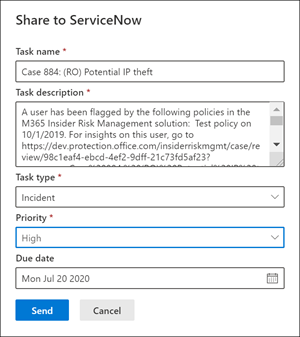

# 內部人員風險管理案例

案例是「內部使用者風險管理」的核心，可讓您深入調查您的原則中所定義之風險指示器所產生的問題。 在需要進一步採取動作來處理使用者的符合性相關問題的情況下，會從警示手動建立案例。 每個案例的範圍為單一使用者，而使用者的多個提醒可以新增至現有案例或新案例。 

在調查案例的詳細資料之後，您可以採取下列動作：

- 傳送使用者通知
- 解決案例是良性
- 與您的 ServiceNow 實例或電子郵件收件者共用案例
- 升級高級 eDiscovery 調查的案例

## 案例儀表板

「內幕風險管理 **案例」儀表板** 可讓您查看並處理案例。 儀表板上的每個報告構件會顯示過去30天的資訊。

- 使用 **案例** ：調查中的作用中案例總數。
- **過去30天的案例** ：已 *建立的案例總數，依作用* 中和 *關閉* 狀態排序。
- **統計資料** ：使用中案例的平均時間，以小時、天或月為單位。

案例佇列會列出您組織中所有作用中和關閉的案例，以及下列案例屬性的目前狀態：

- **案例名稱** ：案例名稱，在確認警示及案例建立時定義。  
- **狀態** ：案例的狀態為 [ *可用* ] 或 [ *已關閉* ]。
- **使用者** ：案例的使用者。 如果已啟用匿名，則會顯示匿名資訊。
- **開啟的時間大小寫** ：開啟案例後所經過的時間。
- **原則警示總數** ：在案例中包含的原則相符數目。 如果新增警示新增至案例，此數位可能會增加。
- **上次更新** ：自已經新增案例附注或變更案例狀態，已過去的時間。
- **上次更新者** ：上次更新案例的有問必答風險管理分析員或調查人員名稱。

使用 **搜尋** 控制項，針對特定文字搜尋案例名稱，並使用案例篩選器，依下列屬性來排序案例：

- 狀態
- 開啟、開始日期和結束日期的時間大小寫
- 上次更新、開始日期和結束日期

## 篩選案例

根據組織中使用中內幕風險管理原則的數量和類型，檢查大型案例佇列可能面臨挑戰性的困難。 使用案例篩選可協助分析員和調查人員依數個屬性排序案例。 若要在 **案例儀表板** 上篩選警示，請選取 **篩選** 控制項。 您可以透過一或多個屬性來篩選案例：

- **狀態** ：選取一個或多個狀態值以篩選案例清單。 選項為作用中和 *關閉**狀態* 。
- **開啟的時間大小寫** ：選取案例開啟時的開始和結束日期。
- **上次更新** ：選取案例更新的開始和結束日期。

## 調查案例

若要採取適當的糾正動作，深入調查「內幕風險管理」提醒是很重要的。 「內部使用者風險管理案例」是一種中央管理工具，可深入瞭解使用者風險的活動歷程記錄和警示詳細資料，並探索風險的內容和訊息。 風險分析師和調查人員也會使用案例來集中查看意見反應和記事，並處理案例解決。

選取案例會開啟案例管理工具，並可讓分析員和調查人員深入瞭解案例的詳細資料。

### 案例概述

[ **案例概述** ] 索引標籤會摘要案例的警示活動和風險層級歷程記錄。 

- **警示** 構件會顯示案例的原則相符專案，包括警示的狀態、警示風險嚴重性，以及偵測到警示的時間。 
- **風險層級的記錄** 圖表會顯示過去30天的使用者風險層級。 這張折線圖可讓分析員和調查人員在一段時間內快速查看整體使用者風險的趨勢。 
- **風險活動內容** 小小的摘要會摘要新增至案例中的資料類型和包含在警示中的內容。 此小工具可讓您在案例中的風險中，完整的資料和內容集的觀點。

「 **案例詳細資料** 」窗格可用於所有案例管理索引標籤，並匯總風險分析師和調查人員案例的詳細資料。 其包含下欄區域：

- **案例名稱** ：案例名稱（前面加上自動產生的案例順序編號），以及與第一個已確認的警示相符之原則範本相關聯的風險名稱。 
- **案例狀態** ：此案例的目前狀態為 [使用中 *] 或 [* *已關閉* ]。
- **使用者風險評分** ：案例中使用者的目前計算風險層級。 這個分數每24小時計算一次，並使用與使用者相關聯之所有使用中警示的警示風險分數。
- **警示：確認** 的使用者警示清單。
- **相關內容** ：依內容來源及類型排序的內容清單。 例如，在 SharePoint Online 中的案例警示內容，您可能會看到所列的資料夾或檔案名與案例中的警示風險活動相關聯。

### 警示

[ **警示** ] 索引標籤會匯總案例中所包含的目前警示。 新的提醒可能會新增至現有的案例，而且會在指派給其時，加入至 **警示** 佇列。 佇列中列出下列警示屬性：

- 狀態
- 嚴重性
- 偵測時間

從佇列中選取警示，以顯示 **警示詳細資料** 頁面。

使用搜尋控制項來搜尋特定文字的警示名稱，並使用警示篩選器，依下列屬性來排序案例：

- 狀態
- 嚴重性
- 偵測到的時間、開始日期和結束日期

使用篩選控制項，依數個屬性來篩選警示，包括：

- **狀態** ：選取一個或多個狀態值以篩選警示清單。 選項已 *確認* 、 *解除* 處理、 *需要複查* 及 *解決* 。
- **嚴重性** ：選取一或多個警示風險的嚴重性等級以篩選警示清單。 選項為 [ *高* ]、[ *中* ] 和 [ *低* ]。
- 偵測 **到的時間** ：選取建立警示的開始和結束日期。
- **原則** ：選取一個或多個原則，以篩選所選取原則所產生的警示。

### 使用者活動

[ **使用者活動** ] 索引標籤是一種最強大的工具，可用來分析內部的風險管理解決方案案例。 此索引標籤可讓您快速查看案例，包括所有提醒的歷史時程表、所有預警詳細資料、案例中使用者目前的風險評分，以及要採取有效行動以在案例中包含風險的控制項。

1. **日期和時段篩選** ：根據預設，在案例中確認的最後六個月的預警會顯示在 [使用者活動] 圖表中。 您可以使用 [圖表] 視窗的兩個端點上的滑塊控制項，或是在 [圖表篩選] 控制項中定義特定的開始和結束日期，輕鬆地篩選圖表視圖。
2. **風險警示活動和詳細資料** ：風險活動會在使用者活動圖中以色彩氣泡的方式顯示。 建立氣泡是針對不同類別的風險和氣泡大小，與類別的風險活動數目成正比。 選取氣泡以顯示每個風險活動的詳細資料。 詳細資料包括：
    - 風險活動的 **日期** 。
    - **風險活動類別** 。 例如， *電子郵件 (s) 與在組織或檔案之外傳送的附件* *() 從 SharePoint 線上下載* 。
    - 警示的 **風險評分** 。 這個分數是警示風險嚴重性層級的數值分數。
    - 與警示相關的事件數目。 也可以使用與風險活動相關聯之每個檔案或電子郵件的連結。
3. **風險活動圖例** ：在 [使用者活動] 圖表的底部，使用色彩編碼的圖例可協助您快速判斷每個警示的風險類別。
4. **風險活動 chronology** ：會列出與案例相關聯之所有風險警示的完整 chronology，包括對應警示氣泡中所有可用的詳細資料。
5. **案例動作** ：解決案例的選項位於 [案例] 動作工具列上。 您可以解決案例、將電子郵件通知傳送給使用者，或為數據或使用者調查上報案例。

### 活動瀏覽器 (預覽) 

>[!IMPORTANT]
>在您的組織中有此功能的使用者的「案例管理」區域中，可以使用 [活動流覽] 索引標籤。

[ **活動流覽** ] 索引標籤可讓風險分析人員和調查人員查看與風險警示相關的活動詳細資料。 例如，在案例管理動作中，調查人員和分析員可能需要查看與案例相關聯的所有風險活動，以取得詳細資訊。 透過 **活動瀏覽器** ，檢閱者可以快速查看偵測到風險的啟用時間表，並識別及篩選與提醒相關聯的所有風險活動。

如需活動瀏覽器的詳細資訊，請參閱「 [內幕人員風險管理提醒](insider-risk-management-alerts.md#activity-explorer-preview) 」文章。

### 內容瀏覽器

[ **內容瀏覽器** ] 索引標籤可讓風險分析人員和調查人員檢查與風險警示相關聯之所有個別檔案和電子郵件的副本。 例如，如果當使用者從 SharePoint 下載成百上千個檔案，且該活動觸發一個原則警示時，就會建立警示，並從原始的儲存來源中捕獲並複製該警示的所有已下載檔案至「有問必答風險管理案例」。

內容瀏覽器是強大的工具，具有基本及高級搜尋及篩選功能。 若要深入瞭解使用內容瀏覽器，請參閱「 [內幕風險管理」內容瀏覽器](insider-risk-management-content-explorer.md)。

### 案例備註

案例中的「 **案例** 觀點」索引標籤是風險分析師和調查人員在案例中共用批註、意見反應及深入資訊的位置。 附注會永久新增至案例，而且在儲存記事之後無法編輯或刪除。 當案例是從警示建立時，在 [ **確認警示] 和 [建立內部會員風險案例** ] 對話方塊中輸入的批註，會自動新增為案例記事。

案例記事儀表板會以建立附注的使用者顯示附注，以及在儲存注解後所經過的時間。 若要搜尋特定關鍵字的 case 附注文字欄位，請使用 case 儀表板上的 [ **搜尋** ] 按鈕，然後輸入特定的關鍵字。

若要將附注新增至案例：

1. 在 [Microsoft 365 規範中心](https://compliance.microsoft.com)，移至「 **內幕人員風險管理** 」，然後選取 [ **案例** ] 索引標籤。
2. 選取案例，然後選取 [ **案例備** 忘] 索引標籤。
3. 選取 [ **新增案例附注** ]。
4. 在 [ **新增案例附注** ] 對話方塊中，輸入案例的附注。 選取 [ **儲存** ]，將附注新增至案例，或選取 [ **取消** 關閉] 而不將附注儲存至案例。

### 貢獻

案例中的 [ **Contributors** ] 索引標籤是風險分析人員和調查人員可以在案例中新增其他檢閱者的地方。 預設值，所有指派「 **內部使用者風險管理分析員** 」和「 **內部使用者風險管理調查員** 」角色的使用者，都會列為投稿者，每個使用中和封閉式案例。

所有內幕用的風險管理案例都必須以適當的存取控制來管理，以維護調查的機密性和完整性。 為了協助維護案例的存取控制，使用者會被指派兩種類型的存取權之一：

- **永久存取** ：當案例是從警示建立時，系統會自動將永久存取權授與擁有者 **風險管理分析員** 和 **內部使用者風險管理調查** 人員角色。 永久存取授與案例生命週期的「完全控制」許可權，並授與新增其他案例貢獻者的能力。
- **暫時存取** ：只有具有案例永久存取權的參與者才能將臨時存取權授與使用者。 一般會將此存取等級授與需要將記事新增至案例的使用者。 具有暫時存取權的參與者具有所有案例管理控制，除了：
    - 確認或關閉提醒的許可權
    - 編輯案例的參與者的許可權
    - 在內容瀏覽器中查看檔案和郵件的許可權

若要將參與者新增至案例：

1. 在 [Microsoft 365 規範中心](https://compliance.microsoft.com)，移至「 **內幕人員風險管理** 」，然後選取 [ **案例** ] 索引標籤。
2. 選取案例，然後選取 [ **Contributors** ] 索引標籤。
3. 選取 [ **新增投稿** 人]。
4. 在 [ **新增參與者** ] 對話方塊中，開始輸入您想要新增的使用者名稱，然後從 [建議的使用者] 清單中選取使用者。 此清單是由您租使用者訂閱的 Azure Active Directory 產生。
5. 在 [ **新增參與者** ] 對話方塊中，選取參與者的訪問層級。 您可以選取 [ **永久** ] 或 [ **暫** 存檔]。
6. 選取 [ **新增** ]，將使用者新增為投稿者，或選取 [ **取消** ] 關閉對話方塊，而不將使用者新增為參與者。

## 案例動作

風險分析師和調查人員可以採取多種方法中的動作採取動作，具體取決於案例的嚴重性、使用者風險的記錄，以及組織的風險指導方針。 在某些情況下，您可能需要將案例升級至使用者或資料調查，以與組織的其他區域共同作業，以及深入瞭解風險活動。 有問必答風險管理與其他 Microsoft 365 合規性解決方案緊密整合，以協助您進行端對端的解決方案管理。

### 傳送電子郵件通知

在大多數情況下，建立有問必答風險警示的使用者動作為無意或無意。 透過電子郵件傳送提醒通知給使用者，是一種有效的案例審閱和動作的方式，也就是提醒使用者公司原則或讓他們參加複習訓練的方法。 通知會從您為您的內部使用者風險管理基礎結構 [所建立的通知範本](insider-risk-management-notices.md) 產生。

請務必記住，將電子郵件通知傳送給使用者 * 不 *_會_* 將案例解析為 _Closed *。 在某些情況下，您可能想要在將通知傳送給使用者之後，保留案例開啟，以尋找其他風險活動，而不需要開啟新案例。 如果您想要在傳送通知之後解決案例，您必須在傳送通知之後，選取 [ **解決案例** ] 做為後續步驟。

若要將通知傳送給指派案例的使用者：

1. 在 [Microsoft 365 規範中心](https://compliance.microsoft.com)，移至「 **內幕人員風險管理** 」，然後選取 [ **案例** ] 索引標籤。
2. 選取案例，然後選取 [案例動作] 工具列上的 [ **傳送電子郵件通知** ] 按鈕。
3. 在 [ **傳送電子郵件通知** ] 對話方塊中，選取 [ **選擇公告範本** ] 下拉式清單，以選取公告的公告範本。 這種選取範圍預先填滿通知中的其他欄位。
4. 視需要複查 [注意事項] 欄位及更新。 這裡輸入的值會覆寫範本上的值。
5. 選取 [ **傳送** ]，將通知傳送給使用者，或選取 [ **取消** ] 關閉對話方塊，而不將通知傳送給使用者。 所有已傳送的通知都會新增至 **案例記事** 儀表板上的「案例記事」佇列。

### 升級以進行調查

在使用者風險活動需要進行其他法律考評的情況下，升級案例以進行使用者調查。 此次上報會在您的 Microsoft 365 組織中開啟新的高級 eDiscovery 案例。 Advanced eDiscovery 提供端對端的工作流程，可保留、收集、審閱、分析和匯出回應組織內部和外部法律調查的內容。 它也可讓您的法律小組管理整個法律封存通知工作流程，以與案例中的保管人進行通訊。 在從內幕風險管理案例建立的高級 eDiscovery 案例中指派檢閱者做為保管人，可協助您的法律小組採取適當的動作和管理內容保留。 若要深入了解進階電子文件探索案例，請參閱[ Mcrosoft 365 中的進階電子文件探索概觀](overview-ediscovery-20.md)。

若要將案例升級為使用者調查：

1. 在 [Microsoft 365 規範中心](https://compliance.microsoft.com)，移至「 **內幕人員風險管理** 」，然後選取 [ **案例** ] 索引標籤。
2. 選取案例，然後選取 [案例動作] 工具列上的 [ **呈報以進行調查** ] 按鈕。
3. 在 [ **升級以進行調查** ] 對話方塊中，輸入新使用者調查的名稱。 如有需要，請輸入有關案例的備註，然後選取 [ **呈報** ]。
4. 視需要複查 [注意事項] 欄位及更新。 這裡輸入的值會覆寫範本上的值。
5. 選取 [ **確認** ] 以建立使用者調查案例，或選取 [ **取消** ] 關閉對話方塊，而不建立新的使用者調查案例。

當「內幕風險管理案例」升級至新的使用者調查案例之後，您可以在 Microsoft 365 規範中心的 **eDiscovery**  >  **Advanced** 區域中查看新案例。

### 在案例中以 Power 自動化流程執行自動化工作

使用建議的電源自動流程，風險調查人員和分析員可以快速採取下列動作：

- 在內部使用者風險案例中，向來自人力資源或公司的使用者要求資訊
- 使用者擁有「內幕風險警示」時通知管理員
- 新增行事曆提醒以追蹤現有的有問必答風險案例

若要針對內幕風險管理案例執行、管理或建立電源自動化流程，請執行下列動作：

1. 選取 [案例動作] 工具列上的 [ **自動** ]。 
2. 選擇 [電源自動化流程] 以執行，然後選取 [ **執行流程** ]。 
3. 流程完成後，請選取 [ **完成** ]。

若要深入瞭解「內部人員風險管理」的 Power 自動化流程，請參閱「 [內幕人員風險管理」設定快速](insider-risk-management-settings.md#power-automate-flows-preview)入門。

### 為案例查看或建立 Microsoft 團隊團隊

在 [設定] 中啟用「對內幕人員風險管理的 Microsoft 團隊整合」時，會在每次確認提醒並建立案例時，自動建立 Microsoft 團隊團隊。 風險調查人員和分析師可以在案例動作工具列上，選取 [ **View Microsoft 團隊小組** ]，快速開啟 Microsoft 團隊，並直接流覽至小組以取得案例。

在啟用 Microsoft Team 整合之前開啟的案例，風險調查人員和分析員可以在案例動作工具列上，選取 [ **建立 Microsoft 團隊小組** ]，以在案例中建立新的 microsoft 團隊小組。

當解決案例時，關聯的 Microsoft 團隊會自動封存 (隱藏，並將其變成隻讀) 。

若要深入瞭解 Microsoft 球隊的內幕人士風險管理，請參閱「 [內幕人員風險管理設定」快速](insider-risk-management-settings.md#microsoft-teams-preview)入門。

### 分享案例

共用內部使用者風險管理案例，可讓風險調查人員和分析員輕鬆與組織中的其他合規性專案關係人進行共同作業。 您可以使用「案例管理」區域中的外部利益關係人，快速分享內部使用者風險管理案例的連結。 若要從連結存取「內部使用者風險管理案例」，必須在任何「內幕風險管理」角色群組中包含專案關係人。

>[!NOTE]
>ServiceNow 預覽會在 30 2020 年11月結束，而且不會繼續進行。 感謝您的意見反應和支援，我們會決定接下來的步驟。

可使用的共用選項如下：

- **ServiceNow** ：為您的 microsoft 365 組織設定 microsoft 365 ServiceNow 連接器之後，您可以輕鬆地分享案例的連結、開啟事件，或是向您的 ServiceNow 組織要求變更。 若要與 ServiceNow 共用案例，請 **Share**  >  從 [案例] 動作中選取 [共用] **ServiceNow** 。 ServiceNow 與內幕風險管理的整合支援包含下列案例資訊和動作：
    - **任務名稱** ：新 ServiceNow 任務的名稱。
    - 工作 **描述** ：新增 ServiceNow 任務的描述。 此可編輯的描述欄位會自動包含「內幕風險管理案例」的連結。
    - 工作 **類型** ：新 ServiceNow 任務的工作類型，也就是 *事件* 或 *變更要求* 的任務類型。
    - **Priority** ：新 ServiceNow 工作的優先順序，也就是 *規劃* 、 *低* 、 *適中* 、 *高* 或 *嚴重* 。
    - **到期日** ：所要求的完成 ServiceNow 任務的日期。

- **電子郵件** ：共用電子郵件中的「內幕人員風險管理案例」連結。 您可以選擇使用此共用選項的任何本機設定的電子郵件用戶端。 若要與電子郵件共用案例連結， **Share** 請選取  >  [從案例動作工具列共用 **電子郵件** ]。
- **複製連結** ：複製「內部使用者風險管理」案例的連結到您的剪貼簿。 若要將案例連結複製到您的剪貼 **Share** 簿，請選取  >  [案例動作] 工具列中的 [共用 **副本** ] 連結。

### 解決案例

風險分析師和調查人員完成其複查和調查之後，就可以解決案例中目前所包含的所有警示。 解決案例會新增解決方式分類、將案例狀態變更為 [ *已關閉* ]，而且解決動作原因會自動新增至 **案例記事** 儀表板上的「案例記錄」佇列。 案例的解決方法如下：

- **良性** ：針對原則相符警示評估為低風險、非嚴重或誤報的情況分類。
- 已 **確認的原則違規** ：針對原則相符警示的分類，評估為危險、嚴重或惡意目的的結果。

解決案例：

1. 在 [Microsoft 365 規範中心](https://compliance.microsoft.com)，移至「 **內幕人員風險管理** 」，然後選取 [ **案例** ] 索引標籤。
2. 選取案例，然後選取 [案例動作] 工具列上的 [ **解決案例** ] 按鈕。
3. 在 [ **解析案例** ] 對話方塊中，選取 [ **解析為** 下拉式清單] 控制項，以選取案例的解決方法分類。 選項是 **良性** 或已 **確認的原則違規** 。
4. 在 [ **解析案例** ] 對話方塊的 [ **採取動作** ] 文字欄位中，輸入解決方法分類的原因。
5. 選取 [ **解決** ] 以關閉案例，或選取 [ **取消** ] 關閉對話方塊，而不解析案例。
