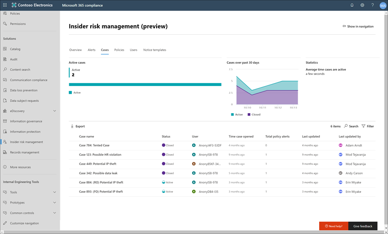
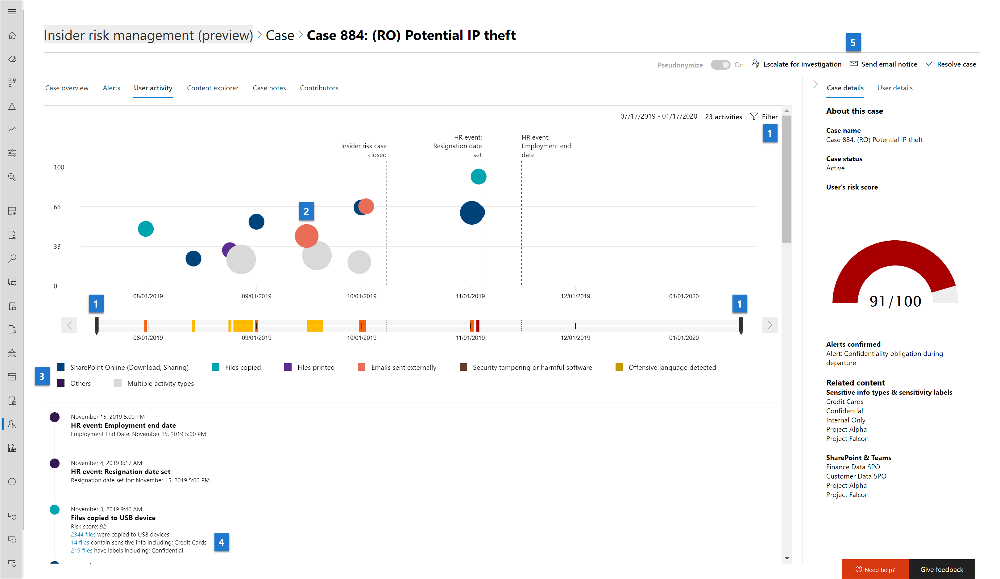
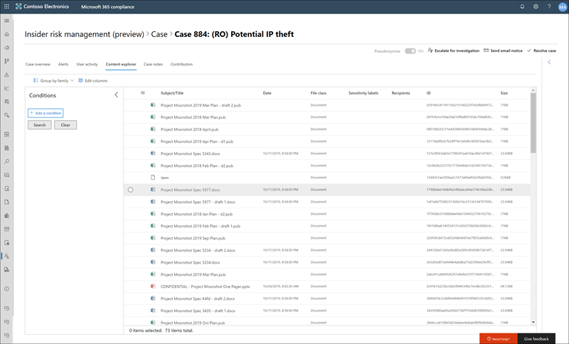

# 測試人員風險管理的情況下 （預覽）Insider risk management cases (preview)

案例的測試人員風險管理核心且可讓您深度調查，並採取相應動作在您的原則中定義的風險標記所產生的問題。Cases are the heart of insider risk management and allow you to deeply investigate and take action on issues generated by risk indicators defined in your policies. 從提醒進一步動作才能解決規範相關問題的員工在情況中以手動方式建立的情況。Cases are manually created from alerts in the situations where further action is needed to address a compliance-related issue for an employee. 每個案例的範圍限定為一位員工和員工的多個提醒可新增至現有案例或新的案例。Each case is scoped to a single employee and multiple alerts for the employee can be added to an existing case or to a new case. 之後調查案例的詳細資訊，您可以採取動作所傳送的員工通知之外，解析為無害，或途徑案例資料或員工調查。After investigating the details of a case, you can take action by sending the employee a notice, resolving the case as benign, or escalating to a data or employee investigation.

## Case 儀表板Case dashboard

測試人員風險管理**的情況下儀表板**可讓您檢視，並採取相應動作的情況。The insider risk management **Cases dashboard** allows you to view and take action on cases. 儀表板上的每個 [報告] 小工具顯示過去 30 天內的資訊。Each report widget on the dashboard displays information for last 30 days.

- **作用中的情況下**： 作用中的情況下，將正在調查的總數。**Active cases**: The total number of active cases under investigation.
- **過去 30 天的情況下**： 建立總數的情況下，排序*使用中*並*已關閉*的狀態。**Cases over past 30 days**: The total number of cases created, sorted by *Active* and *Closed* status.
- **統計資料**： 平均的作用中的情況下，列在小時、 數天或每個月的時間。**Statistics**: Average time of active cases, listed in hours, days, or months.

Case 佇列會列出您的組織，除了下列案例屬性的目前狀態的所有作用中及已關閉案例：The case queue lists all active and closed cases for your organization, in addition to the current state of the following case attributes:

- **案例名稱**： 的情況下，名稱定義當確認警示和建立這種情況。**Case name**: The name of the case, defined when an alert is confirmed and the case is created.  
- **狀態**： 的情況下，*使用中*] 或 [*關閉*狀態。**Status**: The status of the case, either *Active* or *Closed*.
- **使用者**： 員工的案例。**User**: The employee for the case.
- **開啟時間案例**： 已過這種情況已開啟的時間。**Time case opened**: The time that has passed since the case was opened.
- **總原則會發出警示**： 這種情況中包含的原則相符項目數目。**Total policy alerts**: The number of policy matches included in the case. 如果新的提醒新增至這種情況，可能會增加此數字。This number may increase if new alerts are added to the case.
- **上次更新**： 時間後已過已新增的情況下，請注意，或變更大小寫的狀態。**Last updated**: The time that has passed since there has been an added case note or change in the case state.
- **上次更新**： 測試人員風險管理分析師 」 或 「 上次更新這種情況的調查的名稱。**Last updated by**: The name of the insider risk management analyst or investigator that last updated the case.

使用**搜尋**控制，以搜尋特定的文字的大小寫名稱及使用案例篩選來排序的情況下所設定的下列屬性：Use the **Search** control to search case names for specific text and use the case filter to sort cases by the following attributes:

- 狀態Status
- 開啟、 開始日期和結束日期的時間案例Time case opened, start date, and end date
- 上次更新，開始日期和結束日期Last updated, start date, and end date

## 調查案例Investigate a case

測試人員風險管理警報深入查看務必採取適當的更正動作。Deeper investigation into insider risk management alerts is critical to taking proper corrective actions. 測試人員風險管理的情況下是中央管理工具，以深入探討深員工風險的活動歷程記錄和警示的詳細資訊，並探索內容和訊息公開風險。Insider risk management cases are the central management tool to dive deeper into employee risk activity history and alert details, and to explore the content and messages exposed to risks. 風險分析師和現場也使用情況下，集中管理檢閱意見反應及備忘稿並處理案例的解決方案。Risk analysts and investigators also use cases to centralize review feedback and notes and to process case resolution. 

選取的情況下開啟的專案管理工具，並允許分析師和現場深入探究案例的詳細資料。Selecting a case opens the case management tools and allows analysts and investigators to dig into the details of cases.

### 案例概觀Case overview

**案例概觀**] 索引標籤摘要警示活動] 和 [風險層級歷程記錄的大小寫。The **Case overview** tab summarizes the alert activity and risk level history for the case. [**提醒**] 小工具顯示的情況下，包括的提醒，警示風險的重要性，狀態的原則相符項目及偵測到的警示時。The **Alerts** widget shows the policy matches for the case, including the status of the alert, the alert risk severity, and when the alert was detected. **風險層級的歷程記錄**圖表顯示過去 30 天內的使用者風險層級。The **Risk level history** chart displays the user risk level over the last 30 days. 折線圖允許分析師和現場若要快速查看經過一段時間的 [整體使用者風險中的趨勢。The line chart allows analysts and investigators to quickly see the trend in overall user risk over time. **風險的活動內容**] 小工具彙總資料和提醒新增至案例中所包含的內容類型。The **Risk activity content** widget summarizes the types of data and content contained in alerts added to the case. 此 widget 提供全面檢視，整個資料和風險的情況下設定的內容。This widget gives an all-up view of the entire data and content set at risk in the case.

**案例的詳細資料**窗格是可以在所有案例管理索引標籤上，而且風險分析師和現場摘要案例的詳細資訊。The **Case details** pane is available on all case management tabs and summarizes the case details for risk analysts and investigators. 它包括下列區域：It includes the following areas:

- **案例名稱**： 的情況下，自動產生大小寫的順序編號與第一個確認警示相符的原則範本相關聯的風險的名稱做為前置詞的名稱。**Case name**: The name of the case, prefixed with an autogenerated case sequence number and the name of the risk associated with the policy template that the first confirmed alert matches. 
- **大小寫的狀態**： 的情況下，*使用中*] 或 [*關閉*的目前狀態。**Case status**: The current status of the case, either *Active* or *Closed*.
- **使用者風險分數**： 目前的計算案例之使用者的風險層級。**User's risk score**: The current calculated risk level of the user for the case. 此分數的計算每隔 24 小時，並使用從使用者相關聯的所有作用中警示警示風險分數。This score is calculated every 24 hours and uses the alert risk scores from all active alerts associated to the user.
- **確認提醒**： 確認案例之使用者的警示的清單。**Alerts confirmed**: List of alerts for the user confirmed for the case.
- **風險的內容**： 清單中的內容，依內容來源和類型。**Content at risk**: List of content, sorted by content sources and types. 例如，對於 SharePoint Online 中的案例警示內容，您可能會看到資料夾或列出與案例中警示的風險活動相關聯的檔案名稱。For example, for case alert content in SharePoint Online, you may see folder or file names listed that are associated with the risk activity for alerts in the case.

### 警示Alerts

[**提醒**] 索引標籤摘要說明這種情況中包含目前提醒。The **Alerts** tab summarizes the current alerts included in the case. 新警示可能會加入至現有的案例，以及他們加入至**警示**佇列為它們指派給。New alerts may be added to an existing case and they will be added to the **Alert** queue as they are assigned. 屬性會以下列提醒列出佇列：The following alert attributes are listed the queue:

- 狀態Status
- 嚴重性Severity
- 偵測到的時間Time detected

從佇列，以顯示 [**警示的詳細資料**] 頁面上，選取 [警示。Select an alert from the queue to display the **Alert detail** page.

使用搜尋控制，以搜尋特定的文字的警示名稱及使用警示篩選來排序的情況下所設定的下列屬性：Use the search control to search alert names for specific text and use the alert filter to sort cases by the following attributes:

- 狀態Status
- 嚴重性Severity
- 偵測到，開始日期和結束日期時間Time detected, start date, and end date

### 使用者活動User activity

**使用者活動**] 索引標籤可以是下列其中一個最強大的工具，供內部風險分析和調查的情況下，測試人員風險管理解決方案中。The **User activity** tab is one of the most powerful tools for internal risk analysis and investigation for cases in the insider risk management solution. 此索引標籤的結構化若要啟用的情況下，包括所有警示，所有警示詳細資料，使用者的目前風險分數歷史時間表控制項採取有效行動包含在這種情況的風險與案例中，快速檢閱。This tab is structured to enable quick review of a case, including a historical timeline of all alerts, all alerts details, the current risk score for the user in the case, and controls to take effective action to contain the risks in the case.

1. **日期和視窗時間篩選**： 根據預設，在 [使用者] 活動圖表中顯示提醒的情況下確認過去六個月。**Date and window time filters**: By default, the last six months of alerts confirmed in the case are displayed in the User activity chart. 您可以輕鬆地篩選與任一滑動軸控制措施於兩端圖表] 視窗中，或是藉由定義特定的開始和結束日期圖表篩選控制項中的 [圖表] 檢視。You can easily filter the chart view with either the slider controls at both ends of the chart window, or by defining specific start and end dates in the chart filter control.
2. **風險警示活動] 和 [詳細資料**： 風險的活動視覺上會顯示為 [使用者] 活動圖表中的彩色泡泡圖。**Risk alert activity and details**: Risk activities are visually displayed as colored bubbles in the User activity chart. 泡泡圖會建立不同類別的風險，且類別的風險活動數目成正比泡泡大小。Bubbles are created for different categories of risk and bubble size is proportional to the number of risk activities for the category. 選取 [顯示詳細資料針對每個風險的活動泡泡圖]。Select a bubble to display the details for each risk activity. 詳細資料包括：Details include:
    - 風險活動的**日期**。**Date** of the risk activity.
    - **風險的活動類別**中。The **risk activity category**. 例如， *Email(s) 傳送組織外部的附件*或*檔案下載從 SharePoint Online*。For example, *Email(s) with attachments sent outside the organization* or *File(s) downloaded from SharePoint Online*.
    - 警示**風險分數**。**Risk score** for the alert. 此分數是警示風險嚴重性層級的數字分數。This score is the numerical score for the alert risk severity level.
    - **檔案**或**電子郵件**與警示相關聯的數目。Number of **files** or **emails** associated with the alert. 連結至每個檔案或風險活動相關聯的電子郵件也是可用的。Links to each file or email associated with the risk activity is also available.
3. **風險的活動圖例**： 透過 [使用者] 活動圖表的底部，可識別的圖例可協助您快速地決定每個警示的風險類別。**Risk activity legend**: Across the bottom of the user activity chart, a color-coded legend helps you quickly determine risk category for each alert.
4. **風險的活動時序**： 列出所有與案例相關聯的風險警示完整時序，包括所有可用的對應的警示泡泡圖中的詳細資料。**Risk activity chronology**: The full chronology of all risk alerts associated with the case are listed, including all the details available in the corresponding alert bubble.
5. **大小寫的動作**： 案例動作] 工具列上的選項解決這種情況。**Case actions**: Options for resolving the case are on the case action toolbar. 您可以解決案例，將電子郵件通知傳送給該員工或提升資料或員工調查的案例。You can resolve a case, send an email notice to the employee, or escalate the case for a data or employee investigation.

### 內容總管Content explorer

[**內容的檔案總管**] 索引標籤可讓風險分析師和現場檢閱所有個別檔案和風險警示相關聯的電子郵件的副本。The **Content explorer** tab allows risk analysts and investigators to review copies of all individual files and email messages associated with risk alerts. 例如，如果警訊建立是員工從 SharePoint Online 數百個檔案下載到 USB 裝置和活動觸發原則警示時，所有警示的下載的檔案會擷取並複製到從測試人員風險管理案例原始的儲存體來源。For example, if an alert is created when an employee downloads hundreds of files from SharePoint Online to a USB device and the activity triggers a policy alert, all the downloaded files for the alert are captured and copied to the insider risk management case from original storage sources.

內容瀏覽器是功能強大的工具與基本和進階搜尋和篩選功能。The content explorer is a powerful tool with basic and advanced search and filtering features. 若要深入了解使用內容的檔案總管]，請參閱[測試人員風險管理內容檔案總管]](insider-risk-management-content-explorer.md)。To learn more about using the content explorer, see [Insider risk management content explorer](insider-risk-management-content-explorer.md).

### 案例的附註Case notes

在這種情況中的 [**案例的附註**] 索引標籤是其中風險分析師和現場共用註解、 意見反應，並深入了解關於其案例。The **Case notes** tab in the case is where risk analysts and investigators share comments, feedback, and insights about their work for the case. 備忘稿是永久性新增至案例及無法編輯或刪除該記事就儲存後。Notes are permanent additions to a case and cannot be edited or deleted after the note is saved. 從警示建立案例時，在 [**確認警示並建立測試人員風險案例**] 對話方塊中輸入的註解會自動新增為案例的附註。When a case is created from an alert, the comments entered in the **Confirm alert and create insider risk case** dialog are automatically added as a case note.

Case 備忘稿儀表板會顯示備忘稿的使用者，建立附註，且已過儲存記事的時間。The case notes dashboard displays notes by the user that created the note and the time that has passed since the note was saved. 若要搜尋的特定關鍵字的案例的附註文字欄位，使用案例的儀表板上的 [**搜尋**] 按鈕，然後輸入特定關鍵字。To search the case note text field for a specific keyword, use the **Search** button on the case dashboard and enter a specific keyword.

若要新增至案例的附註：To add a note to a case:

1. 在[Microsoft 365 合規性中心](https://compliance.microsoft.com)，移至**測試人員風險管理**並選取 [**案例**] 索引標籤。In the [Microsoft 365 compliance center](https://compliance.microsoft.com), go to **Insider risk management** and select the **Cases** tab.
2. 選取情況下，然後選取 [**大小寫的附註**] 索引標籤。Select a case, then select the **Case notes** tab.
3. 選取 [**新增案例的附註**。Select **Add case note**.
4. 在 [**新增案例附註**] 對話方塊中，輸入您案例的附註。On the **Add case note** dialog, type your note for the case. 選取 [**儲存]** 新增至案例的附註，或選取 [關閉**取消**」，而不儲存記事的大小寫。Select **Save** to add the note to the case or select **Cancel** close without saving the note to the case.

### 參與者Contributors

在這種情況中的 [**參與者**] 索引標籤是其中風險分析師和現場可以新增其他檢閱者的大小寫。The **Contributors** tab in the case is where risk analysts and investigators can add other reviewers to the case. 預設所有使用者都指派**測試人員風險管理分析師**，**測試人員風險管理現場**角色列為為每個作用中及已關閉案例的參與者。Be default, all users assigned the **Insider Risk Management Analysts** and **Insider Risk Management Investigators** roles are listed as contributors for each active and closed case.

必須管理所有測試人員風險管理案例，以適當的存取控制，以維護機密性與調查的完整性。All insider risk management cases must be managed with appropriate access controls in place to maintain confidentiality and integrity of the investigation. 為維持存取控制的情況下，使用者指派的存取權的兩種類型的其中一個案例：To help maintain access control of cases, users are assigned one of two types of access to cases:

- **永久存取**： 永久 access 會自動授與給與**測試人員風險管理分析師**和**測試人員風險管理現場**角色的使用者從警示建立這種情況時。**Permanent access**: Permanent access is automatically granted to users with the **Insider Risk Management Analysts** and **Insider Risk Management Investigators** roles when the case is created from an alert. 永久 access 會案例的完全控制權授與案例的存留時間，並授與新增其他案例參與者的功能。Permanent access grants full control of the case for the lifetime of the case and grants the ability to add other case contributors.
- **暫時存取**： 暫時存取只授與給使用者可以永久存取案例的參與者。**Temporary access**: Temporary access is only granted to users by contributors that have permanent access for the case. 一般而言，此存取層級是授與給使用者，必須將備忘稿新增至案例。Typically, this access level is granted to user that needs to add notes to a case. 使用暫時存取參與者需要以外的所有案例的管理控制：Contributors with temporary access have all case management control except:
    - 若要確認或關閉提醒的權限Permission to confirm or dismiss alerts
    - 若要編輯的情況下的參與者權限Permission to edit the contributors for cases
    - 若要檢視檔案和郵件內容的檔案總管中的權限Permission to view files and messages in the Content Explorer

若要將參與者新增至案例：To add a contributor to a case:

1. 在[Microsoft 365 合規性中心](https://compliance.microsoft.com)，移至**測試人員風險管理**並選取 [**案例**] 索引標籤。In the [Microsoft 365 compliance center](https://compliance.microsoft.com), go to **Insider risk management** and select the **Cases** tab.
2. 選取情況下，然後選取 [**參與者**] 索引標籤。Select a case, then select the **Contributors** tab.
3. 選取 [**新增參與者**。Select **Add contributor**.
4. 在 [**新增參與者**] 對話方塊中，開始輸入您想要新增，然後從建議的使用者清單中選取 [使用者的使用者名稱。On the **Add contributor** dialog, start typing the name of the user you want to add and then select the user from the suggested user list. 此清單是從您的租用戶訂閱的 Azure Active Directory 產生。This list is generated from the Azure Active Directory of your tenant subscription.
5. 在 [**新增參與者**] 對話方塊中，選取參與者的存取層級。On the **Add contributor** dialog, select the access level for the contributor. 您可以選取**永久**或**暫時**。You can select **Permanent** or **Temporary**.
6. 選取 [**新增**]，以將使用者新增為參與者或選取 [**取消**關閉對話方塊不需將使用者新增為參與者。Select **Add** to add the user as a contributor or select **Cancel** close the dialog without adding the user as a contributor.

## 大小寫的動作Case actions

風險分析師和現場可以採取動作的案例，其中一種方法，根據的情況下，該員工的風險和貴組織的風險指導方針的歷程記錄的嚴重性。Risk analysts and investigators can take action on a case in one of several methods, depending on the severity of the case, the history of risk of the employee, and the risk guidelines of your organization. 在某些情況下，您可能需要擴大員工或資料進行調查，貴組織的其他區域與共同作業，並深入分析風險的活動的案例。In some situations, you may need to escalate a case to an employee or data investigation to collaborate with other areas of your organization and to dive deeper into risk activities. 與其他 Microsoft 365 合規性功能，以協助您進行端對端解決方案管理緊密整合測試人員風險管理。Insider risk management is tightly integrated with other Microsoft 365 compliance features to help you with end-to-end resolution management.

### 傳送通知Send a notice

在大多數情況下，建立原則相符項目提醒的員工動作是不慎或意外。In most cases, employee actions that create policy match alerts are inadvertent or accidental. 將提醒通知傳送給透過電子郵件的員工是記載案例檢閱和巨集指令，以及方法來提醒公司原則內的員工，或指向複習訓練有效方法。Sending a reminder notice to the employee via email is an effective method for documenting case review and action, as well as a method to remind employees of corporate policies or point them to refresher training. 從測試人員風險管理基礎結構的 [[請注意您建立的範本](insider-risk-management-notices.md)產生通知。Notices are generated from [notice templates that you create](insider-risk-management-notices.md) for your insider risk management infrastructure.

請務必記住，傳送通知給員工***並不會***解析為*已關閉*的案例。It's important to remember that sending a notice to an employee ***does not*** resolve the case as *Closed*. 在某些情況下，您可能要讓案例之後將通知傳送給要尋找的額外的風險的活動而不需要開啟新的案例員工保持開啟。In some cases, you may want to leave a case open after sending a notice to an employee to look for additional risk activities without opening a new case. 如果您想要解決案例之後傳送通知之外，您必須選取**解決案例**和後續步驟之後傳送通知。If you want to resolve a case after sending a notice, you must select the **Resolve case** as a follow-on step after sending a notice.

若要將通知傳送給員工指派給案例：To send a notice to the employee assigned to a case:

1. 在[Microsoft 365 合規性中心](https://compliance.microsoft.com)，移至**測試人員風險管理**並選取 [**案例**] 索引標籤。In the [Microsoft 365 compliance center](https://compliance.microsoft.com), go to **Insider risk management** and select the **Cases** tab.
2. 選取 [情況下，然後選取案例動作] 工具列上的 [**傳送電子郵件通知**] 按鈕。Select a case, then select the **Send e-mail notice** button on the case action toolbar.
3. 在 [**傳送電子郵件通知**] 對話方塊中，選取 **[選擇通知範本**下拉式清單的控制項選取通知的通知範本。On the **Send e-mail notice** dialog, select the **Choose a notice template** dropdown control to select the notice template for the notice. 此選取項目預先填入通知上的其他欄位。This selection pre-fills the other fields on the notice.
4. 檢閱 [通知] 欄位，並更新為適當。Review the notice fields and update as appropriate. 在這裡輸入的值會覆寫在範本的值。The values entered here will override the values on the template.
5. 選取 [將通知傳送給該員工，或選取 [**取消**關閉對話方塊而不傳送通知給該員工的 [**傳送**]。Select **Send** to send the notice to the employee or select **Cancel** close the dialog without sending the notice to the employee. 所有傳送通知會新增至案例的附註佇列**案例的附註**儀表板上。All sent notices are added to the case notes queue on the **Case notes** dashboard.

### 針對調查向上呈報Escalate for investigation

向上呈報員工調查的其他合法檢閱其中所需的員工的風險活動的情況下的案例。Escalate the case for employee investigation in situations where additional legal review is needed for the employee's risk activity. 此呈報會在 Microsoft 365 組織中開啟新的進階電子文件探索案例。This escalation opens a new Advanced eDiscovery case in your Microsoft 365 organization. 進階電子文件提供的端對端工作流程，以保留、 收集、 檢閱、 分析和匯出回應您的組織內部和外部法律調查的內容。Advanced eDiscovery provides an end-to-end workflow to preserve, collect, review, analyze, and export content that's responsive to your organization's internal and external legal investigations. 它也可讓您管理整個合法持有通知工作流程與 custodians 參與案例進行通訊的法律小組。It also lets your legal team manage the entire legal hold notification workflow to communicate with custodians involved in a case. 指派檢閱者為進階 eDiscovery 中 custodian 從測試人員風險管理案例中建立的情況下可協助法律小組採取適當的動作和管理內容保留。Assigning a reviewer as a custodian in an Advanced eDiscovery case created from an insider risk management case helps your legal team take appropriate action and manage content preservation. 若要深入了解進階電子文件的情況下，請參閱[Microsoft 365 中的進階概觀 eDsicovery](overview-ediscovery-20.md)。To learn more about Advanced eDiscovery cases, see [Overview of Advanced eDsicovery in Microsoft 365](overview-ediscovery-20.md).

若要提升員工調查的案例：To escalate a case to an employee investigation:

1. 在[Microsoft 365 合規性中心](https://compliance.microsoft.com)，移至**測試人員風險管理**並選取 [**案例**] 索引標籤。In the [Microsoft 365 compliance center](https://compliance.microsoft.com), go to **Insider risk management** and select the **Cases** tab.
2. 選取情況下，然後選取 [**針對調查提報**工具列上的按鈕案例巨集指令。Select a case, then select the **Escalate for investigation** button on the case action toolbar.
3. 在 [**針對調查提報**] 對話方塊中，輸入新員工調查的名稱。On the **Escalate for investigation** dialog, enter a name for the new employee investigation. 如有需要輸入附註這種情況，然後選取 [**提報**。If needed, enter notes about the case and select **Escalate**.
5. 選取 [ **Confirm**建立員工調查案例或選擇 [**取消**] 以關閉 [] 對話方塊中，不會建立新的員工調查案例]。Select **Confirm** to create the employee investigation case or select **Cancel** to close the dialog without creating a new employee investigation case.

已經提報至新的員工調查案例的測試人員風險管理案例之後，您可以檢閱新的案例，在**eDiscovery** > Microsoft 365 合規性中心中的**進階**區域。After the insider risk management case has been escalated to a new employee investigation case, you can review the new case in the **eDiscovery** > **Advanced** area in the Microsoft 365 compliance center.

### 解決這種情況Resolve the case

風險分析師和現場其檢閱和調查完成之後，案例可以解析成目前包含在這種情況中的所有警示都採取動作。After risk analysts and investigators have completed their review and investigation, a case can be resolved to take action on all the alerts currently included in the case. 解決案例會新增解決方案分類、 案例狀態變更為 [*已關閉*，並解析動作原因會自動新增至案例的附註佇列**案例的附註**儀表板上。Resolving a case adds a resolution classification, changes the case status to *Closed*, and the resolution action reasons are automatically added to the case notes queue on the **Case notes** dashboard. 情況下會解析為一項：Cases are resolved as either:

- **Benign**： 的情況下原則符合警示的分類會評估為低風險，非嚴重或 false 正數。**Benign**: The classification for cases where policy match alerts are evaluated as low risk, non-serious, or false positive.
- **已確認原則違規**： 分類為風險、 嚴重的原則相符項目會發出警示評估所在的情況下或惡意意圖的結果。**Confirmed policy violation**: The classification for cases where policy match alerts are evaluated as risky, serious, or the result of malicious intent.

若要解決案例：To resolve a case:

1. 在[Microsoft 365 合規性中心](https://compliance.microsoft.com)，移至**測試人員風險管理**並選取 [**案例**] 索引標籤。In the [Microsoft 365 compliance center](https://compliance.microsoft.com), go to **Insider risk management** and select the **Cases** tab.
2. 選取情況下，然後選取**解決 case**工具列上的按鈕案例巨集指令。Select a case, then select the **Resolve case** button on the case action toolbar.
3. 在**解決案例**] 對話方塊中，選取**解析為**下拉式清單的控制項選取案例的解決方案分類。On the **Resolve case** dialog, select the **Resolve as** dropdown control to select the resolution classification for the case. 選項為**Benign**或**已確認原則違規情形**。The options are **Benign** or **Confirmed policy violation**.
4. 在**解決案例**] 對話方塊中，輸入 for 解析度分類的原因成**採取動作**的 [文字] 欄位。On the **Resolve case** dialog, enter the reasons for the resolution classification in the **Action taken** text field.
5. 選取 [**解決**] 以關閉這種情況，或選取 [**取消**關閉對話方塊沒有解決這種情況。Select **Resolve** to close the case or select **Cancel** close the dialog without resolving the case.
