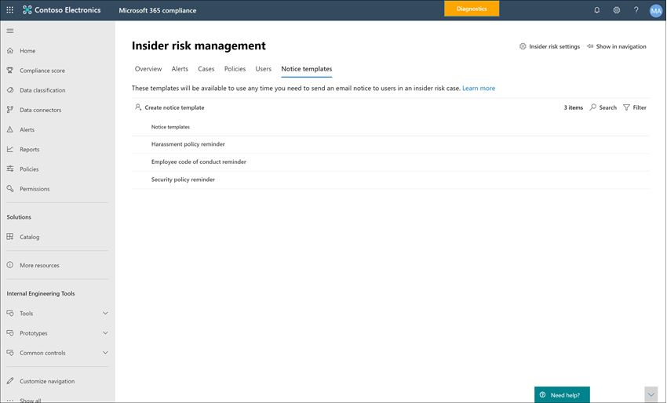

# <a name="insider-risk-management-notice-templates"></a><span data-ttu-id="fa5cf-104">有問必答風險管理通知範本</span><span class="sxs-lookup"><span data-stu-id="fa5cf-104">Insider risk management notice templates</span></span>

<span data-ttu-id="fa5cf-105">內部使用者風險管理通知範本可讓您在活動產生原則相符及警示時，將電子郵件傳送給使用者。</span><span class="sxs-lookup"><span data-stu-id="fa5cf-105">Insider risk management notice templates allow you to send email messages to users when their activities generate a policy match and alert.</span></span> <span data-ttu-id="fa5cf-106">在大多數情況下，產生警示的使用者動作是不具正確意圖的錯誤或無意活動的結果。</span><span class="sxs-lookup"><span data-stu-id="fa5cf-106">In most cases, user actions that generate alerts are the result of mistakes or inadvertent activities without ill intent.</span></span> <span data-ttu-id="fa5cf-107">通知是一種簡單的提醒，讓使用者更小心，提供有關複習訓練或公司原則資源的資訊連結。</span><span class="sxs-lookup"><span data-stu-id="fa5cf-107">Notices serve as simple reminders to users to be more careful, to provide links to information for refresher training, or to corporate policy resources.</span></span> <span data-ttu-id="fa5cf-108">通知可能是您的內部規範訓練計畫的重要部分，可協助為具有定期風險活動的使用者建立記錄的審計追蹤。</span><span class="sxs-lookup"><span data-stu-id="fa5cf-108">Notices can be an important part of your internal compliance training program and can help create a documented audit trail for users with recurring risk activities.</span></span>

<span data-ttu-id="fa5cf-109">如果您想要在問題解決程式中傳送使用者的電子郵件提醒通知與原則相符，請建立通知範本。</span><span class="sxs-lookup"><span data-stu-id="fa5cf-109">Create notice templates if you want to send users an email reminder notice for policy matches as part of the issue resolution process.</span></span> <span data-ttu-id="fa5cf-110">通知只能傳送至與所檢查的特定警示相關聯的使用者電子郵件地址。</span><span class="sxs-lookup"><span data-stu-id="fa5cf-110">Notices can only be sent to the user email address associated with the specific alert being reviewed.</span></span> <span data-ttu-id="fa5cf-111">選取要套用至原則相符的公告範本時，您可以選擇接受範本中所定義的欄位值，或是視需要覆寫這些欄位。</span><span class="sxs-lookup"><span data-stu-id="fa5cf-111">When selecting a notice template to apply to a policy match, you can choose to accept the field values defined in the template or overwrite the fields as needed.</span></span>

## <a name="notice-templates-dashboard"></a><span data-ttu-id="fa5cf-112">注意範本儀表板</span><span class="sxs-lookup"><span data-stu-id="fa5cf-112">Notice templates dashboard</span></span>

<span data-ttu-id="fa5cf-113">[ **通知範本] 儀表板** 會顯示已設定之公告範本的清單，並可讓您建立新的通知範本。</span><span class="sxs-lookup"><span data-stu-id="fa5cf-113">The **Notices templates dashboard** displays a list of configured notice templates and allows you to create new notice templates.</span></span> <span data-ttu-id="fa5cf-114">通知範本會以逆序的日期順序列出，最新的通知範本會先列出。</span><span class="sxs-lookup"><span data-stu-id="fa5cf-114">The notice templates are listed in reverse date order with the most recent notice template listed first.</span></span>



## <a name="html-for-notices"></a><span data-ttu-id="fa5cf-116">用於通知的 HTML</span><span class="sxs-lookup"><span data-stu-id="fa5cf-116">HTML for notices</span></span>

<span data-ttu-id="fa5cf-117">如果您想要建立超過簡單的文字式電子郵件訊息以進行通知，您可以在 [公告範本] 的 [郵件內文] 欄位中使用 HTML，建立更詳細的訊息。</span><span class="sxs-lookup"><span data-stu-id="fa5cf-117">If you'd like to create more than a simple text-based email message for notifications, you can create a more detailed message by using HTML in the message body field of a notice template.</span></span> <span data-ttu-id="fa5cf-118">下列範例會提供基本的 HTML 電子郵件通知範本的郵件內文格式：</span><span class="sxs-lookup"><span data-stu-id="fa5cf-118">The following example provides the message body format for a basic HTML-based email notification template:</span></span>

```HTML
<!DOCTYPE html>
<html>
<body>
<h2>Action Required: Contoso User Code of Conduct Policy Training</h2>
<p>A recent activity you've performed has generated a risk alert prohibited by the Contoso User <a href='https://www.contoso.com'>Code of Conduct Policy</a>.</p>
<p>You are required to attend the Contoso User Code of Conduct <a href='https://www.contoso.com'>training</a> within the next 14 days. Please contact <a href='mailto:hr@contoso.com'>Human Resources</a> with any questions about this training request.</p>
<p>Thank you,</p>
<p><em>Human Resources</em></p>
</body>
</html>
```

> [!NOTE]
> <span data-ttu-id="fa5cf-119">「內幕風險管理」通知範本中的 HTML href 屬性實現目前只支援單一單引號標記，而不支援 URL 參照的雙引號。</span><span class="sxs-lookup"><span data-stu-id="fa5cf-119">HTML href attribute implementation in the insider risk management notice templates currently support only single quotation marks instead of double quotation marks for URL references.</span></span>

## <a name="create-a-new-notice-template"></a><span data-ttu-id="fa5cf-120">建立新的通知範本</span><span class="sxs-lookup"><span data-stu-id="fa5cf-120">Create a new notice template</span></span>

<span data-ttu-id="fa5cf-121">若要建立新的內會員風險管理通知範本，您會使用 Microsoft 365 規範中心內的「 **內幕風險管理** 」方案中的「通知」嚮導。</span><span class="sxs-lookup"><span data-stu-id="fa5cf-121">To create a new insider risk management notice template, you'll use the notice wizard in **Insider risk management** solution in the Microsoft 365 compliance center.</span></span>

<span data-ttu-id="fa5cf-122">完成下列步驟，以建立新的有問必答風險管理通知範本：</span><span class="sxs-lookup"><span data-stu-id="fa5cf-122">Complete the following steps to create a new insider risk management notice template:</span></span>

1. <span data-ttu-id="fa5cf-123">在 [Microsoft 365 規範中心](https://compliance.microsoft.com)中，移至「 **內幕風險管理** 」，然後選取 [ **通知範本** ] 索引標籤。</span><span class="sxs-lookup"><span data-stu-id="fa5cf-123">In the [Microsoft 365 compliance center](https://compliance.microsoft.com), go to **Insider risk management** and select the **Notice templates** tab.</span></span>
2. <span data-ttu-id="fa5cf-124">選取 [ **建立公告範本** ] 以開啟 [通知嚮導]。</span><span class="sxs-lookup"><span data-stu-id="fa5cf-124">Select **Create notice template** to open the notice wizard.</span></span>
3. <span data-ttu-id="fa5cf-125">在 [ **建立新的通知範本** ] 頁面上，完成下欄欄位：</span><span class="sxs-lookup"><span data-stu-id="fa5cf-125">On the **Create a new notice template** page, complete the following fields:</span></span>
    - <span data-ttu-id="fa5cf-126">**範本名稱**：輸入通知的易記名稱。</span><span class="sxs-lookup"><span data-stu-id="fa5cf-126">**Template name**: Enter a friendly name for the notice.</span></span> <span data-ttu-id="fa5cf-127">此名稱會出現在 [通知] 儀表板上的通知清單，以及從案例中傳送通知時的 [通知選擇] 清單中。</span><span class="sxs-lookup"><span data-stu-id="fa5cf-127">This name appears on the list of notices on the notice dashboard and in the notice selection list when sending notices from a case.</span></span>
    - <span data-ttu-id="fa5cf-128">**傳送來源**：輸入通知的寄件者電子郵件地址。</span><span class="sxs-lookup"><span data-stu-id="fa5cf-128">**Send from**: Enter the sender email address for the notice.</span></span> <span data-ttu-id="fa5cf-129">除非在從案例傳送通知時進行變更，否則此位址會出現在所有通知傳送給使用者的 [ **寄件者：** ] 欄位中。</span><span class="sxs-lookup"><span data-stu-id="fa5cf-129">This address will appear in the **From:** field in all notices sent to users unless changed when sending a notice from a case.</span></span>
    - <span data-ttu-id="fa5cf-130">[副本]**和 [密件副本**] 欄位：在您訂閱的 Active Directory 中，選取要向其通報原則相符專案的選用使用者或群組。</span><span class="sxs-lookup"><span data-stu-id="fa5cf-130">**Cc and Bcc** fields: Optional users or groups to be notified of the policy match, selected from the Active Directory for your subscription.</span></span>
    - <span data-ttu-id="fa5cf-131">主旨 **：顯示**在郵件主旨行中的資訊，支援文字字元。</span><span class="sxs-lookup"><span data-stu-id="fa5cf-131">**Subject**: Information that appears in the subject line of the message, supports text characters.</span></span>
    - <span data-ttu-id="fa5cf-132">**郵件**內文：出現在郵件內文中的資訊，支援文字或 HTML 值。</span><span class="sxs-lookup"><span data-stu-id="fa5cf-132">**Message body**: Information that appears in the message body, supports text or HTML values.</span></span>
4. <span data-ttu-id="fa5cf-133">選取 [ **建立** ]，以建立及儲存公告範本，或選取 [ **取消** ] 關閉而不儲存公告範本。</span><span class="sxs-lookup"><span data-stu-id="fa5cf-133">Select **Create** to create and save the notice template or select **Cancel** to close without saving the notice template.</span></span>

## <a name="update-a-notice-template"></a><span data-ttu-id="fa5cf-134">更新公告範本</span><span class="sxs-lookup"><span data-stu-id="fa5cf-134">Update a notice template</span></span>

<span data-ttu-id="fa5cf-135">若要更新現有的「內幕風險管理通知」範本，請完成下列步驟：</span><span class="sxs-lookup"><span data-stu-id="fa5cf-135">To update an existing insider risk management notice template, complete the following steps:</span></span>

1. <span data-ttu-id="fa5cf-136">在 [Microsoft 365 規範中心](https://compliance.microsoft.com)中，移至「 **內幕風險管理** 」，然後選取 [ **通知範本** ] 索引標籤。</span><span class="sxs-lookup"><span data-stu-id="fa5cf-136">In the [Microsoft 365 compliance center](https://compliance.microsoft.com), go to **Insider risk management** and select the **Notice templates** tab.</span></span>
2. <span data-ttu-id="fa5cf-137">在 [通知] 儀表板上，選取您要管理的公告範本。</span><span class="sxs-lookup"><span data-stu-id="fa5cf-137">On the notice dashboard, select the notice template you want to manage.</span></span>
3. <span data-ttu-id="fa5cf-138">在 [通知詳細資料] 頁面上，選取 [**編輯**]</span><span class="sxs-lookup"><span data-stu-id="fa5cf-138">On the notice details page, select **Edit**</span></span>
4. <span data-ttu-id="fa5cf-139">在 [ **編輯** ] 頁面上，您可以編輯下欄欄位：</span><span class="sxs-lookup"><span data-stu-id="fa5cf-139">On the **Edit** page, you can edit the following fields:</span></span>
    - <span data-ttu-id="fa5cf-140">**範本名稱**：輸入通知的新易記名稱。</span><span class="sxs-lookup"><span data-stu-id="fa5cf-140">**Template name**: Enter a new friendly name for the notice.</span></span> <span data-ttu-id="fa5cf-141">此名稱會出現在 [通知] 儀表板上的通知清單，以及從案例中傳送通知時的 [通知選擇] 清單中。</span><span class="sxs-lookup"><span data-stu-id="fa5cf-141">This name appears on the list of notices on the notice dashboard and in the notice selection list when sending notices from a case.</span></span>
    - <span data-ttu-id="fa5cf-142">**傳送來源**：更新通知的寄件者電子郵件地址。</span><span class="sxs-lookup"><span data-stu-id="fa5cf-142">**Send from**: Update the sender email address for the notice.</span></span> <span data-ttu-id="fa5cf-143">除非在從案例傳送通知時進行變更，否則此位址會出現在所有通知傳送給使用者的 [ **寄件者：** ] 欄位中。</span><span class="sxs-lookup"><span data-stu-id="fa5cf-143">This address will appear in the **From:** field in all notices sent to users unless changed when sending a notice from a case.</span></span>
    - <span data-ttu-id="fa5cf-144">[副本]**和 [密件副本**] 欄位：更新選用的使用者或群組，以獲得您訂閱之 Active Directory 中所選取的原則相符專案。</span><span class="sxs-lookup"><span data-stu-id="fa5cf-144">**Cc and Bcc** fields: Update optional users or groups to be notified of the policy match, selected from the Active Directory for your subscription.</span></span>
    - <span data-ttu-id="fa5cf-145">主旨 **：會**出現在郵件主旨行的更新資訊，支援文字字元。</span><span class="sxs-lookup"><span data-stu-id="fa5cf-145">**Subject**: Update information that appears in the subject line of the message, supports text characters.</span></span>
    - <span data-ttu-id="fa5cf-146">**郵件**內文：更新出現在郵件內文中的資訊，支援文字或 HTML 值。</span><span class="sxs-lookup"><span data-stu-id="fa5cf-146">**Message body**: Update information that appears in the message body, supports text or HTML values.</span></span>
5. <span data-ttu-id="fa5cf-147">選取 [ **儲存** ] 以更新並儲存通知，或選取 [ **取消** ] 關閉而不儲存公告範本。</span><span class="sxs-lookup"><span data-stu-id="fa5cf-147">Select **Save** to update and save the notice or select **Cancel** to close without saving the notice template.</span></span>

## <a name="delete-a-notice-template"></a><span data-ttu-id="fa5cf-148">刪除公告範本</span><span class="sxs-lookup"><span data-stu-id="fa5cf-148">Delete a notice template</span></span>

<span data-ttu-id="fa5cf-149">若要刪除現有的現有會員風險管理通知範本，請完成下列步驟：</span><span class="sxs-lookup"><span data-stu-id="fa5cf-149">To delete an existing insider risk management notice template, complete the following steps:</span></span>

1. <span data-ttu-id="fa5cf-150">在 [Microsoft 365 規範中心](https://compliance.microsoft.com)中，移至「 **內幕風險管理** 」，然後選取 [ **通知範本** ] 索引標籤。</span><span class="sxs-lookup"><span data-stu-id="fa5cf-150">In the [Microsoft 365 compliance center](https://compliance.microsoft.com), go to **Insider risk management** and select the **Notice templates** tab.</span></span>
2. <span data-ttu-id="fa5cf-151">在 [通知] 儀表板上，選取您要刪除的公告範本。</span><span class="sxs-lookup"><span data-stu-id="fa5cf-151">On the notice dashboard, select the notice template you want to delete.</span></span>
3. <span data-ttu-id="fa5cf-152">選取工具列上的 [ **刪除** ] 圖示。</span><span class="sxs-lookup"><span data-stu-id="fa5cf-152">Select the **Delete** icon on the toolbar.</span></span>
4. <span data-ttu-id="fa5cf-153">若要刪除公告範本，請在 [刪除] 對話方塊中選取 **[是]** 。</span><span class="sxs-lookup"><span data-stu-id="fa5cf-153">To delete the notice template, select **Yes** in the delete dialog.</span></span> <span data-ttu-id="fa5cf-154">若要取消刪除，請選取 [ **取消**]。</span><span class="sxs-lookup"><span data-stu-id="fa5cf-154">To cancel the deletion, select **Cancel**.</span></span>
