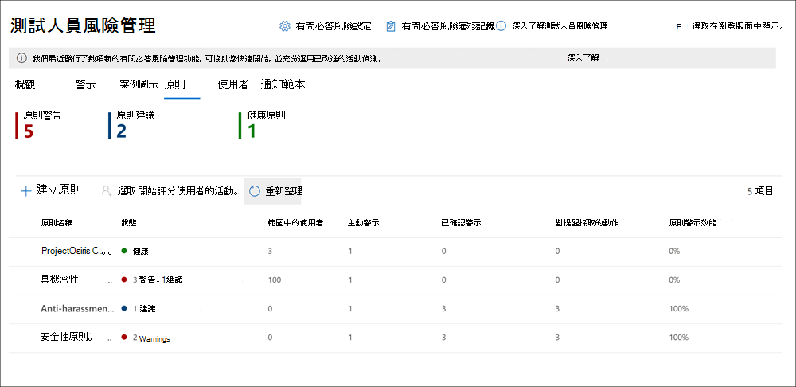

# 測試人員風險管理原則

測試人員風險管理原則決定哪一個員工的範圍內的風險指標類型設定的警示。 您可以快速建立套用至組織中的所有使用者的原則，或在原則中定義個別使用者或群組的管理。 原則支援多重上的焦點原則條件的內容優先順序或特定的 Microsoft Teams、 SharePoint 網站、 資料敏感度類型及資料標籤。 使用範本，它們包含特定風險指標和其指派給原則，有效地決定每個提醒的權數內多少權數觸發原則中。 原則 windows 讓您定義在時間範圍，將原則套用至警示的活動，並可用來決定一次啟動原則的持續時間。 最大原則限制同時是五個作用中的原則。 不過，您可以設定額外的原則及啟用和停用原則，視需要。

## 原則儀表板

**原則儀表板**可讓您快速查看您的組織和每個原則相關聯的提醒的目前狀態原則。

- **原則名稱**： 指派給 [原則] 精靈中的原則的名稱。
- **作用中警示**： 針對每個原則的作用中警示的數目。
- **已確認的警示**： 總數警示產生情況下，從原則中最後一個 365 天。
- **在 [警示採取動作**： 已確認或最後一個 365 天好幾提醒的總數。
- **原則效率**： 取決於總確認警示百分比除以總提醒 （這是已確認或好幾去年提醒的總和） 所採取的動作。
- **作用中**： 的情況下，[*是*] 或 [*否]* 的狀態。

## 原則範本

測試人員風險管理範本是預先定義的原則條件，定義原則所監視的風險指標的類型。 每個原則必須已獲指派原則建立精靈在才能建立原則範本。 當您建立新的測試人員風險原則時，您將會選擇其中一個下列範本。

### 離職員工資料偷竊

當員工離開組織時，有特定的風險指標通常與相關聯資料遭竊取消加入員工。 此原則範本來這些標記的優先順序和著重偵測和提醒給此風險區域。 資料遭竊的取消加入員工可能包含下載檔案從 SharePoint Online、 將檔案複製到可攜式裝置中，例如 USB 磁碟機、 列印檔案，並將資料複製到接近其工作經驗放棄的個人雲端通訊和儲存體服務和結束日期。 此範本來與這些活動] 和 [他們與員工工作經驗狀態與相互關聯相關的風險標記的優先順序。

>[!IMPORTANT]
>當使用此範本，您必須設定 Microsoft 365 HR 連接器，以定期匯入您的組織中的員工放棄和終止日期資訊。 請參閱設定 Microsoft 365 HR 連接器為您的組織的逐步指引[與人力資源連接器的匯入資料](import-hr-data.md)主題。

### 資料洩露

資料保護與避免資料外洩是用於大多數的組織，尤其是使用新建立的員工、 裝置及服務的資料快速成長常數挑戰。 員工會獲得授權，以建立、 儲存及共用資訊對於跨服務與越來越多複雜且難以進行管理的資料外洩的裝置。 資料外洩可能包含意外 oversharing 的外部惡意意圖與您的組織或資料遭竊的資訊。 此範本來優先順序即時偵測可疑的 SharePoint Online 資料下載、 檔案及資料夾共用、 將檔案複製到可攜式裝置中，例如 USB 磁碟機、 列印檔案，並將資料複製到個人雲端通訊和儲存體服務。

>[!IMPORTANT]
>當使用此範本，您必須設定至少一個資料外洩防護 (DLP) 原則，以定義您的組織中的敏感資訊。 如需為貴組織設定 DLP 原則的逐步指示，請參閱[建立、測試及調整 DLP 原則](create-test-tune-dlp-policy.md)主題。

### 電子郵件中的不良語言

偵測和採取動作來防止不良和沒有不當的行為會防止風險的重要元件。 Microsoft 365 中的相關性可掃描的內建冒犯從不同類型的符合性問題貴組織中的 Exchange Online 信箱傳送電子郵件訊息。 這些相關性使用人工地智慧和關鍵字的組合來識別電子郵件可能會違反反騷擾原則中的語言。 使用此範本，快速地建立的原則，會使用這些相關性來自動偵測可能會被視為粗俗禁止或冒犯的電子郵件訊息內容。 測試人員風險管理使用掃描傳送電子郵件的英文語言字詞與舉動冒犯的語言的相關性。

## 原則設定

測試人員風險設定套用至所有測試人員風險管理原則，不論您在 [選擇建立原則時的範本。 設定使用 **測試人員風險設定*會控制所有測試人員風險管理索引標籤的頂端。 這些設定會控制隱私性，指標，監視視窗，然後智慧型偵測的資訊。

### 隱私權

保護原則相符項目使用者的隱私權很重要並且可協助提升資料調查的客觀性以及分析檢閱測試人員風險警示。 針對測試人員風險原則相符項目使用的使用者，您可以選擇下列其中一個下列設定：

- **顯示匿名的版本的使用者名稱**： 使用者名稱匿名可防止系統管理員、 資料現場及檢閱者查看誰原則會發出警示相關聯。 例如，使用隨機 psuedonym 例如 'AnonIS8-988' 測試人員風險管理經驗的所有區域中會顯示使用者' 寬限期 Taylor'。 選擇此設定 anonymizes 與目前和過去原則的所有使用者找出並套用至所有原則。 測試人員中的使用者設定檔資訊的風險警示和案例的詳細資訊將無法使用時選擇這個選項。 不過，新增新使用者加入現有的原則時，或將使用者指派給新的原則時，會顯示使用者名稱。 如果您選擇關閉此設定，使用者名稱會顯示目前所有使用者，或過去原則比對。
- **不要顯示匿名的版本的使用者名稱**： 使用者名稱會顯示提醒和情況下的所有目前和過去原則相符項目。 使用者設定檔資訊 （名稱、 標題、 別名和組織或部門） 會顯示所有測試人員風險管理警示和案例的使用者。

### 指標

測試人員風險原則範本定義您想要偵測和調查的風險活動的類型。 每個原則範本根據特定會對應至特定的風險的活動的指標，當使用者執行這些指標與相關活動原則便會觸發警示。 在某些情況下，您可能想要限制會套用至組織中的測試人員風險原則的指標。 您可以從所有測試人員風險原則停用它們，以關閉特定領域的指標。

若要定義已啟用的指標所有原則中，瀏覽至**測試人員風險設定** > **標記**及選取的一個或多個標記。 建立或編輯原則] 精靈中的測試人員風險原則時，就無法個別設定**標記**的設定] 頁面上選取的指標。

>[!IMPORTANT]
>以獲得之風險的活動原則中定義的提醒，您必須先設定測試人員風險原則選取一或多個標記。

### 原則項

原則項可讓您定義過去和未來檢閱期間，會觸發之後原則比對根據的事件及測試人員風險管理原則範本的活動。 根據您選擇的原則範本，可用下列原則項如下：

- **啟動視窗**： 適用於所有的原則範本，*啟動視窗*是已定義的天數視窗啟動**之後**觸發的事件。 1 到 30 天之後觸發的事件發生的原則指派給任何使用者啟動視窗。 例如，您已設定的測試人員風險管理原則，並設為 30 天的*啟動] 視窗*。 幾個月以來設定原則，以及觸發事件發生時的其中一個包含在原則中的使用者。 觸發的事件會在*啟動視窗*和原則均可使用該使用者的觸發的事件發生後的 30 天。
- **過去的活動偵測**：*過去的活動偵測*適用於所有的原則範本，為已定義的天數] 視窗會啟動**之前**觸發的事件。 0 到 180 天之前觸發的事件發生的原則指派給任何使用者啟動視窗。 例如，您已設定的測試人員風險管理原則，並設定*過去活動偵測*為 90 天。 幾個月以來設定原則，以及觸發事件發生時的其中一個包含在原則中的使用者。 觸發的事件會啟動*過去活動偵測*並原則收集歷程記錄的活動，為該使用者的 90 天前觸發的事件。

### 智慧型偵測

智慧型偵測設定，協助調整偵測到有風險的活動警示的處理方式。 在某些情況下，您可能需要定義略過的檔案類型，或您想要強制執行的偵測層級，以協助定義警示的最低列的檔案。 當使用冒犯原則，您可能需要增加或減少偵測敏感度來控制報告的原則相符項目數量。 使用這些設定來控制檔案型別排除項目、 檔案的磁碟區限制，以及冒犯語言偵測敏感度。

#### 異常偵測

異常偵測包含檔案類型排除與檔案的磁碟區限制的設定。

- **檔案類型排除**： 若要排除所有測試人員風險管理原則比對特定檔案類型，請輸入 [檔案類型的副檔名逗號分隔。 例如，從原則相符項目中排除某些類型的等候音樂檔案您可能輸入*aac、 mp3、 wav、 wma*中**排除檔案類型項目**] 欄位。 具有這些副檔名的檔案會忽略所有測試人員風險管理原則。
- **檔案的磁碟區掉限制**： 若要定義的最小的檔案層級之前活動警訊會報告測試人員風險原則中，輸入檔案的數目。 例如，您會輸入 '10' 如果您不想要產生測試人員風險提醒使用者下載 10 個檔案時，或更少，即使您的原則這部分一併考慮異常。

#### 不良語言偵測

若要調整使用*中電子郵件的不良語言*範本的原則冒犯器的敏感度，選擇下列其中一個下列設定：

- **低**： 最低的敏感度層級，以偵測冒犯語言和舉動最大範圍。 冒犯比對的誤判的可能性會較高的。
- **中型**： 大西洋層級敏感度層級與偵測冒犯語言和舉動平衡範圍。 冒犯比對的誤判的可能性是平均。
- **高**： 偵測冒犯語言和舉動，縮小範圍的最高敏感度層級。 冒犯比對的誤判的可能性很低。

## 建立新的原則

若要建立新的測試人員風險管理原則，您會在 Microsoft 365 合規性中心**測試人員風險管理**解決方案中使用 [原則] 精靈。

完成下列步驟來建立新的原則：

1. 在 [Microsoft 365 合規性中心](https://compliance.microsoft.com)，移至 **[測試人員風險管理]**，然後選取 **[原則]** 索引標籤。
2. 選取 **[建立原則]** 以開啟原則精靈
3. 在 [**命名您的原則，然後選擇 [範本**] 頁面上，完成下列欄位：
    - **名稱 (必要)**：為原則輸入好記的名稱
    - **說明 (選用)**：輸入原則的說明。
    - **選擇原則範本 (必要)**：選取其中一個[原則範本](insider-risk-management-policies.md#policy-templates)，以定義受原則監視的風險指標類型。

    >[!IMPORTANT]
    >如果您選取 *[資料外洩]* 範本，必須設定至少一個稍後在精靈中指派的 DLP 原則。 如果您選取*離職員工資料偷竊*範本，您必須將 HR 連接器設定為使用原則範本的完整訊號偵測功能。

4. 選取 **[下一步]** 繼續。
5. 在 [**選擇使用者和群組**] 頁面上，選取 [**選擇使用者或群組**定義哪些使用者包含在原則，或選取**所有的使用者及擁有郵件功能的群組**] 核取方塊。 選取 **[下一步]** 繼續。
6. **指定內容設定的優先順序 （選用）** 在頁面上，您可以指派較高風險分數偵測到以活動為基礎的相關的內容所在的位置、 何種敏感資訊是包含在內，以及哪些敏感度標籤套用至：
    - SharePoint 網站： 選取 [**選擇 [SharePoint 網站**，選取您想要排列優先順序的 SharePoint 組織。 例如，*"group1@contoso.sharepoint.com/sites/group1"*。
    - 機密資訊類型： 選取 [**選擇機密資訊類型**，然後選取您想要排列優先順序敏感度類型。 例如，*[美國銀行帳戶號碼]* 和 *[信用卡號碼]*。
    - 敏感度標籤： 選取 [**選擇敏感度標籤**，選取您想要排列優先順序的標籤。 例如，*[機密]* 和 *[密碼]*。
7. 選取 **[下一步]** 繼續。
8. 在 [**警示指標**] 頁面中，您會看到您已定義在**測試人員風險設定**指標 > **指標**] 頁面。 如果您在精靈開始時選取 *[資料外洩]* 範本，必須從 **[DLP 原則]** 下拉式清單中選取 DLP 原則。
9. 在 [**選取監視視窗**] 頁面中，您會看到[監視視窗條件](insider-risk-management-policies.md#policy-timeframes)中測試人員風險設定已設定的原則。 如果您已經選取*Departing 員工資料遭竊*的原則範本，您可以選取*活動後終止的核取*核取方塊，可從 Microsoft 365 HR 連接器匯入的終止日期之後偵測活動。
10. 選取 **[下一步]** 繼續。
11. 在**檢閱**頁面上，檢閱您為原則選擇的設定。 選取 **[編輯]** 以變更任何原則值，或選取 **[提交]** 來建立並啟用原則。

## 更新原則

若要更新現有的測試人員風險管理原則，您將在 Microsoft 365 合規性中心**測試人員風險管理**解決方案中使用 [原則] 精靈。

完成下列步驟，以管理現有的原則：

1. 在 [Microsoft 365 合規性中心](https://compliance.microsoft.com)，移至 **[測試人員風險管理]**，然後選取 **[原則]** 索引標籤。
2. 在原則儀表板中，選取您想要管理的原則。
3. 在 [原則詳細資料] 頁面上，選取 [**編輯原則**
4. 在 [原則] 精靈中，您無法編輯下列欄位：
    - **名稱**： 此原則的易記名稱
    - **選取 [playbook**： 用來定義原則所監視的風險指標類型的範本。
5. 在 [**描述**] 欄位中輸入原則的新說明。 選取 **[下一步]** 繼續。
6. 在 [**選擇使用者和群組**] 頁面上，選取 [**選擇使用者或群組**定義哪些使用者包含在原則，或選取**所有的使用者及擁有郵件功能的群組**] 核取方塊。 選取 [**下一步**繼續
7. **指定內容設定的優先順序 （選用）** 在頁面上，更新來源來設定優先順序有風險的使用者活動：
    - SharePoint 網站： 選取 [**選擇 [SharePoint 網站**，選取您想要排列優先順序的 SharePoint 組織。 例如，*"group1@contoso.sharepoint.com/sites/group1"*。
    - 機密資訊類型： 選取 [**選擇機密資訊類型**，然後選取您想要排列優先順序敏感度類型。 例如，*[美國銀行帳戶號碼]* 和 *[信用卡號碼]*。
    - 敏感度標籤： 選取 [**選擇敏感度標籤**，選取您想要排列優先順序的標籤。 例如，*[機密]* 和 *[密碼]*。
8. 選取 **[下一步]** 繼續。
9. 在 [**警示指標**] 頁面中，您會看到您已定義在**測試人員風險設定**指標 > **指標**] 頁面。 如果您在精靈開始時選取 *[資料外洩]* 範本，必須從 **[DLP 原則]** 下拉式清單中選取 DLP 原則。
10. 在 [**選取監視視窗**] 頁面中，您會看到[監視視窗條件](insider-risk-management-policies.md#policy-timeframes)中測試人員風險設定已設定的原則。 如果您已經選取*Departing 員工資料遭竊*的原則範本，您可以選取*活動後終止的核取*核取方塊，可從 Microsoft 365 HR 連接器匯入的終止日期之後偵測活動。
11. 在**檢閱**頁面上，檢閱您為原則選擇的設定。 選取 [**編輯**] 來變更任何 「 原則 」 值或選取 [**提交**]，以更新並啟動原則的變更。

## 刪除原則

>[!NOTE]
>刪除原則不會刪除使用中或封存從原則中產生的警示。

若要刪除現有的測試人員風險管理原則，請完成下列步驟：

1. 在 [Microsoft 365 合規性中心](https://compliance.microsoft.com)，移至 **[測試人員風險管理]**，然後選取 **[原則]** 索引標籤。
2. 在原則儀表板中，選取您想要管理的原則。
3. 選取 [儀表板] 工具列上的 [**刪除**]。
4. 在 [**刪除**] 對話方塊中，選取 **[是]** 以刪除原則，或選取 [**取消**] 以關閉對話方塊。
