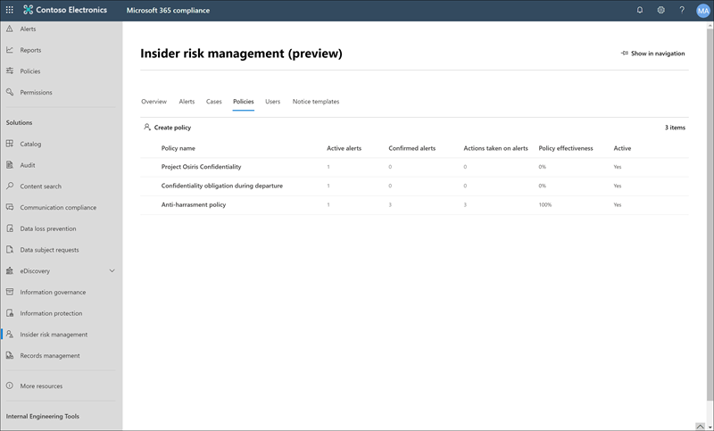

# 測試人員風險管理原則 （預覽）Insider risk management policies (preview)

測試人員風險管理原則決定哪一個員工的範圍內的風險指標類型設定的警示。Insider risk management policies determine which employees are in-scope and which types of risk indicators are configured for alerts. 您可以快速建立套用至組織中的所有使用者的原則，或在原則中定義個別使用者或群組的管理。You can quickly create a policy that applies to all users in your organization, or define individual users or groups for management in a policy. 原則支援多重上的焦點原則條件的內容優先順序或特定的 Microsoft Teams、 SharePoint 網站、 資料敏感度類型及資料標籤。Policies support content priorities to focus policy conditions on multiple or specific Microsoft Teams, SharePoint sites, data sensitivity types, and data labels. 使用範本，它們包含特定風險指標和其指派給原則，有效地決定每個提醒的權數內多少權數觸發原則中。Using templates, they include specific risk indicators and how much weight they are assigned within a policy, effectively determining the weight of each alert trigger in the policy. 原則 windows 讓您定義在時間範圍，將原則套用至警示的活動，並可用來決定一次啟動原則的持續時間。Policies windows allow you to define the time frame to apply the policy to alert activities and are used to determine the duration of the policy once activated. 最大原則限制同時是五個作用中的原則。The maximum policy limit is five active policies at the same time. 不過，您可以設定額外的原則及啟用和停用原則，視需要。However, you can configure additional policies and activate and deactivate policies as needed.

## 原則儀表板Policy dashboard

**原則儀表板**可讓您快速查看您的組織和每個原則相關聯的提醒的目前狀態原則。The **Policy dashboard** allows you to quickly see the policies in your organization and the current status of alerts associated with each policy.

- **原則名稱**： 指派給 [原則] 精靈中的原則的名稱。**Policy name**: The name assigned to the policy in the policy wizard.
- **作用中警示**： 針對每個原則的作用中警示的數目。**Active alerts**: The number of active alerts for each policy.
- **已確認的警示**： 總數警示產生情況下，從原則中最後一個 365 天。**Confirmed alerts**: The total number of alerts the resulted in cases from the policy in the last 365 days.
- **在 [警示採取動作**： 已確認或最後一個 365 天好幾提醒的總數。**Actions taken on alerts**: The total number of alerts that were confirmed or dismissed for the last 365 days.
- **原則效率**： 取決於總確認警示百分比除以總提醒 （這是已確認或好幾去年提醒的總和） 所採取的動作。**Policy effectiveness**: The percentage determined by total confirmed alerts divided by total actions taken on alerts (which is the sum of alerts that were confirmed or dismissed over the past year).
- **作用中**： 的情況下，[*是*] 或 [*否]* 的狀態。**Active**: The status of the case, either *Yes* or *No*.

## 原則範本Policy templates

測試人員風險管理範本是預先定義的原則條件，定義原則所監視的風險指標的類型。Insider risk management templates are pre-defined policy conditions that define the types of risk indicators monitored by a policy. 每個原則必須已獲指派原則建立精靈在才能建立原則範本。Each policy must have a template assigned in the policy creation wizard before the policy is created. 以下是可用範本：The following templates are available:

- **取消加入員工資料遭竊**： 當員工離開組織時，有特定的風險指標通常與相關聯資料遭竊取消加入員工。**Departing employee data theft**: When employees leave your organization, there are specific risk indicators typically associated with data theft by departing employees. 此原則範本來這些標記的優先順序和著重偵測和提醒給此風險區域。This policy template prioritizes these indicators and focuses detection and alerts to this risk area. 資料遭竊的取消加入員工可能包含下載檔案從 SharePoint Online、 將檔案複製到可攜式裝置中，例如 USB 磁碟機、 列印檔案，並將資料複製到接近其工作經驗放棄的個人雲端通訊和儲存體服務和結束日期。Data theft for departing employees may include downloading files from SharePoint Online, copying files to portable devices such as USB drives, printing files, and copying data to personal cloud messaging and storage services near their employment resignation and end dates. 此範本來與這些活動] 和 [他們與員工工作經驗狀態與相互關聯相關的風險標記的優先順序。This template prioritizes risk indicators relating to these activities and how they correlate with employee employment status.

    >[!IMPORTANT]
    >當使用此範本，您必須設定 Microsoft 365 HR 連接器，以定期匯入您的組織中的員工放棄和終止日期資訊。When using this template, you must configure a Microsoft 365 HR connector to periodically import resignation and termination date information for employees in your organization. 請參閱設定 Microsoft 365 HR 連接器為您的組織的逐步指引[與人力資源連接器的匯入資料](import-hr-data.md)主題。See the [Import data with the HR Connector](import-hr-data.md) topic for step-by-step guidance to configure the Microsoft 365 HR Connector for your organization.

- **資料遺漏的詳細資訊**： 保護資料，並避免資料外洩是用於大多數的組織，尤其是使用新建立的員工、 裝置及服務的資料快速成長常數挑戰。**Data leaks**: Protecting data and preventing data leaks is a constant challenge for most organizations, particularly with the rapid grow of new data created by employees, devices, and services. 員工會獲得授權，以建立、 儲存及共用資訊對於跨服務與越來越多複雜且難以進行管理的資料外洩的裝置。Employees are empowered to create, store, and share information across services and devices that make managing data leaks increasingly more complex and difficult. 資料外洩可能包含意外 oversharing 的外部惡意意圖與您的組織或資料遭竊的資訊。Data leaks can include accidental oversharing of information outside your organization or data theft with malicious intent. 此範本來優先順序即時偵測可疑的 SharePoint Online 資料下載、 檔案及資料夾共用、 將檔案複製到可攜式裝置中，例如 USB 磁碟機、 列印檔案，並將資料複製到個人雲端通訊和儲存體服務。This template prioritizes real-time detection of suspicious SharePoint Online data downloads, file and folder sharing, copying files to portable devices such as USB drives, printing files, and copying data to personal cloud messaging and storage services.

    >[!IMPORTANT]
    >當使用此範本，您必須設定至少一個資料外洩防護 (DLP) 原則，以定義您的組織中的敏感資訊。When using this template, you must configure at least one Data Loss Prevention (DLP) policy to define sensitive information in your organization. 請參閱[建立、 測試及調整 DLP 原則](create-test-tune-dlp-policy.md)的主題可設定您的組織的 DLP 原則的逐步指引。See the [Create, test, and tune a DLP policy](create-test-tune-dlp-policy.md) topic for step-by-step guidance to configure DLP policies for your organization.

- **電子郵件中的不良語言**： 偵測和採取動作來防止不良和沒有不當的行為會防止風險的重要元件。**Offensive language in email**: Detecting and taking action to prevent offensive and abusive behavior is a critical component of preventing risk. Microsoft 365 中的相關性可掃描的內建冒犯從不同類型的符合性問題貴組織中的 Exchange Online 信箱傳送電子郵件訊息。Built-in offensive language classifiers in Microsoft 365 can scan sent email messages from Exchange Online mailboxes in your organization for different types of compliance issues. 這些相關性使用人工地智慧和關鍵字的組合來識別電子郵件可能會違反反騷擾原則中的語言。These classifiers use a combination of artificial intelligence and keywords to identify language in email likely to violate anti-harassment policies. 使用此範本，快速地建立的原則，會使用這些相關性來自動偵測可能會被視為粗俗禁止或冒犯的電子郵件訊息內容。Use this template to quickly create a policy that uses these classifiers to automatically detect email message content that may be considered abusive or offensive. 測試人員風險管理使用掃描傳送電子郵件的英文語言字詞與舉動冒犯的語言的相關性。Insider risk management uses classifiers that scan sent email messages for English language terms and sentiment for offensive language.

## 監視 windowsMonitoring windows

原則監視 windows 可讓您定義觸發事件和活動的測試人員風險管理原則範本為基礎的原則啟用的時段。Policy monitoring windows allow you to define time periods that trigger policy activation based on events and activities for the insider risk management policy templates. 根據您選擇的原則範本，可用下列監視 windows 如下：Depending on the policy template you choose, the following monitoring windows are available:

- **在 [範圍 timespan**： 適用於所有的原則範本，*在範圍 timespan*是已定義的天數視窗啟動**之後**觸發的事件。**In-scope timespan**: Available for all policy templates, the *In-scope timespan* is the defined number of days that the window activates **after** a triggering event. 1 到 30 天之後觸發的事件發生的原則指派給任何使用者啟動視窗。The window activates for 1 to 30 days after a triggering event occurs for any user assigned to the policy. 例如，您已設定測試人員風險管理原則，且*範圍 timespan*設 30 天。For example, you've configured an insider risk management policy and set the *In-scope timespan* to 30 days. 幾個月以來設定原則，以及觸發事件發生時的其中一個包含在原則中的使用者。Several months have passed since you configured the policy and a triggering event occurs for one of the users included in the policy. 觸發的事件會啟動該*範圍內 timespan*並原則均可使用該使用者的觸發的事件發生後的 30 天。The triggering event activates the *In-scope timespan* and the policy is active for that user for 30 days after the triggering event occurred.
- **歷史 timespan**： 適用於所有的原則範本，*歷史 timespan*已定義的天數] 視窗會啟動**之前**觸發的事件。**Historic timespan**: Available for all policy templates, the *historic timespan* is the defined number of days that the window activates **before** a triggering event. 0 到 180 天之前觸發的事件發生的原則指派給任何使用者啟動視窗。The window activates for 0 to 180 days before a triggering event occurs for any user assigned to the policy. 例如，您已設定的測試人員風險管理原則，並將*歷史 timespan*設為 90 天。For example, you've configured an insider risk management policy and set the *Historic timespan* to 90 days. 幾個月以來設定原則，以及觸發事件發生時的其中一個包含在原則中的使用者。Several months have passed since you configured the policy and a triggering event occurs for one of the users included in the policy. 觸發的事件啟動*歷史 timespan* ，原則會為該使用者的歷程記錄活動收集 90 天前觸發的事件。The triggering event activates the *Historic timespan* and the policy gathers historic activities for that user for 90 days prior to the triggering event.
- **未來終止視窗**： 您會看到在公用預覽中，此設定，但它不會套用至任何原則，將移除針對此解決方案的實際執行版本。**Future termination window**: You'll see this setting in the pubic preview, but it isn’t applied to any policies and will be removed for the production release of this solution.
- **過去的終止視窗**： 您會看到在公用預覽中，此設定，但它不會套用至任何原則，將移除針對此解決方案的實際執行版本。**Past termination window**: You'll see this setting in the pubic preview, but it isn’t applied to any policies and will be removed for the production release of this solution.

## 建立新的原則Create a new policy

若要建立新的測試人員風險管理原則，您會在 Microsoft 365 合規性中心**測試人員風險管理**解決方案中使用 [原則] 精靈。To create a new insider risk management policy, you'll use the policy wizard in **Insider risk management** solution in the Microsoft 365 compliance center.

完成下列步驟來建立新的原則：Complete the following steps to create a new policy:

1. 在[Microsoft 365 合規性中心](https://compliance.microsoft.com)，移至**測試人員風險管理**並選取 [**原則**] 索引標籤。In the [Microsoft 365 compliance center](https://compliance.microsoft.com), go to **Insider risk management** and select the **Policies** tab.
2. 選取 [**建立原則**]，以開啟 [原則] 精靈Select **Create policy** to open the policy wizard
3. 在 [**新的測試人員風險原則**] 頁面上，完成下列欄位：On the **New insider risk policy** page, complete the following fields:
    - **名稱 （必填）**： 輸入原則的易記名稱**Name (required)**: Enter a friendly name for the policy
    - **（選用） 的描述**： 輸入原則的描述。**Description (optional)**: Enter a description for the policy.
    - **選擇原則範本 （必要）**： 選取下列其中一個[原則範本](insider-risk-management-policies.md#policy-templates)，以定義類型的風險指標監視的原則。**Choose policy template (required)**: Select one of the [policy templates](insider-risk-management-policies.md#policy-templates) to define the types of risk indicators are monitored by the policy.

    >[!IMPORTANT]
    >如果您選取的*資料遺漏*的範本，您需要稍後在精靈中設定您將指定的至少一個 DLP 原則。If you select the *Data leaks* template, you'll need to configure at least one DLP policy that you'll assign later in the wizard. 如果您選取*Departing 員工資料遭竊*範本，您需要設定人力資源連接器，以使用原則範本的完整訊號偵測功能。If you select the *Departing employee data theft* template, you'll need to configure the HR Connector to use the full signal detection features of the policy template.

4. 選取 [**下一步**繼續。Select **Next** to continue.
5. 在 [**使用者**] 頁面上選取 [**新增使用者或群組**來定義哪些使用者包含在原則，或選取**所有的使用者及擁有郵件功能的群組**] 核取方塊。On the **Users** page, select **Add user or group** to define which users are included in the policy or select **All users and mail-enabled groups** checkbox. 選取 [**下一步**繼續。Select **Next** to continue.
6. **指定內容設定的優先順序 （選用）** 在頁面上，您可以指派來設定優先順序有風險的使用者活動的來源：On the **Specify what content to prioritize (optional)** page, you can assign the sources to prioritize for risky user activities:
    - SharePoint 網站： 選取 [**新增 SharePoint 網站**，選取您想要排列優先順序的 SharePoint 組織。SharePoint sites: Select **Add SharePoint site** and select the SharePoint organizations you want to prioritize. 例如， *「 」 group1@contoso.sharepoint.com/sites/group1 」 」*。For example, *"group1@contoso.sharepoint.com/sites/group1"*.
    - 機密資訊類型： 選取 [**新增敏感資訊類型**，然後選取您想要排列優先順序敏感度類型。Sensitive info type: Select **Add sensitive info type** and select the sensitivity types you want to prioritize. 例如， *「 美國銀行帳戶號碼"* 和 *"Credit Card Number"*。For example, *"U.S. Bank Account Number"* and *"Credit Card Number"*.
    - 敏感度標籤： 選取 [**新增敏感度標籤**，選取您想要排列優先順序的標籤。Sensitivity labels: Select **Add sensitivity label** and select the labels you want to prioritize. 例如 *「 機密 」* 和 *「 密碼 」*。For example, *"Confidential"* and *"Secret"*.
7. 選取 [**下一步**繼續。Select **Next** to continue.
8. 在 [**選擇警示指標**] 頁面上，您會看到您選擇此原則的範本中所含的指標。On the **Choose alert indicators** page, you'll see the indicators that are included in the template that you've chosen for this policy. 如果您選取*的資料遺漏的詳細資訊*範本精靈的開頭，您必須從 [ **DLP 原則**] 下拉式清單選取 DLP 原則。If you selected the *Data leaks* template at the beginning of the wizard, you must select a DLP policy from the **DLP policy** dropdown list.
9. **選取 [監控] 視窗**在頁面上，您將定義[監控視窗條件](insider-risk-management-policies.md#monitoring-windows)原則。On the **Select monitoring window** page, you'll define the [monitoring window conditions](insider-risk-management-policies.md#monitoring-windows) for the policy. 視需要設定 [監視] 視窗。Configure the monitoring windows as appropriate.
10. 選取 [**下一步**繼續。Select **Next** to continue.
11. 在 [**檢閱**] 頁面上，檢閱您選擇的原則設定。On the **Review** page, review the settings you've chosen for the policy. 選取 [**編輯**] 來變更任何 「 原則 」 值或選取 [**提交**]，以建立並啟動原則。Select **Edit** to change any of the policy values or select **Submit** to create and activate the policy.

## 更新原則Update a policy

若要更新現有的測試人員風險管理原則，您將在 Microsoft 365 合規性中心**測試人員風險管理**解決方案中使用 [原則] 精靈。To update an existing insider risk management policy, you'll use the policy wizard in **Insider risk management** solution in the Microsoft 365 compliance center.

完成下列步驟，以管理現有的原則：Complete the following steps to manage an existing policy:

1. 在[Microsoft 365 合規性中心](https://compliance.microsoft.com)，移至**測試人員風險管理**並選取 [**原則**] 索引標籤。In the [Microsoft 365 compliance center](https://compliance.microsoft.com), go to **Insider risk management** and select the **Policies** tab.
2. 在原則儀表板中，選取您想要管理的原則。On the policy dashboard, select the policy you want to manage.
3. 在 [原則詳細資料] 頁面上，選取 [**編輯原則**On the policy details page, select **Edit policy**
4. 在 [原則] 精靈中，您無法編輯下列欄位：In the policy wizard, you cannot edit the following fields:
    - **名稱**： 此原則的易記名稱**Name**: The friendly name for the policy
    - **選取 [playbook**： 用來定義原則所監視的風險指標類型的範本。**Select playbook**: The template used to define the types of risk indicators monitored by the policy.
5. 在 [**描述**] 欄位中輸入原則的新說明。Enter a new description for the policy in the **Description** field. 選取 [**下一步**繼續。Select **Next** to continue.
6. 在 [**使用者**] 頁面上選取 [**新增使用者或群組**來定義哪些使用者包含在原則，或選取**所有的使用者及擁有郵件功能的群組**] 核取方塊。On the **Users** page, select **Add user or group** to define which users are included in the policy or select **All users and mail-enabled groups** checkbox. 選取 [**下一步**繼續Select **Next** to continue
7. **指定內容設定的優先順序 （選用）** 在頁面上，更新來源來設定優先順序有風險的使用者活動：On the **Specify what content to prioritize (optional)** page, update the sources to prioritize for risky user activities:
    - SharePoint 網站： 選取 [**新增 SharePoint 網站**，選取您想要排列優先順序的 SharePoint 組織。SharePoint sites: Select **Add SharePoint site** and select the SharePoint organizations you want to prioritize. 例如， *「 」 group1@contoso.sharepoint.com/sites/group1 」 」*。For example, *"group1@contoso.sharepoint.com/sites/group1"*.
    - 機密資訊類型： 選取 [**新增敏感資訊類型**，然後選取您想要排列優先順序敏感度類型。Sensitive info type: Select **Add sensitive info type** and select the sensitivity types you want to prioritize. 例如， *「 美國銀行帳戶號碼"* 和 *"Credit Card Number"*。For example, *"U.S. Bank Account Number"* and *"Credit Card Number"*.
    - 敏感度標籤： 選取 [**新增敏感度標籤**，選取您想要排列優先順序的標籤。Sensitivity labels: Select **Add sensitivity label** and select the labels you want to prioritize. 例如 *「 機密 」* 和 *「 密碼 」*。For example, *"Confidential"* and *"Secret"*.
8. 選取 [**下一步**繼續。Select **Next** to continue.
9. 在 [**選擇警示指標**] 頁面上，您會看到您選擇此原則的範本中所含的指標。On the **Choose alert indicators** page, you'll see the indicators that are included in the template that you've chosen for this policy. 如果您選取*的資料遺漏的詳細資訊*範本精靈的開頭，您必須從 [ **DLP 原則**] 下拉式清單選取 DLP 原則。If you selected the *Data leaks* template at the beginning of the wizard, you must select a DLP policy from the **DLP policy** dropdown list.
10. **選取 [監控] 視窗**在頁面上，您將定義[監控視窗條件](insider-risk-management-policies.md#monitoring-windows)原則。On the **Select monitoring window** page, you'll define the [monitoring window conditions](insider-risk-management-policies.md#monitoring-windows) for the policy. 視需要設定 [監視] 視窗。Configure the monitoring windows as appropriate.
11. 在 [**檢閱**] 頁面上，檢閱您選擇的原則設定。On the **Review** page, review the settings you've chosen for the policy. 選取 [**編輯**] 來變更任何 「 原則 」 值或選取 [**提交**]，以更新並啟動原則的變更。Select **Edit** to change any of the policy values or select **Submit** to update and activate the changes in the policy.

## 刪除原則Delete a policy

>[!NOTE]
>刪除原則不會刪除使用中或封存從原則中產生的警示。Deleting a policy does not delete active or archived alerts generated from the policy.

若要刪除現有的測試人員風險管理原則，請完成下列步驟：To delete an existing insider risk management policy, complete the following steps:

1. 在[Microsoft 365 合規性中心](https://compliance.microsoft.com)，移至**測試人員風險管理**並選取 [**原則**] 索引標籤。In the [Microsoft 365 compliance center](https://compliance.microsoft.com), go to **Insider risk management** and select the **Policies** tab.
2. 在原則儀表板中，選取您想要管理的原則。On the policy dashboard, select the policy you want to manage.
3. 選取 [儀表板] 工具列上的 [**刪除**]。Select **Delete** on the dashboard toolbar.
4. 在 [**刪除**] 對話方塊中，選取 **[是]** 以刪除原則，或選取 [**取消**] 以關閉對話方塊。On the **Delete** dialog, Select **Yes** to delete the policy, or select **Cancel** to close the dialog.