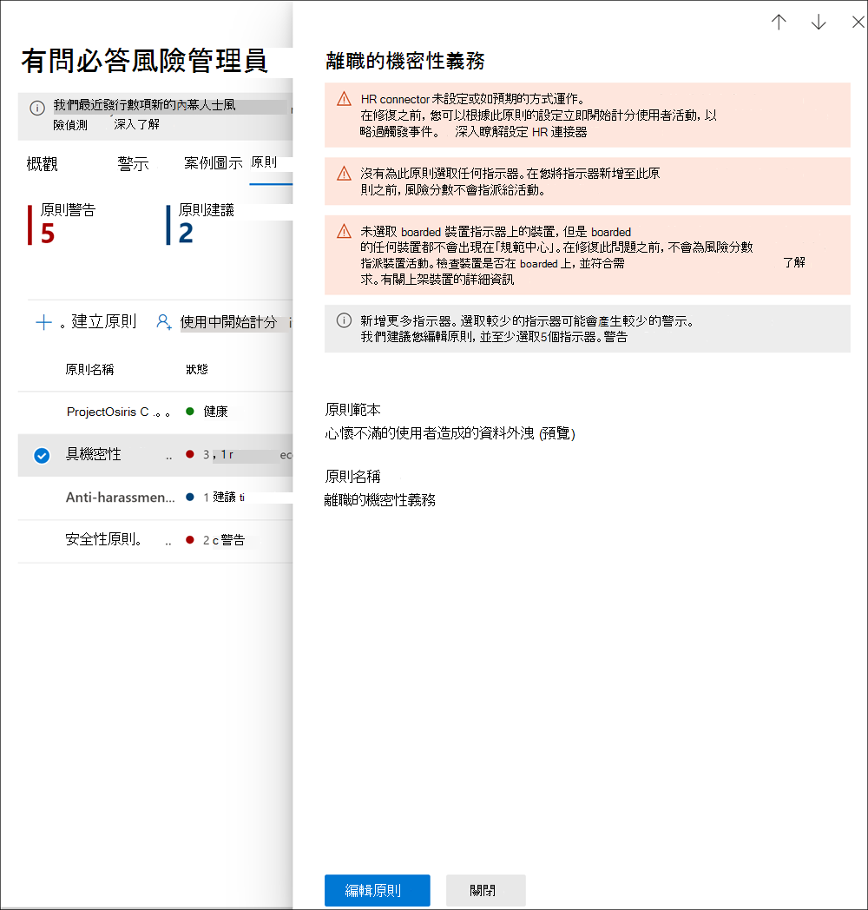

# <a name="insider-risk-management-policies"></a><span data-ttu-id="ec930-104">有問必答風險管理原則</span><span class="sxs-lookup"><span data-stu-id="ec930-104">Insider risk management policies</span></span>

<span data-ttu-id="ec930-105">有問必答風險管理原則決定哪些使用者屬於範圍，以及已針對警示設定哪些類型的風險指示器。</span><span class="sxs-lookup"><span data-stu-id="ec930-105">Insider risk management policies determine which users are in-scope and which types of risk indicators are configured for alerts.</span></span> <span data-ttu-id="ec930-106">您可以快速建立套用至組織中所有使用者的原則，或定義個別使用者或群組以進行原則管理。</span><span class="sxs-lookup"><span data-stu-id="ec930-106">You can quickly create a policy that applies to all users in your organization or define individual users or groups for management in a policy.</span></span> <span data-ttu-id="ec930-107">原則支援內容優先順序，以在多重或特定 Microsoft 團隊上聚焦原則條件，SharePoint 網站、資料敏感度類型及資料標籤。</span><span class="sxs-lookup"><span data-stu-id="ec930-107">Policies support content priorities to focus policy conditions on multiple or specific Microsoft Teams, SharePoint sites, data sensitivity types, and data labels.</span></span> <span data-ttu-id="ec930-108">使用範本，您可以選取特定風險指示器，並自訂原則指標的事件閾值、有效地自訂風險分數，以及警告的層級和頻率。</span><span class="sxs-lookup"><span data-stu-id="ec930-108">Using templates, you can select specific risk indicators and customize event thresholds for policy indicators, effectively customizing risk scores, and level and frequency of alerts.</span></span> <span data-ttu-id="ec930-109">此外，風險分數 boosters 和反常狀況的偵測可協助識別高重要性或更不尋常的使用者活動。</span><span class="sxs-lookup"><span data-stu-id="ec930-109">Additionally, risk score boosters and anomaly detections help identify user activity that is of higher importance or more unusual.</span></span> <span data-ttu-id="ec930-110">原則 windows 可讓您定義將原則套用至警示活動的時間範圍，以及在啟動時用來判斷原則的持續時間。</span><span class="sxs-lookup"><span data-stu-id="ec930-110">Policy windows allow you to define the time frame to apply the policy to alert activities and are used to determine the duration of the policy once activated.</span></span>

<span data-ttu-id="ec930-111">查看「 [內幕風險管理原則](https://www.youtube.com/watch?v=kudK5ajZTUo) 設定」影片，瞭解如何使用內建原則範本建立的原則，可協助您快速對潛在的風險採取行動。</span><span class="sxs-lookup"><span data-stu-id="ec930-111">Check out the [Insider Risk Management Policies Configuration video](https://www.youtube.com/watch?v=kudK5ajZTUo) for an overview of how policies created with built-in policy templates can help you to quickly take action on potential risks.</span></span>

## <a name="policy-dashboard"></a><span data-ttu-id="ec930-112">原則儀表板</span><span class="sxs-lookup"><span data-stu-id="ec930-112">Policy dashboard</span></span>

<span data-ttu-id="ec930-113">**原則儀表板** 可讓您快速查看組織中的原則、原則的健康情況、手動將使用者新增至原則，以及查看每個原則相關聯的警示狀態。</span><span class="sxs-lookup"><span data-stu-id="ec930-113">The **Policy dashboard** allows you to quickly see the policies in your organization, the health of the policy, manually add users to policies, and the view the status of alerts associated with each policy.</span></span>

- <span data-ttu-id="ec930-114">**原則名稱**：指派給原則嚮導中之原則的名稱。</span><span class="sxs-lookup"><span data-stu-id="ec930-114">**Policy name**: The name assigned to the policy in the policy wizard.</span></span>
- <span data-ttu-id="ec930-115">**狀態**：每個原則的健康狀態。</span><span class="sxs-lookup"><span data-stu-id="ec930-115">**Status**: The health status for each policy.</span></span> <span data-ttu-id="ec930-116">顯示原則警告和建議的數目，或沒有問題的原則狀態為「 *狀況良好* 」。</span><span class="sxs-lookup"><span data-stu-id="ec930-116">Displays number of policy warnings and recommendations, or a status of *Healthy* for policies without issues.</span></span>  <span data-ttu-id="ec930-117">您可以按一下原則，以查看任何警告或建議的健康狀態詳細資料。</span><span class="sxs-lookup"><span data-stu-id="ec930-117">You can click on the policy to see the health status details for any warnings or recommendations.</span></span>
- <span data-ttu-id="ec930-118">**主動警示**：每個原則的作用中警示數目。</span><span class="sxs-lookup"><span data-stu-id="ec930-118">**Active alerts**: The number of active alerts for each policy.</span></span>
- <span data-ttu-id="ec930-119">已 **確認的警示**：過去365天內從原則產生案例的警示總數。</span><span class="sxs-lookup"><span data-stu-id="ec930-119">**Confirmed alerts**: The total number of alerts the resulted in cases from the policy in the last 365 days.</span></span>
- <span data-ttu-id="ec930-120">**對提醒採取的動作**：過去365天內已確認或已解除的警示總數。</span><span class="sxs-lookup"><span data-stu-id="ec930-120">**Actions taken on alerts**: The total number of alerts that were confirmed or dismissed for the last 365 days.</span></span>
- <span data-ttu-id="ec930-121">**原則警示效能**：由已確認的警示總數所決定的百分比，依警示 (所進行的所有動作，也就是過去一年中已確認或消除的警示總數) 。</span><span class="sxs-lookup"><span data-stu-id="ec930-121">**Policy alert effectiveness**: The percentage determined by total confirmed alerts divided by total actions taken on alerts (which is the sum of alerts that were confirmed or dismissed over the past year).</span></span>


## <a name="policy-recommendations-from-analytics-preview"></a><span data-ttu-id="ec930-123">分析 (預覽的原則建議) </span><span class="sxs-lookup"><span data-stu-id="ec930-123">Policy recommendations from analytics (preview)</span></span>

<span data-ttu-id="ec930-124">「內部使用者風險分析」可讓您在組織中評估潛在的內幕風險，而不需設定任何內部擁有者風險原則。</span><span class="sxs-lookup"><span data-stu-id="ec930-124">Insider risk analytics enables you to conduct an evaluation of potential insider risks in your organization without configuring any insider risk policies.</span></span> <span data-ttu-id="ec930-125">這項評估可協助您的組織識別潛在的使用者風險的潛在方面，並協助決定您可以考慮設定的有問必答風險管理原則類型和範圍。</span><span class="sxs-lookup"><span data-stu-id="ec930-125">This evaluation can help your organization identify potential areas of higher user risk and help determine the type and scope of insider risk management policies you may consider configuring.</span></span>

<span data-ttu-id="ec930-126">若要深入瞭解有問必答風險分析和原則建議，請參閱「 [內幕風險管理設定」：分析 (預覽) ](insider-risk-management-settings.md#analytics-preview)。</span><span class="sxs-lookup"><span data-stu-id="ec930-126">To learn more about insider risk analytics and policy recommendations, see [Insider risk management settings: Analytics (preview)](insider-risk-management-settings.md#analytics-preview).</span></span>

## <a name="policy-templates"></a><span data-ttu-id="ec930-127">原則範本</span><span class="sxs-lookup"><span data-stu-id="ec930-127">Policy templates</span></span>

<span data-ttu-id="ec930-128">「內幕風險管理範本」是預先定義的原則條件，可定義原則所使用的風險指示器和風險計分模型類型。</span><span class="sxs-lookup"><span data-stu-id="ec930-128">Insider risk management templates are pre-defined policy conditions that define the types of risk indicators and risk scoring model used by the policy.</span></span> <span data-ttu-id="ec930-129">在建立此原則之前，每個原則都必須在建立精靈中指派範本。</span><span class="sxs-lookup"><span data-stu-id="ec930-129">Each policy must have a template assigned in the policy creation wizard before the policy is created.</span></span> <span data-ttu-id="ec930-130">有問必答風險管理最多可支援五個原則範本的原則。</span><span class="sxs-lookup"><span data-stu-id="ec930-130">Insider risk management supports up to five policies for each policy template.</span></span> <span data-ttu-id="ec930-131">當您使用原則嚮導建立新的內幕使用者風險原則時，您可以選擇下列其中一個原則範本：</span><span class="sxs-lookup"><span data-stu-id="ec930-131">When you create a new insider risk policy with the policy wizard, you'll choose from one of the following policy templates:</span></span>

### <a name="data-theft-by-departing-users"></a><span data-ttu-id="ec930-132">由去聲使用者竊取資料</span><span class="sxs-lookup"><span data-stu-id="ec930-132">Data theft by departing users</span></span>

<span data-ttu-id="ec930-133">當使用者離開您的組織時，使用者通常會有與資料竊取相關的特定風險指示器。</span><span class="sxs-lookup"><span data-stu-id="ec930-133">When users leave your organization, there are specific risk indicators typically associated with data theft by departing users.</span></span> <span data-ttu-id="ec930-134">這個原則範本會使用 exfiltration 指示器來取得風險計分，並著重于此風險區域的偵測和警示。</span><span class="sxs-lookup"><span data-stu-id="ec930-134">This policy template uses exfiltration indicators for risk scoring and focuses on detection and alerts in this risk area.</span></span> <span data-ttu-id="ec930-135">用於去聲使用者的資料竊取可能包括從 SharePoint 線上下載檔案、列印檔案，以及將資料複製到員工辭職和結束日期附近的個人雲端訊息和儲存服務。</span><span class="sxs-lookup"><span data-stu-id="ec930-135">Data theft for departing users may include downloading files from SharePoint Online, printing files, and copying data to personal cloud messaging and storage services near their employment resignation and end dates.</span></span> <span data-ttu-id="ec930-136">在您的組織中使用 Microsoft 365 HR 連接器或自動監控使用者帳戶刪除的選項，此範本會開始計分與這些活動相關的風險指示器，以及它們與使用者雇傭狀態的關聯方式。</span><span class="sxs-lookup"><span data-stu-id="ec930-136">By using either the Microsoft 365 HR connector or the option to automatically monitor for user account deletion in Azure Active Directory for your organization, this template starts scoring for risk indicators relating to these activities and how they correlate with user employment status.</span></span>

>[!IMPORTANT]
><span data-ttu-id="ec930-137">使用此範本時，您可以設定 Microsoft 365 HR connector，定期為組織中的使用者匯入辭職及終止日期資訊。</span><span class="sxs-lookup"><span data-stu-id="ec930-137">When using this template, you can configure a Microsoft 365 HR connector to periodically import resignation and termination date information for users in your organization.</span></span> <span data-ttu-id="ec930-138">如需為組織設定 Microsoft 365 HR connector 的逐步指引，請參閱 [Import data WITH HR connector](import-hr-data.md) 文章。</span><span class="sxs-lookup"><span data-stu-id="ec930-138">See the [Import data with the HR connector](import-hr-data.md) article for step-by-step guidance to configure the Microsoft 365 HR connector for your organization.</span></span> <span data-ttu-id="ec930-139">如果您選擇不使用 HR 連接器，您必須從 [原則嚮導] 中設定觸發事件時，選取 [從 Azure AD 刪除] 選項。</span><span class="sxs-lookup"><span data-stu-id="ec930-139">If you choose not to use the HR connector, you must select the User account deleted from Azure AD option when configuring trigger events in the policy wizard.</span></span>

### <a name="general-data-leaks"></a><span data-ttu-id="ec930-140">一般資料洩漏</span><span class="sxs-lookup"><span data-stu-id="ec930-140">General data leaks</span></span>

<span data-ttu-id="ec930-141">保護資料和防止資料洩漏是大多陣列織面臨的挑戰，尤其是使用者、裝置及服務建立的新資料的快速成長。</span><span class="sxs-lookup"><span data-stu-id="ec930-141">Protecting data and preventing data leaks is a constant challenge for most organizations, particularly with the rapid grow of new data created by users, devices, and services.</span></span> <span data-ttu-id="ec930-142">使用者可在服務和裝置間建立、儲存及共用資訊，使管理資料洩漏變得越來越複雜和困難。</span><span class="sxs-lookup"><span data-stu-id="ec930-142">Users are empowered to create, store, and share information across services and devices that make managing data leaks increasingly more complex and difficult.</span></span> <span data-ttu-id="ec930-143">資料洩漏可能包括意外 oversharing 組織外部的資訊，或惡意目的資料竊取。</span><span class="sxs-lookup"><span data-stu-id="ec930-143">Data leaks can include accidental oversharing of information outside your organization or data theft with malicious intent.</span></span> <span data-ttu-id="ec930-144">在指派的資料遺失防護 (DLP) 原則或內建觸發事件時，這個範本會開始計分可疑的可疑 SharePoint 線上資料下載、檔案和資料夾共用、列印檔案，並將資料複製到個人雲端郵件和儲存服務。</span><span class="sxs-lookup"><span data-stu-id="ec930-144">With an assigned Data Loss Prevention (DLP) policy or the built-in triggering event, this template starts scoring real-time detections of suspicious SharePoint Online data downloads, file and folder sharing, printing files, and copying data to personal cloud messaging and storage services.</span></span>

<span data-ttu-id="ec930-145">使用 *資料洩漏* 範本時，您可以指派 DLP 原則，以在組織中高嚴重性警示的「內幕風險原則」中觸發指示器。</span><span class="sxs-lookup"><span data-stu-id="ec930-145">When using a *Data leaks* template, you can assign a DLP policy to trigger indicators in the insider risk policy for high severity alerts in your organization.</span></span> <span data-ttu-id="ec930-146">當 DLP 原則規則所產生的高嚴重性警示新增至 Office 365 審核記錄檔時，使用此範本所建立的會員風險原則，會自動檢查高嚴重性的 DLP 警示。</span><span class="sxs-lookup"><span data-stu-id="ec930-146">Whenever a high severity alert is generated by a DLP policy rule is added to the Office 365 audit log, insider risk policies created with this template automatically examine the high severity DLP alert.</span></span> <span data-ttu-id="ec930-147">如果警示包含內部使用者風險原則中所定義的範圍內使用者，則此警示會由內幕使用者風險原則處理為新的警示，並指派給內部使用者風險嚴重性和風險分數。</span><span class="sxs-lookup"><span data-stu-id="ec930-147">If the alert contains an in-scope user defined in the insider risk policy, the alert is processed by the insider risk policy as a new alert and assigned an insider risk severity and risk score.</span></span> <span data-ttu-id="ec930-148">這個原則可讓您在內容中評估此警示，與案例中包含的其他活動。</span><span class="sxs-lookup"><span data-stu-id="ec930-148">This policy allows you to evaluate this alert in context with other activities included in the case.</span></span> <span data-ttu-id="ec930-149">如果您未選擇 DLP 原則，則必須選取內建的觸發事件。</span><span class="sxs-lookup"><span data-stu-id="ec930-149">If you don't choose a DLP policy, you must select the built-in triggering event.</span></span>

#### <a name="data-leaks-policy-guidelines"></a><span data-ttu-id="ec930-150">資料洩漏原則指導方針</span><span class="sxs-lookup"><span data-stu-id="ec930-150">Data leaks policy guidelines</span></span>

<span data-ttu-id="ec930-151">在建立或修改 DLP 原則以用於「內幕風險管理原則」時，請考慮下列指導方針：</span><span class="sxs-lookup"><span data-stu-id="ec930-151">When creating or modifying DLP policies for use with insider risk management policies, consider the following guidelines:</span></span>

- <span data-ttu-id="ec930-152">當您設定 DLP 原則中的規則時，在指派 **附隨報告** 設定為 [ *高* ] 時，設定資料 exfiltration 事件的優先順序並加以選擇性。</span><span class="sxs-lookup"><span data-stu-id="ec930-152">Prioritize data exfiltration events and be selective when assigning **Incident reports** settings to *High* when configuring rules in your DLP policies.</span></span> <span data-ttu-id="ec930-153">例如，電子郵件敏感檔至已知的競爭對手應該是 *高* 警示等級 exfiltration 事件。</span><span class="sxs-lookup"><span data-stu-id="ec930-153">For example, emailing sensitive documents to a known competitor should be a *High* alert level exfiltration event.</span></span> <span data-ttu-id="ec930-154">在其他 DLP 原則規則的 [**附隨報告**] 中，以 [高] 指派 *高* 層次，可增加「內幕風險管理」提醒工作流程中的噪音，並使資料調查人員和分析員更難於正確評估這些警示。</span><span class="sxs-lookup"><span data-stu-id="ec930-154">Over-assigning the *High* level in the **Incident reports** settings in other DLP policy rules can increase the noise in the insider risk management alert workflow and make it more difficult for your data investigators and analysts to properly evaluate these alerts.</span></span> <span data-ttu-id="ec930-155">例如，指派 *高* 警示等級來存取 DLP 原則中的 [拒絕] 活動，可使評估真正危險的使用者行為和活動變得更困難。</span><span class="sxs-lookup"><span data-stu-id="ec930-155">For example, assigning *High* alert levels to access denial activities in DLP policies makes it more challenging to evaluate truly risky user behavior and activities.</span></span>
- <span data-ttu-id="ec930-156">請確定您瞭解並正確設定 DLP 和有問必答風險管理原則中的範圍內使用者。</span><span class="sxs-lookup"><span data-stu-id="ec930-156">Make sure you understand and properly configure the in-scope users in both the DLP and insider risk management policies.</span></span> <span data-ttu-id="ec930-157">只有在使用 **資料洩漏** 範本的情況中，定義為內部的內幕風險管理原則的使用者，才能處理高嚴重性原則警示。</span><span class="sxs-lookup"><span data-stu-id="ec930-157">Only users defined as in-scope for insider risk management policies using the **Data leaks** template will have high severity DLP policy alerts processed.</span></span> <span data-ttu-id="ec930-158">此外，在高嚴重性的 DLP 警示中，只有定義為內部範圍的使用者，才能考慮使用「內幕風險管理」原則。</span><span class="sxs-lookup"><span data-stu-id="ec930-158">Additionally, only users defined as in-scope in a rule for a high severity DLP alert will be examined by the insider risk management policy for consideration.</span></span> <span data-ttu-id="ec930-159">您不會以衝突的方式，在您的 DLP 和內幕郵件原則原則中，無意設定範圍內的使用者，這一點很重要。</span><span class="sxs-lookup"><span data-stu-id="ec930-159">It is important that you don't unknowingly configure in-scope users in both your DLP and insider risk policies in a conflicting manner.</span></span>

     <span data-ttu-id="ec930-160">例如，如果您的 DLP 原則規則的適用範圍只是 Sales 小組的使用者，而從 **資料洩漏** 範本所建立的有問必答風險原則，已將所有使用者定義為範圍內，則「內部使用者風險原則」只會對 Sales 小組的使用者實際處理高嚴重性的 DLP 警示。</span><span class="sxs-lookup"><span data-stu-id="ec930-160">For example, if your DLP policy rules are scoped to only users on the Sales Team and the insider risk policy created from the **Data leaks** template has defined all users as in-scope, the insider risk policy will only actually process high severity DLP alerts for the users on the Sales Team.</span></span> <span data-ttu-id="ec930-161">內幕郵件原則不會收到任何高優先順序 DLP 警示，供使用者在此範例中未定義的 DLP 規則中進行處理。</span><span class="sxs-lookup"><span data-stu-id="ec930-161">The insider risk policy won't receive any high priority DLP alerts for users to process that aren't defined in the DLP rules in this example.</span></span> <span data-ttu-id="ec930-162">相反地，如果您從 **資料洩漏** 範本所建立的會員風險管理原則僅限銷售小組的使用者，且指派的 DLP 原則的範圍限定為所有使用者，則「有問必答風險原則」只會處理 sales 團隊成員的高嚴重性 DLP 警示。</span><span class="sxs-lookup"><span data-stu-id="ec930-162">Conversely, if your insider risk management policy created from **Data leaks** templates is scoped to only users on the Sales Team and the assigned DLP policy is scoped to all users, the insider risk policy will only process high severity DLP alerts for members of the Sales Team.</span></span> <span data-ttu-id="ec930-163">「內部使用者風險管理」原則會忽視所有不在 Sales 團隊之使用者的高嚴重性 DLP 警示。</span><span class="sxs-lookup"><span data-stu-id="ec930-163">The insider risk management policy will ignore high severity DLP alerts for all users not on the Sales Team.</span></span>

- <span data-ttu-id="ec930-164">請確定針對此內部人員風險管理範本使用的 DLP 原則中的 [ **附隨報告** ] 規則設定設定 *高* 嚴重性等級警示。</span><span class="sxs-lookup"><span data-stu-id="ec930-164">Make sure the **Incident reports** rule setting in the DLP policy used for this insider risk management template is configured for *High* severity level alerts.</span></span> <span data-ttu-id="ec930-165">*高* 嚴重性層級是不會從 DLP 原則中的規則產生觸發事件和內部的風險管理提醒，其 [**附隨報告**] 欄位設定為 [*低*] 或「*中*」。</span><span class="sxs-lookup"><span data-stu-id="ec930-165">The *High* severity level is the triggering events and insider risk management alerts won't be generated from rules in DLP policies with the **Incident reports** field set at *Low* or *Medium*.</span></span>

    

     >[!NOTE]
     ><span data-ttu-id="ec930-167">使用內建範本建立新的 DLP 原則時，您需要選取 [**建立或自訂 ADVANCED DLP 規則**] 選項，才能設定 *高* 嚴重性層級的「**附隨報告**」設定。</span><span class="sxs-lookup"><span data-stu-id="ec930-167">When creating a new DLP policy using the built-in templates, you'll need to select the **Create or customize advanced DLP rules** option to configure the **Incident reports** setting for the *High* severity level.</span></span>

<span data-ttu-id="ec930-168">從 **資料洩漏** 範本所建立的每個內幕人士風險管理原則，只能有一個指派的 DLP 原則。</span><span class="sxs-lookup"><span data-stu-id="ec930-168">Each insider risk management policy created from the **Data leaks** template can only have one DLP policy assigned.</span></span> <span data-ttu-id="ec930-169">請考慮建立專用的 DLP 原則，將您要偵測的不同活動和作用中的事件，當作使用 **資料洩漏** 範本的有問必答風險原則的觸發事件。</span><span class="sxs-lookup"><span data-stu-id="ec930-169">Consider creating a dedicated DLP policy that combines the different activities you want to detect and act as triggering events for  insider risk policies that use the **Data leaks** template.</span></span>

<span data-ttu-id="ec930-170">如需為組織設定 DLP 原則的逐步指引，請參閱 [建立、測試及調整 DLP 原則](create-test-tune-dlp-policy.md) 文章。</span><span class="sxs-lookup"><span data-stu-id="ec930-170">See the [Create, test, and tune a DLP policy](create-test-tune-dlp-policy.md) article for step-by-step guidance to configure DLP policies for your organization.</span></span>

### <a name="data-leaks-by-priority-users-preview"></a><span data-ttu-id="ec930-171">依優先順序的使用者 (預覽的資料洩漏) </span><span class="sxs-lookup"><span data-stu-id="ec930-171">Data leaks by priority users (preview)</span></span>

<span data-ttu-id="ec930-172">保護資料和防止組織中使用者的資料洩漏可能取決於其位置、機密資訊的存取層級，或風險歷程記錄。</span><span class="sxs-lookup"><span data-stu-id="ec930-172">Protecting data and preventing data leaks for users in your organization may depend on their position, level of access to sensitive information, or risk history.</span></span> <span data-ttu-id="ec930-173">資料洩漏可能包括意外 oversharing 組織外部的高敏感度資訊，或有惡意目的的資料竊取。</span><span class="sxs-lookup"><span data-stu-id="ec930-173">Data leaks can include accidental oversharing of highly sensitive information outside your organization or data theft with malicious intent.</span></span> <span data-ttu-id="ec930-174">在指派的資料遺失防護 (DLP) 原則中，此範本會開始計分可疑活動的即時偵測，並產生具有較高嚴重性層級的有問必答風險警示及警示的可能性增加。</span><span class="sxs-lookup"><span data-stu-id="ec930-174">With an assigned Data Loss Prevention (DLP) policy, this template starts scoring real-time detections of suspicious activity and result in an increased likelihood of insider risk alerts and alerts with higher severity levels.</span></span> <span data-ttu-id="ec930-175">優先順序使用者是在「內幕風險管理設定」區域中設定的 [優先順序使用者群組](insider-risk-management-settings.md#priority-user-groups-preview) 中定義。</span><span class="sxs-lookup"><span data-stu-id="ec930-175">Priority users are defined in [priority user groups](insider-risk-management-settings.md#priority-user-groups-preview) configured in the insider risk management settings area.</span></span>

<span data-ttu-id="ec930-176">就像 **一般資料洩漏範本** 一樣，您必須指派 DLP 原則，以在組織中高嚴重性警示的內幕風險原則中觸發指示器。</span><span class="sxs-lookup"><span data-stu-id="ec930-176">As with the **General data leaks template**, you must assign a DLP policy to trigger indicators in the insider risk policy for high severity alerts in your organization.</span></span> <span data-ttu-id="ec930-177">使用此範本建立原則時，請遵循上述資料洩漏原則指導方針。</span><span class="sxs-lookup"><span data-stu-id="ec930-177">Follow the Data leaks policy guidelines above when creating a policy using this template.</span></span> <span data-ttu-id="ec930-178">此外，您必須將「內部使用者群組」原則 **管理**  >  **設定**  >  **優先順序使用者群組** 中所建立的優先順序使用者群組指派給原則。</span><span class="sxs-lookup"><span data-stu-id="ec930-178">Additionally, you will need to assign priority user groups created in **Insider risk management** > **Settings** > **Priority user groups** to the policy.</span></span>

### <a name="data-leaks-by-disgruntled-users-preview"></a><span data-ttu-id="ec930-179">因不滿使用者 (預覽的資料洩漏) </span><span class="sxs-lookup"><span data-stu-id="ec930-179">Data leaks by disgruntled users (preview)</span></span>

<span data-ttu-id="ec930-180">當使用者遇到雇用 stressors 時，可能會發生不滿的情況，進而可能會增加「內幕風險」活動的機率。</span><span class="sxs-lookup"><span data-stu-id="ec930-180">When users experience employment stressors, they may become disgruntled, which may increase the chances of insider risk activity.</span></span> <span data-ttu-id="ec930-181">在識別與 disgruntlement 相關聯的指示器時，此範本會開始計分使用者活動。</span><span class="sxs-lookup"><span data-stu-id="ec930-181">This template starts scoring user activity when an indicator associated with disgruntlement is identified.</span></span> <span data-ttu-id="ec930-182">範例包括效能改進通知、效能檢查不良或工作層級狀態的變更。</span><span class="sxs-lookup"><span data-stu-id="ec930-182">Examples include performance improvement notifications, poor performance reviews, or changes to job level status.</span></span> <span data-ttu-id="ec930-183">不滿的使用者可能會包含從 SharePoint 線上下載檔案，並將資料複製到員工 stressor 事件附近的個人雲端訊息和儲存服務。</span><span class="sxs-lookup"><span data-stu-id="ec930-183">Data leaks for disgruntled users may include downloading files from SharePoint Online and copying data to personal cloud messaging and storage services near employment stressor events.</span></span>

<span data-ttu-id="ec930-184">使用此範本時，您也必須設定 Microsoft 365 HR 連接器，以定期匯入效能改進通知、不良效能檢查狀態，或組織中使用者的工作層級變更資訊。</span><span class="sxs-lookup"><span data-stu-id="ec930-184">When using this template, you must also configure a Microsoft 365 HR connector to periodically import performance improvement notifications, poor performance review status, or job level change information for users in your organization.</span></span> <span data-ttu-id="ec930-185">如需為組織設定 Microsoft 365 HR connector 的逐步指引，請參閱 [Import data WITH HR connector](import-hr-data.md) 文章。</span><span class="sxs-lookup"><span data-stu-id="ec930-185">See the [Import data with the HR connector](import-hr-data.md) article for step-by-step guidance to configure the Microsoft 365 HR connector for your organization.</span></span>

### <a name="general-security-policy-violations-preview"></a><span data-ttu-id="ec930-186"> (預覽的一般安全性原則違規) </span><span class="sxs-lookup"><span data-stu-id="ec930-186">General security policy violations (preview)</span></span>

<span data-ttu-id="ec930-187">在許多組織中，使用者有權在裝置上安裝軟體或修改裝置設定，以協助其工作。</span><span class="sxs-lookup"><span data-stu-id="ec930-187">In many organizations, users have permission to install software on their devices or to modify device settings to help with their tasks.</span></span> <span data-ttu-id="ec930-188">不管是無意或惡意的目的，使用者可能會安裝惡意程式碼或停用重要的安全性功能，以協助保護其裝置或網路資源上的資訊。</span><span class="sxs-lookup"><span data-stu-id="ec930-188">Either inadvertently or with malicious intent, users may install malware or disable important security features that help protect information on their device or on your network resources.</span></span> <span data-ttu-id="ec930-189">這個原則範本使用 Microsoft Defender for Endpoint 中的安全性警示，以開始計分這些活動，並將此風險區域的「聚焦偵測和提醒」。</span><span class="sxs-lookup"><span data-stu-id="ec930-189">This policy template uses security alerts from Microsoft Defender for Endpoint to start scoring these activities and focus detection and alerts to this risk area.</span></span> <span data-ttu-id="ec930-190">當使用者可能會有可能是「有問必答」風險的安全性原則違規記錄時，請使用此範本為案例中的安全性原則違規提供洞察力。</span><span class="sxs-lookup"><span data-stu-id="ec930-190">Use this template to provide insights for security policy violations in scenarios when users may have a history of security policy violations that may be an indicator of insider risk.</span></span>

<span data-ttu-id="ec930-191">您需要在您的組織中設定 Microsoft Defender for Endpoint，並在 Defender Security Center 中啟用內部使用者風險管理整合的 Endpoint Endpoint，以匯入安全性侵犯警示。</span><span class="sxs-lookup"><span data-stu-id="ec930-191">You'll need to have Microsoft Defender for Endpoint configured in your organization and enable Defender for Endpoint for insider risk management integration in the Defender Security Center to import security violation alerts.</span></span> <span data-ttu-id="ec930-192">如需針對內部人員風險管理整合設定 Defender for Endpoint 的詳細資訊，請參閱 [在 Defender For endpoint 中設定高級功能](/windows/security/threat-protection/microsoft-defender-atp/advanced-features#share-endpoint-alerts-with-microsoft-compliance-center)。</span><span class="sxs-lookup"><span data-stu-id="ec930-192">For more information on configuring Defender for Endpoint for insider risk management integration, see [Configure advanced features in Defender for Endpoint](/windows/security/threat-protection/microsoft-defender-atp/advanced-features#share-endpoint-alerts-with-microsoft-compliance-center).</span></span>

### <a name="security-policy-violations-by-departing-users-preview"></a><span data-ttu-id="ec930-193">由使用者 (預覽) 中的使用者進行安全性原則違規</span><span class="sxs-lookup"><span data-stu-id="ec930-193">Security policy violations by departing users (preview)</span></span>

<span data-ttu-id="ec930-194">使用者不論是保留正負字詞，都可能會有較高的違反安全性原則的風險。</span><span class="sxs-lookup"><span data-stu-id="ec930-194">Departing users, whether leaving on positive or negative terms, may be higher risks for security policy violations.</span></span> <span data-ttu-id="ec930-195">為了協助防止使用者遭受無意或惡意的安全性違規，此原則範本使用 Defender 做為端點警示，以提供與安全性相關的活動的洞察力。</span><span class="sxs-lookup"><span data-stu-id="ec930-195">To help protect against inadvertent or malicious security violations for departing users, this policy template uses Defender for Endpoint alerts to provide insights into security-related activities.</span></span> <span data-ttu-id="ec930-196">這些活動包含使用者安裝惡意程式碼或其他可能有害的應用程式，以及停用裝置上的安全性功能。</span><span class="sxs-lookup"><span data-stu-id="ec930-196">These activities include the user installing malware or other potentially harmful applications and disabling security features on their devices.</span></span> <span data-ttu-id="ec930-197">在您的組織中使用 [Microsoft 365 HR 連接器](import-hr-data.md) 或自動監控使用者帳戶刪除的選項，此範本會針對與這些安全性活動相關的風險指示器，以及它們與使用者雇傭狀態的關聯方式，來開始計分。</span><span class="sxs-lookup"><span data-stu-id="ec930-197">By using either the [Microsoft 365 HR connector](import-hr-data.md) or the option to automatically monitor for user account deletion in Azure Active Directory for your organization, this template starts scoring for risk indicators relating to these security activities and how they correlate with user employment status.</span></span>

<span data-ttu-id="ec930-198">您需要在您的組織中設定 Microsoft Defender for Endpoint，並在 Defender Security Center 中啟用內部使用者風險管理整合的 Endpoint Endpoint，以匯入安全性侵犯警示。</span><span class="sxs-lookup"><span data-stu-id="ec930-198">You'll need to have Microsoft Defender for Endpoint configured in your organization and enable Defender for Endpoint for insider risk management integration in the Defender Security Center to import security violation alerts.</span></span> <span data-ttu-id="ec930-199">如需針對內部人員風險管理整合設定 Defender for Endpoint 的詳細資訊，請參閱 [在 Defender For endpoint 中設定高級功能](/windows/security/threat-protection/microsoft-defender-atp/advanced-features#share-endpoint-alerts-with-microsoft-compliance-center)。</span><span class="sxs-lookup"><span data-stu-id="ec930-199">For more information on configuring Defender for Endpoint for insider risk management integration, see [Configure advanced features in Defender for Endpoint](/windows/security/threat-protection/microsoft-defender-atp/advanced-features#share-endpoint-alerts-with-microsoft-compliance-center).</span></span>

### <a name="security-policy-violations-by-priority-users-preview"></a><span data-ttu-id="ec930-200">優先使用者 (預覽的安全性原則違規) </span><span class="sxs-lookup"><span data-stu-id="ec930-200">Security policy violations by priority users (preview)</span></span>

<span data-ttu-id="ec930-201">保護組織中使用者的安全性違規可能取決於其位置、機密資訊的存取層級，或風險歷程記錄。</span><span class="sxs-lookup"><span data-stu-id="ec930-201">Protecting against security violations for users in your organization may depend on their position, level of access to sensitive information, or risk history.</span></span> <span data-ttu-id="ec930-202">由於優先順序使用者的安全性違規可能會對組織的重要區域產生重大影響，因此這個原則範本會從這些指示器開始計分，並使用 Microsoft Defender for Endpoint 警示，為這些使用者提供與安全性相關的活動。</span><span class="sxs-lookup"><span data-stu-id="ec930-202">Because security violations by priority users may have a significant impact on your organization's critical areas, this policy template starts scoring on these indicators and uses Microsoft Defender for Endpoint alerts to provide insights into security-related activities for these users.</span></span> <span data-ttu-id="ec930-203">這些活動可能包括安裝惡意程式碼或其他可能有害之應用程式的優先順序使用者，以及停用裝置上的安全性功能。</span><span class="sxs-lookup"><span data-stu-id="ec930-203">These activities may include the priority users installing malware or other potentially harmful applications and disabling security features on their devices.</span></span> <span data-ttu-id="ec930-204">優先順序使用者是在「內幕風險管理設定」區域中設定的優先順序使用者群組中定義。</span><span class="sxs-lookup"><span data-stu-id="ec930-204">Priority users are defined in priority user groups configured in the insider risk management settings area.</span></span>

<span data-ttu-id="ec930-205">您需要在您的組織中設定 Microsoft Defender for Endpoint，並在 Defender Security Center 中啟用內部使用者風險管理整合的 Endpoint Endpoint，以匯入安全性侵犯警示。</span><span class="sxs-lookup"><span data-stu-id="ec930-205">You'll need to have Microsoft Defender for Endpoint configured in your organization and enable Defender for Endpoint for insider risk management integration in the Defender Security Center to import security violation alerts.</span></span> <span data-ttu-id="ec930-206">如需針對內部人員風險管理整合設定 Defender for Endpoint 的詳細資訊，請參閱 [在 Defender For endpoint 中設定高級功能](/windows/security/threat-protection/microsoft-defender-atp/advanced-features#share-endpoint-alerts-with-microsoft-compliance-center)。</span><span class="sxs-lookup"><span data-stu-id="ec930-206">For more information on configuring Defender for Endpoint for insider risk management integration, see [Configure advanced features in Defender for Endpoint](/windows/security/threat-protection/microsoft-defender-atp/advanced-features#share-endpoint-alerts-with-microsoft-compliance-center).</span></span> <span data-ttu-id="ec930-207">此外，您必須將「內部使用者群組」原則 **管理**  >  **設定**  >  **優先順序使用者群組** 中所建立的優先順序使用者群組指派給原則。</span><span class="sxs-lookup"><span data-stu-id="ec930-207">Additionally, you will need to assign priority user groups created in **Insider risk management** > **Settings** > **Priority user groups** to the policy.</span></span>

### <a name="security-policy-violations-by-disgruntled-users-preview"></a><span data-ttu-id="ec930-208">因不滿使用者 (預覽所違反的安全性原則) </span><span class="sxs-lookup"><span data-stu-id="ec930-208">Security policy violations by disgruntled users (preview)</span></span>

<span data-ttu-id="ec930-209">經驗 stressors 的使用者可能會遭受無意或惡意安全性原則違規的較高風險。</span><span class="sxs-lookup"><span data-stu-id="ec930-209">Users that experience employment stressors may be at a higher risk for inadvertent or malicious security policy violations.</span></span> <span data-ttu-id="ec930-210">這些 stressors 可能包含要置於效能改進計畫、效能檢查狀態不良或從目前位置降級的使用者。</span><span class="sxs-lookup"><span data-stu-id="ec930-210">These stressors may include the user being placed on a performance improvement plan, poor performance review status, or being demoted from their current position.</span></span> <span data-ttu-id="ec930-211">這個原則範本會根據這些標記以及與這些使用者相關事件相關聯的活動，啟動風險計分。</span><span class="sxs-lookup"><span data-stu-id="ec930-211">This policy template starts risk scoring based on these indicators and activities associated with these events for these users.</span></span>

<span data-ttu-id="ec930-212">使用此範本時，您也必須設定 Microsoft 365 HR 連接器，以定期匯入效能改進通知、不良效能檢查狀態，或組織中使用者的工作層級變更資訊。</span><span class="sxs-lookup"><span data-stu-id="ec930-212">When using this template, you must also configure a Microsoft 365 HR connector to periodically import performance improvement notifications, poor performance review status, or job level change information for users in your organization.</span></span> <span data-ttu-id="ec930-213">如需為組織設定 Microsoft 365 HR connector 的逐步指引，請參閱 [Import data WITH HR connector](import-hr-data.md) 文章。</span><span class="sxs-lookup"><span data-stu-id="ec930-213">See the [Import data with the HR connector](import-hr-data.md) article for step-by-step guidance to configure the Microsoft 365 HR connector for your organization.</span></span>

<span data-ttu-id="ec930-214">您也需要在您的組織中設定 Microsoft Defender for Endpoint，並在 Defender Security Center 中啟用內部的「內部使用者風險管理整合」端點，以匯入安全性侵犯警示。</span><span class="sxs-lookup"><span data-stu-id="ec930-214">You'll also need to have Microsoft Defender for Endpoint configured in your organization and enable Defender for Endpoint for insider risk management integration in the Defender Security Center to import security violation alerts.</span></span> <span data-ttu-id="ec930-215">如需針對內部人員風險管理整合設定 Defender for Endpoint 的詳細資訊，請參閱 [在 Defender For endpoint 中設定高級功能](/windows/security/threat-protection/microsoft-defender-atp/advanced-features#share-endpoint-alerts-with-microsoft-compliance-center)。</span><span class="sxs-lookup"><span data-stu-id="ec930-215">For more information on configuring Defender for Endpoint for insider risk management integration, see [Configure advanced features in Defender for Endpoint](/windows/security/threat-protection/microsoft-defender-atp/advanced-features#share-endpoint-alerts-with-microsoft-compliance-center).</span></span>

### <a name="policy-template-prerequisites-and-triggering-events"></a><span data-ttu-id="ec930-216">原則範本必要條件及觸發事件</span><span class="sxs-lookup"><span data-stu-id="ec930-216">Policy template prerequisites and triggering events</span></span>

<span data-ttu-id="ec930-217">根據您為有問必答風險管理原則選擇的範本，觸發事件和原則必要條件會有所不同。</span><span class="sxs-lookup"><span data-stu-id="ec930-217">Depending on the template you choose for an insider risk management policy, the triggering events and policy prerequisites vary.</span></span> <span data-ttu-id="ec930-218">觸發事件是決定使用者是否為內部使用者風險管理原則的必要條件。</span><span class="sxs-lookup"><span data-stu-id="ec930-218">Triggering events are prerequisites that determine if a user is active for an insider risk management policy.</span></span> <span data-ttu-id="ec930-219">如果使用者已新增至「內幕風險管理」原則，但沒有觸發事件，則除非手動將其新增至使用者儀表板，否則不會評估該原則的使用者活動。</span><span class="sxs-lookup"><span data-stu-id="ec930-219">If a user is added to an insider risk management policy but does not have a triggering event, the user activity is not evaluated by the policy unless they are manually added in the Users dashboard.</span></span> <span data-ttu-id="ec930-220">原則必要條件是必要專案，讓原則接收評估風險所需的信號或活動。</span><span class="sxs-lookup"><span data-stu-id="ec930-220">Policy prerequisites are required items so that the policy receives the signals or activities necessary to evaluate risk.</span></span>

<span data-ttu-id="ec930-221">下表列出從每個有問必答風險管理原則範本所建立之原則的觸發事件和必要條件：</span><span class="sxs-lookup"><span data-stu-id="ec930-221">The following table lists the triggering events and prerequisites for policies created from each insider risk management policy template:</span></span>

| <span data-ttu-id="ec930-222">**原則範本**</span><span class="sxs-lookup"><span data-stu-id="ec930-222">**Policy template**</span></span> | <span data-ttu-id="ec930-223">**觸發原則的事件**</span><span class="sxs-lookup"><span data-stu-id="ec930-223">**Triggering events for policies**</span></span> | <span data-ttu-id="ec930-224">**先決條件**</span><span class="sxs-lookup"><span data-stu-id="ec930-224">**Prerequisites**</span></span> |
| :------------------ | :--------------------------------- | :---------------- |
| <span data-ttu-id="ec930-225">由去聲使用者竊取資料</span><span class="sxs-lookup"><span data-stu-id="ec930-225">Data theft by departing users</span></span> | <span data-ttu-id="ec930-226">來自 HR 連接器的辭職或終止日期指示器</span><span class="sxs-lookup"><span data-stu-id="ec930-226">Resignation or termination date indicator from HR connector</span></span> | <span data-ttu-id="ec930-227"> (選用) 設定為終止和放棄日期指標或啟用 Azure Active Directory 整合的 Microsoft 365 HR connector</span><span class="sxs-lookup"><span data-stu-id="ec930-227">(optional) Microsoft 365 HR connector configured for termination and resignation date indicators or Azure Active Directory integration enabled</span></span> |
| <span data-ttu-id="ec930-228">一般資料洩漏</span><span class="sxs-lookup"><span data-stu-id="ec930-228">General data leaks</span></span> | <span data-ttu-id="ec930-229">產生高嚴重性警示的資料洩漏原則活動</span><span class="sxs-lookup"><span data-stu-id="ec930-229">Data leak policy activity that creates a High severity alert</span></span> | <span data-ttu-id="ec930-230">針對高嚴重性警示或內建資料 exfiltration 觸發事件設定的 (選用) DLP 原則</span><span class="sxs-lookup"><span data-stu-id="ec930-230">(optional) DLP policy configured for High severity alerts or built-in data exfiltration triggering event</span></span> |
| <span data-ttu-id="ec930-231">依優先使用者的資料洩漏</span><span class="sxs-lookup"><span data-stu-id="ec930-231">Data leaks by priority users</span></span> | <span data-ttu-id="ec930-232">建立 *高嚴重性* 警示或內建 exfiltration 事件觸發程式的資料洩漏原則活動</span><span class="sxs-lookup"><span data-stu-id="ec930-232">Data leak policy activity that creates a *High severity* alert or built-in exfiltration event triggers</span></span> | <span data-ttu-id="ec930-233">針對高嚴重性警示設定的 (選用) DLP 原則</span><span class="sxs-lookup"><span data-stu-id="ec930-233">(optional) DLP policy configured for High severity alerts</span></span> <br><br> <span data-ttu-id="ec930-234">在內部使用者風險設定中設定的優先順序使用者群組</span><span class="sxs-lookup"><span data-stu-id="ec930-234">Priority user groups configured in insider risk settings</span></span> |
| <span data-ttu-id="ec930-235">因不滿使用者的資料洩漏</span><span class="sxs-lookup"><span data-stu-id="ec930-235">Data leaks by disgruntled users</span></span> | <span data-ttu-id="ec930-236">HR connector 的效能提高、效能不良或工作層級變更指示器</span><span class="sxs-lookup"><span data-stu-id="ec930-236">Performance improvement, poor performance, or job level change indicators from HR connector</span></span> | <span data-ttu-id="ec930-237">為 disgruntlement 指示器設定的 Microsoft 365 HR connector</span><span class="sxs-lookup"><span data-stu-id="ec930-237">Microsoft 365 HR connector configured for disgruntlement indicators</span></span> |
| <span data-ttu-id="ec930-238">一般安全性原則違規</span><span class="sxs-lookup"><span data-stu-id="ec930-238">General security policy violations</span></span> | <span data-ttu-id="ec930-239">Microsoft Defender for Endpoint 所偵測到的安全性控制措施或不需要的軟體的防禦性規避</span><span class="sxs-lookup"><span data-stu-id="ec930-239">Defensive evasion of security controls or unwanted software detected by Microsoft Defender for Endpoint</span></span> | <span data-ttu-id="ec930-240">使用中 Microsoft Defender for Endpoint 訂閱</span><span class="sxs-lookup"><span data-stu-id="ec930-240">Active Microsoft Defender for Endpoint subscription</span></span> <br><br> <span data-ttu-id="ec930-241">Microsoft Defender for Endpoint integration （已設定 Microsoft 365 規範中心）</span><span class="sxs-lookup"><span data-stu-id="ec930-241">Microsoft Defender for Endpoint integration with Microsoft 365 compliance center configured</span></span> |
| <span data-ttu-id="ec930-242">脫離使用者的安全性原則違規</span><span class="sxs-lookup"><span data-stu-id="ec930-242">Security policy violations by departing users</span></span> | <span data-ttu-id="ec930-243">來自 HR connector 或 Azure Active Directory 帳戶刪除的辭職或終止日期指示器</span><span class="sxs-lookup"><span data-stu-id="ec930-243">Resignation or termination date indicators from HR connector or Azure Active Directory account deletion</span></span> | <span data-ttu-id="ec930-244"> (選用) 設定為終止和放棄日期指標的 Microsoft 365 HR 連接器</span><span class="sxs-lookup"><span data-stu-id="ec930-244">(optional) Microsoft 365 HR connector configured for termination and resignation date indicators</span></span> <br><br> <span data-ttu-id="ec930-245">使用中 Microsoft Defender for Endpoint 訂閱</span><span class="sxs-lookup"><span data-stu-id="ec930-245">Active Microsoft Defender for Endpoint subscription</span></span> <br><br> <span data-ttu-id="ec930-246">Microsoft Defender for Endpoint integration （已設定 Microsoft 365 規範中心）</span><span class="sxs-lookup"><span data-stu-id="ec930-246">Microsoft Defender for Endpoint integration with Microsoft 365 compliance center configured</span></span> |
| <span data-ttu-id="ec930-247">依優先順序的使用者所破壞的安全性原則</span><span class="sxs-lookup"><span data-stu-id="ec930-247">Security policy violations by priority users</span></span> | <span data-ttu-id="ec930-248">Microsoft Defender for Endpoint 所偵測到的安全性控制措施或不需要的軟體的防禦性規避</span><span class="sxs-lookup"><span data-stu-id="ec930-248">Defensive evasion of security controls or unwanted software detected by Microsoft Defender for Endpoint</span></span> | <span data-ttu-id="ec930-249">使用中 Microsoft Defender for Endpoint 訂閱</span><span class="sxs-lookup"><span data-stu-id="ec930-249">Active Microsoft Defender for Endpoint subscription</span></span> <br><br> <span data-ttu-id="ec930-250">Microsoft Defender for Endpoint integration （已設定 Microsoft 365 規範中心）</span><span class="sxs-lookup"><span data-stu-id="ec930-250">Microsoft Defender for Endpoint integration with Microsoft 365 compliance center configured</span></span> <br><br> <span data-ttu-id="ec930-251">在內部使用者風險設定中設定的優先順序使用者群組</span><span class="sxs-lookup"><span data-stu-id="ec930-251">Priority user groups configured in insider risk settings</span></span> |
| <span data-ttu-id="ec930-252">因不滿使用者所違反的安全性原則</span><span class="sxs-lookup"><span data-stu-id="ec930-252">Security policy violations by disgruntled user</span></span> | <span data-ttu-id="ec930-253">HR connector 的效能提高、效能不良或工作層級變更指示器</span><span class="sxs-lookup"><span data-stu-id="ec930-253">Performance improvement, poor performance, or job level change indicators from HR connector</span></span> | <span data-ttu-id="ec930-254">為 disgruntlement 指示器設定的 Microsoft 365 HR connector</span><span class="sxs-lookup"><span data-stu-id="ec930-254">Microsoft 365 HR connector configured for disgruntlement indicators</span></span> <br><br> <span data-ttu-id="ec930-255">使用中 Microsoft Defender for Endpoint 訂閱</span><span class="sxs-lookup"><span data-stu-id="ec930-255">Active Microsoft Defender for Endpoint subscription</span></span> <br><br> <span data-ttu-id="ec930-256">Microsoft Defender for Endpoint integration （已設定 Microsoft 365 規範中心）</span><span class="sxs-lookup"><span data-stu-id="ec930-256">Microsoft Defender for Endpoint integration with Microsoft 365 compliance center configured</span></span> |

## <a name="prioritize-content-in-policies"></a><span data-ttu-id="ec930-257">設定原則中內容的優先順序</span><span class="sxs-lookup"><span data-stu-id="ec930-257">Prioritize content in policies</span></span>

<span data-ttu-id="ec930-258">有問必答風險管理原則支援根據儲存位置或其分類方式，指定內容的較高優先順序。</span><span class="sxs-lookup"><span data-stu-id="ec930-258">Insider risk management policies support specifying a higher priority for content depending on where it is stored or how it is classified.</span></span> <span data-ttu-id="ec930-259">將內容指定為優先順序，可增加任何關聯活動的風險分數，進而會增加產生高嚴重性警示的機率。</span><span class="sxs-lookup"><span data-stu-id="ec930-259">Specifying content as a priority increases the risk score for any associated activity, which in turn increases the chance of generating a high severity alert.</span></span> <span data-ttu-id="ec930-260">不過，除非相關的內容包含內建或自訂的機密資訊類型，或是在原則中指定為優先順序，否則有些活動根本不會產生警示。</span><span class="sxs-lookup"><span data-stu-id="ec930-260">However, some activities won't generate an alert at all unless the related content contains built-in or custom sensitive info types or was specified as a priority in the policy.</span></span>

<span data-ttu-id="ec930-261">例如，您的組織擁有高度機密專案的專屬 SharePoint 網站。</span><span class="sxs-lookup"><span data-stu-id="ec930-261">For example, your organization has a dedicated SharePoint site for a highly confidential project.</span></span> <span data-ttu-id="ec930-262">此 SharePoint 網站中資訊的資料洩漏可能會危及專案，並對其成功產生重大影響。</span><span class="sxs-lookup"><span data-stu-id="ec930-262">Data leaks for information in this SharePoint site could compromise the project and would have a significant impact on its success.</span></span> <span data-ttu-id="ec930-263">在資料洩漏原則中優先使用此 SharePoint 網站，可自動增加符合資格活動的風險分數。</span><span class="sxs-lookup"><span data-stu-id="ec930-263">By prioritizing this SharePoint site in a Data leaks policy, risk scores for qualifying activities are automatically increased.</span></span> <span data-ttu-id="ec930-264">這種優先順序會增加這些活動產生「有問必答風險」警示的可能性，並會提升警示的嚴重性等級。</span><span class="sxs-lookup"><span data-stu-id="ec930-264">This prioritization increases the likelihood that these activities generate an insider risk alert and raises the severity level for the alert.</span></span>

<span data-ttu-id="ec930-265">當您在原則嚮導中建立「有問必答風險管理」原則時，可以選擇下列優先順序：</span><span class="sxs-lookup"><span data-stu-id="ec930-265">When you create an insider risk management policy in the policy wizard, you can choose from the following priorities:</span></span>

- <span data-ttu-id="ec930-266">**SharePoint 網站**：與定義 SharePoint 網站中的所有檔案類型相關聯的任何活動，都是以較高風險排名指派。</span><span class="sxs-lookup"><span data-stu-id="ec930-266">**SharePoint sites**: Any activity associated with all file types in defined SharePoint sites is assigned a higher risk score.</span></span> 
- <span data-ttu-id="ec930-267">**敏感資訊類型**：與包含 [機密資訊類型](sensitive-information-type-entity-definitions.md) 之內容相關聯的任何活動都會獲指派較高的風險分數。</span><span class="sxs-lookup"><span data-stu-id="ec930-267">**Sensitive information types**: Any activity associated with content that contains [sensitive information types](sensitive-information-type-entity-definitions.md) are assigned a higher risk score.</span></span>
- <span data-ttu-id="ec930-268">**敏感度標籤**：與已套用特定 [敏感度標籤](sensitivity-labels.md) 之內容相關聯的任何活動，都是以較高的風險排名指派。</span><span class="sxs-lookup"><span data-stu-id="ec930-268">**Sensitivity labels**: Any activity associated with content that has specific [sensitivity labels](sensitivity-labels.md) applied are assigned a higher risk score.</span></span>

## <a name="sequence-detection-preview"></a><span data-ttu-id="ec930-269">順序偵測 (預覽) </span><span class="sxs-lookup"><span data-stu-id="ec930-269">Sequence detection (preview)</span></span>

<span data-ttu-id="ec930-270">危險的活動可能不會作為隔離的事件發生。</span><span class="sxs-lookup"><span data-stu-id="ec930-270">Risky activities may not occur as isolated events.</span></span> <span data-ttu-id="ec930-271">這些風險常常是較大的事件順序的一部分。</span><span class="sxs-lookup"><span data-stu-id="ec930-271">These risks are frequently part of a larger sequence of events.</span></span> <span data-ttu-id="ec930-272">順序是一組之後執行的兩個或多個使用者活動，可能會提出提升的風險。</span><span class="sxs-lookup"><span data-stu-id="ec930-272">A sequence is a group of two or more user activities performed one after the other that might suggest an elevated risk.</span></span> <span data-ttu-id="ec930-273">識別這些相關的活動是評估整體風險的重要部分。</span><span class="sxs-lookup"><span data-stu-id="ec930-273">Identifying these related activities is an important part of evaluating overall risk.</span></span> <span data-ttu-id="ec930-274">針對資料竊取原則或資料洩漏原則啟用序偵測時，來自順序資訊活動的洞察力會顯示在內部使用者的風險管理案例中的 [ **使用者活動** ] 索引標籤上。</span><span class="sxs-lookup"><span data-stu-id="ec930-274">When sequence detection is enabled for data theft or data leaks policies, insights from sequence information activities are displayed on the **User activity** tab within an insider risk management case.</span></span> <span data-ttu-id="ec930-275">下列原則範本支援順序偵測：</span><span class="sxs-lookup"><span data-stu-id="ec930-275">The following policy templates support sequence detection:</span></span>

- <span data-ttu-id="ec930-276">由去聲使用者竊取資料</span><span class="sxs-lookup"><span data-stu-id="ec930-276">Data theft by departing users</span></span>
- <span data-ttu-id="ec930-277">一般資料洩漏</span><span class="sxs-lookup"><span data-stu-id="ec930-277">General data leaks</span></span>
- <span data-ttu-id="ec930-278">依優先使用者的資料洩漏</span><span class="sxs-lookup"><span data-stu-id="ec930-278">Data leaks by priority users</span></span>
- <span data-ttu-id="ec930-279">因不滿使用者的資料洩漏</span><span class="sxs-lookup"><span data-stu-id="ec930-279">Data leaks by disgruntled users</span></span>

<span data-ttu-id="ec930-280">這些內部使用者風險管理原則可以使用特定指示器，以及其發生的順序，以在風險順序中偵測每個步驟。</span><span class="sxs-lookup"><span data-stu-id="ec930-280">These insider risk management policies can use specific indicators and the order that they occur to detect each step in a sequence of risk.</span></span> <span data-ttu-id="ec930-281">跨順序對應活動時，會使用檔案名。</span><span class="sxs-lookup"><span data-stu-id="ec930-281">File names are used when mapping activities across a sequence.</span></span> <span data-ttu-id="ec930-282">這些風險會組織成四個主要的活動類別：</span><span class="sxs-lookup"><span data-stu-id="ec930-282">These risks are organized into four main categories of activity:</span></span>

- <span data-ttu-id="ec930-283">**集合**：這類類別會以範圍內的原則使用者為依據，對下載活動的通知。</span><span class="sxs-lookup"><span data-stu-id="ec930-283">**Collection**: These category signals focus on download activities by in-scope policy users.</span></span> <span data-ttu-id="ec930-284">此類別的範例活動是從 SharePoint 網站下載檔案。</span><span class="sxs-lookup"><span data-stu-id="ec930-284">An example activity in this category would be downloading files from SharePoint sites.</span></span>
- <span data-ttu-id="ec930-285">**Exfiltration**：這些類別會透過範圍內的原則使用者，針對內部和外部來源，對內部及外部來源的共用或提取活動的通知。</span><span class="sxs-lookup"><span data-stu-id="ec930-285">**Exfiltration**: These category signals focus on sharing or extraction activities to internal and external sources by in-scope policy users.</span></span> <span data-ttu-id="ec930-286">此類別的範例活動將會從您的組織傳送電子郵件附件給外部收件者。</span><span class="sxs-lookup"><span data-stu-id="ec930-286">An example activity in this category would be sending emails with attachments from your organization to external recipients.</span></span>
- <span data-ttu-id="ec930-287">**模糊** 處理：這些類別會以範圍型原則使用者的方式，將重點放在危險活動的遮罩上。</span><span class="sxs-lookup"><span data-stu-id="ec930-287">**Obfuscation**: These category signals focus on the masking of risky activities by in-scope policy users.</span></span> <span data-ttu-id="ec930-288">此類別中的範例活動將會重新命名裝置上的檔案。</span><span class="sxs-lookup"><span data-stu-id="ec930-288">An example activity in this category would be renaming files on a device.</span></span>
- <span data-ttu-id="ec930-289">**清理**：這些類別會以範圍內的原則使用者的方式，將重點放在刪除活動上。</span><span class="sxs-lookup"><span data-stu-id="ec930-289">**Clean-up**: These category signals focus on deletion activities by in-scope policy users.</span></span> <span data-ttu-id="ec930-290">此類別中的範例活動會從裝置中刪除檔案。</span><span class="sxs-lookup"><span data-stu-id="ec930-290">An example activity in this category would be deleting files from a device.</span></span>

>[!NOTE]
><span data-ttu-id="ec930-291">順序偵測會使用在原則中所選的「內部會員風險管理」和「指標」全域設定中啟用的指示器。</span><span class="sxs-lookup"><span data-stu-id="ec930-291">Sequence detection uses indicators that are enabled in the global settings for insider risk management and indicators that are selected in a policy.</span></span> <span data-ttu-id="ec930-292">如果未選取適當的指示器，則順序偵測將無法運作。</span><span class="sxs-lookup"><span data-stu-id="ec930-292">If appropriate indicators are not selected, sequence detection will not work.</span></span>

<span data-ttu-id="ec930-293">在原則中設定時，您可以針對每個順序偵測類型自訂個別的臨界值設定。</span><span class="sxs-lookup"><span data-stu-id="ec930-293">You can customize individual threshold settings for each sequence detection type when configured in the policy.</span></span> <span data-ttu-id="ec930-294">這些閾值設定會根據與該順序關聯的檔案容量來調整警示。</span><span class="sxs-lookup"><span data-stu-id="ec930-294">These threshold settings adjust alerts based on the volume of files associated with the sequence.</span></span>

<span data-ttu-id="ec930-295">若要深入瞭解 **使用者活動** 視圖中的「順序偵測管理」，請參閱「 [有問必答風險管理案例：使用者活動](insider-risk-management-cases.md#user-activity)」。</span><span class="sxs-lookup"><span data-stu-id="ec930-295">To learn more about sequence detection management in the **User activity** view, see [Insider risk management cases: User activity](insider-risk-management-cases.md#user-activity).</span></span>

## <a name="cumulative-exfiltration-detection-preview"></a><span data-ttu-id="ec930-296">累計 exfiltration 偵測 (預覽) </span><span class="sxs-lookup"><span data-stu-id="ec930-296">Cumulative exfiltration detection (preview)</span></span>

<span data-ttu-id="ec930-297">「有問必答風險指示器」可協助識別針對內部測試人員風險原則的使用者，每日評估的風險活動層級不尋常。</span><span class="sxs-lookup"><span data-stu-id="ec930-297">Insider risk indicators help identify unusual levels of risk activities when evaluated daily for users that are in-scope for insider risk policies.</span></span> <span data-ttu-id="ec930-298">累計 exfiltration 偵測使用電腦學習模型，協助您識別使用者 exfiltration 活動超過組織平均時間時和多個 exfiltration 活動類型的衡量。</span><span class="sxs-lookup"><span data-stu-id="ec930-298">Cumulative exfiltration detection uses machine learning models to help you identify when user exfiltration activities exceed the organizational averages when measured over time and over multiple exfiltration activity types.</span></span> <span data-ttu-id="ec930-299">「內部使用者風險管理分析師」和「調查人員」可以使用累計 exfiltration 偵測資訊，協助識別可能不會產生警示，但高於其組織常見之情況的 exfiltration 活動。</span><span class="sxs-lookup"><span data-stu-id="ec930-299">Insider risk management analysts and investigators may use cumulative exfiltration detection insights to help identify exfiltration activities that may not typically generate alerts but are above what is typical for their organization.</span></span> <span data-ttu-id="ec930-300">某些範例可能會讓使用者在一段天內緩慢 exfiltrate 資料，或是在使用者將多個管道的資料重複共用至您組織的資料共用。</span><span class="sxs-lookup"><span data-stu-id="ec930-300">Some examples may be departing users slowly exfiltrate data across a range of days, or when users repeatedly share data across multiple channels more than usual for data sharing for your organization.</span></span>

<span data-ttu-id="ec930-301">使用下列原則範本時，預設會啟用累計 exfiltration 偵測：</span><span class="sxs-lookup"><span data-stu-id="ec930-301">Cumulative exfiltration detection is enabled by default when using the following policy templates:</span></span>

- <span data-ttu-id="ec930-302">由去聲使用者竊取資料</span><span class="sxs-lookup"><span data-stu-id="ec930-302">Data theft by departing users</span></span>
- <span data-ttu-id="ec930-303">一般資料洩漏</span><span class="sxs-lookup"><span data-stu-id="ec930-303">General data leaks</span></span>
- <span data-ttu-id="ec930-304">依優先使用者的資料洩漏</span><span class="sxs-lookup"><span data-stu-id="ec930-304">Data leaks by priority users</span></span>
- <span data-ttu-id="ec930-305">因不滿使用者的資料洩漏</span><span class="sxs-lookup"><span data-stu-id="ec930-305">Data leaks by disgruntled users</span></span>

>[!NOTE]
><span data-ttu-id="ec930-306">「累計 exfiltration 偵測」會使用在原則中所選取的「內部會員風險管理」和「exfiltration 指示器」全域設定中啟用的 exfiltration 指示器。</span><span class="sxs-lookup"><span data-stu-id="ec930-306">Cumulative exfiltration detection uses exfiltration indicators that are enabled in the global settings for insider risk management and exfiltration indicators that are selected in a policy.</span></span> <span data-ttu-id="ec930-307">如此一來，只會針對選取的必要 exfiltration 指示器評估累計 exfiltration 偵測。</span><span class="sxs-lookup"><span data-stu-id="ec930-307">As such, cumulative exfiltration detection is only evaluated for the necessary exfiltration indicators selected.</span></span>

<span data-ttu-id="ec930-308">針對資料竊取或資料洩漏原則啟用累計的 exfiltration 偵測時，累計 exfiltration 活動的洞察力會顯示在「內部 **使用者活動** 」索引標籤的 [內部使用者的風險管理案例] 中。</span><span class="sxs-lookup"><span data-stu-id="ec930-308">When cumulative exfiltration detection is enabled for data theft or data leak policies, insights from cumulative exfiltration activities are displayed on the **User activity** tab within an insider risk management case.</span></span>

<span data-ttu-id="ec930-309">若要深入瞭解使用者活動管理，請參閱 [有問必答風險管理案例：使用者活動](insider-risk-management-cases.md#user-activity)。</span><span class="sxs-lookup"><span data-stu-id="ec930-309">To learn more about the User activity management, see [Insider risk management cases: User activities](insider-risk-management-cases.md#user-activity).</span></span>

## <a name="policy-health-preview"></a><span data-ttu-id="ec930-310">Policy health (預覽) </span><span class="sxs-lookup"><span data-stu-id="ec930-310">Policy health (preview)</span></span>

<span data-ttu-id="ec930-311">原則健康狀態可讓您深入瞭解您的內部使用者風險管理原則的潛在問題。</span><span class="sxs-lookup"><span data-stu-id="ec930-311">The policy health status gives you insights into potential issues with your insider risk management policies.</span></span> <span data-ttu-id="ec930-312">[原則] 索引標籤上的 [狀態] 欄可提醒您可能會導致無法報告使用者活動的原則，或活動警示數目不尋常的原因。</span><span class="sxs-lookup"><span data-stu-id="ec930-312">The Status column on the Policies tab can alert you to policies issues that may prevent user activity from being reported or why the number of activity alerts is unusual.</span></span> <span data-ttu-id="ec930-313">原則健康狀態也可以確認原則狀況良好，且不需要注意或設定變更。</span><span class="sxs-lookup"><span data-stu-id="ec930-313">The policy health status can also confirm that the policy is healthy and doesn't need attention or configuration changes.</span></span>

<span data-ttu-id="ec930-314">若原則存在問題，原則健康狀態會顯示通知警告和建議，以協助您採取動作解決原則問題。</span><span class="sxs-lookup"><span data-stu-id="ec930-314">If there are issues with a policy, the policy health status displays notification warnings and recommendations to help you take action to resolve policy issues.</span></span> <span data-ttu-id="ec930-315">這些通知可協助您解決下列問題：</span><span class="sxs-lookup"><span data-stu-id="ec930-315">These notifications can help you resolve the following issues:</span></span>

- <span data-ttu-id="ec930-316">未完成設定的原則。</span><span class="sxs-lookup"><span data-stu-id="ec930-316">Policies with incomplete configuration.</span></span> <span data-ttu-id="ec930-317">這些問題可能包括缺少原則中的使用者或群組或其他未完成的原則設定步驟。</span><span class="sxs-lookup"><span data-stu-id="ec930-317">These issues may include missing users or groups in the policy or other incomplete policy configuration steps.</span></span>
- <span data-ttu-id="ec930-318">具有標記設定問題的原則。</span><span class="sxs-lookup"><span data-stu-id="ec930-318">Policies with indicator configuration issues.</span></span> <span data-ttu-id="ec930-319">標記是每個原則的重要部分。</span><span class="sxs-lookup"><span data-stu-id="ec930-319">Indicators are an important part of each policy.</span></span> <span data-ttu-id="ec930-320">如果未設定指示器，或選取的指示器太少，則原則可能無法如預期的方式評估危險的活動。</span><span class="sxs-lookup"><span data-stu-id="ec930-320">If indicators aren't configured, or if too few indicators are selected, the policy may not evaluate risky activities as expected.</span></span>
- <span data-ttu-id="ec930-321">原則觸發器未運作，或未正確設定原則觸發器要求。</span><span class="sxs-lookup"><span data-stu-id="ec930-321">Policy triggers aren't working, or policy trigger requirements aren't properly configured.</span></span> <span data-ttu-id="ec930-322">原則功能可能取決於其他服務或設定需求，以有效地偵測觸發事件，以啟動原則的指派給原則中的使用者。</span><span class="sxs-lookup"><span data-stu-id="ec930-322">Policy functionality may depend on other services or configuration requirements to effectively detect triggering events to activate risk score assignment to users in the policy.</span></span> <span data-ttu-id="ec930-323">這些相依性可能包括連接器設定、Microsoft Defender 端點警示共用或資料遺失防護原則設定設定的問題。</span><span class="sxs-lookup"><span data-stu-id="ec930-323">These dependencies may include issues with connector configuration, Microsoft Defender for Endpoint alert sharing, or data loss prevention policy configuration settings.</span></span>
- <span data-ttu-id="ec930-324">大量限制是接近或超過限制。</span><span class="sxs-lookup"><span data-stu-id="ec930-324">Volume limits are nearing or over limits.</span></span> <span data-ttu-id="ec930-325">有問必答風險管理原則使用眾多的 Microsoft 365 服務和端點來匯總風險活動信號。</span><span class="sxs-lookup"><span data-stu-id="ec930-325">Insider risk management policies use numerous Microsoft 365 services and endpoints to aggregate risk activity signals.</span></span> <span data-ttu-id="ec930-326">根據您原則中的使用者人數，大量限制可能會延遲風險活動的識別與報告。</span><span class="sxs-lookup"><span data-stu-id="ec930-326">Depending on the number of users in your policies, volume limits may delay identification and reporting of risk activities.</span></span> <span data-ttu-id="ec930-327">若要深入瞭解這些限制，請參閱本文的原則範本限制一節。</span><span class="sxs-lookup"><span data-stu-id="ec930-327">Learn more about these limits in the Policy template limits section of this article.</span></span>

<span data-ttu-id="ec930-328">若要快速查看原則的健康狀態，請流覽 [原則] 索引標籤和 [狀態] 欄。</span><span class="sxs-lookup"><span data-stu-id="ec930-328">To quickly view the health status for a policy, navigate the Policy tab and the Status column.</span></span> <span data-ttu-id="ec930-329">在這裡，您會看到每個原則的下列原則健康狀態選項：</span><span class="sxs-lookup"><span data-stu-id="ec930-329">Here you will see the following policy health status options for each policy:</span></span>

- <span data-ttu-id="ec930-330">狀況良好：沒有與原則辨識任何問題。</span><span class="sxs-lookup"><span data-stu-id="ec930-330">Healthy: No issues have been identified with the policy.</span></span>
- <span data-ttu-id="ec930-331">建議：可能會導致原則無法如預期運作的原則問題。</span><span class="sxs-lookup"><span data-stu-id="ec930-331">Recommendations: There are some issues with the policy that may prevent the policy from operating as expected.</span></span>
- <span data-ttu-id="ec930-332">警告：原則存在問題，使其無法識別危險的活動。</span><span class="sxs-lookup"><span data-stu-id="ec930-332">Warnings: There are issues with the policy that will prevent it from identifying risky activities.</span></span>

<span data-ttu-id="ec930-333">如需任何建議或警告的詳細資訊，請在 [ **原則** ] 索引標籤上選取原則，以開啟 [原則詳細數據卡]。</span><span class="sxs-lookup"><span data-stu-id="ec930-333">For more details about any recommendations or warnings, select a policy on the **Policy** tab to open the policy details card.</span></span> <span data-ttu-id="ec930-334">有關建議和警告的詳細資訊，包括如何解決這些問題的指導方針，會顯示在詳細數據卡片的 [通知] 區段中。</span><span class="sxs-lookup"><span data-stu-id="ec930-334">More information about the recommendations and warnings, including guidance on how to address these issues, will be displayed in the Notifications section of the details card.</span></span>



<span data-ttu-id="ec930-336">請使用下表深入瞭解建議和警告通知，以及解決潛在問題所採取的動作。</span><span class="sxs-lookup"><span data-stu-id="ec930-336">Use the following table to learn more about recommendations and warning notifications and actions to take to resolve potential issues.</span></span>

|<span data-ttu-id="ec930-337">**通知訊息**</span><span class="sxs-lookup"><span data-stu-id="ec930-337">**Notification messages**</span></span>|<span data-ttu-id="ec930-338">**原則範本**</span><span class="sxs-lookup"><span data-stu-id="ec930-338">**Policy templates**</span></span>|<span data-ttu-id="ec930-339">**導致/嘗試此動作修正**</span><span class="sxs-lookup"><span data-stu-id="ec930-339">**Causes / Try this action to fix**</span></span>|
|:------------------------|:-------------------|:---------------------------|
| <span data-ttu-id="ec930-340">原則沒有將風險分數指派給活動</span><span class="sxs-lookup"><span data-stu-id="ec930-340">Policy isn't assigning risk scores to activity</span></span> | <span data-ttu-id="ec930-341">所有原則範本</span><span class="sxs-lookup"><span data-stu-id="ec930-341">All policy templates</span></span> | <span data-ttu-id="ec930-342">您可能想要複查您的原則範圍並觸發事件設定，讓原則能夠將風險分數指派給活動</span><span class="sxs-lookup"><span data-stu-id="ec930-342">You may want to review your policy scope and triggering event configuration so that the policy can assign risk scores to activity</span></span> <br><br> <span data-ttu-id="ec930-343">1. 檢查針對原則選取的使用者。</span><span class="sxs-lookup"><span data-stu-id="ec930-343">1. Review the users that are selected for the policy.</span></span> <span data-ttu-id="ec930-344">如果您沒有選取的使用者，您可能想要選取其他使用者。</span><span class="sxs-lookup"><span data-stu-id="ec930-344">If you have few users selected, you may want to select additional users.</span></span> <br> <span data-ttu-id="ec930-345">2. 如果您使用的是 HR 連接器，請檢查 HR 連接器是否正在傳送正確的資料。</span><span class="sxs-lookup"><span data-stu-id="ec930-345">2. If you're using an HR connector, check that your HR connector is sending the correct data.</span></span> <br> <span data-ttu-id="ec930-346">3. 如果您要使用 DLP 原則做為觸發事件，請檢查 DLP 原則設定，以確保已設定此原則使用此原則。</span><span class="sxs-lookup"><span data-stu-id="ec930-346">3. If you're using a DLP policy as your triggering event, check your DLP policy configuration to ensure it is configured to be used in this policy.</span></span> <br> <span data-ttu-id="ec930-347">4. 針對安全性侵犯原則，請在「內部 > 智慧偵測」中，複查 [內部人員風險設定] 中選取的 [Microsoft Defender 的端點警示] 診斷</span><span class="sxs-lookup"><span data-stu-id="ec930-347">4. For security violation policies, review the Microsoft Defender for Endpoint alert triage status selected in Insider risk settings > Intelligent detections.</span></span> <span data-ttu-id="ec930-348">確認警示篩選器不夠窄。</span><span class="sxs-lookup"><span data-stu-id="ec930-348">Confirm that the alert filter isn't too narrow.</span></span> |
| <span data-ttu-id="ec930-349">原則未產生任何警示</span><span class="sxs-lookup"><span data-stu-id="ec930-349">Policy hasn't generated any alerts</span></span> | <span data-ttu-id="ec930-350">所有原則範本</span><span class="sxs-lookup"><span data-stu-id="ec930-350">All policy templates</span></span> | <span data-ttu-id="ec930-351">您可能會想要複查原則設定，讓您分析您所關心之活動的計分。</span><span class="sxs-lookup"><span data-stu-id="ec930-351">You may want to review your policy configuration so that you are analyzing the scoring the activity that you care about.</span></span> <br><br> <span data-ttu-id="ec930-352">1. 確認您已選取要評分的指示器。</span><span class="sxs-lookup"><span data-stu-id="ec930-352">1. Confirm that you've selected indicators that you want to score.</span></span> <span data-ttu-id="ec930-353">選取的指示器越多，就會指派風險分數的活動越多。</span><span class="sxs-lookup"><span data-stu-id="ec930-353">The more indicators selected, the more activities are assigned risk scores.</span></span> <br> <span data-ttu-id="ec930-354">2. 檢查原則的自訂閾值。</span><span class="sxs-lookup"><span data-stu-id="ec930-354">2. Review threshold customization for policy.</span></span> <span data-ttu-id="ec930-355">如果選取的臨界值不符合您組織的風險容限，請調整選取範圍，以根據您慣用的臨界值來建立警示。</span><span class="sxs-lookup"><span data-stu-id="ec930-355">If the thresholds selected do not align with your organization's risk tolerance, adjust the selections so that alerts are created based on your preferred thresholds.</span></span> <br> <span data-ttu-id="ec930-356">3. 檢查針對原則選取的使用者和群組。</span><span class="sxs-lookup"><span data-stu-id="ec930-356">3. Review the users and groups selected for the policy.</span></span> <span data-ttu-id="ec930-357">確認您已選取所有適用的使用者和群組。</span><span class="sxs-lookup"><span data-stu-id="ec930-357">Confirm you've selected all of the applicable users and groups.</span></span> <br> <span data-ttu-id="ec930-358">4. 針對安全性侵犯原則，請確認您已在 [設定] 中的 [智慧偵測] 中，選取您要為 Microsoft Defender 提供端點警示的警示會審狀態。</span><span class="sxs-lookup"><span data-stu-id="ec930-358">4. For security violation policies, confirm you've selected the alert triage status that you want to score for Microsoft Defender for Endpoint alerts in Intelligent Detections in settings.</span></span>|
| <span data-ttu-id="ec930-359">這個原則中不包含任何使用者或群組</span><span class="sxs-lookup"><span data-stu-id="ec930-359">No users or groups are included in this policy</span></span> | <span data-ttu-id="ec930-360">所有原則範本</span><span class="sxs-lookup"><span data-stu-id="ec930-360">All policy templates</span></span> | <span data-ttu-id="ec930-361">不會將使用者或群組指派給原則。</span><span class="sxs-lookup"><span data-stu-id="ec930-361">Users or groups aren't assigned to the policy.</span></span> <br><br> <span data-ttu-id="ec930-362">編輯您的原則，並選取原則的使用者或群組。</span><span class="sxs-lookup"><span data-stu-id="ec930-362">Edit your policy and select users or groups for the policy.</span></span> |
| <span data-ttu-id="ec930-363">沒有為此原則選取任何指示器</span><span class="sxs-lookup"><span data-stu-id="ec930-363">No indicators have been selected for this policy</span></span> | <span data-ttu-id="ec930-364">所有原則範本</span><span class="sxs-lookup"><span data-stu-id="ec930-364">All policy templates</span></span> | <span data-ttu-id="ec930-365">未選取原則的指示器</span><span class="sxs-lookup"><span data-stu-id="ec930-365">Indicators haven't been selected for the policy</span></span> <br><br> <span data-ttu-id="ec930-366">編輯您的原則，並為原則選取適當的原則指示器。</span><span class="sxs-lookup"><span data-stu-id="ec930-366">Edit your policy and select appropriate policy indicators for the policy.</span></span> |
| <span data-ttu-id="ec930-367">這個原則中不包含任何優先順序的使用者群組</span><span class="sxs-lookup"><span data-stu-id="ec930-367">No priority user groups are included in this policy</span></span> | <span data-ttu-id="ec930-368">-依優先使用者的資料洩漏</span><span class="sxs-lookup"><span data-stu-id="ec930-368">- Data leaks by priority users</span></span> <br> <span data-ttu-id="ec930-369">-依優先順序的使用者所違反的安全性原則</span><span class="sxs-lookup"><span data-stu-id="ec930-369">- Security policy violations by priority users</span></span> | <span data-ttu-id="ec930-370">[優先順序] 使用者群組並未指派給原則。</span><span class="sxs-lookup"><span data-stu-id="ec930-370">Priority user groups aren't assigned to the policy.</span></span> <br><br> <span data-ttu-id="ec930-371">在「有問必答風險管理」設定中設定優先順序使用者群組，並將優先順序使用者群組指派給原則。</span><span class="sxs-lookup"><span data-stu-id="ec930-371">Configure priority user groups in Insider risk management settings and assign priority user groups to the policy.</span></span> |
| <span data-ttu-id="ec930-372">沒有為此原則選取觸發事件</span><span class="sxs-lookup"><span data-stu-id="ec930-372">No triggering event has been selected for this policy</span></span> | <span data-ttu-id="ec930-373">所有原則範本</span><span class="sxs-lookup"><span data-stu-id="ec930-373">All policy templates</span></span> | <span data-ttu-id="ec930-374">未針對原則設定觸發事件</span><span class="sxs-lookup"><span data-stu-id="ec930-374">A triggering event isn't configured for the policy</span></span> <br><br> <span data-ttu-id="ec930-375">風險分數不會指派給使用者活動，除非您編輯原則並選取觸發事件。</span><span class="sxs-lookup"><span data-stu-id="ec930-375">Risk scores won't be assigned to user activities until you edit the policy and select a triggering event.</span></span> |
| <span data-ttu-id="ec930-376">HR connector 未設定或運作如預期</span><span class="sxs-lookup"><span data-stu-id="ec930-376">HR connector isn't configured or working as expected</span></span> | <span data-ttu-id="ec930-377">-透過使用者竊取資料竊取</span><span class="sxs-lookup"><span data-stu-id="ec930-377">- Data theft by departing user</span></span> <br> <span data-ttu-id="ec930-378">-由使用者去聲所違反的安全性原則</span><span class="sxs-lookup"><span data-stu-id="ec930-378">- Security policy violations by departing user</span></span> <br> <span data-ttu-id="ec930-379">-因不滿使用者的資料洩漏</span><span class="sxs-lookup"><span data-stu-id="ec930-379">- Data leaks by disgruntled users</span></span> <br> <span data-ttu-id="ec930-380">-因不滿的使用者所違反的安全性原則</span><span class="sxs-lookup"><span data-stu-id="ec930-380">- Security policy violations by disgruntled users</span></span> | <span data-ttu-id="ec930-381">HR 連接器發生問題。</span><span class="sxs-lookup"><span data-stu-id="ec930-381">There is an issue with the HR connector.</span></span> <br><br> <span data-ttu-id="ec930-382">1. 如果您使用的是 HR 連接器，請檢查 HR 連接器是否正在傳送正確的資料。</span><span class="sxs-lookup"><span data-stu-id="ec930-382">1. If you're using an HR connector, check that your HR connector is sending correct data</span></span> <br><br> <span data-ttu-id="ec930-383">或</span><span class="sxs-lookup"><span data-stu-id="ec930-383">OR</span></span> <br><br> <span data-ttu-id="ec930-384">2. 選取 Azure AD 帳戶刪除的觸發事件。</span><span class="sxs-lookup"><span data-stu-id="ec930-384">2. Select the Azure AD account deleted triggering event.</span></span> |
| <span data-ttu-id="ec930-385">無裝置架</span><span class="sxs-lookup"><span data-stu-id="ec930-385">No devices are onboarded</span></span> | <span data-ttu-id="ec930-386">-向使用者盜竊資料</span><span class="sxs-lookup"><span data-stu-id="ec930-386">- Data theft by departing users</span></span> <br> <span data-ttu-id="ec930-387">-一般資料洩漏</span><span class="sxs-lookup"><span data-stu-id="ec930-387">- General data leaks</span></span> <br> <span data-ttu-id="ec930-388">-因不滿使用者的資料洩漏</span><span class="sxs-lookup"><span data-stu-id="ec930-388">- Data leaks by disgruntled users</span></span> <br> <span data-ttu-id="ec930-389">-依優先使用者的資料洩漏</span><span class="sxs-lookup"><span data-stu-id="ec930-389">- Data Leaks by priority users</span></span> | <span data-ttu-id="ec930-390">已選取裝置指示器，但沒有任何裝置架至 Microsoft 365</span><span class="sxs-lookup"><span data-stu-id="ec930-390">Device indicators are selected but there aren't any devices onboarded to the Microsoft 365</span></span> <br><br> <span data-ttu-id="ec930-391">檢查裝置是否架並符合需求。</span><span class="sxs-lookup"><span data-stu-id="ec930-391">Check whether devices are onboarded and meet requirements.</span></span> |
| <span data-ttu-id="ec930-392">HR connector 最近尚未上傳資料</span><span class="sxs-lookup"><span data-stu-id="ec930-392">HR connector hasn't uploaded data recently</span></span> | <span data-ttu-id="ec930-393">-透過使用者竊取資料竊取</span><span class="sxs-lookup"><span data-stu-id="ec930-393">- Data theft by departing user</span></span> <br> <span data-ttu-id="ec930-394">-由使用者去聲所違反的安全性原則</span><span class="sxs-lookup"><span data-stu-id="ec930-394">- Security policy violations by departing user</span></span> <br> <span data-ttu-id="ec930-395">-因不滿使用者的資料洩漏</span><span class="sxs-lookup"><span data-stu-id="ec930-395">- Data leaks by disgruntled users</span></span> <br> <span data-ttu-id="ec930-396">-因不滿的使用者所違反的安全性原則</span><span class="sxs-lookup"><span data-stu-id="ec930-396">- Security policy violations by disgruntled users</span></span> | <span data-ttu-id="ec930-397">HR connector 未匯入超過7天的資料。</span><span class="sxs-lookup"><span data-stu-id="ec930-397">HR connector has not imported data in more than 7 days.</span></span> <br><br> <span data-ttu-id="ec930-398">請檢查您的 HR 連接器是否已正確設定及傳送資料。</span><span class="sxs-lookup"><span data-stu-id="ec930-398">Check that your HR connector is configured correctly and sending data.</span></span> |
| <span data-ttu-id="ec930-399">我們目前無法檢查 HR 連接器的狀態，請稍後再檢查一次。</span><span class="sxs-lookup"><span data-stu-id="ec930-399">We are unable to check the status of your HR connector right now, please check again later</span></span> | <span data-ttu-id="ec930-400">-透過使用者竊取資料竊取</span><span class="sxs-lookup"><span data-stu-id="ec930-400">- Data theft by departing user</span></span> <br> <span data-ttu-id="ec930-401">-由使用者去聲所違反的安全性原則</span><span class="sxs-lookup"><span data-stu-id="ec930-401">- Security policy violations by departing user</span></span> <br> <span data-ttu-id="ec930-402">-因不滿使用者的資料洩漏</span><span class="sxs-lookup"><span data-stu-id="ec930-402">- Data leaks by disgruntled users</span></span> <br> <span data-ttu-id="ec930-403">-因不滿的使用者所違反的安全性原則</span><span class="sxs-lookup"><span data-stu-id="ec930-403">- Security policy violations by disgruntled users</span></span> | <span data-ttu-id="ec930-404">內部使用者風險管理解決方案無法檢查 HR 連接器的狀態。</span><span class="sxs-lookup"><span data-stu-id="ec930-404">The insider risk management solution is unable to check the status of your HR connector.</span></span> <br><br> <span data-ttu-id="ec930-405">請檢查您的 HR 連接器是否已正確設定及傳送資料，或回來，然後檢查原則狀態。</span><span class="sxs-lookup"><span data-stu-id="ec930-405">Check that your HR connector is configured correctly and sending data, or come back and check the policy status.</span></span>  |
| <span data-ttu-id="ec930-406">未選取 DLP 原則做為觸發事件</span><span class="sxs-lookup"><span data-stu-id="ec930-406">DLP policy isn't selected as the triggering event</span></span> | <span data-ttu-id="ec930-407">-一般資料洩漏</span><span class="sxs-lookup"><span data-stu-id="ec930-407">- General Data leaks</span></span> <br> <span data-ttu-id="ec930-408">-依優先使用者的資料洩漏</span><span class="sxs-lookup"><span data-stu-id="ec930-408">- Data leaks by priority users</span></span> | <span data-ttu-id="ec930-409">尚未選取 DLP 原則做為觸發事件，或已刪除選取的 DLP 原則。</span><span class="sxs-lookup"><span data-stu-id="ec930-409">A DLP policy has not been selected as a triggering event or the selected DLP policy has been deleted.</span></span> <br><br> <span data-ttu-id="ec930-410">編輯原則，並選取作用中的 DLP 原則或「使用者執行 exfiltration 活動」做為原則設定中的觸發事件。</span><span class="sxs-lookup"><span data-stu-id="ec930-410">Edit the policy and either select an active DLP policy or 'User performs an exfiltration activity' as the triggering event in the policy configuration.</span></span> |
| <span data-ttu-id="ec930-411">已關閉此原則中使用的 DLP 原則</span><span class="sxs-lookup"><span data-stu-id="ec930-411">DLP policy used in this policy is turned off</span></span> | <span data-ttu-id="ec930-412">-一般資料洩漏</span><span class="sxs-lookup"><span data-stu-id="ec930-412">- General Data leaks</span></span> <br> <span data-ttu-id="ec930-413">-依優先使用者的資料洩漏</span><span class="sxs-lookup"><span data-stu-id="ec930-413">- Data leaks by priority users</span></span> | <span data-ttu-id="ec930-414">已關閉此原則中使用的 DLP 原則。</span><span class="sxs-lookup"><span data-stu-id="ec930-414">DLP policy used in this policy is turned off.</span></span> <br><br> <span data-ttu-id="ec930-415">1. 在上，開啟指派此原則的 DLP 原則。</span><span class="sxs-lookup"><span data-stu-id="ec930-415">1. Turn the DLP policy assigned to this policy on.</span></span> <br><br> <span data-ttu-id="ec930-416">或</span><span class="sxs-lookup"><span data-stu-id="ec930-416">OR</span></span> <br><br> <span data-ttu-id="ec930-417">2. 編輯此原則，然後選取新的 DLP 原則或「使用者執行 exfiltration 活動」做為原則設定中的觸發事件。</span><span class="sxs-lookup"><span data-stu-id="ec930-417">2. Edit this policy and either select a new DLP policy or 'User performs an exfiltration activity' as the triggering event in the policy configuration.</span></span> |
| <span data-ttu-id="ec930-418">DLP 原則不符合需求</span><span class="sxs-lookup"><span data-stu-id="ec930-418">DLP policy doesn't meet requirements</span></span> | <span data-ttu-id="ec930-419">-一般資料洩漏</span><span class="sxs-lookup"><span data-stu-id="ec930-419">- General Data leaks</span></span> <br> <span data-ttu-id="ec930-420">-依優先使用者的資料洩漏</span><span class="sxs-lookup"><span data-stu-id="ec930-420">- Data leaks by priority users</span></span> | <span data-ttu-id="ec930-421">用作觸發事件的 DLP 原則必須設定成產生高嚴重性警示。</span><span class="sxs-lookup"><span data-stu-id="ec930-421">DLP policies used as triggering events must be configured to generate high severity alerts.</span></span> <br><br>  <span data-ttu-id="ec930-422">1. 編輯您的 DLP 原則，將適用的警示指派為 *高嚴重性*。</span><span class="sxs-lookup"><span data-stu-id="ec930-422">1. Edit your DLP policy to assign applicable alerts as *High severity*.</span></span> <br><br> <span data-ttu-id="ec930-423">或</span><span class="sxs-lookup"><span data-stu-id="ec930-423">OR</span></span> <br><br> <span data-ttu-id="ec930-424">2. 編輯此原則，然後選取 [ *使用者執行 exfiltration 活動* ] 做為觸發事件。</span><span class="sxs-lookup"><span data-stu-id="ec930-424">2. Edit this policy and select *User performs an exfiltration activity* as the triggering event.</span></span> |
| <span data-ttu-id="ec930-425">您的組織沒有 Microsoft Defender for Endpoint 訂閱</span><span class="sxs-lookup"><span data-stu-id="ec930-425">Your organization doesn't have a Microsoft Defender for Endpoint subscription</span></span> | <span data-ttu-id="ec930-426">-一般性的安全性原則違規</span><span class="sxs-lookup"><span data-stu-id="ec930-426">- General security policy violations</span></span> <br> <span data-ttu-id="ec930-427">-向使用者進行安全性原則違規</span><span class="sxs-lookup"><span data-stu-id="ec930-427">- Security policy violations by departing users</span></span> <br> <span data-ttu-id="ec930-428">-因不滿的使用者所違反的安全性原則</span><span class="sxs-lookup"><span data-stu-id="ec930-428">- Security policy violations by disgruntled users</span></span> <br> <span data-ttu-id="ec930-429">-依優先順序的使用者所違反的安全性原則</span><span class="sxs-lookup"><span data-stu-id="ec930-429">- Security policy violations by priority users</span></span> | <span data-ttu-id="ec930-430">您的組織未偵測到使用中的 Microsoft Defender for Endpoint 訂閱。</span><span class="sxs-lookup"><span data-stu-id="ec930-430">An active Microsoft Defender for Endpoint subscription wasn't detected for your organization.</span></span> <br><br> <span data-ttu-id="ec930-431">在新增 Microsoft Defender for Endpoint 訂閱之前，這些原則不會將風險評分指派給使用者活動。</span><span class="sxs-lookup"><span data-stu-id="ec930-431">Until a Microsoft Defender for Endpoint subscription is added, these policies won't assign risk scores to user activity.</span></span> |
| <span data-ttu-id="ec930-432">未與規範中心共用端點警示的 Microsoft Defenders</span><span class="sxs-lookup"><span data-stu-id="ec930-432">Microsoft Defenders for Endpoint alerts aren't being shared with the compliance center</span></span> | <span data-ttu-id="ec930-433">-一般性的安全性原則違規</span><span class="sxs-lookup"><span data-stu-id="ec930-433">- General security policy violations</span></span> <br> <span data-ttu-id="ec930-434">-向使用者進行安全性原則違規</span><span class="sxs-lookup"><span data-stu-id="ec930-434">- Security policy violations by departing users</span></span> <br> <span data-ttu-id="ec930-435">-因不滿的使用者所違反的安全性原則</span><span class="sxs-lookup"><span data-stu-id="ec930-435">- Security policy violations by disgruntled users</span></span> <br> <span data-ttu-id="ec930-436">-依優先順序的使用者所違反的安全性原則</span><span class="sxs-lookup"><span data-stu-id="ec930-436">- Security policy violations by priority users</span></span> | <span data-ttu-id="ec930-437">Microsoft Defender for Endpoint 警示未與規範中心共用。</span><span class="sxs-lookup"><span data-stu-id="ec930-437">Microsoft Defender for Endpoint alerts aren't being shared with the compliance center.</span></span> <br><br> <span data-ttu-id="ec930-438">設定 Microsoft Defender for Endpoint 警示的共用。</span><span class="sxs-lookup"><span data-stu-id="ec930-438">Configure sharing of Microsoft Defender for Endpoint alerts.</span></span> |
| <span data-ttu-id="ec930-439">您接近為此原則範本所要積極計分的使用者上限。</span><span class="sxs-lookup"><span data-stu-id="ec930-439">You are approaching the maximum limit of users being actively scored for this policy template.</span></span> | <span data-ttu-id="ec930-440">所有原則範本</span><span class="sxs-lookup"><span data-stu-id="ec930-440">All policy templates</span></span> | <span data-ttu-id="ec930-441">每個原則範本都有最大數目的範圍內的使用者。</span><span class="sxs-lookup"><span data-stu-id="ec930-441">Each policy template has a maximum number of in-scope users.</span></span> <span data-ttu-id="ec930-442">請參閱「範本限制」區段的詳細資料。</span><span class="sxs-lookup"><span data-stu-id="ec930-442">See the template limit section details.</span></span> <br><br> <span data-ttu-id="ec930-443">在 [使用者] 索引標籤中查看使用者，並移除任何不需要再向其評分的使用者。</span><span class="sxs-lookup"><span data-stu-id="ec930-443">Review the users in the Users tab and remove any users who do not need to be scored anymore.</span></span> |

## <a name="policy-template-limits"></a><span data-ttu-id="ec930-444">原則範本限制</span><span class="sxs-lookup"><span data-stu-id="ec930-444">Policy template limits</span></span>

<span data-ttu-id="ec930-445">「內部使用者風險管理」原則範本使用限制來管理範圍內的使用者風險活動的處理量和速率，以及此程式如何與支援的 Microsoft 365 服務整合。</span><span class="sxs-lookup"><span data-stu-id="ec930-445">Insider risk management policy templates use limits to manage the volume and rate of processing for in-scope user risk activities and how this process is integrated with supporting Microsoft 365 services.</span></span> <span data-ttu-id="ec930-446">每個原則範本都有最大數目的使用者，可主動為其所能支援和有效處理及報告風險活動的原則指派風險分數。</span><span class="sxs-lookup"><span data-stu-id="ec930-446">Each policy template has a maximum number of users that can be actively assigned risk scores for the policy that it can support and effectively process and report risk activities.</span></span> <span data-ttu-id="ec930-447">「範圍內的使用者」是具有原則觸發事件的使用者。</span><span class="sxs-lookup"><span data-stu-id="ec930-447">In-scope users are users with triggering events for the policy.</span></span>

<span data-ttu-id="ec930-448">每個原則的限制是根據以每個原則範本類型接收風險分數的唯一使用者總數來計算。</span><span class="sxs-lookup"><span data-stu-id="ec930-448">The limit for each policy is calculated based on the total number of unique users receiving risk scores per policy template type.</span></span> <span data-ttu-id="ec930-449">若原則範本類型的使用者數目接近或超過使用者限制，將會降低原則效能。</span><span class="sxs-lookup"><span data-stu-id="ec930-449">If the number of users for a policy template type is near or exceeds the user limit, the policy performance will be reduced.</span></span> <span data-ttu-id="ec930-450">若要查看目前原則的使用者數目，請流覽至 [原則] 索引標籤及 [範圍] 欄中的使用者。</span><span class="sxs-lookup"><span data-stu-id="ec930-450">To view the current number of users for a policy, navigate to the Policy tab and the Users in scope column.</span></span> <span data-ttu-id="ec930-451">您最多可以有五個原則供任何原則範本使用。</span><span class="sxs-lookup"><span data-stu-id="ec930-451">You may have up to five policies for any policy template.</span></span> <span data-ttu-id="ec930-452">這些限制會套用至使用指定原則範本之所有原則上的使用者。</span><span class="sxs-lookup"><span data-stu-id="ec930-452">These maximum limits apply to users across all policies using a given policy template.</span></span>

<span data-ttu-id="ec930-453">您可以使用下表來決定每個原則範本支援的範圍內使用者數目上限：</span><span class="sxs-lookup"><span data-stu-id="ec930-453">Use the following table to determine the maximum number of in-scope users supported for each policy template:</span></span>

|<span data-ttu-id="ec930-454">**原則範本**</span><span class="sxs-lookup"><span data-stu-id="ec930-454">**Policy template**</span></span>|<span data-ttu-id="ec930-455">**目前的範圍內使用者上限**</span><span class="sxs-lookup"><span data-stu-id="ec930-455">**Current in-scope user maximum**</span></span>|
|:------------------|:--------------------------------|
| <span data-ttu-id="ec930-456">一般資料洩漏</span><span class="sxs-lookup"><span data-stu-id="ec930-456">General data leak</span></span> | <span data-ttu-id="ec930-457">15,000</span><span class="sxs-lookup"><span data-stu-id="ec930-457">15,000</span></span> |
| <span data-ttu-id="ec930-458">不滿使用者的資料洩漏</span><span class="sxs-lookup"><span data-stu-id="ec930-458">Data leak by disgruntled users</span></span> | <span data-ttu-id="ec930-459">7500</span><span class="sxs-lookup"><span data-stu-id="ec930-459">7,500</span></span> |
| <span data-ttu-id="ec930-460">依優先使用者的資料洩漏</span><span class="sxs-lookup"><span data-stu-id="ec930-460">Data leak by priority users</span></span> | <span data-ttu-id="ec930-461">1,000</span><span class="sxs-lookup"><span data-stu-id="ec930-461">1,000</span></span> |
| <span data-ttu-id="ec930-462">由去聲使用者竊取資料</span><span class="sxs-lookup"><span data-stu-id="ec930-462">Data theft by departing users</span></span> | <span data-ttu-id="ec930-463">20,000</span><span class="sxs-lookup"><span data-stu-id="ec930-463">20,000</span></span> |
| <span data-ttu-id="ec930-464">一般安全性原則違規</span><span class="sxs-lookup"><span data-stu-id="ec930-464">General security policy violations</span></span> | <span data-ttu-id="ec930-465">1,000</span><span class="sxs-lookup"><span data-stu-id="ec930-465">1,000</span></span> |
| <span data-ttu-id="ec930-466">按優先順序的使用者違反安全性原則</span><span class="sxs-lookup"><span data-stu-id="ec930-466">Security policy violation by priority users</span></span> | <span data-ttu-id="ec930-467">1,000</span><span class="sxs-lookup"><span data-stu-id="ec930-467">1,000</span></span> |
| <span data-ttu-id="ec930-468">脫離使用者的安全性原則違規</span><span class="sxs-lookup"><span data-stu-id="ec930-468">Security policy violations by departing users</span></span> | <span data-ttu-id="ec930-469">15,000</span><span class="sxs-lookup"><span data-stu-id="ec930-469">15,000</span></span> |
| <span data-ttu-id="ec930-470">不滿的使用者違反安全性原則</span><span class="sxs-lookup"><span data-stu-id="ec930-470">Security policy violations by disgruntled users</span></span> | <span data-ttu-id="ec930-471">7500</span><span class="sxs-lookup"><span data-stu-id="ec930-471">7,500</span></span> |

## <a name="create-a-new-policy"></a><span data-ttu-id="ec930-472">建立新的原則</span><span class="sxs-lookup"><span data-stu-id="ec930-472">Create a new policy</span></span>

<span data-ttu-id="ec930-473">若要建立新的內部使用者風險管理原則，您會使用 Microsoft 365 規範中心內的「 **內部使用者風險管理** 」方案中的原則嚮導。</span><span class="sxs-lookup"><span data-stu-id="ec930-473">To create a new insider risk management policy, you'll use the policy wizard in **Insider risk management** solution in the Microsoft 365 compliance center.</span></span>

<span data-ttu-id="ec930-474">完成下列步驟以建立新的原則：</span><span class="sxs-lookup"><span data-stu-id="ec930-474">Complete the following steps to create a new policy:</span></span>

1. <span data-ttu-id="ec930-475">在 [Microsoft 365 合規性中心](https://compliance.microsoft.com)，移至 **[測試人員風險管理]**，然後選取 **[原則]** 索引標籤。</span><span class="sxs-lookup"><span data-stu-id="ec930-475">In the [Microsoft 365 compliance center](https://compliance.microsoft.com), go to **Insider risk management** and select the **Policies** tab.</span></span>
2. <span data-ttu-id="ec930-476">選取 [ **建立原則** ] 以開啟原則嚮導。</span><span class="sxs-lookup"><span data-stu-id="ec930-476">Select **Create policy** to open the policy wizard.</span></span>
3. <span data-ttu-id="ec930-477">在 [ **原則範本** ] 頁面上，選擇 [原則] 類別，然後選取新原則的範本。</span><span class="sxs-lookup"><span data-stu-id="ec930-477">On the **Policy template** page, choose a policy category and then select the template for the new policy.</span></span> <span data-ttu-id="ec930-478">這些範本是由條件和指示器所組成，用來定義您想要偵測和調查的風險活動。</span><span class="sxs-lookup"><span data-stu-id="ec930-478">These templates are made up of conditions and indicators that define the risk activities you want to detect and investigate.</span></span> <span data-ttu-id="ec930-479">檢查範本必要條件、觸發事件及偵測到的活動，確認此原則範本符合您的需求。</span><span class="sxs-lookup"><span data-stu-id="ec930-479">Review the template prerequisites, triggering events, and detected activities to confirm this policy template fits your needs.</span></span>

    >[!IMPORTANT]
    ><span data-ttu-id="ec930-480">某些原則範本具有必須針對原則進行設定以產生相關警示的必要條件。</span><span class="sxs-lookup"><span data-stu-id="ec930-480">Some policy templates have prerequisites that must be configured for the policy to generate relevant alerts.</span></span> <span data-ttu-id="ec930-481">若尚未設定適用的原則必要條件，請參閱上述的 **步驟 4** 。</span><span class="sxs-lookup"><span data-stu-id="ec930-481">If you haven't configured the applicable policy prerequisites, see **Step 4** above.</span></span>

4. <span data-ttu-id="ec930-482">選取 **[下一步]** 繼續。</span><span class="sxs-lookup"><span data-stu-id="ec930-482">Select **Next** to continue.</span></span>
5. <span data-ttu-id="ec930-483">在 [ **名稱與描述** ] 頁面上，完成下欄欄位：</span><span class="sxs-lookup"><span data-stu-id="ec930-483">On the **Name and description** page, complete the following fields:</span></span>
    - <span data-ttu-id="ec930-484">**Name (必要)**：輸入原則的易記名稱。</span><span class="sxs-lookup"><span data-stu-id="ec930-484">**Name (required)**: Enter a friendly name for the policy.</span></span> <span data-ttu-id="ec930-485">建立原則之後，就無法變更此名稱。</span><span class="sxs-lookup"><span data-stu-id="ec930-485">This name cannot be changed after the policy is created.</span></span>
    - <span data-ttu-id="ec930-486">**說明 (選用)**：輸入原則的說明。</span><span class="sxs-lookup"><span data-stu-id="ec930-486">**Description (optional)**: Enter a description for the policy.</span></span>

6. <span data-ttu-id="ec930-487">選取 **[下一步]** 繼續。</span><span class="sxs-lookup"><span data-stu-id="ec930-487">Select **Next** to continue.</span></span>
7. <span data-ttu-id="ec930-488">在 [ **使用者和群組** ] 頁面上，選取 [ **包含所有使用者和群組** ] 或 [ **包含特定使用者和群組** ]，以定義要包含在原則中的使用者或群組，或您是否已選擇優先級使用者型範本;選取 [ **新增] 或 [編輯優先順序使用者群組**]。</span><span class="sxs-lookup"><span data-stu-id="ec930-488">On the **Users and groups** page, select **Include all users and groups** or **Include specific users and groups** to define which users or groups are included in the policy, or if you've chosen a priority users-based template; select **Add or edit priority user groups**.</span></span> <span data-ttu-id="ec930-489">選取 [ **包含所有使用者和群組** ]，就會尋找組織中所有使用者和群組的觸發事件，以開始指派原則的風險分數。</span><span class="sxs-lookup"><span data-stu-id="ec930-489">Selecting **Include all users and groups** will look for triggering events for all users and groups in your organization to start assigning risk scores for the policy.</span></span> <span data-ttu-id="ec930-490">選取 [ **包含特定的使用者和群組** ] 可讓您定義要指派給原則的使用者和群組。</span><span class="sxs-lookup"><span data-stu-id="ec930-490">Selecting **Include specific users and groups** allows you to define which users and groups to assign to the policy.</span></span>
8. <span data-ttu-id="ec930-491">選取 **[下一步]** 繼續。</span><span class="sxs-lookup"><span data-stu-id="ec930-491">Select **Next** to continue.</span></span>
9. <span data-ttu-id="ec930-492">在 [ **要設定優先順序的內容** ] 頁面上，如有需要，您可以指派 () 要設定優先順序的來源，這會增加為這些來源產生高嚴重性警示的可能性。</span><span class="sxs-lookup"><span data-stu-id="ec930-492">On the **Content to prioritize** page, you can assign (if needed) the sources to prioritize, which increases the chance of generating a high severity alert for these sources.</span></span> <span data-ttu-id="ec930-493">選取下列其中一個選項：</span><span class="sxs-lookup"><span data-stu-id="ec930-493">Select one of the following choices:</span></span>

    - <span data-ttu-id="ec930-494">**我想要指定 SharePoint 網站、敏感度標籤和/或機密資訊類型為優先順序內容**。</span><span class="sxs-lookup"><span data-stu-id="ec930-494">**I want to specify SharePoint sites, sensitivity labels, and/or sensitive information types as priority content**.</span></span> <span data-ttu-id="ec930-495">選取此選項會在嚮導中啟用詳細資料頁面以設定這些通道。</span><span class="sxs-lookup"><span data-stu-id="ec930-495">Selecting this option will enable detail pages in the wizard to configure these channels.</span></span>
    - <span data-ttu-id="ec930-496">**我不想立即指定優先順序內容 (您可以在建立原則之後執行此動作)**。</span><span class="sxs-lookup"><span data-stu-id="ec930-496">**I don't want to specify priority content right now (you'll be able to do this after the policy is created)**.</span></span> <span data-ttu-id="ec930-497">選取此選項將會略過嚮導中的通道詳細資料頁面。</span><span class="sxs-lookup"><span data-stu-id="ec930-497">Selecting this option will skip the channel detail pages in the wizard.</span></span>

10. <span data-ttu-id="ec930-498">選取 **[下一步]** 繼續。</span><span class="sxs-lookup"><span data-stu-id="ec930-498">Select **Next** to continue.</span></span>

11. <span data-ttu-id="ec930-499">如果您選取 [ **我想要指定 SharePoint 網站、敏感度標籤和/或機密資訊類型為** 上一個步驟中的優先順序內容，您會看到 *SharePoint 網站*、 *敏感資訊類型* 和 *敏感度標籤* 的詳細資料頁面。</span><span class="sxs-lookup"><span data-stu-id="ec930-499">If you selected **I want to specify SharePoint sites, sensitivity labels, and/or sensitive information types as priority content** in the previous step, you'll see the detail pages for *SharePoint sites*, *Sensitive info types*, and *Sensitivity labels*.</span></span> <span data-ttu-id="ec930-500">使用這些詳細資料頁面來定義要在原則中設定優先順序的 SharePoint、機密資訊類型和敏感度標籤。</span><span class="sxs-lookup"><span data-stu-id="ec930-500">Use these detail pages to define the SharePoint, sensitive info types, and sensitivity labels to prioritize in the policy.</span></span>

    - <span data-ttu-id="ec930-501">**SharePoint 網站**：選取 [ **新增 SharePoint 網站** ]，然後選取您具有存取權的 SharePoint 網站，並要設定優先順序。</span><span class="sxs-lookup"><span data-stu-id="ec930-501">**SharePoint sites**: Select **Add SharePoint site** and select the SharePoint sites you have access to and want to prioritize.</span></span> <span data-ttu-id="ec930-502">例如，*"group1@contoso.sharepoint.com/sites/group1"*。</span><span class="sxs-lookup"><span data-stu-id="ec930-502">For example, *"group1@contoso.sharepoint.com/sites/group1"*.</span></span>
    - <span data-ttu-id="ec930-503">**敏感性資訊類型**：選取 **[新增敏感性資訊類型]**，然後選取要設定優先順序的敏感性類型。</span><span class="sxs-lookup"><span data-stu-id="ec930-503">**Sensitive info type**: Select **Add sensitive info type** and select the sensitivity types you want to prioritize.</span></span> <span data-ttu-id="ec930-504">例如，*[美國銀行帳戶號碼]* 和 *[信用卡號碼]*。</span><span class="sxs-lookup"><span data-stu-id="ec930-504">For example, *"U.S. Bank Account Number"* and *"Credit Card Number"*.</span></span>
    - <span data-ttu-id="ec930-505">**敏感度標籤**：選取 **[新增敏感度標籤]**，然後選取要設定優先順序的標籤。</span><span class="sxs-lookup"><span data-stu-id="ec930-505">**Sensitivity labels**: Select **Add sensitivity label** and select the labels you want to prioritize.</span></span> <span data-ttu-id="ec930-506">例如，*[機密]* 和 *[密碼]*。</span><span class="sxs-lookup"><span data-stu-id="ec930-506">For example, *"Confidential"* and *"Secret"*.</span></span>

12. <span data-ttu-id="ec930-507">選取 **[下一步]** 繼續。</span><span class="sxs-lookup"><span data-stu-id="ec930-507">Select **Next** to continue.</span></span>
13. <span data-ttu-id="ec930-508">在 [**指示器與觸發事件**] 頁面上，您會看到您已在「**內幕使用者風險設定** 指示器」頁面上定義為可用的 [指示器](insider-risk-management-settings.md#indicators)  >   。</span><span class="sxs-lookup"><span data-stu-id="ec930-508">On the **Indicators and triggering events** page, you'll see the [indicators](insider-risk-management-settings.md#indicators) that you've defined as available on the **Insider risk settings** > **Indicators** page.</span></span> <span data-ttu-id="ec930-509">如果您在嚮導的開頭選取 *資料洩漏* 範本，必須從 [ **dlp 原則** ] 下拉式清單中選取 dlp 原則，以啟用原則的觸發指標或選取內建的觸發事件。</span><span class="sxs-lookup"><span data-stu-id="ec930-509">If you selected a *Data leaks* template at the beginning of the wizard, you must select a DLP policy from the **DLP policy** dropdown list to enable triggering indicators for the policy or select the built-in triggering event.</span></span>

    >[!IMPORTANT]
    ><span data-ttu-id="ec930-510">如果無法選取此頁面上的指標，您必須選取要對所有原則啟用的指示器。</span><span class="sxs-lookup"><span data-stu-id="ec930-510">If indicators on this page can't be selected, you'll need to select the indicators you want to enable for all policies.</span></span> <span data-ttu-id="ec930-511">您可以使用嚮導中的 [**開啟** 指標] 按鈕，或是在 [**有問必答風險管理**  >  **設定**  >  **原則指示器**] 頁面上選取指標。</span><span class="sxs-lookup"><span data-stu-id="ec930-511">You can use the **Turn on indicators** button in the wizard or select indicators on the **Insider risk management** > **Settings** > **Policy indicators** page.</span></span>

    <span data-ttu-id="ec930-512">選取您要套用到原則的指示器。</span><span class="sxs-lookup"><span data-stu-id="ec930-512">Select the indicators you want to apply to the policy.</span></span> <span data-ttu-id="ec930-513">如果您不想使用這些指標的預設原則閾值設定，請停用 [ **使用 Microsoft 建議的預設閾值** ]，然後為每個選取的指示器輸入臨界值。</span><span class="sxs-lookup"><span data-stu-id="ec930-513">If you prefer not to use the default policy threshold settings for these indicators, disable the **Use default thresholds recommended by Microsoft** and enter the threshold values for each selected indicator.</span></span>

    - <span data-ttu-id="ec930-514">如果您已選取至少一個 *辦公室* 或 *裝置* 指標，請視需要選取 [ **風險分數 boosters** ]。</span><span class="sxs-lookup"><span data-stu-id="ec930-514">If you've selected at least one *Office* or *Device* indicator, select the **Risk score boosters** as appropriate.</span></span> <span data-ttu-id="ec930-515">風險分數 boosters 只適用于選取的指示器。</span><span class="sxs-lookup"><span data-stu-id="ec930-515">Risk score boosters are only applicable for selected indicators.</span></span>
    - <span data-ttu-id="ec930-516">如果您已選取 *資料竊取* 或 *資料洩漏* 原則範本，請選取一或多個 **順序偵測** 方法和 **累計的 exfiltration 偵測** 方法，套用至原則。</span><span class="sxs-lookup"><span data-stu-id="ec930-516">If you've selected a *Data theft* or *Data leaks* policy template, select one or more **Sequence detection** methods and a **Cumulative exfiltration detection** method to apply to the policy.</span></span>

14. <span data-ttu-id="ec930-517">選取 **[下一步]** 繼續。</span><span class="sxs-lookup"><span data-stu-id="ec930-517">Select **Next** to continue.</span></span>
15. <span data-ttu-id="ec930-518">在 [ **標記閾值** ] 頁面上，選取使用預設指示器閾值的選項，或為個別指示器指定自訂閾值。</span><span class="sxs-lookup"><span data-stu-id="ec930-518">On the **Indicator thresholds** page, select the option to use default indicator thresholds or to specify custom thresholds for individual indicators.</span></span> <span data-ttu-id="ec930-519">針對每個指示器，選擇適當的層級以產生所需的活動警示層級。</span><span class="sxs-lookup"><span data-stu-id="ec930-519">For each indicator, choose the appropriate level to generate the desired level of activity alerts.</span></span>
16. <span data-ttu-id="ec930-520">選取 **[下一步]** 繼續。</span><span class="sxs-lookup"><span data-stu-id="ec930-520">Select **Next** to continue.</span></span>
17. <span data-ttu-id="ec930-521">在 [ **複查** ] 頁面上，複查您為原則選取的設定，以及您選擇的任何建議或警告。</span><span class="sxs-lookup"><span data-stu-id="ec930-521">On the **Review** page, review the settings you've chosen for the policy and any suggestions or warnings for your selections.</span></span> <span data-ttu-id="ec930-522">選取 **[編輯]** 以變更任何原則值，或選取 **[提交]** 來建立並啟用原則。</span><span class="sxs-lookup"><span data-stu-id="ec930-522">Select **Edit** to change any of the policy values or select **Submit** to create and activate the policy.</span></span>

## <a name="update-a-policy"></a><span data-ttu-id="ec930-523">更新原則</span><span class="sxs-lookup"><span data-stu-id="ec930-523">Update a policy</span></span>

<span data-ttu-id="ec930-524">若要更新現有的「內部使用者風險管理」原則，您將使用 Microsoft 365 規範中心內的「 **內幕風險管理** 」方案中的原則嚮導。</span><span class="sxs-lookup"><span data-stu-id="ec930-524">To update an existing insider risk management policy, you'll use the policy wizard in **Insider risk management** solution in the Microsoft 365 compliance center.</span></span>

<span data-ttu-id="ec930-525">完成下列步驟以管理現有的原則：</span><span class="sxs-lookup"><span data-stu-id="ec930-525">Complete the following steps to manage an existing policy:</span></span>

1. <span data-ttu-id="ec930-526">在 [Microsoft 365 合規性中心](https://compliance.microsoft.com)，移至 **[測試人員風險管理]**，然後選取 **[原則]** 索引標籤。</span><span class="sxs-lookup"><span data-stu-id="ec930-526">In the [Microsoft 365 compliance center](https://compliance.microsoft.com), go to **Insider risk management** and select the **Policies** tab.</span></span>
2. <span data-ttu-id="ec930-527">在 [原則] 儀表板上，選取您要管理的原則。</span><span class="sxs-lookup"><span data-stu-id="ec930-527">On the policy dashboard, select the policy you want to manage.</span></span>
3. <span data-ttu-id="ec930-528">在 [原則詳細資料] 頁面上，選取 [**編輯原則**]</span><span class="sxs-lookup"><span data-stu-id="ec930-528">On the policy details page, select **Edit policy**</span></span>
4. <span data-ttu-id="ec930-529">在 [原則嚮導] 中，您無法編輯下列專案：</span><span class="sxs-lookup"><span data-stu-id="ec930-529">In the policy wizard, you cannot edit the following:</span></span>
    - <span data-ttu-id="ec930-530">**原則範本**：用來定義原則所監控之風險指示器類型的範本。</span><span class="sxs-lookup"><span data-stu-id="ec930-530">**Policy template**: The template used to define the types of risk indicators monitored by the policy.</span></span>
    - <span data-ttu-id="ec930-531">**名稱**：原則的易記名稱</span><span class="sxs-lookup"><span data-stu-id="ec930-531">**Name**: The friendly name for the policy</span></span>
5. <span data-ttu-id="ec930-532">在 [ **名稱與描述** ] 頁面上，在 [ **描述** ] 欄位中更新原則的描述。</span><span class="sxs-lookup"><span data-stu-id="ec930-532">On the **Name and description** page, update the description for the policy in the **Description** field.</span></span>
6. <span data-ttu-id="ec930-533">選取 **[下一步]** 繼續。</span><span class="sxs-lookup"><span data-stu-id="ec930-533">Select **Next** to continue.</span></span>
7. <span data-ttu-id="ec930-534">在 [ **使用者和群組** ] 頁面上，選取 [ **包含所有使用者和群組** ] 或 [ **包含特定使用者和群組** ]，以定義要包含在原則中的使用者或群組，或您是否已選擇優先級使用者型範本;選取 [ **新增] 或 [編輯優先順序使用者群組**]。</span><span class="sxs-lookup"><span data-stu-id="ec930-534">On the **Users and groups** page, select **Include all users and groups** or **Include specific users and groups** to define which users or groups are included in the policy, or if you've chosen a priority users-based template; select **Add or edit priority user groups**.</span></span> <span data-ttu-id="ec930-535">選取 [ **包含所有使用者和群組** ]，就會尋找組織中所有使用者和群組的觸發事件，以開始指派原則的風險分數。</span><span class="sxs-lookup"><span data-stu-id="ec930-535">Selecting **Include all users and groups** will look for triggering events for all users and groups in your organization to start assigning risk scores for the policy.</span></span> <span data-ttu-id="ec930-536">選取 [ **包含特定的使用者和群組** ] 可讓您定義要指派給原則的使用者和群組。</span><span class="sxs-lookup"><span data-stu-id="ec930-536">Selecting **Include specific users and groups** allows you to define which users and groups to assign to the policy.</span></span>
8. <span data-ttu-id="ec930-537">選取 **[下一步]** 繼續。</span><span class="sxs-lookup"><span data-stu-id="ec930-537">Select **Next** to continue.</span></span>
9. <span data-ttu-id="ec930-538">在 [ **要設定優先順序的內容** ] 頁面上，如有需要，您可以指派 () 要設定優先順序的來源，這會增加為這些來源產生高嚴重性警示的可能性。</span><span class="sxs-lookup"><span data-stu-id="ec930-538">On the **Content to prioritize** page, you can assign (if needed) the sources to prioritize, which increases the chance of generating a high severity alert for these sources.</span></span> <span data-ttu-id="ec930-539">選取下列其中一個選項：</span><span class="sxs-lookup"><span data-stu-id="ec930-539">Select one of the following choices:</span></span>

    - <span data-ttu-id="ec930-540">**我想要指定 SharePoint 網站、敏感度標籤和/或機密資訊類型為優先順序內容**。</span><span class="sxs-lookup"><span data-stu-id="ec930-540">**I want to specify SharePoint sites, sensitivity labels, and/or sensitive information types as priority content**.</span></span> <span data-ttu-id="ec930-541">選取此選項會在嚮導中啟用詳細資料頁面以設定這些通道。</span><span class="sxs-lookup"><span data-stu-id="ec930-541">Selecting this option will enable detail pages in the wizard to configure these channels.</span></span>
    - <span data-ttu-id="ec930-542">**我不想立即指定優先順序內容 (您可以在建立原則之後執行此動作)**。</span><span class="sxs-lookup"><span data-stu-id="ec930-542">**I don't want to specify priority content right now (you'll be able to do this after the policy is created)**.</span></span> <span data-ttu-id="ec930-543">選取此選項將會略過嚮導中的通道詳細資料頁面。</span><span class="sxs-lookup"><span data-stu-id="ec930-543">Selecting this option will skip the channel detail pages in the wizard.</span></span>

10. <span data-ttu-id="ec930-544">選取 **[下一步]** 繼續。</span><span class="sxs-lookup"><span data-stu-id="ec930-544">Select **Next** to continue.</span></span>

11. <span data-ttu-id="ec930-545">如果您選取 [ **我想要指定 SharePoint 網站、敏感度標籤和/或機密資訊類型為** 上一個步驟中的優先順序內容，您會看到 *SharePoint 網站*、 *敏感資訊類型* 和 *敏感度標籤* 的詳細資料頁面。</span><span class="sxs-lookup"><span data-stu-id="ec930-545">If you selected **I want to specify SharePoint sites, sensitivity labels, and/or sensitive information types as priority content** in the previous step, you'll see the detail pages for *SharePoint sites*, *Sensitive info types*, and *Sensitivity labels*.</span></span> <span data-ttu-id="ec930-546">使用這些詳細資料頁面來定義要在原則中設定優先順序的 SharePoint、機密資訊類型和敏感度標籤。</span><span class="sxs-lookup"><span data-stu-id="ec930-546">Use these detail pages to define the SharePoint, sensitive info types, and sensitivity labels to prioritize in the policy.</span></span>

    - <span data-ttu-id="ec930-547">**SharePoint 網站**：選取 [ **新增 SharePoint 網站** ]，然後選取您具有存取權的 SharePoint 網站，並要設定優先順序。</span><span class="sxs-lookup"><span data-stu-id="ec930-547">**SharePoint sites**: Select **Add SharePoint site** and select the SharePoint sites you have access to and want to prioritize.</span></span> <span data-ttu-id="ec930-548">例如，*"group1@contoso.sharepoint.com/sites/group1"*。</span><span class="sxs-lookup"><span data-stu-id="ec930-548">For example, *"group1@contoso.sharepoint.com/sites/group1"*.</span></span>
    - <span data-ttu-id="ec930-549">**敏感性資訊類型**：選取 **[新增敏感性資訊類型]**，然後選取要設定優先順序的敏感性類型。</span><span class="sxs-lookup"><span data-stu-id="ec930-549">**Sensitive info type**: Select **Add sensitive info type** and select the sensitivity types you want to prioritize.</span></span> <span data-ttu-id="ec930-550">例如，*[美國銀行帳戶號碼]* 和 *[信用卡號碼]*。</span><span class="sxs-lookup"><span data-stu-id="ec930-550">For example, *"U.S. Bank Account Number"* and *"Credit Card Number"*.</span></span>
    - <span data-ttu-id="ec930-551">**敏感度標籤**：選取 **[新增敏感度標籤]**，然後選取要設定優先順序的標籤。</span><span class="sxs-lookup"><span data-stu-id="ec930-551">**Sensitivity labels**: Select **Add sensitivity label** and select the labels you want to prioritize.</span></span> <span data-ttu-id="ec930-552">例如，*[機密]* 和 *[密碼]*。</span><span class="sxs-lookup"><span data-stu-id="ec930-552">For example, *"Confidential"* and *"Secret"*.</span></span>

12. <span data-ttu-id="ec930-553">選取 **[下一步]** 繼續。</span><span class="sxs-lookup"><span data-stu-id="ec930-553">Select **Next** to continue.</span></span>
13. <span data-ttu-id="ec930-554">在 [**指示器與觸發事件**] 頁面上，您會看到您已在「**內幕使用者風險設定** 指示器」頁面上定義為可用的 [指示器](insider-risk-management-settings.md#indicators)  >   。</span><span class="sxs-lookup"><span data-stu-id="ec930-554">On the **Indicators and triggering events** page, you'll see the [indicators](insider-risk-management-settings.md#indicators) that you've defined as available on the **Insider risk settings** > **Indicators** page.</span></span> <span data-ttu-id="ec930-555">如果您在嚮導的開頭選取 *資料洩漏* 範本，必須從 [ **dlp 原則** ] 下拉式清單中選取 dlp 原則，以啟用原則的觸發指標或選取內建的觸發事件。</span><span class="sxs-lookup"><span data-stu-id="ec930-555">If you selected a *Data leaks* template at the beginning of the wizard, you must select a DLP policy from the **DLP policy** dropdown list to enable triggering indicators for the policy or select the built-in triggering event.</span></span>

    >[!IMPORTANT]
    ><span data-ttu-id="ec930-556">如果無法選取此頁面上的指標，您必須選取要對所有原則啟用的指示器。</span><span class="sxs-lookup"><span data-stu-id="ec930-556">If indicators on this page can't be selected, you'll need to select the indicators you want to enable for all policies.</span></span> <span data-ttu-id="ec930-557">您可以使用嚮導中的 [**開啟** 指標] 按鈕，或是在 [**有問必答風險管理**  >  **設定**  >  **原則指示器**] 頁面上選取指標。</span><span class="sxs-lookup"><span data-stu-id="ec930-557">You can use the **Turn on indicators** button in the wizard or select indicators on the **Insider risk management** > **Settings** > **Policy indicators** page.</span></span>

    <span data-ttu-id="ec930-558">選取您要套用到原則的指示器。</span><span class="sxs-lookup"><span data-stu-id="ec930-558">Select the indicators you want to apply to the policy.</span></span> <span data-ttu-id="ec930-559">如果您不想使用這些指標的預設原則閾值設定，請停用 [ **使用 Microsoft 建議的預設閾值** ]，然後為每個選取的指示器輸入臨界值。</span><span class="sxs-lookup"><span data-stu-id="ec930-559">If you prefer not to use the default policy threshold settings for these indicators, disable the **Use default thresholds recommended by Microsoft** and enter the threshold values for each selected indicator.</span></span>

    - <span data-ttu-id="ec930-560">如果您已選取至少一個 *辦公室* 或 *裝置* 指標，請視需要選取 [ **風險分數 boosters** ]。</span><span class="sxs-lookup"><span data-stu-id="ec930-560">If you've selected at least one *Office* or *Device* indicator, select the **Risk score boosters** as appropriate.</span></span> <span data-ttu-id="ec930-561">風險分數 boosters 只適用于選取的指示器。</span><span class="sxs-lookup"><span data-stu-id="ec930-561">Risk score boosters are only applicable for selected indicators.</span></span>
    - <span data-ttu-id="ec930-562">如果您已選取 *資料竊取* 或 *資料洩漏* 原則範本，請選取一或多個 **順序偵測** 方法和 **累計的 exfiltration 偵測** 方法，套用至原則。</span><span class="sxs-lookup"><span data-stu-id="ec930-562">If you've selected a *Data theft* or *Data leaks* policy template, select one or more **Sequence detection** methods and a **Cumulative exfiltration detection** method to apply to the policy.</span></span>

14. <span data-ttu-id="ec930-563">選取 **[下一步]** 繼續。</span><span class="sxs-lookup"><span data-stu-id="ec930-563">Select **Next** to continue.</span></span>
15. <span data-ttu-id="ec930-564">在 [ **標記閾值** ] 頁面上，選取使用預設指示器閾值的選項，或為個別指示器指定自訂閾值。</span><span class="sxs-lookup"><span data-stu-id="ec930-564">On the **Indicator thresholds** page, select the option to use default indicator thresholds or to specify custom thresholds for individual indicators.</span></span> <span data-ttu-id="ec930-565">針對每個指示器，選擇適當的層級以產生所需的活動警示層級。</span><span class="sxs-lookup"><span data-stu-id="ec930-565">For each indicator, choose the appropriate level to generate the desired level of activity alerts.</span></span>
16. <span data-ttu-id="ec930-566">選取 **[下一步]** 繼續。</span><span class="sxs-lookup"><span data-stu-id="ec930-566">Select **Next** to continue.</span></span>
17. <span data-ttu-id="ec930-567">在 [ **複查** ] 頁面上，複查您為原則選取的設定，以及您選擇的任何建議或警告。</span><span class="sxs-lookup"><span data-stu-id="ec930-567">On the **Review** page, review the settings you've chosen for the policy and any suggestions or warnings for your selections.</span></span> <span data-ttu-id="ec930-568">選取 **[編輯]** 以變更任何原則值，或選取 **[提交]** 來建立並啟用原則。</span><span class="sxs-lookup"><span data-stu-id="ec930-568">Select **Edit** to change any of the policy values or select **Submit** to create and activate the policy.</span></span>

## <a name="copy-a-policy"></a><span data-ttu-id="ec930-569">複製原則</span><span class="sxs-lookup"><span data-stu-id="ec930-569">Copy a policy</span></span>

<span data-ttu-id="ec930-570">您可能需要建立與現有原則類似的新原則，但只需要少量的設定變更。</span><span class="sxs-lookup"><span data-stu-id="ec930-570">You may need to create a new policy that is similar to an existing policy but needs just a few configuration changes.</span></span> <span data-ttu-id="ec930-571">您可以複製現有的原則，然後修改新原則中需要更新的區域，而不是從頭開始建立新的原則。</span><span class="sxs-lookup"><span data-stu-id="ec930-571">Instead of creating a new policy from scratch, you can copy an existing policy and then modify the areas that need to be updated in the new policy.</span></span>

<span data-ttu-id="ec930-572">完成下列步驟以複製現有的原則：</span><span class="sxs-lookup"><span data-stu-id="ec930-572">Complete the following steps to copy an existing policy:</span></span>

1. <span data-ttu-id="ec930-573">在 Microsoft 365 合規性中心，移至 [測試人員風險管理]，然後選取 [原則] 索引標籤。</span><span class="sxs-lookup"><span data-stu-id="ec930-573">In the Microsoft 365 compliance center, go to Insider risk management and select the Policies tab.</span></span>
2. <span data-ttu-id="ec930-574">在 [原則] 儀表板上，選取您要複製的原則。</span><span class="sxs-lookup"><span data-stu-id="ec930-574">On the policy dashboard, select the policy you want to copy.</span></span>
3. <span data-ttu-id="ec930-575">在 [原則詳細資料] 頁面上，選取 [複製]。</span><span class="sxs-lookup"><span data-stu-id="ec930-575">On the policy details page, select Copy.</span></span>
4. <span data-ttu-id="ec930-576">在 [原則] 嚮導中，視需要將新原則命名並更新原則設定。</span><span class="sxs-lookup"><span data-stu-id="ec930-576">In the policy wizard, name the new policy and update the policy configuration as needed.</span></span>

## <a name="immediately-start-scoring-user-activity"></a><span data-ttu-id="ec930-577">立即開始計分使用者活動</span><span class="sxs-lookup"><span data-stu-id="ec930-577">Immediately start scoring user activity</span></span>

<span data-ttu-id="ec930-578">在某些情況下，您可能需要立即開始在內部使用者風險管理觸發事件工作流程之外，對擁有內幕風險原則的使用者指派風險分數。</span><span class="sxs-lookup"><span data-stu-id="ec930-578">There may be scenarios where you need to immediately start assigning risk scores to users with insider risk policies outside of the insider risk management triggering event workflow.</span></span> <span data-ttu-id="ec930-579">在 [原則] 索引標籤上，使用 [**原則**] 索引標籤上之使用者的 [**開始計分] 活動**，以手動方式新增使用者 (或使用者) 一或多個現有的內幕風險原則，以在特定時間內，立即開始指派風險分數至其活動，並略過使用者對觸發標記 (像是 DLP 原則相符) 的要求。</span><span class="sxs-lookup"><span data-stu-id="ec930-579">Use **Start scoring activity for users** on the **Policies** tab to manually add a user (or users) to one or more insider risk policies for a specific amount of time, to immediately start assigning risk scores to their activity, and to bypass the requirement for a user to have a triggering indicator (like a DLP policy match).</span></span> <span data-ttu-id="ec930-580">您也可以新增將使用者新增至原則的原因，該使用者將會出現在使用者的啟用時間表中。</span><span class="sxs-lookup"><span data-stu-id="ec930-580">You can also add a reason for adding the user to the policy, which will appear on the users' activity timeline.</span></span> <span data-ttu-id="ec930-581">手動新增至原則的使用者會顯示在 [ **使用者** ] 儀表板中，如果活動符合原則警示閾值，便會建立警示。</span><span class="sxs-lookup"><span data-stu-id="ec930-581">Users manually added to policies are displayed in the **Users** dashboard and alerts are created if activity meets the policy alert thresholds.</span></span>

<span data-ttu-id="ec930-582">在某些情況下，您可能會想要立即開始計分使用者活動：</span><span class="sxs-lookup"><span data-stu-id="ec930-582">Some scenarios where you may want to immediately start scoring user activities:</span></span>

- <span data-ttu-id="ec930-583">當使用者發現風險關注，且您想要立即開始將風險分數指派給其一或多個原則的活動時</span><span class="sxs-lookup"><span data-stu-id="ec930-583">When users are identified with risk concerns and you want to immediately start assigning risk scores to their activity for one or more of your policies</span></span>
- <span data-ttu-id="ec930-584">當發生可能需要您立即開始指派風險分數給使用者的一或多個原則的事件時</span><span class="sxs-lookup"><span data-stu-id="ec930-584">When there is an incident that may require you to immediately start assigning risk scores to involved users' activity for one or more of your policies</span></span>
- <span data-ttu-id="ec930-585">當您尚未設定 HR 連接器，但您想要開始針對人力資源事件的使用者活動，針對使用者上傳 .csv 檔案，為其指派風險分數</span><span class="sxs-lookup"><span data-stu-id="ec930-585">When you have not configured your HR connector yet, but you want to start assigning risk scores to user activities for HR events by uploading a .csv file for the users</span></span>

>[!NOTE]
><span data-ttu-id="ec930-586">新增手動新增的使用者可能需要數小時的時間，才能出現在 [ **使用者** ] 儀表板中。</span><span class="sxs-lookup"><span data-stu-id="ec930-586">It may take several hours for new manually-added users to appear in the **Users** dashboard.</span></span> <span data-ttu-id="ec930-587">這些使用者過去90天的活動可能需要長達24小時才會顯示。</span><span class="sxs-lookup"><span data-stu-id="ec930-587">Activities for the previous 90 days for these users may take up to 24 hours to display.</span></span> <span data-ttu-id="ec930-588">若要查看手動新增使用者的活動，請流覽至 [ **使用者** ] 索引標籤，然後在 [ **使用者** ] 儀表板上選取使用者，然後在詳細資料窗格中開啟 [ **使用者活動** ] 索引標籤。</span><span class="sxs-lookup"><span data-stu-id="ec930-588">To view activities for manually added users, navigate to the **Users** tab and select the user on the **Users** dashboard and open the **User activity** tab on the details pane.</span></span>

<span data-ttu-id="ec930-589">若要為一或多個內幕風險管理原則中的使用者手動啟動計分活動，請完成下列步驟：</span><span class="sxs-lookup"><span data-stu-id="ec930-589">To manually start scoring activity for users in one or more insider risk management policies, complete the following steps:</span></span>

1. <span data-ttu-id="ec930-590">在 [Microsoft 365 合規性中心](https://compliance.microsoft.com)，移至 **[測試人員風險管理]**，然後選取 **[原則]** 索引標籤。</span><span class="sxs-lookup"><span data-stu-id="ec930-590">In the [Microsoft 365 compliance center](https://compliance.microsoft.com), go to **Insider risk management** and select the **Policies** tab.</span></span>
2. <span data-ttu-id="ec930-591">在 [原則] 儀表板上，選取您要新增使用者的原則或原則。</span><span class="sxs-lookup"><span data-stu-id="ec930-591">On the policy dashboard, select the policy or policies you want to add users to.</span></span>
3. <span data-ttu-id="ec930-592">選取 [ **開始計分使用者的活動**]。</span><span class="sxs-lookup"><span data-stu-id="ec930-592">Select **Start scoring activity for users**.</span></span>
4. <span data-ttu-id="ec930-593">在 [**將使用者新增至多個原則**] 窗格的 [**原因] 欄位** 中，新增使用者的新增原因。</span><span class="sxs-lookup"><span data-stu-id="ec930-593">In the **Reason field** in the **Add users to multiple policies** pane, add a reason for adding the users.</span></span>
5. <span data-ttu-id="ec930-594">在 [ **這應該是 (選擇介於5到30天)** ] 欄位中，定義使用者新增至其原則的活動排名。</span><span class="sxs-lookup"><span data-stu-id="ec930-594">In the **This should last for (choose between 5 and 30 days)** field, define the number of days to score the user's activity for the policy they are added to</span></span>
6. <span data-ttu-id="ec930-595">若要在您的 Active Directory 中搜尋使用者，請使用 **搜尋使用者新增至 [原則** ] 欄位。</span><span class="sxs-lookup"><span data-stu-id="ec930-595">To search your Active Directory for users, use the **Search user to add to policies** field.</span></span> <span data-ttu-id="ec930-596">輸入您想要新增至原則的使用者名稱。</span><span class="sxs-lookup"><span data-stu-id="ec930-596">Type the name of the user you want to add to the policies.</span></span> <span data-ttu-id="ec930-597">選取使用者名稱並重複此步驟，將其他使用者指派給原則。</span><span class="sxs-lookup"><span data-stu-id="ec930-597">Select the user name and repeat to assign additional users to the policies.</span></span> <span data-ttu-id="ec930-598">您已選取的使用者清單會出現在 [將使用者新增至多個原則] 窗格的 [使用者] 區段中。</span><span class="sxs-lookup"><span data-stu-id="ec930-598">The list of users you've selected appear in the users section of the Add users to multiple policies pane.</span></span>
7. <span data-ttu-id="ec930-599">若要匯入要新增至原則的使用者清單，請 **選取 [匯入]** ，匯入 (逗號分隔值) file。</span><span class="sxs-lookup"><span data-stu-id="ec930-599">To import a list of users to add to the policies, select **Import** to import a .csv (comma-separated values) file.</span></span> <span data-ttu-id="ec930-600">檔案必須是下列格式，而且您必須列出檔案中的使用者主要名稱：</span><span class="sxs-lookup"><span data-stu-id="ec930-600">The file must be in the following format and you must list the user principal names in the file:</span></span>

    ```csv
    user principal name
    user1@domain.com
    user2@domain.com
    ```

8. <span data-ttu-id="ec930-601">選取 [將使用者新增至原則] 以接受變更，並將使用者新增至原則，或選取 [取消] 以捨棄變更並關閉對話方塊。</span><span class="sxs-lookup"><span data-stu-id="ec930-601">Select the Add users to policies to accept the changes and add users to the policies or select Cancel to discard the changes and close the dialog.</span></span>

## <a name="stop-scoring-users-in-a-policy"></a><span data-ttu-id="ec930-602">停止計分原則中的使用者</span><span class="sxs-lookup"><span data-stu-id="ec930-602">Stop scoring users in a policy</span></span>

<span data-ttu-id="ec930-603">若要停止原則中的計分使用者，請參閱 [內部的風險管理使用者：從範圍內的指派給原則文章中移除使用者](insider-risk-management-users.md#remove-users-from-in-scope-assignment-to-policies) 。</span><span class="sxs-lookup"><span data-stu-id="ec930-603">To stop scoring users in a policy, see the [Insider risk management users: Remove users from in-scope assignment to policies](insider-risk-management-users.md#remove-users-from-in-scope-assignment-to-policies) article.</span></span>

## <a name="delete-a-policy"></a><span data-ttu-id="ec930-604">刪除原則</span><span class="sxs-lookup"><span data-stu-id="ec930-604">Delete a policy</span></span>

>[!NOTE]
><span data-ttu-id="ec930-605">刪除原則並不會刪除原則所產生的使用中或已封存警示。</span><span class="sxs-lookup"><span data-stu-id="ec930-605">Deleting a policy does not delete active or archived alerts generated from the policy.</span></span>

<span data-ttu-id="ec930-606">若要刪除現有的有問必答風險管理原則，請完成下列步驟：</span><span class="sxs-lookup"><span data-stu-id="ec930-606">To delete an existing insider risk management policy, complete the following steps:</span></span>

1. <span data-ttu-id="ec930-607">在 [Microsoft 365 合規性中心](https://compliance.microsoft.com)，移至 **[測試人員風險管理]**，然後選取 **[原則]** 索引標籤。</span><span class="sxs-lookup"><span data-stu-id="ec930-607">In the [Microsoft 365 compliance center](https://compliance.microsoft.com), go to **Insider risk management** and select the **Policies** tab.</span></span>
2. <span data-ttu-id="ec930-608">在 [原則] 儀表板上，選取您要刪除的原則。</span><span class="sxs-lookup"><span data-stu-id="ec930-608">On the policy dashboard, select the policy you want to delete.</span></span>
3. <span data-ttu-id="ec930-609">選取儀表板工具列上的 [ **刪除** ]。</span><span class="sxs-lookup"><span data-stu-id="ec930-609">Select **Delete** on the dashboard toolbar.</span></span>
4. <span data-ttu-id="ec930-610">在 [ **刪除** ] 對話方塊中，選取 [是] 刪除原則，或選取 **[** **取消** ] 關閉對話方塊。</span><span class="sxs-lookup"><span data-stu-id="ec930-610">On the **Delete** dialog, Select **Yes** to delete the policy, or select **Cancel** to close the dialog.</span></span>
