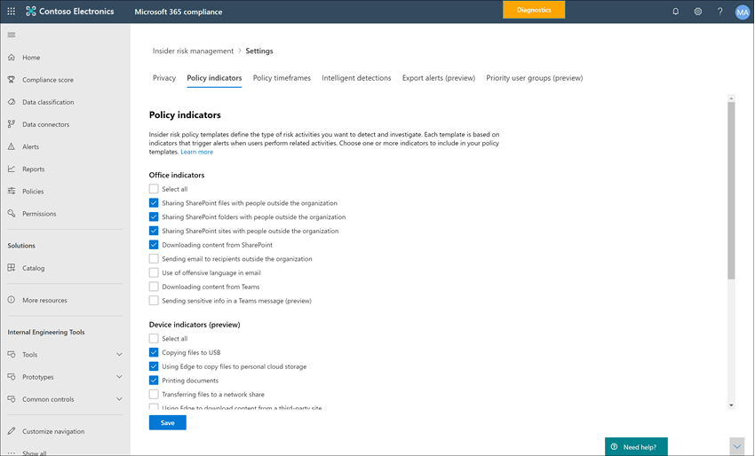
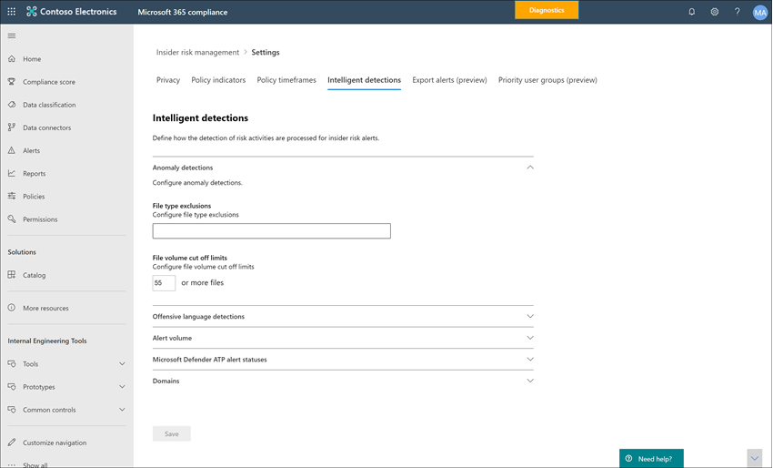

# 開始使用「內幕風險管理」設定

「內幕風險管理」設定會套用至所有「所有有問必答」風險管理原則，不論您在建立原則時所選擇的範本為何。 設定是使用「 **內幕風險設定** 」控制項設定，其位於所有「內幕人員風險管理」索引標籤的頂端。 這些設定會控制下列方面的原則元件：

- 隱私權
- 指標
- 原則時程表
- 智慧偵測
- 匯出提醒 (預覽) 
-  (預覽的優先順序使用者群組) 
- 優先順序實體資產 (預覽) 
-  (預覽的自動功能流程預覽) 
- Microsoft 小組 (預覽) 

在您開始及建立內部使用者風險管理原則之前，請務必瞭解這些設定，並選擇最適合貴組織之規範需求的設定層級。

## 隱私權

保護具有原則相符之使用者的隱私權很重要，可協助您在資料調查和分析審核中，objectivity 內部的風險警示。 針對具有內部擁有風險原則的使用者，您可以選擇下列其中一個設定：

- **顯示匿名版本的**使用者名稱：使用者的名稱是匿名，可防止系統管理員、資料調查人員和檢閱者看到與原則提醒相關聯的人員。 例如，使用者 ' 寬限期 Taylor ' 會以隨機 pseudonym 出現，例如「內部使用者風險管理」的所有區域中的「AnonIS8-988」。 選擇此設定 anonymizes 所有具有目前和過去原則相符的使用者，並套用至所有原則。 當您選取此選項時，就不會提供「內幕風險警示」和「案例詳細資料」中的使用者設定檔資訊。 不過，將新使用者新增至現有的原則或指派使用者給新的原則時，會顯示使用者名稱。 如果您選擇關閉此設定，則會針對所有具有目前或過去原則相符的使用者顯示使用者名。
- **不顯示匿名版本的使用者名**：會針對提醒及案例顯示所有目前的和過去的原則相符的使用者名。 使用者設定檔資訊 (會為使用者顯示所有擁有者風險管理提醒及案例的名稱、標題、別名及組織或部門) 。

## 指標

有問必答風險原則範本可定義您要偵測和調查的風險活動類型。 每個原則範本都是以對應特定觸發器和風險活動的特定指示器為基礎。 預設會停用所有指示器，而且必須先選取一個或多個原則指示器，再設定有問必答風險管理原則。

當使用者執行與符合所需閾值之原則指示器相關的活動時，便會觸發警示。 有問必答風險管理使用兩種類型的指示器：

- **觸發事件**：判斷使用者是否為內部使用者風險管理原則使用中的事件。 如果使用者新增至「內部使用者風險管理」原則，卻沒有觸發事件，則原則不會評估使用者活動。 例如，將使用者 A 新增至透過 *盜竊使用者* 原則範本所建立的原則，以及已正確設定原則和 MICROSOFT 365 HR connector 的原則。 在使用者 A 有 HR 連接器報告的終止日期之前，使用者 A 活動不會由此產生風險的「內幕風險管理」原則評估。 觸發事件的另一個範例是，在使用*資料洩漏*原則時，使用者有*高*嚴重性的 DLP 原則警示。
- **原則指示器**：包含在內部使用者風險管理原則中的指示器，用來判斷範圍內使用者的風險評分。 只有在使用者發生觸發事件後，才會啟動這些原則指示器。 一些原則指標的範例是使用者將資料複製到個人雲端儲存服務或可擕式儲存裝置時，或使用者與未經授權的外部使用者共用內部檔案和資料夾時。

原則指標分為下列方面。 您可以選擇在建立「內幕風險原則」時，為每個指示器層級啟動和自訂指示器事件限制的指示器：

- **Office**指標：包括 SharePoint 網站、小組和電子郵件訊息的原則指示器。
- **裝置**指標：包括透過網路或裝置共用檔案等活動的原則指示器。 標記包含 Microsoft Office 檔案所涉及的活動。CSV 檔案和。PDF 檔案。 如果您選取 [ **裝置**指標]，只會處理 Windows 10 組建1809或更新版本的裝置的活動。 如需設定裝置與內部人員風險整合的詳細資訊，請參閱 [使用端點 DLP 快速入門](endpoint-dlp-getting-started.md)。
- **違反安全性原則的指標**：包括來自 MICROSOFT Defender ATP 的標記，與未核准或惡意軟體安裝有關，或略過安全性控制。 若要在「內幕風險管理」中接收提醒，您必須啟用使用中的 Microsoft Defender ATP 授權和內部的「內部使用者風險整合」。 如需設定 Microsoft Defender ATP for 內幕風險管理整合的詳細資訊，請參閱 [在 Microsoft DEFENDER atp 中設定高級功能](https://docs.microsoft.com/windows/security/threat-protection/microsoft-defender-atp/advanced-features\#share-endpoint-alerts-with-microsoft-compliance-center)。
- **風險分數 boosters**：這包括針對非尋常的活動或過去的原則違規，提高風險分數。 啟用風險分數 boosters 會增加風險分數，以及這些類型的活動提醒的可能性。 如果已選取上方的一個或多個指示器，則只能選取 [風險分數 boosters]。

在某些情況下，您可能會想要限制已套用至組織中的內部使用者風險原則的有問必答風險原則指示器。 您可以從所有的內幕郵件原則中停用特定區域，以關閉原則指示器。 無法修改內部人員風險原則範本的觸發事件。

若要定義所有有問必答風險原則中已啟用的有問必答風險原則指示器，請流覽至 [**內幕人員風險設定**  >  **指示器**]，然後選取一或多個原則指標。 在 [原則嚮導] 中建立或編輯「內幕人員風險原則」時，無法個別設定 [標記設定] 頁面上選取的標記。

>[!NOTE]
>新增手動新增的使用者可能需要數小時的時間，才能出現在 [ **使用者] 儀表板**中。 這些使用者過去90天的活動可能需要長達24小時才會顯示。 若要查看手動新增使用者的活動，請在 [ **使用者] 儀表板** 上選取使用者，然後在詳細資料窗格中開啟 [ **使用者活動** ] 索引標籤。

### 標記層級設定 (預覽) 

在 [原則嚮導] 中建立原則時，您可以設定每日的風險事件數目如何影響「內幕風險」警示的風險分數。 這些指示器設定可協助您控制組織中風險事件數量的發生方式，應如何影響這些事件的風險評分，進而影響相關聯的警示嚴重性。 如果您願意，您也可以選擇保留 Microsoft 針對所有啟用的指示器所建議的預設事件閾值等級。

例如，您決定在設定新的有問必答風險 *資料洩漏* 原則的指示器時，啟用「內部使用者風險原則」設定中的 SharePoint 指示器，以及設定 SharePoint 事件的自訂閾值。 在「內幕風險原則」嚮導中，您可以為每個 SharePoint 指示器設定三個不同的日常事件層次，以影響與這些事件相關聯之警示的風險分數。

在第一個 [每日] 事件層級中，您會將臨界值設定為 *每日10個或多個事件* ，以降低事件的風險評分影響、每天 *20 或* 以上的事件，以瞭解對事件風險評分的影響，以及 *每天30或以上事件* 對事件風險評分的影響。 這些設定實際上表示：

- 如果有 1-9 SharePoint 事件會發生于觸發事件後，風險分數會影響最低，而且傾向不要產生警示。
- 如果有 10-19 SharePoint 事件會在觸發事件之後發生，則風險分數原本會變低，警示嚴重性層級一般會是低層級。
- 如果有 20-29 SharePoint 事件會發生在觸發後，風險分數就會變得更高，警示嚴重性層級一般會是中級。
- 在觸發後，如果有30個以上的 SharePoint 事件，風險分數就會變得更高，警示嚴重性層級會變得很高。

## 原則時段

原則時段可讓您定義過去和未來的考核週期，該期間會根據「有問必答風險管理」原則範本的事件和活動而觸發原則相符之後。 視您所選擇的原則範本而定，下列原則時段可供使用：

- **啟用視窗**：適用于所有原則範本， *啟用視窗* 是在觸發事件 **之後** 所定義的時段數目。 針對指派給該原則的任何使用者，此視窗會在觸發事件發生前于1到30天內啟用。 例如，您已設定「有問必答風險管理」原則，並將 *啟用時段* 設定為30天。 自您設定原則及觸發事件發生于原則中所包含的其中一位使用者，自您設定該原則之後已經過數個月。 觸發事件會在觸發事件發生後的30天內，啟動 [ *啟用] 視窗* ，並為該使用者啟用該原則。
- **過去的活動偵測**：可用於所有原則範本，但 *過去的活動偵測* 是在觸發事件 **之前** 定義的視窗天數。 針對指派給該原則的任何使用者，此視窗會在觸發事件發生前，于0至180天內啟用。 例如，您已設定「有問必答風險管理」原則，並將 *過去的活動偵測* 設定為90天。 自您設定原則及觸發事件發生于原則中所包含的其中一位使用者，自您設定該原則之後已經過數個月。 觸發事件會啟動 *過去的活動偵測* ，而且原則會在觸發事件前的90天內收集該使用者的已歷史活動。

## 智慧偵測

智慧偵測設定可協助您簡化針對警示處理危險活動的偵測方式。 在某些情況下，您可能需要定義要忽略的檔案類型，或者您想要對檔案執行偵測層級，以協助定義最小的提醒列。 使用冒犯性語言原則時，您可能需要增加或減少偵測敏感度，以控制所報告的原則相符量。 使用這些設定來控制整體警示量、檔案類型排除、檔案容量限制，以及冒犯性語言偵測敏感度。

### 反常偵測

反常的偵測包含檔案類型排除和檔容量限制的設定。

- **檔案類型排除**：若要從所有的內幕風險管理原則相符中排除特定檔案類型，請輸入以逗號分隔的檔案類型副檔名。 例如，若要排除某些類型的音樂檔案與原則相符，您可以在 [**檔案類型排除**] 欄位中輸入*aac、mp3、wav 及 wma* 。 所有的有問必答風險管理原則都會忽略具有這些副檔名的檔案。
- 檔案**磁片區剪下量限制**：若要在「內幕風險原則」中報告活動警示之前定義最低的檔層級，請輸入檔案數目。 例如，如果您不想要在使用者下載10個檔案或更少時產生有問必答風險警示，即使原則考慮此活動為反常，您也可以輸入 ' 10 '。

### 冒犯性語言偵測

>[!IMPORTANT]
>從2020年10月16日開始，您將無法再使用此範本建立原則。 使用此範本的任何作用中原則，必須在2021年1月後永久移除。 我們會取代支援此範本的冒犯性語言內建分類程式，因為它所產生的是大量的誤報。 為了處理攻擊性語言的風險問題，我們建議使用 Microsoft 365 [通訊相容性](communication-compliance.md) 原則。 如需內建分類器的詳細資訊，請參閱 [開始使用 trainable 類元](classifier-get-started-with.md)。

若要調整使用 *電子郵件範本中的冒犯語言* 原則的冒犯語言分類程式敏感度，請選擇下列其中一個設定：

- **Low**：偵測到冒犯性語言和 sentiment 的最小敏感度層級。 冒犯性語言比對的誤報概率會提升。
- **中**：用於偵測冒犯性語言和 sentiment 之平衡範圍的中級級靈敏度等級。 冒犯性語言比對之誤報的概率為平均。
- **高**：偵測到冒犯性語言和 sentiment，具有窄範圍的最高敏感度層級。 冒犯性語言比對的誤報概率很低。

### 警示量

擁有者風險原則所偵測到的使用者活動，會被指派特定風險分數，進而決定警示嚴重性 (低、中、高) 。 根據預設，我們會產生一定數量的低、中和高嚴重性警示，但是您可以增加或減少音量，以符合您的需求。 若要調整所有有問必答風險管理原則的警示數量，請選擇下列其中一個設定：

- **較少的提醒**：您會看到所有高嚴重性警示、較少嚴重性警報，但沒有低嚴重性。 此設定層級表示您可能會遺漏某些 true 的正值。
- **預設磁片**區：您會看到所有的高嚴重性警示，以及「中低」和「嚴重性」嚴重性警示的數量。
- **其他警示**：您會看到所有的中、高嚴重性的警示和最高嚴重性的警示。 這項設定層級可能會產生較多的誤報。

### Microsoft Defender 高級威脅防護 (預覽) 

[Microsoft Defender Advanced 威脅防護](https://docs.microsoft.com/windows/security/threat-protection/microsoft-defender-atp/microsoft-defender-advanced-threat-protection) (ATP) 是一種企業端點安全性平臺，旨在協助商業網路避免、偵測、調查和回應高級威脅。 若要更好地瞭解組織中的安全性違規，您可以針對來自「內幕人員風險管理」安全性違規原則範本之原則中所使用的活動，匯入並篩選 Microsoft Defender ATP 警示。

視您所感興趣的信號類型而定，您可以選擇根據 Microsoft Defender ATP 警示會審狀態，將警示匯入「內幕人員風險管理」。 您可以在要匯入的全域設定中，定義下列一或多個警示會審狀態：

- Unknown
- 新增
- 進行中。
- 已解決

每日會匯入 Microsoft Defender ATP 中的警示。 視您選擇的會審狀態而定，您可能會看到與 Microsoft Defender ATP 中的會審狀態變更相同的警示的多個使用者活動。

例如，如果您為此設定選取 [ *新增*]、[ *正在進行*] 及 [ *已解決* ]，則在產生 Microsoft Defender ATP 警示時，當狀態為「 *新*」時，會為使用者匯入「內幕風險」的初始警示活動。 當 Microsoft Defender ATP 分類狀態變更為 [ *進行中*] 時，會為使用者在「內幕風險」中匯入此警示的第二個活動。 設定最後一個 *已解析* 的 MICROSOFT Defender ATP 分類狀態時，會為使用者匯入此警示的第三個活動。 這項功能可讓調查人員追蹤 Microsoft Defender ATP 警示的進度，並選擇其調查所需的可見度層級。

>[!IMPORTANT]
>您需要在您的組織中設定 Microsoft Defender ATP，並在 Defender Security Center 中啟用 Microsoft Defender ATP，以取得內部的內幕風險管理整合，以匯入安全性侵犯警示。 如需設定 Microsoft Defender ATP for 內幕風險管理整合的詳細資訊，請參閱 [在 Microsoft DEFENDER atp 中設定高級功能](https://docs.microsoft.com/windows/security/threat-protection/microsoft-defender-atp/advanced-features\#share-endpoint-alerts-with-microsoft-compliance-center)。

### 網域 (預覽) 

網域設定可協助您定義通訊到特定網域的風險層級。 這些通訊包括共用檔、電子郵件訊息或下載內容。 透過在這些設定中指定網域，您可以增加或減少與這些網域發生之活動的風險計分。 例如，若要將 contoso.com 及 sales.wingtiptoys.com 指定為允許的網域，您可以在 [ **允許的網域** ] 欄位中輸入「contoso.com sales.wingtiptoys.com」。

針對下列每個網域設定，您最多可以輸入500個網域：

- **Unallowed 網域：** 透過指定 unallowed 網域，使用這些網域進行的活動會有 *較高* 的風險分數。
- **允許的網域：** 在 [設定] 中指定允許的網域時，使用這些網域進行的活動將會 *降低* 風險分數，而且會與處理內部組織活動的方式類似。 例如，這些網域的電子郵件活動的分析方式，會類似分析內部電子郵件活動的方式。
- **協力廠商網域：** 協力廠商網域是在您的組織中用於商業用途的網域，而敏感內容則可以儲存在這些位置。 透過指定協力廠商網域，您可以接收這些網域上任何危險活動的警示。

## 匯出提醒 (預覽) 

透過 [Office 365 管理活動 API 架構](https://docs.microsoft.com/office/office-365-management-api/office-365-management-activity-api-schema#security-and-compliance-alerts-schema)，可將內幕用的風險管理提醒資訊匯出至安全性資訊和事件管理 (SIEM) 服務。 您可以使用 Office 365 管理活動 APIs，將警示資訊匯出至組織可能用來管理或匯總有問必答風險資訊的其他應用程式。

若要使用 APIs 查看「內幕風險」警示資訊：

1. 在**有問必答風險管理**  >  **設定**  >  **匯出**中啟用 Office 365 管理活動 API 支援。 根據預設，您的 Microsoft 365 組織會停用此設定。
2. 透過 *SecurityComplianceAlerts*，篩選通用的 Office 365 審核活動。
3. 依*InsiderRiskManagement*類別篩選*SecurityComplianceAlerts* 。

警示資訊包含安全性和合規性警示架構和 Office 365 管理活動 API 通用架構中的資訊。

針對 Security & 相容性警示架構，會匯出下欄欄位及值，以取得內幕風險管理警示：

| **警示參數** | **描述** |
|:------------------|:----------------|
| AlertType | 警示的類型為 [ *自訂*]。  |
| 為 alertid | 警示的 GUID。 有問必答風險管理提醒是可變的。 當警示狀態變更時，會產生具有相同 AlertID 的新記錄。 此 AlertID 可用於關聯警示的更新。 |
| 類別 | 警示的類別是 *InsiderRiskManagement*。 此類別可用於辨別來自其他安全性 & 合規性警示的警示。 |
| 註解 | 警示的預設批註。 值是在建立警示時所記錄的 *新警示* () 並在更新警示) 時， (記錄 *警示更新* 。 使用 AlertID 來關聯警示的更新。 |
| 資料 | 警示的資料，包含使用者的唯一識別碼、使用者主體名稱，以及在使用者被觸發到原則時 (UTC) 的日期和時間。 |
| 姓名 | 產生警示之有問必答風險管理原則的原則名稱。 |
| PolicyId | 觸發警示的「有問必答風險管理」原則的 GUID。 |
| 嚴重性 | 警示的嚴重性。 值為 *高*、 *中*或 *低*。 |
| 來源 | 警示的來源。 其值為 *Office 365 的安全性 & 符合性*。 |
| 狀態 | 警示的狀態。 值是作用中* (需要*在「內幕風險」) 中，*調查* (已*確認*的內會員風險) *中的 [* 已確定] (，*已解決*) 在「內幕人員風險* (中**已**解除) 。* |
| 版本 | 安全性與合規性警示架構的版本。 |

針對 [Office 365 管理活動 API 通用架構](https://docs.microsoft.com/office/office-365-management-api/office-365-management-activity-api-schema#common-schema)，匯出下欄欄位及值，以取得內部的風險管理提醒。

- UserId
- 識別碼
- RecordType
- CreationTime
- 作業
- OrganizationId
- UserType
- UserKey

##  (預覽的優先順序使用者群組) 

組織中的使用者可能會有不同層級的風險，取決於其位置、敏感資訊存取權或風險記錄。 排定這些使用者之活動的檢查和計分的優先順序，可協助提醒您組織可能會產生更高後果的潛在風險。 「有問必答風險管理」中的「優先順序使用者群組」可協助您定義組織中需要進一步檢查及更敏感風險計分的使用者。 結合優先順序使用者和資料洩漏的*安全性原則違反**優先順序使用者*原則範本，新增至優先順序使用者群組的使用者，具有較高嚴重性等級的「擁有者」風險警示及警示的可能性增加。

例如，您需要針對高度機密的專案，避免使用者可以存取機密資訊的資料洩漏。 您可以選擇為組織中可在此專案上運作的使用者建立「*機密專案**使用者*」優先順序使用者群組。 您可以使用原則嚮導和 *優先順序使用者* 原則範本的資料洩漏，來建立新的原則，並將「 *機密專案使用者* 優先順序使用者」群組指派給原則。 由「 *機密專案使用者* 」優先順序使用者群組之成員的原則所檢查的活動，對風險和活動的敏感程度，對這些使用者而言會比較容易產生警示，而且具有較高嚴重性層級的警示。

### 建立優先順序使用者群組

若要建立新的優先順序使用者群組，您可以使用 Microsoft 365 規範中心內的「 **有問必答風險管理** 」方案中的設定控制項。 若要建立優先順序使用者群組，您必須是「 *內部使用者風險管理* 」或「 *內幕風險管理* 」管理角色群組的成員。

完成下列步驟以建立優先順序使用者群組：

1. 在 [Microsoft 365 規範中心](https://compliance.microsoft.com)中，移至 [ **內部人員風險管理** ]，然後選取 [ **有問必答風險設定**]。
2. 選取 [ **優先順序使用者群組** ] 索引標籤
3. 在 [ **優先順序使用者群組** ] 索引標籤上，選取 [ **建立優先順序使用者群組** ]，以啟動 [群組建立] 嚮導。
4. 在 [ **定義群組** ] 頁面上，完成下欄欄位：
    - **Name (必要) **：請為優先順序使用者群組輸入易記名稱。 您在完成該嚮導後，就無法變更 [優先順序] 使用者群組的名稱。
    - **Description (optional) **：輸入優先順序使用者群組的描述。
5. 選取 **[下一步]** 繼續。
6. 在 [ **選擇成員** ] 頁面上，選取 **[選擇** 要搜尋的成員]，然後選取要包含在群組中的擁有郵件功能的使用者帳戶，或選取 [ **選取所有** ] 核取方塊，將組織中的所有使用者新增至群組。 選取 [ **新增** ] 繼續或 [ **取消** ] 關閉，而不將任何使用者新增至群組。
7. 選取 **[下一步]** 繼續。
8. 在 [ **複查** ] 頁面上，複查您為 [優先順序] 使用者群組選取的設定。 選取 [ **編輯** ] 以變更任一群組值，或 **選取 [** 送出] 以建立及啟動 [優先順序] 使用者群組。
9. 在 [確認] 頁面上，選取 [ **完成] 結束** 嚮導。

### 更新優先順序使用者群組

若要更新現有的優先順序使用者群組，您可以使用 Microsoft 365 規範中心內的「 **有問必答風險管理** 」方案中的設定控制項。 若要更新優先順序使用者群組，您必須是「 *內部使用者風險管理* 」或「 *內幕風險管理* 」管理角色群組的成員。

完成下列步驟以編輯優先順序使用者群組：

1. 在 [Microsoft 365 規範中心](https://compliance.microsoft.com)中，移至 [ **內部人員風險管理** ]，然後選取 [ **有問必答風險設定**]。
2. 選取 [ **優先順序使用者群組** ] 索引標籤
3. 選取您要編輯的 [優先順序] 使用者群組，然後選取 [ **編輯群組**]。
4. 在 [ **定義群組** ] 頁面上，視需要更新描述欄位。 您無法更新優先順序使用者群組的名稱。 選取 **[下一步]** 繼續。
5. 在 [ **選擇成員** ] 頁面上，使用 [ **選擇成員** ] 控制項，將新成員新增至群組。 若要從群組中移除使用者，請選取您要移除之使用者旁邊的「X」。 選取 **[下一步]** 繼續。
6. 在 [ **複查** ] 頁面上，複查您為 [優先順序] 使用者群組選取的更新設定。 選取 [ **編輯** ] 以變更任一群組值，或選取 [ **提交** ] 以更新 [優先順序] 使用者群組。
7. 在 [確認] 頁面上，選取 [ **完成] 結束** 嚮導。

### 刪除優先順序使用者群組

若要刪除現有的優先順序使用者群組，您可以使用 Microsoft 365 規範中心內的「 **有問必答風險管理** 」方案中的設定控制項。 若要刪除優先順序使用者群組，您必須是「 *內部使用者風險管理* 」或「 *內幕風險管理* 」管理角色群組的成員。

>[!IMPORTANT]
>刪除 [優先順序] 使用者群組會將其從所指派的任何作用中原則中移除。 如果您刪除指派給使用中原則的優先順序使用者群組，則該原則不會包含任何範圍內的使用者，且將有效地閒置，也不會建立提醒。

完成下列步驟以刪除優先順序使用者群組：

1. 在 [Microsoft 365 規範中心](https://compliance.microsoft.com)中，移至 [ **內部人員風險管理** ]，然後選取 [ **有問必答風險設定**]。
2. 選取 [ **優先順序使用者群組** ] 索引標籤
3. 選取您要編輯的 [優先順序] 使用者群組，然後從 [儀表板] 功能表中選取 [ **刪除** ]。
4. 在 [ **刪除** ] 對話方塊中，選取 [ **是]** 刪除優先順序使用者群組，或選取 [ **取消** ] 以回到儀表板。

## 優先順序實體資產 (預覽) 

識別對優先順序實體資產的存取，以及將存取活動與使用者事件關聯，是法規遵從性基礎結構的重要元件。 這些實體資產代表組織中的優先順序位置，例如公司大樓、資料中心或伺服器機房。 內幕風險活動可能會與使用者工作不尋常的時段相關聯，嘗試存取這些未經授權的機密或安全區域，並要求存取高層次區域，但沒有合法的需求。

在啟用優先順序的實體資產和 [實體聲譽徽章授予資料連線器](import-physical-badging-data.md) 設定的情況下，內部使用者風險管理會將您實體控制和存取系統的信號與其他使用者風險活動整合。 透過檢查各實體存取系統的行為模式，並將這些活動與其他有問必答風險事件關聯，可協助合規性調查人員和分析員對提醒作出更明智的回應決策。 對優先順序實體資產的存取權以不同于非優先順序資產的存取權進行計分及識別。

例如，您的組織為使用者提供了聲譽徽章授予系統，可監控和核准對正常運作及敏感專案區域的實際存取。 您有數個使用者在處理機密專案，而這些使用者會在專案完成時回到其他組織區域。 當敏感專案臨近完成時，您想要確定專案工作仍然保持機密，且嚴格控制對專案區域的存取。

您可以選擇啟用 Microsoft 365 中的實體聲譽徽章授予資料連線器，以匯入實體聲譽徽章授予系統的存取訊號，並指定「內部使用者風險管理」中的優先順序實物資產。 透過從您的聲譽徽章授予系統匯入資訊，並將實體存取訊號與「有問必答風險管理」中識別的其他風險活動相關聯，您會注意到專案的其中一位使用者在正常的工作時間之後存取專案辦事處，而且也會將大量資料從其正常的工作區域匯出到個人雲端儲存服務。 與線上活動相關聯的此實體存取活動可能會指出可能的資料偷竊和合規性調查人員和分析員可以採取此使用者環境所規定的適當動作。

### 設定優先順序實物資產

若要設定優先順序的實物資產，您可以設定實體聲譽徽章授予連接器，並使用 Microsoft 365 規範中心內的「 **內幕風險管理** 」方案中的設定控制項。 若要設定優先順序的實物資產，您必須是「 *內部使用者風險管理* 」或「 *內幕風險管理」管理角色群組*的成員。

完成下列步驟來設定優先順序實物資產：

1. 請依照「 [開始使用內幕程式風險管理](insider-risk-management-configure.md) 」一文中的「內幕程式風險管理」的設定步驟進行。 在步驟3中，請確定您已設定實體聲譽徽章授予連接器。

    >[!IMPORTANT]
    >若要使用或關聯使用實體控制和存取平臺之事件資料的委任及終止使用者相關的通知資料，您也必須設定 Microsoft 365 HR connector。 如果您啟用實體聲譽徽章授予連接器，但未啟用 Microsoft 365 HR connector，「內部使用者風險管理原則」只會處理組織中使用者的實體存取活動事件。

2. 在[Microsoft 365 規範中心](https://compliance.microsoft.com)內，移至「**內幕風險管理**」，然後選取「**內幕人員風險設定**  >  **優先順序實物資產**」。
3. 在 [ **優先順序實物資產** ] 頁面上，您可以手動新增您要監視實體聲譽徽章授予連接器所匯入之資產事件的實體資產 IDs，或匯入 a。所有實物資產的 CSV 檔案 IDs 由實體聲譽徽章授予連接器匯入：) 若要手動新增實體資產 IDs，請選擇 [ **新增優先順序實物資產**]，輸入實物資產識別碼，然後選取 [ **新增**]。 輸入其他實物資產 IDs，然後選取 [ **新增優先順序的實物資產** ] 以儲存輸入的所有資產。
    b) 以從 a 新增實體資產 IDs 清單。CSV 檔案中，選擇 [匯 **入優先順序實物資產**]。 在 [檔案瀏覽器] 對話方塊中，選取。CSV 檔案，然後選取 [ **開啟**]。 實體資產 IDs 來源。CSV 檔案會新增至清單。
4. 流覽至 [設定] 中的 [ **原則指示器** ] 索引標籤。
5. 在 [ **原則** 指標] 頁面上，流覽至 [ **實體存取** 指標] 區段，然後選取 **終止或存取機密資產失敗後的實體存取**核取方塊。
6. 選取 [ **儲存** ] 設定並結束。

### 刪除優先順序的實物資產

若要刪除現有的優先順序實物資產，您可以使用 Microsoft 365 規範中心內的「有問必答風險管理」方案中的設定控制項。 若要刪除優先順序的實物資產，您必須是「內部使用者風險管理」或「內幕風險管理」管理角色群組的成員。

>[!IMPORTANT]
>刪除優先順序的實物資產會將其預先包含的任何作用中原則，從考試中移除。 不會刪除優先順序實體資產相關聯的活動所產生的警示。

完成下列步驟以刪除優先順序實物資產：

1. 在[Microsoft 365 規範中心](https://compliance.microsoft.com)內，移至「**內幕風險管理**」，然後選取「**內幕人員風險設定**  >  **優先順序實物資產**」。
2. 在 [ **優先順序實物資產** ] 頁面上，選取您要刪除的資產。
3. 在 [動作] 功能表上選取 [ **刪除** ]，以刪除資產。

##  (預覽的自動功能流程預覽) 

[Microsoft Power 自動化](https://docs.microsoft.com/power-automate/getting-started) 是一種工作流程服務，可在應用程式和服務間自動執行動作。 您可以使用來自範本或手動建立的流程，來自動化與這些應用程式和服務相關聯的常見工作。 當您為內幕風險管理啟用電源自動化流程時，您可以自動化案例和使用者的重要工作。 您可以設定 Power 自動化流程以取得使用者、警示及案例資訊，並與專案關係人和其他應用程式共用此資訊，以及自動化內幕程式風險管理中的動作，例如：發佈至案例記事。 電源自動化流程適用于案例及原則範圍中的任何使用者。

客戶若使用包含「內幕風險管理」的 Microsoft 365 訂閱，則不需要額外的功率自動授權，即可使用建議的「內部使用者風險管理」功能自動化範本。 您可以自訂這些範本，以支援您的組織及涵蓋核心內部使用者風險管理案例。 如果您選擇使用這些範本中的 [高功耗自動功能] 功能，請使用 Microsoft 365 規範連接器建立自訂範本，或在 Microsoft 365 中使用其他法規遵從性區域的 Power templates 範本，您可能需要額外的電量自動授權。

下列電源自動化的範本可供客戶用來支援內部使用者風險管理使用者和案例的處理常式自動化：

- 將**使用者新增至「內部使用者風險原則」時通知使用者**：此範本適用于具有內部原則、隱私權或法規需求的組織，當使用者服從于「內幕人員風險管理」原則時，必須加以通知。 當使用者在 [使用者] 頁面上為使用者設定並選取此流程時，當使用者新增至「有問必答風險管理」原則時，系統會傳送電子郵件訊息給使用者及其主管。 這個範本也支援更新 SharePoint 網站上主控的 SharePoint 清單，以協助追蹤通知訊息的詳細資料，例如日期/時間和郵件收件者。 使用此範本的 Power 自動化流程可在 [ **使用者] 儀表板**上使用。
- **在內部使用者風險案例中，向使用者要求來自人力資源或公司的資訊**：在案例中，內幕人士風險分析員和調查人員可能需要與人力資源或其他專案關係人協商，以瞭解案例活動的內容。 當您為案例設定並選取此流程時，分析員和調查人員會傳送電子郵件給為此流程設定的人力資源和業務利益關係人。 每個收件者都是以預先設定或可自訂的回應選項傳送郵件。 [收件者] 選取 [回應] 選項時，會將回應記錄為案例附注，並包含收件者和日期/時間資訊。 使用此範本的 Power 自動化流程可在 **案例儀表板**上使用。
- **當使用者有「有問必答風險」提醒時通知管理員**：有些組織可能需要在使用者有「擁有者風險管理」提醒時立即產生管理通知。 設定並選取此流程時，系統管理員會收到一封電子郵件，其中包含所有案例提醒的下列相關資訊： 
    - 適用于警示的原則
    - 提醒的日期/時間
    - 警示的嚴重性等級

    此流程會自動更新案例備註，表明郵件已傳送，且該流程已啟用。 使用此範本的 Power 自動化流程可在 **案例儀表板**上使用。

- **新增行事曆提醒以追蹤「有問必答風險案例**」：此範本可讓風險調查人員和分析員將案例的行事曆提醒新增至他們的 Office 365 Outlook 行事曆。 此流程可讓使用者在處理案例及會審警示時，不再需要使用者關閉或換出「內幕風險管理」工作流程。 設定並選取此流程時，會針對執行流程的使用者，將提醒新增至 Office 365 Outlook 行事曆。 使用此範本的 Power 自動化流程可在 **案例儀表板**上使用。

### 建立從內幕風險管理範本的電源自動化流程

若要建立來自建議的內幕風險管理範本的電源自動化流程，您可以使用 Microsoft 365 規範中心內的**有問必答風險管理**解決方案中的 [設定] 控制項，或直接在**案例**或**使用者儀表板**中工作時，**自動**控制 [**管理電源自動化流程**] 選項。

若要在 [設定] 區域中建立電源自動化流程，您必須是「 *內部使用者風險管理* 」或「 *內幕風險管理* 」管理角色群組的成員。 若要使用 [ **管理電源自動化流程** ] 選項建立電源自動化流程，您必須是至少一個「內幕風險管理」角色群組的成員。

完成下列步驟，以從建議的「內幕風險管理範本」建立電源自動化流程：

1. 在[Microsoft 365 規範中心](https://compliance.microsoft.com/)內，移至「**內幕人員風險管理**」，然後選取 [**有問必答風險設定**] [  >  **自動處理流程**]。 您也可以透過選擇 [ **Cases** **自動化** **Users dashboards**  >  **管理電源自動化流程**]，從 [案例] 或 [使用者] 儀表板頁面存取。
2. 在 [ **電源自動流程** ] 頁面上，從頁面上的 [ **內部使用者風險管理範本** ] 區段中，選取建議的範本。
3. 流程會列出流程所需的內嵌連線，並注意是否有可用的線上狀態。 如有需要，請更新任何未顯示為可用的連線。 選取 [ **繼續**]。
4. 根據預設，建議的流程會預先設定建議的「內幕風險管理」和「Microsoft 365 服務資料」欄位，以完成流程所指派的工作。 如有需要，請使用 [ **顯示高級選項** ] 控制項，並設定流程元件的可用屬性，以自訂流程元件。
5. 如有需要，請選取 [ **新增步驟** ] 按鈕，將任何其他步驟新增至流程。 在大多數情況下，建議的預設範本不需要這麼做。
6. 選取 [ **儲存草稿** ] 以儲存流程以進行進一步設定，或選取 [ **儲存** ] 以完成流程的設定。
7. 選取 [ **關閉** ] 以回到 [ **電源自動化流程** ] 頁面。 新的範本會在「 **我的資料流程** 」索引標籤上的流程中列出，當您使用建立流程之使用者的「有問必答」風險管理案例時，會自動從 [ **自動化** ] 下拉式清單中取得。

>[!IMPORTANT]
>如果您組織中的其他使用者需要存取流程，必須共用流程。

### 為內幕人士風險管理建立自訂電源自動化流程

組織的某些程式和工作流程可能位於建議的「內部使用者風險」管理流程範本之外，您可能需要為「內部使用者風險管理」區域建立自訂的 Power 自動化流程。 電力自動化流程具有彈性且支援廣泛的自訂，但是必須採取一些步驟，才能與「內幕人員風險管理」功能整合。

完成下列步驟，為內部人員風險管理建立自訂的 Power 自動化範本：

1. **檢查您的電源自動化流程授權**：若要建立使用「內部使用者風險管理」觸發器的自訂電源自動化流程，您需要使用電源自動授權。 建議的內部使用者風險管理流程範本不需要額外的授權，而且會包含在您的有問必答風險管理授權中。
2. **建立自動化流程**：建立流程，該流程會在由內幕人員風險管理事件觸發後執行一或多項工作。 如需如何建立自動流程的詳細資訊，請參閱 [create a flow In Power 自動化](https://docs.microsoft.com/power-automate/get-started-logic-flow)。
3. **選取 microsoft 365 合規性連接器**：搜尋並選取 microsoft 365 規範連接器。 此連接器啟用內部使用者風險管理觸發器和動作。 如需連接器的詳細資訊，請參閱 [連接器參考概覽](https://docs.microsoft.com/connectors/connector-reference/) 文章。
4. **選擇您流程的「有問必答風險管理觸發器**」：「內部使用者風險管理」有兩個可供自訂電源自動化流程使用的觸發器：
    - **針對選取的「內幕風險管理案例**」，可以從「內幕風險管理案例」儀表板頁面中選取使用此觸發器的流程。
    - **針對選取的「內部使用者風險管理」使用者**：可以從「內幕使用者風險管理使用者」儀表板頁面中選取使用此觸發器的流程。
5. 選擇您流程的「有問必答風險管理動作」：您可以選擇多個執行內部專案風險管理的動作，以包含在您的自訂流程中：
    - 取得有問必答風險管理提醒
    - 取得有問必答風險管理案例
    - 取得有問必答風險管理使用者
    - 取得案例的有問必答風險管理提醒
    - 新增「有問必答風險管理案例」附注

### 共用電源自動化流程

根據預設，使用者只可以使用使用者所建立的自動功能流程。 若要讓其他有問必答風險管理使用者能夠存取和使用流程，流程必須由流程建立者共用。 若要共用流程，當您直接在**案例**或**使用者儀表板**頁面中工作時，您將使用 Microsoft 365 規範中心內的「**內幕風險管理」解決方案**中的 [**管理電源自動流程**] 選項。 當您已共用流程之後，共用該流程的所有人都可以在**案例**和**使用者儀表板**中存取「**自動化**控制」下拉式清單中的流程。

若要在 [設定] 區域中共用電源自動化流程，您必須是「 *內部使用者風險管理* 」或「 *內幕風險管理* 」管理角色群組的成員。 若要與「 **管理電源自動化流程** 」選項共用電源自動化流程選項，您必須是至少一個「內幕風險管理」角色群組的成員。

完成下列步驟以共用電源自動化流程：

1. 在[Microsoft 365 規範中心](htttps://compliance.microsoft.com)內，移至「**內幕人員風險管理**」，然後選取 [**有問必答風險設定**] [  >  **自動處理流程**]。 您也可以透過選擇 [ **Cases** **自動化** **Users dashboards**  >  **管理電源自動化流程**]，從 [案例] 或 [使用者] 儀表板頁面存取。
2. 在 [ **電源自動流程** ] 頁面上，選取 [ **我的流量** ] 或 [ **小組流程** ] 索引標籤。
3. 選取 [要共用的流程]，然後從 [流程選項] 功能表中選取 [ **共用** ]。
4. 在 [流程共用] 頁面上，輸入您要新增為流程的擁有者的使用者或群組名稱。
5. 在 [ **使用的連接** ] 對話方塊中，選取 **[確定** ] 以確認新增的使用者或群組具有流程的完整存取權。

### 編輯電源自動化流程

若要編輯流程，當直接在**案例**或**使用者儀表板**中工作時，您可以使用 Microsoft 365 規範中心內的**有問必答風險管理**解決方案中的設定控制項，或從「**自動化**」控制中的 [**管理電源自動化流程**] 選項。

若要編輯 [設定] 區域中的 [電源自動化流程]，您必須是「 *內部使用者風險管理* 」或「 *內幕風險管理* 」管理角色群組的成員。 若要使用 [ **管理電源自動化流程** ] 選項來編輯電源自動化流程，您必須是至少一個「內幕風險管理」角色群組的成員。

完成下列步驟以編輯電源自動化流程：

1. 在[Microsoft 365 規範中心](htttps://compliance.microsoft.com)內，移至「**內幕人員風險管理**」，然後選取 [**有問必答風險設定**] [  >  **自動處理流程**]。 您也可以透過選擇 [ **Cases** **自動化** **Users dashboards**  >  **管理電源自動化流程**]，從 [案例] 或 [使用者] 儀表板頁面存取。
2. 在 [ **電源自動流程** ] 頁面上，選取要編輯的流程，然後從 [流程式控制制] 功能表中選取 [ **編輯** ]。
3. 選取**省略號**  >  **設定**，以變更流程元件設定或**省略號**  >  **刪除**，以刪除流程元件。
4. 選取 [ **儲存** ]，然後按一下 [ **關閉** ] 完成流程的編輯。

### 刪除電源自動化流程

若要刪除流程，您可以使用 Microsoft 365 規範中心內的**有問必答風險管理**解決方案中的設定控制項，或直接在**案例**或**使用者儀表板**中工作時，從「**自動化**」控制中的 [**管理電源自動化流程**] 選項。 當流程遭刪除時，會將其當作所有使用者的選項移除。

若要刪除 [設定] 區域中的 [電源自動化流程]，您必須是「 *內部使用者風險管理* 」或「 *內幕風險管理* 」管理角色群組的成員。 若要使用 [ **管理電源自動化流程** ] 選項來刪除電源自動化流程，您必須是至少一個「內幕風險管理」角色群組的成員。

完成下列步驟，以刪除電源自動化流程：

1. 在[Microsoft 365 規範中心](htttps://compliance.microsoft.com)內，移至「**內幕人員風險管理**」，然後選取 [**有問必答風險設定**] [  >  **自動處理流程**]。 您也可以透過選擇 [ **Cases** **自動化** **Users dashboards**  >  **管理電源自動化流程**]，從 [案例] 或 [使用者] 儀表板頁面存取。
2. 在 [ **電源自動流程** ] 頁面上，選取要刪除的流程，然後從 [流程式控制制] 功能表中選取 [ **刪除** ]。
3. 在 [刪除確認] 對話方塊中，選取 [ **刪除** ] 以移除流程，或選取 [ **取消** ] 結束刪除動作。

## Microsoft 小組 (預覽) 

規範分析師和調查人員可以輕鬆地使用 Microsoft 團隊共同作業的內幕風險管理案例。 他們可以與 Microsoft 團隊中的其他專案關係人協調和通訊，以進行下列作業：

- 針對私人團隊管道中的案例，協調和審閱回應活動
- 安全地共用及儲存與個別案例相關的檔案與證據
- 依分析員和調查人員追蹤和審閱回應活動

在 Microsoft 團隊啟用內部人員風險管理之後，每次確認提醒並建立案例時，就會建立專屬的 Microsoft 團隊小組。 根據預設，小組會自動納入「 *內部使用者風險管理*」、「 *有問必答風險管理分析師*」和「 *內幕風險管理調查* 人員」角色群組的所有成員， (最多100初始使用者) 。 其他組織參與者可能會在建立之後和適當時，新增至團隊。 在啟用 Microsoft 團隊之前所建立的現有案例中，分析人員和調查人員可以選擇在必要時使用案例中建立新的 Microsoft 團隊團隊。  當您解決「內幕風險管理」中的相關案例後，就會自動將該小組封存 (移至隱藏及唯讀) 。

如需如何在 Microsoft 小組中使用團隊和管道的詳細資訊，請參閱 [Microsoft 小組中的團隊和管道的概述](https://docs.microsoft.com/MicrosoftTeams/teams-channels-overview)。

啟用 Microsoft 小組對案例的支援，快速且易於設定。 若要為內部人員風險管理啟用 Microsoft 團隊，請完成下列步驟：

1. 在[Microsoft 365 規範中心](htttps://compliance.microsoft.com)內，移至「**內幕人員風險管理**  >  **有問必答」風險設定**。
2. 選取 [ **Microsoft 小組** ] 索引標籤。
3. 為內部人員風險管理啟用 Microsoft 小組整合。
4. 選取 [ **儲存** ] 設定並結束。

### 建立現有案例的 Microsoft 小組小組

如果您在有現有案例後，為「內部人員風險管理」啟用 Microsoft 團隊支援，您必須視需要為每個案例手動建立小組。 在啟用「內幕風險管理」設定中的 Microsoft 團隊支援之後，新案例會自動建立新的 Microsoft 團隊小組。

使用者需要在組織中建立 Microsoft 365 群組的許可權，才能從案例建立 Microsoft 小組小組。 如需管理 Microsoft 365 群組許可權的相關資訊，請參閱 [管理誰可以建立 microsoft 365 群組](https://docs.microsoft.com/microsoft-365/solutions/manage-creation-of-groups)。

若要為案例建立小組，當您直接在現有案例中工作時，您會使用 [建立 Microsoft 小組] 控制項。 完成下列步驟以建立新的團隊：

1. 在[Microsoft 365 規範中心](htttps://compliance.microsoft.com)內，移至「**內幕人員風險管理**  >  **案例**」，然後選取現有的案例。
2. 在 [案例動作] 功能表上，選取 [ **建立 Microsoft 團隊**]。
3. 在 [ **小組名稱** ] 欄位中，輸入新 Microsoft 團隊小組的名稱。
4. 選取 [ **建立 Microsoft 團隊** ]，然後選取 [ **關閉**]。

根據指派給「有問必答風險管理」角色群組的使用者人數，在案例中，所有調查人員和分析員都可能需要15分鐘的時間，才能加入至 Microsoft 小組小組。
