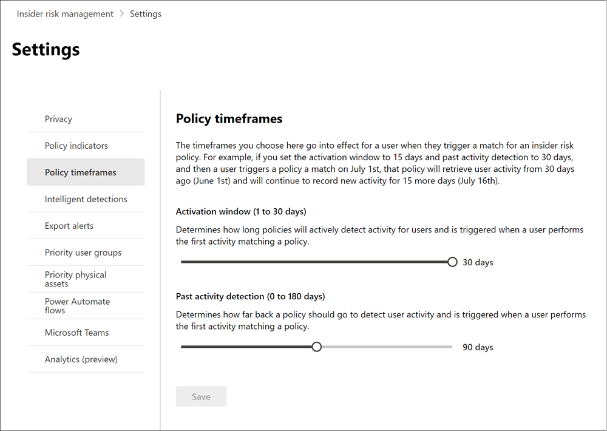

# 開始使用「內幕風險管理」設定Get started with insider risk management settings

當您建立原則時，無論您選擇哪個範本，「內部使用者風險管理」設定都適用于所有的有問必答風險管理原則。Insider risk management settings apply to all insider risk management policies, regardless of the template you choose when creating a policy. 設定是使用位於所有內部風險管理索引標籤頂端的 **內部風險設定** 控制項來設定。Settings are configured using the **Insider risk settings** control located at the top of all insider risk management tabs. 這些設定會控制下列方面的原則元件：These settings control policy components for the following areas:

- 隱私權Privacy
- 指標Indicators
- 原則時程表Policy timelines
- 智慧型偵測Intelligent detections
- 匯出提醒 (預覽) Export alerts (preview)
-  (預覽的優先順序使用者群組) Priority user groups (preview)
- 優先順序實體資產 (預覽) Priority physical assets (preview)
- Power Automate 流量 (預覽) Power Automate flows (preview)
- Microsoft Teams (預覽) Microsoft Teams (preview)
- 分析 (預覽) Analytics (preview)

在您開始及建立內部使用者風險管理原則之前，請務必瞭解這些設定，並選擇最適合貴組織之規範需求的設定層級。Before you get started and create insider risk management policies, it's important to understand these settings and choose setting levels best for the compliance needs for your organization.

## 隱私權Privacy

保護符合原則之使用者的隱私權非常重要，可協助提升內部風險警示的資料調查和分析審查的包容性。Protecting the privacy of users that have policy matches is important and can help promote objectivity in data investigation and analysis reviews for insider risk alerts. 針對具有內部擁有風險原則的使用者，您可以選擇下列其中一個設定：For users with an insider risk policy match, you can choose one of the following settings:

- **顯示匿名版本的** 使用者名稱：使用者的名稱是匿名，可防止系統管理員、資料調查人員和檢閱者看到與原則提醒相關聯的人員。**Show anonymized versions of usernames**: Names of users are anonymized to prevent admins, data investigators, and reviewers from seeing who is associated with policy alerts. 例如，使用者 'Grace Taylor' 在內部風險管理體驗的所有區域都會以隨機假名 (例如 'AnonIS8-988') 顯示。For example, a user 'Grace Taylor' would appear with a randomized pseudonym such as 'AnonIS8-988' in all areas of the insider risk management experience. 選擇此設定會將所有符合目前和過去原則的使用者匿名，並適用於所有原則。Choosing this setting anonymizes all users with current and past policy matches and applies to all policies. 當您選取此選項時，就不會提供「內幕風險警示」和「案例詳細資料」中的使用者設定檔資訊。User profile information in the insider risk alert and case details will not be available when this option is chosen. 不過，將新使用者新增至現有的原則或指派使用者給新的原則時，會顯示使用者名稱。However, usernames are displayed when adding new users to existing policies or when assigning users to new policies. 如果您選擇關閉此設定，則會針對所有具有目前或過去原則相符的使用者顯示使用者名。If you choose to turn off this setting, usernames will be displayed for all users that have current or past policy matches.
- **不顯示匿名版本的使用者名**：會針對提醒及案例顯示所有目前的和過去的原則相符的使用者名。**Do not show anonymized versions of usernames**: Usernames are displayed for all current and past policy matches for alerts and cases. 使用者設定檔資訊 (會為使用者顯示所有擁有者風險管理提醒及案例的名稱、標題、別名及組織或部門) 。User profile information (the name, title, alias, and organization or department) is displayed for the user for all insider risk management alerts and cases.

## 指標Indicators

有問必答風險原則範本可定義您要偵測和調查的風險活動類型。Insider risk policy templates define the type of risk activities that you want to detect and investigate. 每個原則範本都是以對應特定觸發器和風險活動的特定指示器為基礎。Each policy template is based on specific indicators that correspond to specific triggers and risk activities. 預設會停用所有指示器，而且必須先選取一個或多個原則指示器，再設定有問必答風險管理原則。All indicators are disabled by default, and you must select one or more policy indicators before configuring an insider risk management policy.

當使用者執行與符合所需閾值之原則指示器相關的活動時，便會觸發警示。Alerts are triggered by policies when users perform activities related to policy indicators that meet a required threshold. 有問必答風險管理使用兩種類型的指示器：Insider risk management uses two types of indicators:

- **觸發事件**：判斷使用者在內部使用者風險管理原則中是否處於作用中的事件。**Triggering events**: Events that determine if a user is active in an insider risk management policy. 如果使用者新增至「內部使用者風險管理」原則，卻沒有觸發事件，則原則不會評估使用者活動。If a user is added to an insider risk management policy does not have a triggering event, the user activity is not evaluated by the policy. 例如，將使用者 A 新增至透過 *盜竊使用者* 原則範本所建立的原則，以及已正確設定原則及 Microsoft 365 HR connector 的原則。For example, User A is added to a policy created from the *Data theft by departing users* policy template and the policy and Microsoft 365 HR connector are properly configured. 在使用者 A 有 HR 連接器報告的終止日期之前，使用者 A 活動不會由此產生風險的「內幕風險管理」原則評估。Until User A has a termination date reported by the HR connector, User A activities aren't evaluated by this insider risk management policy for risk. 觸發事件的另一個範例是，在使用 *資料洩漏* 原則時，使用者有 *高* 嚴重性的 DLP 原則警示。Another example of a triggering event is if a user has a *High* severity DLP policy alert when using *Data leaks* policies.
- **原則指示器**：包含在內部使用者風險管理原則中的指示器，用來判斷範圍內使用者的風險評分。**Policy indicators**: Indicators included in insider risk management policies used to determine a risk score for an in-scope user. 只有在使用者發生觸發事件後，才會啟動這些原則指示器。These policy indicators are only activated after a triggering event occurs for a user. 一些原則指標的範例是使用者將資料複製到個人雲端儲存服務或可擕式儲存裝置時，如果使用者帳戶已從 Azure Active Directory 中移除，或使用者與未授權的外部團體共用內部檔案和資料夾。Some examples of policy indicators are when a user copies data to personal cloud storage services or portable storage devices, if a user account is removed from Azure Active Directory, or if a user shares internal files and folders with unauthorized external parties.

原則指標分為下列方面。Policy indicators are segmented into the following areas. 您可以選擇在建立「內幕風險原則」時，為每個指示器層級啟動和自訂指示器事件限制的指示器：You can choose the indicators to activate and customize indicator event limits for each indicator level when creating an insider risk policy:

- **Office 指示器**：包括 SharePoint 網站、Microsoft Teams 和電子郵件訊息的原則指示器。**Office indicators**: These include policy indicators for SharePoint sites, Microsoft Teams, and email messaging.
- **裝置** 指標：包括透過網路或裝置共用檔案等活動的原則指示器。**Device indicators**: These include policy indicators for activity such as sharing files over the network or with devices. 標記包括 Microsoft Office 檔的活動，.csv (逗點分隔值) 檔案，以及 .pdf (檔案格式) 檔案。Indicators include activities involving Microsoft Office files, .csv (comma-separated values) files, and .pdf (portable document format) files. 如果您選取 [**裝置** 指標]，只會處理 Windows 10 組建1809或更高版本之裝置的活動，而且必須先將裝置上架到規範中心。If you select **Device indicators**, activity is processed only for devices with Windows 10 Build 1809 or higher and you must first onboard devices to the compliance center. 如需設定裝置與內幕風險整合相關的詳細資訊，請參閱本文的下列 [啟用裝置指示器和板載裝置](insider-risk-management-settings.md#OnboardDevices) 一節。For more information on configuring devices for integration with insider risk, see the following [Enable device indicators and onboard devices](insider-risk-management-settings.md#OnboardDevices) section in this article.
- **違反安全性原則的指標 (預覽)**：這些是包括來自 Microsoft Defender 的指示器，以供與未核准或惡意軟體安裝或略過安全性控制的端點相關。**Security policy violation indicator (preview)**: These include indicators from Microsoft Defender for Endpoint related to unapproved or malicious software installation or bypassing security controls. 若要在「內幕風險管理」中接收提醒，您必須啟用「使用中的 Defender」「端點授權」和「內部使用者風險整合」。To receive alerts in insider risk management, you must have an active Defender for Endpoint license and insider risk integration enabled. 如需針對內部人員風險管理整合設定 Defender for Endpoint 的詳細資訊，請參閱 [在 Microsoft Defender For endpoint 中設定高級功能](/windows/security/threat-protection/microsoft-defender-atp/advanced-features\#share-endpoint-alerts-with-microsoft-compliance-center)。For more information on configuring Defender for Endpoint for insider risk management integration, see [Configure advanced features in Microsoft Defender for Endpoint](/windows/security/threat-protection/microsoft-defender-atp/advanced-features\#share-endpoint-alerts-with-microsoft-compliance-center).
- **實體存取指示器 (預覽)**：包括對機密資產實體存取的原則指示器。**Physical access indicators (preview)**: These include policy indicators for physical access to sensitive assets. 例如，嘗試存取您實體聲譽徽章授予系統記錄中的限制區域，可與內部擁有者風險管理原則共用。For example, attempted access to a restricted area in your physical badging system logs can be shared with insider risk management policies. 若要在「內幕風險管理」中接收這些類型的警示，您必須在「內幕風險管理」和「 [實體聲譽徽章授予資料連線器](import-physical-badging-data.md) 」中啟用優先順序實體資產。To receive these types of alerts in insider risk management, you must have priority physical assets enabled in insider risk management and the [Physical badging data connector](import-physical-badging-data.md) configured. 若要深入瞭解設定實體存取，請參閱本文的「 [優先順序實體存取」一節](#priority-physical-assets-preview) 。To learn more about configuring physical access, see the [Priority physical access section](#priority-physical-assets-preview) in this article.
- **Microsoft Cloud App Security 指示器 (預覽)**：包括來自雲端 App 安全性之共用警示的原則指示器。**Microsoft Cloud App Security indicators (preview)**: These include policy indicators from shared alerts from Cloud App Security. 自動啟用雲端 App 安全性中的反常偵測會立即開始偵測及排序結果，針對使用者和網路上連接的電腦和裝置，設定許多的行為反常。Automatically enabled anomaly detection in Cloud App Security immediately starts detecting and collating results, targeting numerous behavioral anomalies across your users and the machines and devices connected to your network. 若要在「內幕風險管理原則」警示中包含這些活動，請選取本節中的一個或多個指示器。To include these activities in insider risk management policy alerts, select one or more indicators in this section. 若要深入瞭解雲端 App 安全性 analytics 和反常偵測，請參閱[Get 行為分析和反常偵測](/cloud-app-security/anomaly-detection-policy)。To learn more about Cloud App Security analytics and anomaly detection, see [Get behavioral analytics and anomaly detection](/cloud-app-security/anomaly-detection-policy).
- **風險分數 boosters**：這包括針對非尋常的活動或過去的原則違規，提高風險分數。**Risk score boosters**: These include raising the risk score for unusual activities or past policy violations. 啟用風險分數 boosters 可增加風險分數，以及這些類型的活動提醒的可能性。Enabling risk score boosters increases risk scores and the likelihood of alerts for these types of activities. 若是不尋常的活動，當偵測到的活動偏離使用者的一般行為時，則會提升分數。For unusual activities, scores are boosted if the detected activity deviates from the user's typical behavior. 例如，每日檔案下載大幅增加。For example, a significant increase in daily file downloads. 不尋常的活動會呈現為以百分比增加的 (例如，"100% 以上的常見活動 ' ) ，並會根據活動，以不同的方式影響風險分數。Unusual activity is presented as an increase in percentage (for example, '100% above usual activity') and will impact the risk score differently depending on the activity. 針對先前原則違規的使用者，如果使用者以前因已確認的原則違規而解決了一個以上的案例，就會提升得分。For users with previous policy violations, scores are boosted if a user had more than one case previously resolved as a confirmed policy violation. 只有在選取一個或多個指示器時，才能選取風險分數 boosters。Risk score boosters can only be selected if one or more indicators are selected.

在某些情況下，您可能會想要限制已套用至組織中的內部使用者風險原則的有問必答風險原則指示器。In some cases, you may want to limit the insider risk policy indicators that are applied to insider risk policies in your organization. 您可以從所有的內幕郵件原則中停用特定區域，以關閉原則指示器。You can turn off the policy indicators for specific areas by disabling them from all insider risk policies. 無法修改內部人員風險原則範本的觸發事件。Triggering events cannot be modified for insider risk policy templates.

若要定義所有有問必答風險原則中已啟用的有問必答風險原則指示器，請流覽至 [**內幕人員風險設定**  >  **指示器**]，然後選取一或多個原則指標。To define the insider risk policy indicators that are enabled in all insider risk policies, navigate to **Insider risk settings** > **Indicators** and select one or more policy indicators. 在 [原則嚮導] 中建立或編輯「內幕人員風險原則」時，無法個別設定 [標記設定] 頁面上選取的標記。The indicators selected on the Indicators settings page cannot be individually configured when creating or editing an insider risk policy in the policy wizard.

>[!NOTE]
>新增手動新增的使用者可能需要數小時的時間，才能出現在 [ **使用者] 儀表板** 中。It may take several hours for new manually-added users to appear in the **Users dashboard**. 這些使用者過去90天的活動可能需要長達24小時才會顯示。Activities for the previous 90 days for these users may take up to 24 hours to display. 若要查看手動新增使用者的活動，請在 [ **使用者] 儀表板** 上選取使用者，然後在詳細資料窗格中開啟 [ **使用者活動** ] 索引標籤。To view activities for manually added users, select the user on the **Users dashboard** and open the **User activity** tab on the details pane.

### 啟用裝置指示器和板載裝置Enable device indicators and onboard devices

若要在裝置上監視風險活動，並包含這些活動的原則指示器，您的裝置必須符合下列需求，而且您必須完成下列上架步驟。To enable the monitoring of risk activities on devices and include policy indicators for these activities, your devices must meet the following requirements and you must complete the following onboarding steps.

#### 步驟1：準備您的端點Step 1: Prepare your endpoints

請確認您計畫在「內幕風險管理」中報告的 Windows 10 裝置符合這些需求。Make sure that the Windows 10 devices that you plan on reporting in insider risk management meet these requirements.

1. 必須執行 Windows 10 x64 組建1809或更新版本，且必須已安裝[Windows 10 更新 (OS 組建 17763.1075) ](https://support.microsoft.com/help/4537818/windows-10-update-kb4537818)從二月份20，2020。Must be running Windows 10 x64 build 1809 or later and must have installed the [Windows 10 update (OS Build 17763.1075)](https://support.microsoft.com/help/4537818/windows-10-update-kb4537818) from February 20, 2020.
2. 所有裝置都必須[加入 Azure Active Directory (AAD)](/azure/active-directory/devices/concept-azure-ad-join) 或加入混合式 Azure AD。All devices must be [Azure Active Directory (AAD) joined](/azure/active-directory/devices/concept-azure-ad-join), or Hybrid Azure AD joined.
3. 在端點裝置上安裝 Microsoft Chromium Edge browser，以監視雲端上傳活動的動作。Install Microsoft Chromium Edge browser on the endpoint device to monitor actions for the cloud upload activity. 請參閱[下載以 Chromium 為基礎的新 Microsoft Edge](https://support.microsoft.com/help/4501095/download-the-new-microsoft-edge-based-on-chromium)。See, [Download the new Microsoft Edge based on Chromium](https://support.microsoft.com/help/4501095/download-the-new-microsoft-edge-based-on-chromium).

#### 步驟2：上架裝置Step 2: Onboarding devices

您必須先啟用裝置監控並板載您的端點，才可在裝置上監視內部的風險管理活動。You must enable device monitoring and onboard your endpoints before you can monitor for insider risk management activities on a device. 這兩個動作都是在 Microsoft 365 規範入口網站中採取。Both actions are taken in the Microsoft 365 Compliance portal.

當您想要的板載裝置尚未架時，您可以下載適當的腳本，並依照下列步驟加以部署。When you want to onboard devices that haven't been onboarded yet, you'll download the appropriate script and deploy as outlined in the following steps.

如果您的裝置已上線至 [適用於端點的 Microsoft Defender](/windows/security/threat-protection/)，這些裝置原本就會出現在 [受管理的裝置] 清單中。If you already have devices onboarded into [Microsoft Defender for Endpoint](/windows/security/threat-protection/), they will already appear in the managed devices list. 遵循 [步驟3：如果您在下一節中有裝置架至 Microsoft Defender For Endpoint](insider-risk-management-settings.md#OnboardStep3) 。Follow [Step 3: If you have devices onboarded into Microsoft Defender for Endpoint](insider-risk-management-settings.md#OnboardStep3) in the next section.

在此部署案例中，您將會有尚未架之裝置的板載裝置，而且您只想要監視 Windows 10 裝置上的有問必答風險活動。In this deployment scenario, you'll onboard devices that have not been onboarded yet, and you just want to monitor insider risk activities on Windows 10 devices.

1. 開啟 [Microsoft 合規性中心](https://compliance.microsoft.com)。Open the [Microsoft compliance center](https://compliance.microsoft.com).
2. 開啟 [合規性中心] 設定頁面，然後選擇 **[上線裝置]**。Open the Compliance Center settings page and choose **Onboard devices**.

   > [!NOTE]
   > 通常啟用裝置上線需要 60 秒的時間，但請等候最多 30 分鐘的時間再與 Microsoft 支援服務聯絡以取得協助。While it usually takes about 60 seconds for device onboarding to be enabled, please allow up to 30 minutes before engaging with Microsoft support.

3. 選擇 **[裝置管理]** 以開啟 **[裝置]** 清單。Choose **Device management** to open the **Devices** list. 在您的裝置上線之前，此清單會是空白。The list will be empty until you onboard devices.
4. 選擇 **[上線]** 開始上線程序。Choose **Onboarding** to begin the onboarding process.
5. 從 [ **部署方法** ] 清單中選擇您想要部署到這些裝置的方式，然後再 **下載套件**。Choose the way you want to deploy to these more devices from the **Deployment method** list and then **download package**.
6. 按照 [Windows 10 電腦的上線工具和方法](/windows/security/threat-protection/microsoft-defender-atp/configure-endpoints)中的適當程序。Follow the appropriate procedures in [Onboarding tools and methods for Windows 10 machines](/windows/security/threat-protection/microsoft-defender-atp/configure-endpoints). 此連結會帶您前往一個登陸頁面，讓您存取適用於端點的 Microsoft Defender 且符合您在步驟 5 中選取的部署套件的程序：This link takes you to a landing page where you can access Microsoft Defender for Endpoint procedures that match the deployment package you selected in step 5:
    - 使用群組原則上線 Windows 10 電腦Onboard Windows 10 machines using Group Policy
    - 使用 Microsoft Endpoint Configuration Manager 來上線 Windows 電腦Onboard Windows machines using Microsoft Endpoint Configuration Manager
    - 使用行動裝置管理工具上線 Windows 10 電腦Onboard Windows 10 machines using Mobile Device Management tools
    - 使用本機指令碼上線 Windows 10 電腦Onboard Windows 10 machines using a local script
    - 上線非永續性 Virtual Desktop Infrastructure (VDI) 電腦。Onboard non-persistent virtual desktop infrastructure (VDI) machines.

完成之後，架端點會顯示在 [裝置] 清單中，而且端點將會開始向「內幕人員風險管理」報告「審核」活動記錄檔。Once done and endpoint is onboarded, it should be visible in the devices list and the endpoint will start reporting audit activity logs to insider risk management.

> [!NOTE]
> 這項體驗屬於授權強制執行。This experience is under license enforcement. 若無所需授權，資料將不會顯示或無法存取。Without the required license, data will not be visible or accessible.

#### 步驟3：如果您有裝置架至 Microsoft Defender for EndpointStep 3: If you have devices onboarded into Microsoft Defender for Endpoint

如果已部署 Microsoft Defender for Endpoint，且有端點報告，所有這些端點都會出現在受管理的裝置清單中。If Microsoft Defender for Endpoint is already deployed and there are endpoints reporting in, all these endpoints will appear in the managed devices list. 您可以使用「 [步驟2：上架裝置](insider-risk-management-settings.md#OnboardStep2) 」區段，繼續將新裝置集成到「內幕風險管理」中，以展開覆蓋範圍。You can continue to onboard new devices into insider risk management to expand coverage by using the [Step 2: Onboarding devices](insider-risk-management-settings.md#OnboardStep2) section.

1. 開啟 [Microsoft 合規性中心](https://compliance.microsoft.com)。Open the [Microsoft compliance center](https://compliance.microsoft.com).
2. 開啟 [合規性中心] 設定頁面，然後選擇 **[啟用裝置監控]**。Open the Compliance Center settings page and choose **Enable device monitoring**.
3. 選擇 **[裝置管理]** 以開啟 **[裝置]** 清單。Choose **Device management** to open the **Devices** list. 您應該會看到已在 Microsoft Defender for Endpoint 中報告的裝置清單。You should see the list of devices that are already reporting into Microsoft Defender for Endpoint.
4. 如果您需要在其他裝置上架，請選擇 [上 **架** ]。Choose **Onboarding** if you need to onboard more devices.
5. 從 [ **部署方法** ] 清單中選擇您想要部署到這些裝置的方式，然後再 **下載套件**。Choose the way you want to deploy to these more devices from the **Deployment method** list and then **Download package**.
6. 按照 [Windows 10 電腦的上線工具和方法](/windows/security/threat-protection/microsoft-defender-atp/configure-endpoints)中的適當程序。Follow the appropriate procedures in [Onboarding tools and methods for Windows 10 machines](/windows/security/threat-protection/microsoft-defender-atp/configure-endpoints). 此連結會帶您前往一個登陸頁面，讓您存取適用於端點的 Microsoft Defender 且符合您在步驟 5 中選取的部署套件的程序：This link takes you to a landing page where you can access Microsoft Defender for Endpoint procedures that match the deployment package you selected in step 5:
    - 使用群組原則上線 Windows 10 電腦Onboard Windows 10 machines using Group Policy
    - 使用 Microsoft Endpoint Configuration Manager 來上線 Windows 電腦Onboard Windows machines using Microsoft Endpoint Configuration Manager
    - 使用行動裝置管理工具上線 Windows 10 電腦Onboard Windows 10 machines using Mobile Device Management tools
    - 使用本機指令碼上線 Windows 10 電腦Onboard Windows 10 machines using a local script
    - 上線非永續性 Virtual Desktop Infrastructure (VDI) 電腦。Onboard non-persistent virtual desktop infrastructure (VDI) machines.

完成後，就會架端點，它應會顯示在 [ **裝置** ] 表格底下，端點會開始向「內幕人員風險管理」報告「審核」活動記錄檔。Once done and endpoint is onboarded, it should be visible under the **Devices** table and the endpoint will start reporting audit activity logs to insider risk management.

> [!NOTE]
>這項體驗屬於授權強制執行。This experience is under license enforcement. 若無所需授權，資料將不會顯示或無法存取。Without the required license, data will not be visible or accessible.

### 標記層級設定 (預覽) Indicator level settings (preview)

在 [原則嚮導] 中建立原則時，您可以設定每日的風險事件數目如何影響「內幕風險」警示的風險分數。When creating a policy in the policy wizard, you can configure how the daily number of risk events should influence the risk score for insider risk alerts. 這些指示器設定可協助您控制組織中風險事件的發生次數應該如何影響這些事件的風險分數，以及相關聯的警示嚴重性。These indicator settings help you control how the number of occurrences of risk events in your organization should affect the risk score, and so the associated alert severity, for these events. 如果您願意，您也可以選擇保留 Microsoft 針對所有啟用的指示器所建議的預設事件閾值等級。If you prefer, you can also choose to keep the default event threshold levels recommended by Microsoft for all enabled indicators.

例如，您決定在設定新的有問必答風險 *資料洩漏* 原則的指示器時，啟用「內部使用者風險原則」設定中的 SharePoint 指示器，以及設定 SharePoint 事件的自訂閾值。For example, you decide to enable SharePoint indicators in the insider risk policy settings and to set custom thresholds for SharePoint events when configuring indicators for a new insider risk *Data leaks* policy. 在「內幕風險原則」嚮導中，您可以為每個 SharePoint 指示器設定三個不同的日常事件層次，以影響與這些事件相關聯之警示的風險分數。While in the insider risk policy wizard, you configure three different daily event levels for each SharePoint indicator to influence the risk score for alerts associated with these events.

在第一個 [每日] 事件層級中，您會將臨界值設定為 *每日10個或多個事件* ，以降低事件的風險評分影響、每天 *20 或* 以上的事件，以瞭解對事件風險評分的影響，以及 *每天30或以上事件* 對事件風險評分的影響。For the first daily event level, you set the threshold at *10 or more events per day* for a lower impact to the risk score for the events, *20 or more events per day* for a medium impact to the risk score for the events, and *30 or more events per day* a higher impact to the risk score for the events. 這些設定實際上表示：These settings effectively mean:

- 如果有 1-9 SharePoint 事件會發生于觸發事件後，風險分數會影響最低，而且傾向不要產生警示。If there are 1-9 SharePoint events that take place after triggering event, risk scores are minimally impacted and would tend not to generate an alert.
- 如果有 10-19 SharePoint 事件會在觸發事件之後發生，則風險分數原本會變低，警示嚴重性層級一般會是低層級。If there are 10-19  SharePoint events that take place after a triggering event, the risk score is inherently lower and alert severity levels would tend to be at a low level.
- 如果有 20-29 SharePoint 事件會發生在觸發後，風險分數就會變得更高，警示嚴重性層級一般會是中級。If there are 20-29 SharePoint events that take place after a triggering, the risk score is inherently higher and alert severity levels would tend to be at a medium level.
- 在觸發後，如果有30個以上的 SharePoint 事件，風險分數就會變得更高，警示嚴重性層級會變得很高。If there are 30 or more SharePoint events that take place after a triggering, the risk score is inherently higher and alert severity levels would tend to be at a high level.

## 原則時間範圍Policy timeframes

原則時間範圍可讓您定義根據內部風險管理原則範本的事件和活動，在符合原則之後觸發的過去和未來審查期間。Policy timeframes allow you to define past and future review periods that are triggered after policy matches based on events and activities for the insider risk management policy templates. 視您所選擇的原則範本而定，下列原則時段可供使用：Depending on the policy template you choose, the following policy timeframes are available:

- **啟用視窗**：適用于所有原則範本， *啟用視窗* 是在觸發事件 **之後** 所定義的時段數目。**Activation window**: Available for all policy templates, the *Activation window* is the defined number of days that the window activates **after** a triggering event. 針對指派給該原則的任何使用者，此視窗會在觸發事件發生前于1到30天內啟用。The window activates for 1 to 30 days after a triggering event occurs for any user assigned to the policy. 例如，您已設定「有問必答風險管理」原則，並將 *啟用時段* 設定為30天。For example, you've configured an insider risk management policy and set the *Activation window* to 30 days. 自您設定原則以來已經過數個月，並會針對原則中包含的其中一位使用者，觸發事件。Several months have passed since you configured the policy, and a triggering event occurs for one of the users included in the policy. 觸發事件會在觸發事件發生後的30天內，啟動 [ *啟用] 視窗* ，並為該使用者啟用該原則。The triggering event activates the *Activation window* and the policy is active for that user for 30 days after the triggering event occurred.
- **過去的活動偵測**：可用於所有原則範本，但 *過去的活動偵測* 是在觸發事件 **之前** 定義的視窗天數。**Past activity detection**: Available for all policy templates, the *Past activity detection* is the defined number of days that the window activates **before** a triggering event. 針對指派給該原則的任何使用者，此視窗會在觸發事件發生前，于0至180天內啟用。The window activates for 0 to 180 days before a triggering event occurs for any user assigned to the policy. 例如，您已設定「有問必答風險管理」原則，並將 *過去的活動偵測* 設定為90天。For example, you've configured an insider risk management policy and set the *Past activity detection* to 90 days. 自您設定原則以來已經過數個月，並會針對原則中包含的其中一位使用者，觸發事件。Several months have passed since you configured the policy, and a triggering event occurs for one of the users included in the policy. 觸發事件會啟動 *過去的活動偵測* ，而且原則會在觸發事件前的90天內收集該使用者的已歷史活動。The triggering event activates the *Past activity detection* and the policy gathers historic activities for that user for 90 days prior to the triggering event.

## 智慧型偵測Intelligent detections

智慧偵測設定可協助您簡化針對警示處理危險活動的偵測方式。Intelligent detection settings help refine how the detections of risky activities are processed for alerts. 在某些情況下，您可能需要定義要忽略的檔案類型，或者您想要強制執行檔案的偵測層級，以協助定義提醒的最小列。In certain circumstances, you may need to define file types to ignore, or you want to enforce a detection level for files to help define a minimum bar for alerts. 使用這些設定來控制整體警示數量、檔案類型排除和檔案磁片區限制。Use these settings to control overall alert volume, file type exclusions, and file volume limits.

### 檔案類型排除File type exclusions

若要從所有的內幕風險管理原則相符中排除特定檔案類型，請輸入以逗號分隔的檔案類型副檔名。To exclude specific file types from all insider risk management policy matching, enter file type extensions separated by commas. 例如，若要從符合原則的範圍中排除某些音樂檔案類型，您可以在檔案類型排除範圍欄位中輸入 **aac、mp3、wav、wma**。For example, to exclude certain types of music files from policy matches you may enter aac,mp3,wav,wma in the **File type exclusions** field. 所有的有問必答風險管理原則都會忽略具有這些副檔名的檔案。Files with these extensions will be ignored by all insider risk management policies.

### 不尋常檔案活動的臨界值Threshold for unusual file activity

若要在報告「內幕風險原則」中報告活動警示之前定義最低的檔等級，請輸入檔案數目。To define a minimum file level before activity alerts are reported in insider risk policies, enter the number of files. 例如，如果您不想要在使用者下載10個檔案或更少時產生有問必答風險警示，也請輸入 ' 10 '，即使原則認為此活動不尋常也是一樣。For example, you would enter '10' if you do not want to generate insider risk alerts when a user downloads 10 files or less, even if the policies consider this activity as unusual.

### 警示量Alert volume

擁有者風險原則所偵測到的使用者活動，會被指派特定風險分數，進而決定警示嚴重性 (低、中、高) 。User activities detected by insider risk policies are assigned a specific risk score, which in turn determines the alert severity (low, medium, high). 根據預設，我們會產生一定數量的低、中和高嚴重性警示，但是您可以增加或減少音量，以符合您的需求。By default, we'll generate a certain amount of low, medium, and high severity alerts, but you can increase or decrease the volume to suit your needs. 若要調整所有有問必答風險管理原則的警示數量，請選擇下列其中一個設定：To adjust the volume of alerts for all insider risk management policies, choose one of the following settings:

- **較少的提醒**：您會看到所有高嚴重性警示、較少嚴重性警報，但沒有低嚴重性。**Fewer alerts**: You'll see all high severity alerts, fewer medium severity alerts, and no low severity ones. 此設定層級表示您可能會遺漏某些 true 的正值。This setting level means you might miss some true positives.
- **預設磁片** 區：您會看到所有的高嚴重性警示，以及「中低」和「嚴重性」嚴重性警示的數量。**Default volume**: You'll see all high severity alerts and a balanced amount of medium and low severity alerts.
- **其他警示**：您會看到所有的中、高嚴重性的警示和最高嚴重性的警示。**More alerts**: You'll see all medium and high severity alerts and most low severity alerts. 這項設定層級可能會產生較多的誤報。This setting level might result in more false positives.

### Microsoft Defender for Endpoint (preview) Microsoft Defender for Endpoint (preview)

[Microsoft Defender For Endpoint](/windows/security/threat-protection/microsoft-defender-atp/microsoft-defender-advanced-threat-protection) 是一種企業端點安全性平臺，旨在協助商業網路避免、偵測、調查和回應高級威脅。[Microsoft Defender for Endpoint](/windows/security/threat-protection/microsoft-defender-atp/microsoft-defender-advanced-threat-protection) is an enterprise endpoint security platform designed to help enterprise networks prevent, detect, investigate, and respond to advanced threats. 若要更好地瞭解組織中的安全性違規，您可以匯入並篩選 Defender，以取得來自「內部使用者風險管理安全性違規原則」原則的原則中所使用的活動。To have better visibility of security violations in your organization, you can import and filter Defender for Endpoint alerts for activities used in policies created from insider risk management security violation policy templates.

視您所感興趣的信號類型而定，您可以選擇根據您的 Defender for Endpoint alert 會審狀態，將警示匯入「內幕人員風險管理」。Depending on the types of signals you are interested in, you can choose to import alerts to insider risk management based on the Defender for Endpoint alert triage status. 您可以在要匯入的全域設定中，定義下列一或多個警示會審狀態：You can define one or more of the following alert triage statuses in the global settings to import:

- UnknownUnknown
- 新增New
- 進行中。In progress
- 已解決Resolved

每日會匯入來自 Defender for Endpoint 的警示。Alerts from Defender for Endpoint are imported daily. 視您所選擇的會審狀態而定，您可能會看到與 [Defender for Endpoint] 中的 [會審狀態變更] 相同警示的多個使用者活動。Depending on the triage status you choose, you may see multiple user activities for the same alert as the triage status changes in Defender for Endpoint.

例如，如果您為此設定選取 [ *新增*]、[ *正在進行*] 及 [ *已解決* ]，則在產生 Microsoft Defender for Endpoint 警示時，當狀態為「 *新*」時，會為使用者匯入「內幕風險」的初始警示活動。For example, if you select *New*, *In progress*, and *Resolved* for this setting, when a Microsoft Defender for Endpoint alert is generated and the status is *New*, an initial alert activity is imported for the user in insider risk. 當 Defender for Endpoint 會審狀態變更為 [ *正在進行中*] 時，會為使用者匯入此警示的第二個活動。When the Defender for Endpoint triage status changes to *In progress*, a second activity for this alert is imported for the user in insider risk. 設定 *解決* 的最終「端點會審」狀態時，會為使用者匯入此警示的第三個活動。When the final Defender for Endpoint triage status of *Resolved* is set, a third activity for this alert is imported for the user in insider risk. 這項功能可讓調查人員追蹤 Defender for Endpoint 警示的進度，並選擇其調查所需的可見度層級。This functionality allows investigators to follow the progression of the Defender for Endpoint alerts and choose the level of visibility that their investigation requires.

>[!IMPORTANT]
>您需要在您的組織中設定 Microsoft Defender for Endpoint，並在 Defender Security Center 中啟用內部使用者風險管理整合的 Endpoint Endpoint，以匯入安全性侵犯警示。You'll need to have Microsoft Defender for Endpoint configured in your organization and enable Defender for Endpoint for insider risk management integration in the Defender Security Center to import security violation alerts. 如需針對內部人員風險管理整合設定 Defender for Endpoint 的詳細資訊，請參閱 [在 Defender For endpoint 中設定高級功能](/windows/security/threat-protection/microsoft-defender-atp/advanced-features\#share-endpoint-alerts-with-microsoft-compliance-center)。For more information on configuring Defender for Endpoint for insider risk management integration, see [Configure advanced features in Defender for Endpoint](/windows/security/threat-protection/microsoft-defender-atp/advanced-features\#share-endpoint-alerts-with-microsoft-compliance-center).

### 網域 (預覽) Domains (preview)

網域設定可協助您為特定網域的活動定義風險層級。Domain settings help you define risk levels for activities to specific domains. 這些活動包括共用檔、傳送電子郵件訊息、下載或上傳內容。These activities include sharing files, sending email messages, downloading, or uploading content. 透過在這些設定中指定網域，您可以增加或減少與這些網域發生之活動的風險計分。By specifying domains in these settings, you can increase or decrease the risk scoring for activity that takes place with these domains.

使用 [新增網域]，為每個網域設定定義網域。Use Add domain to define a domain for each of the domain settings. 此外，您可以使用萬用字元來協助符合根網域或子域的變化。Additionally, you can use wildcards to help match variations of root domains or subdomains. 例如，若要指定 sales.wingtiptoys.com 和 support.wingtiptoys.com，您可以使用萬用字元專案 ' \*. wingtiptoys.com」，在同一層級) 與其他子域 (搭配使用。For example, to specify sales.wingtiptoys.com and support.wingtiptoys.com, you use the wildcard entry '\*.wingtiptoys.com' to match these subdomains (and any other subdomain at the same level). 若要指定根網域的多層級子域，您必須選取 [ **包含多層子域** ] 核取方塊。To specify multi-level subdomains for a root domain, you must select the **Include Multi-Level Subdomains** checkbox.

針對下列每個網域設定，您最多可以輸入500個網域：For each of the following domain settings, you can enter up to 500 domains:

- **Unallowed 網域：** 透過指定 unallowed 網域，使用這些網域進行的活動會有 *較高* 的風險分數。**Unallowed domains:** By specifying unallowed domains, activity that takes place with these domains will have *higher* risk scores. 某些範例是涉及與某人共用內容的活動，例如，使用 gmail.com) 位址將電子郵件傳送給某人 (例如，當使用者從下列其中一個 unallowed 網域下載內容到裝置時）。Some examples are activities involving sharing content with someone (such as sending email to someone with a gmail.com address) and when users download content to a device from one of these unallowed domains.
- **允許的網域：** 您的原則將會忽略與允許的網域相關的特定活動，而且不會產生警示。**Allowed domains:** Certain activity related to allowed domains will be ignored by your policies and won't generate alerts. 這些活動包括：These activities include:

    - 傳送至外部網域的電子郵件Email sent to external domains
    - 檔、資料夾、與外部網域共用的網站Files, folders, sites shared with external domains
    - 將檔案上傳至外部網域 (使用 Microsoft Edge 瀏覽器) Files uploaded to external domains (using Microsoft Edge browser)

    在 [設定] 中指定允許的網域時，此活動與這些網域的處理方式類似于處理內部組織活動的方式。By specifying allowed domains in settings, this activity with these domains is treated similarly to how internal organization activity is treated. 例如，在此新增的網域會對應至活動，例如，將內容與組織外部的人員共用 (例如，使用 gmail.com 位址) 傳送電子郵件給某人。For example, domains added here map to activities may involve sharing content with someone outside your organization (such as sending email to someone with a gmail.com address).

- **協力廠商網域：** 如果您的組織使用協力廠商網域來進行商務目的 (例如雲端儲存體) ，請將其包含在這裡，這樣您就可以接收與裝置指示器相關之活動的警示。請 *使用瀏覽器從協力廠商網站下載內容*。**Third party domains:** If your organization uses third-party domains for business purposes (such as cloud storage), include them here so you can receive alerts for activity related to the device indicator *Use a browser to download content from a third-party site*.

## 匯出提醒 (預覽) Export alerts (preview)

透過[Office 365 管理活動 API 架構](/office/office-365-management-api/office-365-management-activity-api-schema#security-and-compliance-alerts-schema)，可將內幕用的風險管理提醒資訊匯出至安全性資訊和事件管理 (SIEM) 服務。Insider risk management alert information is exportable to security information and event management (SIEM) services via the [Office 365 Management Activity API schema](/office/office-365-management-api/office-365-management-activity-api-schema#security-and-compliance-alerts-schema). 您可以使用「Office 365 管理」活動 APIs，將警示資訊匯出至組織可能用來管理或匯總內部使用者風險資訊的其他應用程式。You can use the Office 365 Management Activity APIs to export alert information to other applications your organization may use to manage or aggregate insider risk information.

若要使用 APIs 查看「內幕風險」警示資訊：To use the APIs to review insider risk alert information:

1. 在「**內幕風險管理**」中啟用 Office 365 管理活動 API 支援  >  **設定**  >  **匯出提醒**。Enable Office 365 Management Activity API support in **Insider risk management** > **Settings** > **Export alerts**. 根據預設，您的 Microsoft 365 組織會停用此設定。By default, this setting is disabled for your Microsoft 365 organization.
2. *SecurityComplianceAlerts* 來篩選一般 Office 365 的審計活動。Filter the common Office 365 audit activities by *SecurityComplianceAlerts*.
3. 依 *InsiderRiskManagement* 類別篩選 *SecurityComplianceAlerts* 。Filter *SecurityComplianceAlerts* by the *InsiderRiskManagement* category.

警示資訊包含安全性與合規性警示架構及 Office 365 管理活動 API 通用架構中的資訊。Alert information contains information from the security and compliance alert schema and the Office 365 Management Activity API common schema.

針對 Security & 相容性警示架構，會匯出下欄欄位及值，以取得內幕風險管理警示：The following fields and values are exported for insider risk management alerts for the Security & Compliance alert schema:

| **警示參數****Alert parameter** | **描述****Description** |
|:------------------|:----------------|
| AlertTypeAlertType | 警示的類型為 [ *自訂*]。Type of the alert is *Custom*.  |
| 為 alertidAlertId | 警示的 GUID。The GUID of the alert. 有問必答風險管理提醒是可變的。Insider risk management alerts are mutable. 當警示狀態變更時，會產生具有相同 AlertID 的新記錄。As alert status changes, a new log with the same AlertID is generated. 此 AlertID 可用於關聯警示的更新。This AlertID can be used to correlate updates for an alert. |
| 類別Category | 警示的類別是 *InsiderRiskManagement*。The category of the alert is *InsiderRiskManagement*. 此類別可用於辨別來自其他安全性 & 合規性警示的警示。This category can be used to distinguish from these alerts from other Security & Compliance alerts. |
| 註解Comments | 警示的預設批註。Default comments for the alert. 值是在建立警示時所記錄的 *新警示* () 並在更新警示) 時， (記錄 *警示更新* 。Values are *New Alert* (logged when an alert is created) and *Alert Updated* (logged when there is an update to an alert). 使用 AlertID 來關聯警示的更新。Use the AlertID to correlate updates for an alert. |
| 資料Data | 警示的資料，包含使用者的唯一識別碼、使用者主體名稱，以及在使用者被觸發到原則時 (UTC) 的日期和時間。The data for the alert, includes the unique user ID, user principal name, and date and time (UTC) when user was triggered into a policy. |
| 名稱Name | 產生警示之有問必答風險管理原則的原則名稱。Policy name for insider risk management policy that generated the alert. |
| PolicyIdPolicyId | 觸發警示的「有問必答風險管理」原則的 GUID。The GUID of the insider risk management policy that triggered the alert. |
| 嚴重性Severity | 警示的嚴重性。The severity of the alert. 值為 *高*、 *中* 或 *低*。Values are *High*, *Medium*, or *Low*. |
| 來源Source | 警示的來源。The source of the alert. 其值為 *Office 365 安全性 & 相容性*。The value is *Office 365 Security & Compliance*. |
| 狀態Status | 警示的狀態。The status of the alert. 值是作用中 *(需要* 在「內幕風險」) 中，*調查* (已 *確認* 的內會員風險) *中的 [* 已確定] (，*已解決*) 在「內幕人員風險 *(中**已**解除) 。*Values are *Active* (*Needs Review* in insider risk), *Investigating* (*Confirmed* in insider risk), *Resolved* (*Resolved* in insider risk), *Dismissed* (*Dismissed* in insider risk). |
| 版本Version | 安全性與合規性警示架構的版本。The version of the security and compliance alert schema. |

針對[Office 365 管理活動 API 一般架構](/office/office-365-management-api/office-365-management-activity-api-schema#common-schema)，會匯出下欄欄位及值，以取得內部的風險管理提醒。The following fields and values are exported for insider risk management alerts for the [Office 365 Management Activity API common schema](/office/office-365-management-api/office-365-management-activity-api-schema#common-schema).

- UserIdUserId
- 識別碼Id
- RecordTypeRecordType
- CreationTimeCreationTime
- 作業Operation
- OrganizationIdOrganizationId
- UserTypeUserType
- UserKeyUserKey

##  (預覽的優先順序使用者群組) Priority user groups (preview)

組織中的使用者可能會有不同層級的風險，取決於其位置、敏感資訊存取權或風險記錄。Users in your organization may have different levels of risk depending on their position, level of access to sensitive information, or risk history. 排定這些使用者之活動的檢查和計分的優先順序，可協助提醒您組織可能會產生更高後果的潛在風險。Prioritizing the examination and scoring of the activities of these users can help alert you to potential risks that may have higher consequences for your organization. 「有問必答風險管理」中的「優先順序使用者群組」可協助您定義組織中需要進一步檢查及更敏感風險計分的使用者。Priority user groups in insider risk management help define the users in your organization that need closer inspection and more sensitive risk scoring. 結合優先順序使用者和資料洩漏的 *安全性原則違反\*\*優先順序使用者* 原則範本，新增至優先順序使用者群組的使用者，具有較高嚴重性等級的「擁有者」風險警示及警示的可能性增加。Coupled with the *Security policy violations by priority users* and *Data leaks by priority users* policy templates, users added to a priority user group have an increased likelihood of insider risk alerts and alerts with higher severity levels.

例如，您需要針對高度機密的專案，避免使用者可以存取機密資訊的資料洩漏。For example, you need to protect against data leaks for a highly confidential project where users have access to sensitive information. 您可以選擇為組織中可在此專案上運作的使用者，建立 *機密 Project* *使用者* 優先順序使用者群組。You choose to create *Confidential Project* *Users* priority user group for users in your organization that work on this project. 您可以使用原則嚮導和 *優先順序使用者* 原則範本的資料洩漏，來建立新的原則，並將 *機密 Project 使用者* 優先順序使用者群組指派給原則。Using the policy wizard and the *Data leaks by priority users* policy template, you create a new policy and assign the *Confidential Project Users* priority users group to the policy. 由「*機密 Project 使用者*」優先順序使用者群組之成員的原則所檢查的活動，對風險和活動的敏感程度，對這些使用者而言更有可能會產生警示，而且具有較高嚴重性層級的警示。Activities examined by the policy for members of the *Confidential Project Users* priority user group are more sensitive to risk and activities by these users will be more likely to generate an alert and have alerts with higher severity levels.

### 建立優先順序使用者群組Create a priority user group

若要建立新的優先順序使用者群組，您可以使用「Microsoft 365 規範中心」中的「**有問必答風險管理**」方案中的設定控制項。To create a new priority user group, you'll use setting controls in the **Insider risk management** solution in the Microsoft 365 compliance center. 若要建立優先順序使用者群組，您必須是「 *內部使用者風險管理* 」或「 *內幕風險管理* 」管理角色群組的成員。To create a priority user group, you must be a member of the *Insider Risk Management* or *Insider Risk Management Admin* role group.

完成下列步驟以建立優先順序使用者群組：Complete the following steps to create a priority user group:

1. 在 [Microsoft 365 規範中心](https://compliance.microsoft.com)] 中，移至 [**內部人員風險管理**]，然後選取 [**有問必答風險設定**]。In the [Microsoft 365 compliance center](https://compliance.microsoft.com), go to **Insider risk management** and select **Insider risk settings**.
2. 選取 [ **優先順序使用者群組** ] 索引標籤Select the **Priority user groups** tab
3. 在 [ **優先順序使用者群組** ] 索引標籤上，選取 [ **建立優先順序使用者群組** ]，以啟動 [群組建立] 嚮導。On the **Priority user groups** tab, select **Create priority user group** to start the group creation wizard.
4. 在 [ **定義群組** ] 頁面上，完成下欄欄位：On the **Define group** page, complete the following fields:
    - **Name (必要)**：請為優先順序使用者群組輸入易記名稱。**Name (required)**: Enter a friendly name for the priority user group. 您在完成該嚮導後，就無法變更 [優先順序] 使用者群組的名稱。You can't change the name of the priority user group after you complete the wizard.
    - **Description (optional)**：輸入優先順序使用者群組的描述。**Description (optional)**: Enter a description for the priority user group.
5. 選取 **[下一步]** 繼續。Select **Next** to continue.
6. 在 [ **選擇成員** ] 頁面上，選取 **[選擇** 要搜尋的成員]，然後選取要包含在群組中的擁有郵件功能的使用者帳戶，或選取 [ **選取所有** ] 核取方塊，將組織中的所有使用者新增至群組。On the **Choose members** page, select **Choose members** to search and select which mail-enabled user accounts are included in the group or select the **Select all** checkbox to add all users in your organization to the group. 選取 [ **新增** ] 繼續或 [ **取消** ] 關閉，而不將任何使用者新增至群組。Select **Add** to continue or **Cancel** to close without adding any users to the group.
7. 選取 **[下一步]** 繼續。Select **Next** to continue.
8. 在 [ **複查** ] 頁面上，複查您為 [優先順序] 使用者群組選取的設定。On the **Review** page, review the settings you've chosen for the priority user group. 選取 [ **編輯** ] 以變更任一群組值，或 **選取 [** 送出] 以建立及啟動 [優先順序] 使用者群組。Select **Edit** to change any of the group values or select **Submit** to create and activate the priority user group.
9. 在 [確認] 頁面上，選取 [ **完成] 結束** 嚮導。On the confirmation page, select **Done** to exit the wizard.

### 更新優先順序使用者群組Update a priority user group

若要更新現有的優先順序使用者群組，您可以使用「Microsoft 365 規範中心」中的「**有問必答風險管理**」方案中的設定控制項。To update an existing priority user group, you'll use setting controls in the **Insider risk management** solution in the Microsoft 365 compliance center. 若要更新優先順序使用者群組，您必須是「 *內部使用者風險管理* 」或「 *內幕風險管理* 」管理角色群組的成員。To update a priority user group, you must be a member of the *Insider Risk Management* or *Insider Risk Management Admin* role group.

完成下列步驟以編輯優先順序使用者群組：Complete the following steps to edit a priority user group:

1. 在 [Microsoft 365 規範中心](https://compliance.microsoft.com)] 中，移至 [**內部人員風險管理**]，然後選取 [**有問必答風險設定**]。In the [Microsoft 365 compliance center](https://compliance.microsoft.com), go to **Insider risk management** and select **Insider risk settings**.
2. 選取 [ **優先順序使用者群組** ] 索引標籤Select the **Priority user groups** tab
3. 選取您要編輯的 [優先順序] 使用者群組，然後選取 [ **編輯群組**]。Select the priority user group you want to edit and select **Edit group**.
4. 在 [ **定義群組** ] 頁面上，視需要更新描述欄位。On the **Define group** page, update the Description field if needed. 您無法更新優先順序使用者群組的名稱。You can't update the name of the priority user group. 選取 **[下一步]** 繼續。Select **Next** to continue.
5. 在 [ **選擇成員** ] 頁面上，使用 [ **選擇成員** ] 控制項，將新成員新增至群組。On the **Choose members** page, add new members to the group using the **Choose members** control. 若要從群組中移除使用者，請選取您要移除之使用者旁邊的「X」。To remove a user from the group, select the 'X' next to the user you wish to remove. 選取 **[下一步]** 繼續。Select **Next** to continue.
6. 在 [ **複查** ] 頁面上，複查您為 [優先順序] 使用者群組選取的更新設定。On the **Review** page, review the update settings you've chosen for the priority user group. 選取 [ **編輯** ] 以變更任一群組值，或選取 [ **提交** ] 以更新 [優先順序] 使用者群組。Select **Edit** to change any of the group values or select **Submit** to update the priority user group.
7. 在 [確認] 頁面上，選取 [ **完成] 結束** 嚮導。On the confirmation page, select **Done** to exit the wizard.

### 刪除優先順序使用者群組Delete a priority user group

若要刪除現有的優先順序使用者群組，您可以使用「Microsoft 365 規範中心」中的「**有問必答風險管理**」方案中的設定控制項。To delete an existing priority user group, you'll use setting controls in the **Insider risk management** solution in the Microsoft 365 compliance center. 若要刪除優先順序使用者群組，您必須是「 *內部使用者風險管理* 」或「 *內幕風險管理* 」管理角色群組的成員。To delete a priority user group, you must be a member of the *Insider Risk Management* or *Insider Risk Management Admin* role group.

>[!IMPORTANT]
>刪除 [優先順序] 使用者群組會將其從所指派的任何作用中原則中移除。Deleting a priority user group will remove it from any active policy to which it is assigned. 如果您刪除指派給使用中原則的優先順序使用者群組，則該原則不會包含任何範圍內的使用者，且將有效地閒置，也不會建立提醒。If you delete a priority user group that is assigned to an active policy, the policy will not contain any in-scope users and will effectively be idle and will not create alerts.

完成下列步驟以刪除優先順序使用者群組：Complete the following steps to delete a priority user group:

1. 在 [Microsoft 365 規範中心](https://compliance.microsoft.com)] 中，移至 [**內部人員風險管理**]，然後選取 [**有問必答風險設定**]。In the [Microsoft 365 compliance center](https://compliance.microsoft.com), go to **Insider risk management** and select **Insider risk settings**.
2. 選取 [ **優先順序使用者群組** ] 索引標籤Select the **Priority user groups** tab
3. 選取您要編輯的 [優先順序] 使用者群組，然後從 [儀表板] 功能表中選取 [ **刪除** ]。Select the priority user group you want to edit and select **Delete** from the dashboard menu.
4. 在 [ **刪除** ] 對話方塊中，選取 [ **是]** 刪除優先順序使用者群組，或選取 [ **取消** ] 以回到儀表板。On the **Delete** dialog, select **Yes** to delete the priority user group or select **Cancel** to return to the dashboard.

## 優先順序實體資產 (預覽) Priority physical assets (preview)

識別對優先順序實體資產的存取，以及將存取活動與使用者事件關聯，是法規遵從性基礎結構的重要元件。Identifying access to priority physical assets and correlating access activity to user events is an important component of your compliance infrastructure. 這些實體資產代表組織中的優先順序位置，例如公司大樓、資料中心或伺服器機房。These physical assets represent priority locations in your organization, such as company buildings, data centers, or server rooms. 內幕風險活動可能會與使用者工作不尋常的時段相關聯，嘗試存取這些未經授權的機密或安全區域，並要求存取高層次區域，但沒有合法的需求。Insider risk activities may be associated with users working unusual hours, attempting to access these unauthorized sensitive or secure areas, and requests for access to high-level areas without legitimate needs.

在啟用優先順序的實體資產和 [實體聲譽徽章授予資料連線器](import-physical-badging-data.md) 設定的情況下，內部使用者風險管理會將您實體控制和存取系統的信號與其他使用者風險活動整合。With priority physical assets enabled and the [Physical badging data connector](import-physical-badging-data.md) configured, insider risk management integrates signals from your physical control and access systems with other user risk activities. 透過檢查各實體存取系統的行為模式，並將這些活動與其他有問必答風險事件關聯，可協助合規性調查人員和分析員對提醒作出更明智的回應決策。By examining patterns of behavior across physical access systems and correlating these activities with other insider risk events, insider risk management can help compliance investigators and analysts make more informed response decisions for alerts. 對優先順序實體資產的存取權以不同于非優先順序資產的存取權進行計分及識別。Access to priority physical assets are scored and identified in insights differently from access to non-priority assets.

例如，您的組織為使用者提供了聲譽徽章授予系統，可監控和核准對正常運作及敏感專案區域的實際存取。For example, your organization has a badging system for users that monitors and approves physical access to normal working and sensitive project areas. 您有數個使用者在處理機密專案，而這些使用者會在專案完成時回到其他組織區域。You have several users working on a sensitive project and these users will return to other areas of your organization when the project is completed. 當敏感專案臨近完成時，您想要確定專案工作仍然保持機密，且嚴格控制對專案區域的存取。As the sensitive project nears completion, you want to make sure that the project work remains confidential and that access to the project areas is tightly controlled.

您可以選擇啟用 Microsoft 365 中的實體聲譽徽章授予資料連線器，以匯入您實體聲譽徽章授予系統的存取訊號，並在「內幕人員風險管理」中指定優先順序實體資產。You choose to enable the Physical badging data connector in Microsoft 365 to import access information from your physical badging system and specify priority physical assets in insider risk management. 透過從您的聲譽徽章授予系統匯入資訊，並將實體存取訊號與「有問必答風險管理」中識別的其他風險活動相關聯，您會注意到專案的其中一位使用者在正常的工作時間之後存取專案辦事處，而且也會將大量資料從其正常的工作區域匯出到個人雲端儲存服務。By importing information from your badging system and correlating physical access information with other risk activities identified in insider risk management, you notice that one of the users on the project is accessing the project offices after normal working hours and is also exporting large amounts of data to a personal cloud storage service from their normal work area. 與線上活動相關聯的此實體存取活動可能會指出可能的資料偷竊和合規性調查人員和分析員可以採取此使用者環境所規定的適當動作。This physical access activity associated with the online activity may point to possible data theft and compliance investigators and analysts can take appropriate actions as dictated by the circumstances for this user.

### 設定優先順序實物資產Configure priority physical assets

若要設定優先順序的實物資產，您可以設定實體聲譽徽章授予連接器，並在 Microsoft 365 規範中心的「**內幕風險管理**」方案中使用設定控制。To configure priority physical assets, you'll configure the Physical badging connector and use setting controls in the **Insider risk management** solution in the Microsoft 365 compliance center. 若要設定優先順序的實物資產，您必須是「 *內部使用者風險管理* 」或「 *內幕風險管理」管理角色群組* 的成員。To configure priority physical assets, you must be a member of the *Insider Risk Management* or *Insider Risk Management Admin role group*.

完成下列步驟來設定優先順序實物資產：Complete the following steps to configure priority physical assets:

1. 請依照「 [開始使用內幕程式風險管理](insider-risk-management-configure.md) 」一文中的「內幕程式風險管理」的設定步驟進行。Follow the configuration steps for insider risk management in the [Getting started with insider risk management](insider-risk-management-configure.md) article. 在步驟3中，請確定您已設定實體聲譽徽章授予連接器。In Step 3, make sure you configure the Physical badging connector.

    >[!IMPORTANT]
    >若要使用內部的風險管理原則，並與透過您實體控制和存取平臺中的事件資料的去聲和終止使用者相關的信號資料，您也必須設定 Microsoft 365 HR 連接器。For insider risk management policies to use and correlate signal data related to departing and terminated users with event data from your physical control and access platforms, you must also configure the Microsoft 365 HR connector. 如果您啟用實體聲譽徽章授予連接器，但未啟用 Microsoft 365 HR connector，「內部使用者風險管理原則」只會處理組織中使用者之實體存取活動的事件。If you enable the Physical badging connector without enabling the Microsoft 365 HR connector, insider risk management policies will only process events for physical access activities for users in your organization.

2. 在 [ [Microsoft 365 規範中心](https://compliance.microsoft.com)] 中，移至 [**內幕風險管理**]，然後選取 [**內部人員風險設定**  >  **優先順序實物資產**]。In the [Microsoft 365 compliance center](https://compliance.microsoft.com), go to **Insider risk management** and select **Insider risk settings** > **Priority physical assets**.
3. 在 [ **優先順序實物資產** ] 頁面上，您可以手動新增您要監視之實體聲譽徽章授予連接器所匯入之資產事件的實體資產 IDs，或匯入所有實體資產 IDs 所匯入的 .csv 檔案。) 手動新增實體資產 IDs，請選擇 [ **新增優先順序實物資產**]，輸入實物資產識別碼，然後選取 [ **新增**]。On the **Priority physical assets** page, you can either manually add the physical asset IDs you want to monitor for the asset events imported by the Physical badging connector or import a .csv file of all physical assets IDs imported by the Physical badging connector: a) To manually add physical assets IDs, choose **Add priority physical assets**, enter a physical asset ID, then select **Add**. 輸入其他實物資產 IDs，然後選取 [ **新增優先順序的實物資產** ] 以儲存輸入的所有資產。Enter other physical asset IDs and then select **Add priority physical assets** to save all the assets entered.
    b) 若要從 .csv 檔新增實體資產 IDs 清單，請選擇 [匯 **入優先順序實物資產**]。b) To add a list of physical asset IDs from a .csv file, choose **Import priority physical assets**. 從 [檔案瀏覽器] 對話方塊中，選取您要匯入的 .csv 檔案，然後選取 [ **開啟**]。From the file explorer dialog, select the .csv file you wish to import, then select **Open**. .csv 檔案中的實體資產 IDs 會新增至清單。The physical asset IDs from the .csv files are added to the list.
4. 流覽至設定中的 [**原則指示器**] 索引標籤。Navigate to the **Policy indicators** tab in Settings.
5. 在 [ **原則** 指標] 頁面上，流覽至 [ **實體存取** 指標] 區段，然後選取 **終止或存取機密資產失敗後的實體存取** 核取方塊。On the **Policy indicators** page, navigate to the **Physical access indicators** section and select the checkbox for **Physical access after termination or failed access to sensitive asset**.
6. 選取 [ **儲存** ] 設定並結束。Select **Save** to configure and exit.

### 刪除優先順序的實物資產Delete a priority physical asset

若要刪除現有的優先順序實物資產，您可以使用「Microsoft 365 規範中心」中的「有問必答風險管理」方案中的設定控制項。To delete an existing priority physical asset, you'll use setting controls in the Insider risk management solution in the Microsoft 365 compliance center. 若要刪除優先順序的實物資產，您必須是「內部使用者風險管理」或「內幕風險管理」管理角色群組的成員。To delete a priority physical asset, you must be a member of the Insider Risk Management or Insider Risk Management Admin role group.

>[!IMPORTANT]
>刪除優先順序的實物資產會將其預先包含的任何作用中原則，從考試中移除。Deleting a priority physical asset removes it from examination by any active policy to which it was previously included. 不會刪除優先順序實體資產相關聯的活動所產生的警示。Alerts generated by activities associated with the priority physical asset aren't deleted.

完成下列步驟以刪除優先順序實物資產：Complete the following steps to delete a priority physical asset:

1. 在 [ [Microsoft 365 規範中心](https://compliance.microsoft.com)] 中，移至 [**內幕風險管理**]，然後選取 [**內部人員風險設定**  >  **優先順序實物資產**]。In the [Microsoft 365 compliance center](https://compliance.microsoft.com), go to **Insider risk management** and select **Insider risk settings** > **Priority physical assets**.
2. 在 [ **優先順序實物資產** ] 頁面上，選取您要刪除的資產。On the **Priority physical assets** page, select the asset you want to delete.
3. 在 [動作] 功能表上選取 [ **刪除** ]，以刪除資產。Select **Delete** on the action menu to delete the asset.

## Power Automate 流量 (預覽) Power Automate flows (preview)

[Microsoft Power Automate](/power-automate/getting-started)是一種工作流程服務，可在應用程式和服務間自動執行動作。[Microsoft Power Automate](/power-automate/getting-started) is a workflow service that automates actions across applications and services. 您可以使用來自範本或手動建立的流程，來自動化與這些應用程式和服務相關聯的常見工作。By using flows from templates or created manually, you can automate common tasks associated with these applications and services. 當您啟用內部使用者風險管理的 Power Automate 流程時，您可以自動化案例和使用者的重要工作。When you enable Power Automate flows for insider risk management, you can automate important tasks for cases and users. 您可以設定 Power Automate 流量，以取得使用者、警示及案例資訊，並與專案關係人和其他應用程式共用此資訊，以及自動化內部人員風險管理中的動作，例如：發佈至案例記事。You can configure Power Automate flows to retrieve user, alert, and case information and share this information with stakeholders and other applications, as well as automate actions in insider risk management, such as posting to case notes. Power Automate 流程適用于案例及原則範圍中的任何使用者。Power Automate flows are applicable for cases and any user in scope for a policy.

使用含「內幕風險管理」的 Microsoft 365 訂閱的客戶，不需要其他 Power Automate 授權，即可使用建議的內幕程式風險管理 Power Automate 範本。Customers with Microsoft 365 subscriptions that include insider risk management do not need additional Power Automate licenses to use the recommended insider risk management Power Automate templates. 您可以自訂這些範本，以支援您的組織及涵蓋核心內部使用者風險管理案例。These templates can be customized to support your organization and cover core insider risk management scenarios. 如果您選擇在這些範本中使用特優 Power Automate 功能，請使用 Microsoft 365 規範連接器建立自訂範本，或在 Microsoft 365 中使用其他規範區域的 Power Automate 範本，您可能需要更多 Power Automate 授權。If you choose to use premium Power Automate features in these templates, create a custom template using the Microsoft 365 compliance connector, or use Power Automate templates for other compliance areas in Microsoft 365, you may need more Power Automate licenses.

下列 Power Automate 範本可供客戶用來支援內部使用者風險管理使用者和案例的程式自動化：The following Power Automate templates are provided to customers to support process automation for insider risk management users and cases:

- 將 **使用者新增至「內部使用者風險原則」時通知使用者**：此範本適用于具有內部原則、隱私權或法規需求的組織，當使用者服從于「內幕人員風險管理」原則時，必須加以通知。**Notify users when they're added to an insider risk policy**: This template is for organizations that have internal policies, privacy, or regulatory requirements that users must be notified when they are subject to insider risk management policies. 當使用者在 [使用者] 頁面上為使用者設定並選取此流程時，當使用者新增至「有問必答風險管理」原則時，系統會傳送電子郵件訊息給使用者及其主管。When this flow is configured and selected for a user in the users page, users and their managers are sent an email message when the user is added to an insider risk management policy. 這個範本也支援更新 SharePoint 網站上主控的 SharePoint 清單，以協助追蹤通知訊息的詳細資料，例如日期/時間和郵件收件者。This template also supports updating a SharePoint list hosted on a SharePoint site to help track notification message details like date/time and the message recipient. 如果您已選擇 anonymize [ **隱私權設定**] 中的使用者，從此範本所建立的流程將不會按預定方式運作，因此會維護使用者隱私權。If you've chosen to anonymize users in **Privacy settings**, flows created from this template will not function as intended so that user privacy is maintained. 使用此範本的 Power Automate 資料流程可在 [**使用者] 儀表板** 上使用。Power Automate flows using this template are available on the **Users dashboard**.
- **在內部使用者風險案例中，向使用者要求來自人力資源或公司的資訊**：在案例中，內幕人士風險分析員和調查人員可能需要與人力資源或其他專案關係人協商，以瞭解案例活動的內容。**Request information from HR or business about a user in an insider risk case**: When acting on a case, insider risk analysts and investigators may need to consult with HR or other stakeholders to understand the context of the case activities. 當您為案例設定並選取此流程時，分析員和調查人員會傳送電子郵件給為此流程設定的人力資源和業務利益關係人。When this flow is configured and selected for a case, analysts and investigators send an email message to HR and business stakeholders configured for this flow. 每個收件者都是以預先設定或可自訂的回應選項傳送郵件。Each recipient is sent a message with pre-configured or customizable response options. [收件者] 選取 [回應] 選項時，會將回應記錄為案例附注，並包含收件者和日期/時間資訊。When recipients select a response option, the response is recorded as a case note and includes recipient and date/time information. 如果您已選擇 anonymize [ **隱私權設定**] 中的使用者，從此範本所建立的流程將不會按預定方式運作，因此會維護使用者隱私權。If you've chosen to anonymize users in **Privacy settings**, flows created from this template will not function as intended so that user privacy is maintained. 您可以在 **案例儀表板** 上使用此範本 Power Automate 資料流程。Power Automate flows using this template are available on the **Cases dashboard**.
- **當使用者有「有問必答風險」提醒時通知管理員**：有些組織可能需要在使用者有「擁有者風險管理」提醒時立即產生管理通知。**Notify manager when a user has an insider risk alert**: Some organizations may need to have immediate management notification when a user has an insider risk management alert. 設定並選取此流程時，系統管理員會收到一封電子郵件，其中包含所有案例提醒的下列相關資訊：When this flow is configured and selected, the manager for the case user is sent an email message with the following information about all case alerts:
    - 適用于警示的原則Applicable policy for the alert
    - 提醒的日期/時間Date/Time of the alert
    - 警示的嚴重性等級Severity level of the alert

    此流程會自動更新案例備註，表明郵件已傳送，且該流程已啟用。The flow automatically updates the case notes that the message was sent and that the flow was activated. 如果您已選擇 anonymize [ **隱私權設定**] 中的使用者，從此範本所建立的流程將不會按預定方式運作，因此會維護使用者隱私權。If you've chosen to anonymize users in **Privacy settings**, flows created from this template will not function as intended so that user privacy is maintained. 您可以在 **案例儀表板** 上使用此範本 Power Automate 資料流程。Power Automate flows using this template are available on the **Cases dashboard**.
- **在 ServiceNow 中建立內部使用者風險案例的記錄**：此範本適用于想要使用其 ServiceNow 解決方案追蹤內部的風險管理案例的組織。**Create record for insider risk case in ServiceNow**: This template is for organizations that want to use their ServiceNow solution to track insider risk management cases.  當您在案例中，內幕風險分析員和調查人員可以在 ServiceNow 中為案例建立記錄。When in a case, insider risk analysts and investigators can create a record for the case in ServiceNow. 您可以根據組織的需求，自訂此範本，以填入 ServiceNow 中所選的欄位。You can customize this template to populate selected fields in ServiceNow based on your organization's requirements. 您可以在 **案例儀表板** 上使用此範本 Power Automate 資料流程。Power Automate flows using this template are available on the **Cases dashboard**. 如需可用 ServiceNow 欄位的詳細資訊，請參閱 [ServiceNow Connector 參考](/connectors/service-now/) 文章。For more information on available ServiceNow fields, see the [ServiceNow Connector reference](/connectors/service-now/) article.

### 從內幕人士風險管理範本建立 Power Automate 流程Create a Power Automate flow from insider risk management template

若要從建議的「內幕風險管理」範本建立 Power Automate 流程，您可以在直接在 **案例** 或 **使用者儀表板** 中工作 **時，使用**「Microsoft 365 規範中心」或「**管理 Power Automate 流量**」選項中的「**內幕人風險管理**」方案中的設定控制項。To create a Power Automate flow from a recommended  insider risk management template, you'll use the settings controls in the **Insider risk management** solution in the Microsoft 365 compliance center or the **Manage Power Automate flows** option from the **Automate** control when working directly in the **Cases** or **Users dashboards**.

若要在 [設定] 區域中建立 Power Automate 流程，您必須是「*內部使用者風險管理*」或「*內幕風險管理*」管理角色群組的成員。To create a Power Automate flow in the settings area, you must be a member of the *Insider Risk Management* or *Insider Risk Management Admin* role group. 若要使用 [**管理 Power Automate 流程**] 選項建立 Power Automate 流程，您必須是至少一個「內幕風險管理」角色群組的成員。To create a Power Automate flow with the **Manage Power Automate flows** option, you must be a member of at least one insider risk management role group.

完成下列步驟，以從建議的內幕人士風險管理範本建立 Power Automate 流程：Complete the following steps to create a Power Automate flow from a recommended insider risk management template:

1. 在 [Microsoft 365 規範中心](https://compliance.microsoft.com/)] 中，移至 [**內幕風險管理**]，然後選取 [**內部**  >  **Power Automate 流程**]。In the [Microsoft 365 compliance center](https://compliance.microsoft.com/), go to **Insider risk management** and select **Insider risk settings** > **Power Automate flows**. 您也可以透過選擇 [**自動化** Power Automate 流程] 來存取「**案例**」或「**使用者」儀表板** 頁面  >  \*\*\*\*。You can also access from the **Cases** or **Users dashboards** pages by choosing **Automate** > **Manage Power Automate flows**.
2. 在 [ **Power Automate 流程**] 頁面上，從頁面上 **您可能想要的「有問必答風險管理範本**」區段中，選取建議的範本。On the **Power Automate flows** page, select a recommended template from the **Insider risk management templates you may like** section on the page.
3. 流程會列出流程所需的內嵌連線，並注意是否有可用的線上狀態。The flow lists the embedded connections needed for the flow and will note if the connection statuses are available. 如有需要，請更新任何未顯示為可用的連線。If needed, update any connections that aren't displayed as available. 選取 [ **繼續**]。Select **Continue**.
4. 根據預設，建議的流程會預先設定推薦的「內幕風險管理」和「Microsoft 365 服務資料」欄位，以完成流程所指派的工作。By default, the recommended flows are pre-configured with the recommended insider risk management and Microsoft 365 service data fields required to complete the assigned task for the flow. 如有需要，請使用 [ **顯示高級選項** ] 控制項，並設定流程元件的可用屬性，以自訂流程元件。If needed, customize the flow components by using the **Show advanced options** control and configuring the available properties for the flow component.
5. 如有需要，請選取 [ **新增步驟** ] 按鈕，將任何其他步驟新增至流程。If needed, add any other steps to the flow by selecting the **New step** button. 在大多數情況下，建議的預設範本不需要這麼做。In most cases, this should not be needed for the recommended default templates.
6. 選取 [ **儲存草稿** ] 以儲存流程以進行進一步設定，或選取 [ **儲存** ] 以完成流程的設定。Select **Save draft** to save the flow for further configuration or select **Save** to complete the configuration for the flow.
7. 選取 [**關閉**] 以回到 **Power Automate 流程**] 頁面。Select **Close** to return to the **Power Automate flow** page. 新的範本會在「 **我的資料流程** 」索引標籤上的流程中列出，當您使用建立流程之使用者的「有問必答」風險管理案例時，會自動從 [ **自動化** ] 下拉式清單中取得。The new template will be listed as a flow on the **My flows** tabs and is automatically available from the **Automate** dropdown control when working with insider risk management cases for the user creating the flow.

>[!IMPORTANT]
>如果您組織中的其他使用者需要存取流程，必須共用流程。If other users in your organization need access to the flow, the flow must be shared.

### 建立內部人員風險管理的自訂 Power Automate 流程Create a custom Power Automate flow for insider risk management

您組織的某些程式和工作流程可能位於建議的內幕使用者風險管理流程範本以外，您可能需要為內部使用者風險管理區域建立自訂 Power Automate 流程。Some processes and workflows for your organization may be outside of the recommended insider risk management flow templates and you may have the need to create custom Power Automate flows for insider risk management areas. Power Automate 流程非常靈活，且支援廣泛的自訂，但是必須採取一些步驟，才能與「內幕人員風險管理」功能整合。Power Automate flows are flexible and support extensive customization, but there are steps that need to be taken to integrate with insider risk management features.

完成下列步驟，為內部人員風險管理建立自訂 Power Automate 範本：Complete the following steps to create a custom Power Automate template for insider risk management:

1. **檢查您的 Power Automate 流程授權**：若要建立使用「內部使用者風險管理」觸發器的自訂 Power Automate 流程，您需要 Power Automate 授權。**Check your Power Automate flow license**: To create customized Power Automate flows that use insider risk management triggers, you'll need a Power Automate license. 建議的內部使用者風險管理流程範本不需要額外的授權，而且會包含在您的有問必答風險管理授權中。The recommended insider risk management flow templates do not require extra licensing and are included as part of your insider risk management license.
2. **建立自動化流程**：建立流程，該流程會在由內幕人員風險管理事件觸發後執行一或多項工作。**Create an automated flow**: Create a flow that performs one or more tasks after it's triggered by an insider risk management event. 如需如何建立自動流程的詳細資訊，請參閱[create a flow in Power Automate](/power-automate/get-started-logic-flow)。For details on how to create an automated flow, see [Create a flow in Power Automate](/power-automate/get-started-logic-flow).
3. **選取 Microsoft 365 規範連接器**：搜尋並選取 Microsoft 365 規範連接器。**Select the Microsoft 365 compliance connector**: Search for and select the Microsoft 365 compliance connector. 此連接器啟用內部使用者風險管理觸發器和動作。This connector enables insider risk management triggers and actions. 如需連接器的詳細資訊，請參閱 [連接器參考概覽](/connectors/connector-reference/) 文章。For more information on connectors, see the [Connector reference overview](/connectors/connector-reference/) article.
4. **選擇您流程的「有問必答風險管理觸發器**」：「內部使用者風險管理」有兩個可供自訂 Power Automate 流程使用的觸發器：**Choose insider risk management triggers for your flow**: Insider risk management has two triggers available for custom Power Automate flows:
    - **針對選取的「內幕風險管理案例**」，可以從「內幕風險管理案例」儀表板頁面中選取使用此觸發器的流程。**For a selected insider risk management case**: Flows with this trigger can be selected from the insider risk management Cases dashboard page.
    - **針對選取的「內部使用者風險管理」使用者**：可以從「內幕使用者風險管理使用者」儀表板頁面中選取使用此觸發器的流程。**For a selected insider risk management user**: Flows with this trigger can be selected from the insider risk management Users dashboard page.
5. 選擇您流程的「有問必答風險管理動作」：您可以選擇多個執行內部專案風險管理的動作，以包含在您的自訂流程中：Choose insider risk management actions for your flow: You can choose from several actions for insider risk management to include in your custom flow:
    - 取得有問必答風險管理提醒Get insider risk management alert
    - 取得有問必答風險管理案例Get insider risk management case
    - 取得有問必答風險管理使用者Get insider risk management user
    - 取得案例的有問必答風險管理提醒Get insider risk management alerts for a case
    - 新增「有問必答風險管理案例」附注Add insider risk management case note

### 共用 Power Automate 流程Share a Power Automate flow

根據預設，使用者所建立的 Power Automate 資料流程只適用于該使用者。By default, Power Automate flows created by a user are only available to that user. 若要讓其他有問必答風險管理使用者能夠存取和使用流程，流程必須由流程建立者共用。For other insider risk management users to have access and use a flow, the flow must be shared by the flow creator. 若要共用流程，當您直接在 **案例** 或 **使用者儀表板** 頁面中工作時，您可以使用「Microsoft 365 合規性中心」或「**管理 Power Automate 流量**」選項中的「**內部人員風險管理」方案** 中的設定控制項。To share a flow, you'll use the settings controls in the **Insider risk management solution** in the Microsoft 365 compliance center or the **Manage Power Automate flows** option from the Automate control when working directly in the **Cases** or **Users dashboard** pages. 當您已共用流程之後，共用該流程的所有人都可以在 **案例** 和 **使用者儀表板** 中存取「**自動化** 控制」下拉式清單中的流程。Once you have shared a flow, everyone who it has been shared with can access the flow in the **Automate** control dropdown in the **Case** and **User dashboards**.

若要在 [設定] 區域中共用 Power Automate 流程，您必須是「*內部使用者風險管理*」或「*內幕風險管理*」管理角色群組的成員。To share a Power Automate flow in the settings area, you must be a member of the *Insider Risk Management* or *Insider Risk Management Admin* role group. 若要與 [**管理 Power Automate 流程**] 選項共用 Power Automate 流程，您必須是至少一個「內幕風險管理」角色群組的成員。To share a Power Automate flow with the **Manage Power Automate flows** option, you must be a member of at least one insider risk management role group.

完成下列步驟以共用 Power Automate 流程：Complete the following steps to share a Power Automate flow:

1. 在 [Microsoft 365 規範中心](htttps://compliance.microsoft.com)] 中，移至 [**內幕風險管理**]，然後選取 [**內部**  >  **Power Automate 流程**]。In the [Microsoft 365 compliance center](htttps://compliance.microsoft.com), go to **Insider risk management** and select **Insider risk settings** > **Power Automate flows**. 您也可以透過選擇 [**自動化** Power Automate 流程] 來存取「**案例**」或「**使用者」儀表板** 頁面  >  \*\*\*\*。You can also access from the **Cases** or **Users dashboards** pages by choosing **Automate** > **Manage Power Automate flows**.
2. 在 [ **Power Automate 流程**] 頁面上，選取 [**我的流程**] 或 [**小組流程**] 索引標籤。On the **Power Automate flows** page, select the **My flows** or **Team flows** tab.
3. 選取 [要共用的流程]，然後從 [流程選項] 功能表中選取 [ **共用** ]。Select the flow to share, then select **Share** from the flow options menu.
4. 在 [流程共用] 頁面上，輸入您要新增為流程的擁有者的使用者或群組名稱。On the flow sharing page, enter the name of the user or group you want to add as an owner for the flow.
5. 在 [ **使用的連接** ] 對話方塊中，選取 **[確定** ] 以確認新增的使用者或群組具有流程的完整存取權。On the **Connection Used** dialog, select **OK** to acknowledge that the added user or group will have full access to the flow.

### 編輯 Power Automate 流程Edit a Power Automate flow

若要編輯流程，當您直接在 **案例** 或 **使用者儀表板** 中工作時，您可以使用「Microsoft 365 規範中心」或「**管理 Power Automate 流量**」選項 **中的「** **有問必答風險管理**」方案中的 [管理流量] 選項。To edit a flow, you'll use the settings controls in the **Insider risk management** solution in the Microsoft 365 compliance center or the **Manage Power Automate flows** option from the **Automate** control when working directly in the **Cases** or **Users dashboards**.

若要在 [設定] 區域中編輯 Power Automate 流程，您必須是「*內部使用者風險管理*」或「*內幕風險管理*」管理角色群組的成員。To edit a Power Automate flow in the settings area, you must be a member of the *Insider Risk Management* or *Insider Risk Management Admin* role group. 若要使用 [**管理 Power Automate 流程**] 選項編輯 Power Automate 流程，您必須是至少一個「內幕風險管理」角色群組的成員。To edit a Power Automate flow with the **Manage Power Automate flows** option, you must be a member of at least one insider risk management role group.

完成下列步驟以編輯 Power Automate 流程：Complete the following steps to edit a Power Automate flow:

1. 在 [Microsoft 365 規範中心](htttps://compliance.microsoft.com)] 中，移至 [**內幕風險管理**]，然後選取 [**內部**  >  **Power Automate 流程**]。In the [Microsoft 365 compliance center](htttps://compliance.microsoft.com), go to **Insider risk management** and select **Insider risk settings** > **Power Automate flows**. 您也可以透過選擇 [**自動化** Power Automate 流程] 來存取「**案例**」或「**使用者」儀表板** 頁面  >  \*\*\*\*。You can also access from the **Cases** or **Users dashboards** pages by choosing **Automate** > **Manage Power Automate flows**.
2. 在 [ **Power Automate 流程**] 頁面上，選取要編輯的流程，然後從 [流程式控制制] 功能表中選取 [**編輯**]。On the **Power Automate flows** page, select a flow to edit and select **Edit** from the flow control menu.
3. 選取 **省略號**  >  **設定** 以變更流程元件設定或 **省略號**  >  **刪除**，以刪除流程元件。Select the **ellipsis** > **Settings** to change a flow component setting or **ellipsis** > **Delete** to delete a flow component.
4. 選取 [ **儲存** ]，然後按一下 [ **關閉** ] 完成流程的編輯。Select **Save** and then **Close** to complete editing the flow.

### 刪除 Power Automate 流程Delete a Power Automate flow

若要刪除流程，當直接在 **案例** 或 **使用者儀表板** 中工作時，您可以使用「Microsoft 365 合規性中心」或「管理 Power Automate 流量」選項 **中的「** **內幕」風險管理** 解決方案中的 [**管理流量**] 選項。To delete a flow, you'll use the settings controls in the **Insider risk management** solution in the Microsoft 365 compliance center or the **Manage Power Automate flows** option from the **Automate** control when working directly in the **Cases** or **Users dashboards**. 當流程遭刪除時，會將其當作所有使用者的選項移除。When a flow is deleted, it is removed as an option for all users.

若要刪除 [設定] 區域中的 Power Automate 流程，您必須是「*內部使用者風險管理*」或「*內幕風險管理*」管理角色群組的成員。To delete a Power Automate flow in the settings area, you must be a member of the *Insider Risk Management* or *Insider Risk Management Admin* role group. 若要使用 [**管理 Power Automate 流程**] 選項刪除 Power Automate 流程，您必須是至少一個「內幕風險管理」角色群組的成員。To delete a Power Automate flow with the **Manage Power Automate flows** option, you must be a member of at least one insider risk management role group.

完成下列步驟以刪除 Power Automate 流程：Complete the following steps to delete a Power Automate flow:

1. 在 [Microsoft 365 規範中心](htttps://compliance.microsoft.com)] 中，移至 [**內幕風險管理**]，然後選取 [**內部**  >  **Power Automate 流程**]。In the [Microsoft 365 compliance center](htttps://compliance.microsoft.com), go to **Insider risk management** and select **Insider risk settings** > **Power Automate flows**. 您也可以透過選擇 [**自動化** Power Automate 流程] 來存取「**案例**」或「**使用者」儀表板** 頁面  >  \*\*\*\*。You can also access from the **Cases** or **Users dashboards** pages by choosing **Automate** > **Manage Power Automate flows**.
2. 在 [ **Power Automate 流程**] 頁面上，選取要刪除的流程，然後從 [流程式控制制] 功能表中選取 [**刪除**]。On the **Power Automate flows** page, select a flow to delete and select **Delete** from the flow control menu.
3. 在 [刪除確認] 對話方塊中，選取 [ **刪除** ] 以移除流程，或選取 [ **取消** ] 結束刪除動作。On the deletion confirmation dialog, select **Delete** to remove the flow or select **Cancel** to exit the deletion action.

## Microsoft Teams (預覽) Microsoft Teams (preview)

規範分析師和調查人員可以輕鬆地使用 Microsoft Teams 來共同作業上的內幕風險管理案例。Compliance analysts and investigators can easily use Microsoft Teams for collaboration on insider risk management cases. 他們可以在 Microsoft Teams 中與其他專案關係人協調和通訊：They can coordinate and communicate with other stakeholders in Microsoft Teams to:

- 協調和審閱私人 Teams 通道中案例的回應活動Coordinate and review response activities for cases in private Teams channels
- 安全地共用及儲存與個別案例相關的檔案與證據Securely share and store files and evidence related to individual cases
- 依分析員和調查人員追蹤和審閱回應活動Track and review response activities by analysts and investigators

在為內部的「內幕風險管理」啟用 Microsoft Teams 後，每次確認提醒並建立案例時，就會建立專屬的 Microsoft Teams 小組。After Microsoft Teams is enabled for insider risk management, a dedicated Microsoft Teams team is created every time an alert is confirmed and a case is created. 根據預設，小組會自動納入「 *內部使用者風險管理*」、「 *有問必答風險管理分析師*」和「 *內幕風險管理調查* 人員」角色群組的所有成員， (最多100初始使用者) 。By default, the team automatically includes all members of the *Insider Risk Management*, *Insider Risk Management Analysts*, and *Insider Risk Management Investigators* role groups (up to 100 initial users). 其他組織參與者可能會在建立之後和適當時，新增至團隊。Additional organization contributors may be added to the team after it is created and as appropriate. 在啟用 Microsoft Teams 之前所建立的現有案例中，分析人員和調查人員可以選擇在必要時使用案例中建立新的 Microsoft Teams 團隊。For existing cases created before enabling Microsoft Teams, analysts and investigators can choose to create a new Microsoft Teams team when working in a case if needed.  當您解決「內幕風險管理」中的相關案例後，就會自動將該小組封存 (移至隱藏及唯讀) 。Once you resolve the associated case in insider risk management, the team is automatically archived (moved to hidden and read-only).

如需如何在 Microsoft Teams 中使用小組和頻道的詳細資訊，請參閱[在 Microsoft Teams 中的團隊和頻道簡介](/MicrosoftTeams/teams-channels-overview)。For more information on how to use teams and channels in Microsoft Teams, see [Overview of teams and channels in Microsoft Teams](/MicrosoftTeams/teams-channels-overview).

為案例啟用 Microsoft Teams 支援，快速且易於設定。Enabling Microsoft Teams support for cases is quick and easy to configure. 若要啟用「內部測試人員風險管理」 Microsoft Teams，請完成下列步驟：To enable Microsoft Teams for insider risk management, complete the following steps:

1. 在 [Microsoft 365 規範中心](htttps://compliance.microsoft.com)] 中，移至「**內幕人員風險管理**  >  **內部人員風險設定**」。In the [Microsoft 365 compliance center](htttps://compliance.microsoft.com), go to **Insider risk management** > **Insider risk settings**.
2. 選取 [ **Microsoft Teams** ] 索引標籤。Select the **Microsoft Teams** tab.
3. 啟用內部 Microsoft Teams 整合，以進行內部的風險管理。Enable Microsoft Teams integration for insider risk management.
4. 選取 [ **儲存** ] 設定並結束。Select **Save** to configure and exit.

### 建立現有案例的 Microsoft Teams 小組Create a Microsoft Teams team for existing cases

如果您在有現有案例後，為內部使用者風險管理啟用 Microsoft Teams 支援，您必須視需要為每個案例手動建立小組。If you enable Microsoft Teams support for insider risk management after you have existing cases, you'll need to manually create a team for each case as needed. 在「內幕風險管理」設定中啟用 Microsoft Teams 支援，新案例會自動建立新的 Microsoft Teams 小組。After enabling Microsoft Teams support in insider risk management settings, new cases will automatically create a new Microsoft Teams team.

使用者需要在組織中建立 Microsoft 365 群組的許可權，才能從案例建立 Microsoft Teams 團隊。Users need permission to create Microsoft 365 groups in your organization to create a Microsoft Teams team from a case. 如需管理 Microsoft 365 群組之許可權的詳細資訊，請參閱[管理誰可以建立 Microsoft 365 群組](../solutions/manage-creation-of-groups.md)。For more information about managing permissions for Microsoft 365 Groups, see [Manage who can create Microsoft 365 Groups](../solutions/manage-creation-of-groups.md).

若要為案例建立小組，當您直接在現有案例中工作時，您會使用 [建立 Microsoft 小組] 控制項。To create a team for a case, you'll use the Create Microsoft Team control when working directly in an existing case. 完成下列步驟以建立新的團隊：Complete the following steps to create a new team:

1. 在 [Microsoft 365 規範中心](htttps://compliance.microsoft.com)] 中，移至 [**內幕風險管理**  >  **案例**]，然後選取現有的案例。In the [Microsoft 365 compliance center](htttps://compliance.microsoft.com), go to **Insider risk management** > **Cases** and select an existing case.
2. 在 [案例動作] 功能表上，選取 [ **建立 Microsoft 團隊**]。On the case action menu, select **Create Microsoft Team**.
3. 在 [**小組名稱**] 欄位中，輸入新 Microsoft Teams 小組的名稱。In the **Team name** field, enter a name for the new Microsoft Teams team.
4. 選取 [ **建立 Microsoft 團隊** ]，然後選取 [ **關閉**]。Select **Create Microsoft team** and then select **Close**.

根據指派給「有問必答風險管理」角色群組的使用者人數，在案例中將所有調查人員和分析員新增至 Microsoft Teams 小組可能需要15分鐘的時間。Depending on the number of users assigned to insider risk management role groups, it may take 15 minutes for all investigators and analysts to be added to the Microsoft Teams team for a case.

## 分析 (預覽) Analytics (preview)

「內部使用者風險分析」可讓您在組織中評估潛在的內幕風險，而不需設定任何內部擁有者風險原則。Insider risk analytics enables you to conduct an evaluation of potential insider risks in your organization without configuring any insider risk policies. 這項評估可協助您的組織識別潛在的使用者風險的潛在方面，並協助決定您可以考慮設定的有問必答風險管理原則類型和範圍。This evaluation can help your organization identify potential areas of higher user risk and help determine the type and scope of insider risk management policies you may consider configuring. 分析掃描可為您的組織提供下列優點：Analytics scans offer the following advantages for your organization:

- 易於設定：若要開始流量分析掃描，您可以選取 [分析建議時執行掃描] 或 [移至內部使用者風險設定 > 分析] 索引標籤，並啟用分析。Easy to configure: To get started with analytics scans, you can select Run scan when prompted by the analytics recommendation or go to Insider risk settings > Analytics tab and enable analytics.
- 隱私權最低的隱私權：掃描結果和洞察力會以匿名使用者活動的形式傳回，個別使用者名稱無法由檢閱者識別。Minimal privacy requirements: Scan results and insights are returned as anonymized user activity, individual user names are not identifiable by reviewers.
- 透過綜合深入瞭解可能的風險：掃描結果可協助您快速識別使用者的潛在風險區域，以及哪一個原則最適合協助緩解這些風險。Understand potential risks through consolidated insights: Scan results can help you quickly identify potential risk areas for your users and which policy would be best to help mitigate these risks.

查看「 [內幕風險管理分析」影片](https://www.youtube.com/watch?v=5c0P5MCXNXk) ，以協助深入瞭解 Analytics 如何協助加速潛在的內幕郵件的識別，以及協助您快速採取行動。Check out the [Insider Risk Management Analytics video](https://www.youtube.com/watch?v=5c0P5MCXNXk) to help understand how analytics can help accelerate the identification of potential insider risks and help you to quickly take action.

分析從數個來源掃描風險活動事件，以協助識別對潛在風險領域的洞察力。Analytics scans for risk activity events from several sources to help identify insights into potential areas of risk. 根據您目前的設定，analytics 會尋找下列方面的合格風險活動：Depending on your current configuration, analytics looks for qualifying risk activities in the following areas:

- **Microsoft 365 的審計記錄** 檔：包含在所有掃描中，這是識別大部分可能危險活動的主要來源。**Microsoft 365 audit logs**: Included in all scans, this is the primary source for identifying most of the potentially risky activities.
- **Exchange Online**：包含在所有掃描中，Exchange Online 活動可協助識別在電子郵件中，將附件中的資料以電子郵件傳送至外部連絡人或服務的活動。**Exchange Online**: Included in all scans, Exchange Online activity helps identify activities where data in attachments are emailed to external contacts or services.
- **Azure Active Directory**：包含在所有掃描中，Azure Active Directory 記錄會協助識別與已刪除之使用者帳戶的使用者相關聯的危險活動。**Azure Active Directory**: Included in all scans, Azure Active Directory history helps identify risky activities associated with users with deleted user accounts.
- **Microsoft 365 hr 資料連線器**：若設定，hr connector 事件有助於識別與具有辭職或即將終止日期之使用者相關聯的危險活動。**Microsoft 365 HR data connector**: If configured, HR connector events help identify risky activities associated with users that have resignation or upcoming termination dates.

來自掃描的分析 insights，取決於「內部使用者風險管理」原則所使用的相同風險活動信號，而且會根據單一和序列使用者活動來報告結果。Analytics insights from scans are based on the same risk activity signals used by insider risk management policies and report results based on both single and sequence user activities. 不過，分析的風險計分是以最多30天的活動為基礎，而內幕程式風險原則則會使用每日的真知灼見活動。However, the risk scoring for analytics is based on up to 30 days of activity while insider risk policies use daily activity for insights. 當您第一次在組織中啟用和執行分析時，您會看到一天的掃描結果。When you first enable and run analytics in your organization, you'll see the scan results for one day. 如果您已啟用分析，您會看到每個日常掃描的結果，都新增至「洞察力報告」中的前30天活動的最大範圍。If you leave analytics enabled, you'll see the results of each daily scan added to the insight reports for a maximum range of the previous 30 days of activity.

### 啟用分析並啟動掃描Enable analytics and start your scan

若要啟用「內部使用者風險分析」，您必須是「內部使用者風險管理」、「內幕人員風險管理」管理員或「Microsoft 365 全域系統管理員」角色群組的成員。To enable insider risk analytics, you must be a member of the Insider Risk Management, Insider Risk Management Admin or Microsoft 365 Global admin role group.
完成下列步驟以啟用「內幕風險分析」：Complete the following steps to enable insider risk analytics:

1. 在 [Microsoft 365 規範中心](htttps://compliance.microsoft.com)，移至「**內幕人員風險管理**」。In the [Microsoft 365 compliance center](htttps://compliance.microsoft.com), go to **Insider risk management**.
2. 在 [有問必答風險管理 **概述**] 索引標籤上 **，選取 [在** 您的組織卡片中掃描上的 **會員風險**]。這會開啟組織的分析掃描。Select **Run scan** on the **Scan for insider risks in your organization** card on the insider risk management **Overview** tab. This turns on analytics scanning for your organization. 您也可以流覽至「**內幕人員風險設定**  >  **分析**」，並啟用 **掃描租使用者的使用者活動，以識別潛在的內幕電腦風險**，您也可以在組織中開啟掃描。You can also turn on scanning in your organization by navigating to **Insider risk settings** > **Analytics** and enabling **Scan your tenant's user activity to identify potential insider risks**.
3. 在 [ **分析詳細資料** ] 窗格中，選取 [ **執行掃描** ]，以啟動組織的掃描。On the **Analytics details** pane, select **Run scan** to start the scan for your organization. 分析掃描結果最多可能需要24小時的時間，才能獲得深入查看報告。Analytics scan results may take up to 24 hours before insights are available as reports for review.

### 查看 analytics insights 及建立新原則Viewing analytics insights and creating new policies

在您的組織完成第一筆 analytics 掃描後，您就可以針對您的使用者，查看對潛在危險活動的洞察力和建議。After the first analytics scan is complete for your organization, you can view the insights and recommendations for potentially risky activities by your users. 除非您關閉組織的分析，否則每日掃描都會繼續。Daily scans will continue unless you turn off analytics for your organization. 若要查看組織的潛在風險，請移至 [**一覽表**] 索引標籤，然後在 [**有問必答風險分析] (預覽)** 卡片上選取 [**查看結果**]。To view potential risks for your organization, go to the **Overview** tab and select **View results** on the **Insider risk analytics (preview)** card. 如果您的組織掃描未完成，您將會看到一則訊息，表示掃描仍在使用中狀態。If the scan for your organization isn't complete, you'll see a message that the scan is still active.

在完成的掃描中，您將會看到組織中發現的潛在風險，以及解決這些風險的建議。For completed scans, you'll see the potential risks discovered in your organization and insights and recommendations to address these risks. 已識別的風險和特定的洞察力會包含在報告依區域分組、具有已識別風險的使用者總數、這些使用者所占的可能危險活動的百分比，以及建議的有問必答風險原則，以協助緩解這些風險。Identified risks and specific insights are included in reports grouped by area, the total number of users with identified risks, the percentage of these users with potentially risky activities, and a recommended insider risk policy to help mitigate these risks. 報告包括：The reports include:

- **資料洩漏深入**：所有使用者的活動，可能包括意外 oversharing 組織外部的資訊，或因使用者受到惡意目的而洩漏的資料。**Data leaks insights**: Activities for all users that may include accidental oversharing of information outside your organization or data leaks by users with malicious intent.
- **資料竊取深入資訊**：使用者或使用者已刪除 Azure Active Directory 帳戶的活動，該活動可能包含組織外部資訊的危險共用，或因使用者受到惡意目的而竊取的資料。**Data theft insights**: Activities for departing users or users with deleted Azure Active Directory accounts that may include risky sharing of information outside your organization or data theft by users with malicious intent.
- **熱門 exfiltration insights**：所有使用者可能包含在組織外部共用資料的活動。**Top exfiltration insights**: Activities by all users that may include sharing data outside of your organization.

若要顯示深入瞭解資訊，請選取 [ **查看詳細資料** ] 以顯示深入瞭解的詳細資料窗格。To display more information for an insight, select **View details** to display the details pane for the insight. 詳細資料窗格包括完整的真知灼見結果、內幕風險原則建議，以及 **建立原則** 按鈕，以快速協助您建立建議的原則。The details pane includes the complete insight results, an insider risk policy recommendation, and the **Create policy** button to quickly help you create the recommended policy. 選取 [建立原則]，會將您帶到原則嚮導，並自動選取與洞察力相關的建議原則範本。Selecting Create policy takes you to the policy wizard and automatically selects the recommended policy template related to the insight. 例如，如果分析真知灼見是針對 *資料洩漏* 活動，則會在原則嚮導中為您預先選取 *一般資料洩漏* 原則範本。For example, if the analytics insight is for *Data leak* activity, the *General data leaks* policy template will be pre-selected in the policy wizard for you.

### 關閉分析Turn off analytics

若要關閉「內幕風險分析」，您必須是「*內部使用者風險管理*」、「*有問必答風險管理」管理員* 或「Microsoft 365 全域系統 *管理員*」角色群組的成員。To turn off insider risk analytics, you must be a member of the *Insider Risk Management*, *Insider Risk Management Admin*, or Microsoft 365 *Global admin* role group. 停用分析之後，分析真知灼見報告將保持靜態狀態，而且不會針對新的風險進行更新。After you disable analytics, analytics insight reports will remain static and not be updated for new risks.

完成下列步驟以關閉「內幕風險分析」：Complete the following steps to turn off insider risk analytics:

1. 在 [Microsoft 365 規範中心](htttps://compliance.microsoft.com)，移至「**內幕人員風險管理**」。In the [Microsoft 365 compliance center](htttps://compliance.microsoft.com), go to **Insider risk management**.
2. 選取「**內幕人員風險設定**  >  **分析**」頁面。Select **Insider risk settings** > **Analytics** page.
3. 在 [ **分析** ] 頁面上，關閉 **掃描租使用者的使用者活動，以識別潛在的內幕電腦風險**。On the **Analytics** page, turn off **Scan your tenant's user activity to identify potential insider risks**.