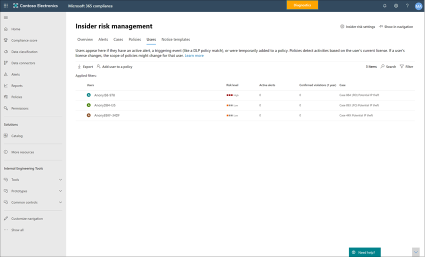

# 內部使用者風險管理使用者儀表板Insider risk management Users dashboard

[ **使用者] 儀表板** 是「內幕風險管理」工作流程中的重要工具，可協助調查人員和分析員對風險活動有更完整的瞭解。The **Users dashboard** is an important tool in the insider risk management workflow and helps investigators and analysts have a more complete understanding of risk activities. 這個儀表板提供的視圖和管理功能，可滿足建立有問必答風險管理原則及管理內部的風險管理案例之間的管理需求。This dashboard offers views and management features to meet administrative needs between the creating insider risk management policies and managing insider risk management cases.

將使用者新增至內幕風險管理原則之後，背景處理常式會自動評估 [觸發指示器](insider-risk-management-settings.md#indicators)的使用者活動。After users are added to insider risk management policies, background processes are automatically evaluating user activities for [triggering indicators](insider-risk-management-settings.md#indicators). 在觸發指示器之後，會為使用者活動指派風險分數。After triggering indicators are present, user activities are assigned risk scores. 這些活動中的部分可能會產生「內幕風險」警示，但是某些活動可能不會符合最低風險分數層級，也不會建立「內幕風險」警示。Some of these activities may result in an insider risk alert, but some activities may not meet a minimum risk score level and an insider risk alert won't be created. [ **使用者] 儀表板** 可讓您查看具有這些類型的指示器和風險分數的使用者，以及具有作用中的「擁有者風險」警示的使用者。The **Users dashboard** allows you to view users with these types of indicators and risk scores, as well users that have active insider risk alerts.

深入瞭解在下列案例中，使用者儀表板如何顯示使用者：Learn more about how the Users dashboard displays users in the following scenarios:

- 具有使用中內幕風險原則提醒的使用者Users with active insider risk policy alerts
- 具有觸發事件的使用者Users with triggering events
- 使用者暫時新增至原則Users added temporarily to policies

## 具有使用中內幕風險原則提醒的使用者Users with active insider risk policy alerts

[ **使用者] 儀表板** 會自動顯示所有具有作用中的「內幕風險原則」提醒的使用者。The **Users dashboard** automatically displays all users with active insider risk policy alerts. 具有警示的這些使用者同時具有觸發標記，以及符合建立「內幕風險警示」需求的活動風險評分。These users with alerts have both a triggering indicator and an activity risk score that meets the requirements for creating an insider risk alert. 您可以透過選取 [ **使用者] 儀表板** 中的使用者，並流覽至 [ **使用者活動** ] 索引標籤，查看這些使用者的活動。Activities for these users are viewed by selecting the user in the **Users dashboard** and navigating to the **User activity** tab.

## 具有觸發事件的使用者Users with triggering events

[ **使用者] 儀表板** 會自動顯示所有具有觸發事件的使用者，但沒有會產生「內幕風險」預警的活動風險分數。The **Users dashboard** automatically displays all users with triggering events, but that don't have an activity risk score that would create an insider risk alert. 例如，會顯示一個具有報告之辭職日的使用者，因為此活動是觸發事件，但不是具有風險分數的活動。For example, a user with a reported resignation date is displayed because this activity is a triggering event but isn't an activity that has a risk score. 您可以透過選取 [ **使用者] 儀表板** 中的使用者，並流覽至 [ **使用者活動** ] 索引標籤，查看這些使用者的活動。Activities for these users are viewed by selecting the user in the **Users dashboard** and navigating to the **User activity** tab.

## 使用者暫時新增至原則Users added temporarily to policies

[ **使用者] 儀表板** 包含的使用者在內部使用者風險管理工作流程以外的情況發生時，新增至「有問必答風險管理」原則。The **Users dashboard** includes users added to insider risk management policies after an unusual event outside of the insider risk management workflow. 從 [原則] 儀表板中暫時新增使用者 () 也是一種方法，可以為測試原則的「內幕風險管理」原則（即使未設定必要的連接器）上的使用者活動評分。Temporarily adding users (from the Policies dashboard) is also a way to start scoring user activity for an insider risk management policy for testing the policy, even if a required connector isn't configured.

手動將使用者新增至原則時，會將過去90天的使用者活動評分並新增至 **使用者活動** 時程表。When a user is manually added to a policy, the user activities for the previous 90 days are scored and added to the **User activity** timeline. 例如，您目前沒有使用者對內部使用者風險原則指派風險分數，而且使用者對組織中的法律部門報告有資料洩漏活動。For example, you have a user not currently being assigned risk scores for an insider risk policy and the user has data leak activities reported to the legal department in your organization. 法律部門建議您為使用者設定新的短期監控需求。The legal department recommends that you configure new short-term monitoring requirements for the user. 您可以在指定的時間內臨時指派使用者至您的 *資料洩漏* 原則 (啟用時段) 。You can temporarily assign the user to your *Data leaks* policy for a designated length of time (activation window). 因為會停征觸發事件需求，所以所有已暫時新增的使用者都會顯示在 [ **使用者] 儀表板** 中。All users added temporarily are displayed in the **Users dashboard** because triggering event requirements are waived.

>[!NOTE]
>新增手動新增的使用者可能需要數小時的時間，才能出現在 [ **使用者] 儀表板** 中。It may take several hours for new manually-added users to appear in the **Users dashboard**. 這些使用者過去90天的活動可能需要長達24小時才會顯示。Activities for the previous 90 days for these users may take up to 24 hours to display. 若要查看手動新增使用者的活動，請在 [ **使用者] 儀表板** 上選取使用者，然後在詳細資料窗格中開啟 [ **使用者活動** ] 索引標籤。To view activities for manually added users, select the user on the **Users dashboard** and open the **User activity** tab on the details pane.

當 **啟用視窗** 中所定義的時間到期時，使用者會自動從 **使用者儀表板** 中移除，而計分會停止：The user is automatically removed from the **Users dashboard** and scoring stops when the time defined in the **Activation window** expires if:

- 使用者沒有任何額外的觸發事件或內部人員風險原則警示，而且the user doesn't have any additional triggering events or insider risk policy alerts, and
- 若手動定義的 **啟用視窗** 持續時間超過全域原則 **啟用視窗** 持續時間。if the manually defined **Activation window** duration is longer than the global policy **Activation window** duration.

具有最長持續時間的 **啟用視窗** 設定一定會覆寫 **啟用視窗** 設定的持續時間較短。The **Activation window** setting with the longest duration always overrides the **Activation window** setting with a shorter duration. 例如，您已在「內部使用者風險管理」全域設定的 [全域 **策略時段**] 索引標籤上，將 [**啟用] 視窗** 設定為 [15 天]，這會自動套用至所有的「所有會員風險原則」。For example, you've configured the **Activation window** on the global **Policy timeframes** tab in the insider risk management global settings for 15 days, which is automatically applied to all your insider risk policies. 

您暫時將使用者新增至您的 *資料洩漏* 內幕電腦風險原則，並將30天定義為此使用者的 **啟用視窗** 。You temporarily add a user to your *Data leaks* insider risk policy and define 30 days as the **Activation window** for this user. 針對暫時新增的使用者，將 [**啟用視窗]** 設定為30天，會覆寫全域啟動 **視窗** 設定值為15天。The global **Activation window** setting of 15 days is overridden by defining the **Activation window** setting of 30 days for the temporarily added user. 暫時新增的使用者將會保留在 **使用者儀表板** 中，並依原則在30天內。The temporarily added user will remain in the **Users dashboard** and be in-scope for the policy for 30 days.

在相反的情況下，全域啟動 **視窗** 設定的長度超過為暫時新增使用者定義的啟動 **視窗** 設定，全域 **啟用視窗** 設定會覆寫暫時新增使用者的 [ **啟用] 視窗** 設定。In the opposite scenario where the global **Activation window** setting is longer than the **Activation window** setting defined for a temporarily added user, the global **Activation window** setting would override the **Activation window** setting for the temporarily added user. 暫時新增的使用者將保留在 **使用者儀表板** 中，並在全域啟動 **視窗** 設定中所定義的天數內，成為原則的範圍。The temporarily added user will remain in the **Users dashboard** and be in-scope for the policy for the number of days defined in the global **Activation window** settings.

## 在使用者儀表板上查看使用者資訊View user information on the Users dashboard

[ **使用者] 儀表板** 中顯示的每個使用者都有下列資訊：Each user displayed in the **Users dashboard** has the following information:

- **使用者**：使用者的使用者名稱。**Users**: The username for a user. 如果已啟用內部人員風險管理的全域匿名設定，則會匿名此欄位。This field is anonymized if the global anonymization setting for insider risk management is enabled.
- **風險層級**：使用者的目前已計算風險層級。**Risk level**: The current calculated risk level of the user. 這個分數每24小時計算一次，並使用與使用者相關聯之所有使用中警示的警示風險分數。This score is calculated every 24 hours and uses the alert risk scores from all active alerts associated to the user. 針對僅觸發指示器的使用者，風險層級為零。For users with only triggering indicators, the risk level is zero.
- **主動警示**：所有原則的使用中警示數目。**Active alerts**: The number of active alerts for all policies.
- 已 **確認違規**：針對使用者已確認的 *原則違規*，已解決的案例數目。**Confirmed violations**: The number of cases resolved as *confirmed policy violation* for the user.
- **案例**：使用者的目前作用中案例。**Case**: The current active case for the user.

>[!NOTE]
>在某些情況下，顯示在 [ **使用者] 儀表板** 上的使用者數目可能會受到限制，視使用中的警示數量和符合原則而定。The number of users displayed on the **Users dashboard** may be limited in some instances, depending on the volume of active alerts and matching policies. 當提醒產生時，使用者 **儀表板** 上會顯示具有作用中警示的使用者，但在達到顯示的使用者數目上限時，可能會發生極少的情況。Users with active alerts are displayed on the **Users dashboard** as the alerts are generated, and there may be rare cases when the maximum number of displayed users is reached. 如果發生這種限制，將會在使用者 **儀表板** 上顯示未顯示之主動警示的使用者，因為會將現有的使用者警示加以會審。If this limit happens, users with active alerts who aren't displayed will be added to the **Users dashboard** as existing user alerts are triaged.

## 查看使用者詳細資料View user details

若要查看有關使用者之風險活動的詳細資訊，請按兩下 [ **使用者] 儀表板** 中的使用者以開啟 [使用者詳細資料] 窗格。To view more details about risk activity for a user, open the user details pane by double-clicking a user in the **Users dashboard**. 在 [詳細資料] 窗格中，您可以查看下列資訊：On the details pane, you can view the following information:

- **使用者設定檔** ] 索引標籤**User profile** tab
    - **名稱和職稱**：來自 Azure Active Directory 之使用者的名稱和位置職稱。**Name and title**: The name and position title for the user from Azure Active Directory. 如果已啟用內部使用者風險管理的全域匿名設定，這些使用者欄位將會匿名或清空。These user fields will be anonymized or empty if the global anonymization setting for insider risk management is enabled.
    - **使用者電子郵件**：使用者的電子郵件地址。**User email**: The email address for the user.
    - **Alias**：使用者的網路別名。**Alias**: The network alias for the user.
    - **組織或部門**：使用者的組織或部門。**Organization or department**: The organization or department for the user.

- **使用者活動** ] 索引標籤**User activity** tab
    - **最近使用者活動的記錄**：列出使用者活動的觸發指示器和內部的風險指示器，最長為180天。**History of recent user activity**: Lists both triggering indicators and insider risk indicators for user activities up to the last 180 days. 所有與「有問必答」風險指示器相關的活動也會計分，但活動可能會產生，也可能不會產生「內幕風險警示」。All activities pertinent to insider risk indicators are also scored, though the activities may or may not have generated an insider risk alert. 觸發標記範例可能是辭職日期或使用者的最後排程的工作日期。Triggering indicator examples may be a resignation date or the last scheduled date of work for the user. 「內部使用者風險指示器」是指會決定具有風險元素的活動，而且會在包含使用者的原則中定義。Insider risk indicators are activities determined to have an element of risk and are defined in policies that the user is included in. 會列出事件和風險活動，其中會列出最先列出的最新專案。Event and risk activities are listed with the most recent item listed first.

## 在原則中移除範圍指派中的使用者Remove users from in-scope assignment to policies

在某些情況下，您可能需要停止指派風險分數給使用者的「內幕風險管理」原則中的活動。There may be scenarios where you need to stop assigning risk scores to a user's activity in insider risk management policies. 使用 [**使用者儀表板**] 頁面上的 [**移除使用者**]，停止為一或多個使用者指派其目前在範圍內的所有內幕風險管理原則的風險分數。Use **Remove users** on the **Users dashboard** page to stop assigning risk scores for one or more users from all insider risk management policies that they are currently in-scope for. 當您將使用者或群組新增至原則設定) 時，此巨集指令並不會移除整體原則指派 (中的使用者，只是在目前的觸發事件後，由原則將使用者從主動處理移除。This action does not remove users from the overall policy assignment (when you add users or groups to a policy configuration), but simply removes the users from active processing by policies after current triggering events. 如果使用者在未來有另一個觸發事件，來自原則的風險分數會自動開始指派給使用者。If the users have another triggering event in the future, risk scores from policies will automatically begin to be assigned to the users again. 將不會移除此使用者的任何現有警示或案例。Any existing alerts or cases for this user will not be removed.

>[!NOTE]
>移除原則中的使用者可能需要數分鐘才能完成。Removing a user from a policy may take several minutes to complete. 完成後，使用者將不再列在 [使用者] 頁面上。Once complete, the user will no longer be listed on the Users page. 如果移除的使用者有使用中的警示或案例，使用者將會保留在 [使用者] 頁面上，而且使用者的詳細資料會顯示他們不再是原則的範圍。If the removed user has active alerts or cases, then the user will remain on the Users page and the details for the user will show that they are no longer in-scope for a policy.

若要在所有內幕風險管理原則中，從範圍的狀態中手動移除使用者，請完成下列步驟：To manually remove users from in-scope status in all insider risk management policies, complete the following steps:

1. 在 [Microsoft 365 規範中心](https://compliance.microsoft.com)中，移至 [ **內部使用者風險管理** ]，然後選取 [ **使用者** ] 索引標籤。In the [Microsoft 365 compliance center](https://compliance.microsoft.com), go to **Insider risk management** and select the **Users** tab.
2. 在 [ **使用者] 儀表板** 上，選取您要移除的使用者或使用者，而不是在「內部使用者風險管理原則」範圍內。On the **Users dashboard**, select the user or users you want to remove from being in-scope in insider risk management policies.
3. 選取 [ **移除使用者**]。Select **Remove users**.
4. 在 [ **移除使用者** ] 窗格中，選取 [ **移除** ] 或 [ **取消** ] 以捨棄變更並關閉對話方塊。On the **Remove user** pane, Select **Remove** or **Cancel** to discard the changes and close the dialog.
5. 在 [確認] 窗格中選取 [ **移除** ]，以移除使用者。Select **Remove** on the confirmation pane to remove the user.

## 以 Power 自動化的使用者執行自動化工作流程Run automated tasks with Power Automate flows for a user

使用建議的電源自動流程，風險調查人員和分析員可以快速採取下列動作：Using recommended Power Automate flows, risk investigators and analysts can quickly take action to:

- 將使用者新增至「內幕風險原則」時通知使用者Notify users when they're added to an insider risk policy

若要針對內部使用者風險管理使用者執行、管理或建立電源自動化流程，請執行下列動作：To run, manage, or create Power Automate flows for an insider risk management user:

1. 在 [使用者動作] 工具列上，選取 [ **自動** ]。Select **Automate** on the user action toolbar.
2. 選擇 [電源自動化流程] 以執行，然後選取 [ **執行流程**]。Choose the Power Automate flow to run, then select **Run flow**.
3. 流程完成後，請選取 [ **完成**]。After the flow has completed, select **Done**.

若要深入瞭解「內部人員風險管理」的 Power 自動化流程，請參閱「 [內幕人員風險管理」設定快速](insider-risk-management-settings.md#power-automate-flows-preview)入門。To learn more about Power Automate flows for insider risk management, see [Getting started with insider risk management settings](insider-risk-management-settings.md#power-automate-flows-preview).
