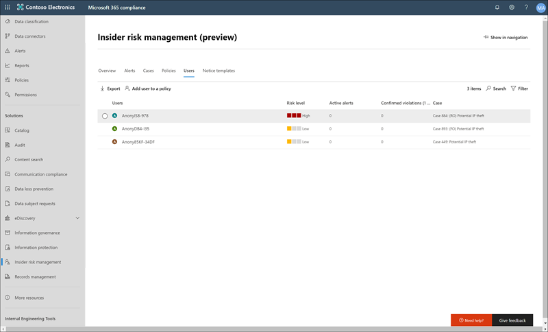

# 測試人員風險管理使用者 （預覽）

測試人員風險管理使用者是員工在組織中所包含的一或多個測試人員風險管理原則。 若要快速檢閱員工的風險資訊，並將員工新增至現有的測試人員風險管理原則，請使用**使用者儀表板**。 測試人員風險管理原則中包含每個使用者有顯示在**使用者儀表板**上的下列資訊：

- **使用者**： 使用者的使用者名稱。
- **風險層級**： 
- **作用中警示**： 所有原則的作用中警示的數目。
- **已確認違規**： 案例數目解析為使用者的 [*確認原則違規情形*。
- **案例**： 使用者目前作用中的案例。

## 檢視使用者的詳細資料

若要檢視更多詳細風險活動的使用者，連按兩下**使用者儀表板**中的使用者開啟使用者的 [詳細資料] 窗格。 在 [詳細資料] 窗格中，您可以檢視下列資訊：

- **使用者設定檔**] 索引標籤
    - **名稱和職稱**： 使用者名稱和位置的標題。
    - **使用者的電子郵件**： 使用者的電子郵件地址。
    - **別名**： 使用者的網路別名。
    - **組織或部門**： 組織或部門的使用者。

- **使用者活動**] 索引標籤
    - **最近的使用者活動的歷程記錄**： 列出觸發事件與使用者活動的風險指標這兩個原則。 觸發的事件可能會接受放棄日期或最後一個排程的員工的工作。 風險指標是的活動，決定有風險的項目，而且會對應至使用者納入的原則。 與要先列出最新的項目會列出事件和風險活動。

## 將使用者新增至原則

若要將使用者新增至測試人員風險管理原則，您可以將 Microsoft 365 合規性中心**測試人員風險管理**解決方案中使用新的原則精靈] 或 [**使用者**] 索引標籤。

完成下列步驟，以將使用者新增至現有的測試人員風險原則：

1. 在[Microsoft 365 合規性中心](https://compliance.microsoft.com)，移至**測試人員風險管理**並選取 [**使用者**] 索引標籤。
2. 在工具列上，選取 [**新增使用者至原則**。
3. 在 [**新增使用者**] 對話方塊中，啟動 [**使用者**] 欄位中輸入使用者名稱。 選取您想要新增至原則的使用者。
4. 選取要顯示設定的測試人員風險管理原則的**原則**欄位的下拉式箭號。 選取要新增至使用者的原則。
5. 使用**監控視窗**滑動軸控制來定義...][監視] 視窗中的範圍是 5 到 30 天。
6. 選取 [**新增]** ，然後**確認**將使用者新增至原則。
