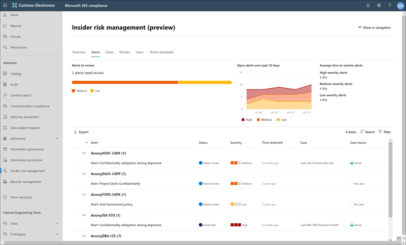
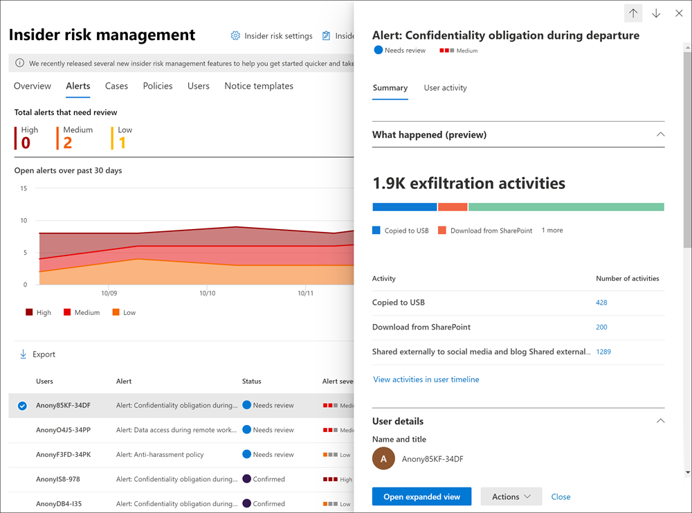
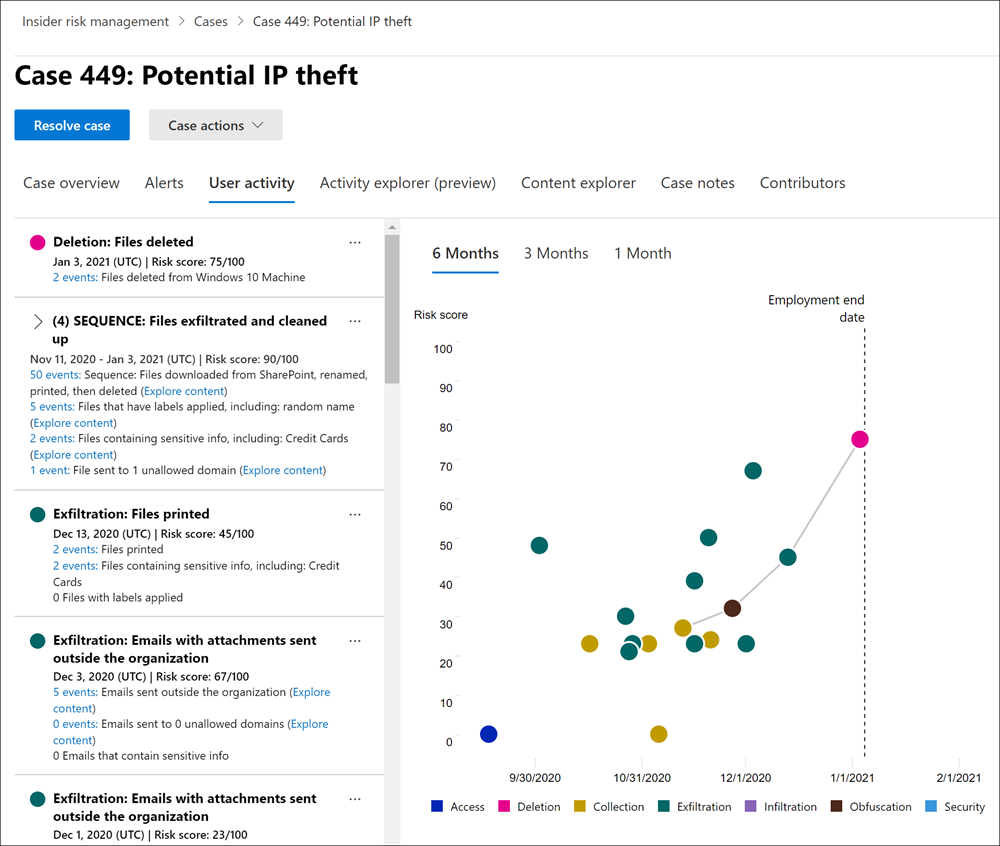

# Microsoft 365 中的有問必答風險管理

「內部使用者風險管理」是 Microsoft 365 中的規範解決方案，可讓您偵測、調查和動作組織中的惡意和無意活動，以協助將內部風險降至最低。 內部使用者風險原則可讓您定義在組織中識別及偵測的風險類型，包括在案例中採取行動，以及在必要時將案例升級至 Microsoft 高級 eDiscovery。 組織中的風險分析師可以迅速採取適當的動作，以確保使用者符合組織的合規性標準。

觀看下列影片，瞭解內幕人士風險管理如何協助您的組織避免、偵測和包含風險，同時排定組織值、文化和使用者經驗的優先順序：
 
 
>[!VIDEO https://www.microsoft.com/videoplayer/embed/RE4j9CN]

## 現代化風險的困難點

管理組織中的風險並將風險降至最低，可讓您了解在現代化工作場所發現的風險類型。 有些風險是由直接控制之外的外來事件和因素所驅動。 其他風險是由內部事件及可最小化及避免的使用者活動所驅動。 某些範例是由您組織中的使用者所非法、不適當、未授權或不道德的行為和動作所導致的風險。 這些行為包含使用者廣泛的內部風險：

- 洩漏機密資料和資料外洩
- 違反保密協定
- 智慧財產權 (IP) 竊取
- 偽造
- 測試人員交易
- 法規合規性違規

現代工作場所的使用者可以存取跨多種平臺和服務的資料，以建立、管理及共用資料。 在大多數情況下，組織的資源和工具有限，可找出並減輕整個組織的風險，同時也可滿足使用者的隱私權標準。

「內部使用者風險管理」使用全面的服務和協力廠商指示，協助您快速識別、會審及行動風險活動。 透過使用 Microsoft 365 和 Microsoft Graph 的記錄，「有問必答風險管理」可讓您定義特定原則，以識別風險指示器。 這些原則可讓您識別危險的活動，並採取措施緩解這些風險。

測試人員風險管理聚焦於以下原則：

- **透明性** ：透過隱私權架構，平衡使用者隱私權與組織風險。
- **可設定的** ：可根據業界、地理位置和商務群組進行設定的原則。
- **整合** ：跨 Microsoft 365 合規性解決方案的整合工作流程。
- **可行** ：提供深入瞭解使用者通知、資料調查和使用者調查。

## 工作流程

「內幕風險管理」工作流程可協助您識別、調查和採取動作，以解決組織中的內部風險。 透過焦點原則範本、透過 Microsoft 365 服務的綜合活動信號，以及警示和案例管理工具，您可以使用可行動的觀點，快速找出並處理風險行為。

使用下列工作流程，辨識並解決 Microsoft 365 中的測試人員風險管理的內部風險活動和合規性問題：

### 原則

[有問必答風險管理原則](insider-risk-management-policies.md) 是使用預先定義的範本和原則條件建立，以定義組織中檢查哪些觸發事件及風險指示器。 這些狀況包括風險指示器如何用於提醒、原則中所包含的使用者、優先順序的服務，以及監控時間週期。

您可以從下列 [原則範本] 中進行選取，以快速開始使用「內幕風險管理」：

- [由去聲使用者竊取資料](insider-risk-management-policies.md#data-theft-by-departing-users)
- [一般資料洩漏](insider-risk-management-policies.md#general-data-leaks)
- [依優先順序的使用者 (預覽的資料洩漏) ](insider-risk-management-policies.md#data-leaks-by-priority-users-preview)
- [因不滿使用者 (預覽的資料洩漏) ](insider-risk-management-policies.md#data-leaks-by-disgruntled-users-preview)
- [ (預覽的一般安全性原則違規) ](insider-risk-management-policies.md#general-security-policy-violations-preview)
- [由使用者 (預覽) 中的使用者進行安全性原則違規 ](insider-risk-management-policies.md#security-policy-violations-by-departing-users-preview)
- [優先使用者 (預覽的安全性原則違規) ](insider-risk-management-policies.md#security-policy-violations-by-priority-users-preview)
- [因不滿使用者 (預覽所違反的安全性原則) ](insider-risk-management-policies.md#security-policy-violations-by-disgruntled-users-preview)
- [電子郵件中的冒犯性語言](insider-risk-management-policies.md#offensive-language-in-email)

### 警示

通知是由符合原則條件的風險指標自動產生，且會顯示在[警示儀表板](insider-risk-management-alerts.md)中。 此儀表板可讓您快速查看組織需要查看的所有警示、一段時間後待處理的警示以及警示統計資料。 所有原則提醒都會顯示下列資訊，可協助您快速識別現有警示的狀態，以及需要採取動作的新提醒：

- 狀態
- 嚴重性
- 偵測時間
- 案例
- 案例狀態

### 分級

需要調查的新使用者活動會自動產生已指派 *需要檢查* 狀態的警示。 檢閱者可以快速識別及審閱、評估及會審這些警示。

開啟新案例、將警示指派給現有案例或解除警示，就能解決警示。 您可以使用警示篩選器，輕鬆地依狀態、嚴重性或偵測時間來辨識警示。 在會審過程中，檢閱者可以查看原則所識別之活動的警示詳細資料、查看與原則相符相關的使用者活動、查看警示的嚴重性，以及查看使用者設定檔資訊。

### 調查

針對需要更深入檢查和調查原則相符的活動詳細資料及案例的提醒，會建立[案例](insider-risk-management-cases.md)。 [案例儀表板]  提供組織內所有使用中案例、一段時間後待處理以及案例統計資料的完整檢視。 檢閱者可以按照狀態、開啟案例的日期，以及上次更新案例的日期來快速篩選案例。

在案例儀表板上選取案例即可開啟要調查和檢閱的案例。 此步驟是測試人員風險管理工作流程的核心。 在此範圍內，風險活動、原則狀況、提醒詳細資料和使用者詳細資料會合成到檢閱者的整合式視圖中。 此區域中的主要調查工具如下：

- **使用者活動** ：使用者活動會自動顯示在互動式圖表中，此圖表會隨著時間及目前或過去的風險活動的風險層級來繪製活動。 檢閱者可以快速篩選和查看使用者的整個風險歷程記錄，並深入查看特定活動以取得詳細資訊。
- **內容瀏覽器** ：系統會自動捕獲與警示活動相關聯的所有資料檔案和電子郵件訊息，並將其顯示在內容瀏覽器中。 檢閱者可以依照資料來源、檔案類型、標記、交談和其他更多屬性篩選和查看檔案和郵件。
- **案例附注** ：檢閱者可以在案例記事區段中提供案例的附注。 此清單會整合集中檢視中的所有附註，並包括檢閱者和提交日期資訊。

### 動作

在調查案例之後，檢閱者可以快速處理案例，或與組織中的其他風險專案關係人共同作業。 如果使用者無意或不經意地違反原則條件，則可以將簡單的提醒通知傳送給使用者，您可以自訂群組織的通知範本。 這些通知可能會做為簡單的提醒，也可能指導使用者進行複習訓練或指導，以協助避免未來的危險行為。 如需詳細資訊，請參閱[測試人員風險管理通知範本](insider-risk-management-notices.md)。

在較嚴重的情況下，您可能需要與組織中的其他檢閱者或服務共用內部使用者風險管理案例資訊。 有問必答風險管理與其他 Microsoft 365 合規性解決方案緊密整合，以協助您進行端對端的風險解決。

- **Advanced ediscovery** ：上報調查案例可讓您將案例的資料和管理轉移至 Microsoft 365 中的「高級 eDiscovery」。 進階電子文件探索提供端對端工作流程，可讓您保留、收集、檢閱、分析及匯出您組織內部及外部調查所需的內容。 這可讓法務小組管理整個法務保存措施通知工作流程。 若要深入了解進階電子文件探索案例，請參閱[ Mcrosoft 365 中的進階電子文件探索概觀](overview-ediscovery-20.md)。
- **ServiceNow (preview)** ： ServiceNow 是一個流行的雲端計算平臺，可協助組織管理企業作業的數位工作流程。 有問必答風險管理支援與您的 ServiceNow 服務共用案例通知，並可讓您建立與個別內部使用者風險案例相關的事件及變更要求。 若要深入瞭解如何與 ServiceNow 共用提醒資訊，請參閱 [與 ServiceNow 共用案例](insider-risk-management-cases.md#share-the-case)。
- **Office 365 Management APIs integration (preview)** ：「內部人員風險管理」支援透過 Office 365 管理) 將警示資訊匯出至安全性資訊和事件管理 (SIEM APIs 服務。 在平臺中存取警示資訊最適合組織的風險流程，可讓您更靈活地處理風險活動。 若要深入瞭解使用 Office 365 管理 APIs 匯出提醒資訊，請參閱 [匯出警示](insider-risk-management-settings.md#export-alerts-preview)。

>[!NOTE]
>感謝您在 ServiceNow 連接器預覽期間進行意見反應和支援。 我們決定在2020年11月30日的「內幕人員風險管理」中結束支援 ServiceNow 連接器的預覽。 我們正在積極評估替代方法，讓客戶在內幕風險管理中 ServiceNow 整合。

## 案例

測試人員風險管理可協助您偵測、調查並採取行動，以降低組織中數個常見案例的內部風險：

### 由去聲使用者竊取資料

當使用者離開組織時（自願或終止時），通常是因為公司、客戶及使用者資料面臨危險的原因。 使用者可能會 innocently 假設專案資料並非專屬的，也可能是要取得公司資料以取得個人利益，以及違反公司原則和法律標準。 透過使用者原則範本使用 [資料竊取](insider-risk-management-policies.md#policy-templates) 的內幕風險管理原則，會自動偵測與此類型的盜竊相關的活動。 透過這種原則，您將會在您的使用者上，自動接收與資料竊取相關的可疑活動提醒，以便您採取適當的調查動作。 這個原則範本需要為您的組織設定 [Microsoft 365 HR connector](import-hr-data.md) 。

### 故意或無意洩漏敏感或機密資訊

在大多數情況下，使用者可以嘗試適當地處理機密或機密資訊。 但是有時候使用者可能會造成錯誤和資訊意外地在您的組織外共用，或違反您的資訊保護原則。 在其他情況下，使用者可能會故意洩漏或分享機密和機密資訊，惡意目的和潛在個人利益。 使用下列資料洩漏原則範本所建立的會員風險管理原則，會自動偵測與共享敏感或機密資訊相關的活動：

- [一般資料洩漏](insider-risk-management-policies.md#general-data-leaks)
- [依優先順序的使用者 (預覽的資料洩漏) ](insider-risk-management-policies.md#data-leaks-by-priority-users-preview)
- [因不滿使用者 (預覽的資料洩漏) ](insider-risk-management-policies.md#data-leaks-by-disgruntled-users-preview)

### 違反公司原則的冒犯行為

使用者對使用者通訊通常是無意或惡意違反公司原則的來源。 這些違規行為可包含使用者之間的冒犯性語言、威脅和騷擾。 這種類型的活動會對惡意的工作環境產生影響，而且可能會針對使用者和較大的組織產生法律行動。 有問必答風險管理使用新的內建 Microsoft 365 分類程式和 [電子郵件](insider-risk-management-policies.md#offensive-language-in-email) 原則範本中的冒犯性語言，協助將這些風險降至最低。 這個原則範本可協助您快速設定及啟用原則，以自動偵測組織中這類行為，並提醒您。

##  (預覽) 的故意或無意間的安全性原則違規

使用者在新式的工作場所管理其裝置時，通常會有很大的控制權。 這可能包括安裝或卸載其職責效能所需的應用程式，或暫時停用裝置安全性功能的許可權。 無論此活動是無意、意外或惡意的，此行為都會對您的組織造成風險，而且很重要的是識別和採取最小化。 為了協助識別這些危險的安全性活動，下列內部的「內幕人員風險管理」安全性原則侵犯範本會評分安全性風險指標，並使用 Microsoft Defender 高級威脅防護 (ATP) 警示，以提供與安全性相關之活動的洞察力：

- [ (預覽的一般安全性原則違規) ](insider-risk-management-policies.md#general-security-policy-violations-preview)
- [由使用者 (預覽) 中的使用者進行安全性原則違規 ](insider-risk-management-policies.md#security-policy-violations-by-departing-users-preview)
- [優先使用者 (預覽的安全性原則違規) ](insider-risk-management-policies.md#security-policy-violations-by-priority-users-preview)
- [因不滿使用者 (預覽所違反的安全性原則) ](insider-risk-management-policies.md#security-policy-violations-by-disgruntled-users-preview)

## 根據位置、存取層級或風險記錄 (預覽的使用者原則) 

組織中的使用者可能會有不同層級的風險，取決於其位置、敏感資訊存取權或風險記錄。 這可能包括組織的高層領導團隊成員、具有大量資料和網路存取許可權的 IT 管理員，或過去具有風險活動之歷史的使用者。 在這些情況下，更深入的檢查和更積極的風險計分對於協助表面上的調查和快速動作都很重要。 若要協助識別這類使用者的危險活動，您可以建立優先順序使用者群組，並建立下列原則範本中的原則：

- [優先使用者 (預覽的安全性原則違規) ](insider-risk-management-policies.md#security-policy-violations-by-priority-users-preview)
- [依優先順序的使用者 (預覽的資料洩漏) ](insider-risk-management-policies.md#data-leaks-by-priority-users-preview)

## 因不滿使用者 (預覽所做的動作和行為) 

雇用強調事件可能會影響使用者行為與內幕程式風險相關的數種方式。 這些 stressors 可能是效能檢查、職位降級，或使用者放置於績效審查計畫的情況不良。 雖然大多數使用者沒有惡意回應這些事件，但這些動作的壓力可能會導致某些使用者採取的動作可能不會在一般情況下正常考慮。 為了協助識別這些類型的危險活動，下列內部的「內幕人員風險管理」原則範本會使用 Microsoft 365 HR 連接器，並從與雇傭雇用 stressor 事件接近的行為產生計分風險指示器：

- [因不滿使用者 (預覽的資料洩漏) ](insider-risk-management-policies.md#data-leaks-by-disgruntled-users-preview)
- [因不滿使用者 (預覽所違反的安全性原則) ](insider-risk-management-policies.md#security-policy-violations-by-disgruntled-users-preview)

## 準備好開始使用了嗎？

- 如需如何準備在組織中啟用內部使用者風險管理原則，請參閱 [Plan for 有問必答風險管理](insider-risk-management-plan.md) 。
- 請參閱 [開始使用「會員風險管理」設定](insider-risk-management-settings.md) ，設定內部擁有者風險原則的全域設定。
- 請參閱[開始使用測試人員風險管理](insider-risk-management-configure.md)來設定必要條件、建立原則並開始接收警示。
