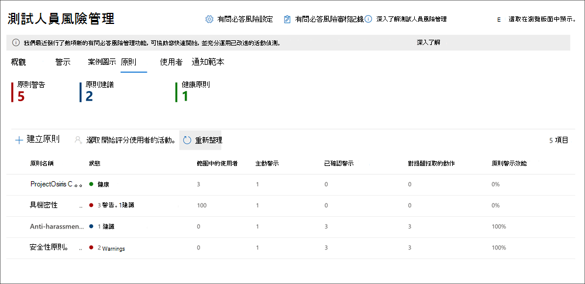

# Microsoft 365 中的有問必答風險管理

「內幕風險管理」是 Microsoft 365 中的解決方案，可讓您偵測、調查和採取行動，以應對組織中的危險活動，以協助降低內部風險。 自訂原則可讓您偵測組織中惡意和意外風險活動的動作，並對其採取動作（如有需要），包括 Microsoft Advanced eDiscovery 的升級案例。 組織中的風險分析師可以迅速採取適當的動作，以確保使用者符合組織的合規性標準。

觀看下列影片，了解測試人員風險管理如何協助組織預防、偵測並遏制風險，同時確定組織的價值、文化和員工體驗的優先順序：
 
 
>[!VIDEO https://www.microsoft.com/videoplayer/embed/RE4j9CN]

## 現代化風險的困難點

管理組織中的風險並將風險降至最低，可讓您了解在現代化工作場所發現的風險類型。 有些風險是由外來事件和因素所造成，無法直接控制。 有些風險則是由內部事件和員工活動所造成，可以消除和避免。 某些範例是由員工和主管所導致的非法、不當、未授權或不道德行為和動作風險。 這些行為包括員工所導致的各種內部風險：

- 洩漏機密資料和資料外洩
- 違反保密協定
- 智慧財產權 (IP) 竊取
- 偽造
- 測試人員交易
- 法規合規性違規

現代化工作場所的員工可透過多種平台和服務來建立、管理及共用資料。 在大多數的情況下，組織的資源和工具有限，無法找出並降低組織內的風險，同時滿足員工的隱私權標準。

Microsoft 365 中的測試人員風險管理採用完整的服務和協力廠商指標，可協助您快速發現、分級風險活動，並採取行動。 透過使用 Microsoft 365 和 Microsoft Graph 的記錄，「有問必答風險管理」可讓您定義特定原則，以識別風險指示器。 這些原則可讓您識別風險活動，並採取行動來緩解這些風險。

測試人員風險管理聚焦於以下原則：

- **透明性**：透過內建的隱私權架構，在員工隱私權與組織風險之間取得平衡。
- **可設定的**：可根據業界、地理位置和商務群組進行設定的原則。
- **整合**：跨 Microsoft 365 合規性解決方案的整合工作流程。
- **可行的**：提供深入見解，以進行員工通知、資料調查和員工調查。

## 工作流程

測試人員風險管理可協助您發現和調查組織中的內部風險並採取行動。 透過焦點原則範本、Microsoft 365 服務的全面活動，以及彈性工作流程，您可以使用可行的深入見解快速辨識並解決危險行為。

使用下列工作流程，辨識並解決 Microsoft 365 中的測試人員風險管理的內部風險活動和合規性問題：

### 原則

測試人員風險管理原則是使用預先定義的範本和原則條件來建立，這些範本和原則條件可定義要在 Microsoft 365 功能區域中檢查哪些風險指標。 這些條件包括指標用於警示的方式、原則中包含的使用者、優先處理的服務，以及監視的時段。

您可以從下列[原則範本](insider-risk-management-policies.md#policy-templates)中選取，以快速開始使用測試人員風險管理：

- 離職員工資料偷竊
- 資料洩露
- 電子郵件中的冒犯性語言

如需詳細資訊，請參閱[測試人員風險管理原則](insider-risk-management-policies.md)。

### 警示

通知是由符合原則條件的風險指標自動產生，且會顯示在**警示儀表板**中。 此儀表板可讓您快速查看組織需要查看的所有警示、一段時間後待處理的警示以及警示統計資料。 所有原則警示都會顯示相關資訊，以協助您快速辨識現有警示的目前狀態及需要採取動作的新警示：

- 狀態
- 嚴重性
- 偵測時間
- 案例
- 案例狀態

如需詳細資訊，請參閱[測試人員風險管理警示](insider-risk-management-alerts.md)。

### 分級

需要調查的新活動會自動產生警示，並指派 [需要檢閱]** 狀態。 檢閱者可以快速辨識這些警示，並瀏覽每個警示來呈報並分級。 

開啟新案例、將警示指派給現有案例或解除警示，就能解決警示。 您可以使用警示篩選器，輕鬆地依狀態、嚴重性或偵測時間來辨識警示。 在分級程序中，檢閱者可以查看與原則相符的警示詳細資料、查看與相符項目關聯的使用者活動、查看警示的嚴重性，並查看使用者設定檔資訊。

### 調查

系統會針對警示建立案例，這些警示需要對符合原則的詳細資料和情況進行更深入的檢閱和調查。 [案例儀表板]**** 提供組織內所有使用中案例、一段時間後待處理以及案例統計資料的完整檢視。 檢閱者可以按照狀態、開啟案例的日期，以及上次更新案例的日期來快速篩選案例。

在案例儀表板上選取案例即可開啟要調查和檢閱的案例。 此步驟是測試人員風險管理工作流程的核心。 此區域是風險活動指標、原則條件、警示詳細資料和員工詳細資料的綜合區域，供檢閱者檢視。 此區域中的主要調查工具如下：

- **使用者活動**：系統會自動在互動式圖表中顯示使用者活動，以繪製一段時間內的風險活動，以及目前或過去風險活動的風險層級。 檢閱者可以快速篩選和查看員工的完整風險歷程記錄，並深入了解特定活動，以取得更多詳細資料。
- **內容瀏覽器**：與警示風險活動相關聯的所有資料檔案和電子郵件都會自動捕獲並顯示在內容瀏覽器中。 檢閱者可以依照資料來源、檔案類型、標記、交談和其他更多屬性篩選和查看檔案和郵件。
- **案例附註**：檢閱者會在 [案例附註] 區段中提供案例附註。 此清單會整合集中檢視中的所有附註，並包括檢閱者和提交日期資訊。

如需詳細資訊，請參閱[測試人員風險管理案例](insider-risk-management-cases.md)。

### 動作

案例經過調查之後，檢閱者可以迅速採取行動以解決案例，或與組織中的其他風險專案關係人共同作業。 當員工不慎或意外違反原則條件時，您可以利用您為組織設定的通知範本，傳送簡單的提醒通知給員工。 這些通知可做為簡單的提醒，或可指導員工進行複習訓練或指導，以協助防範未來的危險行為。 如需詳細資訊，請參閱[測試人員風險管理通知範本](insider-risk-management-notices.md)。

在最嚴重的情況下，您可能需要與組織中的其他檢閱者分享測試人員風險管理案例資訊。 測試人員風險管理與其他 Microsoft 365 合規性功能緊密整合，以協助您端對端解決風險。 呈報案例進行調查，可讓您將案例的資料和管理移轉到 Microsoft 365 中的進階電子文件探索。 進階電子文件探索提供端對端工作流程，可讓您保留、收集、檢閱、分析及匯出您組織內部及外部調查所需的內容。 這可讓法務小組管理整個法務保存措施通知工作流程。 若要深入了解進階電子文件探索案例，請參閱[ Mcrosoft 365 中的進階電子文件探索概觀](overview-ediscovery-20.md)。

## 案例

測試人員風險管理可協助您偵測、調查並採取行動，以降低組織中數個常見案例的內部風險：

### 離職員工竊取資料

當員工離開組織 (自願或離職) 時，通常會合理地擔心公司、客戶和員工資料會受到威脅。 員工可能會天真地認為專案資料不是專屬資料，或者他們可能會出於個人利益並試圖違反公司原則和法律標準來獲取公司資料。 使用[離職員工資料竊取](insider-risk-management-policies.md#policy-templates)原則範本的測試人員風險管理原則會自動偵測通常與此類竊取相關的活動。 使用此原則，您將會自動收到與離職員工竊取相關的可疑活動的警示，以便您採取適當的調查動作。 若要使用此原則範本，必須為組織設定 [Microsoft 365 HR 連接器](import-hr-data.md)。

### 故意或無意洩漏敏感或機密資訊

在大部分的情況下，員工會盡最大努力，正確地處理敏感或機密資訊。 但是，有時員工會犯錯，而意外地在組織外部分享資訊或違反您的資訊保護原則。 有時，員工可能出於惡意並出於潛在的個人利益而故意洩露或分享敏感和機密資訊。 使用[資料外洩](insider-risk-management-policies.md#policy-templates)原則範本的測試人員風險管理原則會自動偵測通常與分享敏感或機密資訊相關的活動。 若要使用此原則範本，您必須為組織設定至少一個 Microsoft 365 [資料遺失保護(DLP) 原則](create-test-tune-dlp-policy.md)。

### 違反公司原則的動作與行為

員工與員工之間的通訊通常是疏忽或惡意違反公司原則的來源。 這些違規行為可能包括粗穢語言、威脅以及員工之間的網路罷凌行為。 這種類型的活動會導致敵對的工作環境，並可能引發對員工和較大組織的法律訴訟。 測試人員風險管理使用新的內建 Microsoft 365 分類器和[電子郵件中的粗穢語言](insider-risk-management-policies.md#policy-templates)原則範本。 這些分類器和範本可讓您快速設定原則，以自動偵測並提醒您這種行為。

## 準備好開始使用了嗎？

- 如需如何準備在組織中啟用內部使用者風險管理原則，請參閱[Plan for 有問必答風險管理](insider-risk-management-plan.md)。
- 請參閱[開始使用測試人員風險管理](insider-risk-management-configure.md)來設定必要條件、建立原則並開始接收警示。
