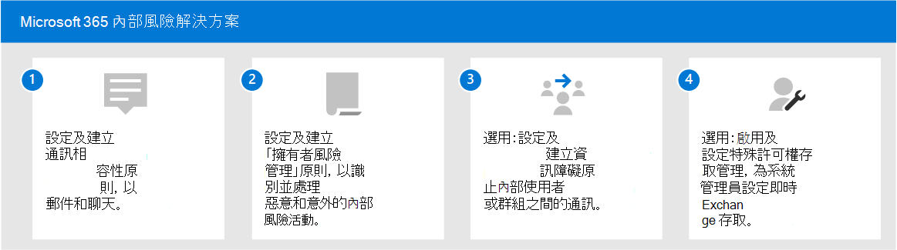

# Microsoft 365 中的內部風險解決方案

「內幕風險」是現代辦公中安全性與合規性專業人員的最重要考慮因素之一。 業內調查顯示會員風險通常會與特定使用者事件或活動相關聯。 保護您的組織免受這些風險的難度可能很難識別且難於緩解。 內幕電腦風險包括各種區域中的漏洞，而且可能會造成組織的主要問題，包括因喪失智慧財產權或騷擾等問題。 下圖說明常見的內幕人士風險：

Microsoft 365 風險防護功能是設計和內建給我們的有問必答風險產品和解決方案。 這些解決方案共同運作，並使用高級服務和協力廠商指示，協助您快速識別、會審及行動風險活動。 大部分的解決方案為您的資料分析員和調查人員提供完整的偵測、警示和修正工作流程，以用於快速地處理及最小化這些風險。

| 風險圖示 | 風險 | 通訊合規性 | 內部風險管理 | 資訊屏障 | 特殊權限存取管理 |
| :---- | :-------- | :--------------------------- | :-------------------------- |:-------------------------| :--------------------------------|
| | 資料外泄 |  |  |  |  |
| | 違反保密協定 |  |  |  |  |
| | IP 盜竊 |  |  |  |  |
| | 工作場所暴力 |  |  |  |  |
| | 偽造 |  |  |  |  |
| | 原則違規 |  |  |  |  |
| | 測試人員交易 |  |  |  |  |
| | 利益衝突 |  |  |  |  |
| | 敏感性資料洩漏 |  |  |  |  |
| | Workplace 騷擾 |  |  |  |  |
| | 違反安全性 |  |  |  |  |
| | 法規合規性違規 |  |  |  |  |

## Microsoft 365 內部風險解決方案

若要協助保護您的組織不受內幕人士的風險，請使用下列 Microsoft 365 功能。

### 通訊合規性

通訊相容性協助您在組織中偵測、捕獲和處理不適當的郵件，以協助將通訊風險降至最低。 您可以在下列訂閱中取得通訊法規遵從性：

- Microsoft 365 E5 訂閱 (付費或試用版本) 
- Microsoft 365 E3 訂閱 + Microsoft 365 E5 合規性附加元件
- Microsoft 365 E3 訂閱 + Microsoft 365 E5 「內幕人員風險管理附加元件」
- Microsoft 365 A5 訂閱 (付費或試用版本) 
- Microsoft 365 A3 訂閱 + Microsoft 365 A5 合規性附加元件
- Microsoft 365 A3 訂閱 + Microsoft 365 A5 內幕人士風險管理附加元件
- Microsoft 365 G5 訂閱 (付費或試用版本) 
- Microsoft 365 G5 訂閱 + Microsoft 365 G5 合規性附加元件
- Microsoft 365 G5 訂閱 + Microsoft 365 G5 有問必答風險管理附加元件
- Office 365 企業版 E5 訂閱 (付費或試用版本) 
- Office 365 A5 訂閱 (付費或試用版本) 
- Office 365 Enterprise E3 訂閱 + Office 365 Advanced 合規性附加元件 (已無法再供新訂閱使用) 

### 內部風險管理

「有問必答風險管理」可讓您偵測、調查和動作組織中的惡意和意外活動，以協助將內部風險降至最低。

內幕風險管理可在下列訂閱中取得：

- Microsoft 365 E5 訂閱 (付費或試用版本) 
- Microsoft 365 E3 訂閱 + Microsoft 365 E5 合規性附加元件
- Microsoft 365 E3 訂閱 + Microsoft 365 E5 「內幕人員風險管理附加元件」
- Microsoft 365 A5 訂閱 (付費或試用版本) 
- Microsoft 365 A3 訂閱 + Microsoft 365 A5 合規性附加元件
- Microsoft 365 A3 訂閱 + Microsoft 365 A5 內幕人士風險管理附加元件

### 資訊屏障

資訊壁壘可讓您限制兩個內部群組之間的通訊和共同作業，以避免組織中發生利益衝突。

資訊屏障可用於下列訂閱：

- Microsoft 365 E5 訂閱 (付費或試用版本) 
- Microsoft 365 A5 訂閱 (付費或試用版本) 
- Office 365 企業版 E5 訂閱 (付費或試用版本) 
- Office 365 A5 訂閱 (付費或試用版本) 
- Office 365 Advanced 合規性附加元件 (無法再供新訂閱使用) 
- Microsoft 365 E3 訂閱 + Microsoft 365 E5 合規性附加元件
- Microsoft 365 E3 訂閱 + Microsoft 365 E5 「內幕人員風險管理附加元件」
- Microsoft 365 A3 訂閱 + Microsoft 365 A5 合規性附加元件
- Microsoft 365 A3 訂閱 + Microsoft 365 A5 內幕人士風險管理附加元件

### 特殊權限存取管理

「特權存取管理」允許對 Office 365 中的特殊 Exchange Online 系統管理員工作進行精細存取控制。 它可協助保護您的組織，避免因使用現有的許可權系統管理員帳戶存取機密資料或存取重要的設定設定而遭到破壞。

下列訂閱提供了特殊許可權存取管理：

- Microsoft 365 E5 訂閱 (付費或試用版本) 
- Microsoft 365 A5 訂閱 (付費或試用版本) 
- Office 365 企業版 E5 訂閱 (付費或試用版本) 
- Office 365 A5 訂閱 (付費或試用版本) 
- Microsoft 365 E3 訂閱 + Microsoft 365 E5 合規性附加元件
- Microsoft 365 E3 訂閱 + Microsoft 365 E5 資訊保護和管理法規附加元件
- Microsoft 365 A3 訂閱 + Microsoft 365 A5 合規性附加元件
- Microsoft 365 A3 訂閱 + Microsoft 365 A5 Information Protection and 調控附加元件

## 部署 Microsoft 365 有問必答風險解決方案

若要協助保護您的組織免受內部使用者風險，請安裝並部署下列 Microsoft 365 解決方案：

1. 設定及建立 [通訊相容性原則](communication-compliance-solution-overview.md)。
2. 設定及建立「 [有問必答風險管理」原則](insider-risk-management-solution-overview.md)。
3. 選用：設定及建立 [資訊障礙原則](information-barriers-solution-overview.md)。
4. 選用：啟用及設定特殊許可權 [存取管理](privileged-access-management-solution-overview.md)。

## 範例圖例

若要協助您規劃整合策略以執行 Microsoft 365 內幕人士的風險功能，請下載 *microsoft 365 資訊保護和合規性功能* 組圖例。 如需內幕風險功能，請參閱架構圖解 pages 5-7。 您可以隨意使用這些圖。

| 項目 | 描述 |
|:-----|:------------|
|   [以 PDF 格式下載](https://download.microsoft.com/download/3/a/6/3a6ab1a3-feb0-4ee2-8e77-62415a772e53/m365-compliance-illustrations.pdf) \|[下載為 Visio](https://download.microsoft.com/download/3/a/6/3a6ab1a3-feb0-4ee2-8e77-62415a772e53/m365-compliance-illustrations.vsdx)     2020年10月更新|包含： <ul><li>  Microsoft 資訊保護和資料外洩防護</li><li>保留原則和保留標籤 </li><li>資訊屏障</li><li>通訊合規性</li><li>內部風險管理</li><li>協力廠商資料攝取</li>|

## 訓練

訓練您的系統管理員和合規性小組每個內幕人士風險解決方案的基礎知識，可協助您的組織快速開始使用您的部署及實施工作。 

Microsoft 365 提供下列資源，協助您在組織中告知及訓練這些使用者：

| 方案/區域 | 資源 |
|:------------------|:--------------|
| 在 Microsoft 365 中管理有問必答風險 |[完成學習路徑](/learn/paths/m365-compliance-insider)   這種教學途徑包括所有個別的解決方案模組，以進行通訊相容性、內幕風險管理、資訊障礙及特殊的訪問管理。 選取這個學習路徑，以完成所有模組。 |
| 通訊合規性 | [學習模組：在 Microsoft 365 中準備通訊法規遵從性](/learn/modules/m365-compliance-insider-prepare-communication-compliance)   此模組可協助您瞭解如何使用通訊相容性識別和修正行為原則違規的基礎知識，涵蓋建立通訊規範原則之前所需的必要條件，以及深入瞭解通訊規範中內建的內建、預先定義的原則範本類型。 |
| 內部風險管理 | [學習模組： Microsoft 365 中的有問必答風險管理](/learn/modules/m365-compliance-insider-manage-insider-risk)   此模組可協助您瞭解 Microsoft 365 中的「內幕人員風險管理」如何協助您避免、偵測及包含組織內的內部風險、瞭解內建、預先定義的原則範本類型、深入瞭解建立內部的風險原則之前所需的基本必要條件，以及說明您可對內幕人士的風險管理案例採取的動作類型。 |
| 資訊屏障 | [學習模組：規劃資訊障礙](/learn/modules/m365-compliance-insider-plan-information-barriers)   此模組可協助您瞭解資訊障礙原則如何協助您的組織維持相關的行業標準與法規的遵從性，列出可適用資訊障礙的情形類型、協助說明建立資訊屏障原則的程式，以及協助說明如何在資訊壁壘已到位後疑難排解未預期的問題。 |
| 特殊權限存取管理 | [學習模組：實施特殊許可權存取管理](/learn/modules/m365-compliance-insider-implement-privileged-access-management)   此模組可協助您瞭解特殊許可權存取管理與特權身分識別管理之間的差異、瞭解許可權存取管理程式流程，以及瞭解如何設定及啟用特殊許可權存取管理的基本概念。 |
