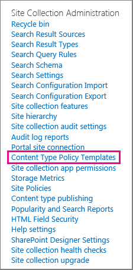

# 資訊管理原則簡介Introduction to information management policies

資訊管理原則是一種內容的一組規則。An information management policy is a set of rules for a type of content. 資訊管理原則可讓組織控制及追蹤內容保留多久或使用者可對該內容採取的動作等事項。Information management policies enable organizations to control and track things like how long content is retained or what actions users can take with that content. 資料管理原則可協助組織符合法律或政府規範，或是只強制執行一些內部業務流程。Information management policies can help organizations comply with legal or governmental regulations, or they can simply enforce internal business processes. 
  
例如，組織必須遵循政府法規要求他們示範其財務報表的「適當的控制」，可能會建立一或多個資訊管理原則，以針對財務檔相關的所有檔，在撰寫和核准程式中審核特定動作。For example, an organization that must follow government regulations requiring that they demonstrate "adequate controls" of their financial statements might create one or more information management policies that audit specific actions in the authoring and approval process for all documents related to financial filings.
  
如需詳細資訊，請參閱[Create and apply 資訊管理原則](create-info-mgmt-policies.md)。For how-to information, see [Create and apply information management policies](create-info-mgmt-policies.md).
  
## 資訊管理原則的功能Features of information management policies

組織可以個別或結合使用的預先定義的原則功能有四種基本類別，以管理內容與程式。There are four basic categories of predefined policy features that organizations can use individually or in combination to manage content and processes. 
  

  
「審核原則」功能可協助組織分析在檔和清單專案上執行的事件及作業，如何使用其內容管理系統。The Auditing policy feature helps organizations analyze how their content management systems are used by logging events and operations that are performed on documents and list items. 您可以設定審核原則功能來記錄事件（例如，當檔或專案編輯、查看、存回、取出、刪除或變更其許可權）。You can configure the Auditing policy feature to log events such as when a document or item is edited, viewed, checked in, checked out, deleted, or has its permissions changed. 所有的審計資訊會儲存在伺服器上的單一審核記錄中，網站管理員可以在該伺服器上執行報告。All of the audit information is stored in a single audit log on the server, and site administrators can run reports on it. 
  
到期原則功能可協助組織以一致且 trackable 的方式，從其網站刪除或移除過期的內容。The Expiration policy feature helps organizations delete or remove out-of-date content from their sites in a consistent, trackable way. 這可協助您管理保留到期內容相關的成本和風險。This helps you manage both the cost and risk associated with retaining out-of-date content. 您可以設定到期原則，以指定特定的內容類型會在特定日期或檔建立或上次修改後的一段時間內到期。You can configure an Expiration policy to specify that certain types of content expire on a particular date or within a period of time after the document was created or last modified.
  
組織也可以建立及部署自訂的原則功能，以滿足特定的需求。Organizations can also create and deploy custom policy features to meet specific needs. 例如，製造組織可能會想要為所有草稿產品設計規格檔定義資訊管理原則，禁止使用者在不安全的印表機上列印這些檔的副本。For example, a manufacturing organization might want to define an information management policy for all draft product-design specification documents that prohibits users from printing copies of these documents on nonsecure printers. 若要定義這種資訊管理原則，您可以建立及部署列印限制原則功能，以新增至 [產品設計規格] 內容類型的相關資訊管理原則。To define this kind of information management policy, you can create and deploy a Printing Restriction policy feature that can be added to the relevant information management policy for the product design specification content type.
  
## 使用資訊管理原則的位置Locations to use an information management policy

若要執行資訊管理原則，您必須將其新增至網站中的清單、文件庫或內容類型。To implement an information management policy, you must add it to a list, library, or content type in a site. 您建立或新增資訊管理原則的位置會影響原則的套用範圍或可使用的程度。The location where you create or add an information management policy affects how broadly the policy applies or how broadly it can be used. 您可以：You can:
  
 **建立網站集合原則，然後將此原則新增至內容類型、清單或文件庫**您可以在網站集合的最上層網站的 [原則] 清單中建立網站集合原則。**Create a site collection policy and then add this policy to a content type, list, or library** You can create a site collection policy in the Policies list in the top-level site of a site collection. 在您建立網站集合原則之後，您可以將其匯出，讓其他網站集合的管理員可以將其匯入其原則清單。After you create a site collection policy, you can export it so that administrators of other site collections can import it into their Policies list. 建立可匯出的網站集合原則，可讓您在組織中的各個網站上，將資訊管理原則標準化。Creating an exportable site collection policy enables you to standardize the information management policies across the sites in your organization. 
  
當您將網站集合原則新增至網站內容類型，並將該網站內容類型的實例新增至清單或文件庫中，該清單或文件庫的擁有者便無法修改清單或文件庫的網站集合原則。When you add a site collection policy to a site content type, and an instance of that site content type is added to a list or library, the owner of that list or library cannot modify the site collection policy for the list or library. 將網站集合原則新增至網站內容類型是一種很好的方法，可確保網站集合原則在網站階層的每個層級強制執行。Adding a site collection policy to a site content type is a good way to ensure that site collection policies are enforced at each level of your site hierarchy.
  

  
 **在最上層網站的網站內容類型庫中為網站內容類型建立資訊管理原則，然後將該內容類型新增至一或多個清單或文件庫**您也可以直接為網站內容類型建立資訊管理原則，然後將該網站內容類型的實例與多個清單或文件庫建立關聯。**Create an information management policy for a site content type in the top-level site's Site Content Type Gallery, and then add that content type to one or more lists or libraries** You can also create an information management policy directly for a site content type and then associate an instance of that site content type with multiple lists or libraries. 如果您以這種方式建立資訊管理原則，則該內容類型的網站集合中的每個專案或是繼承自該內容類型的內容類型都具有原則。If you create an information management policy this way, every item in the site collection of that content type or a content type that inherits from that content type has the policy. 不過，如果您直接為網站內容類型建立資訊管理原則，則在其他網站集合中重複使用此資訊管理原則會比較困難，因為無法匯出以這種方式建立的原則。However, if you create an information management policy directly for a site content type, it is more difficult to reuse this information management policy in other site collections, because policies that are created this way cannot be exported. 
  

  
![網站內容類型 [設定] 頁面上的資訊管理原則連結](../media/15d83a34-6c8f-4b6e-b6ee-e9b0a70cbb4b.png)
  
附注若要控制在網站集合中使用的原則，網站集合管理員可以停用在內容類型上直接設定原則功能的能力。Note To control which policies are used in a site collection, site collection administrators can disable the ability to set policy features directly on a content type. 當此限制生效時，建立內容類型的使用者限制于從 [網站集合原則] 清單中選取原則。When this restriction is in effect, users who create content types are limited to selecting policies from the site collection Policies list.
  
 **建立清單或文件庫的資訊管理原則**如果您的組織需要將特定的資訊管理原則套用至一組非常有限的內容，您可以建立僅套用至個別清單或文件庫的資訊管理原則。**Create an information management policy for a list or library** If your organization needs to apply a specific information management policy to a very limited set of content, you can create an information management policy that applies only to an individual list or library. 這種建立資訊管理原則的方法是最小彈性，因為原則只適用于一個位置，而且無法在其他位置匯出或重複使用。This method of creating an information management policy is the least flexible, because the policy applies only to one location, and it cannot be exported or reused for other locations. 不過，在某些情況下，您可能需要使用有限適用性建立唯一的資訊管理原則，以解決特定的情況。However, sometimes you may need to create unique information management policies with limited applicability to address specific situations. 
  

  
附註Notes 
  
只有當清單或文件庫不支援多個內容類型時，您才可以為清單或文件庫建立資訊管理原則。You can create an information management policy for a list or library only if that list or library does not support multiple content types. 如果清單或文件庫支援多個內容類型，您必須為與該清單或文件庫相關聯的每個個別清單內容類型定義資訊管理原則。If a list or library supports multiple content types, you need to define an information management policy for each individual list content type that is associated with that list or library. （與特定清單或文件庫相關聯的網站內容類型實例，稱為清單內容類型。）(Instances of a site content type that are associated with a specific list or library are known as list content types.)
  
若要控制在網站集合中使用的原則，網站集合管理員可以停用在清單或文件庫上直接設定原則功能的功能。To control which policies are used in a site collection, site collection administrators can disable the ability to set policy features directly on a list or library. 當此限制生效時，管理清單或文件庫的使用者，只限于從 [網站集合原則] 清單中選取原則。When this restriction is in effect, users who manage lists or libraries are limited to selecting policies from the site collection Policies list.
  
[資訊管理原則是一套內容類型的規則。資訊管理原則可讓組織控制及追蹤內容保留多久或使用者可對該內容採取的動作等事項。資訊管理原則可以協助組織遵循法律或政府法規，也可以只強制執行內部商務程式。例如，組織必須遵循政府法規要求他們示範其財務報表的「適當的控制」，可能會建立一或多個資訊管理原則，以針對財務檔相關的所有檔，在撰寫和核准程式中審核特定動作。如需詳細資訊，請參閱 Create and apply 資訊管理原則。An information management policy is a set of rules for a type of content. Information management policies enable organizations to control and track things like how long content is retained or what actions users can take with that content. Information management policies can help organizations comply with legal or governmental regulations, or they can simply enforce internal business processes. For example, an organization that must follow government regulations requiring that they demonstrate "adequate controls" of their financial statements might create one or more information management policies that audit specific actions in the authoring and approval process for all documents related to financial filings.For how-to information, see Create and apply information management policies.](intro-to-info-mgmt-policies.md#__top)
  

