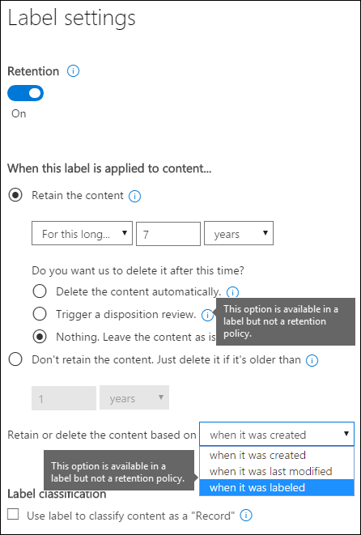
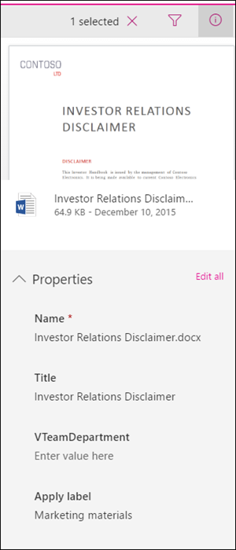
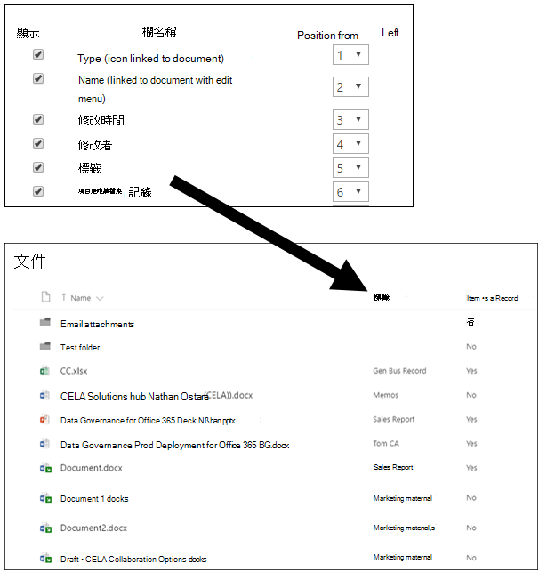
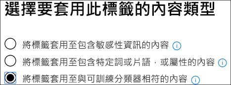
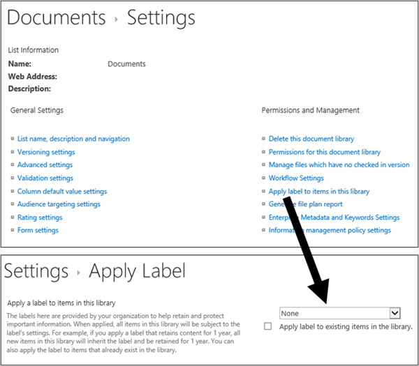
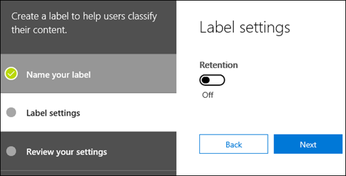
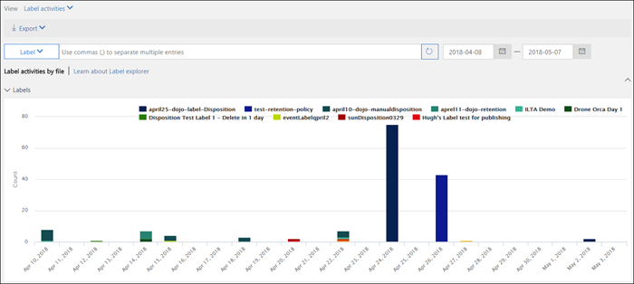
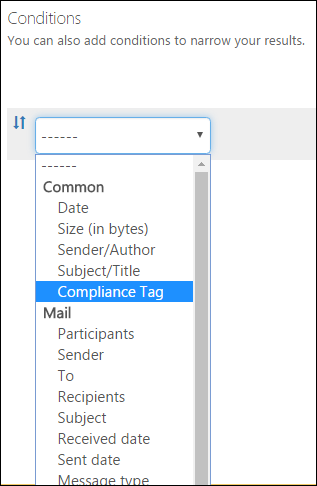
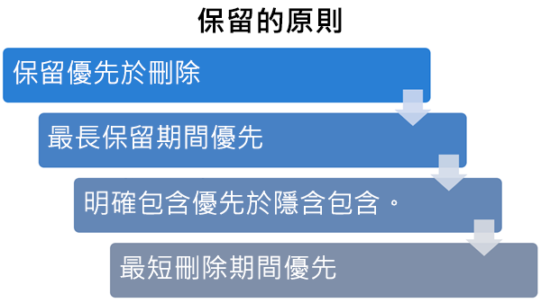

# <a name="overview-of-retention-labels"></a><span data-ttu-id="b8857-104">保留標籤概觀</span><span class="sxs-lookup"><span data-stu-id="b8857-104">Overview of retention labels</span></span>

<span data-ttu-id="b8857-p102">您的整個組織可能擁有不同類型的內容，需要採取不同的動作才能符合產業規範和內部原則。例如，您可能有：</span><span class="sxs-lookup"><span data-stu-id="b8857-p102">Across your organization, you probably have different types of content that require different actions taken on them in order to comply with industry regulations and internal policies. For example, you might have:</span></span>
  
- <span data-ttu-id="b8857-107">至少必須**保留**一小段時間的稅務表單。</span><span class="sxs-lookup"><span data-stu-id="b8857-107">Tax forms that need to be **retained** for a minimum period of time.</span></span> 
    
- <span data-ttu-id="b8857-108">到達特定年限之後需要**永久刪除**的新聞材料。</span><span class="sxs-lookup"><span data-stu-id="b8857-108">Press materials that need to be **permanently deleted** when they reach a certain age.</span></span> 
    
- <span data-ttu-id="b8857-109">需要先**保留**之然後再**永久刪除**的競爭力研究。</span><span class="sxs-lookup"><span data-stu-id="b8857-109">Competitive research that needs to be both **retained** and then **permanently deleted**.</span></span> 
    
- <span data-ttu-id="b8857-110">必須**標示為記錄**使之無法編輯或刪除的工作簽證。</span><span class="sxs-lookup"><span data-stu-id="b8857-110">Work visas that must be **marked as a record** so that they can't be edited or deleted.</span></span> 
    
<span data-ttu-id="b8857-p103">在這些案例中，Office 365 中的保留標籤可以幫助您對正確的內容採取正確的動作。使用保留標籤，您可以分類整個組織中的資料以利管理，並根據該分類強制執行保留規則。</span><span class="sxs-lookup"><span data-stu-id="b8857-p103">In all of these cases, retention labels in Office 365 can help you take the right actions on the right content. With retention labels, you can classify data across your organization for governance, and enforce retention rules based on that classification.</span></span>
  
<span data-ttu-id="b8857-113">使用保留標籤，您可以：</span><span class="sxs-lookup"><span data-stu-id="b8857-113">With retention labels, you can:</span></span>
  
- <span data-ttu-id="b8857-p104">**讓組織的人員可以手動套用保留標籤**至 Outlook 網頁版、Outlook 2010 及更新版本、OneDrive、SharePoint、Office 365 群組中的內容。使用者通常最清楚自己使用的內容類型，因此可以對其分類並套用適當的原則。</span><span class="sxs-lookup"><span data-stu-id="b8857-p104">**Enable people in your organization to apply a retention label manually** to content in Outlook on the web, Outlook 2010 and later, OneDrive, SharePoint, and Office 365 groups. Users often know best what type of content they're working with, so they can classify it and have the appropriate policy applied.</span></span> 
    
- <span data-ttu-id="b8857-116">在當內容符合特定條件時**自動將保留標籤套用到內容**，例如內容包含：</span><span class="sxs-lookup"><span data-stu-id="b8857-116">**Apply retention labels to content automatically** if it matches specific conditions, such as when the content contains:</span></span> 
    
    - <span data-ttu-id="b8857-117">特定類型的敏感資訊。</span><span class="sxs-lookup"><span data-stu-id="b8857-117">Specific types of sensitive information.</span></span>
    
    - <span data-ttu-id="b8857-118">特定關鍵字符合您建立的查詢。</span><span class="sxs-lookup"><span data-stu-id="b8857-118">Specific keywords that match a query you create.</span></span>
    
    - <span data-ttu-id="b8857-119">可訓練分類器的模式比對。</span><span class="sxs-lookup"><span data-stu-id="b8857-119">Pattern matches for a trainable classifier.</span></span>
    
  <span data-ttu-id="b8857-120">自動將保留標籤套用到內容很重要，因為：</span><span class="sxs-lookup"><span data-stu-id="b8857-120">The ability to apply retention labels to content automatically is important because:</span></span>
    
     - <span data-ttu-id="b8857-121">您不需要訓練您的使用者記下所有分類。</span><span class="sxs-lookup"><span data-stu-id="b8857-121">You don't need to train your users on all of your classifications.</span></span>
    
     - <span data-ttu-id="b8857-122">您不需要仰賴使用者正確地將所有內容分類。</span><span class="sxs-lookup"><span data-stu-id="b8857-122">You don't need to rely on users to classify all content correctly.</span></span>
    
   - <span data-ttu-id="b8857-123">使用者不再需要了解資料控管原則，就可以專心工作。</span><span class="sxs-lookup"><span data-stu-id="b8857-123">Users no longer need to know about data governance policies - they can instead focus on their work.</span></span>

- <span data-ttu-id="b8857-p105">**在 Office 365 中實作記錄管理**，包括電子郵件和文件。您可以使用保留標籤將內容分類成記錄。在這種情況下，無法變更或移除標籤，且不能編輯或刪除內容。</span><span class="sxs-lookup"><span data-stu-id="b8857-p105">**Implement records management across Office 365**, including both email and documents. You can use a retention label to classify content as a record. When this happens, the label can't be changed or removed, and the content can't be edited or deleted.</span></span> 

- <span data-ttu-id="b8857-127">**將預設保留標籤套用至 SharePoint 中的文件庫、資料夾或文件集**，以便該位置中的所有文件都繼承預設保留標籤。</span><span class="sxs-lookup"><span data-stu-id="b8857-127">**Apply a default retention label to a document library, folder, or document set** in SharePoint, so that all documents that arrive in that location inherit the default retention label.</span></span>  
    
<span data-ttu-id="b8857-128">您可以在 Microsoft 365 合規性中心、Microsoft 365 安全性中心或 Office 365 安全性與合規性中心建立保留標籤。</span><span class="sxs-lookup"><span data-stu-id="b8857-128">You create retention labels in the Microsoft 365 compliance center, Microsoft 365 security center, or Office 365 Security & Compliance Center.</span></span>

## <a name="how-retention-labels-work-with-retention-label-policies"></a><span data-ttu-id="b8857-129">保留標籤如何與保留標籤原則一起使用</span><span class="sxs-lookup"><span data-stu-id="b8857-129">How retention labels work with retention label policies</span></span>

<span data-ttu-id="b8857-130">為貴組織中的人員提供保留標籤，將內容分類只需完成兩個步驟：首先，您必須建立保留標籤，接著將標籤發佈到您指定的位置。</span><span class="sxs-lookup"><span data-stu-id="b8857-130">Making retention labels available to people in your organization so that they can classify content is a two-step process: first you create the retention labels, and then you publish them to the locations you choose.</span></span> <span data-ttu-id="b8857-131">當您發佈保留標籤時，系統會建立保留標籤原則。</span><span class="sxs-lookup"><span data-stu-id="b8857-131">When you publish retention labels, a retention label policy gets created.</span></span>
  

  
<span data-ttu-id="b8857-133">保留標籤是由一或多個保留標籤原則所包含之可重複使用的獨立建構元素。</span><span class="sxs-lookup"><span data-stu-id="b8857-133">Retention labels are independent, reusable building blocks that are included in one or more retention label policies.</span></span> <span data-ttu-id="b8857-134">保留標籤原則的主要目的是將一組保留標籤分組，以及指定您想讓這些標籤出現的目標位置。</span><span class="sxs-lookup"><span data-stu-id="b8857-134">The primary purpose of a retention label policy is to group a set of retention labels and specify the locations where you want those labels to appear.</span></span>
  

  
1. <span data-ttu-id="b8857-136">當您發佈保留標籤時，會將它們納入保留標籤原則。</span><span class="sxs-lookup"><span data-stu-id="b8857-136">When you publish retention labels, they're included in a retention label policy.</span></span> <span data-ttu-id="b8857-137">保留標籤名稱是不可改變的，表示在建立之後無法編輯它們。</span><span class="sxs-lookup"><span data-stu-id="b8857-137">Retention label names are immutable, which means that they and cannot be edited after they're created.</span></span>


2. <span data-ttu-id="b8857-138">單一保留標籤可納入多個保留標籤原則。</span><span class="sxs-lookup"><span data-stu-id="b8857-138">A single retention label can be included in many retention label policies.</span></span>

3. <span data-ttu-id="b8857-139">單一位置也可納入多個保留標籤原則。</span><span class="sxs-lookup"><span data-stu-id="b8857-139">A single location can also be included in many retention label policies.</span></span>    
    
3. <span data-ttu-id="b8857-140">保留標籤原則會指定要發佈保留標籤的位置。</span><span class="sxs-lookup"><span data-stu-id="b8857-140">Retention label policies specify the locations to publish the retention labels.</span></span>
    
## <a name="only-one-retention-label-at-a-time"></a><span data-ttu-id="b8857-141">一次只能有一個保留標籤</span><span class="sxs-lookup"><span data-stu-id="b8857-141">Only one retention label at a time</span></span>

<span data-ttu-id="b8857-142">請務必了解，電子郵件或文件等內容一次只能指派一個保留標籤：</span><span class="sxs-lookup"><span data-stu-id="b8857-142">It's important to know that content like an email or document can have only a single retention label assigned to it at a time:</span></span>
  
- <span data-ttu-id="b8857-143">針對使用者手動指派的保留標籤，使用者可以移除或變更獲指派的保留標籤。</span><span class="sxs-lookup"><span data-stu-id="b8857-143">For retention labels assigned manually by end users, people can remove or change the retention label that's assigned.</span></span>
    
- <span data-ttu-id="b8857-144">如果內容有指派自動套用的標籤，使用者可以手動指派保留標籤來取代自動套用的標籤。</span><span class="sxs-lookup"><span data-stu-id="b8857-144">If content has an auto-apply label assigned, an auto-apply label can be replaced by a retention label assigned manually by an end user.</span></span>
    
- <span data-ttu-id="b8857-145">如果內容有使用者手動指派的保留標籤，則自動套用標籤無法取代手動指派的保留標籤。</span><span class="sxs-lookup"><span data-stu-id="b8857-145">If content has a retention label assigned manually by an end user, an auto-apply label cannot replace the manually assigned retention label.</span></span>
    
- <span data-ttu-id="b8857-146">如果有多項規則會指派自動套用標籤，且內容符合多項規則的條件，則會指派最舊規則的保留標籤。</span><span class="sxs-lookup"><span data-stu-id="b8857-146">If there are multiple rules that assign an auto-apply label and content meets the conditions of multiple rules, the retention label for the oldest rule is assigned.</span></span>
    
<span data-ttu-id="b8857-p109">手動指派標籤為明確指派，自動套用標籤為隱含指派。明確保留標籤的優先順序高於隱含標籤。如需詳細資訊，請參閱之後的[保留原則，哪一個優先？](#the-principles-of-retention-or-what-takes-precedence)小節。</span><span class="sxs-lookup"><span data-stu-id="b8857-p109">Manually assigned labels are explicitly assigned; auto-apply labels are implicitly assigned; an explicit retention label takes precedence over an implicit label. For more information, see the below section on [The principles of retention, or what takes precedence?](#the-principles-of-retention-or-what-takes-precedence).</span></span>

<span data-ttu-id="b8857-p110">本節中所有的資訊僅適用於保留標籤。請注意，除了一個保留標籤之外，也可以將一個敏感度標籤套用至內容的項目。</span><span class="sxs-lookup"><span data-stu-id="b8857-p110">All the information in this section applies only to retention labels. Note that an item of content can also have one sensitivity label applied to it, in addition to one retention label.</span></span>
  
## <a name="how-long-it-takes-for-retention-labels-to-take-effect"></a><span data-ttu-id="b8857-151">保留標籤要多久才會生效</span><span class="sxs-lookup"><span data-stu-id="b8857-151">How long it takes for retention labels to take effect</span></span>

<span data-ttu-id="b8857-152">當您發佈或自動套用保留標籤時，標籤不會立即生效：</span><span class="sxs-lookup"><span data-stu-id="b8857-152">When you publish or auto-apply retention labels, they don't take effect immediately:</span></span>
  
1. <span data-ttu-id="b8857-153">首先，標籤原則必須先將系統管理中心與原則中的位置同步。</span><span class="sxs-lookup"><span data-stu-id="b8857-153">First the label policy needs to be synced from the admin center to the locations in the policy.</span></span>
    
2. <span data-ttu-id="b8857-154">接著，位置可能會需要一些時間，將已發佈的保留標籤提供給使用者，或是將標籤自動套用到內容。</span><span class="sxs-lookup"><span data-stu-id="b8857-154">Then the location may require time to make published retention labels available to end users or time to auto-apply labels to content.</span></span> <span data-ttu-id="b8857-155">實際所需的時間取決於保留標籤的位置和類型。</span><span class="sxs-lookup"><span data-stu-id="b8857-155">How long this takes depends on the location and type of retention label.</span></span>
    
### <a name="published-retention-labels"></a><span data-ttu-id="b8857-156">已發佈的保留標籤</span><span class="sxs-lookup"><span data-stu-id="b8857-156">Published retention labels</span></span>

<span data-ttu-id="b8857-p112">如果您將保留標籤發佈到 SharePoint 或 OneDrive，需要一天的時間讓這些保留標籤向使用者顯示。此外，如果您將保留標籤發佈到 Exchange，可能需要 7 天來向使用者顯示這些保留標籤，且信箱至少必須包含 10 MB 的資料。</span><span class="sxs-lookup"><span data-stu-id="b8857-p112">If you publish retention labels to SharePoint or OneDrive, it can take one day for those retention labels to appear for end users. In addition, if you publish retention labels to Exchange, it can take 7 days for those retention labels to appear for end users, and the mailbox needs to contain at least 10 MB of data.</span></span>
  

  
### <a name="auto-apply-retention-labels"></a><span data-ttu-id="b8857-160">自動套用保留標籤</span><span class="sxs-lookup"><span data-stu-id="b8857-160">Auto-apply retention labels</span></span>

<span data-ttu-id="b8857-161">如果您將保留標籤自動套用至符合特定條件的內容，保留標籤套用至符合條件的所有現有內容可能需要 7 天。</span><span class="sxs-lookup"><span data-stu-id="b8857-161">If you auto-apply retention labels to content matching specific conditions, it can take seven days for the retention labels to be applied to all existing content that matches the conditions.</span></span>
  

  
### <a name="how-to-check-on-the-status-of-retention-labels-published-to-exchange"></a><span data-ttu-id="b8857-163">如何檢查發佈至 Exchange 之保留標籤的狀態</span><span class="sxs-lookup"><span data-stu-id="b8857-163">How to check on the status of retention labels published to Exchange</span></span>

<span data-ttu-id="b8857-p113">在 Exchange Online 中，是透過每 7 天執行一次的程序，將保留標籤提供給使用者。您可以使用 Powershell 查看此程序上次執行的時間，依此判斷下一次執行時間。</span><span class="sxs-lookup"><span data-stu-id="b8857-p113">In Exchange Online, retention labels are made available to end users by a process that runs every seven days. By using Powershell, you can see when this process last ran and thus determine when it will run again.</span></span>
  
1. <span data-ttu-id="b8857-166">[連線至 Exchange Online PowerShell](https://go.microsoft.com/fwlink/?linkid=799773)。</span><span class="sxs-lookup"><span data-stu-id="b8857-166">[Connect to Exchange Online PowerShell](https://go.microsoft.com/fwlink/?linkid=799773).</span></span>
    
2. <span data-ttu-id="b8857-167">執行下列命令。</span><span class="sxs-lookup"><span data-stu-id="b8857-167">Run these commands.</span></span>
    
   ```powershell
   $logProps = Export-MailboxDiagnosticLogs <user> -ExtendedProperties
   ```

   ```powershell
   $xmlprops = [xml]($logProps.MailboxLog)
   ```

   ```powershell
   $xmlprops.Properties.MailboxTable.Property | ? {$_.Name -like "ELC*"}
   ```

<span data-ttu-id="b8857-168">結果：`ELCLastSuccessTimeStamp` (UTC) 屬性會顯示系統上次處理您信箱的時間。</span><span class="sxs-lookup"><span data-stu-id="b8857-168">In the results, the `ELCLastSuccessTimeStamp` (UTC) property shows when the system last processed your mailbox.</span></span> <span data-ttu-id="b8857-169">如果系統在您建立原則後都還未處理信箱，標籤就無法顯示。</span><span class="sxs-lookup"><span data-stu-id="b8857-169">If it has not happened since the time you created the policy, the labels are not going to appear.</span></span> <span data-ttu-id="b8857-170">若要強制處理信箱，請執行 `Start-ManagedFolderAssistant -Identity <user>`。</span><span class="sxs-lookup"><span data-stu-id="b8857-170">To force processing, run  `Start-ManagedFolderAssistant -Identity <user>`.</span></span>
    
<span data-ttu-id="b8857-171">如果標籤沒有出現在 Outlook 網頁版中，而您認為應該要出現，請務必清除瀏覽器中的快取 (CTRL + F5)。</span><span class="sxs-lookup"><span data-stu-id="b8857-171">If labels aren't appearing in Outlook on the web and you think they should be, make sure to clear the cache in your browser (CTRL+F5).</span></span>
    
## <a name="retention-label-policies-and-locations"></a><span data-ttu-id="b8857-172">保留標籤原則與位置</span><span class="sxs-lookup"><span data-stu-id="b8857-172">Retention label policies and locations</span></span>

<span data-ttu-id="b8857-173">可以將不同類型的保留標籤發佈到不同的位置，視保留標籤的功能而定。</span><span class="sxs-lookup"><span data-stu-id="b8857-173">Different types of retention labels can be published to different locations, depending on what the retention label does.</span></span>
  
|<span data-ttu-id="b8857-174">**如果保留標籤是...**</span><span class="sxs-lookup"><span data-stu-id="b8857-174">**If the retention label is…**</span></span>|<span data-ttu-id="b8857-175">**則標籤原則可套用至...**</span><span class="sxs-lookup"><span data-stu-id="b8857-175">**Then the label policy can be applied to…**</span></span>|
|:-----|:-----|
|<span data-ttu-id="b8857-176">發佈給使用者</span><span class="sxs-lookup"><span data-stu-id="b8857-176">Published to end users</span></span>  <br/> |<span data-ttu-id="b8857-177">Exchange、SharePoint、OneDrive、Office 365 群組</span><span class="sxs-lookup"><span data-stu-id="b8857-177">Exchange, SharePoint, OneDrive, Office 365 groups</span></span>  <br/> |
|<span data-ttu-id="b8857-178">根據敏感資訊類型而自動套用</span><span class="sxs-lookup"><span data-stu-id="b8857-178">Auto-applied based on sensitive information types</span></span>  <br/> |<span data-ttu-id="b8857-179">Exchange (僅限所有信箱)、SharePoint、OneDrive</span><span class="sxs-lookup"><span data-stu-id="b8857-179">Exchange (all mailboxes only), SharePoint, OneDrive</span></span>  <br/> |
|<span data-ttu-id="b8857-180">根據查詢而自動套用</span><span class="sxs-lookup"><span data-stu-id="b8857-180">Auto-applied based on a query</span></span>  <br/> |<span data-ttu-id="b8857-181">Exchange、SharePoint、OneDrive、Office 365 群組</span><span class="sxs-lookup"><span data-stu-id="b8857-181">Exchange, SharePoint, OneDrive, Office 365 groups</span></span>  <br/> |
   
<span data-ttu-id="b8857-182">在 Exchange 中，您只能在新傳送的郵件 (傳輸中的資料) 上自動套用保留標籤功能 (適用於查詢和敏感性資訊類型)，而非目前在信箱中的所有郵件 (待用資料)。</span><span class="sxs-lookup"><span data-stu-id="b8857-182">In Exchange, auto-apply retention labels (for both queries and sensitive information types) are applied only to messages newly sent (data in transit), not to all items currently in the mailbox (data at rest).</span></span> <span data-ttu-id="b8857-183">此外，您只能在所有信箱中為敏感性資訊類型自動套用保留標籤功能，但無法選取特定信箱。</span><span class="sxs-lookup"><span data-stu-id="b8857-183">Also, auto-apply retention labels for sensitive information types can apply only to all mailboxes; you can't select the specific mailboxes.</span></span>
  
<span data-ttu-id="b8857-184">Exchange 公用資料夾和 Skype 不支援標籤。</span><span class="sxs-lookup"><span data-stu-id="b8857-184">Exchange public folders and Skype do not support labels.</span></span>
  
## <a name="how-retention-labels-enforce-retention"></a><span data-ttu-id="b8857-185">保留標籤如何強制保留</span><span class="sxs-lookup"><span data-stu-id="b8857-185">How retention labels enforce retention</span></span>

<span data-ttu-id="b8857-186">保留標籤可強制執行與保留原則相同的保留動作。</span><span class="sxs-lookup"><span data-stu-id="b8857-186">Retention labels can enforce the same retention actions that a retention policy can.</span></span> <span data-ttu-id="b8857-187">您可以使用保留標籤來實作複雜的內容計劃 (或檔案計畫)。</span><span class="sxs-lookup"><span data-stu-id="b8857-187">You can use retention labels to implement a sophisticated content plan (or file plan).</span></span> <span data-ttu-id="b8857-188">如需保留運作方式的詳細資訊，請參閱[保留原則概觀](retention-policies.md)。</span><span class="sxs-lookup"><span data-stu-id="b8857-188">For more information on how retention works, see [Overview of retention policies](retention-policies.md).</span></span>
  
<span data-ttu-id="b8857-p117">除此之外，保留標籤有兩個只能用於保留標籤，但不能用於保留原則的保留選項。使用保留標籤，您可以：</span><span class="sxs-lookup"><span data-stu-id="b8857-p117">In addition, a retention label has two retention options that are available only in a retention label and not in a retention policy. With a retention label, you can:</span></span>
  
- <span data-ttu-id="b8857-p118">在保留期間結束時觸發處置檢閱，這樣能在刪除 SharePoint 和 OneDrive 文件之前，必須先檢閱它們。如需詳細資訊，請參閱[處置檢閱概觀](disposition-reviews.md)。</span><span class="sxs-lookup"><span data-stu-id="b8857-p118">Trigger a disposition review at the end of the retention period, so that SharePoint and OneDrive documents must be reviewed before they can be deleted. For more information, see [Overview of disposition reviews](disposition-reviews.md).</span></span>
    
- <span data-ttu-id="b8857-193">保留期間是從內容套用標籤時開始計算，而不是內容的壽命或上次修改時間。</span><span class="sxs-lookup"><span data-stu-id="b8857-193">Start the retention period from when the content was labeled, instead of the age of the content or when it was last modified.</span></span> <span data-ttu-id="b8857-194">此選項僅適用 SharePoint 網站和 OneDrive 帳戶中的內容。</span><span class="sxs-lookup"><span data-stu-id="b8857-194">This option applies only to content in SharePoint sites and OneDrive accounts.</span></span> <span data-ttu-id="b8857-195">針對 Exchange 電子郵件，保留期間一律會取決於傳送或接收郵件的日期，無論在這裡選擇的選項為何。</span><span class="sxs-lookup"><span data-stu-id="b8857-195">For Exchange email, the retention period is always based on the date when the message was sent or received, no matter which option you choose here.</span></span>
    

  
## <a name="where-published-retention-labels-can-appear-to-end-users"></a><span data-ttu-id="b8857-197">可以向使用者顯示已發佈保留標籤的位置</span><span class="sxs-lookup"><span data-stu-id="b8857-197">Where published retention labels can appear to end users</span></span>

<span data-ttu-id="b8857-198">如果保留標籤將由使用者指派給內容，您可以將它發佈到：</span><span class="sxs-lookup"><span data-stu-id="b8857-198">If your retention label will be assigned to content by end users, you can publish it to:</span></span>
  
- <span data-ttu-id="b8857-199">Outlook 網頁版</span><span class="sxs-lookup"><span data-stu-id="b8857-199">Outlook on the web</span></span>
    
- <span data-ttu-id="b8857-200">Outlook 2010 及更新版本</span><span class="sxs-lookup"><span data-stu-id="b8857-200">Outlook 2010 and later</span></span>
    
- <span data-ttu-id="b8857-201">OneDrive</span><span class="sxs-lookup"><span data-stu-id="b8857-201">OneDrive</span></span>
    
- <span data-ttu-id="b8857-202">SharePoint</span><span class="sxs-lookup"><span data-stu-id="b8857-202">SharePoint</span></span>
    
- <span data-ttu-id="b8857-203">Office 365 群組 (群組網站和Outlook 網頁版中的群組信箱)</span><span class="sxs-lookup"><span data-stu-id="b8857-203">Office 365 groups (both the group site and group mailbox in Outlook on the web)</span></span>
    
<span data-ttu-id="b8857-204">以下各節說明標籤在不同應用程式中向組織內人員顯示的方式。</span><span class="sxs-lookup"><span data-stu-id="b8857-204">The sections that follow explain how labels appear in different apps to people in your organization.</span></span>
  
### <a name="outlook-on-the-web"></a><span data-ttu-id="b8857-205">Outlook 網頁版</span><span class="sxs-lookup"><span data-stu-id="b8857-205">Outlook on the web</span></span>

<span data-ttu-id="b8857-206">若要在 Outlook 網頁版中的項目加上標籤，以滑鼠右鍵按一下該項目 \>[指派原則]\*\*\*\* \> 選擇保留標籤。</span><span class="sxs-lookup"><span data-stu-id="b8857-206">To label an item in Outlook on the web, right-click the item \> **Assign policy** \> choose the retention label.</span></span> 
  

  
<span data-ttu-id="b8857-p120">套用保留標籤後，您可以在項目頂端檢視該保留標籤以及它採取的動作。如果電子郵件已分類，且有相關聯的保留期間，您可以一目了然電子郵件的到期日。</span><span class="sxs-lookup"><span data-stu-id="b8857-p120">After the retention label is applied, you can view that retention label and what action it takes at the top of the item. If an email is classified and has an associated retention period, you can know at a glance when the email will expire.</span></span>
  

  
<span data-ttu-id="b8857-211">您也可以將保留標籤套用到資料夾，在此情況下：</span><span class="sxs-lookup"><span data-stu-id="b8857-211">You can also apply retention labels to folders, in which case:</span></span>
  
- <span data-ttu-id="b8857-p121">資料夾中的所有項目會自動套用相同的保留標籤，**除了**已明確套用保留標籤的項目。已明確套用標籤的項目會保留現有的保留標籤。如需詳細資訊，請參閱之後的保留原則小節。</span><span class="sxs-lookup"><span data-stu-id="b8857-p121">All items in the folder automatically get the same retention label, **except** for items that have had a retention label applied explicitly to them. Explicitly labeled items keep their existing retention label. For more information, see the below section on the principles of retention.</span></span> 
    
- <span data-ttu-id="b8857-215">如果您變更或移除資料夾的預設保留標籤，資料夾中的所有項目也會變更或移除該保留標籤，**除了**明確套用保留標籤的項目。</span><span class="sxs-lookup"><span data-stu-id="b8857-215">If you change or remove the default retention label for a folder, the retention label's also changed or removed for all items in the folder, **except** items with explicit retention labels.</span></span> 
    
- <span data-ttu-id="b8857-216">如果您將有預設保留標籤的項目從某個資料夾移到另一個具有不同預設保留標籤的資料夾，該項目就會套用新的預設保留標籤。</span><span class="sxs-lookup"><span data-stu-id="b8857-216">If you move an item with a default retention label from one folder to another folder with a different default retention label, the item gets the new default retention label.</span></span>
    
- <span data-ttu-id="b8857-217">如果您將有預設保留標籤的項目從某個資料夾移到另一個沒有不同預設保留標籤的資料夾，就會移除舊的預設保留標籤。</span><span class="sxs-lookup"><span data-stu-id="b8857-217">If you move an item with a default retention label from one folder to another folder with no default retention label, the old default retention label is removed.</span></span>
    
### <a name="outlook-2010-and-later"></a><span data-ttu-id="b8857-218">Outlook 2010 及更新版本</span><span class="sxs-lookup"><span data-stu-id="b8857-218">Outlook 2010 and later</span></span>

<span data-ttu-id="b8857-219">若要在 Outlook 電腦版用戶端套用標籤到項目，請選取該項目。</span><span class="sxs-lookup"><span data-stu-id="b8857-219">To label an item in the Outlook desktop client, select the item.</span></span> <span data-ttu-id="b8857-220">在功能區的 [常用]\*\*\*\* 索引標籤上，按一下 [指派原則]\*\*\*\*，然後選擇保留標籤。</span><span class="sxs-lookup"><span data-stu-id="b8857-220">On the **Home** tab on the ribbon, click **Assign Policy**, and then choose the retention label.</span></span> 
  

  
<span data-ttu-id="b8857-222">您也能夠以滑鼠右鍵按一下該項目，按一下操作功能表中的 [指派原則]\*\*\*\*，然後選擇保留標籤。</span><span class="sxs-lookup"><span data-stu-id="b8857-222">You can also right-click an item, click **Assign Policy** in the context menu, and then choose the retention label.</span></span> 

<span data-ttu-id="b8857-223">套用保留標籤後，您可以在項目頂端檢視該保留標籤以及所採取的動作。</span><span class="sxs-lookup"><span data-stu-id="b8857-223">After the retention label is applied, you can view that retention label and what action it takes at the top of the item.</span></span> <span data-ttu-id="b8857-224">如果電子郵件已套用具有相關聯保留期間的保留標籤，您可以快速查看電子郵件的到期日。</span><span class="sxs-lookup"><span data-stu-id="b8857-224">If an email has a retention label applied that has an associated retention period, you can see at a glance when the email expires.</span></span>
  
<span data-ttu-id="b8857-225">您也可以將保留標籤套用到資料夾。</span><span class="sxs-lookup"><span data-stu-id="b8857-225">You can also apply retention labels to folders.</span></span> <span data-ttu-id="b8857-226">運作方式與 Outlook 2010 及更新版本和 Outlook 網頁版相同。</span><span class="sxs-lookup"><span data-stu-id="b8857-226">This works the same in Outlook 2010 and later as it does in Outlook on the web.</span></span> <span data-ttu-id="b8857-227">如需詳細資料，請參閱上一節。</span><span class="sxs-lookup"><span data-stu-id="b8857-227">See the previous section for more info.</span></span>
  
### <a name="onedrive-and-sharepoint"></a><span data-ttu-id="b8857-228">OneDrive 和 SharePoint</span><span class="sxs-lookup"><span data-stu-id="b8857-228">OneDrive and SharePoint</span></span>

<span data-ttu-id="b8857-229">若要為 OneDrive 或 SharePoint 中的文件 (包括 OneNote 檔案) 加上標籤，請選取右上角的項目 \>、選擇 [開啟詳細資料窗格]\*\*\*\*![[資訊窗格] 圖示](../media/50b6d51b-92b4-4c5f-bb4b-4ca2d4aa3d04.png) \>[套用保留標籤]\*\*\*\* \>，然後選擇保留標籤。</span><span class="sxs-lookup"><span data-stu-id="b8857-229">To label a document (including OneNote files) in OneDrive or SharePoint, select the item \> in the upper-right corner, choose **Open the details pane** \> **Apply retention label** \> choose the retention label.</span></span> 
  
<span data-ttu-id="b8857-230">您也可以將保留標籤套用至資料夾或數個文件，可以為文件庫設定預設保留標籤。</span><span class="sxs-lookup"><span data-stu-id="b8857-230">You can also apply a retention label to a folder or document set, and you can set a default retention label for a document library.</span></span> <span data-ttu-id="b8857-231">詳細資訊請參閱下一小節。</span><span class="sxs-lookup"><span data-stu-id="b8857-231">See the section below for more information.</span></span>
  

  
<span data-ttu-id="b8857-233">將保留標籤套用到項目之後，您可以選取項目，並在詳細資料窗格中檢視標籤。</span><span class="sxs-lookup"><span data-stu-id="b8857-233">After a retention label is applied to an item, you can view it in the details pane when that item's selected.</span></span>
  

  
<span data-ttu-id="b8857-p126">您也可以建立包含**標籤**資料行或**項目是記錄**資料行的文件庫檢視，以便快速查看指派給所有項目的保留標籤以及哪些項目是記錄。不過請注意，您無法以**項目是記錄**資料行篩選檢視。</span><span class="sxs-lookup"><span data-stu-id="b8857-p126">You can also create a view of the library that contains the **Labels** column or **Item is a Record** column, so that you can see at a glance the retention labels assigned to all items and which items are records. Note, however, that you can't filter the view by the **Item is a Record** column.</span></span> 
  

  
### <a name="office-365-groups"></a><span data-ttu-id="b8857-238">Office 365 群組</span><span class="sxs-lookup"><span data-stu-id="b8857-238">Office 365 groups</span></span>

<span data-ttu-id="b8857-p127">當您將保留標籤發佈到 Office 365 群組時，保留標籤會顯示在群組網站和 Outlook 網頁版中的群組信箱。將保留標籤套用至內容和上述的套用至電子郵件和文件完全相同。</span><span class="sxs-lookup"><span data-stu-id="b8857-p127">When you publish retention labels to an Office 365 group, the retention labels appear in both the group site and group mailbox in Outlook on the web. The experience of applying a retention label to content is identical to that shown above for email and documents.</span></span>

<span data-ttu-id="b8857-p128">若要保留 Office 365 群組的內容，您必須使用 Office 365 群組位置。雖然 Office 365 群組擁有 Exchange 信箱，包含整個 Exchange 位置的保留原則並不會包含 Office 365 群組信箱中的內容。</span><span class="sxs-lookup"><span data-stu-id="b8857-p128">To retain content for an Office 365 group, you need to use the Office 365 groups location. Even though an Office 365 group has an Exchange mailbox, a retention policy that includes the entire Exchange location won't include content in Office 365 group mailboxes.</span></span>

<span data-ttu-id="b8857-243">此外，無法使用 Exchange 位置來包含或排除特定群組信箱。</span><span class="sxs-lookup"><span data-stu-id="b8857-243">In addition, it's not possible to use the Exchange location to include or exclude a specific group mailbox.</span></span> <span data-ttu-id="b8857-244">雖然 Exchange 位置最初允許選取群組信箱，但是當您嘗試儲存保留原則時，您會收到「RemoteGroupMailbox」不是Exchange 位置有效選取項目的錯誤訊息。</span><span class="sxs-lookup"><span data-stu-id="b8857-244">Although the Exchange location initially allows a group mailbox to be selected, when you try to save the retention policy, you receive an error that "RemoteGroupMailbox" is not a valid selection for the Exchange location.</span></span>
  
## <a name="applying-a-retention-label-automatically-based-on-conditions"></a><span data-ttu-id="b8857-245">根據條件自動套用保留標籤</span><span class="sxs-lookup"><span data-stu-id="b8857-245">Applying a retention label automatically based on conditions</span></span>

<span data-ttu-id="b8857-246">保留標籤最實用的功能之一，是將標籤自動套用至符合特定條件的內容。</span><span class="sxs-lookup"><span data-stu-id="b8857-246">One of the most powerful features of retention labels is the ability to apply them automatically to content that matches certain conditions.</span></span> <span data-ttu-id="b8857-247">在此情況下，貴組織中的人員不必親自套用保留標籤。</span><span class="sxs-lookup"><span data-stu-id="b8857-247">In this case, people in your organization don't need to apply the retention labels.</span></span> <span data-ttu-id="b8857-248">Office 365 會執行這些動作。</span><span class="sxs-lookup"><span data-stu-id="b8857-248">Office 365 does the work for them.</span></span>
  

  
<span data-ttu-id="b8857-250">自動套用保留標籤很強大是因為：</span><span class="sxs-lookup"><span data-stu-id="b8857-250">Auto-apply retention labels are powerful because:</span></span>
  
- <span data-ttu-id="b8857-251">您不需要訓練您的使用者記下所有分類。</span><span class="sxs-lookup"><span data-stu-id="b8857-251">You don't need to train your users on all of your classifications.</span></span>
    
- <span data-ttu-id="b8857-252">您不需要仰賴使用者正確地將所有內容分類。</span><span class="sxs-lookup"><span data-stu-id="b8857-252">You don't need to rely on users to classify all content correctly.</span></span>
    
- <span data-ttu-id="b8857-253">使用者不再需要了解資料控管原則，他們可以專心工作。</span><span class="sxs-lookup"><span data-stu-id="b8857-253">Users no longer need to know about data governance policies - they can focus on their work.</span></span>
    
<span data-ttu-id="b8857-254">您可以選擇當內容包含以下資訊時，自動將保留標籤套用到內容：</span><span class="sxs-lookup"><span data-stu-id="b8857-254">You can choose to apply retention labels to content automatically when that content contains:</span></span>
  
- [<span data-ttu-id="b8857-255">特定敏感資訊類型</span><span class="sxs-lookup"><span data-stu-id="b8857-255">Specific types of sensitive information</span></span>](#auto-apply-retention-labels-to-content-with-specific-types-of-sensitive-information)
    
- [<span data-ttu-id="b8857-256">符合您所建立查詢的特定關鍵字</span><span class="sxs-lookup"><span data-stu-id="b8857-256">Specific keywords that match a query you create</span></span>](#auto-apply-labels-to-content-with-keywords-or-searchable-properties)

- [<span data-ttu-id="b8857-257">可訓練分類器的符合項目</span><span class="sxs-lookup"><span data-stu-id="b8857-257">A match for trainable classifiers</span></span>](#auto-apply-labels-to-content-by-using-trainable-classifiers)
    


<span data-ttu-id="b8857-259">將自動套用保留標籤套用到符合您設定之條件的所有內容，最多可能需要 7 天的時間。</span><span class="sxs-lookup"><span data-stu-id="b8857-259">It can take up to seven days for auto-apply retention labels to be applied to all content that matches the conditions you've configured.</span></span>
  
> [!TIP]
> <span data-ttu-id="b8857-260">請參閱[管理具有保留標籤之 SharePoint 文件的生命週期](auto-apply-retention-labels-scenario.md)，以了解使用 SharePoint 中受管理屬性來自動套用保留標籤和實作事件導向保留的詳細案例。</span><span class="sxs-lookup"><span data-stu-id="b8857-260">See [Manage the lifecycle of SharePoint documents with retention labels](auto-apply-retention-labels-scenario.md) for a detailed scenario about using managed properties in SharePoint to auto-apply retention labels and implement event-driven retention.</span></span>

### <a name="auto-apply-retention-labels-to-content-with-specific-types-of-sensitive-information"></a><span data-ttu-id="b8857-261">自動將保留標籤套用至包含特定類型敏感資訊的內容</span><span class="sxs-lookup"><span data-stu-id="b8857-261">Auto-apply retention labels to content with specific types of sensitive information</span></span>

<span data-ttu-id="b8857-262">當您為敏感性資訊建立自動套用保留標籤時，系統會顯示與建立資料外洩防護 (DLP) 原則時相同的原則範本清單。</span><span class="sxs-lookup"><span data-stu-id="b8857-262">When you create auto-apply retention labels for sensitive information, you see the same list of policy templates as when you create a data loss prevention (DLP) policy.</span></span> <span data-ttu-id="b8857-263">每個原則範本預設會尋找特定類型的敏感性資訊。</span><span class="sxs-lookup"><span data-stu-id="b8857-263">Each policy template is preconfigured to look for specific types of sensitive information.</span></span> <span data-ttu-id="b8857-264">例如本文顯示的範本會尋找美國 ITIN、SSN 和護照號碼。</span><span class="sxs-lookup"><span data-stu-id="b8857-264">For example, the template shown here looks for U.S. ITIN, SSN, and passport numbers.</span></span> <span data-ttu-id="b8857-265">若要深入了解 DLP，請參閱[資料外洩防護原則概觀](data-loss-prevention-policies.md)。</span><span class="sxs-lookup"><span data-stu-id="b8857-265">To learn more about DLP, see [Overview of data loss prevention policies](data-loss-prevention-policies.md).</span></span>
  

  
<span data-ttu-id="b8857-p132">選取原則範本後，可以新增或移除任何類型的敏感資訊，且可以變更例項計數和比對精確度。此處所示的範例中，只有符合以下條件時，才會自動套用保留標籤：</span><span class="sxs-lookup"><span data-stu-id="b8857-p132">After you select a policy template, you can add or remove any types of sensitive information, and you can change the instance count and match accuracy. In the example shown here, a retention label will be auto-applied only when:</span></span>
  
- <span data-ttu-id="b8857-p133">內容包含 1 到 9 個下列三種敏感資訊類型。您可以刪除 \*\*max \*\* (上限) 值，條件就會變成 **any** (任何)。</span><span class="sxs-lookup"><span data-stu-id="b8857-p133">The content contains between 1 and 9 instances of any of these three sensitive information types. You can delete the **max** value so that it changes to **any**.</span></span>
    
- <span data-ttu-id="b8857-p134">偵測到的敏感資訊類型的比對精確度 (或信賴等級) 下限為 75。許多敏感資訊類型會定義多個模式，模式的比對精確度愈高，便需要尋找愈多證據 (例如關鍵字、日期、地址)，而較低比對精確度的模式則需要較少的證據。簡單來說，比對精確度的 **min** (下限) 愈低，就越容易找到與條件相符的內容。</span><span class="sxs-lookup"><span data-stu-id="b8857-p134">The type of sensitive information that's detected has a match accuracy (or confidence level) of at least 75. Many sensitive information types are defined with multiple patterns, where a pattern with a higher match accuracy requires more evidence to be found (such as keywords, dates, or addresses), while a pattern with a lower match accuracy requires less evidence. Simply put, the lower the **min** match accuracy, the easier it is for content to match the condition.</span></span> 
    
<span data-ttu-id="b8857-274">如需這些選項的詳細資訊，請參閱[調整規則，讓規則更容易或更難相符](data-loss-prevention-policies.md#tuning-rules-to-make-them-easier-or-harder-to-match)。</span><span class="sxs-lookup"><span data-stu-id="b8857-274">For more information on these options, see [Tuning rules to make them easier or harder to match](data-loss-prevention-policies.md#tuning-rules-to-make-them-easier-or-harder-to-match).</span></span>
    

  
### <a name="auto-apply-labels-to-content-with-keywords-or-searchable-properties"></a><span data-ttu-id="b8857-276">自動將標籤套用至包含關鍵字或可搜尋屬性的內容</span><span class="sxs-lookup"><span data-stu-id="b8857-276">Auto-apply labels to content with keywords or searchable properties</span></span>

<span data-ttu-id="b8857-p135">您可以自動將標籤套用至符合特定條件的內容。現在可用的條件支援將標籤套用至包含特定字詞、片語或可搜尋屬性的值。您可以使用 AND、OR、NOT 等搜尋運算子來精簡查詢。</span><span class="sxs-lookup"><span data-stu-id="b8857-p135">You can auto-apply labels to content that satisfies certain conditions. The conditions now available support applying a label to content that contains specific words, phrases, or values of searchable properties. You can refine your query by using search operators like AND, OR, and NOT.</span></span>

<span data-ttu-id="b8857-280">如需查詢語法的詳細資訊，請參閱：</span><span class="sxs-lookup"><span data-stu-id="b8857-280">For more information on query syntax, see:</span></span>

- [<span data-ttu-id="b8857-281">關鍵字查詢語言 (KQL) 語法參考</span><span class="sxs-lookup"><span data-stu-id="b8857-281">Keyword Query Language (KQL) syntax reference</span></span>](https://docs.microsoft.com/sharepoint/dev/general-development/keyword-query-language-kql-syntax-reference)

<span data-ttu-id="b8857-p136">查詢式標籤使用搜尋索引來識別內容。如需有效可搜尋屬性的詳細資訊，請參閱：</span><span class="sxs-lookup"><span data-stu-id="b8857-p136">Query-based labels use the search index to identify content. For more information on valid searchable properties, see:</span></span>

- [<span data-ttu-id="b8857-284">內容搜尋的關鍵字查詢與搜尋條件</span><span class="sxs-lookup"><span data-stu-id="b8857-284">Keyword queries and search conditions for Content Search</span></span>](keyword-queries-and-search-conditions.md)
- [<span data-ttu-id="b8857-285">SharePoint 伺服器中的編目及受控屬性概觀</span><span class="sxs-lookup"><span data-stu-id="b8857-285">Overview of crawled and managed properties in SharePoint Server</span></span>](https://docs.microsoft.com/SharePoint/technical-reference/crawled-and-managed-properties-overview)

<span data-ttu-id="b8857-286">範例查詢：</span><span class="sxs-lookup"><span data-stu-id="b8857-286">Examples queries:</span></span>

- <span data-ttu-id="b8857-287">Exchange</span><span class="sxs-lookup"><span data-stu-id="b8857-287">Exchange</span></span>
    - <span data-ttu-id="b8857-288">subject:"Quarterly Financials"</span><span class="sxs-lookup"><span data-stu-id="b8857-288">subject:"Quarterly Financials"</span></span>
    - <span data-ttu-id="b8857-289">recipients:garthf</span><span class="sxs-lookup"><span data-stu-id="b8857-289">recipients:garthf</span></span><!--nolink--><span data-ttu-id="b8857-290">@contoso.com</span><span class="sxs-lookup"><span data-stu-id="b8857-290">@contoso.com</span></span>
- <span data-ttu-id="b8857-291">SharePoint 和商務用 OneDrive</span><span class="sxs-lookup"><span data-stu-id="b8857-291">SharePoint and OneDrive for Business</span></span>
    - <span data-ttu-id="b8857-292">contenttype:contract</span><span class="sxs-lookup"><span data-stu-id="b8857-292">contenttype:contract</span></span>
    - <span data-ttu-id="b8857-293">site:https</span><span class="sxs-lookup"><span data-stu-id="b8857-293">site:https</span></span><!--nolink--><span data-ttu-id="b8857-294">://contoso.sharepoint.com/sites/teams/procurement AND contenttype:contract</span><span class="sxs-lookup"><span data-stu-id="b8857-294">://contoso.sharepoint.com/sites/teams/procurement AND contenttype:contract</span></span>


### <a name="auto-apply-labels-to-content-by-using-trainable-classifiers"></a><span data-ttu-id="b8857-296">使用可訓練分類器自動將標籤套用至內容</span><span class="sxs-lookup"><span data-stu-id="b8857-296">Auto-apply labels to content by using trainable classifiers</span></span>

<span data-ttu-id="b8857-297">選擇用於可訓練分類器的選項時，可以選取其中一個內建分類器或自訂分類器。</span><span class="sxs-lookup"><span data-stu-id="b8857-297">When you choose the option for a trainable classifier, you can select one of the built-in classifiers, or a custom classifier.</span></span> <span data-ttu-id="b8857-298">內建分類器包括 **[粗穢言語]**、**[履歷]**、**[原始程式碼]**、**[針對性騷擾]**、**[粗話]** 和 **[威脅]**：</span><span class="sxs-lookup"><span data-stu-id="b8857-298">The built-in classifiers include **Offensive Language**, **Resumes**, **SourceCode**, **Targeted Harassment**, **Profanity**, and **Threat**:</span></span>


<span data-ttu-id="b8857-300">若要使用此選項自動套用標籤，SharePoint Online 網站和信箱必須有至少 10 MB 的資料。</span><span class="sxs-lookup"><span data-stu-id="b8857-300">To automatically apply a label by using this option, SharePoint Online sites and mailboxes must have at least 10 MB of data.</span></span>

<span data-ttu-id="b8857-301">如需有關可訓練分類器的詳細資訊，請參閱[開始使用可訓練分類器 (預覽)](classifier-getting-started-with.md)。</span><span class="sxs-lookup"><span data-stu-id="b8857-301">For more information about trainable classifiers, see [Getting started with trainable classifiers (preview)](classifier-getting-started-with.md).</span></span>

<span data-ttu-id="b8857-302">如需組態範例，請參閱[如何準備及使用內建分類器](classifier-using-a-ready-to-use-classifier.md#how-to-prepare-for-and-use-a-built-in-classifier)。</span><span class="sxs-lookup"><span data-stu-id="b8857-302">For an example configuration, see [How to prepare for and use a built-in classifier](classifier-using-a-ready-to-use-classifier.md#how-to-prepare-for-and-use-a-built-in-classifier).</span></span>

## <a name="applying-a-default-retention-label-to-all-content-in-a-sharepoint-library-folder-or-document-set"></a><span data-ttu-id="b8857-303">將預設保留標籤套用至 SharePoint 文件庫、資料夾或文件集中的所有內容</span><span class="sxs-lookup"><span data-stu-id="b8857-303">Applying a default retention label to all content in a SharePoint library, folder, or document set</span></span>

<span data-ttu-id="b8857-304">除了讓使用者將保留標籤套用至個別文件，您也可以將預設保留標籤套用到 SharePoint 文件庫、資料夾或文件集，讓該位置的所有文件套用預設保留標籤。</span><span class="sxs-lookup"><span data-stu-id="b8857-304">In addition to enabling people to apply a retention label to individual documents, you can also apply a default retention label to a SharePoint library, folder, or document set, so that all documents in that location get the default retention label.</span></span>
  
<span data-ttu-id="b8857-305">若為文件庫，您可以在文件庫的 **[文件庫設定]** 頁面中進行這個動作。</span><span class="sxs-lookup"><span data-stu-id="b8857-305">For a document library, this is done on the **Library settings** page for a document library.</span></span> <span data-ttu-id="b8857-306">當您選擇預設保留標籤時，也可以選擇將該標籤套用至文件庫中的現有項目。</span><span class="sxs-lookup"><span data-stu-id="b8857-306">When you choose the default retention label, you can also choose to apply it to existing items in the library.</span></span> 
  
<span data-ttu-id="b8857-307">例如，如果您有一個行銷資料的標籤，而且您知道某個文件庫只包含這個類型的內容，就能將「行銷資料」標籤設為該文件庫中所有文件的預設標籤。</span><span class="sxs-lookup"><span data-stu-id="b8857-307">For example, if you have a tag for marketing materials, and you know a specific document library contains only that type of content, you can make the Marketing Materials tag the default for all documents in that library.</span></span>
  

  
<span data-ttu-id="b8857-309">如果將預設保留標籤套用到文件庫、資料夾或文件集中的現有項目：</span><span class="sxs-lookup"><span data-stu-id="b8857-309">If you apply a default retention label to existing items in the library, folder, or document set:</span></span>
  
- <span data-ttu-id="b8857-310">文件庫、資料夾或文件集中的所有項目會自動套用相同的保留標籤，但先前已明確套用保留標籤的項目「除外」\*\*\*\* (例如記錄)。</span><span class="sxs-lookup"><span data-stu-id="b8857-310">All items in the library, folder, or document set automatically get the same retention label, **except** for items that have had a retention label applied explicitly to them (such as records).</span></span> <span data-ttu-id="b8857-311">已明確套用標籤的項目會保留現有的標籤。</span><span class="sxs-lookup"><span data-stu-id="b8857-311">Explicitly labeled items keep their existing label.</span></span> <span data-ttu-id="b8857-312">如需詳細資訊，請參閱下節的 [保留或何為優先的準則](#the-principles-of-retention-or-what-takes-precedence)。</span><span class="sxs-lookup"><span data-stu-id="b8857-312">For more information, see the below section on [The principles of retention, or what takes precedence](#the-principles-of-retention-or-what-takes-precedence).</span></span>
    
- <span data-ttu-id="b8857-313">如果您變更或移除文件庫、資料夾或文件集的預設保留標籤，文件庫、資料夾或文件集中的所有項目也會變更或移除該保留標籤，「除了」明確套用保留標籤的項目\*\*\*\* (例如記錄)。</span><span class="sxs-lookup"><span data-stu-id="b8857-313">If you change or remove the default retention label for a library, folder, or document set, the retention label is also changed or removed for all items in the library, folder, or document set, **except** items with explicit retention labels (such as records).</span></span>
    
- <span data-ttu-id="b8857-314">如果將有預設保留標籤的項目從一個網站集合、文件庫、資料夾或文件集移到另一個具有不同標籤的網站集合、文件庫、資料夾或文件集，該項目會保留現有的保留標籤，即使新位置有不同的預設保留標籤。</span><span class="sxs-lookup"><span data-stu-id="b8857-314">If you move an item with a default retention label from one site collection, library, folder, or document set to another site collection, library, folder, or document set that has a different label, the item keeps its existing default retention label, even if the new location has a different default retention label.</span></span> <span data-ttu-id="b8857-315">如果項目在移動前沒有標籤，則會使用新位置的預設保留標籤。</span><span class="sxs-lookup"><span data-stu-id="b8857-315">If the item does not have a label before moving, it will take on the default retention label of the new location.</span></span>

<span data-ttu-id="b8857-316">**記錄：** 如果您將預設記錄標籤套用至文件庫、資料夾或文件集，則會將記錄標籤套用到這些位置中的所有個別項目。</span><span class="sxs-lookup"><span data-stu-id="b8857-316">**Records:** If you apply a default record label to a library, folder, or document set, then a record label is applied to all the individual items within those locations.</span></span> <span data-ttu-id="b8857-317">當您將新項目移至含有記錄標籤的位置時，該項目會標籤為記錄。</span><span class="sxs-lookup"><span data-stu-id="b8857-317">When you move a new item into a location with a record label, that item is labeled a record.</span></span> <span data-ttu-id="b8857-318">不過，如果您將預設保留標籤變更為不將內容宣告為記錄的標籤，該動作「不會」移除個別項目的記錄標籤；這些項目會保留自己的記錄標籤\*\*\*\*。</span><span class="sxs-lookup"><span data-stu-id="b8857-318">However, if you change the default retention label to a label that doesn't declare content as a record, that action **does not** remove the record label from the individual items; those items retain their record label.</span></span> <span data-ttu-id="b8857-319">只有網站集合系統管理員能明確移除或變更記錄項目的保留標籤。</span><span class="sxs-lookup"><span data-stu-id="b8857-319">Only a site collection admin can explicitly remove or change the retention label of record items.</span></span>

<span data-ttu-id="b8857-320">如需將內容宣告為記錄之保留標籤的詳細資訊，請參閱[記錄的概覽](records.md)。</span><span class="sxs-lookup"><span data-stu-id="b8857-320">For more information about retention labels that declare content as a record, see [Overview of records](records.md).</span></span>
    
## <a name="applying-a-retention-label-to-email-by-using-rules"></a><span data-ttu-id="b8857-321">使用規則將保留標籤套用至電子郵件</span><span class="sxs-lookup"><span data-stu-id="b8857-321">Applying a retention label to email by using rules</span></span>

<span data-ttu-id="b8857-322">在 Outlook 2010 及更新版本中，您可以建立規則來套用保留標籤或保留原則。</span><span class="sxs-lookup"><span data-stu-id="b8857-322">In Outlook 2010 or later, you can create rules to apply a retention label or retention policy.</span></span>
  
<span data-ttu-id="b8857-323">例如，您可以建立規則來將特定保留標籤套用到傳送至或接收自特定通訊群組的所有郵件。</span><span class="sxs-lookup"><span data-stu-id="b8857-323">For example, you can create a rule that applies a specific retention label to all messages sent to or from a specific distribution group.</span></span>
  
<span data-ttu-id="b8857-324">若要建立規則，以滑鼠右鍵按一下項目\> [規則]\*\*\*\* \> [建立規則]\*\*\*\* \> [進階選項]\*\*\*\* \> [規則精靈]\*\*\*\* \> [套用保留原則]\*\*\*\*。</span><span class="sxs-lookup"><span data-stu-id="b8857-324">To create a rule, right-click an item \> **Rules** \> **Create Rule** \> **Advanced Options** \> **Rules Wizard** \> **apply retention policy**.</span></span>
  

  
## <a name="classifying-content-without-applying-any-actions"></a><span data-ttu-id="b8857-326">將內容分類而不套用任何動作</span><span class="sxs-lookup"><span data-stu-id="b8857-326">Classifying content without applying any actions</span></span>

<span data-ttu-id="b8857-p142">當您建立保留標籤時，可以只建立標籤而不開啟任何保留或進行其他動作，如下所示。在此情況下，您可以單純使用保留標籤作為文字標籤，不強制執行任何動作。</span><span class="sxs-lookup"><span data-stu-id="b8857-p142">When you create a retention label, you can do so without turning on any retention or other actions, as shown below. In this case, you can use a retention label simply as a text label, without enforcing any actions.</span></span>
  
<span data-ttu-id="b8857-329">例如，您可以建立不帶任何動作、名為「稍後檢閱」的保留標籤，然後將此保留標籤自動套用到包含敏感資訊類型或查詢內容的內容。</span><span class="sxs-lookup"><span data-stu-id="b8857-329">For example, you can create a retention label named "Review later" with no actions, and then auto-apply that retention label to content with sensitive information types or queried content.</span></span>
  

  
## <a name="using-retention-labels-for-records-management"></a><span data-ttu-id="b8857-331">將保留標籤用於記錄管理</span><span class="sxs-lookup"><span data-stu-id="b8857-331">Using retention labels for records management</span></span>
    
<span data-ttu-id="b8857-332">您可以使用保留標籤將內容宣告為記錄。</span><span class="sxs-lookup"><span data-stu-id="b8857-332">You can use retention labels to declare content as a record.</span></span> <span data-ttu-id="b8857-333">這可以讓您在 Office 365 中實作單一、一致的記錄管理策略。</span><span class="sxs-lookup"><span data-stu-id="b8857-333">This lets you implement a single, consistent records-management strategy across Office 365.</span></span> <span data-ttu-id="b8857-334">如需相關資訊，請參閱[記錄概觀](records.md)。</span><span class="sxs-lookup"><span data-stu-id="b8857-334">For more information, see [Overview of records](records.md).</span></span>
  
## <a name="using-a-retention-label-as-a-condition-in-a-dlp-policy"></a><span data-ttu-id="b8857-335">使用保留標籤作為 DLP 原則的條件</span><span class="sxs-lookup"><span data-stu-id="b8857-335">Using a retention label as a condition in a DLP policy</span></span>

<span data-ttu-id="b8857-p144">保留標籤可強制執行保留內容的動作。此外，您也可以使用保留標籤作為資料外洩防護 (DLP) 原則的條件。DLP 原則可以對包含特定標籤的內容強制執行其他動作，例如限制存取。</span><span class="sxs-lookup"><span data-stu-id="b8857-p144">A retention label can enforce retention actions on content. In addition, you can use a retention label as a condition in a data loss prevention (DLP) policy, and the DLP policy can enforce other actions, such as restricting access, on content that contains a specific label.</span></span> 
  
<span data-ttu-id="b8857-338">如需詳細資訊，請參閱[使用標籤做為條件的 DLP 原則](data-loss-prevention-policies.md#using-a-label-as-a-condition-in-a-dlp-policy)。</span><span class="sxs-lookup"><span data-stu-id="b8857-338">For more information, see [Using a label as a condition in a DLP policy](data-loss-prevention-policies.md#using-a-label-as-a-condition-in-a-dlp-policy).</span></span>
  
## <a name="monitor-retention-labels"></a><span data-ttu-id="b8857-339">監控保留標籤</span><span class="sxs-lookup"><span data-stu-id="b8857-339">Monitor retention labels</span></span>

<span data-ttu-id="b8857-p145">發佈或自動套用保留標籤後，您會想要確認它們如您的預期套用到內容。若要監控您的保留標籤，可以使用：</span><span class="sxs-lookup"><span data-stu-id="b8857-p145">After you publish or auto-apply your retention labels, you'll want to verify that they're being applied to content as you intended. To monitor your retention labels, you can use the:</span></span>
  
- <span data-ttu-id="b8857-p146">**標籤活動總管**。使用標籤活動總管 (如下所示)，可以快速搜尋和檢視過去 30 天在 SharePoint 和商務用 OneDrive 上所有內容的保留標籤活動。如需詳細資訊，請參閱[檢視文件的標籤活動](view-label-activity-for-documents.md)。</span><span class="sxs-lookup"><span data-stu-id="b8857-p146">**Label Activity Explorer**. With the explorer (shown below), you can quickly search and view retention label activity for all content across SharePoint and OneDrive for Business over the past 30 days. For more information, see [View label activity for documents](view-label-activity-for-documents.md).</span></span>

- <span data-ttu-id="b8857-345">[標籤分析]\*\*\*\* 頁面。</span><span class="sxs-lookup"><span data-stu-id="b8857-345">**Label analytics** page.</span></span> <span data-ttu-id="b8857-346">在 Microsoft 365 合規性中心和 Microsoft 365 安全性中心中，您可以快速檢視最常使用的標籤和套用標籤的位置。</span><span class="sxs-lookup"><span data-stu-id="b8857-346">In the Microsoft 365 compliance center and Microsoft 365 security center, you can quickly view your top labels and where they're applied.</span></span> <span data-ttu-id="b8857-347">您也可以檢視具有特定標籤的所有內容。</span><span class="sxs-lookup"><span data-stu-id="b8857-347">You can also view all content with a specific label.</span></span> <span data-ttu-id="b8857-348">如需詳細資訊，請參閱[利用標籤分析檢視標籤使用量](label-analytics.md)。</span><span class="sxs-lookup"><span data-stu-id="b8857-348">For more information, see [View label usage with label analytics](label-analytics.md).</span></span>
    
- <span data-ttu-id="b8857-p148">**資料控管報告**。使用資料控管報告，可以快速檢視過去 90 天在 Exchange、SharePoint、商務用 OneDrive 上所有內容的保留標籤趨勢和活動。如需詳細資訊，請參閱[資料控管報告](view-the-data-governance-reports.md)。</span><span class="sxs-lookup"><span data-stu-id="b8857-p148">**Data governance reports**. With these reports, you can quickly view retention label trends and activity for all content across Exchange, SharePoint, and OneDrive for Business over the past 90 days. For more information, see [View the data governance reports](view-the-data-governance-reports.md).</span></span>
    

  
## <a name="using-content-search-to-find-all-content-with-a-specific-retention-label-applied-to-it"></a><span data-ttu-id="b8857-353">使用內容搜尋來尋找套用特定保留標籤的所有內容</span><span class="sxs-lookup"><span data-stu-id="b8857-353">Using Content Search to find all content with a specific retention label applied to it</span></span>

<span data-ttu-id="b8857-354">將保留標籤指派至內容後 (無論是由使用者指派或自動套用)，您可以使用「內容搜尋」，尋找以特定保留標籤分類的所有內容。</span><span class="sxs-lookup"><span data-stu-id="b8857-354">After retention labels are assigned to content, either by users or auto-applied, you can use content search to find all content that's classified with a specific retention label.</span></span>
  
<span data-ttu-id="b8857-p149">當您建立內容搜尋時，請選擇 [合規性標籤]\*\*\*\* 條件，然後輸入完整的標籤名稱或是部分標籤名稱加上萬用字元。如需詳細資訊，請參閱[內容搜尋的關鍵字查詢和搜尋條件](keyword-queries-and-search-conditions.md)。</span><span class="sxs-lookup"><span data-stu-id="b8857-p149">When you create a content search, choose the **Compliance Tag** condition, and then enter the complete label name or part of the label name and use a wildcard. For more information, see [Keyword queries and search conditions for Content Search](keyword-queries-and-search-conditions.md).</span></span>
  

  
## <a name="the-principles-of-retention-or-what-takes-precedence"></a><span data-ttu-id="b8857-358">原則保留，哪一個優先？</span><span class="sxs-lookup"><span data-stu-id="b8857-358">The principles of retention, or what takes precedence?</span></span>

<span data-ttu-id="b8857-p150">很有可能內容會套用多個保留原則，這些原則各有不同的動作 (保留、刪除或兩者) 和保留期間。哪一個優先？請放心，最低限度，由一個原則保留的內容不會被另一個原則永久刪除。</span><span class="sxs-lookup"><span data-stu-id="b8857-p150">It's possible or even likely that content might have several retention policies applied to it, each with a different action (retain, delete, or both) and retention period. What takes precedence? At the highest level, rest assured that content being retained by one policy can't be permanently deleted by another policy.</span></span>
  

  
<span data-ttu-id="b8857-363">若要了解不同標籤的保留動作如何套用至內容，請記住以下保留原則：</span><span class="sxs-lookup"><span data-stu-id="b8857-363">To understand how different labels with retention actions are applied to content, keep these principles of retention in mind:</span></span>
  
1. <span data-ttu-id="b8857-p151">**保留優先於刪除。** 假設一個保留原則要在 3 年後刪除 Exchange 電子郵件，但另一個保留原則要保留 Exchange 電子郵件 5 年再刪除。任何達到 3 年的內容會遭到刪除，在使用者檢視中看不到它們，但仍會保留在 [可復原的項目] 資料夾，直到內容達到 5 年，便會永久刪除。</span><span class="sxs-lookup"><span data-stu-id="b8857-p151">**Retention wins over deletion.** Suppose that one retention policy says to delete Exchange email after three years, but another retention policy says to retain Exchange email for five years and then delete it. Any content that reaches three years old will be deleted and hidden from the users' view, but still retained in the Recoverable Items folder until the content reaches five years old, when it will be permanently deleted.</span></span> 
    
2. <span data-ttu-id="b8857-p152">**最長保留期間優先。** 如果內容套用多個保留內容的原則，則會一直保留到最長保留期間結束為止。</span><span class="sxs-lookup"><span data-stu-id="b8857-p152">**The longest retention period wins.** If content's subject to multiple policies that retain content, it will be retained until the end of the longest retention period.</span></span> 
    
3. <span data-ttu-id="b8857-p153">**明確包含優先於隱含包含。** 意思是：</span><span class="sxs-lookup"><span data-stu-id="b8857-p153">**Explicit inclusion wins over implicit inclusion.** This means:</span></span> 
    
    1. <span data-ttu-id="b8857-371">如果包含保留設定的保留標籤是由使用者手動指派至項目 (例如 Exchange 電子郵件或 OneDrive 文件)，則該保留標籤會優先於在網站或信箱層級指派的原則，以及文件庫指派的預設保留標籤。</span><span class="sxs-lookup"><span data-stu-id="b8857-371">If a retention label with retention settings is manually assigned by a user to an item, such as an Exchange email or OneDrive document, that retention label takes precedence over both a policy assigned at the site or mailbox level and a default retention label assigned by the document library.</span></span> <span data-ttu-id="b8857-372">例如，如果明確保留標籤會保留 10 年，但網站指派的保留原則只會保留 5 年，則保留標籤會優先於原則。</span><span class="sxs-lookup"><span data-stu-id="b8857-372">For example, if the explicit retention label says to retain for 10 years, but the retention policy assigned to the site says to retain for only five years, the retention label takes precedence.</span></span> <span data-ttu-id="b8857-373">自動套用保留標籤會被視為隱含，而不是明確，因為這類標籤是由 Office 365 自動套用。</span><span class="sxs-lookup"><span data-stu-id="b8857-373">Auto-applied retention labels are considered implicit, not explicit, because they're applied automatically by Office 365.</span></span>
    
    2. <span data-ttu-id="b8857-374">如果保留原則包含特定位置 (例如特定使用者的信箱或商務用 OneDrive 帳戶)，則此原則優先於其他套用至所有使用者信箱或商務用 OneDrive 帳戶但未特地包含該使用者信箱的保留原則。</span><span class="sxs-lookup"><span data-stu-id="b8857-374">If a retention policy includes a specific location, such as a specific user's mailbox or OneDrive for Business account, that policy takes precedence over another retention policy that applies to all users' mailboxes or OneDrive for Business accounts but doesn't specifically include that user's mailbox.</span></span>
    
4. <span data-ttu-id="b8857-p155">**最短刪除期間優先。** 同樣地，如果內容套用多個刪除內容的原則 (無保留)，則會在最短保留期間結束時刪除。</span><span class="sxs-lookup"><span data-stu-id="b8857-p155">**The shortest deletion period wins.** Similarly, if content's subject to multiple policies that delete content (with no retention), it will be deleted at the end of the shortest retention period.</span></span> 
    
<span data-ttu-id="b8857-377">了解保留原則從上到下的仲裁流程：如果所有原則或標籤套用的規則都在同一個層級，則流程會移到下一個層級來決定套用規則的優先順序。</span><span class="sxs-lookup"><span data-stu-id="b8857-377">Understand that the principles of retention work as a tie-breaking flow from top to bottom: If the rules applied by all policies or labels are the same at one level, the flow moves down to the next level to determine precedence for which rule is applied.</span></span>
  
<span data-ttu-id="b8857-p156">最後，保留原則或標籤無法永久刪除 eDiscovery 保留的任何內容。保留解除時，這些內容便再度符合上述的清理程序。</span><span class="sxs-lookup"><span data-stu-id="b8857-p156">Finally, a retention policy or label cannot permanently delete any content that's on hold for eDiscovery. When the hold is released, the content again becomes eligible for the cleanup process described above.</span></span>

### <a name="precedence-for-auto-labeling-with-trainable-classifiers"></a><span data-ttu-id="b8857-380">使用可訓練分類器自動加上標籤的優先順序</span><span class="sxs-lookup"><span data-stu-id="b8857-380">Precedence for auto-labeling with trainable classifiers</span></span>

<span data-ttu-id="b8857-381">系統會同時評估所有針對可訓練分類器設定的保留標籤。</span><span class="sxs-lookup"><span data-stu-id="b8857-381">All retention labels that are configured for trainable classifiers are evaluated simultaneously.</span></span> <span data-ttu-id="b8857-382">如果有多個可訓練分類器偵測到某個項目，則會使用下列準則來決定要套用哪個保留標籤：</span><span class="sxs-lookup"><span data-stu-id="b8857-382">If an item is detected by more than one trainable classifier, the following criteria is used to determine which retention label to apply:</span></span>

1. <span data-ttu-id="b8857-383">設定為僅限保留或保留後刪除的保留標籤，優先順序高於設定為僅限刪除的保留標籤。</span><span class="sxs-lookup"><span data-stu-id="b8857-383">Retention labels configured for retain-only or retain and then delete have a higher priority over retention labels that are configured for delete-only.</span></span>

2. <span data-ttu-id="b8857-384">針對設定為僅限保留或保留後刪除的保留標籤，保留標籤設定為最長保留期間的優先。</span><span class="sxs-lookup"><span data-stu-id="b8857-384">For retention labels that are configured for retain-only or retain and then delete, the retention label that is configured for the longest retention period wins.</span></span>

3. <span data-ttu-id="b8857-385">針對設定為僅限刪除的保留標籤，設定為最短期間的保留標籤優先。</span><span class="sxs-lookup"><span data-stu-id="b8857-385">For retention labels that are configured for delete-only, the retention label that has been configured for the shortest period wins.</span></span>

4. <span data-ttu-id="b8857-386">相同動作和相同期間的保留標籤會導致保留標籤的選取不具有決定性。</span><span class="sxs-lookup"><span data-stu-id="b8857-386">Retention labels with the same action and the same period result in a retention label selection that is non-deterministic.</span></span>

## <a name="use-retention-labels-instead-of-these-features"></a><span data-ttu-id="b8857-387">使用保留標籤而非這些功能</span><span class="sxs-lookup"><span data-stu-id="b8857-387">Use retention labels instead of these features</span></span>

<span data-ttu-id="b8857-p158">您可以輕鬆將保留標籤運用在整個組織及其 Office 365 內容，包括 Exchange、SharePoint、OneDrive、Office 365 群組。若您需要在 Office 365 任何地方分類內容或管理記錄，建議您使用保留標籤。</span><span class="sxs-lookup"><span data-stu-id="b8857-p158">Retention labels can easily be made available to an entire organization and its content across Office 365, including Exchange, SharePoint, OneDrive, and Office 365 groups. If you need to classify content or manage records anywhere in Office 365, we recommend that you use retention labels.</span></span>
  
<span data-ttu-id="b8857-390">Office 365 先前提供數種用於將內容分類以及管理記錄的功能，</span><span class="sxs-lookup"><span data-stu-id="b8857-390">There are several other features that have previously been used to classify content or manage records in Office 365.</span></span> <span data-ttu-id="b8857-391">如下所示。</span><span class="sxs-lookup"><span data-stu-id="b8857-391">These are listed below.</span></span> <span data-ttu-id="b8857-392">這些功能會繼續支援保留標籤。</span><span class="sxs-lookup"><span data-stu-id="b8857-392">These features will continue to work side by side with retention labels.</span></span> <span data-ttu-id="b8857-393">雖然有保留標籤實作與先前功能不同的實例，但是保留標籤的演進會促進 Office 365 記錄管理的未來發展。</span><span class="sxs-lookup"><span data-stu-id="b8857-393">While there are instances where the implementation of retention labels differs from previous features, the evolution of retention labels will drive the future of records management across Office 365.</span></span> <span data-ttu-id="b8857-394">因此，我們建議您向前邁進，使用保留標籤而非這些功能來進行資料控管。</span><span class="sxs-lookup"><span data-stu-id="b8857-394">Therefore, moving forward, for data governance, we recommend that you use retention labels instead of these features.</span></span>
  
### <a name="exchange-online"></a><span data-ttu-id="b8857-395">Exchange Online</span><span class="sxs-lookup"><span data-stu-id="b8857-395">Exchange Online</span></span>

- <span data-ttu-id="b8857-396">[保留標記和保留原則](https://go.microsoft.com/fwlink/?linkid=846125)，又稱為[郵件記錄管理 (MRM)](https://go.microsoft.com/fwlink/?linkid=846126) (僅限刪除)</span><span class="sxs-lookup"><span data-stu-id="b8857-396">[Retention tags and retention policies](https://go.microsoft.com/fwlink/?linkid=846125), also known as [messaging records management (MRM)](https://go.microsoft.com/fwlink/?linkid=846126) (Deletion only)</span></span> 
    
### <a name="sharepoint-online-and-onedrive-for-business"></a><span data-ttu-id="b8857-397">SharePoint Online 和商務用 OneDrive</span><span class="sxs-lookup"><span data-stu-id="b8857-397">SharePoint Online and OneDrive for Business</span></span>

- <span data-ttu-id="b8857-398">[設定就地記錄管理](https://support.office.com/article/7707a878-780c-4be6-9cb0-9718ecde050a) (保留)</span><span class="sxs-lookup"><span data-stu-id="b8857-398">[Configuring in place records management](https://support.office.com/article/7707a878-780c-4be6-9cb0-9718ecde050a) (Retention)</span></span> 
    
- <span data-ttu-id="b8857-399">[記錄中心簡介](https://support.office.com/article/bae6ca5a-7b19-40e0-b433-e3613a747c2c) (保留)</span><span class="sxs-lookup"><span data-stu-id="b8857-399">[Introduction to the Records Center](https://support.office.com/article/bae6ca5a-7b19-40e0-b433-e3613a747c2c) (Retention)</span></span> 
    
- <span data-ttu-id="b8857-400">[資料管理原則](intro-to-info-mgmt-policies.md) (僅限刪除)</span><span class="sxs-lookup"><span data-stu-id="b8857-400">[Information management policies](intro-to-info-mgmt-policies.md) (Deletion only)</span></span> 
    
## <a name="permissions"></a><span data-ttu-id="b8857-401">權限</span><span class="sxs-lookup"><span data-stu-id="b8857-401">Permissions</span></span>

<span data-ttu-id="b8857-402">您的合規性小組中負責建立保留標籤的成員必須具備安全性 &amp; 合規性中心的權限。</span><span class="sxs-lookup"><span data-stu-id="b8857-402">Members of your compliance team who will create retention labels need permissions to the Security &amp; Compliance Center.</span></span> <span data-ttu-id="b8857-403">根據預設，租用戶系統管理員將可存取此位置，並且可直接讓法務人員與其他人存取安全性 &amp; 合規性中心，而不需要為其提供租用戶系統管理員的所有權限。若要這麼做，我們建議您：移至安全性 &amp; 合規性中心的 [權限]\*\*\*\* 頁面，編輯 [合規性系統管理員]\*\*\*\* 角色群組，將該成員新增到此角色群組。</span><span class="sxs-lookup"><span data-stu-id="b8857-403">By default, your tenant admin has access to this location and can give compliance officers and other people access to the Security &amp; Compliance Center, without giving them all of the permissions of a tenant admin. To do this, we recommend that you go to the **Permissions** page of the Security &amp; Compliance Center, edit the **Compliance Administrator** role group, and add members to that role group.</span></span> 
  
<span data-ttu-id="b8857-404">如需詳細資訊，請參閱[授與使用者存取 Office 365 安全性與合規性中心的權限](../security/office-365-security/grant-access-to-the-security-and-compliance-center.md)。</span><span class="sxs-lookup"><span data-stu-id="b8857-404">For more information, see [Give users access to the Office 365 Security &amp; Compliance Center](../security/office-365-security/grant-access-to-the-security-and-compliance-center.md).</span></span>
  
<span data-ttu-id="b8857-p161">需要這些權限才能建立及套用保留標籤和標籤原則。原則強制執行不需要內容的存取權。</span><span class="sxs-lookup"><span data-stu-id="b8857-p161">These permissions are required only to create and apply retention labels and a label policy. Policy enforcement does not require access to the content.</span></span>  
## <a name="find-the-powershell-cmdlets-for-labels"></a><span data-ttu-id="b8857-407">尋找標籤的 PowerShell Cmdlet</span><span class="sxs-lookup"><span data-stu-id="b8857-407">Find the PowerShell cmdlets for labels</span></span>

<span data-ttu-id="b8857-408">若要使用標籤 Cmdlet，您必須：</span><span class="sxs-lookup"><span data-stu-id="b8857-408">To use the label cmdlets, you need to:</span></span>
  
1. [<span data-ttu-id="b8857-409">連接到 Office 365 安全性與合規性中心 PowerShell</span><span class="sxs-lookup"><span data-stu-id="b8857-409">Connect to the Office 365 Security & Compliance Center Powershell</span></span>](https://docs.microsoft.com/powershell/exchange/office-365-scc/connect-to-scc-powershell/connect-to-scc-powershell)
    
2. <span data-ttu-id="b8857-410">使用這些 Office 365 安全性與合規性中心 Cmdlet：</span><span class="sxs-lookup"><span data-stu-id="b8857-410">Use these Office 365 Security & Compliance Center cmdlets:</span></span>

  - [<span data-ttu-id="b8857-411">Get-ComplianceTag</span><span class="sxs-lookup"><span data-stu-id="b8857-411">Get-ComplianceTag</span></span>](https://docs.microsoft.com/powershell/module/exchange/policy-and-compliance-retention/get-compliancetag)

  - [<span data-ttu-id="b8857-412">New-ComplianceTag</span><span class="sxs-lookup"><span data-stu-id="b8857-412">New-ComplianceTag</span></span>](https://docs.microsoft.com/powershell/module/exchange/policy-and-compliance-retention/new-compliancetag)

  - [<span data-ttu-id="b8857-413">Remove-ComplianceTag</span><span class="sxs-lookup"><span data-stu-id="b8857-413">Remove-ComplianceTag</span></span>](https://docs.microsoft.com/powershell/module/exchange/policy-and-compliance-retention/remove-compliancetag)

  - [<span data-ttu-id="b8857-414">Set-ComplianceTag</span><span class="sxs-lookup"><span data-stu-id="b8857-414">Set-ComplianceTag</span></span>](https://docs.microsoft.com/powershell/module/exchange/policy-and-compliance-retention/set-compliancetag)

  - [<span data-ttu-id="b8857-415">Enable-ComplianceTagStorage</span><span class="sxs-lookup"><span data-stu-id="b8857-415">Enable-ComplianceTagStorage</span></span>](https://docs.microsoft.com/powershell/module/exchange/policy-and-compliance-retention/enable-compliancetagstorage)

  - [<span data-ttu-id="b8857-416">Get-ComplianceTagStorage</span><span class="sxs-lookup"><span data-stu-id="b8857-416">Get-ComplianceTagStorage</span></span>](https://docs.microsoft.com/powershell/module/exchange/policy-and-compliance-retention/get-compliancetagstorage)

  - [<span data-ttu-id="b8857-417">Get-RetentionCompliancePolicy</span><span class="sxs-lookup"><span data-stu-id="b8857-417">Get-RetentionCompliancePolicy</span></span>](https://docs.microsoft.com/powershell/module/exchange/policy-and-compliance-retention/get-retentioncompliancepolicy)

  - [<span data-ttu-id="b8857-418">New-RetentionCompliancePolicy</span><span class="sxs-lookup"><span data-stu-id="b8857-418">New-RetentionCompliancePolicy</span></span>](https://docs.microsoft.com/powershell/module/exchange/policy-and-compliance-retention/new-retentioncompliancepolicy)

  - [<span data-ttu-id="b8857-419">Remove-RetentionCompliancePolicy</span><span class="sxs-lookup"><span data-stu-id="b8857-419">Remove-RetentionCompliancePolicy</span></span>](https://docs.microsoft.com/powershell/module/exchange/policy-and-compliance-retention/remove-retentioncompliancepolicy)

  - [<span data-ttu-id="b8857-420">Set-RetentionCompliancePolicy</span><span class="sxs-lookup"><span data-stu-id="b8857-420">Set-RetentionCompliancePolicy</span></span>](https://docs.microsoft.com/powershell/module/exchange/policy-and-compliance-retention/set-retentioncompliancepolicy)

  - [<span data-ttu-id="b8857-421">Get-RetentionComplianceRule</span><span class="sxs-lookup"><span data-stu-id="b8857-421">Get-RetentionComplianceRule</span></span>](https://docs.microsoft.com/powershell/module/exchange/policy-and-compliance-retention/get-retentioncompliancerule)

  - [<span data-ttu-id="b8857-422">New-RetentionComplianceRule</span><span class="sxs-lookup"><span data-stu-id="b8857-422">New-RetentionComplianceRule</span></span>](https://docs.microsoft.com/powershell/module/exchange/policy-and-compliance-retention/new-retentioncompliancerule)

  - [<span data-ttu-id="b8857-423">Remove-RetentionComplianceRule</span><span class="sxs-lookup"><span data-stu-id="b8857-423">Remove-RetentionComplianceRule</span></span>](https://docs.microsoft.com/powershell/module/exchange/policy-and-compliance-retention/remove-retentioncompliancerule)

  - [<span data-ttu-id="b8857-424">Set-RetentionComplianceRule</span><span class="sxs-lookup"><span data-stu-id="b8857-424">Set-RetentionComplianceRule</span></span>](https://docs.microsoft.com/powershell/module/exchange/policy-and-compliance-retention/set-retentioncompliancerule)
