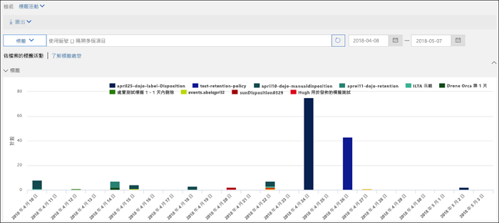

# 了解保留標籤Learn about retention labels

>*[Microsoft 365 安全性與合規性的授權指引](https://aka.ms/ComplianceSD)。**[Microsoft 365 licensing guidance for security & compliance](https://aka.ms/ComplianceSD).*

Across your organization, you probably have different types of content that require different actions taken on them in order to comply with industry regulations and internal policies.Across your organization, you probably have different types of content that require different actions taken on them in order to comply with industry regulations and internal policies. For example, you might have:For example, you might have:
  
- 至少必須**保留**一小段時間的稅務表單。Tax forms that need to be **retained** for a minimum period of time. 
    
- 到達特定年限之後需要**永久刪除**的新聞材料。Press materials that need to be **permanently deleted** when they reach a certain age. 
    
- 需要先**保留**之然後再**永久刪除**的競爭力研究。Competitive research that needs to be both **retained** and then **permanently deleted**. 
    
- 必須**標示為記錄**使之無法編輯或刪除的工作簽證。Work visas that must be **marked as a record** so that they can't be edited or deleted. 
    
In all of these cases, retention labels can help you take the right actions on the right content.In all of these cases, retention labels can help you take the right actions on the right content. With retention labels, you can classify data across your organization for governance, and enforce retention rules based on that classification.With retention labels, you can classify data across your organization for governance, and enforce retention rules based on that classification.
  
使用保留標籤，您可以：With retention labels, you can:
  
- **Enable people in your organization to apply a retention label manually** to content in Outlook on the web, Outlook 2010 and later, OneDrive, SharePoint, and Microsoft 365 Groups.**Enable people in your organization to apply a retention label manually** to content in Outlook on the web, Outlook 2010 and later, OneDrive, SharePoint, and Microsoft 365 Groups. Users often know best what type of content they're working with, so they can classify it and have the appropriate policy applied.Users often know best what type of content they're working with, so they can classify it and have the appropriate policy applied. 
    
- 在當內容符合特定條件時**自動將保留標籤套用到內容**，例如內容包含：**Apply retention labels to content automatically** if it matches specific conditions, such as when the content contains: 
    
    - 特定類型的敏感資訊。Specific types of sensitive information.
    
    - 特定關鍵字符合您建立的查詢。Specific keywords that match a query you create.
    
    - 可訓練分類器的模式比對。Pattern matches for a trainable classifier.
    
  自動將保留標籤套用到內容很重要，因為：The ability to apply retention labels to content automatically is important because:
    
     - 您不需要訓練您的使用者記下所有分類。You don't need to train your users on all of your classifications.
    
     - 您不需要仰賴使用者正確地將所有內容分類。You don't need to rely on users to classify all content correctly.
    
   - 使用者不再需要了解資料控管原則，就可以專心工作。Users no longer need to know about data governance policies - they can instead focus on their work.

- **將預設保留標籤套用至 SharePoint 中的文件庫、資料夾或文件集**，以便儲存在該位置中的所有文件都繼承預設保留標籤。**Apply a default retention label to a document library, folder, or document set** in SharePoint, so that all documents that are stored in that location inherit the default retention label.

此外，保留標籤支援跨 Microsoft 365 應用程式和服務的電子郵件和文件[記錄管理](records-management.md)。Additionally, retention labels support [records management](records-management.md) for email and documents across Microsoft 365 apps and services. 您可以使用保留標籤將內容分類為記錄。You can use a retention label to classify content as a record. 如果您這麼做，且內容仍然在 Microsoft 365 中時，將無法變更或移除標籤，也無法編輯或刪除相關內容。When this happens and the content remains in Microsoft 365, the label can't be changed or removed, and the content can't be edited or deleted. 

與[敏感度標籤](sensitivity-labels.md)不同，如果內容是移至 Microsoft 365 以外的位置，保留標籤不會保留。Retention labels, unlike [sensitivity labels](sensitivity-labels.md), do not persist if the content is moved outside Microsoft 365.

針對租用戶支援的保留標籤數量沒有任何限制。There is no limit to the number of retention labels that are supported for a tenant. 不過，10,000 個是針對租用戶支援的原則數目上限，其中包括會套用標籤 (保留標籤原則和自動套用保留原則) 的原則，以及保留原則。However, 10,000 is the maximum number of policies that are supported for a tenant and these include the policies that apply the labels (retention label policies and auto-apply retention policies), as well as retention policies.

## 保留標籤如何搭配保留標籤原則使用How retention labels work with retention label policies

讓保留標籤可供您組織中的人員使用，使得他們能夠分類內容，需要完成兩個步驟的程序：Making retention labels available to people in your organization so that they can classify content is a two-step process: 

1. 建立保留標籤Create the retention labels

2. 使用保留標籤原則來發佈保留標籤Publish the retention labels by using a retention label policy
  

  
保留標籤是由一或多個保留標籤原則所包含之可重複使用的獨立建構元素。Retention labels are independent, reusable building blocks that are included in one or more retention label policies. 保留標籤原則的主要目的是將一組保留標籤分組，以及指定您想讓這些標籤出現的目標位置。The primary purpose of a retention label policy is to group a set of retention labels and specify the locations where you want those labels to appear.
  

  
1. 當您發佈保留標籤時，會將它們納入保留標籤原則。When you publish retention labels, they're included in a retention label policy. 保留標籤名稱是不可改變的，表示在建立之後無法編輯它們。Retention label names are immutable, which means that they cannot be edited after they're created.

2. 單一保留標籤可納入多個保留標籤原則。A single retention label can be included in many retention label policies.

3. 單一位置也可納入多個保留標籤原則。A single location can also be included in many retention label policies.
    
3. 保留標籤原則會指定要發佈保留標籤的位置。Retention label policies specify the locations to publish the retention labels.
    
## 一次只能有一個保留標籤Only one retention label at a time

請務必了解，電子郵件或文件等內容一次只能指派一個保留標籤：It's important to know that content like an email or document can have only a single retention label assigned to it at a time:
  
- 針對使用者手動指派的保留標籤，使用者可以移除或變更獲指派的保留標籤。For retention labels assigned manually by end users, people can remove or change the retention label that's assigned.
    
- 如果內容有指派自動套用的標籤，使用者可以手動指派保留標籤來取代自動套用的標籤。If content has an auto-apply label assigned, an auto-apply label can be replaced by a retention label assigned manually by an end user.
    
- 如果內容有使用者手動指派的保留標籤，則自動套用標籤無法取代手動指派的保留標籤。If content has a retention label assigned manually by an end user, an auto-apply label cannot replace the manually assigned retention label.
    
- 如果有多項規則會指派自動套用標籤，且內容符合多項規則的條件，則會指派最舊規則的保留標籤。If there are multiple rules that assign an auto-apply label and content meets the conditions of multiple rules, the retention label for the oldest rule is assigned.
    
若要了解如何以及為何套用某個保留標籤 (而非其他標籤)，請務必了解明確指派標籤與隱含指派標籤之間的差異：To understand how and why one retention label is applied rather than another, it's helpful to understand the difference between explicitly assign a label, and implicitly assigned a label:

- 手動指派的標籤為明確指派Manually assigned labels are explicitly assigned
- 自動套用的標籤為隱含指派Automatically applied labels are implicitly assigned

明確指派的保留標籤會優先於隱式指派的保留標籤。An explicitly assigned retention label takes precedence over an implicitly assigned retention label. 如需詳細資訊，請參閱此頁面上的[原則保留或何者優先？](#the-principles-of-retention-or-what-takes-precedence)一節。For more information, see the [The principles of retention, or what takes precedence?](#the-principles-of-retention-or-what-takes-precedence) section on this page.

## 保留標籤原則與位置Retention label policies and locations

可以將不同類型的保留標籤發佈到不同的位置，視保留標籤的功能而定。Different types of retention labels can be published to different locations, depending on what the retention label does.
  
|**如果保留標籤是...****If the retention label is…**|**則標籤原則可套用至...****Then the label policy can be applied to…**|
|:-----|:-----|
|發佈給使用者Published to end users    |Exchange、SharePoint、OneDrive、Microsoft 365 群組Exchange, SharePoint, OneDrive, Microsoft 365 Groups    |
|根據敏感資訊類型而自動套用Auto-applied based on sensitive information types    |Exchange (僅限所有信箱)、SharePoint、OneDriveExchange (all mailboxes only), SharePoint, OneDrive    |
|根據查詢而自動套用Auto-applied based on a query    |Exchange、SharePoint、OneDrive、Microsoft 365 群組Exchange, SharePoint, OneDrive, Microsoft 365 Groups    |
   
在 Exchange 中，您只能在新傳送的郵件 (傳輸中的資料) 上自動套用保留標籤功能 (適用於查詢和敏感性資訊類型)，而非目前在信箱中的所有郵件 (待用資料)。In Exchange, auto-apply retention labels (for both queries and sensitive information types) are applied only to messages newly sent (data in transit), not to all items currently in the mailbox (data at rest). 此外，您只能在所有信箱中為敏感性資訊類型自動套用保留標籤功能，但無法選取特定信箱。Also, auto-apply retention labels for sensitive information types can apply only to all mailboxes; you can't select the specific mailboxes.
  
Exchange 公用資料夾、Skype 和 Teams 頻道訊息和聊天不支援保留標籤。Exchange public folders, Skype, and Teams channel messages and chats do not support retention labels.

## 保留標籤如何強制保留How retention labels enforce retention

保留標籤可強制執行與保留原則可執行的相同動作，即保留然後刪除、僅保留或僅刪除。Retention labels can enforce the same retention actions that a retention policy can - retain and then delete, or retain-only, or delete-only. 您可以使用保留標籤來執行複雜的檔案規劃，以識別具有不同保留設定的特定檔案。You can use retention labels to implement a sophisticated file plan that identifies specific files for different retention settings. 如需保留運作方式的詳細資訊，請參閱[了解保留原則](retention-policies.md)。For more information about how retention works, see [Learn about retention policies](retention-policies.md).

In addition, a retention label has two retention options that are available only in a retention label and not in a retention policy.In addition, a retention label has two retention options that are available only in a retention label and not in a retention policy. With a retention label, you can:With a retention label, you can:
  
- 在保留期間結束時觸發處置檢閱，如此一來，必須先檢閱 SharePoint 和 OneDrive 文件，才能將它們刪除。Trigger a disposition review at the end of the retention period, so that SharePoint and OneDrive documents must be reviewed before they can be deleted. 如需詳細資訊，請參閱[處置檢閱](disposition.md#disposition-reviews)。For more information, see [Disposition reviews](disposition.md#disposition-reviews).
    
- 保留期間是從內容套用標籤時開始計算，而不是內容的壽命或上次修改時間。Start the retention period from when the content was labeled, instead of the age of the content or when it was last modified. 當您使用這個選項時：When you use this option:
    - 它僅會套用到 SharePoint 網站和 OneDrive 帳戶中的內容。It applies only to content in SharePoint sites and OneDrive accounts. 針對 Exchange 電子郵件，保留期間一律會取決於傳送或接收郵件的日期。For Exchange email, the retention period is always based on the date when the message was sent or received.
    - 儲存標籤後，無法變更保留期間。You can't change the retention period after the label is saved.
    

另一個重要的差異是，當您在 SharePoint 中將保留標籤而非保留原則套用至檔案，且標籤設定為保留內容時，使用者將無法在強制執行保留期間時刪除檔案。Another important difference is that when you apply a retention label rather than a retention policy to files in SharePoint, and the label is configured to retain content, users can't delete the file while the retention period is enforced. 當您將相同標籤套用至 OneDrive 中的檔案和電子郵件時，使用者可以刪除內容，除非標籤將內容標示為記錄。Users can delete content when the same label is applied to files in OneDrive and to emails, unless the label marks the content as a record.

## 可以向使用者顯示已發佈保留標籤的位置Where published retention labels can appear to end users

如果保留標籤將由使用者指派給內容，您可以將它發佈到：If your retention label will be assigned to content by end users, you can publish it to:
  
- Outlook 和 Outlook 網頁版Outlook and Outlook on the web
    
- OneDriveOneDrive
    
- SharePointSharePoint
    
- Microsoft 365 群組 (Outlook 網頁版中的群組網站和群組信箱)Microsoft 365 groups (both the group site and group mailbox in Outlook on the web)
    
以下各節說明標籤在不同應用程式中向組織內人員顯示的方式。The sections that follow explain how labels appear in different apps to people in your organization.
  

### OutlookOutlook

若要在 Outlook 電腦版用戶端套用標籤到項目，請選取該項目。To label an item in the Outlook desktop client, select the item. 在功能區的 [常用]\*\*\*\* 索引標籤上，按一下 [指派原則]\*\*\*\*，然後選擇保留標籤。On the **Home** tab on the ribbon, click **Assign Policy**, and then choose the retention label. 
  

  
您也能夠以滑鼠右鍵按一下該項目，按一下操作功能表中的 [指派原則]\*\*\*\*，然後選擇保留標籤。You can also right-click an item, click **Assign Policy** in the context menu, and then choose the retention label. 

套用保留標籤後，您可以在項目頂端檢視該保留標籤以及所採取的動作。After the retention label is applied, you can view that retention label and what action it takes at the top of the item. 如果電子郵件已套用具有相關聯保留期間的保留標籤，您可以快速查看電子郵件的到期日。If an email has a retention label applied that has an associated retention period, you can see at a glance when the email expires.
  
您也可以將保留標籤套用到資料夾，在此情況下：You can also apply retention labels to folders, in which case:
  
- 資料夾中的所有項目會自動套用相同的保留標籤，但先前已明確套用保留標籤的項目**除外**。All items in the folder automatically get the same retention label, **except** for items that have had a retention label applied explicitly to them. 明確套用標籤的項目會保有現有的保留標籤。Explicitly labeled items keep their existing retention label. 如需詳細資訊，請參閱此頁面上的[原則保留或何者優先？](#the-principles-of-retention-or-what-takes-precedence)一節。For more information, see [The principles of retention, or what takes precedence?](#the-principles-of-retention-or-what-takes-precedence) section on this page. 
    
- 如果您變更或移除資料夾的預設保留標籤，資料夾中的所有項目也會變更或移除該保留標籤，明確指派保留標籤的項目**除外**。If you change or remove the default retention label for a folder, the retention label's also changed or removed for all items in the folder, **except** items with explicitly assigned retention labels. 
    
- 如果您將有預設保留標籤的項目從某個資料夾移到另一個具有不同預設保留標籤的資料夾，該項目就會套用新的預設保留標籤。If you move an item with a default retention label from one folder to another folder with a different default retention label, the item gets the new default retention label.
    
- 如果您將有預設保留標籤的項目從某個資料夾移到另一個沒有不同預設保留標籤的資料夾，就會移除舊的預設保留標籤。If you move an item with a default retention label from one folder to another folder with no default retention label, the old default retention label is removed.

### Outlook 網頁版Outlook on the web

若要在 Outlook 網頁版中的項目加上標籤，以滑鼠右鍵按一下該項目 \>[指派原則]\*\*\*\* \> 選擇保留標籤。To label an item in Outlook on the web, right-click the item \> **Assign policy** \> choose the retention label. 
  

  
After the retention label is applied, you can view that retention label and what action it takes at the top of the item.After the retention label is applied, you can view that retention label and what action it takes at the top of the item. If an email is classified and has an associated retention period, you can know at a glance when the email will expire.If an email is classified and has an associated retention period, you can know at a glance when the email will expire.
  

  
使用 Outlook 網頁版時，您也可以將保留標籤套用至資料夾。As with Outlook on the web, you can also apply retention labels to folders. 

### OneDrive 和 SharePointOneDrive and SharePoint

若要為 OneDrive 或 SharePoint 中的文件 (包括 OneNote 檔案) 加上標籤，請選取右上角的項目 \>、選擇 [開啟詳細資料窗格]\*\*\*\*![[資訊窗格] 圖示](../media/50b6d51b-92b4-4c5f-bb4b-4ca2d4aa3d04.png) \>[套用保留標籤]\*\*\*\* \>，然後選擇保留標籤。To label a document (including OneNote files) in OneDrive or SharePoint, select the item \> in the upper-right corner, choose **Open the details pane** \> **Apply retention label** \> choose the retention label. 
  
您也可以將保留標籤套用至資料夾或數個文件，且可以[為文件庫設定預設保留標籤](#applying-a-default-retention-label-to-all-content-in-a-sharepoint-library-folder-or-document-set)。You can also apply a retention label to a folder or document set, and you can set a [default retention label for a document library](#applying-a-default-retention-label-to-all-content-in-a-sharepoint-library-folder-or-document-set).
  

  
將保留標籤套用到項目之後，您可以選取項目，並在詳細資料窗格中檢視標籤。After a retention label is applied to an item, you can view it in the details pane when that item's selected.
  

  
針對 SharePoint (而不是 OneDrive)，您可以建立包含 [標籤]\*\*\*\* 欄或 [項目為記錄]\*\*\*\* 欄的文件庫檢視。For SharePoint, but not OneDrive, you can create a view of the library that contains the **Labels** column or **Item is a Record** column. 此檢視可讓您快速查看指派給所有項目的保留標籤，以及記錄的項目。This view lets you see at a glance the retention labels assigned to all items and which items are records. 不過，請注意，您無法依 [項目為記錄]\*\*\*\* 欄來篩選檢視。Note, however, that you can't filter the view by the **Item is a Record** column. 如需如何新增欄的相關指示，請參閱[顯示或隱藏清單或文件庫中的欄](https://support.microsoft.com/zh-TW/office/show-or-hide-columns-in-a-list-or-library-b820db0d-9e3e-4ff9-8b8b-0b2dbefa87e2)。For instructions how to add columns, see [Show or hide columns in a list or library](https://support.microsoft.com/zh-TW/office/show-or-hide-columns-in-a-list-or-library-b820db0d-9e3e-4ff9-8b8b-0b2dbefa87e2).

### Microsoft 365 群組Microsoft 365 groups

將保留標籤發佈到 Microsoft 365 群組 ([先前稱為 Office 365 群組](https://techcommunity.microsoft.com/t5/microsoft-365-blog/office-365-groups-will-become-microsoft-365-groups/ba-p/1303601)) 時，保留標籤會同時顯示在群組網站和 Outlook 網頁版的群組信箱中。When you publish retention labels to Microsoft 365 groups ([formerly Office 365 groups](https://techcommunity.microsoft.com/t5/microsoft-365-blog/office-365-groups-will-become-microsoft-365-groups/ba-p/1303601)), the retention labels appear in both the group site and group mailbox in Outlook on the web. 將保留標籤套用至內容的程序，與套用至電子郵件和文件的程序相同。The experience of applying a retention label to content is identical to that for email and documents.

若要保留 Microsoft 365 群組的內容，請使用 **Office 365 群組**位置。To retain content for a Microsoft 365 group, use the **Office 365 groups** location. 即使 Microsoft 365 群組有 Exchange 信箱，包含整個 Exchange 位置的保留原則並不會包含 Microsoft 365 群組信箱中的內容。Even though a Microsoft 365 group has an Exchange mailbox, a retention policy that includes the entire Exchange location won't include content in Microsoft 365 group mailboxes.

此外，無法使用 Exchange 位置來包含或排除特定群組信箱。In addition, it's not possible to use the Exchange location to include or exclude a specific group mailbox. 雖然 Exchange 位置最初允許選取群組信箱，但是當您嘗試儲存保留原則時，您會收到 "RemoteGroupMailbox" 不是Exchange 位置的有效選項錯誤訊息。Although the Exchange location initially allows a group mailbox to be selected, when you try to save the retention policy, you receive an error that "RemoteGroupMailbox" is not a valid selection for the Exchange location.
  
首先，建立並設定您要提供應用程式和其他服務使用的敏感度標籤。First, create and configure the sensitivity labels that you want to make available for apps and other services. 例如，您希望使用者從 Office 應用程式看到和套用的標籤。For example, the labels you want users to see and apply from Office apps. 

然後，建立一或多個包含您所設定的標籤和原則設定的標籤原則。Then, create one or more label policies that contain the labels and policy settings that you configure. 這是為您所選的使用者和位置發佈標籤和設定的標籤原則。It's the label policy that publishes the labels and settings for your chosen users and locations.

## 根據條件自動套用保留標籤Applying a retention label automatically based on conditions

保留標籤最實用的功能之一，是將標籤自動套用至符合特定條件的內容。One of the most powerful features of retention labels is the ability to apply them automatically to content that matches certain conditions. 在此情況下，貴組織中的人員不必親自套用保留標籤。In this case, people in your organization don't need to apply the retention labels. Microsoft 365 會執行這些動作。Microsoft 365 does the work for them.
  

  
自動套用保留標籤很強大是因為：Auto-applying retention labels are powerful because:
  
- 您不需要訓練您的使用者記下所有分類。You don't need to train your users on all of your classifications.
    
- 您不需要仰賴使用者正確地將所有內容分類。You don't need to rely on users to classify all content correctly.
    
- 使用者不再需要了解資料控管原則，他們可以專心工作。Users no longer need to know about data governance policies - they can focus on their work.
    
您可以選擇當內容包含以下資訊時，自動將保留標籤套用到內容：You can choose to apply retention labels to content automatically when that content contains:
  
- [特定敏感資訊類型Specific types of sensitive information](create-retention-labels.md#auto-apply-labels-to-content-with-specific-types-of-sensitive-information)
    
- [符合您所建立查詢的特定關鍵字Specific keywords that match a query you create](create-retention-labels.md#auto-apply-labels-to-content-with-keywords-or-searchable-properties)

- [可訓練分類器的符合項目A match for trainable classifiers](create-retention-labels.md#auto-apply-labels-to-content-by-using-trainable-classifiers)
    

> [!TIP]
> 請參閱[管理具有保留標籤之 SharePoint 文件的生命週期](auto-apply-retention-labels-scenario.md)，以了解使用 SharePoint 中受管理屬性來自動套用保留標籤和實作事件導向保留的詳細案例。See [Manage the lifecycle of SharePoint documents with retention labels](auto-apply-retention-labels-scenario.md) for a detailed scenario about using managed properties in SharePoint to auto-apply retention labels and implement event-driven retention.

## 將預設保留標籤套用至 SharePoint 文件庫、資料夾或文件集中的所有內容Applying a default retention label to all content in a SharePoint library, folder, or document set

除了讓使用者將保留標籤套用至個別文件，您也可以將預設保留標籤套用到 SharePoint 文件庫、資料夾或文件集，讓該位置的所有文件套用預設保留標籤。In addition to enabling people to apply a retention label to individual documents, you can also apply a default retention label to a SharePoint library, folder, or document set, so that all documents in that location get the default retention label.
  
若為文件庫，您可以在文件庫的 **[文件庫設定]** 頁面中進行這個動作。For a document library, this is done on the **Library settings** page for a document library. 當您選擇預設保留標籤時，也可以選擇將該標籤套用至文件庫中的現有項目。When you choose the default retention label, you can also choose to apply it to existing items in the library. 
  
例如，如果您有一個行銷資料的標籤，而且您知道某個文件庫只包含這個類型的內容，就能將「行銷資料」標籤設為該文件庫中所有文件的預設標籤。For example, if you have a tag for marketing materials, and you know a specific document library contains only that type of content, you can make the Marketing Materials tag the default for all documents in that library.
  

  
如果將預設保留標籤套用到文件庫、資料夾或文件集中的現有項目：If you apply a default retention label to existing items in the library, folder, or document set:
  
- 文件庫、資料夾或文件集中的所有項目會自動套用相同的保留標籤，但先前已明確套用保留標籤的項目「除外」\*\*\*\* (例如記錄)。All items in the library, folder, or document set automatically get the same retention label, **except** for items that have had a retention label applied explicitly to them (such as records). 已明確套用標籤的項目會保留現有的標籤。Explicitly labeled items keep their existing label. 如需詳細資訊，請參閱下節的[原則保留或何者優先](#the-principles-of-retention-or-what-takes-precedence)。For more information, see the below section on [The principles of retention, or what takes precedence](#the-principles-of-retention-or-what-takes-precedence).
    
- 如果您變更或移除文件庫、資料夾或文件集的預設保留標籤，文件庫、資料夾或文件集中的所有項目也會變更或移除該保留標籤，「除了」明確套用保留標籤的項目\*\*\*\* (例如記錄)。If you change or remove the default retention label for a library, folder, or document set, the retention label is also changed or removed for all items in the library, folder, or document set, **except** items with explicit retention labels (such as records).
    
- 如果將有預設保留標籤的項目從一個網站集合、文件庫、資料夾或文件集移到另一個具有不同標籤的網站集合、文件庫、資料夾或文件集，該項目會保留現有的保留標籤，即使新位置有不同的預設保留標籤。If you move an item with a default retention label from one site collection, library, folder, or document set to another site collection, library, folder, or document set that has a different label, the item keeps its existing default retention label, even if the new location has a different default retention label. 如果項目在移動前沒有標籤，則會使用新位置的預設保留標籤。If the item does not have a label before moving, it will take on the default retention label of the new location.

**記錄：** 如果您將預設記錄標籤套用至文件庫、資料夾或文件集，則會將記錄標籤套用到這些位置中的所有個別項目。**Records:** If you apply a default record label to a library, folder, or document set, then a record label is applied to all the individual items within those locations. 當您將新項目移至含有記錄標籤的位置時，該項目會標籤為記錄。When you move a new item into a location with a record label, that item is labeled a record. 不過，如果您將預設保留標籤變更為不將內容宣告為記錄的標籤，該動作「不會」移除個別項目的記錄標籤；這些項目會保留自己的記錄標籤。However, if you change the default retention label to a label that doesn't declare content as a record, that action does not remove the record label from the individual items; those items retain their record label. 只有網站集合系統管理員能明確移除或變更記錄項目的保留標籤。Only a site collection admin can explicitly remove or change the retention label of record items.

如需將內容宣告為記錄之保留標籤的詳細資訊，請參閱[了解記錄](records.md)。For more information about retention labels that declare content as a record, see [Learn about records](records.md).

## 使用規則將保留標籤套用至電子郵件Applying a retention label to email by using rules

在 Outlook 中，您可以建立規則來套用保留標籤或保留原則。In Outlook, you can create rules to apply a retention label or retention policy.
  
例如，您可以建立規則來將特定保留標籤套用到傳送至或接收自特定通訊群組的所有郵件。For example, you can create a rule that applies a specific retention label to all messages sent to or from a specific distribution group.
  
若要建立規則，以滑鼠右鍵按一下項目\> [規則]\*\*\*\* \> [建立規則]\*\*\*\* \> [進階選項]\*\*\*\* \> [規則精靈]\*\*\*\* \> [套用保留原則]\*\*\*\*。To create a rule, right-click an item \> **Rules** \> **Create Rule** \> **Advanced Options** \> **Rules Wizard** \> **apply retention policy**.
  

  
## 將內容分類而不套用任何動作Classifying content without applying any actions

您可以在建立保留標籤時將內容分類，而不關閉任何保留或進行其他動作。When you create a retention label, you can do so without turning on any retention or other actions. 在此情況下，您可以使用保留標籤當做文字標籤，而不強制執行任何動作。In this case, you can use a retention label simply as a text label, without enforcing any actions.
  
例如，您可以建立不帶任何動作、名為「稍後檢閱」的保留標籤，然後將此保留標籤自動套用到包含敏感資訊類型或查詢內容的內容。For example, you can create a retention label named "Review later" with no actions, and then auto-apply that retention label to content with sensitive information types or queried content.
  

  
## 將保留標籤用於記錄管理Using retention labels for records management
    
您可以使用保留標籤將內容宣告為記錄。You can use retention labels to declare content as a record. 這可以讓您在 Microsoft 365 中實作單一、一致的記錄管理策略。This lets you implement a single, consistent records-management strategy across Microsoft 365. 如需詳細資訊，請參閱[了解記錄](records.md)。For more information, see [Learn about records](records.md).
  
## 使用保留標籤作為 DLP 原則的條件Using a retention label as a condition in a DLP policy

A retention label can enforce retention actions on content.A retention label can enforce retention actions on content. In addition, you can use a retention label as a condition in a data loss prevention (DLP) policy, and the DLP policy can enforce other actions, such as restricting access, on content that contains a specific label.In addition, you can use a retention label as a condition in a data loss prevention (DLP) policy, and the DLP policy can enforce other actions, such as restricting access, on content that contains a specific label. 
  
如需詳細資訊，請參閱[使用保留標籤做為 DLP 原則中的條件](data-loss-prevention-policies.md#using-a-retention-label-as-a-condition-in-a-dlp-policy)。For more information, see [Using a retention label as a condition in a DLP policy](data-loss-prevention-policies.md#using-a-retention-label-as-a-condition-in-a-dlp-policy).
  

## 原則保留或何者優先The principles of retention, or what takes precedence?

It's possible or even likely that content might have several retention policies applied to it, each with a different action (retain, delete, or both) and retention period.It's possible or even likely that content might have several retention policies applied to it, each with a different action (retain, delete, or both) and retention period. What takes precedence?What takes precedence? At the highest level, rest assured that content being retained by one policy can't be permanently deleted by another policy.At the highest level, rest assured that content being retained by one policy can't be permanently deleted by another policy.
  

  
若要了解不同標籤的保留動作如何套用至內容，請記住以下保留原則：To understand how different labels with retention actions are applied to content, keep these principles of retention in mind:
  
1. **Retention wins over deletion.****Retention wins over deletion.** Suppose that one retention policy says to delete Exchange email after three years, but another retention policy says to retain Exchange email for five years and then delete it.Suppose that one retention policy says to delete Exchange email after three years, but another retention policy says to retain Exchange email for five years and then delete it. Any content that reaches three years old will be deleted and hidden from the users' view, but still retained in the Recoverable Items folder until the content reaches five years old, when it will be permanently deleted.Any content that reaches three years old will be deleted and hidden from the users' view, but still retained in the Recoverable Items folder until the content reaches five years old, when it will be permanently deleted. 
    
2. **The longest retention period wins.****The longest retention period wins.** If content's subject to multiple policies that retain content, it will be retained until the end of the longest retention period.If content's subject to multiple policies that retain content, it will be retained until the end of the longest retention period. 
    
3. **Explicit inclusion wins over implicit inclusion.****Explicit inclusion wins over implicit inclusion.** This means:This means: 
    
    1. 如果包含保留設定的保留標籤是由使用者手動指派至項目 (例如 Exchange 電子郵件或 OneDrive 文件)，則該保留標籤會優先於在網站或信箱層級指派的原則，以及文件庫指派的預設保留標籤。If a retention label with retention settings is manually assigned by a user to an item, such as an Exchange email or OneDrive document, that retention label takes precedence over both a policy assigned at the site or mailbox level and a default retention label assigned by the document library. 例如，如果明確保留標籤會保留 10 年，但網站指派的保留原則只會保留 5 年，則保留標籤會優先於原則。For example, if the explicit retention label says to retain for 10 years, but the retention policy assigned to the site says to retain for only five years, the retention label takes precedence. 自動套用保留標籤會被視為隱含，而不是明確，因為這類標籤是由 Microsoft 365 自動套用。Auto-applied retention labels are considered implicit, not explicit, because they're applied automatically by Microsoft 365.
    
    2. 如果保留原則包含特定位置 (例如特定使用者的信箱或 OneDrive 帳戶)，則該原則會優先於其他套用至所有使用者信箱或 OneDrive 帳戶但未特地包含該使用者信箱的保留原則。If a retention policy includes a specific location, such as a specific user's mailbox or OneDrive account, that policy takes precedence over another retention policy that applies to all users' mailboxes or OneDrive accounts but doesn't specifically include that user's mailbox.
    
4. **The shortest deletion period wins.****The shortest deletion period wins.** Similarly, if content's subject to multiple policies that delete content (with no retention), it will be deleted at the end of the shortest retention period.Similarly, if content's subject to multiple policies that delete content (with no retention), it will be deleted at the end of the shortest retention period. 
    
了解保留原則從上到下的仲裁流程：如果所有原則或標籤套用的規則都在同一個層級，則流程會移到下一個層級來決定套用規則的優先順序。Understand that the principles of retention work as a tie-breaking flow from top to bottom: If the rules applied by all policies or labels are the same at one level, the flow moves down to the next level to determine precedence for which rule is applied.
  
最終，保留原則或保留標籤無法永久刪除任何電子文件探索保留的內容。Finally, a retention policy or retention label cannot permanently delete any content that's on hold for eDiscovery. 將保留釋出時，該內容會再次符合上述的清理程序資格。When the hold is released, the content again becomes eligible for the cleanup process described above.

### 使用可訓練分類器自動加上標籤的優先順序Precedence for auto-labeling with trainable classifiers

系統會同時評估所有針對可訓練分類器設定的保留標籤。All retention labels that are configured for trainable classifiers are evaluated simultaneously. 如果有多個可訓練分類器偵測到某個項目，則會使用下列準則來決定要套用哪個保留標籤：If an item is detected by more than one trainable classifier, the following criteria is used to determine which retention label to apply:

1. 設定為僅限保留或保留後刪除的保留標籤，優先順序高於設定為僅限刪除的保留標籤。Retention labels configured for retain-only or retain and then delete have a higher priority over retention labels that are configured for delete-only.

2. 針對設定為僅限保留或保留後刪除的保留標籤，保留標籤設定為最長保留期間的優先。For retention labels that are configured for retain-only or retain and then delete, the retention label that is configured for the longest retention period wins.

3. 針對設定為僅限刪除的保留標籤，設定為最短期間的保留標籤優先。For retention labels that are configured for delete-only, the retention label that has been configured for the shortest period wins.

4. 相同動作和相同期間的保留標籤會導致保留標籤的選取不具有決定性。Retention labels with the same action and the same period result in a retention label selection that is non-deterministic.

## 監控保留標籤Monitor retention labels

您發佈或自動套用保留標籤之後，您將要驗證它們是否如預期般套用至內容。After you publish or auto-apply your retention labels, you'll want to verify that they're being applied to content as you intended. 若要監控保留標籤：To monitor your retention labels:
  
- **標籤活動總管**。**Label Activity Explorer**. 您可以使用總管 (如下圖中的範例所示) 來快速搜尋和檢視在過去 30 天內，SharePoint 和 OneDrive 所有內容的保留標籤活動。With the explorer (example in the next picture), you can quickly search and view retention label activity for all content across SharePoint and OneDrive over the past 30 days. 如需詳細資訊，請參閱[檢視文件的標籤活動](view-label-activity-for-documents.md)。For more information, see [View label activity for documents](view-label-activity-for-documents.md).

- [標籤分析]\*\*\*\* 頁面。**Label analytics** page. 在 Microsoft 365 合規性中心和 Microsoft 365 安全性中心中，您可以快速檢視最常使用的保留標籤和套用標籤的位置。In the Microsoft 365 compliance center and Microsoft 365 security center, you can quickly view your top retention labels and where they're applied. 您也可以檢視具有特定保留標籤的所有內容。You can also view all content with a specific retention label. 如需詳細資訊，請參閱[利用標籤分析檢視標籤使用量](label-analytics.md)。For more information, see [View label usage with label analytics](label-analytics.md).
    
- **資料控管報告**。**Data governance reports**. 您可以使用這些報告來快速檢視 Exchange、SharePoint 和 OneDrive 在過去 90 天內所有內容的保留標籤趨勢和活動。With these reports, you can quickly view retention label trends and activity for all content across Exchange, SharePoint, and OneDrive over the past 90 days. 如需詳細資訊，請參閱[檢視資料控管報告](view-the-data-governance-reports.md)。For more information, see [View the data governance reports](view-the-data-governance-reports.md).
    

## 使用內容搜尋來尋找套用特定保留標籤的所有內容Using Content Search to find all content with a specific retention label applied to it

將保留標籤指派至內容後 (無論是由使用者指派或自動套用)，您可以使用「內容搜尋」，尋找以特定保留標籤分類的所有內容。After retention labels are assigned to content, either by users or auto-applied, you can use content search to find all content that's classified with a specific retention label.
  
當您建立內容搜尋時，請選擇 [合規性標籤]\*\*\*\* 條件，然後輸入完整的保留標籤名稱或是部分標籤名稱，再使用萬用字元。When you create a content search, choose the **Compliance Tag** condition, and then enter the complete retention label name or part of the label name and use a wildcard. 如需詳細資訊，請參閱[內容搜尋的關鍵字查詢和搜尋條件](keyword-queries-and-search-conditions.md)。For more information, see [Keyword queries and search conditions for Content Search](keyword-queries-and-search-conditions.md).
  

  
## 使用保留標籤，而非較舊的功能Use retention labels instead of older features

您可以輕鬆設定保留標籤供整個組織和其在 Microsoft 365 (包括 Exchange、SharePoint、OneDrive 和 Microsoft 365 群組) 中的內容使用。Retention labels can easily be made available to an entire organization and its content across Microsoft 365, including Exchange, SharePoint, OneDrive, and Microsoft 365 groups. 如果您需要保留或刪除內容，或管理 Microsoft 365 任何位置中的記錄，建議您使用保留標籤。If you need to retain or delete content, or manage records anywhere in Microsoft 365, we recommend that you use retention labels.
  
有一些之前用來保留或刪除內容或管理 Microsoft 365 中記錄的其他功能。There are several other features that have previously been used to retain or delete content or to manage records in Microsoft 365. 這些功能會隨著保留標籤繼續運作。These features will continue to work side by side with retention labels. 雖然有保留標籤實作與先前功能不同的實例，但是保留標籤的演進會促進 Microsoft 365 記錄管理的未來發展。While there are instances where the implementation of retention labels differs from previous features, the evolution of retention labels will drive the future of records management across Microsoft 365. 因此，針對資料控管，我們建議您之後使用保留標籤而非下列較舊的功能。Therefore, moving forward, for data governance, we recommend that you use retention labels instead of the following older features.
  
### Exchange OnlineExchange Online

- [保留標記和保留原則](https://go.microsoft.com/fwlink/?linkid=846125)，又稱為[通訊記錄管理 (MRM)](https://go.microsoft.com/fwlink/?linkid=846126) (僅刪除)[Retention tags and retention policies](https://go.microsoft.com/fwlink/?linkid=846125), also known as [messaging records management (MRM)](https://go.microsoft.com/fwlink/?linkid=846126) (deletion only) 
    
### SharePoint 和 OneDriveSharePoint and OneDrive

- [設定就地記錄管理](https://support.office.com/article/7707a878-780c-4be6-9cb0-9718ecde050a) (保留)[Configuring in place records management](https://support.office.com/article/7707a878-780c-4be6-9cb0-9718ecde050a) (retention) 
    
- [記錄中心簡介](https://support.office.com/article/bae6ca5a-7b19-40e0-b433-e3613a747c2c) (保留)[Introduction to the Records Center](https://support.office.com/article/bae6ca5a-7b19-40e0-b433-e3613a747c2c) (retention) 
    
- [資訊管理原則](intro-to-info-mgmt-policies.md) (僅刪除)[Information management policies](intro-to-info-mgmt-policies.md) (deletion only) 
    
## 後續步驟Next steps

如果您已準備好建立及發佈保留標籤，請參閱[建立、發佈和自動套用保留標籤](create-retention-labels.md)。If you are ready to create and publish retention labels, see [Create, publish, and auto-apply retention labels](create-retention-labels.md).
