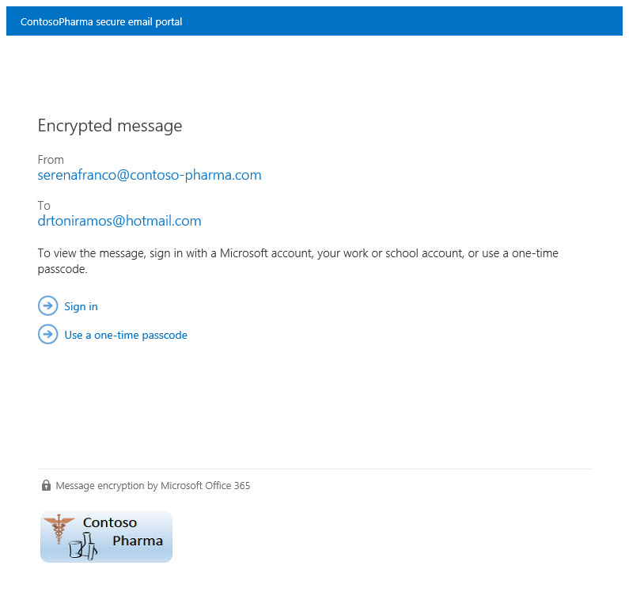

# <a name="legacy-information-for-office-365-message-encryption"></a><span data-ttu-id="20048-103">Office 365 郵件加密的舊版資訊</span><span class="sxs-lookup"><span data-stu-id="20048-103">Legacy information for Office 365 Message Encryption</span></span>

<span data-ttu-id="20048-104">如果您尚未將組織移至新的 OME 功能，但您已部署 OME，則本文中的資訊適用于您的組織。</span><span class="sxs-lookup"><span data-stu-id="20048-104">If you haven't yet moved your organization to the new OME capabilities, but you have already deployed OME, then the information in this article applies to your organization.</span></span> <span data-ttu-id="20048-105">Microsoft 建議您在組織合理的情況時，安排移至新的 OME 功能。</span><span class="sxs-lookup"><span data-stu-id="20048-105">Microsoft recommends that you make a plan to move to the new OME capabilities as soon as it is reasonable for your organization.</span></span> <span data-ttu-id="20048-106">如需相關指示，請參閱 [設定以 Azure 資訊保護為基礎的新 Office 365 郵件加密功能](set-up-new-message-encryption-capabilities.md)。</span><span class="sxs-lookup"><span data-stu-id="20048-106">For instructions, see [Set up new Office 365 Message Encryption capabilities built on top of Azure Information Protection](set-up-new-message-encryption-capabilities.md).</span></span> <span data-ttu-id="20048-107">如果您想要進一步瞭解新功能的運作方式，請參閱 [Office 365 Message Encryption](ome.md)。</span><span class="sxs-lookup"><span data-stu-id="20048-107">If you want to find out more about how the new capabilities work first, see [Office 365 Message Encryption](ome.md).</span></span> <span data-ttu-id="20048-108">本文的其餘部分是在發行新的 OME 功能之前，OME 行為。</span><span class="sxs-lookup"><span data-stu-id="20048-108">The rest of this article refers to OME behavior before the release of the new OME capabilities.</span></span>
  
<span data-ttu-id="20048-109">透過 Office 365 郵件加密，您的組織可以在組織內部和外部的人員之間傳送和接收加密的電子郵件。</span><span class="sxs-lookup"><span data-stu-id="20048-109">With Office 365 Message Encryption, your organization can send and receive encrypted email messages between people inside and outside your organization.</span></span> <span data-ttu-id="20048-110">Office 365 郵件加密可與 Outlook.com、Yahoo、Gmail 及其他電子郵件服務搭配使用。</span><span class="sxs-lookup"><span data-stu-id="20048-110">Office 365 Message Encryption works with Outlook.com, Yahoo, Gmail, and other email services.</span></span> <span data-ttu-id="20048-111">電子郵件加密可協助確保只有預定的收件者可以查看郵件內容。</span><span class="sxs-lookup"><span data-stu-id="20048-111">Email message encryption helps ensure that only intended recipients can view message content.</span></span>
  
<span data-ttu-id="20048-112">以下為一些範例：</span><span class="sxs-lookup"><span data-stu-id="20048-112">Here are some examples:</span></span>
  
- <span data-ttu-id="20048-113">銀行員工將信用卡對帳單傳送給客戶</span><span class="sxs-lookup"><span data-stu-id="20048-113">A bank employee sends credit card statements to customers</span></span>

- <span data-ttu-id="20048-114">保險業公司代表為客戶提供原則詳細資料</span><span class="sxs-lookup"><span data-stu-id="20048-114">An insurance company representative provides policy details to customers</span></span>

- <span data-ttu-id="20048-115">抵押經紀人要求來自客戶的貸款申請財務資訊</span><span class="sxs-lookup"><span data-stu-id="20048-115">A mortgage broker requests financial information from a customer for a loan application</span></span>

- <span data-ttu-id="20048-116">保健服務提供者將健康情況護理資訊傳送給患者</span><span class="sxs-lookup"><span data-stu-id="20048-116">A health care provider sends health care information to patients</span></span>

- <span data-ttu-id="20048-117">律師將機密資訊傳送給客戶或其他律師</span><span class="sxs-lookup"><span data-stu-id="20048-117">An attorney sends confidential information to a customer or another attorney</span></span>

## <a name="how-office-365-message-encryption-works-without-the-new-capabilities"></a><span data-ttu-id="20048-118">如何在未使用新功能的情況下運作 Office 365 郵件加密</span><span class="sxs-lookup"><span data-stu-id="20048-118">How Office 365 Message Encryption works without the new capabilities</span></span>

<span data-ttu-id="20048-119">Office 365 郵件加密是一種線上服務，可在 Microsoft Azure Rights Management (Azure RMS) 上建立。</span><span class="sxs-lookup"><span data-stu-id="20048-119">Office 365 Message Encryption is an online service that's built on Microsoft Azure Rights Management (Azure RMS).</span></span> <span data-ttu-id="20048-120">使用 Azure RMS 時，系統管理員可以定義郵件流程規則，以判斷加密的條件。</span><span class="sxs-lookup"><span data-stu-id="20048-120">With Azure RMS, administrators can define mail flow rules to determine the conditions for encryption.</span></span> <span data-ttu-id="20048-121">例如，規則可以要求所有寄給特定收件者的郵件加密。</span><span class="sxs-lookup"><span data-stu-id="20048-121">For example, a rule can require the encryption of all messages addressed to a specific recipient.</span></span>
  
<span data-ttu-id="20048-122">當某人在 Exchange Online 中傳送符合加密規則的電子郵件時，郵件會以 HTML 附件傳送。</span><span class="sxs-lookup"><span data-stu-id="20048-122">When someone sends an email message in Exchange Online that matches an encryption rule, the message is sent with an HTML attachment.</span></span> <span data-ttu-id="20048-123">收件者會開啟 HTML 附件，並遵循指示，在 Office 365 郵件加密入口網站上查看加密郵件。</span><span class="sxs-lookup"><span data-stu-id="20048-123">The recipient opens the HTML attachment and follows instructions to view the encrypted message on the Office 365 Message Encryption portal.</span></span> <span data-ttu-id="20048-124">收件者可以選擇透過與 Office 365 相關聯的 Microsoft 帳戶或工作或學校登入，或是使用一次性的傳遞碼來查看郵件。</span><span class="sxs-lookup"><span data-stu-id="20048-124">The recipient can choose to view the message by signing in with a Microsoft account or a work or school associated with Office 365, or by using a one-time pass code.</span></span> <span data-ttu-id="20048-125">這兩個選項可協助確保只有預定的收件者可以查看加密的郵件。</span><span class="sxs-lookup"><span data-stu-id="20048-125">Both options help ensure that only the intended recipient can view the encrypted message.</span></span> <span data-ttu-id="20048-126">此程式在新的 OME 功能上有很大的差異。</span><span class="sxs-lookup"><span data-stu-id="20048-126">This process is very different for the new OME capabilities.</span></span>
  
<span data-ttu-id="20048-127">下圖摘要說明透過加密和解密過程的電子郵件訊息。</span><span class="sxs-lookup"><span data-stu-id="20048-127">The following diagram summarizes the passage of an email message through the encryption and decryption process.</span></span>
  

  
<span data-ttu-id="20048-129">如需詳細資訊，請參閱 [舊版 Office 365 郵件加密的服務資訊，然後再發行新的 OME 功能](legacy-information-for-message-encryption.md#LegacyServiceInfo)。</span><span class="sxs-lookup"><span data-stu-id="20048-129">For more information, see [Service information for legacy Office 365 Message Encryption prior to the release of the new OME capabilities](legacy-information-for-message-encryption.md#LegacyServiceInfo).</span></span>
  
## <a name="defining-mail-flow-rules-for-office-365-message-encryption-that-dont-use-the-new-ome-capabilities"></a><span data-ttu-id="20048-130">定義不使用新 OME 功能之 Office 365 郵件加密的郵件流程規則</span><span class="sxs-lookup"><span data-stu-id="20048-130">Defining mail flow rules for Office 365 Message Encryption that don't use the new OME capabilities</span></span>

<span data-ttu-id="20048-131">若要在沒有新功能的情況下啟用 Office 365 郵件加密，Exchange Online 和 Exchange Online Protection 系統管理員會定義 Exchange 郵件流程規則。</span><span class="sxs-lookup"><span data-stu-id="20048-131">To enable Office 365 Message Encryption without the new capabilities, Exchange Online and Exchange Online Protection administrators define Exchange mail flow rules.</span></span> <span data-ttu-id="20048-132">這些規則會判斷應如何加密電子郵件，以及移除郵件加密的條件。</span><span class="sxs-lookup"><span data-stu-id="20048-132">These rules determine under what conditions email messages should be encrypted, as well as conditions for removing message encryption.</span></span> <span data-ttu-id="20048-133">為規則設定加密動作時，服務會對符合規則條件的任何郵件執行動作，然後再傳送郵件。</span><span class="sxs-lookup"><span data-stu-id="20048-133">When an encryption action is set for a rule, the service performs the action on any messages that match the rule conditions before sending the messages.</span></span>

<span data-ttu-id="20048-134">郵件流程規則是彈性的，可讓您結合條件，讓您在單一規則中符合特定的安全性需求。</span><span class="sxs-lookup"><span data-stu-id="20048-134">Mail flow rules are flexible, letting you combine conditions so you can meet specific security requirements in a single rule.</span></span> <span data-ttu-id="20048-135">例如，您可以建立規則來加密所有包含指定關鍵字的郵件，並將其寄給外部收件者。</span><span class="sxs-lookup"><span data-stu-id="20048-135">For example, you can create a rule to encrypt all messages that contain specified keywords and are addressed to external recipients.</span></span> <span data-ttu-id="20048-136">Office 365 郵件加密也會加密來自加密電子郵件收件者的回復，而且您可以建立規則來解密這些回復，以方便您的電子郵件使用者使用。</span><span class="sxs-lookup"><span data-stu-id="20048-136">Office 365 Message Encryption also encrypts replies from recipients of encrypted email, and you can create a rule that decrypts those replies as a convenience for your email users.</span></span> <span data-ttu-id="20048-137">如此一來，您組織中的使用者不需要登入加密入口網站來查看回復。</span><span class="sxs-lookup"><span data-stu-id="20048-137">That way, users in your organization won't have to sign in to the encryption portal to view replies.</span></span>
  
<span data-ttu-id="20048-138">如需如何建立 Exchange 郵件流程規則的相關資訊，請參閱 [Define rules For Office 365 Message Encryption](define-mail-flow-rules-to-encrypt-email.md)。</span><span class="sxs-lookup"><span data-stu-id="20048-138">For more information about how to create Exchange mail flow rules, see [Define Rules for Office 365 Message Encryption](define-mail-flow-rules-to-encrypt-email.md).</span></span>
  
### <a name="use-the-eac-to-create-a-mail-flow-rule-for-encrypting-email-messages-without-the-new-ome-capabilities"></a><span data-ttu-id="20048-139">使用 EAC 來建立郵件流程規則，以加密不含新 OME 功能的電子郵件</span><span class="sxs-lookup"><span data-stu-id="20048-139">Use the EAC to create a mail flow rule for encrypting email messages without the new OME capabilities</span></span>

1. <span data-ttu-id="20048-140">在網頁瀏覽器中，使用已被授與全域系統管理員許可權的公司或學校帳戶登 [入 Office 365](https://support.office.com/article/b9582171-fd1f-4284-9846-bdd72bb28426#ID0EAABAAA=Web_browser)。</span><span class="sxs-lookup"><span data-stu-id="20048-140">In a web browser, using a work or school account that has been granted global administrator permissions, [sign in to Office 365](https://support.office.com/article/b9582171-fd1f-4284-9846-bdd72bb28426#ID0EAABAAA=Web_browser).</span></span>

2. <span data-ttu-id="20048-141">選擇 [ **管理** ] 磚。</span><span class="sxs-lookup"><span data-stu-id="20048-141">Choose the **Admin** tile.</span></span>

3. <span data-ttu-id="20048-142">在 Microsoft 365 系統管理中心中，選擇 [系統 **管理中心**] [ \> **Exchange**]。</span><span class="sxs-lookup"><span data-stu-id="20048-142">In the Microsoft 365 admin center, choose **Admin centers** \> **Exchange**.</span></span>

4. <span data-ttu-id="20048-143">在 EAC 中，移至 [ **郵件流程** \> **規則** ]，然後選取 [ **新增** 新圖示] 以  \> **建立新的規則**。</span><span class="sxs-lookup"><span data-stu-id="20048-143">In the EAC, go to **Mail flow** \> **Rules** and select **New**  \> **Create a new rule**.</span></span> <span data-ttu-id="20048-144">如需使用 EAC 的詳細資訊，請參閱 exchange [Online 中的 exchange 系統管理中心](/exchange/exchange-admin-center)。</span><span class="sxs-lookup"><span data-stu-id="20048-144">For more information about using the EAC, see [Exchange admin center in Exchange Online](/exchange/exchange-admin-center).</span></span>

5. <span data-ttu-id="20048-145">在 [ **名稱**] 中，輸入規則的名稱，例如 [加密 DrToniRamos@hotmail.com 的郵件]。</span><span class="sxs-lookup"><span data-stu-id="20048-145">In **Name**, type a name for the rule, such as Encrypt mail for DrToniRamos@hotmail.com.</span></span>

6. <span data-ttu-id="20048-146">在 [套用 **此規則** ] 選取條件時，必要時輸入值。</span><span class="sxs-lookup"><span data-stu-id="20048-146">In **Apply this rule if** select a condition, and enter a value if necessary.</span></span> <span data-ttu-id="20048-147">例如，若要加密要 DrToniRamos@hotmail.com 的郵件：</span><span class="sxs-lookup"><span data-stu-id="20048-147">For example, to encrypt messages going to DrToniRamos@hotmail.com:</span></span>

   1. <span data-ttu-id="20048-148">在 [套用 **此規則 if**] 中，選取 **收件者為**。</span><span class="sxs-lookup"><span data-stu-id="20048-148">In **Apply this rule if**, select **the recipient is**.</span></span>

   2. <span data-ttu-id="20048-149">從連絡人清單中選取現有名稱，或在 [ **檢查名稱** ] 方塊中輸入新的電子郵件地址。</span><span class="sxs-lookup"><span data-stu-id="20048-149">Select an existing name from the contact list or type a new email address in the **check names** box.</span></span>

      - <span data-ttu-id="20048-150">若要選取現有名稱，請從清單中進行選取，然後按一下 **[確定]**。</span><span class="sxs-lookup"><span data-stu-id="20048-150">To select an existing name, select it from the list and then click **OK**.</span></span>

      - <span data-ttu-id="20048-151">若要輸入新名稱，請在 [ **檢查名稱** ] 方塊中輸入電子郵件地址，然後選取 [ **檢查名稱** \> **]**。</span><span class="sxs-lookup"><span data-stu-id="20048-151">To enter a new name, type an email address in the **check names** box and then select **check names** \> **OK**.</span></span>

7. <span data-ttu-id="20048-152">若要新增更多條件，請選擇 [ **更多選項** ]，然後選取 [ **新增條件** ]，然後從清單中選取。</span><span class="sxs-lookup"><span data-stu-id="20048-152">To add more conditions, choose **More options** and then select **add condition** and select from the list.</span></span>

   <span data-ttu-id="20048-153">例如，若要在組織外部的收件者之外套用規則，請選取 [**新增條件**]，然後選取收件者在組織外 **外部/內部的收件** 者 \>  \> \*\*\*\*。</span><span class="sxs-lookup"><span data-stu-id="20048-153">For example, to apply the rule only if the recipient is outside your organization, select **add condition** and then select **The recipient is external/internal** \> **Outside the organization** \> **OK**.</span></span>

8. <span data-ttu-id="20048-154">若要在不使用新 OME 功能的情況下啟用加密，請在 **執行下列** 動作中，選取 **[修改郵件安全性**] 套用 \> **舊版的 OME**，然後選擇 [ **儲存**]。</span><span class="sxs-lookup"><span data-stu-id="20048-154">To enable encryption without using the new OME capabilities, in **Do the following**, select **Modify the message security** \> **Apply the previous version of OME**, and then choose **Save**.</span></span>

   <span data-ttu-id="20048-155">如果您收到未啟用 IRM 授權的錯誤，則表示您不是使用舊版 OME。</span><span class="sxs-lookup"><span data-stu-id="20048-155">If you receive an error that IRM licensing isn't enabled, then you're not using legacy OME.</span></span>

9. <span data-ttu-id="20048-156"> (選用) 選擇 [ **新增動作** ] 以指定另一個動作。</span><span class="sxs-lookup"><span data-stu-id="20048-156">(Optional) Choose **add action** to specify another action.</span></span>

### <a name="use-exchange-online-powershell-to-create-a-mail-flow-rule-for-encrypting-email-messages-without-the-new-ome-capabilities"></a><span data-ttu-id="20048-157">使用 Exchange Online PowerShell 建立郵件流程規則，以加密不含新 OME 功能的電子郵件</span><span class="sxs-lookup"><span data-stu-id="20048-157">Use Exchange Online PowerShell to create a mail flow rule for encrypting email messages without the new OME capabilities</span></span>

1. <span data-ttu-id="20048-158">連線至 Exchange Online PowerShell。</span><span class="sxs-lookup"><span data-stu-id="20048-158">Connect to Exchange Online PowerShell.</span></span> <span data-ttu-id="20048-159">如需詳細資訊，請參閱＜[連線至 Exchange Online PowerShell](/powershell/exchange/connect-to-exchange-online-powershell)＞。</span><span class="sxs-lookup"><span data-stu-id="20048-159">For more information, see [Connect to Exchange Online PowerShell](/powershell/exchange/connect-to-exchange-online-powershell).</span></span>

2. <span data-ttu-id="20048-160">使用 **New-TransportRule** Cmdlet 來建立規則，並將 _ApplyOME_ 參數設為 `$true` 。</span><span class="sxs-lookup"><span data-stu-id="20048-160">Create a rule by using the **New-TransportRule** cmdlet and set the _ApplyOME_ parameter to `$true`.</span></span>

   <span data-ttu-id="20048-161">本範例要求所有傳送至 DrToniRamos@hotmail.com 的電子郵件都必須加密。</span><span class="sxs-lookup"><span data-stu-id="20048-161">This example requires that all email messages sent to DrToniRamos@hotmail.com must be encrypted.</span></span>

   ```powershell
   New-TransportRule -Name "Encrypt rule for Dr Toni Ramos" -SentTo "DrToniRamos@hotmail.com" -SentToScope "NotinOrganization" -ApplyOME $true
   ```

   <span data-ttu-id="20048-162">其中：</span><span class="sxs-lookup"><span data-stu-id="20048-162">Where,</span></span>

   - <span data-ttu-id="20048-163">新規則的唯一名稱是「Dr Toni Ramos 的加密規則」。</span><span class="sxs-lookup"><span data-stu-id="20048-163">The unique name of the new rule is "Encrypt rule for Dr Toni Ramos".</span></span>
   - <span data-ttu-id="20048-164">_SentTo_ 參數會指定收件者 (以名稱、電子郵件地址、辨識名稱等等所識別的收件者 ) 。</span><span class="sxs-lookup"><span data-stu-id="20048-164">The _SentTo_ parameter specifies the message recipients (identified by name, email address, distinguished name, etc.).</span></span> <span data-ttu-id="20048-165">在此範例中，收件者會透過電子郵件地址 "DrToniRamos@hotmail.com" 加以識別。</span><span class="sxs-lookup"><span data-stu-id="20048-165">In this example, the recipient is identified by the email address "DrToniRamos@hotmail.com".</span></span>
   - <span data-ttu-id="20048-166">_SentToScope_ 參數會指定郵件收件者的位置。</span><span class="sxs-lookup"><span data-stu-id="20048-166">The _SentToScope_ parameter specifies the location of the message recipients.</span></span> <span data-ttu-id="20048-167">在此範例中，收件者的信箱是在 hotmail 中，而且不是組織的一部分，因此 `NotInOrganization` 會使用此值。</span><span class="sxs-lookup"><span data-stu-id="20048-167">In this example, the recipient's mailbox is in hotmail and is not part of the organization, so the value `NotInOrganization` is used.</span></span>

   <span data-ttu-id="20048-168">如需詳細的語法和參數資訊，請參閱 [New-TransportRule](/powershell/module/exchange/New-TransportRule)。</span><span class="sxs-lookup"><span data-stu-id="20048-168">For detailed syntax and parameter information, see [New-TransportRule](/powershell/module/exchange/New-TransportRule).</span></span>

### <a name="remove-encryption-from-email-replies-encrypted-without-the-new-ome-capabilities"></a><span data-ttu-id="20048-169">從加密的電子郵件回復中移除加密，但不含新的 OME 功能</span><span class="sxs-lookup"><span data-stu-id="20048-169">Remove encryption from email replies encrypted without the new OME capabilities</span></span>

<span data-ttu-id="20048-170">當您的電子郵件使用者傳送加密郵件時，這些郵件的收件者便可使用加密的回復來回應。</span><span class="sxs-lookup"><span data-stu-id="20048-170">When your email users send encrypted messages, recipients of those messages can respond with encrypted replies.</span></span> <span data-ttu-id="20048-171">您可以建立郵件流程規則，以自動移除回復的加密，使組織中的電子郵件使用者不必登入加密入口網站以進行查看。</span><span class="sxs-lookup"><span data-stu-id="20048-171">You can create mail flow rules to automatically remove encryption from replies so email users in your organization don't have to sign in to the encryption portal to view them.</span></span> <span data-ttu-id="20048-172">您可以使用 EAC 或 Windows PowerShell Cmdlet 來定義這些規則。</span><span class="sxs-lookup"><span data-stu-id="20048-172">You can use the EAC or Windows PowerShell cmdlets to define these rules.</span></span> <span data-ttu-id="20048-173">您可以解密組織內所傳送的郵件，或郵件回復從組織內傳送的郵件。</span><span class="sxs-lookup"><span data-stu-id="20048-173">You can decrypt messages that are sent from within your organization or messages that are replies to messages sent from within your organization.</span></span> <span data-ttu-id="20048-174">您無法解密來自組織外部的加密郵件。</span><span class="sxs-lookup"><span data-stu-id="20048-174">You cannot decrypt encrypted messages originating from outside of your organization.</span></span>

#### <a name="use-the-eac-to-create-a-rule-for-removing-encryption-from-email-replies-encrypted-without-the-new-ome-capabilities"></a><span data-ttu-id="20048-175">使用 EAC 來建立刪除電子郵件回復加密的規則，而不使用新的 OME 功能</span><span class="sxs-lookup"><span data-stu-id="20048-175">Use the EAC to create a rule for removing encryption from email replies encrypted without the new OME capabilities</span></span>

1. <span data-ttu-id="20048-176">在網頁瀏覽器中，使用已獲授與系統管理員許可權的公司或學校帳戶登 [入 Office 365](https://support.office.com/article/b9582171-fd1f-4284-9846-bdd72bb28426#ID0EAABAAA=Web_browser)。</span><span class="sxs-lookup"><span data-stu-id="20048-176">In a web browser, using a work or school account that has been granted admin permissions, [sign in to Office 365](https://support.office.com/article/b9582171-fd1f-4284-9846-bdd72bb28426#ID0EAABAAA=Web_browser).</span></span>

2. <span data-ttu-id="20048-177">選擇 [ **管理** ] 磚。</span><span class="sxs-lookup"><span data-stu-id="20048-177">Choose the **Admin** tile.</span></span>

3. <span data-ttu-id="20048-178">在 Microsoft 365 系統管理中心中，選擇 [系統 **管理中心**] [ \> **Exchange**]。</span><span class="sxs-lookup"><span data-stu-id="20048-178">In the Microsoft 365 admin center, choose **Admin centers** \> **Exchange**.</span></span>

4. <span data-ttu-id="20048-179">在 EAC 中，移至 [ **郵件流程** \> **規則** ]，然後選取 [ **新增** 新圖示] 以  \> **建立新的規則**。</span><span class="sxs-lookup"><span data-stu-id="20048-179">In the EAC, go to **Mail flow** \> **Rules** and select **New**  \> **Create a new rule**.</span></span> <span data-ttu-id="20048-180">如需使用 EAC 的詳細資訊，請參閱 exchange [Online 中的 exchange 系統管理中心](/exchange/exchange-admin-center)。</span><span class="sxs-lookup"><span data-stu-id="20048-180">For more information about using the EAC, see [Exchange admin center in Exchange Online](/exchange/exchange-admin-center).</span></span>

5. <span data-ttu-id="20048-181">在 [ **名稱**] 中，輸入規則的名稱，例如 [移除來自傳入郵件的加密]。</span><span class="sxs-lookup"><span data-stu-id="20048-181">In **Name**, type a name for the rule, such as Remove encryption from incoming mail.</span></span>

6. <span data-ttu-id="20048-182">在 [套用 **此規則** ] 中，選取應該從郵件中移除加密的情況，例如 **收件者位於** \> **組織內**。</span><span class="sxs-lookup"><span data-stu-id="20048-182">In **Apply this rule if** select the conditions where encryption should be removed from messages, such as **The recipient is located** \> **Inside the organization**.</span></span>

7. <span data-ttu-id="20048-183">在 **執行下列** 動作中，選取 **[修改郵件安全性** \> **移除舊版 OME**]。</span><span class="sxs-lookup"><span data-stu-id="20048-183">In **Do the following**, select **Modify the message security** \> **Remove the previous version of OME**.</span></span>

8. <span data-ttu-id="20048-184">選取 [儲存]。</span><span class="sxs-lookup"><span data-stu-id="20048-184">Select **Save**.</span></span>

#### <a name="use-exchange-online-powershell-to-create-a-rule-to-remove-encryption-from-email-replies-encrypted-without-the-new-ome-capabilities"></a><span data-ttu-id="20048-185">使用 Exchange Online PowerShell 建立規則，以從加密的電子郵件回復中移除加密，但不使用新的 OME 功能</span><span class="sxs-lookup"><span data-stu-id="20048-185">Use Exchange Online PowerShell to create a rule to remove encryption from email replies encrypted without the new OME capabilities</span></span>

1. <span data-ttu-id="20048-186">連線至 Exchange Online PowerShell。</span><span class="sxs-lookup"><span data-stu-id="20048-186">Connect to Exchange Online PowerShell.</span></span> <span data-ttu-id="20048-187">如需詳細資訊，請參閱＜[連線至 Exchange Online PowerShell](/powershell/exchange/connect-to-exchange-online-powershell)＞。</span><span class="sxs-lookup"><span data-stu-id="20048-187">For more information, see [Connect to Exchange Online PowerShell](/powershell/exchange/connect-to-exchange-online-powershell).</span></span>

2. <span data-ttu-id="20048-188">使用 **New-TransportRule** Cmdlet 來建立規則，並將 _RemoveOME_ 參數設為 `$true` 。</span><span class="sxs-lookup"><span data-stu-id="20048-188">Create a rule by using the **New-TransportRule** cmdlet and set the _RemoveOME_ parameter to `$true`.</span></span>

   <span data-ttu-id="20048-189">此範例會移除傳送給組織中收件者的所有郵件的加密。</span><span class="sxs-lookup"><span data-stu-id="20048-189">This example removes the encryption from all mail sent to recipients in the organization.</span></span>

   ```powershell
   New-TransportRule -Name "Remove encryption from incoming mail" -SentToScope "InOrganization" -RemoveOME $true
   ```

   <span data-ttu-id="20048-190">其中：</span><span class="sxs-lookup"><span data-stu-id="20048-190">Where,</span></span>

   - <span data-ttu-id="20048-191">新規則的唯一名稱是「移除來自傳入郵件的加密」。</span><span class="sxs-lookup"><span data-stu-id="20048-191">The unique name of the new rule is "Remove encryption from incoming mail".</span></span>
   - <span data-ttu-id="20048-192">_SentToScope_ 參數會指定郵件收件者的位置。</span><span class="sxs-lookup"><span data-stu-id="20048-192">The _SentToScope_ parameter specifies the location of the message recipients.</span></span> <span data-ttu-id="20048-193">在此範例中， `InOrganization` 會使用 value 值，這會指出下列其中一項：</span><span class="sxs-lookup"><span data-stu-id="20048-193">In this example, the value `InOrganization` value is used, which indicates one of the following:</span></span>
     - <span data-ttu-id="20048-194">收件者是組織中的信箱、郵件使用者、群組或擁有郵件功能的公用資料夾。</span><span class="sxs-lookup"><span data-stu-id="20048-194">The recipient is a mailbox, mail user, group, or mail-enabled public folder in your organization.</span></span>
     - <span data-ttu-id="20048-195">收件者的電子郵件地址位於已設定為授權網域或組織內部轉送網域的公認網域中， _且_ 透過已驗證的連線來傳送或接收郵件。</span><span class="sxs-lookup"><span data-stu-id="20048-195">The recipient's email address is in an accepted domain that's configured as an authoritative domain or an internal relay domain in your organization, _and_ the message was sent or received over an authenticated connection.</span></span>

<span data-ttu-id="20048-196">如需詳細的語法和參數資訊，請參閱 [New-TransportRule](/powershell/module/exchange/New-TransportRule)。</span><span class="sxs-lookup"><span data-stu-id="20048-196">For detailed syntax and parameter information, see [New-TransportRule](/powershell/module/exchange/New-TransportRule).</span></span>

## <a name="sending-viewing-and-replying-to-messages-encrypted-without-the-new-capabilities"></a><span data-ttu-id="20048-197">傳送、查看和回復未用新功能加密的郵件</span><span class="sxs-lookup"><span data-stu-id="20048-197">Sending, viewing, and replying to messages encrypted without the new capabilities</span></span>

<span data-ttu-id="20048-198">透過 Office 365 郵件加密，電子郵件訊息會根據系統管理員定義的規則自動加密。</span><span class="sxs-lookup"><span data-stu-id="20048-198">With Office 365 Message Encryption, email messages are encrypted automatically, based on administrator-defined rules.</span></span> <span data-ttu-id="20048-199">帶有已加密郵件的電子郵件會以附加的 HTML 檔案送達收件者的收件匣。</span><span class="sxs-lookup"><span data-stu-id="20048-199">An email that bears an encrypted message arrives in the recipient's Inbox with an attached HTML file.</span></span>
  
<span data-ttu-id="20048-200">收件者按郵件中的指示來開啟附件，並使用 Microsoft 帳戶或與 Office 365 關聯的工作或學校進行驗證。</span><span class="sxs-lookup"><span data-stu-id="20048-200">Recipients follow instructions in the message to open the attachment and authenticate by using a Microsoft account or a work or school associated with Office 365.</span></span> <span data-ttu-id="20048-201">如果收件者沒有任何帳戶，他們會被導向建立 Microsoft 帳戶，讓他們登入以查看加密郵件。</span><span class="sxs-lookup"><span data-stu-id="20048-201">If recipients don't have either account, they're directed to create a Microsoft account that will let them sign in to view the encrypted message.</span></span> <span data-ttu-id="20048-202">另外，收件者可以選擇取得一次的傳遞碼以查看郵件。</span><span class="sxs-lookup"><span data-stu-id="20048-202">Alternatively, recipients can choose to get a one-time pass code to view the message.</span></span> <span data-ttu-id="20048-203">登入或使用一次性密碼後，收件者可以查看已解密的郵件，並傳送加密的回復。</span><span class="sxs-lookup"><span data-stu-id="20048-203">After signing in or using a one-time pass code, recipients can view the decrypted message and send an encrypted reply.</span></span>
  
## <a name="customize-encrypted-messages-with-office-365-message-encryption"></a><span data-ttu-id="20048-204">使用 Office 365 郵件加密自訂加密郵件</span><span class="sxs-lookup"><span data-stu-id="20048-204">Customize encrypted messages with Office 365 Message Encryption</span></span>

<span data-ttu-id="20048-205">做為 Exchange Online 和 Exchange Online Protection 管理員，您可以自訂加密的郵件。</span><span class="sxs-lookup"><span data-stu-id="20048-205">As an Exchange Online and Exchange Online Protection administrator, you can customize your encrypted messages.</span></span> <span data-ttu-id="20048-206">例如，您可以新增公司的商標和標誌、指定簡介，以及在加密郵件中和在收件者查看加密郵件的入口網站中新增免責聲明文字。</span><span class="sxs-lookup"><span data-stu-id="20048-206">For example, you can add your company's brand and logo, specify an introduction, and add disclaimer text in encrypted messages and in the portal where recipients view your encrypted messages.</span></span> <span data-ttu-id="20048-207">您可以使用 Windows PowerShell 指令程式，自訂以下方面的加密電子郵件收件者視覺體驗：</span><span class="sxs-lookup"><span data-stu-id="20048-207">Using Windows PowerShell cmdlets, you can customize the following aspects of the viewing experience for recipients of encrypted email messages:</span></span>

- <span data-ttu-id="20048-208">包含加密訊息的電子郵件簡介文字</span><span class="sxs-lookup"><span data-stu-id="20048-208">Introductory text of the email that contains the encrypted message</span></span>

- <span data-ttu-id="20048-209">包含加密訊息的電子郵件免責聲明文字</span><span class="sxs-lookup"><span data-stu-id="20048-209">Disclaimer text of the email that contains the encrypted message</span></span>

- <span data-ttu-id="20048-210">將會出現在訊息檢視入口網站的入口網站文字</span><span class="sxs-lookup"><span data-stu-id="20048-210">Portal text that will appear in the message viewing portal</span></span>

- <span data-ttu-id="20048-211">將會出現在電子郵件和檢視入口網站的標誌</span><span class="sxs-lookup"><span data-stu-id="20048-211">Logo that will appear in the email message and viewing portal</span></span>

<span data-ttu-id="20048-212">您也可以隨時回復為預設的外觀與風格。</span><span class="sxs-lookup"><span data-stu-id="20048-212">You can also revert back to the default look and feel at any time.</span></span>
  
<span data-ttu-id="20048-213">下列範例顯示 ContosoPharma 在電子郵件附件中的自訂標誌：</span><span class="sxs-lookup"><span data-stu-id="20048-213">The following example shows a custom logo for ContosoPharma in the email attachment:</span></span>

> [!div class="mx-imgBorder"]
> <span data-ttu-id="20048-214"></span><span class="sxs-lookup"><span data-stu-id="20048-214"></span></span>
  
<span data-ttu-id="20048-215">**自訂加密電子郵件和加密入口網站與貴組織的品牌**</span><span class="sxs-lookup"><span data-stu-id="20048-215">**To customize encryption email messages and the encryption portal with your organization's brand**</span></span>
  
1. <span data-ttu-id="20048-216">使用遠端 PowerShell 連接至 Exchange Online （如 [使用遠端 PowerShell 連線到 Exchange online](/powershell/exchange/connect-to-exchange-online-powershell)中所述）。</span><span class="sxs-lookup"><span data-stu-id="20048-216">Connect to Exchange Online using Remote PowerShell, as described in [Connect to Exchange Online Using Remote PowerShell](/powershell/exchange/connect-to-exchange-online-powershell).</span></span>

2. <span data-ttu-id="20048-217">依照如下所述使用 Set-OMEConfiguration Cmdlet： [Set-OMEConfiguration](/powershell/module/exchange/set-omeconfiguration) 或使用下表取得指導方針。</span><span class="sxs-lookup"><span data-stu-id="20048-217">Use the Set-OMEConfiguration cmdlet as described here: [Set-OMEConfiguration](/powershell/module/exchange/set-omeconfiguration) or use the following table for guidance.</span></span>

   <span data-ttu-id="20048-218">**加密自訂選項**</span><span class="sxs-lookup"><span data-stu-id="20048-218">**Encryption customization options**</span></span>

   | <span data-ttu-id="20048-219">若要自訂此加密經驗功能</span><span class="sxs-lookup"><span data-stu-id="20048-219">To customize this feature of the encryption experience</span></span> | <span data-ttu-id="20048-220">請使用這些 Windows PowerShell 命令</span><span class="sxs-lookup"><span data-stu-id="20048-220">Use these Windows PowerShell commands</span></span> |
   |:-----|:-----|
   |<span data-ttu-id="20048-221">加密電子郵件隨附的預設文字</span><span class="sxs-lookup"><span data-stu-id="20048-221">Default text that accompanies encrypted email messages</span></span>  <br/> <span data-ttu-id="20048-222">預設文字會出現在檢視加密郵件的指示上方。</span><span class="sxs-lookup"><span data-stu-id="20048-222">The default text appears above the instructions for viewing encrypted messages</span></span>  <br/> | `Set-OMEConfiguration -Identity <OMEConfigurationIdParameter> -EmailText "<string of up to 1024 characters>"` <br/> <span data-ttu-id="20048-223">**範例：** `Set-OMEConfiguration -Identity "OME Configuration" -EmailText "Encrypted message from ContosoPharma secure messaging system"`</span><span class="sxs-lookup"><span data-stu-id="20048-223">**Example:** `Set-OMEConfiguration -Identity "OME Configuration" -EmailText "Encrypted message from ContosoPharma secure messaging system"`</span></span> <br/> |
   |<span data-ttu-id="20048-224">包含加密訊息之電子郵件中的免責聲明</span><span class="sxs-lookup"><span data-stu-id="20048-224">Disclaimer statement in the email that contains the encrypted message</span></span>  <br/> | `Set-OMEConfiguration -Identity <OMEConfigurationIdParameter> DisclaimerText "<your disclaimer statement, string of up to 1024 characters>"` <br/> <span data-ttu-id="20048-225">**範例：** `Set-OMEConfiguration -Identity "OME Configuration" -DisclaimerText "This message is confidential for the use of the addressee only"`</span><span class="sxs-lookup"><span data-stu-id="20048-225">**Example:** `Set-OMEConfiguration -Identity "OME Configuration" -DisclaimerText "This message is confidential for the use of the addressee only"`</span></span> <br/> |
   |<span data-ttu-id="20048-226">出現在加密郵件檢視入口網站上方的文字</span><span class="sxs-lookup"><span data-stu-id="20048-226">Text that appears at the top of the encrypted mail viewing portal</span></span>  <br/> | `Set-OMEConfiguration -Identity <OMEConfigurationIdParameter> -PortalText "<text for your portal, string of up to 128 characters>"` <br/> <span data-ttu-id="20048-227">**範例：** `Set-OMEConfiguration -Identity "OME Configuration" -PortalText "ContosoPharma secure email portal"`</span><span class="sxs-lookup"><span data-stu-id="20048-227">**Example:** `Set-OMEConfiguration -Identity "OME Configuration" -PortalText "ContosoPharma secure email portal"`</span></span> <br/> |
   |<span data-ttu-id="20048-228">標誌</span><span class="sxs-lookup"><span data-stu-id="20048-228">Logo</span></span>  <br/> | `Set-OMEConfiguration -Identity <OMEConfigurationIdParameter> -Image <Byte[]>` <br/> <span data-ttu-id="20048-229">**範例：** `Set-OMEConfiguration -Identity "OME configuration" -Image (Get-Content "C:\Temp\contosologo.png" -Encoding byte)`</span><span class="sxs-lookup"><span data-stu-id="20048-229">**Example:** `Set-OMEConfiguration -Identity "OME configuration" -Image (Get-Content "C:\Temp\contosologo.png" -Encoding byte)`</span></span> <br/> <span data-ttu-id="20048-230">支援的檔案格式：.png、.jpg、.bmp 或 .tiff</span><span class="sxs-lookup"><span data-stu-id="20048-230">Supported file formats: .png, .jpg, .bmp, or .tiff</span></span>  <br/> <span data-ttu-id="20048-231">標誌檔案的最佳大小：小於 40 KB</span><span class="sxs-lookup"><span data-stu-id="20048-231">Optimal size of logo file: less than 40 KB</span></span>  <br/> <span data-ttu-id="20048-232">標誌影像的最佳大小：170x70 像素</span><span class="sxs-lookup"><span data-stu-id="20048-232">Optimal size of logo image: 170x70 pixels</span></span>  <br/> |

<span data-ttu-id="20048-233">**從加密電子郵件和加密入口網站移除品牌自訂**</span><span class="sxs-lookup"><span data-stu-id="20048-233">**To remove brand customizations from encryption email messages and the encryption portal**</span></span>
  
1. <span data-ttu-id="20048-234">使用遠端 PowerShell 連接至 Exchange Online （如 [使用遠端 PowerShell 連線到 Exchange online](/powershell/exchange/connect-to-exchange-online-powershell)中所述）。</span><span class="sxs-lookup"><span data-stu-id="20048-234">Connect to Exchange Online using Remote PowerShell, as described in [Connect to Exchange Online Using Remote PowerShell](/powershell/exchange/connect-to-exchange-online-powershell).</span></span>

2. <span data-ttu-id="20048-235">使用如下所述的 Set-OMEConfiguration Cmdlet： [Set-OMEConfiguration](/powershell/module/exchange/set-omeconfiguration)。</span><span class="sxs-lookup"><span data-stu-id="20048-235">Use the Set-OMEConfiguration cmdlet as described here: [Set-OMEConfiguration](/powershell/module/exchange/set-omeconfiguration).</span></span> <span data-ttu-id="20048-236">若要從 DisclaimerText、EmailText 及 PortalText 值中移除組織的署名自訂，請將值設為空字串  `""` 。</span><span class="sxs-lookup"><span data-stu-id="20048-236">To remove your organization's branded customizations from the DisclaimerText, EmailText, and PortalText values, set the value to an empty string,  `""`.</span></span> <span data-ttu-id="20048-237">針對所有影像值，例如 [標誌]，將值設為  `"$null"` 。</span><span class="sxs-lookup"><span data-stu-id="20048-237">For all image values, such as Logo, set the value to  `"$null"`.</span></span>

   <span data-ttu-id="20048-238">**加密自訂選項**</span><span class="sxs-lookup"><span data-stu-id="20048-238">**Encryption customization options**</span></span>

   | <span data-ttu-id="20048-239">將加密體驗的這項功能回復為預設文字和影像</span><span class="sxs-lookup"><span data-stu-id="20048-239">To revert this feature of the encryption experience back to the default text and image</span></span> | <span data-ttu-id="20048-240">請使用這些 Windows PowerShell 命令</span><span class="sxs-lookup"><span data-stu-id="20048-240">Use these Windows PowerShell commands</span></span> |
   |:-----|:-----|
   |<span data-ttu-id="20048-241">加密電子郵件隨附的預設文字</span><span class="sxs-lookup"><span data-stu-id="20048-241">Default text that accompanies encrypted email messages</span></span>  <br/> <span data-ttu-id="20048-242">預設文字會出現在檢視加密郵件的指示上方。</span><span class="sxs-lookup"><span data-stu-id="20048-242">The default text appears above the instructions for viewing encrypted messages</span></span>  <br/> | `Set-OMEConfiguration -Identity <OMEConfigurationIdParameter> -EmailText "<empty string>"` <br/> <span data-ttu-id="20048-243">**範例：** `Set-OMEConfiguration -Identity "OME Configuration" -EmailText ""`</span><span class="sxs-lookup"><span data-stu-id="20048-243">**Example:** `Set-OMEConfiguration -Identity "OME Configuration" -EmailText ""`</span></span> <br/> |
   |<span data-ttu-id="20048-244">包含加密訊息之電子郵件中的免責聲明</span><span class="sxs-lookup"><span data-stu-id="20048-244">Disclaimer statement in the email that contains the encrypted message</span></span>  <br/> | `Set-OMEConfiguration -Identity <OMEConfigurationIdParameter> DisclaimerText "<empty string>"` <br/> <span data-ttu-id="20048-245">**範例：** `Set-OMEConfiguration -Identity "OME Configuration" -DisclaimerText ""`</span><span class="sxs-lookup"><span data-stu-id="20048-245">**Example:** `Set-OMEConfiguration -Identity "OME Configuration" -DisclaimerText ""`</span></span> <br/> |
   |<span data-ttu-id="20048-246">出現在加密郵件檢視入口網站上方的文字</span><span class="sxs-lookup"><span data-stu-id="20048-246">Text that appears at the top of the encrypted mail viewing portal</span></span>  <br/> | `Set-OMEConfiguration -Identity <OMEConfigurationIdParameter> -PortalText "<empty string>"` <br/> <span data-ttu-id="20048-247">**範例回復為預設值：**`Set-OMEConfiguration -Identity "OME Configuration" -PortalText ""`</span><span class="sxs-lookup"><span data-stu-id="20048-247">**Example reverting back to default:** `Set-OMEConfiguration -Identity "OME Configuration" -PortalText ""`</span></span> <br/> |
   |<span data-ttu-id="20048-248">標誌</span><span class="sxs-lookup"><span data-stu-id="20048-248">Logo</span></span>  <br/> | `Set-OMEConfiguration -Identity <OMEConfigurationIdParameter> -Image <"$null">` <br/> <span data-ttu-id="20048-249">**範例回復為預設值：**`Set-OMEConfiguration -Identity "OME configuration" -Image $null`</span><span class="sxs-lookup"><span data-stu-id="20048-249">**Example reverting back to default:** `Set-OMEConfiguration -Identity "OME configuration" -Image $null`</span></span> <br/> |

## <a name="service-information-for-legacy-office-365-message-encryption-prior-to-the-release-of-the-new-ome-capabilities"></a><span data-ttu-id="20048-250">發行新的 OME 功能之前，舊版 Office 365 郵件加密的服務資訊</span><span class="sxs-lookup"><span data-stu-id="20048-250">Service information for legacy Office 365 Message Encryption prior to the release of the new OME capabilities</span></span>
<span data-ttu-id="20048-251"><a name="LegacyServiceInfo"> </a></span><span class="sxs-lookup"><span data-stu-id="20048-251"><a name="LegacyServiceInfo"> </a></span></span>

<span data-ttu-id="20048-252">下表提供 Office 365 Message Encryption service 在發行新 OME 功能之前的技術詳細資料。</span><span class="sxs-lookup"><span data-stu-id="20048-252">The following table provides technical details for the Office 365 Message Encryption service prior to the release of the new OME capabilities.</span></span>
  
| <span data-ttu-id="20048-253">服務詳細資料</span><span class="sxs-lookup"><span data-stu-id="20048-253">Service details</span></span> | <span data-ttu-id="20048-254">描述</span><span class="sxs-lookup"><span data-stu-id="20048-254">Description</span></span> |
|:-----|:-----|
|<span data-ttu-id="20048-255">用戶端裝置需求</span><span class="sxs-lookup"><span data-stu-id="20048-255">Client device requirements</span></span>  <br/> |<span data-ttu-id="20048-256">您可以在任何用戶端裝置上查看已加密的郵件，只要 HTML 附件可以在支援表單文章的新式瀏覽器中開啟。</span><span class="sxs-lookup"><span data-stu-id="20048-256">Encrypted messages can be viewed on any client device, as long as the HTML attachment can be opened in a modern browser that supports Form Post.</span></span>  <br/> |
|<span data-ttu-id="20048-257"> (FIPS) 相容性的加密演算法和聯邦資訊處理標準</span><span class="sxs-lookup"><span data-stu-id="20048-257">Encryption algorithm and Federal Information Processing Standards (FIPS) compliance</span></span>  <br/> |<span data-ttu-id="20048-258">Office 365 郵件加密使用的加密金鑰與 Windows Azure Information Rights Management (IRM) ，且支援 SHA-1 系統) 的 RSA 和 256 bits 機碼的加密模式 2 (2K 金鑰。</span><span class="sxs-lookup"><span data-stu-id="20048-258">Office 365 Message Encryption uses the same encryption keys as Windows Azure Information Rights Management (IRM) and supports Cryptographic Mode 2 (2K key for RSA and 256 bits key for SHA-1 systems).</span></span> <span data-ttu-id="20048-259">如需基礎 IRM 加密模式的詳細資訊，請參閱 [AD RMS 密碼編譯模式](/previous-versions/windows/it-pro/windows-server-2008-R2-and-2008/hh867439(v=ws.10))。</span><span class="sxs-lookup"><span data-stu-id="20048-259">For more information about the underlying IRM cryptographic modes, see [AD RMS Cryptographic Modes](/previous-versions/windows/it-pro/windows-server-2008-R2-and-2008/hh867439(v=ws.10)).</span></span>  <br/> |
|<span data-ttu-id="20048-260">支援的郵件類型</span><span class="sxs-lookup"><span data-stu-id="20048-260">Supported message types</span></span>  <br/> |<span data-ttu-id="20048-261">只有具有「IPM」郵件類別識別碼的專案才支援 Office 365 郵件加密 **。附注**。</span><span class="sxs-lookup"><span data-stu-id="20048-261">Office 365 Message Encryption is only supported for items that have a message class ID of **IPM.Note**.</span></span> <span data-ttu-id="20048-262">如需詳細資訊，請參閱 [專案類型和郵件類別](/office/vba/outlook/Concepts/Forms/item-types-and-message-classes)。</span><span class="sxs-lookup"><span data-stu-id="20048-262">For more information, see [Item types and message classes](/office/vba/outlook/Concepts/Forms/item-types-and-message-classes).</span></span>  <br/> |
|<span data-ttu-id="20048-263">郵件大小限制</span><span class="sxs-lookup"><span data-stu-id="20048-263">Message size limits</span></span>  <br/> |<span data-ttu-id="20048-264">Office 365 郵件加密可將郵件加密為 25 mb。</span><span class="sxs-lookup"><span data-stu-id="20048-264">Office 365 Message Encryption can encrypt messages of up to 25 megabytes.</span></span> <span data-ttu-id="20048-265">如需郵件大小限制的詳細資訊，請參閱 [Exchange Online 限制](/office365/servicedescriptions/exchange-online-service-description/exchange-online-limits)。</span><span class="sxs-lookup"><span data-stu-id="20048-265">For more details about message size limits, see [Exchange Online Limits](/office365/servicedescriptions/exchange-online-service-description/exchange-online-limits).</span></span>  <br/> |
|<span data-ttu-id="20048-266">Exchange Online 電子郵件保留原則</span><span class="sxs-lookup"><span data-stu-id="20048-266">Exchange Online email retention policies</span></span>  <br/> |<span data-ttu-id="20048-267">Exchange Online 不會儲存加密的郵件。</span><span class="sxs-lookup"><span data-stu-id="20048-267">Exchange Online doesn't store the encrypted messages.</span></span>  <br/> |
|<span data-ttu-id="20048-268">Office 365 郵件加密的語言支援</span><span class="sxs-lookup"><span data-stu-id="20048-268">Language support for Office 365 Message Encryption</span></span>  <br/> | <span data-ttu-id="20048-269">Office 365 郵件加密支援 Microsoft 365 語言，如下所示：</span><span class="sxs-lookup"><span data-stu-id="20048-269">Office 365 Message encryption supports Microsoft 365 languages, as follows:</span></span>  <br/>  <span data-ttu-id="20048-270">傳入的電子郵件和附加的 HTML 檔案會根據寄件者的語言設定進行當地語系化。</span><span class="sxs-lookup"><span data-stu-id="20048-270">Incoming email messages and attached HTML files are localized based on the sender's language settings.</span></span>  <br/>  <span data-ttu-id="20048-271">根據收件者的瀏覽器設定來當地語系化查看入口網站。</span><span class="sxs-lookup"><span data-stu-id="20048-271">The viewing portal is localized based on the recipient's browser settings.</span></span>  <br/>  <span data-ttu-id="20048-272">加密郵件的本文 (內容) 並未當地語系化。</span><span class="sxs-lookup"><span data-stu-id="20048-272">The body (content) of the encrypted message isn't localized.</span></span>  <br/> |
|<span data-ttu-id="20048-273">OME 入口網站和 OME Viewer 應用程式的隱私權資訊</span><span class="sxs-lookup"><span data-stu-id="20048-273">Privacy information for OME Portal and OME Viewer App</span></span>  <br/> |<span data-ttu-id="20048-274">[Office 365 郵件加密入口網站隱私權聲明](https://privacy.microsoft.com/privacystatement)提供 Microsoft 對您私人資訊的處理方式及不會有什麼作用的詳細資訊。</span><span class="sxs-lookup"><span data-stu-id="20048-274">The [Office 365 Messaging Encryption Portal privacy statement](https://privacy.microsoft.com/privacystatement) provides detailed information about what Microsoft does and doesn't do with your private information.</span></span>  <br/> |

## <a name="frequently-asked-questions-about-legacy-ome"></a><span data-ttu-id="20048-275">有關舊版 OME 的常見問題</span><span class="sxs-lookup"><span data-stu-id="20048-275">Frequently Asked Questions about legacy OME</span></span>
<span data-ttu-id="20048-276"><a name="LegacyServiceInfo"> </a></span><span class="sxs-lookup"><span data-stu-id="20048-276"><a name="LegacyServiceInfo"> </a></span></span>

<span data-ttu-id="20048-277">有關于 Office 365 郵件加密的問題嗎？</span><span class="sxs-lookup"><span data-stu-id="20048-277">Got questions about Office 365 Message Encryption?</span></span> <span data-ttu-id="20048-278">以下是一些解答。</span><span class="sxs-lookup"><span data-stu-id="20048-278">Here are some answers.</span></span> <span data-ttu-id="20048-279">如果您找不到所需的專案，請檢查 [Office 365 的 Microsoft 技術人員論壇](https://techcommunity.microsoft.com/t5/Office-365/ct-p/Office365)。</span><span class="sxs-lookup"><span data-stu-id="20048-279">If you can't find what you need, check the [Microsoft Tech Community forums for Office 365](https://techcommunity.microsoft.com/t5/Office-365/ct-p/Office365).</span></span>
  
 <span data-ttu-id="20048-280">**問。我的使用者將加密的電子郵件傳送給我們組織之外的收件者。外部收件者是否必須這麼做才能閱讀和回復使用 Office 365 郵件加密所加密的電子郵件？**</span><span class="sxs-lookup"><span data-stu-id="20048-280">**Q. My users send encrypted email messages to recipients outside our organization. Is there anything that external recipients have to do in order to read and reply to email messages that are encrypted with Office 365 Message Encryption?**</span></span>
  
<span data-ttu-id="20048-281">組織外部收件者收到 Microsoft 365 加密郵件的收件者可以透過下列其中一種方式加以查看：</span><span class="sxs-lookup"><span data-stu-id="20048-281">Recipients outside your organization who receive Microsoft 365 encrypted messages can view them in one of two ways:</span></span>
  
- <span data-ttu-id="20048-282">使用與 Office 365 相關聯的 Microsoft 帳戶或工作或學校帳戶登入。</span><span class="sxs-lookup"><span data-stu-id="20048-282">By signing in with a Microsoft account or a work or school account associated with Office 365.</span></span>

- <span data-ttu-id="20048-283">使用一次性處理常式代碼。</span><span class="sxs-lookup"><span data-stu-id="20048-283">By using a one-time pass code.</span></span>

 <span data-ttu-id="20048-284">**問。是否有儲存在雲端或 Microsoft 伺服器上的 Microsoft 365 加密郵件？**</span><span class="sxs-lookup"><span data-stu-id="20048-284">**Q. Are Microsoft 365 encrypted messages stored in the cloud or on Microsoft servers?**</span></span>
  
<span data-ttu-id="20048-285">否，已加密的郵件會保留在收件者的電子郵件系統上，當收件者開啟郵件時，它會暫時張貼以供在 Microsoft 伺服器上查看。</span><span class="sxs-lookup"><span data-stu-id="20048-285">No, the encrypted messages are kept on the recipient's email system, and when the recipient opens the message, it is temporarily posted for viewing on Microsoft servers.</span></span> <span data-ttu-id="20048-286">郵件並不會儲存於該處。</span><span class="sxs-lookup"><span data-stu-id="20048-286">The messages are not stored there.</span></span>
  
 <span data-ttu-id="20048-287">**問：我可以使用自己的品牌自訂加密電子郵件嗎？**</span><span class="sxs-lookup"><span data-stu-id="20048-287">**Q. Can I customize encrypted email messages with my brand?**</span></span>
  
<span data-ttu-id="20048-288">是。</span><span class="sxs-lookup"><span data-stu-id="20048-288">Yes.</span></span> <span data-ttu-id="20048-289">您可以使用 Windows PowerShell Cmdlet 自訂加密電子郵件頂端顯示的預設文字、免責聲明文字，及要用於電子郵件和加密入口網站的標誌。</span><span class="sxs-lookup"><span data-stu-id="20048-289">You can use Windows PowerShell cmdlets to customize the default text that appears at the top of encrypted email messages, the disclaimer text, and the logo that you want to use for the email message and the encryption portal.</span></span> <span data-ttu-id="20048-290">此功能現在可在 OMEv2 中使用。</span><span class="sxs-lookup"><span data-stu-id="20048-290">This feature is now available in OMEv2.</span></span> <span data-ttu-id="20048-291">如需詳細資訊，請參閱[Add branding to encrypted messages](add-your-organization-brand-to-encrypted-messages.md)。</span><span class="sxs-lookup"><span data-stu-id="20048-291">For details, see [Add branding to encrypted messages](add-your-organization-brand-to-encrypted-messages.md).</span></span>
  
 <span data-ttu-id="20048-292">**問：我組織內每位使用者是否皆需備有服務授權？**</span><span class="sxs-lookup"><span data-stu-id="20048-292">**Q. Does the service require a license for every user in my organization?**</span></span>
  
<span data-ttu-id="20048-293">組織中傳送加密電子郵件的每位使用者皆需有授權。</span><span class="sxs-lookup"><span data-stu-id="20048-293">A license is required for every user in the organization who sends encrypted email.</span></span>
  
 <span data-ttu-id="20048-294">**問：外部收件者需要訂閱嗎？**</span><span class="sxs-lookup"><span data-stu-id="20048-294">**Q. Do external recipients require subscriptions?**</span></span>
  
<span data-ttu-id="20048-295">否，外部收件者不需要訂閱即可讀取或回覆加密郵件。</span><span class="sxs-lookup"><span data-stu-id="20048-295">No, external recipients do not require a subscription to read or reply to encrypted messages.</span></span>
  
 <span data-ttu-id="20048-296">**問。Office 365 郵件加密與 Rights Management Services (RMS) 有何不同？**</span><span class="sxs-lookup"><span data-stu-id="20048-296">**Q. How is Office 365 Message Encryption different from Rights Management Services (RMS)?**</span></span>
  
<span data-ttu-id="20048-297">RMS 提供內建的範本，可提供組織內部電子郵件的資訊版權保護功能（例如：請勿轉寄及公司機密）。</span><span class="sxs-lookup"><span data-stu-id="20048-297">RMS provides Information Rights Protection capabilities for an organization's internal emails by providing built-in templates, such as: Do not forward and Company Confidential.</span></span> <span data-ttu-id="20048-298">Office 365 郵件加密支援傳送至外部收件者和內部收件者之郵件的電子郵件加密。</span><span class="sxs-lookup"><span data-stu-id="20048-298">Office 365 Message Encryption supports email message encryption for messages that are sent to external recipients as well as internal recipients.</span></span>
  
 <span data-ttu-id="20048-299">**問。Office 365 郵件加密與 S/MIME 有何不同？**</span><span class="sxs-lookup"><span data-stu-id="20048-299">**Q. How is Office 365 Message Encryption different from S/MIME?**</span></span>
  
<span data-ttu-id="20048-300">S/MIME 基本上是一種用戶端加密技術，需要複雜的憑證管理與發佈基礎結構。</span><span class="sxs-lookup"><span data-stu-id="20048-300">S/MIME is essentially a client-side encryption technology, and requires complicated certificate management and publishing infrastructure.</span></span> <span data-ttu-id="20048-301">Office 365 郵件加密使用郵件流程 (規則（也稱為傳輸) 規則），而不是取決於憑證發行。</span><span class="sxs-lookup"><span data-stu-id="20048-301">Office 365 Message Encryption uses mail flow rules (also known as transport rules) and does not depend on certificate publishing.</span></span>
  
 <span data-ttu-id="20048-302">**問：我可以透過行動裝置閱讀加密郵件嗎？**</span><span class="sxs-lookup"><span data-stu-id="20048-302">**Q. Can I read the encrypted messages over mobile devices?**</span></span>
  
<span data-ttu-id="20048-303">是的，您可以透過從 Google Play 商店和 Apple 應用程式存放區下載 OME Viewer 應用程式來查看 Android 和 iOS 上的郵件。</span><span class="sxs-lookup"><span data-stu-id="20048-303">Yes, you can view messages on Android and iOS by downloading the OME Viewer apps from the Google Play store and the Apple App store.</span></span> <span data-ttu-id="20048-304">在 OME 檢視器應用程式中開啟 HTML 附件，然後依照指示開啟加密的郵件。</span><span class="sxs-lookup"><span data-stu-id="20048-304">Open the HTML attachment in the OME Viewer app and then follow the instructions to open your encrypted message.</span></span> <span data-ttu-id="20048-305">對其他行動裝置而言，只要郵件用戶端支援表單張貼，您便能夠開啟 HTML 附件。</span><span class="sxs-lookup"><span data-stu-id="20048-305">For other mobile devices, you can open the HTML attachment as long as your mail client supports Form Post.</span></span>
  
 <span data-ttu-id="20048-306">**問：回覆和轉寄郵件皆會加密嗎？**</span><span class="sxs-lookup"><span data-stu-id="20048-306">**Q. Are replies and forwarded messages encrypted?**</span></span>
  
<span data-ttu-id="20048-p129">是的。在整個執行緒期間都會對回應持續加密。</span><span class="sxs-lookup"><span data-stu-id="20048-p129">Yes. Responses continue to be encrypted throughout the duration of the thread.</span></span>
  
 <span data-ttu-id="20048-309">**問。Office 365 郵件加密是否提供當地語系化？**</span><span class="sxs-lookup"><span data-stu-id="20048-309">**Q. Does Office 365 Message Encryption provide localization?**</span></span>
  
<span data-ttu-id="20048-p130">內送電子郵件和 HTML 內容均依據寄件者電子郵件設定進行當地語系化。檢視入口網站會依據收件者的瀏覽器設定進行當地語系化。不過，加密郵件的實際內文 (內容) 不會進行當地語系化。</span><span class="sxs-lookup"><span data-stu-id="20048-p130">Incoming email and HTML content is localized based on sender email settings. The viewing portal is localized based on recipient's browser settings. However, the actual body (content) of encrypted message isn't localized.</span></span>
  
 <span data-ttu-id="20048-313">**問。Office 365 郵件加密所使用的加密方法為何？**</span><span class="sxs-lookup"><span data-stu-id="20048-313">**Q. What encryption method is used for Office 365 Message Encryption?**</span></span>
  
<span data-ttu-id="20048-314">Office 365 郵件加密使用 Rights Management Services (RMS) 作為其加密基礎結構。</span><span class="sxs-lookup"><span data-stu-id="20048-314">Office 365 Message Encryption uses Rights Management Services (RMS) as its encryption infrastructure.</span></span> <span data-ttu-id="20048-315">使用的加密方法取決於您在哪裡取得用來加密及解密郵件的 RMS 金鑰。</span><span class="sxs-lookup"><span data-stu-id="20048-315">The encryption method used depends on where you obtain the RMS keys used to encrypt and decrypt messages.</span></span>
  
- <span data-ttu-id="20048-316">如果您使用 Microsoft Azure RMS 取得機碼，則會使用加密模式2。</span><span class="sxs-lookup"><span data-stu-id="20048-316">If you use Microsoft Azure RMS to obtain the keys, Cryptographic Mode 2 is used.</span></span> <span data-ttu-id="20048-317">密碼編譯模式 2 是已更新並增強的 AD RMS 密碼編譯實作。</span><span class="sxs-lookup"><span data-stu-id="20048-317">Cryptographic Mode 2 is an updated and enhanced AD RMS cryptographic implementation.</span></span> <span data-ttu-id="20048-318">它支援使用 RSA 2048 進行簽章和加密，也支援使用 SHA-256 進行簽章。</span><span class="sxs-lookup"><span data-stu-id="20048-318">It supports RSA 2048 for signature and encryption, and supports SHA-256 for signature.</span></span>

- <span data-ttu-id="20048-p133">如果您使用 Active Directory (AD) RMS 來取得金鑰，則會使用密碼編譯模式 1 或密碼編譯模式 2。使用的方法取決於內部部署 AD RMS 部署。密碼編譯模式 1 是原始的 AD RMS 密碼編譯實作。它支援使用 RSA 1024 進行簽章和加密，也支援使用 SHA-1 進行簽章。這個模式會繼續受到 RMS 所有目前的版本支援。</span><span class="sxs-lookup"><span data-stu-id="20048-p133">If you use Active Directory (AD) RMS to obtain the keys, either Cryptographic Mode 1 or Cryptographic Mode 2 is used. The method used depends on your on-premises AD RMS deployment. Cryptographic Mode 1 is the original AD RMS cryptographic implementation. It supports RSA 1024 for signature and encryption, and supports SHA-1 for signature. This mode continues to be supported by all current versions of RMS.</span></span>

<span data-ttu-id="20048-324">如需詳細資訊，請參閱 [AD RMS 密碼編譯模式](/previous-versions/windows/it-pro/windows-server-2008-R2-and-2008/hh867439(v=ws.10))。</span><span class="sxs-lookup"><span data-stu-id="20048-324">For more information, see [AD RMS Cryptographic Modes](/previous-versions/windows/it-pro/windows-server-2008-R2-and-2008/hh867439(v=ws.10)).</span></span>
  
<span data-ttu-id="20048-325">**Q。為何有些加密郵件會告訴他們來自** Office365@messaging.microsoft.com？</span><span class="sxs-lookup"><span data-stu-id="20048-325">**Q. Why do some encrypted messages say they come from** Office365@messaging.microsoft.com?</span></span>
  
<span data-ttu-id="20048-p134">從加密入口網站或透過 OME 檢視器應用程式傳送加密的回覆時，傳送方的電子郵件地址會設為 Office365@messaging.microsoft.com，因為加密的郵件是透過 Microsoft 端點傳送。這有助於避免加密的郵件被標示為垃圾郵件。因為有此標示，加密入口網站中顯示的電子郵件名稱和地址不會變更。此外，此標示只會套用到透過入口網站傳送的郵件，而不會套用到透過任何其他電子郵件用戶端傳送的郵件。</span><span class="sxs-lookup"><span data-stu-id="20048-p134">When an encrypted reply is sent from the encryption portal or through the OME Viewer app, the sending email address is set to Office365@messaging.microsoft.com because the encrypted message is sent through a Microsoft endpoint. This helps to prevent encrypted messages from being marked as spam. The displayed name on the email and the address within the encryption portal aren't changed because of this labeling. Also, this labeling only applies to messages sent through the portal, not through any other email client.</span></span>
  
 <span data-ttu-id="20048-330">**問。我是 Exchange Hosted Encryption (EHE) 訂閱者。在哪裡可以深入瞭解 Office 365 郵件加密的升級？**</span><span class="sxs-lookup"><span data-stu-id="20048-330">**Q. I am an Exchange Hosted Encryption (EHE) subscriber. Where can I learn more about the upgrade to Office 365 Message Encryption?**</span></span>
  
<span data-ttu-id="20048-331">所有 EHE 客戶都已升級至 Office 365 郵件加密。</span><span class="sxs-lookup"><span data-stu-id="20048-331">All EHE customers have been upgraded to Office 365 Message Encryption.</span></span> <span data-ttu-id="20048-332">如需詳細資訊，請造訪 [Exchange Hosted Encryption Upgrade Center](../security/defender-365-security/exchange-online-protection-overview.md)。</span><span class="sxs-lookup"><span data-stu-id="20048-332">For more information, visit the [Exchange Hosted Encryption Upgrade Center](../security/defender-365-security/exchange-online-protection-overview.md).</span></span>
  
 <span data-ttu-id="20048-333">**問。我需要開啟組織防火牆中的任何 URLs、IP 位址或埠，以支援 Office 365 郵件加密？**</span><span class="sxs-lookup"><span data-stu-id="20048-333">**Q. Do I need to open any URLs, IP addresses, or ports in my organization's firewall to support Office 365 Message Encryption?**</span></span>
  
<span data-ttu-id="20048-334">是。</span><span class="sxs-lookup"><span data-stu-id="20048-334">Yes.</span></span> <span data-ttu-id="20048-335">您必須將 Exchange Online URLs 新增至您組織的允許清單，才能對 Office 365 郵件加密所加密的郵件啟用驗證。</span><span class="sxs-lookup"><span data-stu-id="20048-335">You have to add URLs for Exchange Online to the allow list for your organization to enable authentication for messages encrypted by Office 365 Message Encryption.</span></span> <span data-ttu-id="20048-336">如需 Exchange Online URLs 的清單，請參閱 [Microsoft 365 URLs 和 IP 位址範圍](../enterprise/urls-and-ip-address-ranges.md)。</span><span class="sxs-lookup"><span data-stu-id="20048-336">For a list of Exchange Online URLs, see [Microsoft 365 URLs and IP address ranges](../enterprise/urls-and-ip-address-ranges.md).</span></span>
  
 <span data-ttu-id="20048-337">**問。我可以傳送 Microsoft 365 加密郵件的收件者人數為何？**</span><span class="sxs-lookup"><span data-stu-id="20048-337">**Q. How many recipients can I send a Microsoft 365 encrypted message to?**</span></span>
  
<span data-ttu-id="20048-338">收件者限制是每封郵件500位收件者，或是在通訊群組清單展開後加上11980字元（以第一次 **為** 准）。</span><span class="sxs-lookup"><span data-stu-id="20048-338">The recipient limit is 500 recipients per message, or, when combined after distribution list expansion, 11,980 characters in the message's **To** field, whichever comes first.</span></span>
  
 <span data-ttu-id="20048-339">**問：是否可以撤銷傳送給特定收件者的郵件？**</span><span class="sxs-lookup"><span data-stu-id="20048-339">**Q. Is it possible to revoke a message sent to a particular recipient?**</span></span>
  
<span data-ttu-id="20048-340">否。</span><span class="sxs-lookup"><span data-stu-id="20048-340">No.</span></span> <span data-ttu-id="20048-341">郵件傳送後，您無法將郵件撤銷給特定的使用者。</span><span class="sxs-lookup"><span data-stu-id="20048-341">You can't revoke a message to a particular person after it's sent.</span></span>
  
 <span data-ttu-id="20048-342">**問：是否可以檢視已接收和讀取的加密郵件的報表？**</span><span class="sxs-lookup"><span data-stu-id="20048-342">**Q. Can I view a report of encrypted messages that have been received and read?**</span></span>
  
<span data-ttu-id="20048-343">不會顯示已查看加密郵件的報表，但有可用的 Microsoft 365 報告，您可以利用這些報告來判斷符合特定郵件流程規則的郵件數目 (也稱為傳輸規則) （例如）。</span><span class="sxs-lookup"><span data-stu-id="20048-343">There isn't a report that shows if an encrypted message has been viewed, but there are Microsoft 365 reports available that you can leverage to determine the number of messages that matched a specific mail flow rule (also known as a transport rule), for instance.</span></span>
  
 <span data-ttu-id="20048-344">**問：Microsoft 會如何利用透過 OME 入口網站和 OME 檢視器應用程式所取得我的資訊？**</span><span class="sxs-lookup"><span data-stu-id="20048-344">**Q. What does Microsoft do with the information I provide through the OME Portal and the OME Viewer App?**</span></span>
  
<span data-ttu-id="20048-345">[Office 365 郵件加密入口網站隱私權聲明](https://privacy.microsoft.com/privacystatement)提供 Microsoft 對您私人資訊的處理方式及不會有什麼作用的詳細資訊。</span><span class="sxs-lookup"><span data-stu-id="20048-345">The [Office 365 Messaging Encryption Portal privacy statement](https://privacy.microsoft.com/privacystatement) provides detailed information about what Microsoft does and doesn't do with your private information.</span></span>

<span data-ttu-id="20048-346">**問。我在要求它之後未收到一次性處理常式代碼時，該怎麼辦？**</span><span class="sxs-lookup"><span data-stu-id="20048-346">**Q. What do I do if I don’t receive the one-time pass code after I requested it?**</span></span>

<span data-ttu-id="20048-347">首先，檢查您的電子郵件用戶端中的垃圾郵件或垃圾郵件資料夾。</span><span class="sxs-lookup"><span data-stu-id="20048-347">First, check the junk or spam folder in your email client.</span></span> <span data-ttu-id="20048-348">您組織的 DKIM 和 DMARC 設定可能會導致這些電子郵件結束篩選為垃圾郵件。</span><span class="sxs-lookup"><span data-stu-id="20048-348">DKIM and DMARC settings for your organization may cause these emails to end up filtered as spam.</span></span>

<span data-ttu-id="20048-349">接下來，檢查安全性 & 規範中心內的隔離。</span><span class="sxs-lookup"><span data-stu-id="20048-349">Next, check quarantine in the Security & Compliance Center.</span></span> <span data-ttu-id="20048-350">通常會包含一次性處理常式代碼的郵件，尤其是您的組織收到的第一個郵件，但會以隔離區結束。</span><span class="sxs-lookup"><span data-stu-id="20048-350">Often, messages containing a one-time pass code, especially the first ones your organization receives, end up in quarantine.</span></span>