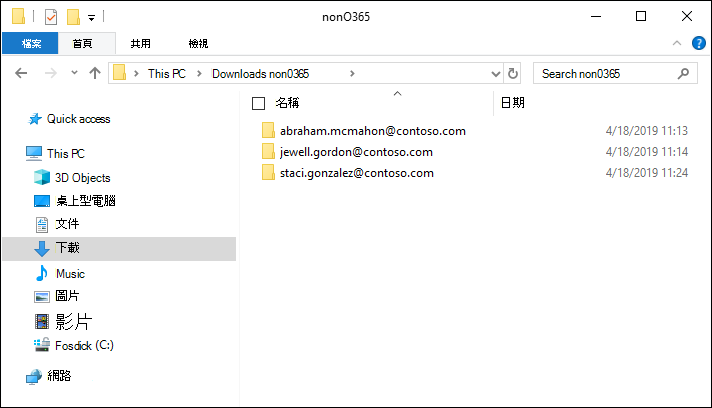

# 將非 Microsoft 365 資料載入到審閱集

並非所有需要在高級 eDiscovery 中進行分析的檔都位於 Microsoft 365。 使用高級 eDiscovery 的非 Microsoft 365 資料匯入功能，您可以將不在 Microsoft 365 中的檔上傳至審閱集。 本文說明如何將您的非 Microsoft 365 檔放入高級 eDiscovery 以進行分析。

## 上傳非 Office 365 內容的需求

使用本文所述的上傳非 Microsoft 365 功能時，需要具備下列各項：

- 您要將非 Microsoft 365 內容關聯的所有保管人，都必須獲指派適當的授權。 如需詳細資訊，請參閱[Advanced EDiscovery 快速入門](get-started-with-advanced-ediscovery.md#step-1-verify-and-assign-appropriate-licenses)。

- 現有的高級電子檔探索案例。

- 您必須先將保管人新增至案例，才可上傳和關聯非 Microsoft 365 的資料。

- 非 Microsoft 365 資料必須是由「高級 eDiscovery」所支援的檔案類型。 如需詳細資訊，請參閱[Advanced eDiscovery 中的支援檔案類型](supported-filetypes-ediscovery20.md)。

- 所有上傳至審閱集的檔案，都必須位於資料夾中，其中每個資料夾都會與特定保管人產生關聯。 這些資料夾的名稱必須使用下列命名格式： *alias@domainname*。 Alias@domainname 必須是使用者的 Microsoft 365 別名和網域。 您可以收集根資料夾中的所有 alias@domainname 資料夾。 根資料夾只能包含 alias@domainname 資料夾。 不支援根資料夾中的鬆散檔案。

   您想要上傳的非 Microsoft 365 資料檔案夾結構，會類似下列範例：

   - c:\nonO365\abraham.mcmahon@contoso.com
   - c:\nonO365\jewell.gordon@contoso.com
   - c:\nonO365\staci.gonzalez@contoso.com

   在此案例中，abraham.mcmahon@contoso.com、jewell.gordon@contoso.com 和 staci.gonzalez@contoso.com 是保管人的 SMTP 位址。

   

- 指派給 eDiscovery 管理員角色群組的帳戶（並新增為 eDiscovery 管理員）。

- 電腦上所安裝的 AzCopy v 8.1 工具，具有非 Microsoft 365 內容資料夾結構的存取權。 若要安裝 AzCopy，請參閱[在 Windows 上使用 AzCopy app-v 8.1 傳輸資料](https://docs.microsoft.com/previous-versions/azure/storage/storage-use-azcopy)。 請務必將 AzCopy 安裝在預設位置，也就是 **% ProgramFiles （x86）% \ Microsoft SDKs\Azure\AzCopy**。 您必須使用 AzCopy app-v 8.1。 其他版本的 AzCopy 在 [Advanced eDiscovery] 中載入非 Microsoft 365 資料時可能無法運作。

## 將非 Microsoft 365 內容上傳至高級電子檔探索

1. 以 eDiscovery 管理員或 eDiscovery 管理員的身分開啟「高級 eDiscovery」，然後移至即將上傳非 Microsoft 365 資料的情況。  

2. 按一下 [**複查集**]，然後選取要上傳非 Microsoft 365 資料的複查集。  如果您沒有審校集，您可以建立一個。 
 
3. 在 [檢查] 集中，按一下 [**管理審閱集**]，然後按一下 [在**非 Microsoft 365 資料**格上**查看上傳**]。

4. 按一下 **[上傳**檔案] 以啟動 [資料匯入嚮導]。

   

   嚮導的第一個步驟是準備將檔案上傳至的安全 Microsoft 提供 Azure 儲存位置。  準備完成後，[**下一步：上傳檔案]** 按鈕會變成作用中狀態。

   
 
5. 按 **[下一步：上傳**檔案]。

6. 在 [**上傳**檔案] 頁面上，執行下列動作：

   

   a. 在 [檔案**位置**] 方塊中，確認或輸入您要上傳的非 Microsoft 365 資料所在根資料夾位置。 例如，在 [**開始之前] 區段**中所顯示範例檔案的位置之後，您可以輸入 **%USERPROFILE\Downloads\nonO365**。 提供正確的位置，可確保路徑上顯示的 AzCopy 命令已正確更新。

   b. 按一下 [**複製到剪貼簿**]，複製方塊中所顯示的命令。

7. 啟動 Windows 命令提示字元，貼上一個步驟中所複製的命令，然後按**enter**開始 AzCopy 命令。  在您開始命令之後，非 Microsoft 365 檔案將會上傳至在步驟4中準備的 Azure 儲存位置。

   

   > [!NOTE]
   > 如先前所述，您必須使用 AzCopy app-v 8.1，以順利使用「**上載**檔案」頁面上提供的命令。 如果提供的 AzCopy 命令失敗，請參閱[Advanced eDiscovery 中的疑難排解 AzCopy](troubleshooting-azcopy.md)。

8. 回到安全性 & 合規性中心，然後按一下 **[下一步：處理**檔案]。  這會啟動上傳至 Azure 存放位置的非 Microsoft 365 檔案的處理、文字提取及編制索引。  

9. 在 [**處理**檔案] 頁面或 [**工作**] 索引標籤上，透過查看名為 [**新增非 Microsoft 365 資料至審閱集**的工作]，追蹤處理檔的進度。  工作完成後，會在 [檢查] 集中使用新的檔案。

   

10. 完成處理之後，您可以關閉嚮導。
