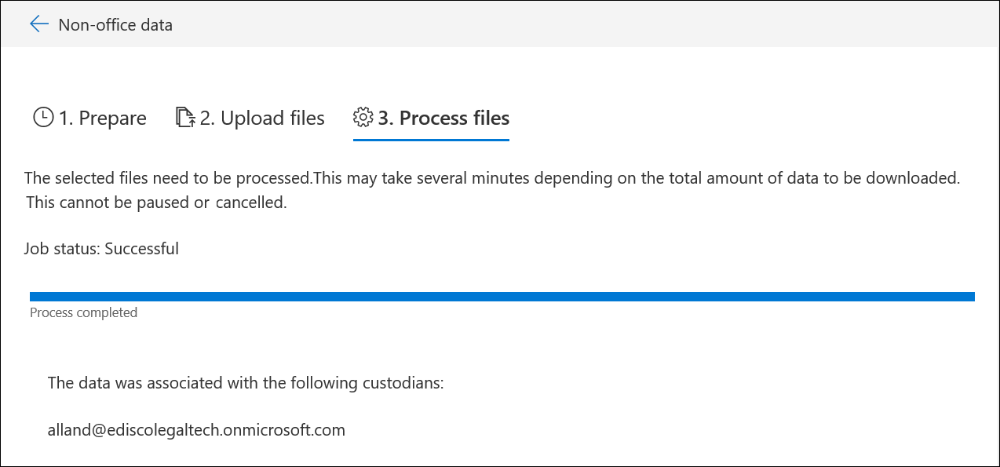

# 非 Office 365 資料載入辨識項

您可能需要在資料調查中分析的並非所有文件將會位於 Office 365。 使用非 Office 365 內容匯入的功能，您可以上傳文件與不存在於 Office 365 中插入辨識項讓他們可以在資料調查分析。

>[!Note]
>資料調查為您的組織需要與進階合規性附加元件或 E5 訂閱 Office 365 E3。 如果您不具有該計劃，並想要再試進階電子文件，您可以註冊 Office 365 企業版 E5 的試用版。

## 開始之前

使用此程序所述的上傳非 Office 365 功能需要您：

- 使用進階合規性的附加元件或 E5 訂閱 Office 365 E3。

- 將上傳其非 Office 365 內容的所有 custodians 必須都擁有 E3 的進階合規性的附加元件或 E5 授權。

- 現有的 eDiscovery 案例。

- 上傳的所有檔案所都收集到資料夾，其中沒有 custodian 每一個資料夾，而且此格式*alias@domainname*中已有該資料夾的名稱。 *Alias@domainname*必須是 Office 365 的使用者別名及網域。 您可以收集所有*alias@domainname*資料夾到根資料夾。 根資料夾只能包含*alias@domainname*資料夾，必須有任何鬆散檔案的根資料夾中。

- EDiscovery 管理員或 eDiscovery 管理員 Microsoft Azure 儲存體工具具有存取權的非 Office 365 內容的資料夾結構的電腦上安裝帳戶。

- 安裝 AzCopy，您可以從這裡：https://docs.microsoft.com/azure/storage/common/storage-use-azcopy

## 中的非 Office 365 內容上傳資料調查

1. 開啟 * * * 資料調查 * *，則非 Office 365 資料就會上傳到調查。  然後選取 [辨識項設定您想要載入的非 Office 365 資料，請按一下 [**證據**] 索引標籤]。  如果您未建立辨識項集合，您可以立即執行。  最後，按一下 [**管理辨識項**，然後在 [非 Office 365 資料] 區段中的**檢視上傳**

2. 按一下 [**上傳檔案**] 按鈕來啟動非 Office 365 資料匯入精靈]。

3. 在精靈中的第一個步驟只會準備要上傳檔案的安全 Azure blob。  準備已完成之後，按一下 [**下一步： 將檔案上傳**] 按鈕。

 
4. 在 [**上傳檔案**] 步驟中，指定**的檔案位置路徑**] 中，這是您計劃匯入非 Office 365 資料所在的位置。  設定正確的位置可確保正確更新命令 AzCopy。

> [!NOTE]
> 如果您未安裝 AzCopy，您可以從這裡：https://docs.microsoft.com/azure/storage/common/storage-use-azcopy

5. 按一下 [**複製到剪貼簿**] 連結，將複製的預先定義的命令。 啟動 windows 命令提示字元中，貼上命令並按 enter 鍵。  檔案就會上傳到安全的 Azure blob 儲存的下一個步驟。

6. 最後，傳回回到安全性 & 合規性，並按一下 [**下一步： 處理檔案**] 按鈕。  這會初始化處理、 文字擷取和編製索引的上傳的檔案。  您可以追蹤處理以下或在 [**工作**] 索引標籤中的進度。 完成之後，就有一個新的檔案可辨識項集合中。  處理皆完成之後，您可以關閉精靈。

