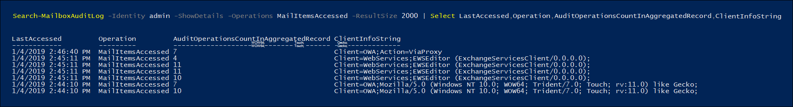

# <a name="use-advanced-audit-to-investigate-compromised-accounts"></a><span data-ttu-id="0101d-103">使用進階稽核調查遭入侵帳戶</span><span class="sxs-lookup"><span data-stu-id="0101d-103">Use Advanced Audit to investigate compromised accounts</span></span>

<span data-ttu-id="0101d-104">遭入侵使用者帳戶 (也稱為「帳戶盜用」\*\*) 是一種攻擊類型，攻擊者取得使用者帳戶的存取權後會以該使用者的身分運作。</span><span class="sxs-lookup"><span data-stu-id="0101d-104">A compromised user account (also called an *account takeover*) is a type of attack when an attacker gains access to a user account and operates as the user.</span></span> <span data-ttu-id="0101d-105">這些類型的攻擊有時會造成比攻擊者原先預期還要更大的危害。</span><span class="sxs-lookup"><span data-stu-id="0101d-105">These types of attacks sometimes cause more damage than the attacker may have intended.</span></span> <span data-ttu-id="0101d-106">調查遭入侵電子郵件帳戶時，您必須假設遭入侵的郵件資料多於追蹤攻擊者實際存在所表示的資料量。</span><span class="sxs-lookup"><span data-stu-id="0101d-106">When investigating compromised email accounts, you have to assume that more mail data was compromised than may be indicated by tracing the attacker's actual presence.</span></span> <span data-ttu-id="0101d-107">視電子郵件訊息中的資料類型而定，您必須假設敏感性資訊已遭到入侵，除非您能證明敏感性資料並未公開，否則您將面臨法規處罰。</span><span class="sxs-lookup"><span data-stu-id="0101d-107">Depending on the type of data in email messages, you have to assume that sensitive information was compromised or face regulatory fines unless you can prove that sensitive information wasn't exposed.</span></span> <span data-ttu-id="0101d-108">例如，若有證據顯示病患的健康資訊 (PHI) 遭到公開，則由 HIPAA 監管的組織會面臨巨額罰款。</span><span class="sxs-lookup"><span data-stu-id="0101d-108">For example, HIPAA-regulated organizations face significant fines if there is evidence that patient health information (PHI) was exposed.</span></span> <span data-ttu-id="0101d-109">在這些情況下，攻擊者不太可能對 PHI 有興趣，但是組織仍然必須上報有資料外洩，除非組織能夠特別證明沒有資料外洩。</span><span class="sxs-lookup"><span data-stu-id="0101d-109">In these cases, attackers are unlikely to be interested in PHI, but organizations still must report data breaches unless they can prove otherwise.</span></span>

<span data-ttu-id="0101d-110">為協助您調查遭入侵電子郵件帳戶，我們現在使用 *MailItemsAccessed* 信箱稽核動作，透過郵件通訊協定和用戶端，提供郵件資料的稽核存取權。</span><span class="sxs-lookup"><span data-stu-id="0101d-110">To help you with investigating compromise email accounts, we're now auditing accesses of mail data by mail protocols and clients with the *MailItemsAccessed* mailbox auditing action.</span></span> <span data-ttu-id="0101d-111">此新稽核動作將協助調查人員進一步瞭解電子郵件的資料外洩，並協助您找出可能已遭入侵之特定郵件項目的入侵範圍。</span><span class="sxs-lookup"><span data-stu-id="0101d-111">This new audited action will help investigators better understand email data breaches and help you identify the scope of compromises to specific mail items that may been compromised.</span></span> <span data-ttu-id="0101d-112">使用此新稽核動作的目的是協助主張特定郵件資料未遭入侵的鑑識辯護。</span><span class="sxs-lookup"><span data-stu-id="0101d-112">The goal of using this new auditing action is forensics defensibility to help assert that a specific piece of mail data was not compromised.</span></span> <span data-ttu-id="0101d-113">如果攻擊者取得特定郵件資料的存取權，Exchange Online 會稽核該事件，即使郵件項目沒有實際已遭讀取的徵兆亦如此。</span><span class="sxs-lookup"><span data-stu-id="0101d-113">If an attacker gained access to a specific piece of mail, Exchange Online audits the event even though there is no indication that the mail item was actually read.</span></span>

## <a name="the-mailitemsaccessed-mailbox-auditing-action"></a><span data-ttu-id="0101d-114">MailItemsAccessed 信箱稽核動作</span><span class="sxs-lookup"><span data-stu-id="0101d-114">The MailItemsAccessed mailbox auditing action</span></span>

<span data-ttu-id="0101d-115">新 MailItemsAccessed 動作屬於新 [Advanced Audit](advanced-audit.md) 功能。</span><span class="sxs-lookup"><span data-stu-id="0101d-115">The new MailItemsAccessed action is part of the new [Advanced Audit](advanced-audit.md) functionality.</span></span> <span data-ttu-id="0101d-116">這是 [Exchange 信箱稽核](https://docs.microsoft.com/office365/securitycompliance/enable-mailbox-auditing#mailbox-auditing-actions)的功能之一，獲派 Office 365 或 Microsoft 365 E5 授權的使用者或訂閱 Microsoft 365 E5 合規性附加元件的組織依預設會啟用此動作。</span><span class="sxs-lookup"><span data-stu-id="0101d-116">It's part of [Exchange mailbox auditing](https://docs.microsoft.com/office365/securitycompliance/enable-mailbox-auditing#mailbox-auditing-actions) and is enabled by default for users that are assigned an Office 365 or Microsoft 365 E5 license or for organizations with a Microsoft 365 E5 Compliance add-on subscription.</span></span>

<span data-ttu-id="0101d-117">MailItemsAccessed 信箱稽核動作涵蓋所有郵件通訊協定：POP、IMAP、MAPI、EWS、Exchange ActiveSync 和 REST。</span><span class="sxs-lookup"><span data-stu-id="0101d-117">The MailItemsAccessed mailbox auditing action covers all mail protocols: POP, IMAP, MAPI, EWS, Exchange ActiveSync, and REST.</span></span> <span data-ttu-id="0101d-118">此動作也涵蓋兩種類型的郵件存取：「同步處理」\*\* 和「繫結」\*\*。</span><span class="sxs-lookup"><span data-stu-id="0101d-118">It also covers both types of accessing mail: *sync* and *bind*.</span></span>

### <a name="auditing-sync-access"></a><span data-ttu-id="0101d-119">稽核同步處理存取</span><span class="sxs-lookup"><span data-stu-id="0101d-119">Auditing sync access</span></span>

<span data-ttu-id="0101d-120">同步處理作業只有在信箱是透過 Windows 或 Mac 的電腦版 Outlook 用戶端進行存取時才會記錄。</span><span class="sxs-lookup"><span data-stu-id="0101d-120">Sync operations are only recorded when a mailbox is accessed by a desktop version of the Outlook client for Windows or Mac.</span></span> <span data-ttu-id="0101d-121">在同步處理作業期間，這些用戶端通常會從雲端下載大量的郵件項目到本機電腦。</span><span class="sxs-lookup"><span data-stu-id="0101d-121">During the sync operation, these clients typically download a large set of mail items from the cloud to a local computer.</span></span> <span data-ttu-id="0101d-122">同步處理作業的稽核量會變得相當可觀。</span><span class="sxs-lookup"><span data-stu-id="0101d-122">The audit volume for sync operations is huge.</span></span> <span data-ttu-id="0101d-123">因此，我們不針對每個已同步處理的郵件產生稽核記錄，我們只針對其中包含已同步處理項目的郵件資料夾產生稽核事件。</span><span class="sxs-lookup"><span data-stu-id="0101d-123">So, instead of generating an audit record for each mail item that's synched, we just generate an audit event for the mail folder containing items that were synched.</span></span> <span data-ttu-id="0101d-124">這是假設已同步處理資料夾中「所有」\*\* 郵件項目皆已遭入侵。</span><span class="sxs-lookup"><span data-stu-id="0101d-124">This makes the assumption that *all* mail items in the synched folder have been compromised.</span></span> <span data-ttu-id="0101d-125">存取類型會記錄在稽核記錄的 OperationProperties 欄位。</span><span class="sxs-lookup"><span data-stu-id="0101d-125">The access type is recorded in the OperationProperties field of the audit record.</span></span> 

<span data-ttu-id="0101d-126">如需顯示稽核記錄中同步處理存取類型的範例，請參閱「[使用 MailItemsAccessed 稽核記錄進行鑑識調查](#use-mailitemsaccessed-audit-records-for-forensic-investigations)」一節中的步驟 2。</span><span class="sxs-lookup"><span data-stu-id="0101d-126">See step 2 in the [Use MailItemsAccessed audit records for forensic investigations](#use-mailitemsaccessed-audit-records-for-forensic-investigations) section for an example of displaying the sync access type in an audit record.</span></span>

### <a name="auditing-bind-access"></a><span data-ttu-id="0101d-127">稽核繫結存取</span><span class="sxs-lookup"><span data-stu-id="0101d-127">Auditing bind access</span></span>

<span data-ttu-id="0101d-128">繫結作業是電子郵件訊息的個別存取。</span><span class="sxs-lookup"><span data-stu-id="0101d-128">A bind operation is an individual access to an email message.</span></span> <span data-ttu-id="0101d-129">若是繫結存取，稽核記錄中會記錄個別訊息的 InternetMessageId。</span><span class="sxs-lookup"><span data-stu-id="0101d-129">For bind access, the InternetMessageId of individual messages will be recorded in the audit record.</span></span> <span data-ttu-id="0101d-130">MailItemsAccessed 稽核動作會記錄繫結作業然後彙總至單一稽核記錄。</span><span class="sxs-lookup"><span data-stu-id="0101d-130">The MailItemsAccessed audit action records bind operations and then aggregates into a single audit record.</span></span> <span data-ttu-id="0101d-131">間隔 2 分鐘內發生的所有繫結作業會彙總於 AuditData 屬性內 Folders 欄位中的單一稽核記錄。</span><span class="sxs-lookup"><span data-stu-id="0101d-131">All bind operations that occur within a 2-minute interval are aggregated in a single audit record in the Folders field within the AuditData property.</span></span> <span data-ttu-id="0101d-132">遭存取的每個訊息會使用其 InternetMessageId 加以識別。</span><span class="sxs-lookup"><span data-stu-id="0101d-132">Each message that was accessed is identified by its InternetMessageId.</span></span> <span data-ttu-id="0101d-133">記錄中所彙總的繫結作業數量會顯示在 AuditData 屬性中的 OperationCount 欄位。</span><span class="sxs-lookup"><span data-stu-id="0101d-133">The number of bind operations that were aggregated in the record is displayed in the OperationCount field in the AuditData property.</span></span>

<span data-ttu-id="0101d-134">如需顯示稽核記錄中繫結存取類型的範例，請參閱「[使用 MailItemsAccessed 稽核記錄進行鑑識調查](#use-mailitemsaccessed-audit-records-for-forensic-investigations)」一節中的步驟 4。</span><span class="sxs-lookup"><span data-stu-id="0101d-134">See step 4 in the [Use MailItemsAccessed audit records for forensic investigations](#use-mailitemsaccessed-audit-records-for-forensic-investigations) section for an example of displaying the bind access type in an audit record.</span></span>

### <a name="throttling-of-mailitemsaccessed-audit-records"></a><span data-ttu-id="0101d-135">MailItemsAccessed 稽核記錄的節流</span><span class="sxs-lookup"><span data-stu-id="0101d-135">Throttling of MailItemsAccessed audit records</span></span>

<span data-ttu-id="0101d-136">如果在 24 小時內產生超過 1,000 個 MailItemsAccessed 稽核記錄，Exchange Online 會針對 MailItemsAccessed 活動停止產生稽核記錄。</span><span class="sxs-lookup"><span data-stu-id="0101d-136">If more than 1,000 MailItemsAccessed audit records are generated in less than 24 hours, Exchange Online will stop generating auditing records for MailItemsAccessed activity.</span></span> <span data-ttu-id="0101d-137">當信箱受到節流控制，MailItemsAccessed 活動會在信箱開始節流後停止記錄 24 小時。</span><span class="sxs-lookup"><span data-stu-id="0101d-137">When a mailbox is throttled, MailItemsAccessed activity will not be logged for 24 hours after the mailbox was throttled.</span></span> <span data-ttu-id="0101d-138">如果發生這種情況，信箱很可能會在此期間遭到入侵。</span><span class="sxs-lookup"><span data-stu-id="0101d-138">If this occurs, there's a potential that mailbox could have been compromised during this period.</span></span> <span data-ttu-id="0101d-139">MailItemsAccessed 活動將會在下一個 24 小時後繼續記錄。</span><span class="sxs-lookup"><span data-stu-id="0101d-139">The recording of MailItemsAccessed activity will be resumed following a 24-hour period.</span></span>  

<span data-ttu-id="0101d-140">以下是有關節流必須記住的事項：</span><span class="sxs-lookup"><span data-stu-id="0101d-140">Here's a few things to keep in mind about throttling:</span></span>

- <span data-ttu-id="0101d-141">在 Exchange Online 的所有信箱中，受到節流控制的信箱比例低於 1%</span><span class="sxs-lookup"><span data-stu-id="0101d-141">Less than 1% of all mailboxes in Exchange Online are throttled</span></span>

- <span data-ttu-id="0101d-142">當信箱受到節流控制時，只有 MailItemsAccessed 活動的稽核記錄不會進行稽核。</span><span class="sxs-lookup"><span data-stu-id="0101d-142">When a mailbox is throttling, only audit records for MailItemsAccessed activity are not audited.</span></span> <span data-ttu-id="0101d-143">其他的信箱稽核動作不受影響。</span><span class="sxs-lookup"><span data-stu-id="0101d-143">Other mailbox auditing actions aren't affected.</span></span>

- <span data-ttu-id="0101d-144">僅針對信箱的繫結作業進行節流控制。</span><span class="sxs-lookup"><span data-stu-id="0101d-144">Mailboxes are throttled only for Bind operations.</span></span> <span data-ttu-id="0101d-145">同步處理作業的稽核記錄不會受到節流控制。</span><span class="sxs-lookup"><span data-stu-id="0101d-145">Audit records for sync operations are not throttled.</span></span>

- <span data-ttu-id="0101d-146">如果信箱受到節流控制，您可能會假設稽核記錄中有未記錄到的 MailItemsAccessed 活動。</span><span class="sxs-lookup"><span data-stu-id="0101d-146">If a mailbox is throttled, you can probably assume there was MailItemsAccessed activity that wasn't recorded in the audit logs.</span></span>

<span data-ttu-id="0101d-147">如需顯示稽核記錄中 IsThrottled 屬性的範例，請參閱「[使用 MailItemsAccessed 稽核記錄進行鑑識調查](#use-mailitemsaccessed-audit-records-for-forensic-investigations)」一節中的步驟 1。</span><span class="sxs-lookup"><span data-stu-id="0101d-147">See step 1 in the [Use MailItemsAccessed audit records for forensic investigations](#use-mailitemsaccessed-audit-records-for-forensic-investigations) section for an example of displaying the IsThrottled property in an audit record.</span></span>

## <a name="use-mailitemsaccessed-audit-records-for-forensic-investigations"></a><span data-ttu-id="0101d-148">使用 MailItemsAccessed 稽核記錄進行鑑識調查</span><span class="sxs-lookup"><span data-stu-id="0101d-148">Use MailItemsAccessed audit records for forensic investigations</span></span>

<span data-ttu-id="0101d-149">信箱稽核會產生存取電子郵件訊息的稽核記錄，因此您可以確信電子郵件訊息並未遭到入侵。</span><span class="sxs-lookup"><span data-stu-id="0101d-149">Mailbox auditing generates audit records for access to email messages so that you can be confident that email messages haven't been compromised.</span></span> <span data-ttu-id="0101d-150">基於此原因，在不確定某些資料已遭存取的情況下，我們會假設資料已遭存取而記錄下所有的郵件存取活動。</span><span class="sxs-lookup"><span data-stu-id="0101d-150">For this reason, in circumstances where we're not certain that some data has been accessed, we assume that it has by recording all mail access activity.</span></span>

<span data-ttu-id="0101d-151">使用 MailItemsAccessed 稽核記錄做為鑑識之用的執行時機通常是在解決資料外洩並驅逐攻擊者之後。</span><span class="sxs-lookup"><span data-stu-id="0101d-151">Using MailItemsAccessed audit records for forensics purposes is typically performed after a data breach has been resolved and the attacker has been evicted.</span></span> <span data-ttu-id="0101d-152">若要開始調查，您應該找出已遭入侵的信箱組，然後判定攻擊者可以存取組織內信箱的時間範圍。</span><span class="sxs-lookup"><span data-stu-id="0101d-152">To begin your investigation, you should identify the set of mailboxes that they have been compromised and determine the time frame when attacker had access to mailboxes in your organization.</span></span> <span data-ttu-id="0101d-153">接著，您可以在 [Exchange Online PowerShell](https://docs.microsoft.com/powershell/exchange/connect-to-exchange-online-powershell) 中使用 **Search-UnifiedAuditLog** 或 **Search-MailboxAuditLog** Cmdlet，搜尋對應到資料外洩的稽核記錄。</span><span class="sxs-lookup"><span data-stu-id="0101d-153">Then, you can use the **Search-UnifiedAuditLog** or **Search-MailboxAuditLog** cmdlets in [Exchange Online PowerShell](https://docs.microsoft.com/powershell/exchange/connect-to-exchange-online-powershell) to search audit records that correspond to the data breach.</span></span> 

<span data-ttu-id="0101d-154">您可以執行下列其中一個命令來搜尋 MailItemsAccessed 稽核記錄：</span><span class="sxs-lookup"><span data-stu-id="0101d-154">You can run one of the following commands to search for MailItemsAccessed audit records:</span></span>

<span data-ttu-id="0101d-155">**整合的稽核記錄**</span><span class="sxs-lookup"><span data-stu-id="0101d-155">**Unified audit log**</span></span>

```powershell
Search-UnifiedAuditLog -StartDate 01/06/2020 -EndDate 01/20/2020 -UserIds <user1,user2> -Operations MailItemsAccessed -ResultSize 1000
```

<span data-ttu-id="0101d-156">**信箱稽核記錄**</span><span class="sxs-lookup"><span data-stu-id="0101d-156">**Mailbox audit log**</span></span>

```powershell
Search-MailboxAuditLog -Identity <user> -StartDate 01/06/2020 -EndDate 01/20/2020 -Operations MailItemsAccessed -ResultSize 1000 -ShowDetails
```

> [!TIP]
> <span data-ttu-id="0101d-157">這兩個 Cmdlet 之間的主要差異在於，您可以使用 **Search-UnifiedAuditLog** Cmdlet 搜尋由一或多個使用者執行之活動的稽核記錄。</span><span class="sxs-lookup"><span data-stu-id="0101d-157">One primary difference between these two cmdlets in that you can use the **Search-UnifiedAuditLog** cmdlet to search for audit records for activity performed by one or more users.</span></span> <span data-ttu-id="0101d-158">這是因為 *UserIds* 是多值參數。</span><span class="sxs-lookup"><span data-stu-id="0101d-158">That's because *UserIds* is a multi-value parameter.</span></span> <span data-ttu-id="0101d-159">**Search-MailboxAuditLog** Cmdlet 則是搜尋單一使用者的信箱稽核記錄。</span><span class="sxs-lookup"><span data-stu-id="0101d-159">The **Search-MailboxAuditLog** cmdlet searches the mailbox audit log for a single user.</span></span>

<span data-ttu-id="0101d-160">以下是使用 MailItemsAccessed 稽核記錄調查遭入侵使用者攻擊的步驟。</span><span class="sxs-lookup"><span data-stu-id="0101d-160">Here are the steps for using MailItemsAccessed audit records to investigate a compromised user attack.</span></span> <span data-ttu-id="0101d-161">每個步驟都會顯示 **Search-UnifiedAuditLog** 或 **Search-MailboxAuditLog** Cmdlet 的命令語法。</span><span class="sxs-lookup"><span data-stu-id="0101d-161">Each step shows the command syntax for the **Search-UnifiedAuditLog** or **Search-MailboxAuditLog** cmdlets.</span></span>

1. <span data-ttu-id="0101d-162">檢查信箱是否受到節流控制。</span><span class="sxs-lookup"><span data-stu-id="0101d-162">Check whether the mailbox has been throttled.</span></span> <span data-ttu-id="0101d-163">若有的話，這表示有些信箱稽核記錄未被記錄下來。</span><span class="sxs-lookup"><span data-stu-id="0101d-163">If so, this would mean that some mailbox auditing records would not have been logged.</span></span> <span data-ttu-id="0101d-164">在所有記錄皆有 IsThrottled 為 True 的情況下，您應該假設記錄產生後的 24 小時內，所有的信箱存取皆未經稽核且所有郵件資料已遭入侵。</span><span class="sxs-lookup"><span data-stu-id="0101d-164">In the case that any audit records have the "IsThrottled" is "True," you should assume that for a 24-hour period afterwards that record was generated, that any access to the mailbox was not audited and that all mail data has been compromised.</span></span>

   <span data-ttu-id="0101d-165">若要搜尋其中信箱是受節流控制的 MailItemsAccessed 記錄，請執行下列命令：</span><span class="sxs-lookup"><span data-stu-id="0101d-165">To search for MailItemsAccessed records where the mailbox was throttled, run the following command:</span></span>

   <span data-ttu-id="0101d-166">**整合的稽核記錄**</span><span class="sxs-lookup"><span data-stu-id="0101d-166">**Unified audit log**</span></span>
 
   ```powershell
   Search-UnifiedAuditLog -StartDate 01/06/2020 -EndDate 01/20/2020 -UserIds <user1,user2> -Operations MailItemsAccessed -ResultSize 1000 | Where {$_.AuditData -like '*"IsThrottled","Value":"True"*'} | FL
   ```

   <span data-ttu-id="0101d-167">**信箱稽核記錄**</span><span class="sxs-lookup"><span data-stu-id="0101d-167">**Mailbox audit log**</span></span>

   ```powershell
   Search-MailboxAuditLog -StartDate 01/06/2020 -EndDate 01/20/2020 -Identity <user> -Operations MailItemsAccessed -ResultSize 10000 -ShowDetails | Where {$_.OperationProperties -like "*IsThrottled:True*"} | FL
   ```

2. <span data-ttu-id="0101d-168">檢查同步處理活動。</span><span class="sxs-lookup"><span data-stu-id="0101d-168">Check for sync activities.</span></span> <span data-ttu-id="0101d-169">如果攻擊者使用電子郵件用戶端下載信箱中的訊息，攻擊者可以將電腦從網際網路斷開，然後在本機存取訊息，而不需要與伺服器互動。</span><span class="sxs-lookup"><span data-stu-id="0101d-169">If an attacker uses an email client to downloaded messages in a mailbox, they can disconnect the computer from the Internet and access the messages locally without interacting with the server.</span></span> <span data-ttu-id="0101d-170">這表示信箱稽核無法稽核這些活動。</span><span class="sxs-lookup"><span data-stu-id="0101d-170">This means that mailbox auditing would not be able to audit these activities.</span></span>

   <span data-ttu-id="0101d-171">若要搜尋其中郵件項目是透過同步處理作業進行存取的 MailItemsAccessed 記錄，請執行下列命令：</span><span class="sxs-lookup"><span data-stu-id="0101d-171">To search for MailItemsAccessed records where the mail items were accessed by a sync operation, run the following command:</span></span>

   <span data-ttu-id="0101d-172">**整合的稽核記錄**</span><span class="sxs-lookup"><span data-stu-id="0101d-172">**Unified audit log**</span></span>

   ```powershell
   Search-UnifiedAuditLog -StartDate 01/06/2020 -EndDate 02/20/2020 -UserIds <user1,user2> -Operations MailItemsAccessed -ResultSize 1000 | Where {$_.AuditData -like '*"MailAccessType","Value":"Sync"*'} | FL
   ```

   <span data-ttu-id="0101d-173">**信箱稽核記錄**</span><span class="sxs-lookup"><span data-stu-id="0101d-173">**Mailbox audit log**</span></span>

   ```powershell
   Search-MailboxAuditLog -StartDate 01/06/2020 -EndDate 01/20/2020 -Identity <user> -Operations MailItemsAccessed -ResultSize 10000 -ShowDetails | Where {$_.OperationProperties -like "*MailAccessType:Sync*"} | FL
   ```

3. <span data-ttu-id="0101d-174">檢查同步處理活動以判定其中發生之背景與攻擊者存取信箱時所使用之背景相同的任何活動。</span><span class="sxs-lookup"><span data-stu-id="0101d-174">Check sync activities to determine in any of them have occurred in the same context as the one used by the attacker access the mailbox.</span></span> <span data-ttu-id="0101d-175">背景可以透過用來存取信箱和郵件通訊協定的用戶端電腦 IP 位址找出並區別。</span><span class="sxs-lookup"><span data-stu-id="0101d-175">Context is identified and differentiated by the IP address of the client computer used to access the mailbox and the mail protocol.</span></span> <span data-ttu-id="0101d-176">如需詳細資訊，請參閱「[找出不同稽核記錄的存取背景](#identifying-the-access-contexts-of-different-audit-records)」一節。</span><span class="sxs-lookup"><span data-stu-id="0101d-176">For more information, see the [Identifying the access contexts of different audit records](#identifying-the-access-contexts-of-different-audit-records) section.</span></span>

   <span data-ttu-id="0101d-177">使用下方列出的屬性進行調查。</span><span class="sxs-lookup"><span data-stu-id="0101d-177">Use the properties listed below to investigate.</span></span> <span data-ttu-id="0101d-178">這些屬性位於 AuditData 或 OperationProperties 屬性中。</span><span class="sxs-lookup"><span data-stu-id="0101d-178">These properties are located in the AuditData or OperationProperties property.</span></span> <span data-ttu-id="0101d-179">如果有任何同步處理發生的背景與攻擊者的活動背景相同，則請假設攻擊者已將所有郵件項目同步處理至他們的用戶端，這表示整個信箱可能已經遭到入侵。</span><span class="sxs-lookup"><span data-stu-id="0101d-179">If any of the syncs occur in the same context as the attacker activity, assume the attacker has synced all mail items to their client, which means the entire mailbox has probably been compromised.</span></span>

   |<span data-ttu-id="0101d-180">屬性	</span><span class="sxs-lookup"><span data-stu-id="0101d-180">Property</span></span>         | <span data-ttu-id="0101d-181">說明</span><span class="sxs-lookup"><span data-stu-id="0101d-181">Description</span></span> |
   |:---------------- | :----------|
   |<span data-ttu-id="0101d-182">ClientInfoString</span><span class="sxs-lookup"><span data-stu-id="0101d-182">ClientInfoString</span></span> | <span data-ttu-id="0101d-183">描述通訊協定、用戶端 (包括版本)</span><span class="sxs-lookup"><span data-stu-id="0101d-183">Describes protocol, client (includes version)</span></span>|
   |<span data-ttu-id="0101d-184">ClientIPAddress</span><span class="sxs-lookup"><span data-stu-id="0101d-184">ClientIPAddress</span></span>  | <span data-ttu-id="0101d-185">用戶端電腦的 IP 位址。</span><span class="sxs-lookup"><span data-stu-id="0101d-185">IP address of the client machine.</span></span>|
   |<span data-ttu-id="0101d-186">SessionId</span><span class="sxs-lookup"><span data-stu-id="0101d-186">SessionId</span></span>        | <span data-ttu-id="0101d-187">工作階段識別碼可協助區分同一帳戶中攻擊者的動作和每天例行的使用者活動 (在帳戶遭入侵的情況下)</span><span class="sxs-lookup"><span data-stu-id="0101d-187">Session ID helps to differentiate attacker actions vs day-to-day user activities on the same account (in the case of a compromised account)</span></span>|
   |<span data-ttu-id="0101d-188">UserId</span><span class="sxs-lookup"><span data-stu-id="0101d-188">UserId</span></span>           | <span data-ttu-id="0101d-189">使用者讀取訊息的 UPN。</span><span class="sxs-lookup"><span data-stu-id="0101d-189">UPN of the user reading the message.</span></span>|
   |||

4. <span data-ttu-id="0101d-190">檢查繫結活動。</span><span class="sxs-lookup"><span data-stu-id="0101d-190">Check for bind activities.</span></span> <span data-ttu-id="0101d-191">執行步驟 2 和步驟 3 之後，您可以確信由攻擊者執行的所有其他信箱存取皆已擷取在 MailItemsAccessed 稽核記錄中，其中有 MailAccessType 屬性，值為 Bind。</span><span class="sxs-lookup"><span data-stu-id="0101d-191">After performing steps 2 and step 3, you can be confident that all other access to email messages by the attacker will be captured in the MailItemsAccessed audit records that have a MailAccessType property with a value of "Bind".</span></span>

   <span data-ttu-id="0101d-192">若要搜尋其中郵件項目是透過繫結作業進行存取的 MailItemsAccessed 記錄，請執行下列命令。</span><span class="sxs-lookup"><span data-stu-id="0101d-192">To search for MailItemsAccessed records where the mail items were accessed by a Bind operation, run the following command.</span></span>

   <span data-ttu-id="0101d-193">**整合的稽核記錄**</span><span class="sxs-lookup"><span data-stu-id="0101d-193">**Unified audit log**</span></span>

   ```powershell
   Search-UnifiedAuditLog -StartDate 01/06/2020 -EndDate 01/20/2020 -UserIds <user1,user2> -Operations MailItemsAccessed -ResultSize 1000 | Where {$_.AuditData -like '*"MailAccessType","Value":"Bind"*'} | FL
   ```
 
   <span data-ttu-id="0101d-194">**信箱稽核記錄**</span><span class="sxs-lookup"><span data-stu-id="0101d-194">**Mailbox audit log**</span></span>
   
   ```powershell
   Search-MailboxAuditLog -StartDate 01/06/2020 -EndDate 01/20/2020 -Identity <user> -Operations MailItemsAccessed -ResultSize 10000 -ShowDetails | Where {$_.OperationProperties -like "*MailAccessType:Bind*"} | FL
   ```

   <span data-ttu-id="0101d-195">遭到存取的電子郵件訊息可以透過其網際網路訊息識別碼加以識別。您也可以檢查是否有任何稽核記錄的背景與其他攻擊者活動的背景相同。</span><span class="sxs-lookup"><span data-stu-id="0101d-195">Email messages that were accessed are identified by their internet message Id. You can also check to see if any audit records have the same context as the ones for other attacker activity.</span></span> <span data-ttu-id="0101d-196">如需詳細資訊，請參閱「[找出不同稽核記錄的存取背景](#identifying-the-access-contexts-of-different-audit-records)」一節。</span><span class="sxs-lookup"><span data-stu-id="0101d-196">For more information, see the [Identifying the access contexts of different audit records](#identifying-the-access-contexts-of-different-audit-records) section.</span></span>
 
   <span data-ttu-id="0101d-197">您可以透過兩種不同的方式來使用繫結作業的稽核資料：</span><span class="sxs-lookup"><span data-stu-id="0101d-197">You can use the audit data for bind operations in two different ways:</span></span>

     - <span data-ttu-id="0101d-198">透過使用 InternetMessageId 找到訊息，然後檢查是否有任何訊息包含敏感性資訊，存取或收集攻擊者已存取的所有電子郵件訊息。</span><span class="sxs-lookup"><span data-stu-id="0101d-198">Access or collect all email messages the attacker accessed by using the InternetMessageId to find them and then checking to see if any of those messages contains sensitive information.</span></span>

     - <span data-ttu-id="0101d-199">使用 InternetMessageId 搜尋與一組疑似敏感性電子郵件訊息相關的稽核記錄。</span><span class="sxs-lookup"><span data-stu-id="0101d-199">Use the InternetMessageId to search audit records related to a set of potentially sensitive email messages.</span></span> <span data-ttu-id="0101d-200">如果您只關注小量的訊息，那麼這個方式就相當實用。</span><span class="sxs-lookup"><span data-stu-id="0101d-200">This is useful if you're concerned only about a small number of messages.</span></span>

## <a name="filtering-of-duplicate-audit-records"></a><span data-ttu-id="0101d-201">篩選重複的稽核記錄</span><span class="sxs-lookup"><span data-stu-id="0101d-201">Filtering of duplicate audit records</span></span>

<span data-ttu-id="0101d-202">篩選出在彼此間隔一小時內發生之相同繫結作業的重複稽核作業以移除稽核干擾。</span><span class="sxs-lookup"><span data-stu-id="0101d-202">Duplicate audit records for the same bind operations that occur within an hour of each other are filtered out to remove auditing noise.</span></span> <span data-ttu-id="0101d-203">同步處理作業也會以一小時的時間間隔篩選出。</span><span class="sxs-lookup"><span data-stu-id="0101d-203">Sync operations are also filtered out at one-hour intervals.</span></span> <span data-ttu-id="0101d-204">以相同的 InternetMessageId 為例，如果下方表格中所述屬性有任何不同，則此刪除重複程序便會發生例外。</span><span class="sxs-lookup"><span data-stu-id="0101d-204">The exception to this de-duplication process occurs if, for the same InternetMessageId, any of the properties described in the following table are different.</span></span> <span data-ttu-id="0101d-205">如果這些屬性之一在重複的作業中不相同，系統會產生新稽核記錄。</span><span class="sxs-lookup"><span data-stu-id="0101d-205">If one of these properties is different in a duplicate operation, a new audit record is generated.</span></span> <span data-ttu-id="0101d-206">下一小節將會詳細說明此程序。</span><span class="sxs-lookup"><span data-stu-id="0101d-206">This process is described in more detail in the next section.</span></span>

| <span data-ttu-id="0101d-207">屬性	</span><span class="sxs-lookup"><span data-stu-id="0101d-207">Property</span></span>| <span data-ttu-id="0101d-208">說明</span><span class="sxs-lookup"><span data-stu-id="0101d-208">Description</span></span>|
|:--------|:---------|
|<span data-ttu-id="0101d-209">ClientIPAddress</span><span class="sxs-lookup"><span data-stu-id="0101d-209">ClientIPAddress</span></span> | <span data-ttu-id="0101d-210">用戶端電腦的 IP 位址。</span><span class="sxs-lookup"><span data-stu-id="0101d-210">IP address of the client computer.</span></span>|
|<span data-ttu-id="0101d-211">ClientInfoString</span><span class="sxs-lookup"><span data-stu-id="0101d-211">ClientInfoString</span></span>| <span data-ttu-id="0101d-212">用戶端用來存取信箱的用戶端通訊協定。</span><span class="sxs-lookup"><span data-stu-id="0101d-212">The client protocol, client used to access the mailbox.</span></span>| 
|<span data-ttu-id="0101d-213">ParentFolder</span><span class="sxs-lookup"><span data-stu-id="0101d-213">ParentFolder</span></span>    | <span data-ttu-id="0101d-214">遭存取郵件項目的完整資料夾路徑。</span><span class="sxs-lookup"><span data-stu-id="0101d-214">The full folder path of the mail item that was accessed.</span></span> |
|<span data-ttu-id="0101d-215">Logon_type</span><span class="sxs-lookup"><span data-stu-id="0101d-215">Logon_type</span></span>      | <span data-ttu-id="0101d-216">執行動作的使用者登入類型。</span><span class="sxs-lookup"><span data-stu-id="0101d-216">The logon type of the user who performed the action.</span></span> <span data-ttu-id="0101d-217">登入類型 (及其對應的 Enum 值) 是擁有者 (0)、管理員 (1) 或代理人 (2)。</span><span class="sxs-lookup"><span data-stu-id="0101d-217">The logon types (and their corresponding Enum value) are Owner (0), Admin (1), or Delegate (2).</span></span>|
|<span data-ttu-id="0101d-218">MailAccessType</span><span class="sxs-lookup"><span data-stu-id="0101d-218">MailAccessType</span></span>  | <span data-ttu-id="0101d-219">存取是繫結或同步處理作業。</span><span class="sxs-lookup"><span data-stu-id="0101d-219">Whether the access is a bind or a sync operation.</span></span>|
|<span data-ttu-id="0101d-220">MailboxUPN</span><span class="sxs-lookup"><span data-stu-id="0101d-220">MailboxUPN</span></span>      | <span data-ttu-id="0101d-221">遭讀取訊息所在的信箱 UPN。</span><span class="sxs-lookup"><span data-stu-id="0101d-221">The UPN of the mailbox where the message being read is located.</span></span>|
|<span data-ttu-id="0101d-222">User</span><span class="sxs-lookup"><span data-stu-id="0101d-222">User</span></span>            | <span data-ttu-id="0101d-223">讀取訊息的使用者 UPN。</span><span class="sxs-lookup"><span data-stu-id="0101d-223">The UPN of the user reading the message.</span></span>|
|<span data-ttu-id="0101d-224">SessionId</span><span class="sxs-lookup"><span data-stu-id="0101d-224">SessionId</span></span>       | <span data-ttu-id="0101d-225">工作階段識別碼可協助區分同一信箱中攻擊者的動作和每天例行的使用者活動 (在帳戶遭入侵的情況下)。如需有關工作階段的詳細資訊，請參閱[考量攻擊者活動在 Exchange Online 工作階段內的背景](https://techcommunity.microsoft.com/t5/exchange-team-blog/contextualizing-attacker-activity-within-sessions-in-exchange/ba-p/608801) (英文)。</span><span class="sxs-lookup"><span data-stu-id="0101d-225">The Session Id helps to differentiate attacker actions and day-to-day user activities in the same mailbox (in the case of account compromise) For more information about sessions, see [Contextualizing attacker activity within sessions in Exchange Online](https://techcommunity.microsoft.com/t5/exchange-team-blog/contextualizing-attacker-activity-within-sessions-in-exchange/ba-p/608801).</span></span>|
||||

## <a name="identifying-the-access-contexts-of-different-audit-records"></a><span data-ttu-id="0101d-226">找出不同稽核記錄的存取背景</span><span class="sxs-lookup"><span data-stu-id="0101d-226">Identifying the access contexts of different audit records</span></span>

<span data-ttu-id="0101d-227">攻擊者通常會在信箱擁有者存取信箱的同一時間存取信箱。</span><span class="sxs-lookup"><span data-stu-id="0101d-227">It's common that an attacker may access a mailbox at the same time the mailbox owner is accessing it.</span></span> <span data-ttu-id="0101d-228">若要區分出攻擊者和信箱擁有者的存取，我們有定義存取背景的稽核記錄屬性。</span><span class="sxs-lookup"><span data-stu-id="0101d-228">To differentiate between access by the attacker and the mailbox owner, there are audit record properties that define the context of the access.</span></span> <span data-ttu-id="0101d-229">如先前所述，當這些屬性的值不同時，即使活動發生於彙總期間，系統也會產生個別的稽核記錄。</span><span class="sxs-lookup"><span data-stu-id="0101d-229">As previously explained, when the values for these properties are different, even when the activity occurs within the aggregation interval, separate audit records are generated.</span></span> <span data-ttu-id="0101d-230">下列範例中有三種不同的稽核記錄。</span><span class="sxs-lookup"><span data-stu-id="0101d-230">In the following example, there are three different audit records.</span></span> <span data-ttu-id="0101d-231">每一個都可以透過 SessionId 和 ClientIPAddress 屬性來區分。</span><span class="sxs-lookup"><span data-stu-id="0101d-231">Each one is differentiated by the Session Id and ClientIPAddress properties.</span></span> <span data-ttu-id="0101d-232">遭到存取的訊息也可以識別出來。</span><span class="sxs-lookup"><span data-stu-id="0101d-232">The messages that were accessed are also identified.</span></span>

|<span data-ttu-id="0101d-233">稽核記錄 1</span><span class="sxs-lookup"><span data-stu-id="0101d-233">Audit record 1</span></span>  |<span data-ttu-id="0101d-234">稽核記錄 2</span><span class="sxs-lookup"><span data-stu-id="0101d-234">Audit record 2</span></span>  |<span data-ttu-id="0101d-235">稽核記錄 3</span><span class="sxs-lookup"><span data-stu-id="0101d-235">Audit record 3</span></span>|
|---------|---------|---------|
|<span data-ttu-id="0101d-236">ClientIPAddress**1**</span><span class="sxs-lookup"><span data-stu-id="0101d-236">ClientIPAddress**1**</span></span><br/><span data-ttu-id="0101d-237">SessionId**2**</span><span class="sxs-lookup"><span data-stu-id="0101d-237">SessionId**2**</span></span>|<span data-ttu-id="0101d-238">ClientIPAddress**2**</span><span class="sxs-lookup"><span data-stu-id="0101d-238">ClientIPAddress**2**</span></span><br/><span data-ttu-id="0101d-239">SessionId**2**</span><span class="sxs-lookup"><span data-stu-id="0101d-239">SessionId**2**</span></span>|<span data-ttu-id="0101d-240">ClientIPAddress**1**</span><span class="sxs-lookup"><span data-stu-id="0101d-240">ClientIPAddress**1**</span></span><br/><span data-ttu-id="0101d-241">SessionId**3**</span><span class="sxs-lookup"><span data-stu-id="0101d-241">SessionId**3**</span></span>|
|<span data-ttu-id="0101d-242">InternetMessageId**A**</span><span class="sxs-lookup"><span data-stu-id="0101d-242">InternetMessageId**A**</span></span><br/><span data-ttu-id="0101d-243">InternetMessageId**D**</span><span class="sxs-lookup"><span data-stu-id="0101d-243">InternetMessageId**D**</span></span><br/><span data-ttu-id="0101d-244">InternetMessageId**E**</span><span class="sxs-lookup"><span data-stu-id="0101d-244">InternetMessageId**E**</span></span><br/><span data-ttu-id="0101d-245">InternetMessageId**F**</span><span class="sxs-lookup"><span data-stu-id="0101d-245">InternetMessageId**F**</span></span><br/>|<span data-ttu-id="0101d-246">InternetMessageId**A**</span><span class="sxs-lookup"><span data-stu-id="0101d-246">InternetMessageId**A**</span></span><br/><span data-ttu-id="0101d-247">InternetMessageId**C**</span><span class="sxs-lookup"><span data-stu-id="0101d-247">InternetMessageId**C**</span></span>|<span data-ttu-id="0101d-248">InternetMessageId**B**</span><span class="sxs-lookup"><span data-stu-id="0101d-248">InternetMessageId**B**</span></span> |
||||

<span data-ttu-id="0101d-249">如果[前一小節](#filtering-of-duplicate-audit-records)之表格所列的屬性有任何不同，系統會產生另一個稽核記錄以追蹤新背景。</span><span class="sxs-lookup"><span data-stu-id="0101d-249">If any of the properties listed in the table in the [previous section](#filtering-of-duplicate-audit-records) are different, a separate audit record is generated to track the new context.</span></span> <span data-ttu-id="0101d-250">視活動發生的背景而定，系統會將存取排序整理到個別的稽核記錄。</span><span class="sxs-lookup"><span data-stu-id="0101d-250">Accesses will be sorted into the separate audit records depending on the context in which the activity took place.</span></span>

<span data-ttu-id="0101d-251">例如，在以下螢幕擷取畫面中顯示的稽核記錄中，雖然我們是同時從 EWSEditor 和 OWA 存取郵件，但是存取活動會根據存取的發生背景而彙整於不同的稽核記錄中。</span><span class="sxs-lookup"><span data-stu-id="0101d-251">For example, in audit records shown in the following screenshot, though we are accessing mail from EWSEditor and OWA simultaneously, the access activity is collated in different audit records depending on the context in which the access took place.</span></span> <span data-ttu-id="0101d-252">在此情況下，背景由 ClientInfoString 屬性的不同值所定義。</span><span class="sxs-lookup"><span data-stu-id="0101d-252">In this case, the context is defined by different values for the ClientInfoString property.</span></span>


