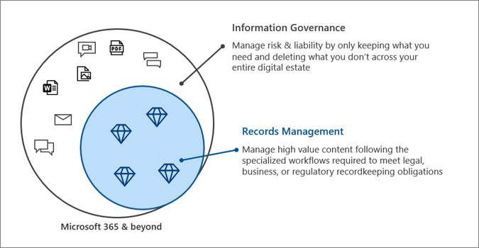

# Microsoft 365 中的 Microsoft 資訊控管功能Microsoft Information Governance in Microsoft 365

>*[Microsoft 365 安全性與合規性的授權指引](/office365/servicedescriptions/microsoft-365-service-descriptions/microsoft-365-tenantlevel-services-licensing-guidance/microsoft-365-security-compliance-licensing-guidance)。**[Microsoft 365 licensing guidance for security & compliance](/office365/servicedescriptions/microsoft-365-service-descriptions/microsoft-365-tenantlevel-services-licensing-guidance/microsoft-365-security-compliance-licensing-guidance).*

使用 Microsoft 資訊控管功能 (有時會縮寫為 MIG) 來管控您的資料，以符合合規性或法規需求。Use Microsoft Information Governance (sometimes abbreviated to MIG) capabilities to govern your data for compliance or regulatory requirements.

想要保護您的資料？Looking to protect your data? 請參閱 [Microsoft 365 中的 Microsoft 資訊保護。](information-protection.md)See [Microsoft Information Protection in Microsoft 365](information-protection.md).

## 資訊控管Information governance

保留所需的內容，並刪除您不需要的內容：To keep what you need and delete what you don't:
 
|功能Capability|需要解決的問題是什麼？What problems does it solve?|快速入門Get started|
|:------|:------------|:--------------------|:-----------------------------|
|[保留原則和保留標籤Retention policies and retention labels](retention.md)| 保留或刪除含有原則管理，以及電子郵件、文件、即時訊息等的刪除工作流程的內容Retain or delete content with policy management and a deletion workflow for email, documents, instant messages, and more   範例情境：[自動將保留標籤套用到內容](apply-retention-labels-automatically.md)Example scenario: [Apply a retention label to content automatically](apply-retention-labels-automatically.md) | [開始使用保留原則和保留標籤Get started with retention policies and retention labels](get-started-with-retention.md)|
|[匯入服務Import service](importing-pst-files-to-office-365.md)| 將 PST 檔案大量匯入到 Exchange Online 信箱，以保留和搜尋電子郵件訊息，以符合合規性或法規需求Bulk-import PST files to Exchange Online mailboxes to retain and search email messages for compliance or regulatory requirements | [使用網路上傳以將貴組織的 PST 檔案匯入至 Microsoft 365Use network upload to import your organization's PST files to Microsoft 365](use-network-upload-to-import-pst-files.md)|
|[封存第三方資料Archive third-party data](archiving-third-party-data.md)| 從社交媒體平台、立即訊息平台和文件共同作業平台，匯入、封存並套用合規性解決方案至協力廠商資料Import, archive, and apply compliance solutions to third-party data from social media platforms, instant messaging platforms, and document collaboration platforms| [協力廠商資料連接器Third-party connectors](archiving-third-party-data.md#third-party-data-connectors)|
|[非使用中的信箱Inactive mailboxes](inactive-mailboxes-in-office-365.md)| 在員工離開組織之後保留信箱內容Retain mailbox content after employees leave the organization | [建立和管理非使用中信箱Create and manage inactive mailboxes](create-and-manage-inactive-mailboxes.md)|

## 記錄管理Records management

若要針對法律、商務或法規義務管理高價值內容：To manage high-value content for legal, business, or regulatory obligations:

|功能Capability|需要解決的問題是什麼？What problems does it solve?|快速入門Get started|
|:------|:------------|---------------------|:----------------------------|
|[記錄管理Records management](records-management.md)| 電子郵件和文件的單一解決方案，整合了保留時間表和需求至檔案計畫，支援包含記錄聲明、保留和處置的內容的整個生命週期。A single solution for email and documents that incorporates retention schedules and requirements into a file plan that supports the full lifecycle of your content with records declaration, retention, and disposition   範例案例：[記錄處置](disposition.md#disposition-of-records)Example scenario: [Disposition of records](disposition.md#disposition-of-records)|[開始使用記錄管理Get started with records management](get-started-with-records-management.md) |